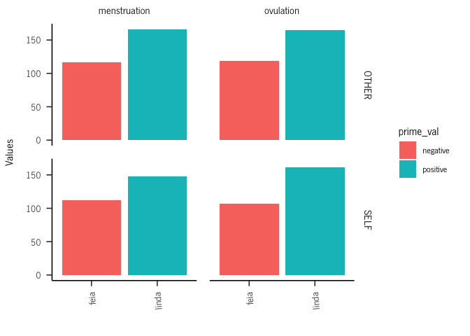
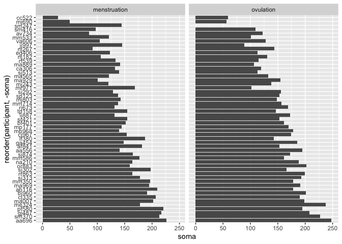
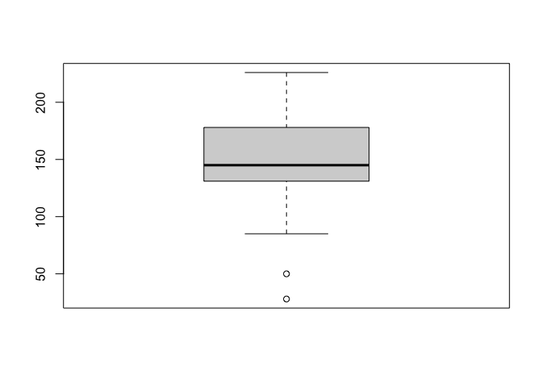
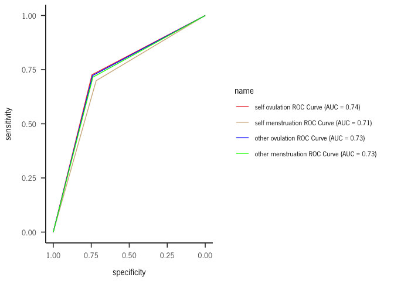
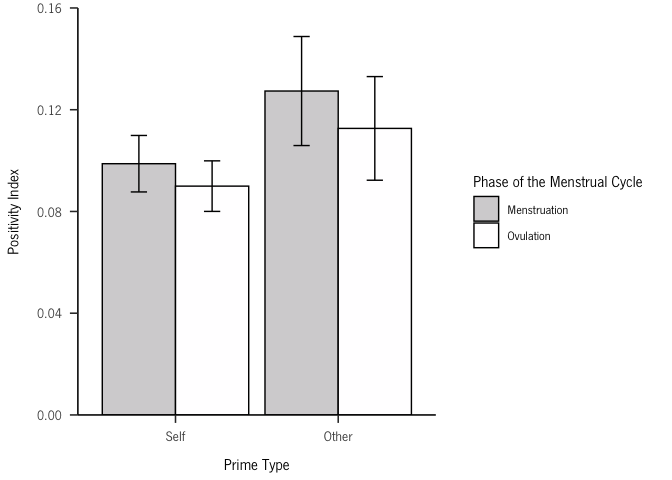
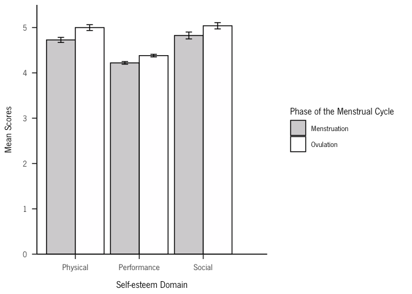
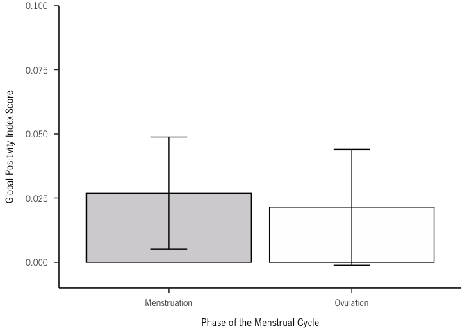
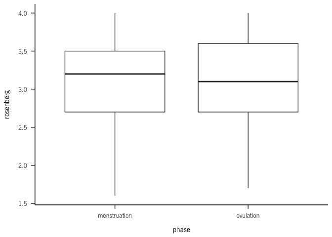

Self-esteem across the menstrual cycle
================
2023

``` r
library(readxl)
library(dplyr)
```

    ## 
    ## Attaching package: 'dplyr'

    ## The following objects are masked from 'package:stats':
    ## 
    ##     filter, lag

    ## The following objects are masked from 'package:base':
    ## 
    ##     intersect, setdiff, setequal, union

``` r
library(ggplot2)
```

    ## Warning: package 'ggplot2' was built under R version 4.2.2

``` r
library("plotrix")
library(sjPlot)
```

    ## Warning: package 'sjPlot' was built under R version 4.2.3

    ## Install package "strengejacke" from GitHub (`devtools::install_github("strengejacke/strengejacke")`) to load all sj-packages at once!

``` r
brutos = data$`Dados_brutos (3)`
head(brutos)
```

    ##   participant LINE BLOCO        rt correct condition PRIME_VAL PRIME_TYPE
    ## 1       AA556    0     1 0.4174751       0         2  positive      OTHER
    ## 2       AA556    1     1 0.1681083       1         2  positive      OTHER
    ## 3       AA556    2     1 0.5012267       0         2  negative      OTHER
    ## 4       AA556    3     1 0.4864544       1         2  negative      OTHER
    ## 5       AA556    4     1 0.4847672       0         2  negative      OTHER
    ## 6       AA556    5     1 0.5007748       1         2  positive      OTHER
    ##        PICTURE TARGET        PHASE
    ## 1    VPN07.jpg  linda menstruation
    ## 2    VPN09.jpg  capaz menstruation
    ## 3    VPN07.jpg inútil menstruation
    ## 4    VPN04.jpg   feia menstruation
    ## 5    VPN02.jpg triste menstruation
    ## 6 femcon_2.jpg genial menstruation

\#parse target

``` r
for (i in 1:nrow(brutos)){
  if(substr(brutos$TARGET[i],nchar(brutos$TARGET[i])-2,nchar(brutos$TARGET[i])) == "til"){
    brutos$TARGET[i] = "inútil"  
  }
}
```

\#check

``` r
brutos %>%
  mutate(new = case_when(TARGET == "alegre" ~ "positive",
                         TARGET =="capaz" ~ "positive",
                         TARGET == "confiante" ~ "positive",
                         TARGET == "genial" ~ "positive",
                         TARGET == "linda" ~ "positive"
                                ,TRUE ~ 'negative'
                                )) %>% pull(new) -> new

a = new == brutos$PRIME_VAL 
soma = sum(a, na.rm = TRUE) # best way to count TRUE values
soma == length(a)
```

    ## [1] TRUE

\#check participant’s id

``` r
summary(factor(brutos$participant))
```

    ## AA556 AA696 ab116 AF841 av734 BF401 BJ960 CA306 CC522 CJ335 cj967 CJ967 EG406 
    ##   452   513   446   526   285   491   508   359   101   479   242   261   520 
    ## GA454 GJ487 IJ887 JJ997 Lf380 LF380 MA007 MA565 ma889 MA889 MA929 MA969 mb968 
    ##   458   492   433   385   224   207   511   328   145   175   312   472   444 
    ## ME324 mj243 MJ690 MJ803 MM350 MM533 MM586 MM714 MP177 MR971 NA210 nj182 NJ182 
    ##   471   436   137   412   425   363   459   437   536   331   481   166   146 
    ## nj267 NJ267 OR883 PF580 rf539 RF539 RJ673 RR863 SJ292 SJ302 sj313 SJ313 SJ513 
    ##   209   160   489   505   228   278   441   461   364   451   269   272   444 
    ## SJ874 sm247 sm370 sm416 SM416 SP123 SR421 tp158 TP158 VA606 
    ##   480   411   473   144   169   424   380   226   239   315

``` r
#to lower case all cols
names(brutos) <- tolower(names(brutos))

brutos$participant = tolower(brutos$participant)

#brutos %>% group_by(participant) %>% count()
```

``` r
library(extrafont)
```

    ## Warning: package 'extrafont' was built under R version 4.2.2

    ## Registering fonts with R

``` r
#font_import("C:/Users/nunok/AppData/Local/Microsoft/Windows/Fonts")

#loadfonts()
#available_fonts <- windowsFonts()
#print(available_fonts)
```

#### Apa theme

``` r
#apa
theme_apa <- function(base_size = 12, base_family = "NewsGotT", box = FALSE) {
  adapted_theme <- ggplot2::theme_bw(base_size, base_family) +
    ggplot2::theme(
      plot.title = ggplot2::element_text(size = ggplot2::rel(1.1), margin = ggplot2::margin(0, 0, ggplot2::rel(14), 0), hjust = 0.5)
      , plot.subtitle = ggplot2::element_text(size = ggplot2::rel(0.8), margin = ggplot2::margin(ggplot2::rel(-7), 0, ggplot2::rel(14), 0), hjust = 0.5)

      # , axis.title = ggplot2::element_text(size = ggplot2::rel(1.1))
      , axis.title.x = ggplot2::element_text(size = ggplot2::rel(1), lineheight = ggplot2::rel(1.1), margin = ggplot2::margin(ggplot2::rel(12), 0, 0, 0))
      , axis.title.x.top = ggplot2::element_text(size = ggplot2::rel(1), lineheight = ggplot2::rel(1.1), margin = ggplot2::margin(0, 0, ggplot2::rel(12), 0))
      , axis.title.y = ggplot2::element_text(size = ggplot2::rel(1), lineheight = ggplot2::rel(1.1), margin = ggplot2::margin(0, ggplot2::rel(12), 0, 0))
      , axis.title.y.right = ggplot2::element_text(size = ggplot2::rel(1), lineheight = ggplot2::rel(1.1), margin = ggplot2::margin(0, 0, 0, ggplot2::rel(12)))
      , axis.ticks.length = ggplot2::unit(ggplot2::rel(6), "points")
      , axis.text = ggplot2::element_text(size = ggplot2::rel(0.9))
      , axis.text.x = ggplot2::element_text(size = ggplot2::rel(1), margin = ggplot2::margin(ggplot2::rel(6), 0, 0, 0))
      , axis.text.y = ggplot2::element_text(size = ggplot2::rel(1), margin = ggplot2::margin(0, ggplot2::rel(6), 0, 0))
      , axis.text.y.right = ggplot2::element_text(size = ggplot2::rel(1), margin = ggplot2::margin(0, 0, 0, ggplot2::rel(6)))
      , axis.line = ggplot2::element_line()
      # , axis.line.x = ggplot2::element_line()
      # , axis.line.y = ggplot2::element_line()

      , legend.title = ggplot2::element_text()
      , legend.key = ggplot2::element_rect(fill = NA, color = NA)
      , legend.key.width = ggplot2::unit(ggplot2::rel(20), "points")
      , legend.key.height = ggplot2::unit(ggplot2::rel(20), "points")
      , legend.margin = ggplot2::margin(
        t = ggplot2::rel(16)
        , r = ggplot2::rel(16)
        , b = ggplot2::rel(16)
        , l = ggplot2::rel(16)
        , unit = "points"
      )

      , panel.spacing = ggplot2::unit(ggplot2::rel(14), "points")
      , panel.grid.major.x = ggplot2::element_blank()
      , panel.grid.minor.x = ggplot2::element_blank()
      , panel.grid.major.y = ggplot2::element_blank()
      , panel.grid.minor.y = ggplot2::element_blank()

      , strip.background = ggplot2::element_rect(fill = NA, color = NA)
      , strip.text.x = ggplot2::element_text(size = ggplot2::rel(1.2), margin = ggplot2::margin(0, 0, ggplot2::rel(10), 0))
      , strip.text.y = ggplot2::element_text(size = ggplot2::rel(1.2), margin = ggplot2::margin(0, 0, 0, ggplot2::rel(10)))
    )

  if(box) {
    adapted_theme <- adapted_theme + ggplot2::theme(panel.border = ggplot2::element_rect(color = "black"))
  } else {
    adapted_theme <- adapted_theme + ggplot2::theme(panel.border = ggplot2::element_blank())
  }

  adapted_theme
}
```

``` r
plot = ggplot(data = brutos, aes(x = prime_type, y = rt, fill = interaction(correct,prime_type))) + geom_boxplot() + facet_wrap(~phase) + theme_apa()

plot
```

<!-- -->

``` r
brutos2 = brutos %>% group_by(phase, prime_type, prime_val,target) %>% summarise(soma = sum(correct)) 
```

    ## `summarise()` has grouped output by 'phase', 'prime_type', 'prime_val'. You can
    ## override using the `.groups` argument.

``` r
for (i in 1:nrow(brutos2)){
  if(brutos2$prime_type[i] == "OTHER"){
    brutos2$soma[i] = brutos2$soma[i]/5
  }
}

brutos2
```

    ## # A tibble: 40 × 5
    ## # Groups:   phase, prime_type, prime_val [8]
    ##    phase        prime_type prime_val target     soma
    ##    <chr>        <chr>      <chr>     <chr>     <dbl>
    ##  1 menstruation OTHER      negative  falhada    116.
    ##  2 menstruation OTHER      negative  feia       117.
    ##  3 menstruation OTHER      negative  insegura   121.
    ##  4 menstruation OTHER      negative  inútil     132 
    ##  5 menstruation OTHER      negative  triste     123.
    ##  6 menstruation OTHER      positive  alegre     150.
    ##  7 menstruation OTHER      positive  capaz      138.
    ##  8 menstruation OTHER      positive  confiante  141.
    ##  9 menstruation OTHER      positive  genial     134 
    ## 10 menstruation OTHER      positive  linda      166 
    ## # … with 30 more rows

``` r
brutos2%>% 
  ggplot(aes(x = target, y = soma, fill = prime_val)) +
    geom_bar(position="dodge",stat = "identity")+
    #scale_fill_manual(values = c ('royalblue1', 'grey2', 'yellow1'))+
    ylab("Values")+
    xlab("")+
    facet_grid(prime_type ~ phase) + theme_apa()+
  theme(axis.text.x = element_text(angle = 95, vjust = 0.5,hjust = 1)) -> plot

plot
```

<!-- -->
\#filter by beautiful and ugly

``` r
brutos2 %>% subset(target %in% c("linda","feia")) %>% 
  ggplot(aes(x = target, y = soma, fill = prime_val)) +
    geom_bar(position="dodge",stat = "identity")+
    #scale_fill_manual(values = c ('royalblue1', 'grey2', 'yellow1'))+
    ylab("Values")+
    xlab("")+
    facet_grid(prime_type ~ phase) + theme_apa()+
  theme(axis.text.x = element_text(angle = 95, vjust = 0.5,hjust = 1)) 
```

<!-- -->

``` r
brutos2 %>%  group_by(phase,prime_type, prime_val) %>% summarise(soma = mean(soma)) %>% 
  ggplot(aes(x = prime_val, y = soma)) +
    geom_bar(position="dodge",stat = "identity")+
    #scale_fill_manual(values = c ('royalblue1', 'grey2', 'yellow1'))+
    ylab("Values")+
    xlab("")+
    facet_grid(prime_type ~ phase) + theme_apa()+
  theme(axis.text.x = element_text(angle = 95, vjust = 0.5,hjust = 1)) 
```

    ## `summarise()` has grouped output by 'phase', 'prime_type'. You can override
    ## using the `.groups` argument.

<!-- -->

``` r
#brutos = brutos %>% subset(target %in% c("linda","feia")) 
```

``` r
brutos %>% group_by(participant, phase) %>% summarise(soma = sum(correct)) %>% arrange(desc(soma)) ->grafico
```

    ## `summarise()` has grouped output by 'participant'. You can override using the
    ## `.groups` argument.

``` r
#brutos %>% filter(participant == "sm247" & phase == "ovulation")
```

``` r
ggplot(grafico, aes(x = reorder(participant, -soma), y = soma)) + geom_bar(position="dodge",stat = "identity") +  coord_flip()+ facet_wrap(~phase) #+ geom_hline(yintercept=, linetype="dashed", 
```

<!-- -->

``` r
      #          color = "red", size=2)
```

``` r
IQR(grafico$soma)
```

    ## [1] 54.75

``` r
ovulation = subset(grafico, phase == "ovulation")
IQR(ovulation$soma)
```

    ## [1] 60

``` r
#ovulation

ovulation = subset(ovulation, participant!="sm247")

boxplot(ovulation$soma)
```

<!-- -->

``` r
menstruation = subset(grafico, phase == "menstruation")
IQR(menstruation$soma)
```

    ## [1] 47

``` r
#menstruation$soma
```

``` r
menstruation = subset(grafico, phase  == "menstruation")
tail(menstruation$soma)
```

    ## [1] 101  97  91  85  50  28

``` r
tail(menstruation$participant,2)
```

    ## [1] "mj690" "cc522"

``` r
boxplot(menstruation$soma)
```

<!-- -->

``` r
#brutos %>% group_by(participant, phase) %>% tally() %>% arrange(n)
```

``` r
#brutos %>% group_by(participant, phase) %>% summarise_at(vars(rt), funs(rt_mean = mean(., na.rm = T))) %>% arrange(desc(rt_mean))
```

\#remove participants mj690 & cc522 *few responses *few corrects \*high
rt

``` r
brutos = brutos %>% subset(!(participant %in% c("mj690","cc522","sm247")))
```

\#ROC-CURVE

``` r
head(brutos)
```

    ##   participant line bloco        rt correct condition prime_val prime_type
    ## 1       aa556    0     1 0.4174751       0         2  positive      OTHER
    ## 2       aa556    1     1 0.1681083       1         2  positive      OTHER
    ## 3       aa556    2     1 0.5012267       0         2  negative      OTHER
    ## 4       aa556    3     1 0.4864544       1         2  negative      OTHER
    ## 5       aa556    4     1 0.4847672       0         2  negative      OTHER
    ## 6       aa556    5     1 0.5007748       1         2  positive      OTHER
    ##        picture target        phase
    ## 1    VPN07.jpg  linda menstruation
    ## 2    VPN09.jpg  capaz menstruation
    ## 3    VPN07.jpg inútil menstruation
    ## 4    VPN04.jpg   feia menstruation
    ## 5    VPN02.jpg triste menstruation
    ## 6 femcon_2.jpg genial menstruation

``` r
response = c()
for (i in 1:nrow(brutos)){
  if (brutos$prime_val[i] == "positive"){
    if (brutos$correct[i] == 1){
      response = c(response, 1)
    }
    else{
      response = c(response,0)
    }
  }
  else{
    if(brutos$correct[i] == 1){
      response = c(response,0)
    }
    else{
      response = c(response,1)
    }
    
  }
}

expected = response

library(caTools)

library(pROC)
```

    ## Type 'citation("pROC")' for a citation.

    ## 
    ## Attaching package: 'pROC'

    ## The following objects are masked from 'package:stats':
    ## 
    ##     cov, smooth, var

``` r
response = c()
for (i in 1:nrow(brutos)){
  if(brutos$prime_val[i]=="positive"){
    response = c(response,1)
  }
  else{
    response = c(response,0)
  }
}


test_roc = roc(expected ~ response, plot = TRUE, print.auc = TRUE)
```

    ## Setting levels: control = 0, case = 1

    ## Setting direction: controls < cases

<!-- -->

``` r
roc_df = data.frame(brutos$phase,brutos$prime_type,expected,response)


self_ovulation_df = roc_df %>% subset(brutos.phase == "ovulation" & brutos.prime_type=="SELF")
self_menstruation_df = roc_df %>% subset(brutos.phase == "menstruation" & brutos.prime_type=="SELF")

other_ovulation_df = roc_df %>% subset(brutos.phase == "ovulation" & brutos.prime_type=="OTHER")
other_menstruation_df = roc_df %>% subset(brutos.phase == "menstruation" & brutos.prime_type=="OTHER")


# create ROC curves for each condition
roc1 <- roc(self_ovulation_df$expected,self_ovulation_df$response)
```

    ## Setting levels: control = 0, case = 1
    ## Setting direction: controls < cases

``` r
roc2 <- roc(self_menstruation_df$expected,self_menstruation_df$response)
```

    ## Setting levels: control = 0, case = 1
    ## Setting direction: controls < cases

``` r
roc3 = roc(other_ovulation_df$expected,other_ovulation_df$response)
```

    ## Setting levels: control = 0, case = 1
    ## Setting direction: controls < cases

``` r
roc4 = roc(other_menstruation_df$expected,other_menstruation_df$response)
```

    ## Setting levels: control = 0, case = 1
    ## Setting direction: controls < cases

``` r
ggroc(list(self_ovulation = roc1, self_menstruation = roc2, other_ovulation = roc3, other_menstruation = roc4 )) +
   scale_color_manual(values = c("self_ovulation"="brown2","self_menstruation" = "Tan","other_ovulation" = "blue","other_menstruation" ="green"),
                      labels = c(paste0("self ovulation ",'ROC Curve ', '(AUC = ', .74, ')')
                                 ,paste0("self menstruation ",'ROC Curve ', '(AUC = ',.71, ')')
                                 ,paste0("other ovulation ",'ROC Curve ', '(AUC = ', .73, ')')
                                 ,paste0("other menstruation ",'ROC Curve ', '(AUC = ', .73, ')'))) + theme_apa()
```

<!-- -->

\#missing responses-add to dataframe

``` r
codes = c("ma889","ma929","mr971","na210","nj267","va606")

p1=list("ma889",0,1,0.42,0,1,"negative","SELF","x","x","menstruation")
p2=list("ma929",0,4,0.42,0,2,"negative","SELF","x","x","menstruation")
p3=list("mr971",0,4,0.42,0,2,"negative","SELF","x","x","ovulation")
p4=list("na210",0,2,0.42,0,2,"positive","SELF","x","x","menstruation")
p5=list("nj267",0,3,0.42,0,1,"negative","SELF","x","x","menstruation")
p6=list("va606",0,1,0.42,0,1,"positive","SELF","x","x","menstruation")

nested = list(p1,p2,p3,p4,p5,p6)
df_nested <-  as.data.frame(do.call(rbind, nested))

colnames(df_nested) = colnames(brutos)

library(tidyr)
unnested = df_nested %>% unnest(colnames(df_nested))
unnested = data.frame(unnested)
colnames(unnested) = colnames(brutos)

brutos = rbind(brutos,unnested)
```

# POSITIVITY INDEX - SELF

``` r
brutos %>% group_by(participant,phase,bloco, prime_val, prime_type) %>% summarise(soma = sum(correct)) -> df
```

    ## `summarise()` has grouped output by 'participant', 'phase', 'bloco',
    ## 'prime_val'. You can override using the `.groups` argument.

``` r
taxa = c()
x = 25
y = 5
  
for (i in 1:nrow(df)){
  if(df$prime_type[i] == "OTHER"){
    taxa = c(taxa,(df$soma[i]/x))
  } 
  else{
    taxa = c(taxa,(df$soma[i]/y))
  }
}

df$taxa = taxa
```

``` r
index = c()
bloco = 1
counter = 1

for(i in 1:(nrow(df)-2)){
  if (df$bloco[i+2] == bloco & counter < 3){
    index = c(index,df$taxa[i]-df$taxa[i+2])
  }
  else {
    bloco = df$bloco[i+2]
  }
  if (counter == 4){
    counter = 0
  }
  counter = counter+1
}
```

\#create dataframe

``` r
participants = levels(factor(df$participant))
participants = rep(participants, each = 20)


phase = rep(c("menstruation","ovulation"), each = 10, times = 10)

bloco = rep(c(1,2,3,4,5),each = 2,times = 100)

condition = rep(c("OTHER","SELF"),times = 500)

colunas = c("participant","phase","bloco","condition","index")

df_index = data.frame(participants,phase,bloco,condition, index) 
colnames(df_index) = colunas
```

\#remove spanish participant

``` r
df_index %>% subset(!(participant %in% c("sp123"))) -> df_index
```

``` r
df_index %>% group_by(phase,condition) %>% summarise_at(vars(index), funs(rt_mean = mean(., na.rm = T))) 
```

    ## Warning: `funs()` was deprecated in dplyr 0.8.0.
    ## ℹ Please use a list of either functions or lambdas:
    ## 
    ## # Simple named list: list(mean = mean, median = median)
    ## 
    ## # Auto named with `tibble::lst()`: tibble::lst(mean, median)
    ## 
    ## # Using lambdas list(~ mean(., trim = .2), ~ median(., na.rm = TRUE))

    ## # A tibble: 4 × 3
    ## # Groups:   phase [2]
    ##   phase        condition rt_mean
    ##   <chr>        <chr>       <dbl>
    ## 1 menstruation OTHER     -0.0988
    ## 2 menstruation SELF      -0.127 
    ## 3 ovulation    OTHER     -0.0900
    ## 4 ovulation    SELF      -0.113

\#symmetric index

``` r
df_index$index = -df_index$index
```

``` r
ggplot(data = df_index, aes(x = condition, y = index, color = phase)) + geom_boxplot() + theme_apa()
```

<!-- -->

``` r
df_index %>% group_by(participant,condition, phase) %>% summarise_at(vars(index), funs(rt_mean = mean(., na.rm = T))) %>% arrange(rt_mean) 
```

    ## # A tibble: 196 × 4
    ## # Groups:   participant, condition [98]
    ##    participant condition phase        rt_mean
    ##    <chr>       <chr>     <chr>          <dbl>
    ##  1 mr971       OTHER     menstruation  -0.416
    ##  2 sj302       SELF      menstruation  -0.28 
    ##  3 sm370       SELF      ovulation     -0.28 
    ##  4 bj960       SELF      ovulation     -0.16 
    ##  5 bj960       SELF      menstruation  -0.16 
    ##  6 mb968       SELF      ovulation     -0.16 
    ##  7 nj182       SELF      menstruation  -0.16 
    ##  8 or883       SELF      ovulation     -0.12 
    ##  9 mp177       SELF      ovulation     -0.12 
    ## 10 sm370       SELF      menstruation  -0.12 
    ## # … with 186 more rows

``` r
#head(df,20)
```

``` r
#df_index %>% group_by(participant,phase,condition) %>% summarise_at(vars(index), funs(rt_mean = mean(., na.rm = T))) %>% arrange(rt_mean)
```

\#remove outlier

``` r
#df_index = df_index %>% subset(participant!= "sp123" & participant!="sm247" & participant!= "mj690" & participant!="cc522")

#df_index = df_index %>% subset(participant!="ij887" & participant != "mr971")  
#df_index = df_index %>% subset(participant != "mr971")  
```

``` r
hist(df_index$index)
```

<!-- -->

``` r
df_index %>% group_by(phase,condition) %>% summarise_at(vars(index), funs(index = mean(., na.rm = T)))-> df_index2 
df_index %>% group_by(phase,condition) %>% summarise_at(vars(index), funs(se = std.error(., na.rm = T))) %>% pull(se) ->se

df_index2$se = se

my_color <- rgb(213,211, 213, maxColorValue = 255)
my_color2 <- rgb(255,254, 255, maxColorValue = 255)

# Create bar plot with error bars
ggplot(df_index2, aes(x = condition, y = index, fill = phase)) +
  geom_bar(stat = "identity",position = position_dodge(0.9),color = "black") +   scale_fill_manual(values = c(my_color, my_color2),labels=c('Menstruation', 'Ovulation')) +
  geom_errorbar(aes(ymin = index - se, ymax = index + se), width = 0.2,position = position_dodge(0.9)) + theme_apa() + xlab("Prime Type") + ylab("Positivity Index") +
scale_x_discrete(labels = c("Self","Other")) + labs(fill = "Phase of the Menstrual Cycle") 
```

<!-- -->

``` r
df_index %>% group_by(participant,phase,condition) %>% summarise_at(vars(index), funs(index = mean(., na.rm = T))) %>% ggplot(aes(x = condition, y = index, color = phase)) + geom_boxplot() +theme_apa()
```

<!-- -->

``` r
library(lme4)
```

    ## Loading required package: Matrix

    ## Warning: package 'Matrix' was built under R version 4.2.2

    ## 
    ## Attaching package: 'Matrix'

    ## The following objects are masked from 'package:tidyr':
    ## 
    ##     expand, pack, unpack

    ## 
    ## Attaching package: 'lme4'

    ## The following object is masked from 'package:rio':
    ## 
    ##     factorize

``` r
library(afex)
```

    ## Warning: package 'afex' was built under R version 4.2.2

    ## ************
    ## Welcome to afex. For support visit: http://afex.singmann.science/

    ## - Functions for ANOVAs: aov_car(), aov_ez(), and aov_4()
    ## - Methods for calculating p-values with mixed(): 'S', 'KR', 'LRT', and 'PB'
    ## - 'afex_aov' and 'mixed' objects can be passed to emmeans() for follow-up tests
    ## - NEWS: emmeans() for ANOVA models now uses model = 'multivariate' as default.
    ## - Get and set global package options with: afex_options()
    ## - Set orthogonal sum-to-zero contrasts globally: set_sum_contrasts()
    ## - For example analyses see: browseVignettes("afex")
    ## ************

    ## 
    ## Attaching package: 'afex'

    ## The following object is masked from 'package:lme4':
    ## 
    ##     lmer

``` r
df_index$participant = factor(df_index$participant)
df_index$phase = factor(df_index$phase)
df_index$bloco = factor(df_index$bloco)
df_index$condition = factor(df_index$condition)
```

### check contrabalanceamento

``` r
contrabalanceamento = read.csv("contrabalanceamento.csv")
```

``` r
#to lower case all cols
names(contrabalanceamento) <- tolower(names(contrabalanceamento))

contrabalanceamento$participant = tolower(contrabalanceamento$participant)
```

\#left-join

``` r
df_index = df_index %>% left_join(contrabalanceamento)
```

    ## Joining, by = "participant"

``` r
#model = lmer(index~condition*phase + tecla + contrabalanceamento+fase_start +(1|participant), df_index) 

#tab_model(model)
```

# REPORT MAIN MODEL IMPLICIT

``` r
model = lmer(index~condition*phase +(1|participant), df_index)

tab_model(model)
```

<table style="border-collapse:collapse; border:none;">
<tr>
<th style="border-top: double; text-align:center; font-style:normal; font-weight:bold; padding:0.2cm;  text-align:left; ">
 
</th>
<th colspan="3" style="border-top: double; text-align:center; font-style:normal; font-weight:bold; padding:0.2cm; ">
index
</th>
</tr>
<tr>
<td style=" text-align:center; border-bottom:1px solid; font-style:italic; font-weight:normal;  text-align:left; ">
Predictors
</td>
<td style=" text-align:center; border-bottom:1px solid; font-style:italic; font-weight:normal;  ">
Estimates
</td>
<td style=" text-align:center; border-bottom:1px solid; font-style:italic; font-weight:normal;  ">
CI
</td>
<td style=" text-align:center; border-bottom:1px solid; font-style:italic; font-weight:normal;  ">
p
</td>
</tr>
<tr>
<td style=" padding:0.2cm; text-align:left; vertical-align:top; text-align:left; ">
(Intercept)
</td>
<td style=" padding:0.2cm; text-align:left; vertical-align:top; text-align:center;  ">
0.10
</td>
<td style=" padding:0.2cm; text-align:left; vertical-align:top; text-align:center;  ">
0.06 – 0.14
</td>
<td style=" padding:0.2cm; text-align:left; vertical-align:top; text-align:center;  ">
<strong>\<0.001</strong>
</td>
</tr>
<tr>
<td style=" padding:0.2cm; text-align:left; vertical-align:top; text-align:left; ">
condition \[SELF\]
</td>
<td style=" padding:0.2cm; text-align:left; vertical-align:top; text-align:center;  ">
0.03
</td>
<td style=" padding:0.2cm; text-align:left; vertical-align:top; text-align:center;  ">
-0.02 – 0.07
</td>
<td style=" padding:0.2cm; text-align:left; vertical-align:top; text-align:center;  ">
0.204
</td>
</tr>
<tr>
<td style=" padding:0.2cm; text-align:left; vertical-align:top; text-align:left; ">
phase \[ovulation\]
</td>
<td style=" padding:0.2cm; text-align:left; vertical-align:top; text-align:center;  ">
-0.01
</td>
<td style=" padding:0.2cm; text-align:left; vertical-align:top; text-align:center;  ">
-0.05 – 0.04
</td>
<td style=" padding:0.2cm; text-align:left; vertical-align:top; text-align:center;  ">
0.695
</td>
</tr>
<tr>
<td style=" padding:0.2cm; text-align:left; vertical-align:top; text-align:left; ">
condition \[SELF\] × phase<br>\[ovulation\]
</td>
<td style=" padding:0.2cm; text-align:left; vertical-align:top; text-align:center;  ">
-0.01
</td>
<td style=" padding:0.2cm; text-align:left; vertical-align:top; text-align:center;  ">
-0.07 – 0.06
</td>
<td style=" padding:0.2cm; text-align:left; vertical-align:top; text-align:center;  ">
0.853
</td>
</tr>
<tr>
<td colspan="4" style="font-weight:bold; text-align:left; padding-top:.8em;">
Random Effects
</td>
</tr>
<tr>
<td style=" padding:0.2cm; text-align:left; vertical-align:top; text-align:left; padding-top:0.1cm; padding-bottom:0.1cm;">
σ<sup>2</sup>
</td>
<td style=" padding:0.2cm; text-align:left; vertical-align:top; padding-top:0.1cm; padding-bottom:0.1cm; text-align:left;" colspan="3">
0.06
</td>
</tr>
<tr>
<td style=" padding:0.2cm; text-align:left; vertical-align:top; text-align:left; padding-top:0.1cm; padding-bottom:0.1cm;">
τ<sub>00</sub> <sub>participant</sub>
</td>
<td style=" padding:0.2cm; text-align:left; vertical-align:top; padding-top:0.1cm; padding-bottom:0.1cm; text-align:left;" colspan="3">
0.01
</td>
<tr>
<td style=" padding:0.2cm; text-align:left; vertical-align:top; text-align:left; padding-top:0.1cm; padding-bottom:0.1cm;">
ICC
</td>
<td style=" padding:0.2cm; text-align:left; vertical-align:top; padding-top:0.1cm; padding-bottom:0.1cm; text-align:left;" colspan="3">
0.08
</td>
<tr>
<td style=" padding:0.2cm; text-align:left; vertical-align:top; text-align:left; padding-top:0.1cm; padding-bottom:0.1cm;">
N <sub>participant</sub>
</td>
<td style=" padding:0.2cm; text-align:left; vertical-align:top; padding-top:0.1cm; padding-bottom:0.1cm; text-align:left;" colspan="3">
49
</td>
<tr>
<td style=" padding:0.2cm; text-align:left; vertical-align:top; text-align:left; padding-top:0.1cm; padding-bottom:0.1cm; border-top:1px solid;">
Observations
</td>
<td style=" padding:0.2cm; text-align:left; vertical-align:top; padding-top:0.1cm; padding-bottom:0.1cm; text-align:left; border-top:1px solid;" colspan="3">
980
</td>
</tr>
<tr>
<td style=" padding:0.2cm; text-align:left; vertical-align:top; text-align:left; padding-top:0.1cm; padding-bottom:0.1cm;">
Marginal R<sup>2</sup> / Conditional R<sup>2</sup>
</td>
<td style=" padding:0.2cm; text-align:left; vertical-align:top; padding-top:0.1cm; padding-bottom:0.1cm; text-align:left;" colspan="3">
0.003 / 0.084
</td>
</tr>
</table>

``` r
summary(model)
```

    ## Linear mixed model fit by REML. t-tests use Satterthwaite's method [
    ## lmerModLmerTest]
    ## Formula: index ~ condition * phase + (1 | participant)
    ##    Data: df_index
    ## 
    ## REML criterion at convergence: 123.4
    ## 
    ## Scaled residuals: 
    ##     Min      1Q  Median      3Q     Max 
    ## -3.5607 -0.5811  0.0179  0.5665  3.5677 
    ## 
    ## Random effects:
    ##  Groups      Name        Variance Std.Dev.
    ##  participant (Intercept) 0.005465 0.07392 
    ##  Residual                0.061786 0.24857 
    ## Number of obs: 980, groups:  participant, 49
    ## 
    ## Fixed effects:
    ##                                Estimate Std. Error         df t value Pr(>|t|)
    ## (Intercept)                    0.098776   0.019071 196.431791   5.179  5.5e-07
    ## conditionSELF                  0.028571   0.022458 928.000000   1.272    0.204
    ## phaseovulation                -0.008816   0.022458 928.000000  -0.393    0.695
    ## conditionSELF:phaseovulation  -0.005878   0.031761 928.000000  -0.185    0.853
    ##                                 
    ## (Intercept)                  ***
    ## conditionSELF                   
    ## phaseovulation                  
    ## conditionSELF:phaseovulation    
    ## ---
    ## Signif. codes:  0 '***' 0.001 '**' 0.01 '*' 0.05 '.' 0.1 ' ' 1
    ## 
    ## Correlation of Fixed Effects:
    ##             (Intr) cnSELF phsvlt
    ## conditnSELF -0.589              
    ## phaseovultn -0.589  0.500       
    ## cndtnSELF:p  0.416 -0.707 -0.707

``` r
library(report)
```

    ## Warning: package 'report' was built under R version 4.2.3

``` r
report(model)
```

    ## We fitted a linear mixed model (estimated using REML and nloptwrap optimizer)
    ## to predict index with condition and phase (formula: index ~ condition * phase).
    ## The model included participant as random effect (formula: ~1 | participant).
    ## The model's total explanatory power is weak (conditional R2 = 0.08) and the
    ## part related to the fixed effects alone (marginal R2) is of 2.98e-03. The
    ## model's intercept, corresponding to condition = OTHER and phase = menstruation,
    ## is at 0.10 (95% CI [0.06, 0.14], t(974) = 5.18, p < .001). Within this model:
    ## 
    ##   - The effect of condition [SELF] is statistically non-significant and positive
    ## (beta = 0.03, 95% CI [-0.02, 0.07], t(974) = 1.27, p = 0.204; Std. beta = 0.11,
    ## 95% CI [-0.06, 0.28])
    ##   - The effect of phase [ovulation] is statistically non-significant and negative
    ## (beta = -8.82e-03, 95% CI [-0.05, 0.04], t(974) = -0.39, p = 0.695; Std. beta =
    ## -0.03, 95% CI [-0.20, 0.14])
    ##   - The effect of condition [SELF] × phase [ovulation] is statistically
    ## non-significant and negative (beta = -5.88e-03, 95% CI [-0.07, 0.06], t(974) =
    ## -0.19, p = 0.853; Std. beta = -0.02, 95% CI [-0.26, 0.22])
    ## 
    ## Standardized parameters were obtained by fitting the model on a standardized
    ## version of the dataset. 95% Confidence Intervals (CIs) and p-values were
    ## computed using a Wald t-distribution approximation.

``` r
library(emmeans)
#noise <- emmeans(model,~condition*phase)


#x = contrast(noise, "pairwise", simple = "each", combine = TRUE, adjust="bonf")
#x
```

### ESCALAS

``` r
rosenberg = data$Rosenberg

#rosenberg %>% subset(!(CODE %in% c("sp123"))) -> rosenberg
hp = data$HP
```

``` r
rosenberg %>% dplyr::select(CODE,M_Ros_F1,M_Ros_F2) ->rosenberg
hp %>% dplyr::select(CODE, M_HP_P_1,M_HP_P_2,M_HP_S_1,M_HP_S_2,M_HP_A_1,M_HP_A_2)->hp
```

``` r
head(hp)
```

    ##    CODE M_HP_P_1 M_HP_P_2 M_HP_S_1 M_HP_S_2 M_HP_A_1 M_HP_A_2
    ## 1 MJ960 4.000000 4.428571      5.0      3.2      3.8      3.6
    ## 2 ms416 4.142857 2.571429      4.6      3.2      5.4      5.4
    ## 3 SP513 4.000000 4.857143      5.8      6.2      6.6      5.6
    ## 4 MJ714 4.714286 4.142857      5.6      3.6      4.4      4.4
    ## 5 fb968 4.428571 4.428571      7.0      7.0      5.0      5.2
    ## 6 MA969 2.714286 3.714286      5.4      5.2      2.2      3.8

``` r
library(reshape2)
```

    ## 
    ## Attaching package: 'reshape2'

    ## The following object is masked from 'package:tidyr':
    ## 
    ##     smiths

``` r
# Melt the data frame to long format using two conditions
hp = hp %>%
  pivot_longer(cols = starts_with("M_HP_"), 
               names_to = c("condition", "phase"), 
               names_pattern = c("(M_HP_[PSA]_)([12])")) 

colnames(hp)[1] = "participant"

hp$participant = tolower(hp$participant)

hp <- hp %>%
  mutate(phase = if_else(phase == "1", "ovulation", "menstruation"))
```

\#rename participants’ codes

``` r
hp %>%
  mutate(participant = case_when(participant == "av116"~"ab116",
                         participant == "mj960"~"bj960",
                         participant ==  "sp513"~"sj513",
                         participant ==  "mj714"~"mm714",
                         participant == "ms416"~"sm416" ,
                         participant == "af8411"~ "af841",
                         participant == "fb968" ~"mb968",
                         participant == "rj073" ~"rj673",
                        TRUE ~ participant
                                ))-> hp
```

\#right join

``` r
length(levels(factor(df_index$participant)))
```

    ## [1] 49

``` r
df_merged <- df_index %>%
  right_join(hp, by = c("participant","phase"))

df_merged %>%
  mutate(condition.y = case_when(condition.y == "M_HP_P_"~"Performance",
                         condition.y == "M_HP_S_"~"Social",
                         condition.y ==  "M_HP_A_"~"Attractiveness"
                                ))-> df_merged

df_merged$participant = factor(df_merged$participant)

#remove sp123 -- spanish
df_merged = subset(df_merged, participant!="sp123")
```

``` r
ggplot(data = df_merged, aes(x = condition.y, y = value, color = phase)) + geom_boxplot() + theme_apa()
```

<!-- -->

``` r
df_merged %>% group_by(phase,condition.y) %>% summarise_at(vars(value), funs(value = mean(., na.rm = T)))-> df_merged2 

df_merged %>% group_by(phase,condition.y) %>% summarise_at(vars(value), funs(se = std.error(., na.rm = T))) %>% pull(se) ->se

df_merged2$se = se

# Create the color using RGB values
my_color <- rgb(213,211, 213, maxColorValue = 255)
my_color2 <- rgb(255,254, 255, maxColorValue = 255)

# Create bar plot with error bars
ggplot(df_merged2, aes(x = condition.y, y = value, fill = phase)) +
  geom_bar(stat = "identity",position = position_dodge(0.9), color = "black") +   scale_fill_manual(values = c(my_color, my_color2), labels=c('Menstruation', 'Ovulation')) +
  geom_errorbar(aes(ymin = value - se, ymax = value + se), width = 0.2,position = position_dodge(0.9)) + theme_apa() + xlab("Self-esteem Domain") + ylab("Mean Scores") + scale_x_discrete(labels = c("Physical", "Performance", "Social")) + labs(fill = "Phase of the Menstrual Cycle") 
```

<!-- -->

\#using hp scale as predictor of index \#wide format

``` r
#df_merged[,c("participant","phase","bloco","condition.x","index","condition.y","bloco")]

df_wide <- df_merged[,c("participant","phase","bloco","condition.x","index","condition.y","value")] %>%
  pivot_wider(id_cols = c(participant, phase, bloco, condition.x, index),
              names_from = condition.y,
              values_from = value)
```

\#subtract index of self-other

``` r
index = c()
for (i in 1:nrow(df_wide)-1){
  
  if(i%%2!=0){
  index = c(index,df_wide$index[i+1]-df_wide$index[i])
  }
}  

length(index)*2
```

    ## [1] 986

``` r
#create dataframe
#participants = levels(factor(df_wide$participant))
participants = unique(df_wide$participant)
participants = rep(participants, each = 10)


phase = rep(c("menstruation","ovulation"), each = 5, times = 52)

bloco = rep(c(1,2,3,4,5),each = ,times = 104)

#condition = rep(c("OTHER","SELF"),times = 500)

colunas = c("participant","phase","bloco","index_global")

#adjust nas
zeros = rep(0,521-494)
index = c(index,zeros) 
index[491] = 0
index[492] = 0
index[493] = 0
length(index)
```

    ## [1] 520

``` r
df_index = data.frame(participants,phase,bloco, index) 
colnames(df_index) = colunas


df_wide %>% group_by(participant,phase,bloco) %>% summarise(Attractiveness = mean(Attractiveness)) %>% pull(Attractiveness) -> Attractiveness
```

    ## `summarise()` has grouped output by 'participant', 'phase'. You can override
    ## using the `.groups` argument.

``` r
df_wide %>% group_by(participant,phase,bloco) %>% summarise(Social = mean(Social)) %>% pull(Social) -> Social
```

    ## `summarise()` has grouped output by 'participant', 'phase'. You can override
    ## using the `.groups` argument.

``` r
df_wide %>% group_by(participant,phase,bloco) %>% summarise(Performance = mean(Performance)) %>% pull(Performance) -> Performance
```

    ## `summarise()` has grouped output by 'participant', 'phase'. You can override
    ## using the `.groups` argument.

``` r
#df_index$Performance = Performance
#df_index$Attractiveness = Attractiveness
#df_index$Social = Social
```

``` r
df_index %>% subset(!(participant %in% c("mj690","cc522","sm247"))) -> df_index_global
```

``` r
model = lmer(index_global~phase+(1|participant), df_index_global)

tab_model(model)
```

<table style="border-collapse:collapse; border:none;">
<tr>
<th style="border-top: double; text-align:center; font-style:normal; font-weight:bold; padding:0.2cm;  text-align:left; ">
 
</th>
<th colspan="3" style="border-top: double; text-align:center; font-style:normal; font-weight:bold; padding:0.2cm; ">
index_global
</th>
</tr>
<tr>
<td style=" text-align:center; border-bottom:1px solid; font-style:italic; font-weight:normal;  text-align:left; ">
Predictors
</td>
<td style=" text-align:center; border-bottom:1px solid; font-style:italic; font-weight:normal;  ">
Estimates
</td>
<td style=" text-align:center; border-bottom:1px solid; font-style:italic; font-weight:normal;  ">
CI
</td>
<td style=" text-align:center; border-bottom:1px solid; font-style:italic; font-weight:normal;  ">
p
</td>
</tr>
<tr>
<td style=" padding:0.2cm; text-align:left; vertical-align:top; text-align:left; ">
(Intercept)
</td>
<td style=" padding:0.2cm; text-align:left; vertical-align:top; text-align:center;  ">
0.03
</td>
<td style=" padding:0.2cm; text-align:left; vertical-align:top; text-align:center;  ">
-0.03 – 0.09
</td>
<td style=" padding:0.2cm; text-align:left; vertical-align:top; text-align:center;  ">
0.338
</td>
</tr>
<tr>
<td style=" padding:0.2cm; text-align:left; vertical-align:top; text-align:left; ">
phase \[ovulation\]
</td>
<td style=" padding:0.2cm; text-align:left; vertical-align:top; text-align:center;  ">
-0.01
</td>
<td style=" padding:0.2cm; text-align:left; vertical-align:top; text-align:center;  ">
-0.07 – 0.05
</td>
<td style=" padding:0.2cm; text-align:left; vertical-align:top; text-align:center;  ">
0.849
</td>
</tr>
<tr>
<td colspan="4" style="font-weight:bold; text-align:left; padding-top:.8em;">
Random Effects
</td>
</tr>
<tr>
<td style=" padding:0.2cm; text-align:left; vertical-align:top; text-align:left; padding-top:0.1cm; padding-bottom:0.1cm;">
σ<sup>2</sup>
</td>
<td style=" padding:0.2cm; text-align:left; vertical-align:top; padding-top:0.1cm; padding-bottom:0.1cm; text-align:left;" colspan="3">
0.12
</td>
</tr>
<tr>
<td style=" padding:0.2cm; text-align:left; vertical-align:top; text-align:left; padding-top:0.1cm; padding-bottom:0.1cm;">
τ<sub>00</sub> <sub>participant</sub>
</td>
<td style=" padding:0.2cm; text-align:left; vertical-align:top; padding-top:0.1cm; padding-bottom:0.1cm; text-align:left;" colspan="3">
0.02
</td>
<tr>
<td style=" padding:0.2cm; text-align:left; vertical-align:top; text-align:left; padding-top:0.1cm; padding-bottom:0.1cm;">
ICC
</td>
<td style=" padding:0.2cm; text-align:left; vertical-align:top; padding-top:0.1cm; padding-bottom:0.1cm; text-align:left;" colspan="3">
0.15
</td>
<tr>
<td style=" padding:0.2cm; text-align:left; vertical-align:top; text-align:left; padding-top:0.1cm; padding-bottom:0.1cm;">
N <sub>participant</sub>
</td>
<td style=" padding:0.2cm; text-align:left; vertical-align:top; padding-top:0.1cm; padding-bottom:0.1cm; text-align:left;" colspan="3">
49
</td>
<tr>
<td style=" padding:0.2cm; text-align:left; vertical-align:top; text-align:left; padding-top:0.1cm; padding-bottom:0.1cm; border-top:1px solid;">
Observations
</td>
<td style=" padding:0.2cm; text-align:left; vertical-align:top; padding-top:0.1cm; padding-bottom:0.1cm; text-align:left; border-top:1px solid;" colspan="3">
490
</td>
</tr>
<tr>
<td style=" padding:0.2cm; text-align:left; vertical-align:top; text-align:left; padding-top:0.1cm; padding-bottom:0.1cm;">
Marginal R<sup>2</sup> / Conditional R<sup>2</sup>
</td>
<td style=" padding:0.2cm; text-align:left; vertical-align:top; padding-top:0.1cm; padding-bottom:0.1cm; text-align:left;" colspan="3">
0.000 / 0.148
</td>
</tr>
</table>

``` r
summary(model)
```

    ## Linear mixed model fit by REML. t-tests use Satterthwaite's method [
    ## lmerModLmerTest]
    ## Formula: index_global ~ phase + (1 | participant)
    ##    Data: df_index_global
    ## 
    ## REML criterion at convergence: 393.5
    ## 
    ## Scaled residuals: 
    ##     Min      1Q  Median      3Q     Max 
    ## -3.5051 -0.6854 -0.0014  0.6899  2.5841 
    ## 
    ## Random effects:
    ##  Groups      Name        Variance Std.Dev.
    ##  participant (Intercept) 0.02021  0.1422  
    ##  Residual                0.11610  0.3407  
    ## Number of obs: 490, groups:  participant, 49
    ## 
    ## Fixed effects:
    ##                  Estimate Std. Error         df t value Pr(>|t|)
    ## (Intercept)      0.028571   0.029772  88.133220   0.960    0.340
    ## phaseovulation  -0.005878   0.030786 440.000001  -0.191    0.849
    ## 
    ## Correlation of Fixed Effects:
    ##             (Intr)
    ## phaseovultn -0.517

``` r
noise <- emmeans(model,~phase)


x = contrast(noise, "pairwise", simple = "each", combine = TRUE, adjust="bonf")
x
```

    ##  contrast                 estimate     SE  df t.ratio p.value
    ##  menstruation - ovulation  0.00588 0.0308 440   0.191  0.8487
    ## 
    ## Degrees-of-freedom method: kenward-roger

``` r
eff_size(noise, sigma=sigma(model), edf = df.residual(model))
```

    ##  contrast                 effect.size     SE   df lower.CL upper.CL
    ##  menstruation - ovulation      0.0172 0.0904 88.1   -0.162    0.197
    ## 
    ## sigma used for effect sizes: 0.3407 
    ## Degrees-of-freedom method: inherited from kenward-roger when re-gridding 
    ## Confidence level used: 0.95

``` r
df_wide = df_wide %>% left_join(contrabalanceamento)
```

    ## Joining, by = "participant"

``` r
ggplot(aes(x = phase, y = Attractiveness, colour = phase), data = df_wide) + geom_boxplot()
```

<!-- -->

``` r
df_wide %>% group_by(participant, phase) %>% summarise(Attractiveness) %>% arrange(Attractiveness)
```

    ## `summarise()` has grouped output by 'participant', 'phase'. You can override
    ## using the `.groups` argument.

    ## # A tibble: 986 × 3
    ## # Groups:   participant, phase [104]
    ##    participant phase        Attractiveness
    ##    <chr>       <chr>                 <dbl>
    ##  1 sj302       menstruation            1.2
    ##  2 sj302       menstruation            1.2
    ##  3 sj302       menstruation            1.2
    ##  4 sj302       menstruation            1.2
    ##  5 sj302       menstruation            1.2
    ##  6 sj302       menstruation            1.2
    ##  7 sj302       menstruation            1.2
    ##  8 sj302       menstruation            1.2
    ##  9 sj302       menstruation            1.2
    ## 10 sj302       menstruation            1.2
    ## # … with 976 more rows

\#reduced_scales

``` r
df_wide$bloco = factor(df_wide$bloco)

reduced_scales = df_wide %>% group_by(participant,phase, Performance, Social, Attractiveness, contrabalanceamento, fase_start) %>% summarise(Performance = mean(Performance), Attractiveness = mean(Attractiveness), Social = mean(Social))
```

    ## `summarise()` has grouped output by 'participant', 'phase', 'Performance',
    ## 'Social', 'Attractiveness', 'contrabalanceamento'. You can override using the
    ## `.groups` argument.

``` r
#model = lmer(Attractiveness~phase+contrabalanceamento+fase_start+(1|participant), reduced_scales)
model = lmer(Attractiveness~phase+(1|participant), reduced_scales)

tab_model(model)
```

<table style="border-collapse:collapse; border:none;">
<tr>
<th style="border-top: double; text-align:center; font-style:normal; font-weight:bold; padding:0.2cm;  text-align:left; ">
 
</th>
<th colspan="3" style="border-top: double; text-align:center; font-style:normal; font-weight:bold; padding:0.2cm; ">
Attractiveness
</th>
</tr>
<tr>
<td style=" text-align:center; border-bottom:1px solid; font-style:italic; font-weight:normal;  text-align:left; ">
Predictors
</td>
<td style=" text-align:center; border-bottom:1px solid; font-style:italic; font-weight:normal;  ">
Estimates
</td>
<td style=" text-align:center; border-bottom:1px solid; font-style:italic; font-weight:normal;  ">
CI
</td>
<td style=" text-align:center; border-bottom:1px solid; font-style:italic; font-weight:normal;  ">
p
</td>
</tr>
<tr>
<td style=" padding:0.2cm; text-align:left; vertical-align:top; text-align:left; ">
(Intercept)
</td>
<td style=" padding:0.2cm; text-align:left; vertical-align:top; text-align:center;  ">
4.69
</td>
<td style=" padding:0.2cm; text-align:left; vertical-align:top; text-align:center;  ">
4.33 – 5.06
</td>
<td style=" padding:0.2cm; text-align:left; vertical-align:top; text-align:center;  ">
<strong>\<0.001</strong>
</td>
</tr>
<tr>
<td style=" padding:0.2cm; text-align:left; vertical-align:top; text-align:left; ">
phase \[ovulation\]
</td>
<td style=" padding:0.2cm; text-align:left; vertical-align:top; text-align:center;  ">
0.30
</td>
<td style=" padding:0.2cm; text-align:left; vertical-align:top; text-align:center;  ">
0.09 – 0.50
</td>
<td style=" padding:0.2cm; text-align:left; vertical-align:top; text-align:center;  ">
<strong>0.005</strong>
</td>
</tr>
<tr>
<td colspan="4" style="font-weight:bold; text-align:left; padding-top:.8em;">
Random Effects
</td>
</tr>
<tr>
<td style=" padding:0.2cm; text-align:left; vertical-align:top; text-align:left; padding-top:0.1cm; padding-bottom:0.1cm;">
σ<sup>2</sup>
</td>
<td style=" padding:0.2cm; text-align:left; vertical-align:top; padding-top:0.1cm; padding-bottom:0.1cm; text-align:left;" colspan="3">
0.27
</td>
</tr>
<tr>
<td style=" padding:0.2cm; text-align:left; vertical-align:top; text-align:left; padding-top:0.1cm; padding-bottom:0.1cm;">
τ<sub>00</sub> <sub>participant</sub>
</td>
<td style=" padding:0.2cm; text-align:left; vertical-align:top; padding-top:0.1cm; padding-bottom:0.1cm; text-align:left;" colspan="3">
1.50
</td>
<tr>
<td style=" padding:0.2cm; text-align:left; vertical-align:top; text-align:left; padding-top:0.1cm; padding-bottom:0.1cm;">
ICC
</td>
<td style=" padding:0.2cm; text-align:left; vertical-align:top; padding-top:0.1cm; padding-bottom:0.1cm; text-align:left;" colspan="3">
0.85
</td>
<tr>
<td style=" padding:0.2cm; text-align:left; vertical-align:top; text-align:left; padding-top:0.1cm; padding-bottom:0.1cm;">
N <sub>participant</sub>
</td>
<td style=" padding:0.2cm; text-align:left; vertical-align:top; padding-top:0.1cm; padding-bottom:0.1cm; text-align:left;" colspan="3">
52
</td>
<tr>
<td style=" padding:0.2cm; text-align:left; vertical-align:top; text-align:left; padding-top:0.1cm; padding-bottom:0.1cm; border-top:1px solid;">
Observations
</td>
<td style=" padding:0.2cm; text-align:left; vertical-align:top; padding-top:0.1cm; padding-bottom:0.1cm; text-align:left; border-top:1px solid;" colspan="3">
104
</td>
</tr>
<tr>
<td style=" padding:0.2cm; text-align:left; vertical-align:top; text-align:left; padding-top:0.1cm; padding-bottom:0.1cm;">
Marginal R<sup>2</sup> / Conditional R<sup>2</sup>
</td>
<td style=" padding:0.2cm; text-align:left; vertical-align:top; padding-top:0.1cm; padding-bottom:0.1cm; text-align:left;" colspan="3">
0.012 / 0.848
</td>
</tr>
</table>

``` r
summary(model)
```

    ## Linear mixed model fit by REML. t-tests use Satterthwaite's method [
    ## lmerModLmerTest]
    ## Formula: Attractiveness ~ phase + (1 | participant)
    ##    Data: reduced_scales
    ## 
    ## REML criterion at convergence: 291.6
    ## 
    ## Scaled residuals: 
    ##      Min       1Q   Median       3Q      Max 
    ## -2.10768 -0.42058  0.00125  0.46800  1.97364 
    ## 
    ## Random effects:
    ##  Groups      Name        Variance Std.Dev.
    ##  participant (Intercept) 1.4983   1.2241  
    ##  Residual                0.2733   0.5228  
    ## Number of obs: 104, groups:  participant, 52
    ## 
    ## Fixed effects:
    ##                Estimate Std. Error      df t value Pr(>|t|)    
    ## (Intercept)      4.6923     0.1846 59.4666  25.421  < 2e-16 ***
    ## phaseovulation   0.2962     0.1025 51.0000   2.888  0.00567 ** 
    ## ---
    ## Signif. codes:  0 '***' 0.001 '**' 0.01 '*' 0.05 '.' 0.1 ' ' 1
    ## 
    ## Correlation of Fixed Effects:
    ##             (Intr)
    ## phaseovultn -0.278

``` r
#plot_model(model, type = "pred", terms = c("contrabalanceamento","phase"))
```

``` r
#plot_model(model, type = "pred", terms = c("contrabalanceamento","fase_start","phase"))
```

``` r
library(emmeans)
noise <- emmeans(model,~phase)


x = contrast(noise, "pairwise", simple = "each", combine = TRUE, adjust="bonf")
x
```

    ##  contrast                 estimate    SE df t.ratio p.value
    ##  menstruation - ovulation   -0.296 0.103 51  -2.888  0.0057
    ## 
    ## Degrees-of-freedom method: kenward-roger

``` r
eff_size(noise, sigma=sigma(model), edf = df.residual(model))
```

    ##  contrast                 effect.size  SE   df lower.CL upper.CL
    ##  menstruation - ovulation      -0.566 0.2 59.5   -0.967   -0.166
    ## 
    ## sigma used for effect sizes: 0.5228 
    ## Degrees-of-freedom method: inherited from kenward-roger when re-gridding 
    ## Confidence level used: 0.95

``` r
#model = lmer(Social~phase + contrabalanceamento+ fase_start+(1|participant), reduced_scales)

model = lmer(Social~phase + (1|participant), reduced_scales)
tab_model(model)
```

<table style="border-collapse:collapse; border:none;">
<tr>
<th style="border-top: double; text-align:center; font-style:normal; font-weight:bold; padding:0.2cm;  text-align:left; ">
 
</th>
<th colspan="3" style="border-top: double; text-align:center; font-style:normal; font-weight:bold; padding:0.2cm; ">
Social
</th>
</tr>
<tr>
<td style=" text-align:center; border-bottom:1px solid; font-style:italic; font-weight:normal;  text-align:left; ">
Predictors
</td>
<td style=" text-align:center; border-bottom:1px solid; font-style:italic; font-weight:normal;  ">
Estimates
</td>
<td style=" text-align:center; border-bottom:1px solid; font-style:italic; font-weight:normal;  ">
CI
</td>
<td style=" text-align:center; border-bottom:1px solid; font-style:italic; font-weight:normal;  ">
p
</td>
</tr>
<tr>
<td style=" padding:0.2cm; text-align:left; vertical-align:top; text-align:left; ">
(Intercept)
</td>
<td style=" padding:0.2cm; text-align:left; vertical-align:top; text-align:center;  ">
4.72
</td>
<td style=" padding:0.2cm; text-align:left; vertical-align:top; text-align:center;  ">
4.27 – 5.18
</td>
<td style=" padding:0.2cm; text-align:left; vertical-align:top; text-align:center;  ">
<strong>\<0.001</strong>
</td>
</tr>
<tr>
<td style=" padding:0.2cm; text-align:left; vertical-align:top; text-align:left; ">
phase \[ovulation\]
</td>
<td style=" padding:0.2cm; text-align:left; vertical-align:top; text-align:center;  ">
0.23
</td>
<td style=" padding:0.2cm; text-align:left; vertical-align:top; text-align:center;  ">
-0.07 – 0.53
</td>
<td style=" padding:0.2cm; text-align:left; vertical-align:top; text-align:center;  ">
0.129
</td>
</tr>
<tr>
<td colspan="4" style="font-weight:bold; text-align:left; padding-top:.8em;">
Random Effects
</td>
</tr>
<tr>
<td style=" padding:0.2cm; text-align:left; vertical-align:top; text-align:left; padding-top:0.1cm; padding-bottom:0.1cm;">
σ<sup>2</sup>
</td>
<td style=" padding:0.2cm; text-align:left; vertical-align:top; padding-top:0.1cm; padding-bottom:0.1cm; text-align:left;" colspan="3">
0.59
</td>
</tr>
<tr>
<td style=" padding:0.2cm; text-align:left; vertical-align:top; text-align:left; padding-top:0.1cm; padding-bottom:0.1cm;">
τ<sub>00</sub> <sub>participant</sub>
</td>
<td style=" padding:0.2cm; text-align:left; vertical-align:top; padding-top:0.1cm; padding-bottom:0.1cm; text-align:left;" colspan="3">
2.16
</td>
<tr>
<td style=" padding:0.2cm; text-align:left; vertical-align:top; text-align:left; padding-top:0.1cm; padding-bottom:0.1cm;">
ICC
</td>
<td style=" padding:0.2cm; text-align:left; vertical-align:top; padding-top:0.1cm; padding-bottom:0.1cm; text-align:left;" colspan="3">
0.79
</td>
<tr>
<td style=" padding:0.2cm; text-align:left; vertical-align:top; text-align:left; padding-top:0.1cm; padding-bottom:0.1cm;">
N <sub>participant</sub>
</td>
<td style=" padding:0.2cm; text-align:left; vertical-align:top; padding-top:0.1cm; padding-bottom:0.1cm; text-align:left;" colspan="3">
52
</td>
<tr>
<td style=" padding:0.2cm; text-align:left; vertical-align:top; text-align:left; padding-top:0.1cm; padding-bottom:0.1cm; border-top:1px solid;">
Observations
</td>
<td style=" padding:0.2cm; text-align:left; vertical-align:top; padding-top:0.1cm; padding-bottom:0.1cm; text-align:left; border-top:1px solid;" colspan="3">
104
</td>
</tr>
<tr>
<td style=" padding:0.2cm; text-align:left; vertical-align:top; text-align:left; padding-top:0.1cm; padding-bottom:0.1cm;">
Marginal R<sup>2</sup> / Conditional R<sup>2</sup>
</td>
<td style=" padding:0.2cm; text-align:left; vertical-align:top; padding-top:0.1cm; padding-bottom:0.1cm; text-align:left;" colspan="3">
0.005 / 0.786
</td>
</tr>
</table>

``` r
summary(model)
```

    ## Linear mixed model fit by REML. t-tests use Satterthwaite's method [
    ## lmerModLmerTest]
    ## Formula: Social ~ phase + (1 | participant)
    ##    Data: reduced_scales
    ## 
    ## REML criterion at convergence: 351.8
    ## 
    ## Scaled residuals: 
    ##      Min       1Q   Median       3Q      Max 
    ## -2.05045 -0.48127  0.06143  0.56363  2.06970 
    ## 
    ## Random effects:
    ##  Groups      Name        Variance Std.Dev.
    ##  participant (Intercept) 2.1634   1.4709  
    ##  Residual                0.5917   0.7692  
    ## Number of obs: 104, groups:  participant, 52
    ## 
    ## Fixed effects:
    ##                Estimate Std. Error      df t value Pr(>|t|)    
    ## (Intercept)      4.7231     0.2302 63.0950   20.52   <2e-16 ***
    ## phaseovulation   0.2308     0.1509 51.0000    1.53    0.132    
    ## ---
    ## Signif. codes:  0 '***' 0.001 '**' 0.01 '*' 0.05 '.' 0.1 ' ' 1
    ## 
    ## Correlation of Fixed Effects:
    ##             (Intr)
    ## phaseovultn -0.328

``` r
#plot_model(model, type = "pred", terms = c("contrabalanceamento","phase"))
```

``` r
#plot_model(model, type = "pred", terms = c("contrabalanceamento","phase"))
```

``` r
noise <- emmeans(model,~phase)


x = contrast(noise, "pairwise", simple = "each", combine = TRUE, adjust="bonf")
x
```

    ##  contrast                 estimate    SE df t.ratio p.value
    ##  menstruation - ovulation   -0.231 0.151 51  -1.530  0.1323
    ## 
    ## Degrees-of-freedom method: kenward-roger

``` r
eff_size(noise, sigma=sigma(model), edf = df.residual(model))
```

    ##  contrast                 effect.size    SE   df lower.CL upper.CL
    ##  menstruation - ovulation        -0.3 0.197 63.1   -0.694   0.0942
    ## 
    ## sigma used for effect sizes: 0.7692 
    ## Degrees-of-freedom method: inherited from kenward-roger when re-gridding 
    ## Confidence level used: 0.95

``` r
#model = lmer(Performance~phase+contrabalanceamento + fase_start + (1|participant), reduced_scales)
model = lmer(Performance~phase + (1|participant), reduced_scales)
tab_model(model)
```

<table style="border-collapse:collapse; border:none;">
<tr>
<th style="border-top: double; text-align:center; font-style:normal; font-weight:bold; padding:0.2cm;  text-align:left; ">
 
</th>
<th colspan="3" style="border-top: double; text-align:center; font-style:normal; font-weight:bold; padding:0.2cm; ">
Performance
</th>
</tr>
<tr>
<td style=" text-align:center; border-bottom:1px solid; font-style:italic; font-weight:normal;  text-align:left; ">
Predictors
</td>
<td style=" text-align:center; border-bottom:1px solid; font-style:italic; font-weight:normal;  ">
Estimates
</td>
<td style=" text-align:center; border-bottom:1px solid; font-style:italic; font-weight:normal;  ">
CI
</td>
<td style=" text-align:center; border-bottom:1px solid; font-style:italic; font-weight:normal;  ">
p
</td>
</tr>
<tr>
<td style=" padding:0.2cm; text-align:left; vertical-align:top; text-align:left; ">
(Intercept)
</td>
<td style=" padding:0.2cm; text-align:left; vertical-align:top; text-align:center;  ">
4.21
</td>
<td style=" padding:0.2cm; text-align:left; vertical-align:top; text-align:center;  ">
4.04 – 4.39
</td>
<td style=" padding:0.2cm; text-align:left; vertical-align:top; text-align:center;  ">
<strong>\<0.001</strong>
</td>
</tr>
<tr>
<td style=" padding:0.2cm; text-align:left; vertical-align:top; text-align:left; ">
phase \[ovulation\]
</td>
<td style=" padding:0.2cm; text-align:left; vertical-align:top; text-align:center;  ">
0.16
</td>
<td style=" padding:0.2cm; text-align:left; vertical-align:top; text-align:center;  ">
0.01 – 0.32
</td>
<td style=" padding:0.2cm; text-align:left; vertical-align:top; text-align:center;  ">
<strong>0.041</strong>
</td>
</tr>
<tr>
<td colspan="4" style="font-weight:bold; text-align:left; padding-top:.8em;">
Random Effects
</td>
</tr>
<tr>
<td style=" padding:0.2cm; text-align:left; vertical-align:top; text-align:left; padding-top:0.1cm; padding-bottom:0.1cm;">
σ<sup>2</sup>
</td>
<td style=" padding:0.2cm; text-align:left; vertical-align:top; padding-top:0.1cm; padding-bottom:0.1cm; text-align:left;" colspan="3">
0.16
</td>
</tr>
<tr>
<td style=" padding:0.2cm; text-align:left; vertical-align:top; text-align:left; padding-top:0.1cm; padding-bottom:0.1cm;">
τ<sub>00</sub> <sub>participant</sub>
</td>
<td style=" padding:0.2cm; text-align:left; vertical-align:top; padding-top:0.1cm; padding-bottom:0.1cm; text-align:left;" colspan="3">
0.25
</td>
<tr>
<td style=" padding:0.2cm; text-align:left; vertical-align:top; text-align:left; padding-top:0.1cm; padding-bottom:0.1cm;">
ICC
</td>
<td style=" padding:0.2cm; text-align:left; vertical-align:top; padding-top:0.1cm; padding-bottom:0.1cm; text-align:left;" colspan="3">
0.60
</td>
<tr>
<td style=" padding:0.2cm; text-align:left; vertical-align:top; text-align:left; padding-top:0.1cm; padding-bottom:0.1cm;">
N <sub>participant</sub>
</td>
<td style=" padding:0.2cm; text-align:left; vertical-align:top; padding-top:0.1cm; padding-bottom:0.1cm; text-align:left;" colspan="3">
52
</td>
<tr>
<td style=" padding:0.2cm; text-align:left; vertical-align:top; text-align:left; padding-top:0.1cm; padding-bottom:0.1cm; border-top:1px solid;">
Observations
</td>
<td style=" padding:0.2cm; text-align:left; vertical-align:top; padding-top:0.1cm; padding-bottom:0.1cm; text-align:left; border-top:1px solid;" colspan="3">
104
</td>
</tr>
<tr>
<td style=" padding:0.2cm; text-align:left; vertical-align:top; text-align:left; padding-top:0.1cm; padding-bottom:0.1cm;">
Marginal R<sup>2</sup> / Conditional R<sup>2</sup>
</td>
<td style=" padding:0.2cm; text-align:left; vertical-align:top; padding-top:0.1cm; padding-bottom:0.1cm; text-align:left;" colspan="3">
0.016 / 0.607
</td>
</tr>
</table>

``` r
summary(model)
```

    ## Linear mixed model fit by REML. t-tests use Satterthwaite's method [
    ## lmerModLmerTest]
    ## Formula: Performance ~ phase + (1 | participant)
    ##    Data: reduced_scales
    ## 
    ## REML criterion at convergence: 184.1
    ## 
    ## Scaled residuals: 
    ##     Min      1Q  Median      3Q     Max 
    ## -2.3106 -0.5087  0.1879  0.6026  1.3424 
    ## 
    ## Random effects:
    ##  Groups      Name        Variance Std.Dev.
    ##  participant (Intercept) 0.2470   0.4969  
    ##  Residual                0.1646   0.4057  
    ## Number of obs: 104, groups:  participant, 52
    ## 
    ## Fixed effects:
    ##                Estimate Std. Error       df t value Pr(>|t|)    
    ## (Intercept)     4.21154    0.08897 74.99851  47.339   <2e-16 ***
    ## phaseovulation  0.16484    0.07957 51.00000   2.072   0.0434 *  
    ## ---
    ## Signif. codes:  0 '***' 0.001 '**' 0.01 '*' 0.05 '.' 0.1 ' ' 1
    ## 
    ## Correlation of Fixed Effects:
    ##             (Intr)
    ## phaseovultn -0.447

``` r
#plot_model(model, type = "pred", terms = c("contrabalanceamento","phase"))
```

``` r
#plot_model(model, type = "pred", terms = c("contrabalanceamento","fase_start","phase"))
```

``` r
noise <- emmeans(model,~phase)


x = contrast(noise, "pairwise", simple = "each", combine = TRUE, adjust="bonf")
x
```

    ##  contrast                 estimate     SE df t.ratio p.value
    ##  menstruation - ovulation   -0.165 0.0796 51  -2.072  0.0434
    ## 
    ## Degrees-of-freedom method: kenward-roger

``` r
eff_size(noise, sigma=sigma(model), edf = df.residual(model))
```

    ##  contrast                 effect.size    SE df lower.CL upper.CL
    ##  menstruation - ovulation      -0.406 0.198 75   -0.801  -0.0114
    ## 
    ## sigma used for effect sizes: 0.4057 
    ## Degrees-of-freedom method: inherited from kenward-roger when re-gridding 
    ## Confidence level used: 0.95

\#número de participantes por condição

``` r
#df_index %>% group_by(phase,fase_start,contrabalanceamento) %>% summarise(numero = n()/5)
```

``` r
ggplot(data = df_index, aes(x = phase, y = index_global)) + geom_boxplot() + theme_apa()
```

<!-- -->

``` r
df_index %>% group_by(phase) %>% summarise_at(vars(index_global), funs(value = mean(., na.rm = T)))-> df_index2 


df_index %>% group_by(phase) %>% summarise_at(vars(index_global), funs(se = std.error(., na.rm = T))) %>% pull(se) ->se

df_index2$se = se


# Load required packages
library(ggplot2)
library(viridis)
```

    ## Loading required package: viridisLite

``` r
library(ggthemes)
```

    ## Warning: package 'ggthemes' was built under R version 4.2.3

``` r
# Create the color using RGB values
my_color <- rgb(213,211, 213, maxColorValue = 255)
my_color2 <- rgb(255,254, 255, maxColorValue = 255)

# Create bar plot with error bars and thinner outlines
ggplot(df_index2, aes(x = phase, y = value, fill = phase)) +
  geom_bar(stat = "identity", position = position_dodge(0.9), color = "black", size = 0.5) +
  scale_fill_manual(values = c(my_color, my_color2), labels=c('Menstruation', 'Ovulation')) +
  geom_errorbar(aes(ymin = value - se, ymax = value + se), width = 0.2, position = position_dodge(0.9)) +
  theme_apa() + scale_x_discrete(labels = c("Menstruation","Ovulation")) + labs(fill = "Phase of the Menstrual Cycle") + xlab("Prime Type Condition") + ylab("Global Positivity Index Score") + ylim(-0.01,0.1)
```

    ## Warning: Using `size` aesthetic for lines was deprecated in ggplot2 3.4.0.
    ## ℹ Please use `linewidth` instead.

<!-- -->

``` r
ggplot(df_index, aes(x = phase, y = index_global)) + geom_boxplot() + theme_apa() 
```

<!-- -->

``` r
#df_index
#model = lmer(index_global~Attractiveness*phase + Social*phase + Performance*phase + (1|participant), df_index)

#tab_model(model)


#df_index
```

``` r
#library("interactions")
#interact_plot(model, pred = Attractiveness, modx = phase) + theme_apa()
```

``` r
head(rosenberg)
```

    ##    CODE M_Ros_F1 M_Ros_F2
    ## 1 MJ960      2.7      2.7
    ## 2 ms416      3.0      2.9
    ## 3 SP513      3.7      3.8
    ## 4 MJ714      2.7      2.5
    ## 5 fb968      2.7      2.7
    ## 6 MA969      2.6      2.5

``` r
# Melt the data frame to long format using two conditions
rosenberg %>%
  pivot_longer(cols = starts_with("M_"), 
               names_to = c("condition", "phase"), 
               names_pattern = c("(M_HP_[PSA]_)([12])")) -> rosenberg2


rosenberg2$participant = tolower(rosenberg2$CODE)

phase = rep(c("menstruation","ovulation"), each = 1, times = 53)

rosenberg2$phase = phase
rosenberg2$rosenberg = rosenberg2$value

rosenberg = rosenberg2 %>% select (participant,phase,rosenberg)
```

``` r
#rosenberg %>% subset(!(participant %in% c("sp123"))) -> rosenberg
model = lmer(rosenberg~phase + (1|participant), data = rosenberg)
tab_model(model)
```

<table style="border-collapse:collapse; border:none;">
<tr>
<th style="border-top: double; text-align:center; font-style:normal; font-weight:bold; padding:0.2cm;  text-align:left; ">
 
</th>
<th colspan="3" style="border-top: double; text-align:center; font-style:normal; font-weight:bold; padding:0.2cm; ">
rosenberg
</th>
</tr>
<tr>
<td style=" text-align:center; border-bottom:1px solid; font-style:italic; font-weight:normal;  text-align:left; ">
Predictors
</td>
<td style=" text-align:center; border-bottom:1px solid; font-style:italic; font-weight:normal;  ">
Estimates
</td>
<td style=" text-align:center; border-bottom:1px solid; font-style:italic; font-weight:normal;  ">
CI
</td>
<td style=" text-align:center; border-bottom:1px solid; font-style:italic; font-weight:normal;  ">
p
</td>
</tr>
<tr>
<td style=" padding:0.2cm; text-align:left; vertical-align:top; text-align:left; ">
(Intercept)
</td>
<td style=" padding:0.2cm; text-align:left; vertical-align:top; text-align:center;  ">
3.12
</td>
<td style=" padding:0.2cm; text-align:left; vertical-align:top; text-align:center;  ">
2.98 – 3.27
</td>
<td style=" padding:0.2cm; text-align:left; vertical-align:top; text-align:center;  ">
<strong>\<0.001</strong>
</td>
</tr>
<tr>
<td style=" padding:0.2cm; text-align:left; vertical-align:top; text-align:left; ">
phase \[ovulation\]
</td>
<td style=" padding:0.2cm; text-align:left; vertical-align:top; text-align:center;  ">
-0.04
</td>
<td style=" padding:0.2cm; text-align:left; vertical-align:top; text-align:center;  ">
-0.09 – 0.02
</td>
<td style=" padding:0.2cm; text-align:left; vertical-align:top; text-align:center;  ">
0.180
</td>
</tr>
<tr>
<td colspan="4" style="font-weight:bold; text-align:left; padding-top:.8em;">
Random Effects
</td>
</tr>
<tr>
<td style=" padding:0.2cm; text-align:left; vertical-align:top; text-align:left; padding-top:0.1cm; padding-bottom:0.1cm;">
σ<sup>2</sup>
</td>
<td style=" padding:0.2cm; text-align:left; vertical-align:top; padding-top:0.1cm; padding-bottom:0.1cm; text-align:left;" colspan="3">
0.02
</td>
</tr>
<tr>
<td style=" padding:0.2cm; text-align:left; vertical-align:top; text-align:left; padding-top:0.1cm; padding-bottom:0.1cm;">
τ<sub>00</sub> <sub>participant</sub>
</td>
<td style=" padding:0.2cm; text-align:left; vertical-align:top; padding-top:0.1cm; padding-bottom:0.1cm; text-align:left;" colspan="3">
0.27
</td>
<tr>
<td style=" padding:0.2cm; text-align:left; vertical-align:top; text-align:left; padding-top:0.1cm; padding-bottom:0.1cm;">
ICC
</td>
<td style=" padding:0.2cm; text-align:left; vertical-align:top; padding-top:0.1cm; padding-bottom:0.1cm; text-align:left;" colspan="3">
0.93
</td>
<tr>
<td style=" padding:0.2cm; text-align:left; vertical-align:top; text-align:left; padding-top:0.1cm; padding-bottom:0.1cm;">
N <sub>participant</sub>
</td>
<td style=" padding:0.2cm; text-align:left; vertical-align:top; padding-top:0.1cm; padding-bottom:0.1cm; text-align:left;" colspan="3">
53
</td>
<tr>
<td style=" padding:0.2cm; text-align:left; vertical-align:top; text-align:left; padding-top:0.1cm; padding-bottom:0.1cm; border-top:1px solid;">
Observations
</td>
<td style=" padding:0.2cm; text-align:left; vertical-align:top; padding-top:0.1cm; padding-bottom:0.1cm; text-align:left; border-top:1px solid;" colspan="3">
106
</td>
</tr>
<tr>
<td style=" padding:0.2cm; text-align:left; vertical-align:top; text-align:left; padding-top:0.1cm; padding-bottom:0.1cm;">
Marginal R<sup>2</sup> / Conditional R<sup>2</sup>
</td>
<td style=" padding:0.2cm; text-align:left; vertical-align:top; padding-top:0.1cm; padding-bottom:0.1cm; text-align:left;" colspan="3">
0.001 / 0.935
</td>
</tr>
</table>

``` r
summary(model)
```

    ## Linear mixed model fit by REML. t-tests use Satterthwaite's method [
    ## lmerModLmerTest]
    ## Formula: rosenberg ~ phase + (1 | participant)
    ##    Data: rosenberg
    ## 
    ## REML criterion at convergence: 65.1
    ## 
    ## Scaled residuals: 
    ##      Min       1Q   Median       3Q      Max 
    ## -2.06499 -0.37178  0.01169  0.41995  2.08837 
    ## 
    ## Random effects:
    ##  Groups      Name        Variance Std.Dev.
    ##  participant (Intercept) 0.26628  0.5160  
    ##  Residual                0.01867  0.1366  
    ## Number of obs: 106, groups:  participant, 53
    ## 
    ## Fixed effects:
    ##                Estimate Std. Error       df t value Pr(>|t|)    
    ## (Intercept)     3.12075    0.07332 55.51876  42.561   <2e-16 ***
    ## phaseovulation -0.03585    0.02654 52.00000  -1.351    0.183    
    ## ---
    ## Signif. codes:  0 '***' 0.001 '**' 0.01 '*' 0.05 '.' 0.1 ' ' 1
    ## 
    ## Correlation of Fixed Effects:
    ##             (Intr)
    ## phaseovultn -0.181

``` r
"sp123" %in% levels(factor(rosenberg$participant))
```

    ## [1] TRUE

\#rename participants’ codes

``` r
rosenberg %>%
  mutate(participant = case_when(participant == "av116"~"ab116",
                         participant == "mj960"~"bj960",
                         participant ==  "sp513"~"sj513",
                         participant ==  "mj714"~"mm714",
                         participant == "ms416"~"sm416" ,
                         participant == "af8411"~ "af841",
                         participant == "fb968" ~"mb968",
                         participant == "rj073" ~"rj673",
                        TRUE ~ participant
                                ))-> rosenberg
```

``` r
df_merged3 <- df_wide %>%
  right_join(rosenberg, by = c("participant","phase"))
```

``` r
ggplot(aes(x = phase, y = rosenberg), data = df_merged3) + geom_boxplot() + theme_apa()
```

<!-- -->

\#remove spanish “sp123”

``` r
rosenberg = subset(rosenberg, participant!="sp123")
```

``` r
rosenberg %>% group_by(phase) %>% summarise_at(vars(rosenberg), funs(value = mean(., na.rm = T)))-> df_index2 

rosenberg %>% group_by(phase) %>% summarise_at(vars(rosenberg), funs(se = std.error(., na.rm = T))) %>% pull(se) ->se

df_index2$se = se

my_color <- rgb(213,211, 213, maxColorValue = 255)
my_color2 <- rgb(255,254, 255, maxColorValue = 255)


# Create bar plot with error bars
ggplot(df_index2, aes(x = phase, y = value, fill = phase)) +
  geom_bar(stat = "identity",position = position_dodge(0.2),color = "black",width = 0.5) +   scale_fill_manual(values = c(my_color,my_color2), labels = c("Menstruation","Ovulation")) +
  geom_errorbar(aes(ymin = value - se, ymax = value + se), width = 0.2,position = position_dodge(0.9)) + theme_apa() + labs(fill = "Phase of the Menstrual Cycle") + ylab("Rosenberg Self-esteem Mean Scores") + xlab("Phase of the Cycle")
```

<!-- -->

``` r
reduced = df_merged3 %>% group_by(participant,phase) %>% summarise(rosenberg = mean(rosenberg))
```

    ## `summarise()` has grouped output by 'participant'. You can override using the
    ## `.groups` argument.

``` r
reduced = subset(reduced, participant!="sp123")

model = lmer(rosenberg ~ phase +(1|participant), reduced)
tab_model(model)
```

<table style="border-collapse:collapse; border:none;">
<tr>
<th style="border-top: double; text-align:center; font-style:normal; font-weight:bold; padding:0.2cm;  text-align:left; ">
 
</th>
<th colspan="3" style="border-top: double; text-align:center; font-style:normal; font-weight:bold; padding:0.2cm; ">
rosenberg
</th>
</tr>
<tr>
<td style=" text-align:center; border-bottom:1px solid; font-style:italic; font-weight:normal;  text-align:left; ">
Predictors
</td>
<td style=" text-align:center; border-bottom:1px solid; font-style:italic; font-weight:normal;  ">
Estimates
</td>
<td style=" text-align:center; border-bottom:1px solid; font-style:italic; font-weight:normal;  ">
CI
</td>
<td style=" text-align:center; border-bottom:1px solid; font-style:italic; font-weight:normal;  ">
p
</td>
</tr>
<tr>
<td style=" padding:0.2cm; text-align:left; vertical-align:top; text-align:left; ">
(Intercept)
</td>
<td style=" padding:0.2cm; text-align:left; vertical-align:top; text-align:center;  ">
3.12
</td>
<td style=" padding:0.2cm; text-align:left; vertical-align:top; text-align:center;  ">
2.97 – 3.27
</td>
<td style=" padding:0.2cm; text-align:left; vertical-align:top; text-align:center;  ">
<strong>\<0.001</strong>
</td>
</tr>
<tr>
<td style=" padding:0.2cm; text-align:left; vertical-align:top; text-align:left; ">
phase \[ovulation\]
</td>
<td style=" padding:0.2cm; text-align:left; vertical-align:top; text-align:center;  ">
-0.04
</td>
<td style=" padding:0.2cm; text-align:left; vertical-align:top; text-align:center;  ">
-0.09 – 0.01
</td>
<td style=" padding:0.2cm; text-align:left; vertical-align:top; text-align:center;  ">
0.156
</td>
</tr>
<tr>
<td colspan="4" style="font-weight:bold; text-align:left; padding-top:.8em;">
Random Effects
</td>
</tr>
<tr>
<td style=" padding:0.2cm; text-align:left; vertical-align:top; text-align:left; padding-top:0.1cm; padding-bottom:0.1cm;">
σ<sup>2</sup>
</td>
<td style=" padding:0.2cm; text-align:left; vertical-align:top; padding-top:0.1cm; padding-bottom:0.1cm; text-align:left;" colspan="3">
0.02
</td>
</tr>
<tr>
<td style=" padding:0.2cm; text-align:left; vertical-align:top; text-align:left; padding-top:0.1cm; padding-bottom:0.1cm;">
τ<sub>00</sub> <sub>participant</sub>
</td>
<td style=" padding:0.2cm; text-align:left; vertical-align:top; padding-top:0.1cm; padding-bottom:0.1cm; text-align:left;" colspan="3">
0.27
</td>
<tr>
<td style=" padding:0.2cm; text-align:left; vertical-align:top; text-align:left; padding-top:0.1cm; padding-bottom:0.1cm;">
ICC
</td>
<td style=" padding:0.2cm; text-align:left; vertical-align:top; padding-top:0.1cm; padding-bottom:0.1cm; text-align:left;" colspan="3">
0.93
</td>
<tr>
<td style=" padding:0.2cm; text-align:left; vertical-align:top; text-align:left; padding-top:0.1cm; padding-bottom:0.1cm;">
N <sub>participant</sub>
</td>
<td style=" padding:0.2cm; text-align:left; vertical-align:top; padding-top:0.1cm; padding-bottom:0.1cm; text-align:left;" colspan="3">
52
</td>
<tr>
<td style=" padding:0.2cm; text-align:left; vertical-align:top; text-align:left; padding-top:0.1cm; padding-bottom:0.1cm; border-top:1px solid;">
Observations
</td>
<td style=" padding:0.2cm; text-align:left; vertical-align:top; padding-top:0.1cm; padding-bottom:0.1cm; text-align:left; border-top:1px solid;" colspan="3">
104
</td>
</tr>
<tr>
<td style=" padding:0.2cm; text-align:left; vertical-align:top; text-align:left; padding-top:0.1cm; padding-bottom:0.1cm;">
Marginal R<sup>2</sup> / Conditional R<sup>2</sup>
</td>
<td style=" padding:0.2cm; text-align:left; vertical-align:top; padding-top:0.1cm; padding-bottom:0.1cm; text-align:left;" colspan="3">
0.001 / 0.935
</td>
</tr>
</table>

``` r
#model = lmer(rosenberg ~ phase + contrabalanceamento + fase_start + (1|participant), reduced)
#tab_model(model)
```

``` r
summary(model)
```

    ## Linear mixed model fit by REML. t-tests use Satterthwaite's method [
    ## lmerModLmerTest]
    ## Formula: rosenberg ~ phase + (1 | participant)
    ##    Data: reduced
    ## 
    ## REML criterion at convergence: 65.2
    ## 
    ## Scaled residuals: 
    ##      Min       1Q   Median       3Q      Max 
    ## -2.04433 -0.36877  0.01274  0.41114  2.06981 
    ## 
    ## Random effects:
    ##  Groups      Name        Variance Std.Dev.
    ##  participant (Intercept) 0.27037  0.5200  
    ##  Residual                0.01885  0.1373  
    ## Number of obs: 104, groups:  participant, 52
    ## 
    ## Fixed effects:
    ##                Estimate Std. Error       df t value Pr(>|t|)    
    ## (Intercept)     3.11731    0.07458 54.43262  41.799   <2e-16 ***
    ## phaseovulation -0.03846    0.02693 51.00000  -1.428    0.159    
    ## ---
    ## Signif. codes:  0 '***' 0.001 '**' 0.01 '*' 0.05 '.' 0.1 ' ' 1
    ## 
    ## Correlation of Fixed Effects:
    ##             (Intr)
    ## phaseovultn -0.181

\#Check correlations

``` r
df_merged3 = subset(df_merged3, participant!="sp123")
df_merged3 %>% group_by(participant,phase) %>% summarise_at(c("index", "Performance","Social","Attractiveness", "rosenberg"), mean, na.rm = TRUE) -> df_corr

# Remove columns with NA values
df_corr <- na.omit(df_corr)

df_corr$Performance = scale(df_corr$Performance)

df_corr$Social = scale(df_corr$Social)

df_corr$Attractiveness = scale(df_corr$Attractiveness)

df_corr$index = scale(df_corr$index)

correlation_matrix <- cor(df_corr[,c("index","Performance","Social","Attractiveness","rosenberg")])


df_corr2_menstruation = df_corr[df_corr$phase=="menstruation",c("index","Performance","Social","Attractiveness","rosenberg")]

library(Hmisc)
```

    ## Loading required package: lattice

    ## Loading required package: survival

    ## Loading required package: Formula

    ## 
    ## Attaching package: 'Hmisc'

    ## The following objects are masked from 'package:dplyr':
    ## 
    ##     src, summarize

    ## The following objects are masked from 'package:base':
    ## 
    ##     format.pval, units

``` r
rcorr(as.matrix(df_corr2_menstruation),type="pearson")
```

    ##                index Performance Social Attractiveness rosenberg
    ## index           1.00        0.03  -0.26           0.10     -0.08
    ## Performance     0.03        1.00   0.59           0.43      0.64
    ## Social         -0.26        0.59   1.00           0.43      0.63
    ## Attractiveness  0.10        0.43   0.43           1.00      0.66
    ## rosenberg      -0.08        0.64   0.63           0.66      1.00
    ## 
    ## n= 49 
    ## 
    ## 
    ## P
    ##                index  Performance Social Attractiveness rosenberg
    ## index                 0.8632      0.0662 0.5120         0.5825   
    ## Performance    0.8632             0.0000 0.0021         0.0000   
    ## Social         0.0662 0.0000             0.0018         0.0000   
    ## Attractiveness 0.5120 0.0021      0.0018                0.0000   
    ## rosenberg      0.5825 0.0000      0.0000 0.0000

``` r
df_corr2_ovulation = df_corr[df_corr$phase=="ovulation",c("index","Performance","Social","Attractiveness","rosenberg")]

library(Hmisc)
rcorr(as.matrix(df_corr2_ovulation),type="pearson")
```

    ##                index Performance Social Attractiveness rosenberg
    ## index           1.00        0.09  -0.08           0.18      0.15
    ## Performance     0.09        1.00   0.44           0.70      0.70
    ## Social         -0.08        0.44   1.00           0.39      0.57
    ## Attractiveness  0.18        0.70   0.39           1.00      0.72
    ## rosenberg       0.15        0.70   0.57           0.72      1.00
    ## 
    ## n= 49 
    ## 
    ## 
    ## P
    ##                index  Performance Social Attractiveness rosenberg
    ## index                 0.5339      0.5997 0.2039         0.3175   
    ## Performance    0.5339             0.0017 0.0000         0.0000   
    ## Social         0.5997 0.0017             0.0055         0.0000   
    ## Attractiveness 0.2039 0.0000      0.0055                0.0000   
    ## rosenberg      0.3175 0.0000      0.0000 0.0000

``` r
#d = df_merged3
#d$predicted <- predict(model)   # Save the predicted values
#d$residuals <- residuals(model) # Save the residual values
#ggplot(d, aes(x = wt, y = mpg)) +
#  geom_smooth(method = "lm", se = FALSE, color = "lightgrey") +     # regression line  
#  geom_segment(aes(xend = wt, yend = predicted), alpha = .2) +      # draw line from point to line
#  geom_point(aes(color = abs(residuals), size = abs(residuals))) +  # size of the points
#  scale_color_continuous(low = "green", high = "red") +             # colour of the points mapped to residual #size - green smaller, red larger
#  guides(color = FALSE, size = FALSE) +                             # Size legend removed
#  geom_point(aes(y = predicted), shape = 1) +
#  theme_bw()
```

``` r
#plot_model(model, type = "pred", terms = c("phase"))
```

``` r
noise <- emmeans(model,~phase)


x = contrast(noise, "pairwise", simple = "each", combine = TRUE, adjust="bonf")
x
```

    ##  contrast                 estimate     SE df t.ratio p.value
    ##  menstruation - ovulation   0.0385 0.0269 51   1.428  0.1593
    ## 
    ## Degrees-of-freedom method: kenward-roger

``` r
eff_size(noise, sigma=sigma(model), edf = df.residual(model))
```

    ##  contrast                 effect.size    SE   df lower.CL upper.CL
    ##  menstruation - ovulation        0.28 0.197 54.4   -0.115    0.675
    ## 
    ## sigma used for effect sizes: 0.1373 
    ## Degrees-of-freedom method: inherited from kenward-roger when re-gridding 
    ## Confidence level used: 0.95

``` r
#standardize
#model = lmer(rosenberg ~ contrabalanceamento*phase+fase_start+(1|participant), df_merged3)
model = lmer(rosenberg ~ phase+(1|participant), df_merged3)
tab_model(model)
```

<table style="border-collapse:collapse; border:none;">
<tr>
<th style="border-top: double; text-align:center; font-style:normal; font-weight:bold; padding:0.2cm;  text-align:left; ">
 
</th>
<th colspan="3" style="border-top: double; text-align:center; font-style:normal; font-weight:bold; padding:0.2cm; ">
rosenberg
</th>
</tr>
<tr>
<td style=" text-align:center; border-bottom:1px solid; font-style:italic; font-weight:normal;  text-align:left; ">
Predictors
</td>
<td style=" text-align:center; border-bottom:1px solid; font-style:italic; font-weight:normal;  ">
Estimates
</td>
<td style=" text-align:center; border-bottom:1px solid; font-style:italic; font-weight:normal;  ">
CI
</td>
<td style=" text-align:center; border-bottom:1px solid; font-style:italic; font-weight:normal;  ">
p
</td>
</tr>
<tr>
<td style=" padding:0.2cm; text-align:left; vertical-align:top; text-align:left; ">
(Intercept)
</td>
<td style=" padding:0.2cm; text-align:left; vertical-align:top; text-align:center;  ">
3.12
</td>
<td style=" padding:0.2cm; text-align:left; vertical-align:top; text-align:center;  ">
2.97 – 3.26
</td>
<td style=" padding:0.2cm; text-align:left; vertical-align:top; text-align:center;  ">
<strong>\<0.001</strong>
</td>
</tr>
<tr>
<td style=" padding:0.2cm; text-align:left; vertical-align:top; text-align:left; ">
phase \[ovulation\]
</td>
<td style=" padding:0.2cm; text-align:left; vertical-align:top; text-align:center;  ">
-0.03
</td>
<td style=" padding:0.2cm; text-align:left; vertical-align:top; text-align:center;  ">
-0.05 – -0.02
</td>
<td style=" padding:0.2cm; text-align:left; vertical-align:top; text-align:center;  ">
<strong>\<0.001</strong>
</td>
</tr>
<tr>
<td colspan="4" style="font-weight:bold; text-align:left; padding-top:.8em;">
Random Effects
</td>
</tr>
<tr>
<td style=" padding:0.2cm; text-align:left; vertical-align:top; text-align:left; padding-top:0.1cm; padding-bottom:0.1cm;">
σ<sup>2</sup>
</td>
<td style=" padding:0.2cm; text-align:left; vertical-align:top; padding-top:0.1cm; padding-bottom:0.1cm; text-align:left;" colspan="3">
0.01
</td>
</tr>
<tr>
<td style=" padding:0.2cm; text-align:left; vertical-align:top; text-align:left; padding-top:0.1cm; padding-bottom:0.1cm;">
τ<sub>00</sub> <sub>participant</sub>
</td>
<td style=" padding:0.2cm; text-align:left; vertical-align:top; padding-top:0.1cm; padding-bottom:0.1cm; text-align:left;" colspan="3">
0.28
</td>
<tr>
<td style=" padding:0.2cm; text-align:left; vertical-align:top; text-align:left; padding-top:0.1cm; padding-bottom:0.1cm;">
ICC
</td>
<td style=" padding:0.2cm; text-align:left; vertical-align:top; padding-top:0.1cm; padding-bottom:0.1cm; text-align:left;" colspan="3">
0.96
</td>
<tr>
<td style=" padding:0.2cm; text-align:left; vertical-align:top; text-align:left; padding-top:0.1cm; padding-bottom:0.1cm;">
N <sub>participant</sub>
</td>
<td style=" padding:0.2cm; text-align:left; vertical-align:top; padding-top:0.1cm; padding-bottom:0.1cm; text-align:left;" colspan="3">
52
</td>
<tr>
<td style=" padding:0.2cm; text-align:left; vertical-align:top; text-align:left; padding-top:0.1cm; padding-bottom:0.1cm; border-top:1px solid;">
Observations
</td>
<td style=" padding:0.2cm; text-align:left; vertical-align:top; padding-top:0.1cm; padding-bottom:0.1cm; text-align:left; border-top:1px solid;" colspan="3">
986
</td>
</tr>
<tr>
<td style=" padding:0.2cm; text-align:left; vertical-align:top; text-align:left; padding-top:0.1cm; padding-bottom:0.1cm;">
Marginal R<sup>2</sup> / Conditional R<sup>2</sup>
</td>
<td style=" padding:0.2cm; text-align:left; vertical-align:top; padding-top:0.1cm; padding-bottom:0.1cm; text-align:left;" colspan="3">
0.001 / 0.965
</td>
</tr>
</table>

``` r
summary(model)
```

    ## Linear mixed model fit by REML. t-tests use Satterthwaite's method [
    ## lmerModLmerTest]
    ## Formula: rosenberg ~ phase + (1 | participant)
    ##    Data: df_merged3
    ## 
    ## REML criterion at convergence: -1398.1
    ## 
    ## Scaled residuals: 
    ##      Min       1Q   Median       3Q      Max 
    ## -2.81453 -0.65190  0.00183  0.65556  2.81638 
    ## 
    ## Random effects:
    ##  Groups      Name        Variance Std.Dev.
    ##  participant (Intercept) 0.27908  0.5283  
    ##  Residual                0.01014  0.1007  
    ## Number of obs: 986, groups:  participant, 52
    ## 
    ## Fixed effects:
    ##                  Estimate Std. Error         df t value Pr(>|t|)    
    ## (Intercept)      3.115171   0.073429  51.202668  42.424  < 2e-16 ***
    ## phaseovulation  -0.033266   0.006413 933.009081  -5.188 2.61e-07 ***
    ## ---
    ## Signif. codes:  0 '***' 0.001 '**' 0.01 '*' 0.05 '.' 0.1 ' ' 1
    ## 
    ## Correlation of Fixed Effects:
    ##             (Intr)
    ## phaseovultn -0.044

``` r
#plot_model(model, type = "pred", terms = c("phase","contrabalanceamento"))
```

``` r
#plot_model(model, type = "pred", terms = c("contrabalanceamento","phase","fase_start"))
```

``` r
noise <- emmeans(model,~phase)


x = contrast(noise, "pairwise", simple = "each", combine = TRUE, adjust="bonf")
x
```

    ##  contrast                 estimate      SE  df t.ratio p.value
    ##  menstruation - ovulation   0.0333 0.00641 933   5.188  <.0001
    ## 
    ## Degrees-of-freedom method: kenward-roger

``` r
eff_size(noise, sigma=sigma(model), edf = df.residual(model))
```

    ##  contrast                 effect.size     SE   df lower.CL upper.CL
    ##  menstruation - ovulation        0.33 0.0641 51.2    0.202    0.459
    ## 
    ## sigma used for effect sizes: 0.1007 
    ## Degrees-of-freedom method: inherited from kenward-roger when re-gridding 
    ## Confidence level used: 0.95

``` r
#plot(df_merged3$index_global,df_merged3$rosenberg)
```

``` r
library("lme4")
#model = lmer(index_global~phase*rosenberg + (1|participant),df_merged3)
#tab_model(model)
```

\#check prime_val accuracy

``` r
#model = glmer(correct~prime_val*phase+(1|participant),brutos)
#tab_model(model)
```

\#check prime_val accuracy

``` r
model = glmer(rt~prime_val*phase+(1|participant),brutos)
```

    ## Warning in glmer(rt ~ prime_val * phase + (1 | participant), brutos): calling
    ## glmer() with family=gaussian (identity link) as a shortcut to lmer() is
    ## deprecated; please call lmer() directly

``` r
tab_model(model)
```

<table style="border-collapse:collapse; border:none;">
<tr>
<th style="border-top: double; text-align:center; font-style:normal; font-weight:bold; padding:0.2cm;  text-align:left; ">
 
</th>
<th colspan="3" style="border-top: double; text-align:center; font-style:normal; font-weight:bold; padding:0.2cm; ">
rt
</th>
</tr>
<tr>
<td style=" text-align:center; border-bottom:1px solid; font-style:italic; font-weight:normal;  text-align:left; ">
Predictors
</td>
<td style=" text-align:center; border-bottom:1px solid; font-style:italic; font-weight:normal;  ">
Estimates
</td>
<td style=" text-align:center; border-bottom:1px solid; font-style:italic; font-weight:normal;  ">
CI
</td>
<td style=" text-align:center; border-bottom:1px solid; font-style:italic; font-weight:normal;  ">
p
</td>
</tr>
<tr>
<td style=" padding:0.2cm; text-align:left; vertical-align:top; text-align:left; ">
(Intercept)
</td>
<td style=" padding:0.2cm; text-align:left; vertical-align:top; text-align:center;  ">
0.42
</td>
<td style=" padding:0.2cm; text-align:left; vertical-align:top; text-align:center;  ">
0.41 – 0.44
</td>
<td style=" padding:0.2cm; text-align:left; vertical-align:top; text-align:center;  ">
<strong>\<0.001</strong>
</td>
</tr>
<tr>
<td style=" padding:0.2cm; text-align:left; vertical-align:top; text-align:left; ">
prime val \[positive\]
</td>
<td style=" padding:0.2cm; text-align:left; vertical-align:top; text-align:center;  ">
-0.01
</td>
<td style=" padding:0.2cm; text-align:left; vertical-align:top; text-align:center;  ">
-0.01 – -0.00
</td>
<td style=" padding:0.2cm; text-align:left; vertical-align:top; text-align:center;  ">
<strong>\<0.001</strong>
</td>
</tr>
<tr>
<td style=" padding:0.2cm; text-align:left; vertical-align:top; text-align:left; ">
phase \[ovulation\]
</td>
<td style=" padding:0.2cm; text-align:left; vertical-align:top; text-align:center;  ">
0.01
</td>
<td style=" padding:0.2cm; text-align:left; vertical-align:top; text-align:center;  ">
0.01 – 0.01
</td>
<td style=" padding:0.2cm; text-align:left; vertical-align:top; text-align:center;  ">
<strong>\<0.001</strong>
</td>
</tr>
<tr>
<td style=" padding:0.2cm; text-align:left; vertical-align:top; text-align:left; ">
prime val \[positive\] ×<br>phase \[ovulation\]
</td>
<td style=" padding:0.2cm; text-align:left; vertical-align:top; text-align:center;  ">
-0.00
</td>
<td style=" padding:0.2cm; text-align:left; vertical-align:top; text-align:center;  ">
-0.01 – 0.00
</td>
<td style=" padding:0.2cm; text-align:left; vertical-align:top; text-align:center;  ">
0.095
</td>
</tr>
<tr>
<td colspan="4" style="font-weight:bold; text-align:left; padding-top:.8em;">
Random Effects
</td>
</tr>
<tr>
<td style=" padding:0.2cm; text-align:left; vertical-align:top; text-align:left; padding-top:0.1cm; padding-bottom:0.1cm;">
σ<sup>2</sup>
</td>
<td style=" padding:0.2cm; text-align:left; vertical-align:top; padding-top:0.1cm; padding-bottom:0.1cm; text-align:left;" colspan="3">
0.01
</td>
</tr>
<tr>
<td style=" padding:0.2cm; text-align:left; vertical-align:top; text-align:left; padding-top:0.1cm; padding-bottom:0.1cm;">
τ<sub>00</sub> <sub>participant</sub>
</td>
<td style=" padding:0.2cm; text-align:left; vertical-align:top; padding-top:0.1cm; padding-bottom:0.1cm; text-align:left;" colspan="3">
0.00
</td>
<tr>
<td style=" padding:0.2cm; text-align:left; vertical-align:top; text-align:left; padding-top:0.1cm; padding-bottom:0.1cm;">
ICC
</td>
<td style=" padding:0.2cm; text-align:left; vertical-align:top; padding-top:0.1cm; padding-bottom:0.1cm; text-align:left;" colspan="3">
0.35
</td>
<tr>
<td style=" padding:0.2cm; text-align:left; vertical-align:top; text-align:left; padding-top:0.1cm; padding-bottom:0.1cm;">
N <sub>participant</sub>
</td>
<td style=" padding:0.2cm; text-align:left; vertical-align:top; padding-top:0.1cm; padding-bottom:0.1cm; text-align:left;" colspan="3">
50
</td>
<tr>
<td style=" padding:0.2cm; text-align:left; vertical-align:top; text-align:left; padding-top:0.1cm; padding-bottom:0.1cm; border-top:1px solid;">
Observations
</td>
<td style=" padding:0.2cm; text-align:left; vertical-align:top; padding-top:0.1cm; padding-bottom:0.1cm; text-align:left; border-top:1px solid;" colspan="3">
21758
</td>
</tr>
<tr>
<td style=" padding:0.2cm; text-align:left; vertical-align:top; text-align:left; padding-top:0.1cm; padding-bottom:0.1cm;">
Marginal R<sup>2</sup> / Conditional R<sup>2</sup>
</td>
<td style=" padding:0.2cm; text-align:left; vertical-align:top; padding-top:0.1cm; padding-bottom:0.1cm; text-align:left;" colspan="3">
0.005 / 0.349
</td>
</tr>
</table>

``` r
brutos %>% group_by(phase, prime_val) %>% summarise(n())  
```

    ## `summarise()` has grouped output by 'phase'. You can override using the
    ## `.groups` argument.

    ## # A tibble: 4 × 3
    ## # Groups:   phase [2]
    ##   phase        prime_val `n()`
    ##   <chr>        <chr>     <int>
    ## 1 menstruation negative   5220
    ## 2 menstruation positive   5518
    ## 3 ovulation    negative   5362
    ## 4 ovulation    positive   5658

``` r
observed_table <- matrix(c(5220,5518,5362,5658), nrow = 2, ncol = 2, byrow = F)
rownames(observed_table) <- c('negative',"positive")
colnames(observed_table) <- c('menstruation', 'ovulation')
observed_table
```

    ##          menstruation ovulation
    ## negative         5220      5362
    ## positive         5518      5658

``` r
X <- chisq.test(observed_table)
X
```

    ## 
    ##  Pearson's Chi-squared test with Yates' continuity correction
    ## 
    ## data:  observed_table
    ## X-squared = 0.0027265, df = 1, p-value = 0.9584

### response\~val\*type

``` r
brutos$correct = factor(brutos$correct)
model = glmer(correct~prime_val*prime_type + phase*prime_val + (1|participant),family = binomial, brutos)


tab_model(model)
```

<table style="border-collapse:collapse; border:none;">
<tr>
<th style="border-top: double; text-align:center; font-style:normal; font-weight:bold; padding:0.2cm;  text-align:left; ">
 
</th>
<th colspan="3" style="border-top: double; text-align:center; font-style:normal; font-weight:bold; padding:0.2cm; ">
correct
</th>
</tr>
<tr>
<td style=" text-align:center; border-bottom:1px solid; font-style:italic; font-weight:normal;  text-align:left; ">
Predictors
</td>
<td style=" text-align:center; border-bottom:1px solid; font-style:italic; font-weight:normal;  ">
Odds Ratios
</td>
<td style=" text-align:center; border-bottom:1px solid; font-style:italic; font-weight:normal;  ">
CI
</td>
<td style=" text-align:center; border-bottom:1px solid; font-style:italic; font-weight:normal;  ">
p
</td>
</tr>
<tr>
<td style=" padding:0.2cm; text-align:left; vertical-align:top; text-align:left; ">
(Intercept)
</td>
<td style=" padding:0.2cm; text-align:left; vertical-align:top; text-align:center;  ">
2.16
</td>
<td style=" padding:0.2cm; text-align:left; vertical-align:top; text-align:center;  ">
1.83 – 2.56
</td>
<td style=" padding:0.2cm; text-align:left; vertical-align:top; text-align:center;  ">
<strong>\<0.001</strong>
</td>
</tr>
<tr>
<td style=" padding:0.2cm; text-align:left; vertical-align:top; text-align:left; ">
prime val \[positive\]
</td>
<td style=" padding:0.2cm; text-align:left; vertical-align:top; text-align:center;  ">
1.70
</td>
<td style=" padding:0.2cm; text-align:left; vertical-align:top; text-align:center;  ">
1.55 – 1.86
</td>
<td style=" padding:0.2cm; text-align:left; vertical-align:top; text-align:center;  ">
<strong>\<0.001</strong>
</td>
</tr>
<tr>
<td style=" padding:0.2cm; text-align:left; vertical-align:top; text-align:left; ">
prime type \[SELF\]
</td>
<td style=" padding:0.2cm; text-align:left; vertical-align:top; text-align:center;  ">
0.92
</td>
<td style=" padding:0.2cm; text-align:left; vertical-align:top; text-align:center;  ">
0.82 – 1.03
</td>
<td style=" padding:0.2cm; text-align:left; vertical-align:top; text-align:center;  ">
0.132
</td>
</tr>
<tr>
<td style=" padding:0.2cm; text-align:left; vertical-align:top; text-align:left; ">
phase \[ovulation\]
</td>
<td style=" padding:0.2cm; text-align:left; vertical-align:top; text-align:center;  ">
1.12
</td>
<td style=" padding:0.2cm; text-align:left; vertical-align:top; text-align:center;  ">
1.03 – 1.22
</td>
<td style=" padding:0.2cm; text-align:left; vertical-align:top; text-align:center;  ">
<strong>0.009</strong>
</td>
</tr>
<tr>
<td style=" padding:0.2cm; text-align:left; vertical-align:top; text-align:left; ">
prime val \[positive\] ×<br>prime type \[SELF\]
</td>
<td style=" padding:0.2cm; text-align:left; vertical-align:top; text-align:center;  ">
1.09
</td>
<td style=" padding:0.2cm; text-align:left; vertical-align:top; text-align:center;  ">
0.93 – 1.29
</td>
<td style=" padding:0.2cm; text-align:left; vertical-align:top; text-align:center;  ">
0.296
</td>
</tr>
<tr>
<td style=" padding:0.2cm; text-align:left; vertical-align:top; text-align:left; ">
prime val \[positive\] ×<br>phase \[ovulation\]
</td>
<td style=" padding:0.2cm; text-align:left; vertical-align:top; text-align:center;  ">
0.90
</td>
<td style=" padding:0.2cm; text-align:left; vertical-align:top; text-align:center;  ">
0.80 – 1.02
</td>
<td style=" padding:0.2cm; text-align:left; vertical-align:top; text-align:center;  ">
0.106
</td>
</tr>
<tr>
<td colspan="4" style="font-weight:bold; text-align:left; padding-top:.8em;">
Random Effects
</td>
</tr>
<tr>
<td style=" padding:0.2cm; text-align:left; vertical-align:top; text-align:left; padding-top:0.1cm; padding-bottom:0.1cm;">
σ<sup>2</sup>
</td>
<td style=" padding:0.2cm; text-align:left; vertical-align:top; padding-top:0.1cm; padding-bottom:0.1cm; text-align:left;" colspan="3">
3.29
</td>
</tr>
<tr>
<td style=" padding:0.2cm; text-align:left; vertical-align:top; text-align:left; padding-top:0.1cm; padding-bottom:0.1cm;">
τ<sub>00</sub> <sub>participant</sub>
</td>
<td style=" padding:0.2cm; text-align:left; vertical-align:top; padding-top:0.1cm; padding-bottom:0.1cm; text-align:left;" colspan="3">
0.31
</td>
<tr>
<td style=" padding:0.2cm; text-align:left; vertical-align:top; text-align:left; padding-top:0.1cm; padding-bottom:0.1cm;">
ICC
</td>
<td style=" padding:0.2cm; text-align:left; vertical-align:top; padding-top:0.1cm; padding-bottom:0.1cm; text-align:left;" colspan="3">
0.09
</td>
<tr>
<td style=" padding:0.2cm; text-align:left; vertical-align:top; text-align:left; padding-top:0.1cm; padding-bottom:0.1cm;">
N <sub>participant</sub>
</td>
<td style=" padding:0.2cm; text-align:left; vertical-align:top; padding-top:0.1cm; padding-bottom:0.1cm; text-align:left;" colspan="3">
50
</td>
<tr>
<td style=" padding:0.2cm; text-align:left; vertical-align:top; text-align:left; padding-top:0.1cm; padding-bottom:0.1cm; border-top:1px solid;">
Observations
</td>
<td style=" padding:0.2cm; text-align:left; vertical-align:top; padding-top:0.1cm; padding-bottom:0.1cm; text-align:left; border-top:1px solid;" colspan="3">
21758
</td>
</tr>
<tr>
<td style=" padding:0.2cm; text-align:left; vertical-align:top; text-align:left; padding-top:0.1cm; padding-bottom:0.1cm;">
Marginal R<sup>2</sup> / Conditional R<sup>2</sup>
</td>
<td style=" padding:0.2cm; text-align:left; vertical-align:top; padding-top:0.1cm; padding-bottom:0.1cm; text-align:left;" colspan="3">
0.017 / 0.102
</td>
</tr>
</table>

``` r
summary(model)
```

    ## Generalized linear mixed model fit by maximum likelihood (Laplace
    ##   Approximation) [glmerMod]
    ##  Family: binomial  ( logit )
    ## Formula: 
    ## correct ~ prime_val * prime_type + phase * prime_val + (1 | participant)
    ##    Data: brutos
    ## 
    ##      AIC      BIC   logLik deviance df.resid 
    ##  24223.9  24279.8 -12104.9  24209.9    21751 
    ## 
    ## Scaled residuals: 
    ##     Min      1Q  Median      3Q     Max 
    ## -3.9023 -1.0454  0.4873  0.6410  1.3007 
    ## 
    ## Random effects:
    ##  Groups      Name        Variance Std.Dev.
    ##  participant (Intercept) 0.3096   0.5564  
    ## Number of obs: 21758, groups:  participant, 50
    ## 
    ## Fixed effects:
    ##                                  Estimate Std. Error z value Pr(>|z|)    
    ## (Intercept)                       0.77218    0.08504   9.080  < 2e-16 ***
    ## prime_valpositive                 0.52826    0.04700  11.240  < 2e-16 ***
    ## prime_typeSELF                   -0.08629    0.05724  -1.507  0.13168    
    ## phaseovulation                    0.11298    0.04317   2.617  0.00887 ** 
    ## prime_valpositive:prime_typeSELF  0.08798    0.08416   1.045  0.29582    
    ## prime_valpositive:phaseovulation -0.10206    0.06314  -1.616  0.10599    
    ## ---
    ## Signif. codes:  0 '***' 0.001 '**' 0.01 '*' 0.05 '.' 0.1 ' ' 1
    ## 
    ## Correlation of Fixed Effects:
    ##             (Intr) prm_vl p_SELF phsvlt p_:_SE
    ## prim_vlpstv -0.254                            
    ## prm_typSELF -0.114  0.207                     
    ## phaseovultn -0.252  0.456 -0.001              
    ## prm_v:_SELF  0.078 -0.303 -0.680  0.000       
    ## prm_vlpstv:  0.172 -0.675  0.000 -0.679  0.000

``` r
library(emmeans)
noise <- emmeans(model,~prime_val*prime_type)


x = contrast(noise, "pairwise", simple = "each", combine = TRUE, adjust="bonf")
x
```

    ##  prime_type prime_val contrast            estimate     SE  df z.ratio p.value
    ##  OTHER      .         negative - positive  -0.4772 0.0347 Inf -13.767  <.0001
    ##  SELF       .         negative - positive  -0.5652 0.0767 Inf  -7.368  <.0001
    ##  .          negative  OTHER - SELF          0.0863 0.0572 Inf   1.507  0.5267
    ##  .          positive  OTHER - SELF         -0.0017 0.0617 Inf  -0.028  1.0000
    ## 
    ## Results are averaged over some or all of the levels of: phase 
    ## Results are given on the log odds ratio (not the response) scale. 
    ## P value adjustment: bonferroni method for 4 tests

``` r
eff_size(noise, sigma=sigma(model), edf = df.residual(model))
```

    ##  contrast                        effect.size     SE  df asymp.LCL asymp.UCL
    ##  negative OTHER - positive OTHER     -0.4772 0.0347 Inf   -0.5453    -0.409
    ##  negative OTHER - negative SELF       0.0863 0.0572 Inf   -0.0259     0.198
    ##  negative OTHER - positive SELF      -0.4789 0.0610 Inf   -0.5986    -0.359
    ##  positive OTHER - negative SELF       0.5635 0.0581 Inf    0.4497     0.677
    ##  positive OTHER - positive SELF      -0.0017 0.0617 Inf   -0.1226     0.119
    ##  negative SELF - positive SELF       -0.5652 0.0768 Inf   -0.7157    -0.415
    ## 
    ## Results are averaged over the levels of: phase 
    ## sigma used for effect sizes: 1 
    ## Confidence level used: 0.95
