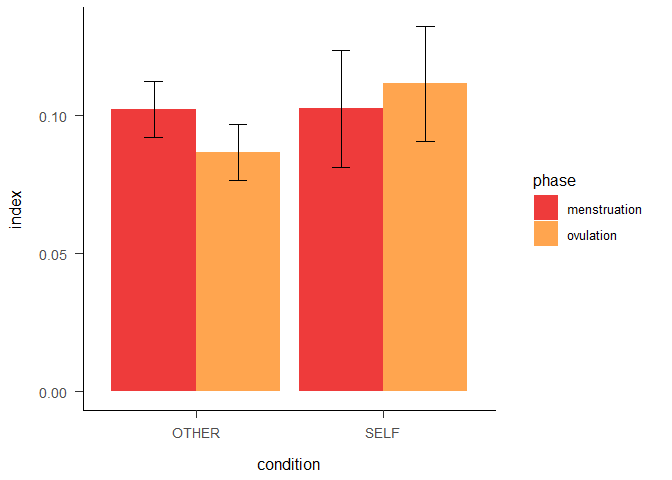
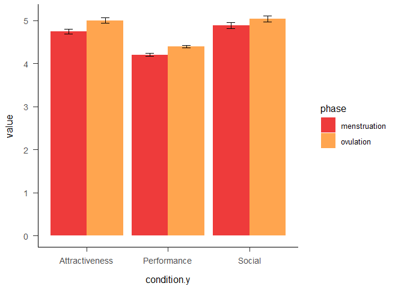

Self-esteem across the menstrual cycle
================
2023

``` r
library(readxl)
library(dplyr)
```

    ## 
    ## Attaching package: 'dplyr'

    ## The following objects are masked from 'package:stats':
    ## 
    ##     filter, lag

    ## The following objects are masked from 'package:base':
    ## 
    ##     intersect, setdiff, setequal, union

``` r
library(ggplot2)
```

    ## Warning: package 'ggplot2' was built under R version 4.2.2

``` r
library("plotrix")
```

``` r
brutos = data$`Dados_brutos (3)`
head(brutos)
```

    ##   participant LINE BLOCO        rt correct condition PRIME_VAL PRIME_TYPE
    ## 1       AA556    0     1 0.4174751       0         2  positive      OTHER
    ## 2       AA556    1     1 0.1681083       1         2  positive      OTHER
    ## 3       AA556    2     1 0.5012267       0         2  negative      OTHER
    ## 4       AA556    3     1 0.4864544       1         2  negative      OTHER
    ## 5       AA556    4     1 0.4847672       0         2  negative      OTHER
    ## 6       AA556    5     1 0.5007748       1         2  positive      OTHER
    ##        PICTURE TARGET        PHASE
    ## 1    VPN07.jpg  linda menstruation
    ## 2    VPN09.jpg  capaz menstruation
    ## 3    VPN07.jpg inútil menstruation
    ## 4    VPN04.jpg   feia menstruation
    ## 5    VPN02.jpg triste menstruation
    ## 6 femcon_2.jpg genial menstruation

\#parse target

``` r
for (i in 1:nrow(brutos)){
  if(substr(brutos$TARGET[i],nchar(brutos$TARGET[i])-2,nchar(brutos$TARGET[i])) == "til"){
    brutos$TARGET[i] = "inútil"  
  }
}
```

\#check

``` r
brutos %>%
  mutate(new = case_when(TARGET == "alegre" ~ "positive",
                         TARGET =="capaz" ~ "positive",
                         TARGET == "confiante" ~ "positive",
                         TARGET == "genial" ~ "positive",
                         TARGET == "linda" ~ "positive"
                                ,TRUE ~ 'negative'
                                )) %>% pull(new) -> new

a = new == brutos$PRIME_VAL 
soma = sum(a, na.rm = TRUE) # best way to count TRUE values
soma == length(a)
```

    ## [1] TRUE

\#check participant’s id

``` r
summary(factor(brutos$participant))
```

    ## AA556 AA696 ab116 AF841 av734 BF401 BJ960 CA306 CC522 CJ335 cj967 CJ967 EG406 
    ##   452   513   446   526   285   491   508   359   101   479   242   261   520 
    ## GA454 GJ487 IJ887 JJ997 Lf380 LF380 MA007 MA565 ma889 MA889 MA929 MA969 mb968 
    ##   458   492   433   385   224   207   511   328   145   175   312   472   444 
    ## ME324 mj243 MJ690 MJ803 MM350 MM533 MM586 MM714 MP177 MR971 NA210 nj182 NJ182 
    ##   471   436   137   412   425   363   459   437   536   331   481   166   146 
    ## nj267 NJ267 OR883 PF580 rf539 RF539 RJ673 RR863 SJ292 SJ302 sj313 SJ313 SJ513 
    ##   209   160   489   505   228   278   441   461   364   451   269   272   444 
    ## SJ874 sm247 sm370 sm416 SM416 SP123 SR421 tp158 TP158 VA606 
    ##   480   411   473   144   169   424   380   226   239   315

``` r
#to lower case all cols
names(brutos) <- tolower(names(brutos))

brutos$participant = tolower(brutos$participant)

#brutos %>% group_by(participant) %>% count()
```

#### Apa theme

``` r
#apa
theme_apa <- function(base_size = 12, base_family = "", box = FALSE) {
  adapted_theme <- ggplot2::theme_bw(base_size, base_family) +
    ggplot2::theme(
      plot.title = ggplot2::element_text(size = ggplot2::rel(1.1), margin = ggplot2::margin(0, 0, ggplot2::rel(14), 0), hjust = 0.5)
      , plot.subtitle = ggplot2::element_text(size = ggplot2::rel(0.8), margin = ggplot2::margin(ggplot2::rel(-7), 0, ggplot2::rel(14), 0), hjust = 0.5)

      # , axis.title = ggplot2::element_text(size = ggplot2::rel(1.1))
      , axis.title.x = ggplot2::element_text(size = ggplot2::rel(1), lineheight = ggplot2::rel(1.1), margin = ggplot2::margin(ggplot2::rel(12), 0, 0, 0))
      , axis.title.x.top = ggplot2::element_text(size = ggplot2::rel(1), lineheight = ggplot2::rel(1.1), margin = ggplot2::margin(0, 0, ggplot2::rel(12), 0))
      , axis.title.y = ggplot2::element_text(size = ggplot2::rel(1), lineheight = ggplot2::rel(1.1), margin = ggplot2::margin(0, ggplot2::rel(12), 0, 0))
      , axis.title.y.right = ggplot2::element_text(size = ggplot2::rel(1), lineheight = ggplot2::rel(1.1), margin = ggplot2::margin(0, 0, 0, ggplot2::rel(12)))
      , axis.ticks.length = ggplot2::unit(ggplot2::rel(6), "points")
      , axis.text = ggplot2::element_text(size = ggplot2::rel(0.9))
      , axis.text.x = ggplot2::element_text(size = ggplot2::rel(1), margin = ggplot2::margin(ggplot2::rel(6), 0, 0, 0))
      , axis.text.y = ggplot2::element_text(size = ggplot2::rel(1), margin = ggplot2::margin(0, ggplot2::rel(6), 0, 0))
      , axis.text.y.right = ggplot2::element_text(size = ggplot2::rel(1), margin = ggplot2::margin(0, 0, 0, ggplot2::rel(6)))
      , axis.line = ggplot2::element_line()
      # , axis.line.x = ggplot2::element_line()
      # , axis.line.y = ggplot2::element_line()

      , legend.title = ggplot2::element_text()
      , legend.key = ggplot2::element_rect(fill = NA, color = NA)
      , legend.key.width = ggplot2::unit(ggplot2::rel(20), "points")
      , legend.key.height = ggplot2::unit(ggplot2::rel(20), "points")
      , legend.margin = ggplot2::margin(
        t = ggplot2::rel(16)
        , r = ggplot2::rel(16)
        , b = ggplot2::rel(16)
        , l = ggplot2::rel(16)
        , unit = "points"
      )

      , panel.spacing = ggplot2::unit(ggplot2::rel(14), "points")
      , panel.grid.major.x = ggplot2::element_blank()
      , panel.grid.minor.x = ggplot2::element_blank()
      , panel.grid.major.y = ggplot2::element_blank()
      , panel.grid.minor.y = ggplot2::element_blank()

      , strip.background = ggplot2::element_rect(fill = NA, color = NA)
      , strip.text.x = ggplot2::element_text(size = ggplot2::rel(1.2), margin = ggplot2::margin(0, 0, ggplot2::rel(10), 0))
      , strip.text.y = ggplot2::element_text(size = ggplot2::rel(1.2), margin = ggplot2::margin(0, 0, 0, ggplot2::rel(10)))
    )

  if(box) {
    adapted_theme <- adapted_theme + ggplot2::theme(panel.border = ggplot2::element_rect(color = "black"))
  } else {
    adapted_theme <- adapted_theme + ggplot2::theme(panel.border = ggplot2::element_blank())
  }

  adapted_theme
}
```

``` r
plot = ggplot(data = brutos, aes(x = prime_type, y = rt, fill = interaction(correct,prime_type))) + geom_boxplot() + facet_wrap(~phase) + theme_apa()

plot
```

<!-- -->

``` r
brutos2 = brutos %>% group_by(phase, prime_type, prime_val,target) %>% summarize(soma = sum(correct)) 
```

    ## `summarise()` has grouped output by 'phase', 'prime_type', 'prime_val'. You can
    ## override using the `.groups` argument.

``` r
for (i in 1:nrow(brutos2)){
  if(brutos2$prime_type[i] == "OTHER"){
    brutos2$soma[i] = brutos2$soma[i]/5
  }
}

brutos2
```

    ## # A tibble: 40 × 5
    ## # Groups:   phase, prime_type, prime_val [8]
    ##    phase        prime_type prime_val target     soma
    ##    <chr>        <chr>      <chr>     <chr>     <dbl>
    ##  1 menstruation OTHER      negative  falhada    116.
    ##  2 menstruation OTHER      negative  feia       117.
    ##  3 menstruation OTHER      negative  insegura   121.
    ##  4 menstruation OTHER      negative  inútil     132 
    ##  5 menstruation OTHER      negative  triste     123.
    ##  6 menstruation OTHER      positive  alegre     150.
    ##  7 menstruation OTHER      positive  capaz      138.
    ##  8 menstruation OTHER      positive  confiante  141.
    ##  9 menstruation OTHER      positive  genial     134 
    ## 10 menstruation OTHER      positive  linda      166 
    ## # … with 30 more rows

``` r
brutos2%>% 
  ggplot(aes(x = target, y = soma, fill = prime_val)) +
    geom_bar(position="dodge",stat = "identity")+
    #scale_fill_manual(values = c ('royalblue1', 'grey2', 'yellow1'))+
    ylab("Values")+
    xlab("")+
    facet_grid(prime_type ~ phase) + theme_apa()+
  theme(axis.text.x = element_text(angle = 95, vjust = 0.5,hjust = 1)) -> plot

plot
```

<!-- --> \#filter
by beautiful and ugly

``` r
brutos2 %>% subset(target %in% c("linda","feia")) %>% 
  ggplot(aes(x = target, y = soma, fill = prime_val)) +
    geom_bar(position="dodge",stat = "identity")+
    #scale_fill_manual(values = c ('royalblue1', 'grey2', 'yellow1'))+
    ylab("Values")+
    xlab("")+
    facet_grid(prime_type ~ phase) + theme_apa()+
  theme(axis.text.x = element_text(angle = 95, vjust = 0.5,hjust = 1)) 
```

<!-- -->

``` r
#brutos = brutos %>% subset(target %in% c("linda","feia")) 
```

``` r
brutos %>% group_by(participant, phase) %>% summarize(soma = sum(correct)) %>% arrange(desc(soma)) ->grafico
```

    ## `summarise()` has grouped output by 'participant'. You can override using the
    ## `.groups` argument.

``` r
ggplot(grafico, aes(x = reorder(participant, -soma), y = soma)) + geom_bar(position="dodge",stat = "identity") +  coord_flip()+ facet_wrap(~phase) #+ geom_hline(yintercept=, linetype="dashed", 
```

<!-- -->

``` r
      #          color = "red", size=2)
```

``` r
#brutos %>% group_by(participant, phase) %>% tally() %>% arrange(n)
```

``` r
#brutos %>% group_by(participant, phase) %>% summarise_at(vars(rt), funs(rt_mean = mean(., na.rm = T))) %>% arrange(desc(rt_mean))
```

\#remove participants mj690 & cc522 *few responses *few corrects \*high
rt

``` r
brutos = brutos %>% subset(!(participant %in% c("mj690","cc522","sm247")))
```

\#ROC-CURVE

``` r
head(brutos)
```

    ##   participant line bloco        rt correct condition prime_val prime_type
    ## 1       aa556    0     1 0.4174751       0         2  positive      OTHER
    ## 2       aa556    1     1 0.1681083       1         2  positive      OTHER
    ## 3       aa556    2     1 0.5012267       0         2  negative      OTHER
    ## 4       aa556    3     1 0.4864544       1         2  negative      OTHER
    ## 5       aa556    4     1 0.4847672       0         2  negative      OTHER
    ## 6       aa556    5     1 0.5007748       1         2  positive      OTHER
    ##        picture target        phase
    ## 1    VPN07.jpg  linda menstruation
    ## 2    VPN09.jpg  capaz menstruation
    ## 3    VPN07.jpg inútil menstruation
    ## 4    VPN04.jpg   feia menstruation
    ## 5    VPN02.jpg triste menstruation
    ## 6 femcon_2.jpg genial menstruation

``` r
response = c()
for (i in 1:nrow(brutos)){
  if (brutos$prime_val[i] == "positive"){
    if (brutos$correct[i] == 1){
      response = c(response, 1)
    }
    else{
      response = c(response,0)
    }
  }
  else{
    if(brutos$correct[i] == 1){
      response = c(response,0)
    }
    else{
      response = c(response,1)
    }
    
  }
}

expected = response

library(caTools)

library(pROC)
```

    ## Type 'citation("pROC")' for a citation.

    ## 
    ## Attaching package: 'pROC'

    ## The following objects are masked from 'package:stats':
    ## 
    ##     cov, smooth, var

``` r
response = c()
for (i in 1:nrow(brutos)){
  if(brutos$prime_val[i]=="positive"){
    response = c(response,1)
  }
  else{
    response = c(response,0)
  }
}


test_roc = roc(expected ~ response, plot = TRUE, print.auc = TRUE)
```

    ## Setting levels: control = 0, case = 1

    ## Setting direction: controls < cases

<!-- -->

``` r
roc_df = data.frame(brutos$phase,brutos$prime_type,expected,response)


self_ovulation_df = roc_df %>% subset(brutos.phase == "ovulation" & brutos.prime_type=="SELF")
self_menstruation_df = roc_df %>% subset(brutos.phase == "menstruation" & brutos.prime_type=="SELF")

other_ovulation_df = roc_df %>% subset(brutos.phase == "ovulation" & brutos.prime_type=="OTHER")
other_menstruation_df = roc_df %>% subset(brutos.phase == "menstruation" & brutos.prime_type=="OTHER")


# create ROC curves for each condition
roc1 <- roc(self_ovulation_df$expected,self_ovulation_df$response)
```

    ## Setting levels: control = 0, case = 1
    ## Setting direction: controls < cases

``` r
roc2 <- roc(self_menstruation_df$expected,self_menstruation_df$response)
```

    ## Setting levels: control = 0, case = 1
    ## Setting direction: controls < cases

``` r
roc3 = roc(other_ovulation_df$expected,other_ovulation_df$response)
```

    ## Setting levels: control = 0, case = 1
    ## Setting direction: controls < cases

``` r
roc4 = roc(other_menstruation_df$expected,other_menstruation_df$response)
```

    ## Setting levels: control = 0, case = 1
    ## Setting direction: controls < cases

``` r
ggroc(list(self_ovulation = roc1, self_menstruation = roc2, other_ovulation = roc3, other_menstruation = roc4 )) +
   scale_color_manual(values = c("self_ovulation"="brown2","self_menstruation" = "Tan","other_ovulation" = "blue","other_menstruation" ="green"),
                      labels = c(paste0("self ovulation ",'ROC Curve ', '(AUC = ', .74, ')')
                                 ,paste0("self menstruation ",'ROC Curve ', '(AUC = ',.71, ')')
                                 ,paste0("other ovulation ",'ROC Curve ', '(AUC = ', .73, ')')
                                 ,paste0("other menstruation ",'ROC Curve ', '(AUC = ', .73, ')'))) + theme_apa()
```

<!-- -->

\#missing responses-add to dataframe

``` r
codes = c("ma889","ma929","mr971","na210","nj267","va606")

p1=list("ma889",0,1,0.42,0,1,"negative","SELF","x","x","menstruation")
p2=list("ma929",0,4,0.42,0,2,"negative","SELF","x","x","menstruation")
p3=list("mr971",0,4,0.42,0,2,"negative","SELF","x","x","ovulation")
p4=list("na210",0,2,0.42,0,2,"positive","SELF","x","x","menstruation")
p5=list("nj267",0,3,0.42,0,1,"negative","SELF","x","x","menstruation")
p6=list("va606",0,1,0.42,0,1,"positive","SELF","x","x","menstruation")

nested = list(p1,p2,p3,p4,p5,p6)
df_nested <-  as.data.frame(do.call(rbind, nested))

colnames(df_nested) = colnames(brutos)

library(tidyr)
unnested = df_nested %>% unnest(colnames(df_nested))
unnested = data.frame(unnested)
colnames(unnested) = colnames(brutos)

brutos = rbind(brutos,unnested)
```

# POSITIVITY INDEX - SELF

``` r
brutos %>% group_by(participant,phase,bloco, prime_val, prime_type) %>% summarize(soma = sum(correct)) -> df
```

    ## `summarise()` has grouped output by 'participant', 'phase', 'bloco',
    ## 'prime_val'. You can override using the `.groups` argument.

``` r
taxa = c()
x = 25
y = 5
  
for (i in 1:nrow(df)){
  if(df$prime_type[i] == "OTHER"){
    taxa = c(taxa,(df$soma[i]/x))
  } 
  else{
    taxa = c(taxa,(df$soma[i]/y))
  }
}

df$taxa = taxa
```

\#don’t

``` r
data= data.frame(matrix(ncol=7,nrow = 0))
colnames(data) = colnames(df)

blocks = c(1,2,3,4,5)

#for each participant
for (participant in levels(factor(df$participant))){
  #for each phase
  for(phase in phases){
    #for each block
    for (block in blocks){
      
            data[nrow(data) + 1,] =list(participant,phase,block, "negative","OTHER",0,0)
            
            data[nrow(data) + 1,] =list(participant,phase,block, "negative","SELF",0,0)

            data[nrow(data) + 1,] =list(participant,phase,block, "positive","OTHER",0,0)
            data[nrow(data) + 1,] =list(participant,phase,block, "positive","SELF",0,0)
    
    }
  }
}
```

\#don’t

``` r
df = rbind(df,data)
df%>% group_by(participant,phase,bloco, prime_val, prime_type) %>% summarize(taxa = sum(taxa))->df
```

``` r
index = c()
bloco = 1
counter = 1

for(i in 1:(nrow(df)-2)){
  if (df$bloco[i+2] == bloco & counter < 3){
    index = c(index,df$taxa[i]-df$taxa[i+2])
  }
  else {
    bloco = df$bloco[i+2]
  }
  if (counter == 4){
    counter = 0
  }
  counter = counter+1
}
```

\#create dataframe

``` r
participants = levels(factor(df$participant))
participants = rep(participants, each = 20)


phase = rep(c("menstruation","ovulation"), each = 10, times = 10)

bloco = rep(c(1,2,3,4,5),each = 2,times = 100)

condition = rep(c("OTHER","SELF"),times = 500)

colunas = c("participant","phase","bloco","condition","index")

df_index = data.frame(participants,phase,bloco,condition, index) 
colnames(df_index) = colunas
```

\#remove participants

``` r
df %>% subset(!(participant %in% c("sp123","sm247","mj690","cc522"))) -> df
```

``` r
df_index %>% group_by(phase,condition) %>% summarise_at(vars(index), funs(rt_mean = mean(., na.rm = T))) 
```

    ## Warning: `funs()` was deprecated in dplyr 0.8.0.
    ## ℹ Please use a list of either functions or lambdas:
    ## 
    ## # Simple named list: list(mean = mean, median = median)
    ## 
    ## # Auto named with `tibble::lst()`: tibble::lst(mean, median)
    ## 
    ## # Using lambdas list(~ mean(., trim = .2), ~ median(., na.rm = TRUE))

    ## # A tibble: 4 × 3
    ## # Groups:   phase [2]
    ##   phase        condition rt_mean
    ##   <chr>        <chr>       <dbl>
    ## 1 menstruation OTHER     -0.0976
    ## 2 menstruation SELF      -0.119 
    ## 3 ovulation    OTHER     -0.0859
    ## 4 ovulation    SELF      -0.116

\#symmetric index

``` r
df_index$index = -df_index$index
```

``` r
ggplot(data = df_index, aes(x = condition, y = index, color = phase)) + geom_boxplot() + theme_apa()
```

<!-- -->

``` r
#head(df,20)
```

``` r
#df_index %>% group_by(participant,phase,condition) %>% summarise_at(vars(index), funs(rt_mean = mean(., na.rm = T))) %>% arrange(rt_mean)
```

\#remove outlier

``` r
df_index = df_index %>% subset(participant!="ij887" & participant != "mr971") 
```

``` r
hist(df_index$index)
```

<!-- -->

``` r
df_index %>% group_by(phase,condition) %>% summarise_at(vars(index), funs(index = mean(., na.rm = T)))-> df_index2 
df_index %>% group_by(phase,condition) %>% summarise_at(vars(index), funs(se = std.error(., na.rm = T))) %>% pull(se) ->se

df_index2$se = se

# Create bar plot with error bars
ggplot(df_index2, aes(x = condition, y = index, fill = phase)) +
  geom_bar(stat = "identity",position = position_dodge(0.9)) +   scale_fill_manual(values = c("brown2", "Tan1")) +
  geom_errorbar(aes(ymin = index - se, ymax = index + se), width = 0.2,position = position_dodge(0.9)) + theme_apa()
```

<!-- -->

``` r
df_index %>% group_by(participant,phase,condition) %>% summarise_at(vars(index), funs(index = mean(., na.rm = T))) %>% ggplot(aes(x = condition, y = index, color = phase)) + geom_boxplot() +theme_apa()
```

<!-- -->

``` r
library(lme4)
```

    ## Loading required package: Matrix

    ## Warning: package 'Matrix' was built under R version 4.2.2

    ## 
    ## Attaching package: 'Matrix'

    ## The following objects are masked from 'package:tidyr':
    ## 
    ##     expand, pack, unpack

    ## 
    ## Attaching package: 'lme4'

    ## The following object is masked from 'package:rio':
    ## 
    ##     factorize

``` r
library(afex)
```

    ## Warning: package 'afex' was built under R version 4.2.2

    ## ************
    ## Welcome to afex. For support visit: http://afex.singmann.science/

    ## - Functions for ANOVAs: aov_car(), aov_ez(), and aov_4()
    ## - Methods for calculating p-values with mixed(): 'S', 'KR', 'LRT', and 'PB'
    ## - 'afex_aov' and 'mixed' objects can be passed to emmeans() for follow-up tests
    ## - NEWS: emmeans() for ANOVA models now uses model = 'multivariate' as default.
    ## - Get and set global package options with: afex_options()
    ## - Set orthogonal sum-to-zero contrasts globally: set_sum_contrasts()
    ## - For example analyses see: browseVignettes("afex")
    ## ************

    ## 
    ## Attaching package: 'afex'

    ## The following object is masked from 'package:lme4':
    ## 
    ##     lmer

``` r
df_index$participant = factor(df_index$participant)
df_index$phase = factor(df_index$phase)
df_index$bloco = factor(df_index$bloco)
df_index$condition = factor(df_index$condition)

model = lmer(index~condition*phase + (1|participant), df_index)

summary(model)
```

    ## Linear mixed model fit by REML. t-tests use Satterthwaite's method [
    ## lmerModLmerTest]
    ## Formula: index ~ condition * phase + (1 | participant)
    ##    Data: df_index
    ## 
    ## REML criterion at convergence: 96.7
    ## 
    ## Scaled residuals: 
    ##     Min      1Q  Median      3Q     Max 
    ## -3.6152 -0.5896  0.0043  0.5482  3.5911 
    ## 
    ## Random effects:
    ##  Groups      Name        Variance Std.Dev.
    ##  participant (Intercept) 0.004328 0.06579 
    ##  Residual                0.060610 0.24619 
    ## Number of obs: 960, groups:  participant, 48
    ## 
    ## Fixed effects:
    ##                                Estimate Std. Error         df t value Pr(>|t|)
    ## (Intercept)                   1.023e-01  1.851e-02  2.177e+02   5.528 9.23e-08
    ## conditionSELF                 1.667e-04  2.247e-02  9.090e+02   0.007    0.994
    ## phaseovulation               -1.567e-02  2.247e-02  9.090e+02  -0.697    0.486
    ## conditionSELF:phaseovulation  2.483e-02  3.178e-02  9.090e+02   0.781    0.435
    ##                                 
    ## (Intercept)                  ***
    ## conditionSELF                   
    ## phaseovulation                  
    ## conditionSELF:phaseovulation    
    ## ---
    ## Signif. codes:  0 '***' 0.001 '**' 0.01 '*' 0.05 '.' 0.1 ' ' 1
    ## 
    ## Correlation of Fixed Effects:
    ##             (Intr) cnSELF phsvlt
    ## conditnSELF -0.607              
    ## phaseovultn -0.607  0.500       
    ## cndtnSELF:p  0.429 -0.707 -0.707

``` r
library(emmeans)
noise <- emmeans(model,~condition*phase)


x = contrast(noise, "pairwise", simple = "each", combine = TRUE, adjust="bonf")
x
```

    ##  phase        condition contrast                  estimate     SE  df t.ratio
    ##  menstruation .         OTHER - SELF             -0.000167 0.0225 909  -0.007
    ##  ovulation    .         OTHER - SELF             -0.025000 0.0225 909  -1.112
    ##  .            OTHER     menstruation - ovulation  0.015667 0.0225 909   0.697
    ##  .            SELF      menstruation - ovulation -0.009167 0.0225 909  -0.408
    ##  p.value
    ##   1.0000
    ##   1.0000
    ##   1.0000
    ##   1.0000
    ## 
    ## Degrees-of-freedom method: kenward-roger 
    ## P value adjustment: bonferroni method for 4 tests

### ESCALAS

``` r
rosenberg = data$Rosenberg
hp = data$HP
```

``` r
rosenberg %>% select(CODE,M_Ros_F1,M_Ros_F2) ->rosenberg
hp %>% select(CODE, M_HP_P_1,M_HP_P_2,M_HP_S_1,M_HP_S_2,M_HP_A_1,M_HP_A_2)->hp
```

``` r
head(hp)
```

    ##    CODE M_HP_P_1 M_HP_P_2 M_HP_S_1 M_HP_S_2 M_HP_A_1 M_HP_A_2
    ## 1 MJ960 4.000000 4.428571      5.0      3.2      3.8      3.6
    ## 2 ms416 4.142857 2.571429      4.6      3.2      5.4      5.4
    ## 3 SP513 4.000000 4.857143      5.8      6.2      6.6      5.6
    ## 4 MJ714 4.714286 4.142857      5.6      3.6      4.4      4.4
    ## 5 fb968 4.428571 4.428571      7.0      7.0      5.0      5.2
    ## 6 MA969 2.714286 3.714286      5.4      5.2      2.2      3.8

``` r
library(reshape2)
```

    ## 
    ## Attaching package: 'reshape2'

    ## The following object is masked from 'package:tidyr':
    ## 
    ##     smiths

``` r
# Melt the data frame to long format using two conditions
hp = hp %>%
  pivot_longer(cols = starts_with("M_HP_"), 
               names_to = c("condition", "phase"), 
               names_pattern = c("(M_HP_[PSA]_)([12])")) 

colnames(hp)[1] = "participant"

hp$participant = tolower(hp$participant)

hp <- hp %>%
  mutate(phase = if_else(phase == "1", "ovulation", "menstruation"))
```

\#rename participants’ codes

``` r
hp %>%
  mutate(participant = case_when(participant == "av116"~"ab116",
                         participant == "mj960"~"bj960",
                         participant ==  "sp513"~"sj513",
                         participant ==  "mj714"~"mm714",
                         participant == "ms416"~"sm416" ,
                         participant == "af8411"~ "af841",
                         participant == "fb968" ~"mb968",
                         participant == "rj073" ~"rj673",
                        TRUE ~ participant
                                ))-> hp
```

\#left join

``` r
length(levels(df_index$participant))
```

    ## [1] 48

``` r
df_merged <- df_index %>%
  left_join(hp, by = c("participant","phase"))

df_merged %>%
  mutate(condition.y = case_when(condition.y == "M_HP_P_"~"Performance",
                         condition.y == "M_HP_S_"~"Social",
                         condition.y ==  "M_HP_A_"~"Attractiveness"
                                ))-> df_merged

df_merged$participant = factor(df_merged$participant)
```

``` r
ggplot(data = df_merged, aes(x = condition.y, y = value, color = phase)) + geom_boxplot() + theme_apa()
```

<!-- -->

``` r
df_merged %>% group_by(phase,condition.y) %>% summarise_at(vars(value), funs(value = mean(., na.rm = T)))-> df_merged2 

df_merged %>% group_by(phase,condition.y) %>% summarise_at(vars(value), funs(se = std.error(., na.rm = T))) %>% pull(se) ->se

df_merged2$se = se

# Create bar plot with error bars
ggplot(df_merged2, aes(x = condition.y, y = value, fill = phase)) +
  geom_bar(stat = "identity",position = position_dodge(0.9)) +   scale_fill_manual(values = c("brown2", "Tan1")) +
  geom_errorbar(aes(ymin = value - se, ymax = value + se), width = 0.2,position = position_dodge(0.9)) + theme_apa()
```

<!-- -->

\#using hp scale as predictor of index \#wide format

``` r
df_wide <- df_merged %>%
  pivot_wider(id_cols = c(participant, phase, bloco, condition.x, index),
              names_from = condition.y,
              values_from = value)
```

\#subtract index of self-other

``` r
index = c()
for (i in 1:nrow(df_wide)-1){
  if(i%%2!=0){
  index = c(index,df_wide$index[i+1]-df_wide$index[i])
  }
}  
length(index)*2
```

    ## [1] 960

``` r
#create dataframe
participants = levels(factor(df_wide$participant))
participants = rep(participants, each = 10)


phase = rep(c("menstruation","ovulation"), each = 5, times = 48)

bloco = rep(c(1,2,3,4,5),each = ,times = 96)

#condition = rep(c("OTHER","SELF"),times = 500)

colunas = c("participant","phase","bloco","index_global")

df_index = data.frame(participants,phase,bloco, index) 
colnames(df_index) = colunas


df_wide %>% group_by(participant,phase,bloco) %>% summarize(Attractiveness = mean(Attractiveness)) %>% pull(Attractiveness) -> Attractiveness
```

    ## `summarise()` has grouped output by 'participant', 'phase'. You can override
    ## using the `.groups` argument.

``` r
df_wide %>% group_by(participant,phase,bloco) %>% summarize(Social = mean(Social)) %>% pull(Social) -> Social
```

    ## `summarise()` has grouped output by 'participant', 'phase'. You can override
    ## using the `.groups` argument.

``` r
df_wide %>% group_by(participant,phase,bloco) %>% summarize(Performance = mean(Performance)) %>% pull(Performance) -> Performance
```

    ## `summarise()` has grouped output by 'participant', 'phase'. You can override
    ## using the `.groups` argument.

``` r
df_index$Performance = Performance
df_index$Attractiveness = Attractiveness
df_index$Social = Social
```

``` r
df_index$bloco = factor(df_index$bloco)


model = lmer(Attractiveness~phase + (1|participant), df_index)
summary(model)
```

    ## Linear mixed model fit by REML. t-tests use Satterthwaite's method [
    ## lmerModLmerTest]
    ## Formula: Attractiveness ~ phase + (1 | participant)
    ##    Data: df_index
    ## 
    ## REML criterion at convergence: 617.1
    ## 
    ## Scaled residuals: 
    ##      Min       1Q   Median       3Q      Max 
    ## -2.63076 -0.47912  0.00467  0.50195  2.55294 
    ## 
    ## Random effects:
    ##  Groups      Name        Variance Std.Dev.
    ##  participant (Intercept) 1.7146   1.3094  
    ##  Residual                0.1285   0.3585  
    ## Number of obs: 480, groups:  participant, 48
    ## 
    ## Fixed effects:
    ##                 Estimate Std. Error        df t value Pr(>|t|)    
    ## (Intercept)      4.74583    0.19041  47.70166  24.924  < 2e-16 ***
    ## phaseovulation   0.25833    0.03273 431.00000   7.894 2.45e-14 ***
    ## ---
    ## Signif. codes:  0 '***' 0.001 '**' 0.01 '*' 0.05 '.' 0.1 ' ' 1
    ## 
    ## Correlation of Fixed Effects:
    ##             (Intr)
    ## phaseovultn -0.086

``` r
model = lmer(Social~phase + (1|participant), df_index)
summary(model)
```

    ## Linear mixed model fit by REML. t-tests use Satterthwaite's method [
    ## lmerModLmerTest]
    ## Formula: Social ~ phase + (1 | participant)
    ##    Data: df_index
    ## 
    ## REML criterion at convergence: 1083.9
    ## 
    ## Scaled residuals: 
    ##      Min       1Q   Median       3Q      Max 
    ## -2.66879 -0.50841  0.00767  0.53572  2.66514 
    ## 
    ## Random effects:
    ##  Groups      Name        Variance Std.Dev.
    ##  participant (Intercept) 2.1845   1.4780  
    ##  Residual                0.3694   0.6077  
    ## Number of obs: 480, groups:  participant, 48
    ## 
    ## Fixed effects:
    ##                 Estimate Std. Error        df t value Pr(>|t|)    
    ## (Intercept)      4.88750    0.21691  48.57446  22.533  < 2e-16 ***
    ## phaseovulation   0.15833    0.05548 431.00000   2.854  0.00453 ** 
    ## ---
    ## Signif. codes:  0 '***' 0.001 '**' 0.01 '*' 0.05 '.' 0.1 ' ' 1
    ## 
    ## Correlation of Fixed Effects:
    ##             (Intr)
    ## phaseovultn -0.128

``` r
model = lmer(Performance~phase + (1|participant), df_index)
summary(model)
```

    ## Linear mixed model fit by REML. t-tests use Satterthwaite's method [
    ## lmerModLmerTest]
    ## Formula: Performance ~ phase + (1 | participant)
    ##    Data: df_index
    ## 
    ## REML criterion at convergence: 383.3
    ## 
    ## Scaled residuals: 
    ##      Min       1Q   Median       3Q      Max 
    ## -2.39450 -0.59663  0.01595  0.65160  2.22578 
    ## 
    ## Random effects:
    ##  Groups      Name        Variance Std.Dev.
    ##  participant (Intercept) 0.32639  0.5713  
    ##  Residual                0.08934  0.2989  
    ## Number of obs: 480, groups:  participant, 48
    ## 
    ## Fixed effects:
    ##                 Estimate Std. Error        df t value Pr(>|t|)    
    ## (Intercept)      4.20833    0.08469  49.53382  49.692  < 2e-16 ***
    ## phaseovulation   0.19048    0.02728 431.00000   6.981 1.11e-11 ***
    ## ---
    ## Signif. codes:  0 '***' 0.001 '**' 0.01 '*' 0.05 '.' 0.1 ' ' 1
    ## 
    ## Correlation of Fixed Effects:
    ##             (Intr)
    ## phaseovultn -0.161

``` r
ggplot(data = df_index, aes(x = phase, y = index_global)) + geom_boxplot() + theme_apa()
```

<!-- -->

``` r
df_index %>% group_by(phase) %>% summarise_at(vars(index_global), funs(value = mean(., na.rm = T)))-> df_index2 

df_index %>% group_by(phase) %>% summarise_at(vars(index_global), funs(se = std.error(., na.rm = T))) %>% pull(se) ->se

df_index2$se = se

# Create bar plot with error bars
ggplot(df_index2, aes(x = phase, y = value, fill = phase)) +
  geom_bar(stat = "identity",position = position_dodge(0.9)) +   scale_fill_manual(values = c("brown2", "Tan1")) +
  geom_errorbar(aes(ymin = value - se, ymax = value + se), width = 0.2,position = position_dodge(0.9)) + theme_apa()
```

<!-- -->

``` r
ggplot(df_index, aes(x = phase, y = index_global)) + geom_boxplot() + theme_apa()
```

<!-- -->

``` r
model = lmer(index_global~phase + (1|participant), df_index)

summary(model)
```

    ## Linear mixed model fit by REML. t-tests use Satterthwaite's method [
    ## lmerModLmerTest]
    ## Formula: index_global ~ phase + (1 | participant)
    ##    Data: df_index
    ## 
    ## REML criterion at convergence: 388.1
    ## 
    ## Scaled residuals: 
    ##     Min      1Q  Median      3Q     Max 
    ## -3.5438 -0.6694 -0.0162  0.6694  3.1365 
    ## 
    ## Random effects:
    ##  Groups      Name        Variance Std.Dev.
    ##  participant (Intercept) 0.01486  0.1219  
    ##  Residual                0.11901  0.3450  
    ## Number of obs: 480, groups:  participant, 48
    ## 
    ## Fixed effects:
    ##                 Estimate Std. Error        df t value Pr(>|t|)
    ## (Intercept)    1.667e-04  2.838e-02 9.604e+01   0.006    0.995
    ## phaseovulation 2.483e-02  3.149e-02 4.310e+02   0.789    0.431
    ## 
    ## Correlation of Fixed Effects:
    ##             (Intr)
    ## phaseovultn -0.555

\#Predicting global index using Attractiveness/phase

``` r
model = lmer(index_global~Attractiveness + Social + Performance + (1|participant), df_index)

summary(model)
```

    ## Linear mixed model fit by REML. t-tests use Satterthwaite's method [
    ## lmerModLmerTest]
    ## Formula: 
    ## index_global ~ Attractiveness + Social + Performance + (1 | participant)
    ##    Data: df_index
    ## 
    ## REML criterion at convergence: 397.4
    ## 
    ## Scaled residuals: 
    ##     Min      1Q  Median      3Q     Max 
    ## -3.5858 -0.6668  0.0090  0.6703  3.0309 
    ## 
    ## Random effects:
    ##  Groups      Name        Variance Std.Dev.
    ##  participant (Intercept) 0.01424  0.1193  
    ##  Residual                0.11897  0.3449  
    ## Number of obs: 480, groups:  participant, 48
    ## 
    ## Fixed effects:
    ##                 Estimate Std. Error        df t value Pr(>|t|)
    ## (Intercept)     -0.22689    0.14109  98.75693  -1.608    0.111
    ## Attractiveness   0.01249    0.02008  72.22632   0.622    0.536
    ## Social          -0.01070    0.01523 105.26313  -0.702    0.484
    ## Performance      0.05384    0.04027 155.34337   1.337    0.183
    ## 
    ## Correlation of Fixed Effects:
    ##             (Intr) Attrct Social
    ## Attractvnss -0.028              
    ## Social      -0.071 -0.158       
    ## Performance -0.745 -0.473 -0.290

``` r
#library("interactions")
#interact_plot(model, pred = Attractiveness, modx = phase) + theme_apa()
```

``` r
head(rosenberg)
```

    ##    CODE M_Ros_F1 M_Ros_F2
    ## 1 MJ960      2.7      2.7
    ## 2 ms416      3.0      2.9
    ## 3 SP513      3.7      3.8
    ## 4 MJ714      2.7      2.5
    ## 5 fb968      2.7      2.7
    ## 6 MA969      2.6      2.5

``` r
# Melt the data frame to long format using two conditions
rosenberg %>%
  pivot_longer(cols = starts_with("M_"), 
               names_to = c("condition", "phase"), 
               names_pattern = c("(M_HP_[PSA]_)([12])")) -> rosenberg2


rosenberg2$participant = tolower(rosenberg2$CODE)

phase = rep(c("menstruation","ovulation"), each = 1, times = 53)

rosenberg2$phase = phase
rosenberg2$rosenberg = rosenberg2$value

rosenberg = rosenberg2 %>% select (participant,phase,rosenberg)
```

\#rename participants’ codes

``` r
rosenberg %>%
  mutate(participant = case_when(participant == "av116"~"ab116",
                         participant == "mj960"~"bj960",
                         participant ==  "sp513"~"sj513",
                         participant ==  "mj714"~"mm714",
                         participant == "ms416"~"sm416" ,
                         participant == "af8411"~ "af841",
                         participant == "fb968" ~"mb968",
                         participant == "rj073" ~"rj673",
                        TRUE ~ participant
                                ))-> rosenberg
```

``` r
df_merged3 <- df_index %>%
  left_join(rosenberg, by = c("participant","phase"))
```

``` r
ggplot(data = df_merged3, aes(x = phase, y = rosenberg)) + geom_boxplot() + theme_apa()
```

<!-- -->

``` r
#standardize

model = lmer(rosenberg ~ phase + (1|participant), df_merged3)
summary(model)
```

    ## Linear mixed model fit by REML. t-tests use Satterthwaite's method [
    ## lmerModLmerTest]
    ## Formula: rosenberg ~ phase + (1 | participant)
    ##    Data: df_merged3
    ## 
    ## REML criterion at convergence: -557
    ## 
    ## Scaled residuals: 
    ##      Min       1Q   Median       3Q      Max 
    ## -2.81066 -0.61618  0.00266  0.61587  2.81223 
    ## 
    ## Random effects:
    ##  Groups      Name        Variance Std.Dev.
    ##  participant (Intercept) 0.26948  0.5191  
    ##  Residual                0.01032  0.1016  
    ## Number of obs: 480, groups:  participant, 48
    ## 
    ## Fixed effects:
    ##                  Estimate Std. Error         df t value Pr(>|t|)    
    ## (Intercept)      3.143750   0.075214  47.359211  41.797  < 2e-16 ***
    ## phaseovulation  -0.029167   0.009274 431.000001  -3.145  0.00178 ** 
    ## ---
    ## Signif. codes:  0 '***' 0.001 '**' 0.01 '*' 0.05 '.' 0.1 ' ' 1
    ## 
    ## Correlation of Fixed Effects:
    ##             (Intr)
    ## phaseovultn -0.062
