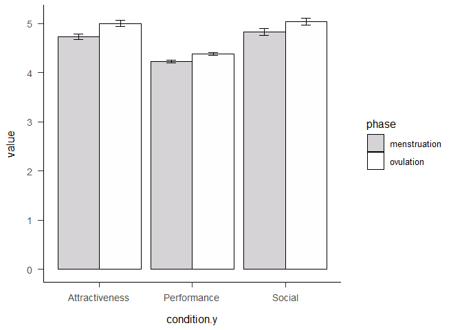
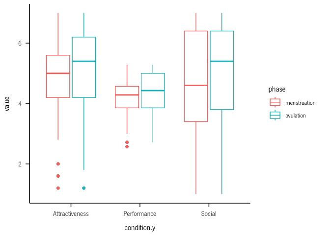
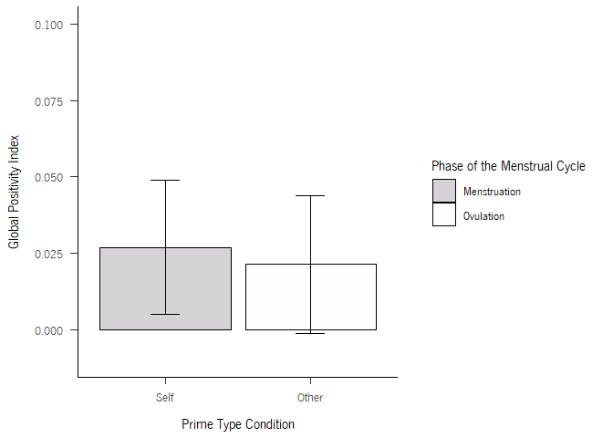

Self-esteem across the menstrual cycle
================
2023

``` r
library(readxl)
library(dplyr)
```

    ## 
    ## Attaching package: 'dplyr'

    ## The following objects are masked from 'package:stats':
    ## 
    ##     filter, lag

    ## The following objects are masked from 'package:base':
    ## 
    ##     intersect, setdiff, setequal, union

``` r
library(ggplot2)
```

    ## Warning: package 'ggplot2' was built under R version 4.2.2

``` r
library("plotrix")
library(sjPlot)
```

    ## Warning: package 'sjPlot' was built under R version 4.2.3

``` r
brutos = data$`Dados_brutos (3)`
head(brutos)
```

    ##   participant LINE BLOCO        rt correct condition PRIME_VAL PRIME_TYPE
    ## 1       AA556    0     1 0.4174751       0         2  positive      OTHER
    ## 2       AA556    1     1 0.1681083       1         2  positive      OTHER
    ## 3       AA556    2     1 0.5012267       0         2  negative      OTHER
    ## 4       AA556    3     1 0.4864544       1         2  negative      OTHER
    ## 5       AA556    4     1 0.4847672       0         2  negative      OTHER
    ## 6       AA556    5     1 0.5007748       1         2  positive      OTHER
    ##        PICTURE TARGET        PHASE
    ## 1    VPN07.jpg  linda menstruation
    ## 2    VPN09.jpg  capaz menstruation
    ## 3    VPN07.jpg inútil menstruation
    ## 4    VPN04.jpg   feia menstruation
    ## 5    VPN02.jpg triste menstruation
    ## 6 femcon_2.jpg genial menstruation

\#parse target

``` r
for (i in 1:nrow(brutos)){
  if(substr(brutos$TARGET[i],nchar(brutos$TARGET[i])-2,nchar(brutos$TARGET[i])) == "til"){
    brutos$TARGET[i] = "inútil"  
  }
}
```

\#check

``` r
brutos %>%
  mutate(new = case_when(TARGET == "alegre" ~ "positive",
                         TARGET =="capaz" ~ "positive",
                         TARGET == "confiante" ~ "positive",
                         TARGET == "genial" ~ "positive",
                         TARGET == "linda" ~ "positive"
                                ,TRUE ~ 'negative'
                                )) %>% pull(new) -> new

a = new == brutos$PRIME_VAL 
soma = sum(a, na.rm = TRUE) # best way to count TRUE values
soma == length(a)
```

    ## [1] TRUE

\#check participant’s id

``` r
summary(factor(brutos$participant))
```

    ## AA556 AA696 ab116 AF841 av734 BF401 BJ960 CA306 CC522 CJ335 cj967 CJ967 EG406 
    ##   452   513   446   526   285   491   508   359   101   479   242   261   520 
    ## GA454 GJ487 IJ887 JJ997 Lf380 LF380 MA007 MA565 ma889 MA889 MA929 MA969 mb968 
    ##   458   492   433   385   224   207   511   328   145   175   312   472   444 
    ## ME324 mj243 MJ690 MJ803 MM350 MM533 MM586 MM714 MP177 MR971 NA210 nj182 NJ182 
    ##   471   436   137   412   425   363   459   437   536   331   481   166   146 
    ## nj267 NJ267 OR883 PF580 rf539 RF539 RJ673 RR863 SJ292 SJ302 sj313 SJ313 SJ513 
    ##   209   160   489   505   228   278   441   461   364   451   269   272   444 
    ## SJ874 sm247 sm370 sm416 SM416 SP123 SR421 tp158 TP158 VA606 
    ##   480   411   473   144   169   424   380   226   239   315

``` r
#to lower case all cols
names(brutos) <- tolower(names(brutos))

brutos$participant = tolower(brutos$participant)

#brutos %>% group_by(participant) %>% count()
```

#### Apa theme

``` r
#apa
theme_apa <- function(base_size = 12, base_family = "", box = FALSE) {
  adapted_theme <- ggplot2::theme_bw(base_size, base_family) +
    ggplot2::theme(
      plot.title = ggplot2::element_text(size = ggplot2::rel(1.1), margin = ggplot2::margin(0, 0, ggplot2::rel(14), 0), hjust = 0.5)
      , plot.subtitle = ggplot2::element_text(size = ggplot2::rel(0.8), margin = ggplot2::margin(ggplot2::rel(-7), 0, ggplot2::rel(14), 0), hjust = 0.5)

      # , axis.title = ggplot2::element_text(size = ggplot2::rel(1.1))
      , axis.title.x = ggplot2::element_text(size = ggplot2::rel(1), lineheight = ggplot2::rel(1.1), margin = ggplot2::margin(ggplot2::rel(12), 0, 0, 0))
      , axis.title.x.top = ggplot2::element_text(size = ggplot2::rel(1), lineheight = ggplot2::rel(1.1), margin = ggplot2::margin(0, 0, ggplot2::rel(12), 0))
      , axis.title.y = ggplot2::element_text(size = ggplot2::rel(1), lineheight = ggplot2::rel(1.1), margin = ggplot2::margin(0, ggplot2::rel(12), 0, 0))
      , axis.title.y.right = ggplot2::element_text(size = ggplot2::rel(1), lineheight = ggplot2::rel(1.1), margin = ggplot2::margin(0, 0, 0, ggplot2::rel(12)))
      , axis.ticks.length = ggplot2::unit(ggplot2::rel(6), "points")
      , axis.text = ggplot2::element_text(size = ggplot2::rel(0.9))
      , axis.text.x = ggplot2::element_text(size = ggplot2::rel(1), margin = ggplot2::margin(ggplot2::rel(6), 0, 0, 0))
      , axis.text.y = ggplot2::element_text(size = ggplot2::rel(1), margin = ggplot2::margin(0, ggplot2::rel(6), 0, 0))
      , axis.text.y.right = ggplot2::element_text(size = ggplot2::rel(1), margin = ggplot2::margin(0, 0, 0, ggplot2::rel(6)))
      , axis.line = ggplot2::element_line()
      # , axis.line.x = ggplot2::element_line()
      # , axis.line.y = ggplot2::element_line()

      , legend.title = ggplot2::element_text()
      , legend.key = ggplot2::element_rect(fill = NA, color = NA)
      , legend.key.width = ggplot2::unit(ggplot2::rel(20), "points")
      , legend.key.height = ggplot2::unit(ggplot2::rel(20), "points")
      , legend.margin = ggplot2::margin(
        t = ggplot2::rel(16)
        , r = ggplot2::rel(16)
        , b = ggplot2::rel(16)
        , l = ggplot2::rel(16)
        , unit = "points"
      )

      , panel.spacing = ggplot2::unit(ggplot2::rel(14), "points")
      , panel.grid.major.x = ggplot2::element_blank()
      , panel.grid.minor.x = ggplot2::element_blank()
      , panel.grid.major.y = ggplot2::element_blank()
      , panel.grid.minor.y = ggplot2::element_blank()

      , strip.background = ggplot2::element_rect(fill = NA, color = NA)
      , strip.text.x = ggplot2::element_text(size = ggplot2::rel(1.2), margin = ggplot2::margin(0, 0, ggplot2::rel(10), 0))
      , strip.text.y = ggplot2::element_text(size = ggplot2::rel(1.2), margin = ggplot2::margin(0, 0, 0, ggplot2::rel(10)))
    )

  if(box) {
    adapted_theme <- adapted_theme + ggplot2::theme(panel.border = ggplot2::element_rect(color = "black"))
  } else {
    adapted_theme <- adapted_theme + ggplot2::theme(panel.border = ggplot2::element_blank())
  }

  adapted_theme
}
```

``` r
plot = ggplot(data = brutos, aes(x = prime_type, y = rt, fill = interaction(correct,prime_type))) + geom_boxplot() + facet_wrap(~phase) + theme_apa()

plot
```

<!-- -->

``` r
brutos2 = brutos %>% group_by(phase, prime_type, prime_val,target) %>% summarize(soma = sum(correct)) 
```

    ## `summarise()` has grouped output by 'phase', 'prime_type', 'prime_val'. You can
    ## override using the `.groups` argument.

``` r
for (i in 1:nrow(brutos2)){
  if(brutos2$prime_type[i] == "OTHER"){
    brutos2$soma[i] = brutos2$soma[i]/5
  }
}

brutos2
```

    ## # A tibble: 40 × 5
    ## # Groups:   phase, prime_type, prime_val [8]
    ##    phase        prime_type prime_val target     soma
    ##    <chr>        <chr>      <chr>     <chr>     <dbl>
    ##  1 menstruation OTHER      negative  falhada    116.
    ##  2 menstruation OTHER      negative  feia       117.
    ##  3 menstruation OTHER      negative  insegura   121.
    ##  4 menstruation OTHER      negative  inútil     132 
    ##  5 menstruation OTHER      negative  triste     123.
    ##  6 menstruation OTHER      positive  alegre     150.
    ##  7 menstruation OTHER      positive  capaz      138.
    ##  8 menstruation OTHER      positive  confiante  141.
    ##  9 menstruation OTHER      positive  genial     134 
    ## 10 menstruation OTHER      positive  linda      166 
    ## # … with 30 more rows

``` r
brutos2%>% 
  ggplot(aes(x = target, y = soma, fill = prime_val)) +
    geom_bar(position="dodge",stat = "identity")+
    #scale_fill_manual(values = c ('royalblue1', 'grey2', 'yellow1'))+
    ylab("Values")+
    xlab("")+
    facet_grid(prime_type ~ phase) + theme_apa()+
  theme(axis.text.x = element_text(angle = 95, vjust = 0.5,hjust = 1)) -> plot

plot
```

<!-- --> \#filter
by beautiful and ugly

``` r
brutos2 %>% subset(target %in% c("linda","feia")) %>% 
  ggplot(aes(x = target, y = soma, fill = prime_val)) +
    geom_bar(position="dodge",stat = "identity")+
    #scale_fill_manual(values = c ('royalblue1', 'grey2', 'yellow1'))+
    ylab("Values")+
    xlab("")+
    facet_grid(prime_type ~ phase) + theme_apa()+
  theme(axis.text.x = element_text(angle = 95, vjust = 0.5,hjust = 1)) 
```

<!-- -->

``` r
#brutos = brutos %>% subset(target %in% c("linda","feia")) 
```

``` r
brutos %>% group_by(participant, phase) %>% summarize(soma = sum(correct)) %>% arrange(desc(soma)) ->grafico
```

    ## `summarise()` has grouped output by 'participant'. You can override using the
    ## `.groups` argument.

``` r
ggplot(grafico, aes(x = reorder(participant, -soma), y = soma)) + geom_bar(position="dodge",stat = "identity") +  coord_flip()+ facet_wrap(~phase) #+ geom_hline(yintercept=, linetype="dashed", 
```

<!-- -->

``` r
      #          color = "red", size=2)
```

``` r
#brutos %>% group_by(participant, phase) %>% tally() %>% arrange(n)
```

``` r
#brutos %>% group_by(participant, phase) %>% summarise_at(vars(rt), funs(rt_mean = mean(., na.rm = T))) %>% arrange(desc(rt_mean))
```

\#remove participants mj690 & cc522 *few responses *few corrects \*high
rt

``` r
brutos = brutos %>% subset(!(participant %in% c("mj690","cc522","sm247")))
```

\#ROC-CURVE

``` r
head(brutos)
```

    ##   participant line bloco        rt correct condition prime_val prime_type
    ## 1       aa556    0     1 0.4174751       0         2  positive      OTHER
    ## 2       aa556    1     1 0.1681083       1         2  positive      OTHER
    ## 3       aa556    2     1 0.5012267       0         2  negative      OTHER
    ## 4       aa556    3     1 0.4864544       1         2  negative      OTHER
    ## 5       aa556    4     1 0.4847672       0         2  negative      OTHER
    ## 6       aa556    5     1 0.5007748       1         2  positive      OTHER
    ##        picture target        phase
    ## 1    VPN07.jpg  linda menstruation
    ## 2    VPN09.jpg  capaz menstruation
    ## 3    VPN07.jpg inútil menstruation
    ## 4    VPN04.jpg   feia menstruation
    ## 5    VPN02.jpg triste menstruation
    ## 6 femcon_2.jpg genial menstruation

``` r
response = c()
for (i in 1:nrow(brutos)){
  if (brutos$prime_val[i] == "positive"){
    if (brutos$correct[i] == 1){
      response = c(response, 1)
    }
    else{
      response = c(response,0)
    }
  }
  else{
    if(brutos$correct[i] == 1){
      response = c(response,0)
    }
    else{
      response = c(response,1)
    }
    
  }
}

expected = response

library(caTools)

library(pROC)
```

    ## Type 'citation("pROC")' for a citation.

    ## 
    ## Attaching package: 'pROC'

    ## The following objects are masked from 'package:stats':
    ## 
    ##     cov, smooth, var

``` r
response = c()
for (i in 1:nrow(brutos)){
  if(brutos$prime_val[i]=="positive"){
    response = c(response,1)
  }
  else{
    response = c(response,0)
  }
}


test_roc = roc(expected ~ response, plot = TRUE, print.auc = TRUE)
```

    ## Setting levels: control = 0, case = 1

    ## Setting direction: controls < cases

<!-- -->

``` r
roc_df = data.frame(brutos$phase,brutos$prime_type,expected,response)


self_ovulation_df = roc_df %>% subset(brutos.phase == "ovulation" & brutos.prime_type=="SELF")
self_menstruation_df = roc_df %>% subset(brutos.phase == "menstruation" & brutos.prime_type=="SELF")

other_ovulation_df = roc_df %>% subset(brutos.phase == "ovulation" & brutos.prime_type=="OTHER")
other_menstruation_df = roc_df %>% subset(brutos.phase == "menstruation" & brutos.prime_type=="OTHER")


# create ROC curves for each condition
roc1 <- roc(self_ovulation_df$expected,self_ovulation_df$response)
```

    ## Setting levels: control = 0, case = 1
    ## Setting direction: controls < cases

``` r
roc2 <- roc(self_menstruation_df$expected,self_menstruation_df$response)
```

    ## Setting levels: control = 0, case = 1
    ## Setting direction: controls < cases

``` r
roc3 = roc(other_ovulation_df$expected,other_ovulation_df$response)
```

    ## Setting levels: control = 0, case = 1
    ## Setting direction: controls < cases

``` r
roc4 = roc(other_menstruation_df$expected,other_menstruation_df$response)
```

    ## Setting levels: control = 0, case = 1
    ## Setting direction: controls < cases

``` r
ggroc(list(self_ovulation = roc1, self_menstruation = roc2, other_ovulation = roc3, other_menstruation = roc4 )) +
   scale_color_manual(values = c("self_ovulation"="brown2","self_menstruation" = "Tan","other_ovulation" = "blue","other_menstruation" ="green"),
                      labels = c(paste0("self ovulation ",'ROC Curve ', '(AUC = ', .74, ')')
                                 ,paste0("self menstruation ",'ROC Curve ', '(AUC = ',.71, ')')
                                 ,paste0("other ovulation ",'ROC Curve ', '(AUC = ', .73, ')')
                                 ,paste0("other menstruation ",'ROC Curve ', '(AUC = ', .73, ')'))) + theme_apa()
```

<!-- -->

\#missing responses-add to dataframe

``` r
codes = c("ma889","ma929","mr971","na210","nj267","va606")

p1=list("ma889",0,1,0.42,0,1,"negative","SELF","x","x","menstruation")
p2=list("ma929",0,4,0.42,0,2,"negative","SELF","x","x","menstruation")
p3=list("mr971",0,4,0.42,0,2,"negative","SELF","x","x","ovulation")
p4=list("na210",0,2,0.42,0,2,"positive","SELF","x","x","menstruation")
p5=list("nj267",0,3,0.42,0,1,"negative","SELF","x","x","menstruation")
p6=list("va606",0,1,0.42,0,1,"positive","SELF","x","x","menstruation")

nested = list(p1,p2,p3,p4,p5,p6)
df_nested <-  as.data.frame(do.call(rbind, nested))

colnames(df_nested) = colnames(brutos)

library(tidyr)
unnested = df_nested %>% unnest(colnames(df_nested))
unnested = data.frame(unnested)
colnames(unnested) = colnames(brutos)

brutos = rbind(brutos,unnested)
```

# POSITIVITY INDEX - SELF

``` r
brutos %>% group_by(participant,phase,bloco, prime_val, prime_type) %>% summarize(soma = sum(correct)) -> df
```

    ## `summarise()` has grouped output by 'participant', 'phase', 'bloco',
    ## 'prime_val'. You can override using the `.groups` argument.

``` r
taxa = c()
x = 25
y = 5
  
for (i in 1:nrow(df)){
  if(df$prime_type[i] == "OTHER"){
    taxa = c(taxa,(df$soma[i]/x))
  } 
  else{
    taxa = c(taxa,(df$soma[i]/y))
  }
}

df$taxa = taxa
```

\#don’t

``` r
data= data.frame(matrix(ncol=7,nrow = 0))
colnames(data) = colnames(df)

blocks = c(1,2,3,4,5)

#for each participant
for (participant in levels(factor(df$participant))){
  #for each phase
  for(phase in phases){
    #for each block
    for (block in blocks){
      
            data[nrow(data) + 1,] =list(participant,phase,block, "negative","OTHER",0,0)
            
            data[nrow(data) + 1,] =list(participant,phase,block, "negative","SELF",0,0)

            data[nrow(data) + 1,] =list(participant,phase,block, "positive","OTHER",0,0)
            data[nrow(data) + 1,] =list(participant,phase,block, "positive","SELF",0,0)
    
    }
  }
}
```

\#don’t

``` r
df = rbind(df,data)
df%>% group_by(participant,phase,bloco, prime_val, prime_type) %>% summarize(taxa = sum(taxa))->df
```

``` r
index = c()
bloco = 1
counter = 1

for(i in 1:(nrow(df)-2)){
  if (df$bloco[i+2] == bloco & counter < 3){
    index = c(index,df$taxa[i]-df$taxa[i+2])
  }
  else {
    bloco = df$bloco[i+2]
  }
  if (counter == 4){
    counter = 0
  }
  counter = counter+1
}
```

\#create dataframe

``` r
participants = levels(factor(df$participant))
participants = rep(participants, each = 20)


phase = rep(c("menstruation","ovulation"), each = 10, times = 10)

bloco = rep(c(1,2,3,4,5),each = 2,times = 100)

condition = rep(c("OTHER","SELF"),times = 500)

colunas = c("participant","phase","bloco","condition","index")

df_index = data.frame(participants,phase,bloco,condition, index) 
colnames(df_index) = colunas
```

\#remove participants

``` r
df %>% subset(!(participant %in% c("sp123","sm247","mj690","cc522"))) -> df
```

``` r
df_index %>% group_by(phase,condition) %>% summarise_at(vars(index), funs(rt_mean = mean(., na.rm = T))) 
```

    ## Warning: `funs()` was deprecated in dplyr 0.8.0.
    ## ℹ Please use a list of either functions or lambdas:
    ## 
    ## # Simple named list: list(mean = mean, median = median)
    ## 
    ## # Auto named with `tibble::lst()`: tibble::lst(mean, median)
    ## 
    ## # Using lambdas list(~ mean(., trim = .2), ~ median(., na.rm = TRUE))

    ## # A tibble: 4 × 3
    ## # Groups:   phase [2]
    ##   phase        condition rt_mean
    ##   <chr>        <chr>       <dbl>
    ## 1 menstruation OTHER     -0.0976
    ## 2 menstruation SELF      -0.119 
    ## 3 ovulation    OTHER     -0.0859
    ## 4 ovulation    SELF      -0.116

\#symmetric index

``` r
df_index$index = -df_index$index
```

``` r
ggplot(data = df_index, aes(x = condition, y = index, color = phase)) + geom_boxplot() + theme_apa()
```

<!-- -->

``` r
#head(df,20)
```

``` r
#df_index %>% group_by(participant,phase,condition) %>% summarise_at(vars(index), funs(rt_mean = mean(., na.rm = T))) %>% arrange(rt_mean)
```

\#remove outlier

``` r
df_index = df_index %>% subset(participant!="ij887" & participant != "mr971") 
```

``` r
hist(df_index$index)
```

<!-- -->

``` r
df_index %>% group_by(phase,condition) %>% summarise_at(vars(index), funs(index = mean(., na.rm = T)))-> df_index2 
df_index %>% group_by(phase,condition) %>% summarise_at(vars(index), funs(se = std.error(., na.rm = T))) %>% pull(se) ->se

df_index2$se = se

# Create bar plot with error bars
ggplot(df_index2, aes(x = condition, y = index, fill = phase)) +
  geom_bar(stat = "identity",position = position_dodge(0.9)) +   scale_fill_manual(values = c("brown2", "Tan1")) +
  geom_errorbar(aes(ymin = index - se, ymax = index + se), width = 0.2,position = position_dodge(0.9)) + theme_apa()
```

<!-- -->

``` r
df_index %>% group_by(participant,phase,condition) %>% summarise_at(vars(index), funs(index = mean(., na.rm = T))) %>% ggplot(aes(x = condition, y = index, color = phase)) + geom_boxplot() +theme_apa()
```

<!-- -->

``` r
library(lme4)
```

    ## Loading required package: Matrix

    ## Warning: package 'Matrix' was built under R version 4.2.2

    ## 
    ## Attaching package: 'Matrix'

    ## The following objects are masked from 'package:tidyr':
    ## 
    ##     expand, pack, unpack

    ## 
    ## Attaching package: 'lme4'

    ## The following object is masked from 'package:rio':
    ## 
    ##     factorize

``` r
library(afex)
```

    ## Warning: package 'afex' was built under R version 4.2.2

    ## ************
    ## Welcome to afex. For support visit: http://afex.singmann.science/

    ## - Functions for ANOVAs: aov_car(), aov_ez(), and aov_4()
    ## - Methods for calculating p-values with mixed(): 'S', 'KR', 'LRT', and 'PB'
    ## - 'afex_aov' and 'mixed' objects can be passed to emmeans() for follow-up tests
    ## - NEWS: emmeans() for ANOVA models now uses model = 'multivariate' as default.
    ## - Get and set global package options with: afex_options()
    ## - Set orthogonal sum-to-zero contrasts globally: set_sum_contrasts()
    ## - For example analyses see: browseVignettes("afex")
    ## ************

    ## 
    ## Attaching package: 'afex'

    ## The following object is masked from 'package:lme4':
    ## 
    ##     lmer

``` r
df_index$participant = factor(df_index$participant)
df_index$phase = factor(df_index$phase)
df_index$bloco = factor(df_index$bloco)
df_index$condition = factor(df_index$condition)
```

### check contrabalanceamento

``` r
contrabalanceamento = read.csv("contrabalanceamento.csv")
```

``` r
#to lower case all cols
names(contrabalanceamento) <- tolower(names(contrabalanceamento))

contrabalanceamento$participant = tolower(contrabalanceamento$participant)
```

\#left-join

``` r
df_index = df_index %>% left_join(contrabalanceamento)
```

    ## Joining, by = "participant"

``` r
model = lmer(index~condition*phase + tecla+contrabalanceamento+fase_start +(1|participant), df_index)

tab_model(model)
```

<table style="border-collapse:collapse; border:none;">
<tr>
<th style="border-top: double; text-align:center; font-style:normal; font-weight:bold; padding:0.2cm;  text-align:left; ">
 
</th>
<th colspan="3" style="border-top: double; text-align:center; font-style:normal; font-weight:bold; padding:0.2cm; ">
index
</th>
</tr>
<tr>
<td style=" text-align:center; border-bottom:1px solid; font-style:italic; font-weight:normal;  text-align:left; ">
Predictors
</td>
<td style=" text-align:center; border-bottom:1px solid; font-style:italic; font-weight:normal;  ">
Estimates
</td>
<td style=" text-align:center; border-bottom:1px solid; font-style:italic; font-weight:normal;  ">
CI
</td>
<td style=" text-align:center; border-bottom:1px solid; font-style:italic; font-weight:normal;  ">
p
</td>
</tr>
<tr>
<td style=" padding:0.2cm; text-align:left; vertical-align:top; text-align:left; ">
(Intercept)
</td>
<td style=" padding:0.2cm; text-align:left; vertical-align:top; text-align:center;  ">
0.08
</td>
<td style=" padding:0.2cm; text-align:left; vertical-align:top; text-align:center;  ">
-0.01 – 0.18
</td>
<td style=" padding:0.2cm; text-align:left; vertical-align:top; text-align:center;  ">
0.073
</td>
</tr>
<tr>
<td style=" padding:0.2cm; text-align:left; vertical-align:top; text-align:left; ">
condition \[SELF\]
</td>
<td style=" padding:0.2cm; text-align:left; vertical-align:top; text-align:center;  ">
-0.01
</td>
<td style=" padding:0.2cm; text-align:left; vertical-align:top; text-align:center;  ">
-0.05 – 0.04
</td>
<td style=" padding:0.2cm; text-align:left; vertical-align:top; text-align:center;  ">
0.823
</td>
</tr>
<tr>
<td style=" padding:0.2cm; text-align:left; vertical-align:top; text-align:left; ">
phase \[ovulation\]
</td>
<td style=" padding:0.2cm; text-align:left; vertical-align:top; text-align:center;  ">
-0.02
</td>
<td style=" padding:0.2cm; text-align:left; vertical-align:top; text-align:center;  ">
-0.06 – 0.03
</td>
<td style=" padding:0.2cm; text-align:left; vertical-align:top; text-align:center;  ">
0.452
</td>
</tr>
<tr>
<td style=" padding:0.2cm; text-align:left; vertical-align:top; text-align:left; ">
tecla
</td>
<td style=" padding:0.2cm; text-align:left; vertical-align:top; text-align:center;  ">
0.01
</td>
<td style=" padding:0.2cm; text-align:left; vertical-align:top; text-align:center;  ">
-0.04 – 0.06
</td>
<td style=" padding:0.2cm; text-align:left; vertical-align:top; text-align:center;  ">
0.640
</td>
</tr>
<tr>
<td style=" padding:0.2cm; text-align:left; vertical-align:top; text-align:left; ">
contrabalanceamento<br>\[both_imp\]
</td>
<td style=" padding:0.2cm; text-align:left; vertical-align:top; text-align:center;  ">
0.01
</td>
<td style=" padding:0.2cm; text-align:left; vertical-align:top; text-align:center;  ">
-0.06 – 0.08
</td>
<td style=" padding:0.2cm; text-align:left; vertical-align:top; text-align:center;  ">
0.786
</td>
</tr>
<tr>
<td style=" padding:0.2cm; text-align:left; vertical-align:top; text-align:left; ">
contrabalanceamento<br>\[exp_imp\]
</td>
<td style=" padding:0.2cm; text-align:left; vertical-align:top; text-align:center;  ">
-0.02
</td>
<td style=" padding:0.2cm; text-align:left; vertical-align:top; text-align:center;  ">
-0.10 – 0.06
</td>
<td style=" padding:0.2cm; text-align:left; vertical-align:top; text-align:center;  ">
0.600
</td>
</tr>
<tr>
<td style=" padding:0.2cm; text-align:left; vertical-align:top; text-align:left; ">
contrabalanceamento<br>\[imp_exp\]
</td>
<td style=" padding:0.2cm; text-align:left; vertical-align:top; text-align:center;  ">
-0.03
</td>
<td style=" padding:0.2cm; text-align:left; vertical-align:top; text-align:center;  ">
-0.10 – 0.04
</td>
<td style=" padding:0.2cm; text-align:left; vertical-align:top; text-align:center;  ">
0.394
</td>
</tr>
<tr>
<td style=" padding:0.2cm; text-align:left; vertical-align:top; text-align:left; ">
fase start \[ovulation\]
</td>
<td style=" padding:0.2cm; text-align:left; vertical-align:top; text-align:center;  ">
0.02
</td>
<td style=" padding:0.2cm; text-align:left; vertical-align:top; text-align:center;  ">
-0.03 – 0.07
</td>
<td style=" padding:0.2cm; text-align:left; vertical-align:top; text-align:center;  ">
0.476
</td>
</tr>
<tr>
<td style=" padding:0.2cm; text-align:left; vertical-align:top; text-align:left; ">
condition \[SELF\] × phase<br>\[ovulation\]
</td>
<td style=" padding:0.2cm; text-align:left; vertical-align:top; text-align:center;  ">
0.03
</td>
<td style=" padding:0.2cm; text-align:left; vertical-align:top; text-align:center;  ">
-0.03 – 0.10
</td>
<td style=" padding:0.2cm; text-align:left; vertical-align:top; text-align:center;  ">
0.327
</td>
</tr>
<tr>
<td colspan="4" style="font-weight:bold; text-align:left; padding-top:.8em;">
Random Effects
</td>
</tr>
<tr>
<td style=" padding:0.2cm; text-align:left; vertical-align:top; text-align:left; padding-top:0.1cm; padding-bottom:0.1cm;">
σ<sup>2</sup>
</td>
<td style=" padding:0.2cm; text-align:left; vertical-align:top; padding-top:0.1cm; padding-bottom:0.1cm; text-align:left;" colspan="3">
0.06
</td>
</tr>
<tr>
<td style=" padding:0.2cm; text-align:left; vertical-align:top; text-align:left; padding-top:0.1cm; padding-bottom:0.1cm;">
τ<sub>00</sub> <sub>participant</sub>
</td>
<td style=" padding:0.2cm; text-align:left; vertical-align:top; padding-top:0.1cm; padding-bottom:0.1cm; text-align:left;" colspan="3">
0.00
</td>
<tr>
<td style=" padding:0.2cm; text-align:left; vertical-align:top; text-align:left; padding-top:0.1cm; padding-bottom:0.1cm;">
ICC
</td>
<td style=" padding:0.2cm; text-align:left; vertical-align:top; padding-top:0.1cm; padding-bottom:0.1cm; text-align:left;" colspan="3">
0.07
</td>
<tr>
<td style=" padding:0.2cm; text-align:left; vertical-align:top; text-align:left; padding-top:0.1cm; padding-bottom:0.1cm;">
N <sub>participant</sub>
</td>
<td style=" padding:0.2cm; text-align:left; vertical-align:top; padding-top:0.1cm; padding-bottom:0.1cm; text-align:left;" colspan="3">
47
</td>
<tr>
<td style=" padding:0.2cm; text-align:left; vertical-align:top; text-align:left; padding-top:0.1cm; padding-bottom:0.1cm; border-top:1px solid;">
Observations
</td>
<td style=" padding:0.2cm; text-align:left; vertical-align:top; padding-top:0.1cm; padding-bottom:0.1cm; text-align:left; border-top:1px solid;" colspan="3">
940
</td>
</tr>
<tr>
<td style=" padding:0.2cm; text-align:left; vertical-align:top; text-align:left; padding-top:0.1cm; padding-bottom:0.1cm;">
Marginal R<sup>2</sup> / Conditional R<sup>2</sup>
</td>
<td style=" padding:0.2cm; text-align:left; vertical-align:top; padding-top:0.1cm; padding-bottom:0.1cm; text-align:left;" colspan="3">
0.006 / 0.078
</td>
</tr>
</table>

``` r
model = lmer(index~condition*phase +(1|participant), df_index)

tab_model(model)
```

<table style="border-collapse:collapse; border:none;">
<tr>
<th style="border-top: double; text-align:center; font-style:normal; font-weight:bold; padding:0.2cm;  text-align:left; ">
 
</th>
<th colspan="3" style="border-top: double; text-align:center; font-style:normal; font-weight:bold; padding:0.2cm; ">
index
</th>
</tr>
<tr>
<td style=" text-align:center; border-bottom:1px solid; font-style:italic; font-weight:normal;  text-align:left; ">
Predictors
</td>
<td style=" text-align:center; border-bottom:1px solid; font-style:italic; font-weight:normal;  ">
Estimates
</td>
<td style=" text-align:center; border-bottom:1px solid; font-style:italic; font-weight:normal;  ">
CI
</td>
<td style=" text-align:center; border-bottom:1px solid; font-style:italic; font-weight:normal;  ">
p
</td>
</tr>
<tr>
<td style=" padding:0.2cm; text-align:left; vertical-align:top; text-align:left; ">
(Intercept)
</td>
<td style=" padding:0.2cm; text-align:left; vertical-align:top; text-align:center;  ">
0.10
</td>
<td style=" padding:0.2cm; text-align:left; vertical-align:top; text-align:center;  ">
0.07 – 0.14
</td>
<td style=" padding:0.2cm; text-align:left; vertical-align:top; text-align:center;  ">
<strong>\<0.001</strong>
</td>
</tr>
<tr>
<td style=" padding:0.2cm; text-align:left; vertical-align:top; text-align:left; ">
condition \[SELF\]
</td>
<td style=" padding:0.2cm; text-align:left; vertical-align:top; text-align:center;  ">
0.00
</td>
<td style=" padding:0.2cm; text-align:left; vertical-align:top; text-align:center;  ">
-0.04 – 0.04
</td>
<td style=" padding:0.2cm; text-align:left; vertical-align:top; text-align:center;  ">
0.994
</td>
</tr>
<tr>
<td style=" padding:0.2cm; text-align:left; vertical-align:top; text-align:left; ">
phase \[ovulation\]
</td>
<td style=" padding:0.2cm; text-align:left; vertical-align:top; text-align:center;  ">
-0.02
</td>
<td style=" padding:0.2cm; text-align:left; vertical-align:top; text-align:center;  ">
-0.06 – 0.03
</td>
<td style=" padding:0.2cm; text-align:left; vertical-align:top; text-align:center;  ">
0.486
</td>
</tr>
<tr>
<td style=" padding:0.2cm; text-align:left; vertical-align:top; text-align:left; ">
condition \[SELF\] × phase<br>\[ovulation\]
</td>
<td style=" padding:0.2cm; text-align:left; vertical-align:top; text-align:center;  ">
0.02
</td>
<td style=" padding:0.2cm; text-align:left; vertical-align:top; text-align:center;  ">
-0.04 – 0.09
</td>
<td style=" padding:0.2cm; text-align:left; vertical-align:top; text-align:center;  ">
0.435
</td>
</tr>
<tr>
<td colspan="4" style="font-weight:bold; text-align:left; padding-top:.8em;">
Random Effects
</td>
</tr>
<tr>
<td style=" padding:0.2cm; text-align:left; vertical-align:top; text-align:left; padding-top:0.1cm; padding-bottom:0.1cm;">
σ<sup>2</sup>
</td>
<td style=" padding:0.2cm; text-align:left; vertical-align:top; padding-top:0.1cm; padding-bottom:0.1cm; text-align:left;" colspan="3">
0.06
</td>
</tr>
<tr>
<td style=" padding:0.2cm; text-align:left; vertical-align:top; text-align:left; padding-top:0.1cm; padding-bottom:0.1cm;">
τ<sub>00</sub> <sub>participant</sub>
</td>
<td style=" padding:0.2cm; text-align:left; vertical-align:top; padding-top:0.1cm; padding-bottom:0.1cm; text-align:left;" colspan="3">
0.00
</td>
<tr>
<td style=" padding:0.2cm; text-align:left; vertical-align:top; text-align:left; padding-top:0.1cm; padding-bottom:0.1cm;">
ICC
</td>
<td style=" padding:0.2cm; text-align:left; vertical-align:top; padding-top:0.1cm; padding-bottom:0.1cm; text-align:left;" colspan="3">
0.07
</td>
<tr>
<td style=" padding:0.2cm; text-align:left; vertical-align:top; text-align:left; padding-top:0.1cm; padding-bottom:0.1cm;">
N <sub>participant</sub>
</td>
<td style=" padding:0.2cm; text-align:left; vertical-align:top; padding-top:0.1cm; padding-bottom:0.1cm; text-align:left;" colspan="3">
48
</td>
<tr>
<td style=" padding:0.2cm; text-align:left; vertical-align:top; text-align:left; padding-top:0.1cm; padding-bottom:0.1cm; border-top:1px solid;">
Observations
</td>
<td style=" padding:0.2cm; text-align:left; vertical-align:top; padding-top:0.1cm; padding-bottom:0.1cm; text-align:left; border-top:1px solid;" colspan="3">
960
</td>
</tr>
<tr>
<td style=" padding:0.2cm; text-align:left; vertical-align:top; text-align:left; padding-top:0.1cm; padding-bottom:0.1cm;">
Marginal R<sup>2</sup> / Conditional R<sup>2</sup>
</td>
<td style=" padding:0.2cm; text-align:left; vertical-align:top; padding-top:0.1cm; padding-bottom:0.1cm; text-align:left;" colspan="3">
0.001 / 0.068
</td>
</tr>
</table>

``` r
library(emmeans)
noise <- emmeans(model,~condition*phase)


x = contrast(noise, "pairwise", simple = "each", combine = TRUE, adjust="bonf")
x
```

    ##  phase        condition contrast                  estimate     SE  df t.ratio
    ##  menstruation .         OTHER - SELF             -0.000167 0.0225 909  -0.007
    ##  ovulation    .         OTHER - SELF             -0.025000 0.0225 909  -1.112
    ##  .            OTHER     menstruation - ovulation  0.015667 0.0225 909   0.697
    ##  .            SELF      menstruation - ovulation -0.009167 0.0225 909  -0.408
    ##  p.value
    ##   1.0000
    ##   1.0000
    ##   1.0000
    ##   1.0000
    ## 
    ## Degrees-of-freedom method: kenward-roger 
    ## P value adjustment: bonferroni method for 4 tests

### ESCALAS

``` r
rosenberg = data$Rosenberg
hp = data$HP
```

``` r
rosenberg %>% dplyr::select(CODE,M_Ros_F1,M_Ros_F2) ->rosenberg
hp %>% dplyr::select(CODE, M_HP_P_1,M_HP_P_2,M_HP_S_1,M_HP_S_2,M_HP_A_1,M_HP_A_2)->hp
```

``` r
head(hp)
```

    ##    CODE M_HP_P_1 M_HP_P_2 M_HP_S_1 M_HP_S_2 M_HP_A_1 M_HP_A_2
    ## 1 MJ960 4.000000 4.428571      5.0      3.2      3.8      3.6
    ## 2 ms416 4.142857 2.571429      4.6      3.2      5.4      5.4
    ## 3 SP513 4.000000 4.857143      5.8      6.2      6.6      5.6
    ## 4 MJ714 4.714286 4.142857      5.6      3.6      4.4      4.4
    ## 5 fb968 4.428571 4.428571      7.0      7.0      5.0      5.2
    ## 6 MA969 2.714286 3.714286      5.4      5.2      2.2      3.8

``` r
library(reshape2)
```

    ## 
    ## Attaching package: 'reshape2'

    ## The following object is masked from 'package:tidyr':
    ## 
    ##     smiths

``` r
# Melt the data frame to long format using two conditions
hp = hp %>%
  pivot_longer(cols = starts_with("M_HP_"), 
               names_to = c("condition", "phase"), 
               names_pattern = c("(M_HP_[PSA]_)([12])")) 

colnames(hp)[1] = "participant"

hp$participant = tolower(hp$participant)

hp <- hp %>%
  mutate(phase = if_else(phase == "1", "ovulation", "menstruation"))
```

\#rename participants’ codes

``` r
hp %>%
  mutate(participant = case_when(participant == "av116"~"ab116",
                         participant == "mj960"~"bj960",
                         participant ==  "sp513"~"sj513",
                         participant ==  "mj714"~"mm714",
                         participant == "ms416"~"sm416" ,
                         participant == "af8411"~ "af841",
                         participant == "fb968" ~"mb968",
                         participant == "rj073" ~"rj673",
                        TRUE ~ participant
                                ))-> hp
```

\#left join

``` r
length(levels(factor(df_index$participant)))
```

    ## [1] 48

``` r
df_merged <- df_index %>%
  left_join(hp, by = c("participant","phase"))

df_merged %>%
  mutate(condition.y = case_when(condition.y == "M_HP_P_"~"Performance",
                         condition.y == "M_HP_S_"~"Social",
                         condition.y ==  "M_HP_A_"~"Attractiveness"
                                ))-> df_merged

df_merged$participant = factor(df_merged$participant)
```

``` r
ggplot(data = df_merged, aes(x = condition.y, y = value, color = phase)) + geom_boxplot() + theme_apa()
```

<!-- -->

``` r
df_merged %>% group_by(phase,condition.y) %>% summarise_at(vars(value), funs(value = mean(., na.rm = T)))-> df_merged2 

df_merged %>% group_by(phase,condition.y) %>% summarise_at(vars(value), funs(se = std.error(., na.rm = T))) %>% pull(se) ->se

df_merged2$se = se

# Create bar plot with error bars
ggplot(df_merged2, aes(x = condition.y, y = value, fill = phase)) +
  geom_bar(stat = "identity",position = position_dodge(0.9)) +   scale_fill_manual(values = c("brown2", "Tan1")) +
  geom_errorbar(aes(ymin = value - se, ymax = value + se), width = 0.2,position = position_dodge(0.9)) + theme_apa()
```

<!-- -->

\#using hp scale as predictor of index \#wide format

``` r
df_wide <- df_merged %>%
  pivot_wider(id_cols = c(participant, phase, bloco, condition.x, index),
              names_from = condition.y,
              values_from = value)
```

\#subtract index of self-other

``` r
index = c()
for (i in 1:nrow(df_wide)-1){
  if(i%%2!=0){
  index = c(index,df_wide$index[i+1]-df_wide$index[i])
  }
}  
length(index)*2
```

    ## [1] 960

``` r
#create dataframe
participants = levels(factor(df_wide$participant))
participants = rep(participants, each = 10)


phase = rep(c("menstruation","ovulation"), each = 5, times = 48)

bloco = rep(c(1,2,3,4,5),each = ,times = 96)

#condition = rep(c("OTHER","SELF"),times = 500)

colunas = c("participant","phase","bloco","index_global")

df_index = data.frame(participants,phase,bloco, index) 
colnames(df_index) = colunas


df_wide %>% group_by(participant,phase,bloco) %>% summarize(Attractiveness = mean(Attractiveness)) %>% pull(Attractiveness) -> Attractiveness
```

    ## `summarise()` has grouped output by 'participant', 'phase'. You can override
    ## using the `.groups` argument.

``` r
df_wide %>% group_by(participant,phase,bloco) %>% summarize(Social = mean(Social)) %>% pull(Social) -> Social
```

    ## `summarise()` has grouped output by 'participant', 'phase'. You can override
    ## using the `.groups` argument.

``` r
df_wide %>% group_by(participant,phase,bloco) %>% summarize(Performance = mean(Performance)) %>% pull(Performance) -> Performance
```

    ## `summarise()` has grouped output by 'participant', 'phase'. You can override
    ## using the `.groups` argument.

``` r
df_index$Performance = Performance
df_index$Attractiveness = Attractiveness
df_index$Social = Social
```

``` r
df_index = df_index %>% left_join(contrabalanceamento)
```

    ## Joining, by = "participant"

``` r
df_index$bloco = factor(df_index$bloco)


model = lmer(Attractiveness~phase*contrabalanceamento*fase_start+(1|participant), df_index)
tab_model(model)
```

<table style="border-collapse:collapse; border:none;">
<tr>
<th style="border-top: double; text-align:center; font-style:normal; font-weight:bold; padding:0.2cm;  text-align:left; ">
 
</th>
<th colspan="3" style="border-top: double; text-align:center; font-style:normal; font-weight:bold; padding:0.2cm; ">
Attractiveness
</th>
</tr>
<tr>
<td style=" text-align:center; border-bottom:1px solid; font-style:italic; font-weight:normal;  text-align:left; ">
Predictors
</td>
<td style=" text-align:center; border-bottom:1px solid; font-style:italic; font-weight:normal;  ">
Estimates
</td>
<td style=" text-align:center; border-bottom:1px solid; font-style:italic; font-weight:normal;  ">
CI
</td>
<td style=" text-align:center; border-bottom:1px solid; font-style:italic; font-weight:normal;  ">
p
</td>
</tr>
<tr>
<td style=" padding:0.2cm; text-align:left; vertical-align:top; text-align:left; ">
(Intercept)
</td>
<td style=" padding:0.2cm; text-align:left; vertical-align:top; text-align:center;  ">
4.40
</td>
<td style=" padding:0.2cm; text-align:left; vertical-align:top; text-align:center;  ">
3.55 – 5.25
</td>
<td style=" padding:0.2cm; text-align:left; vertical-align:top; text-align:center;  ">
<strong>\<0.001</strong>
</td>
</tr>
<tr>
<td style=" padding:0.2cm; text-align:left; vertical-align:top; text-align:left; ">
phase \[ovulation\]
</td>
<td style=" padding:0.2cm; text-align:left; vertical-align:top; text-align:center;  ">
0.54
</td>
<td style=" padding:0.2cm; text-align:left; vertical-align:top; text-align:center;  ">
0.41 – 0.67
</td>
<td style=" padding:0.2cm; text-align:left; vertical-align:top; text-align:center;  ">
<strong>\<0.001</strong>
</td>
</tr>
<tr>
<td style=" padding:0.2cm; text-align:left; vertical-align:top; text-align:left; ">
contrabalanceamento<br>\[both_imp\]
</td>
<td style=" padding:0.2cm; text-align:left; vertical-align:top; text-align:center;  ">
0.17
</td>
<td style=" padding:0.2cm; text-align:left; vertical-align:top; text-align:center;  ">
-1.16 – 1.50
</td>
<td style=" padding:0.2cm; text-align:left; vertical-align:top; text-align:center;  ">
0.800
</td>
</tr>
<tr>
<td style=" padding:0.2cm; text-align:left; vertical-align:top; text-align:left; ">
contrabalanceamento<br>\[exp_imp\]
</td>
<td style=" padding:0.2cm; text-align:left; vertical-align:top; text-align:center;  ">
0.53
</td>
<td style=" padding:0.2cm; text-align:left; vertical-align:top; text-align:center;  ">
-1.24 – 2.31
</td>
<td style=" padding:0.2cm; text-align:left; vertical-align:top; text-align:center;  ">
0.555
</td>
</tr>
<tr>
<td style=" padding:0.2cm; text-align:left; vertical-align:top; text-align:left; ">
contrabalanceamento<br>\[imp_exp\]
</td>
<td style=" padding:0.2cm; text-align:left; vertical-align:top; text-align:center;  ">
1.03
</td>
<td style=" padding:0.2cm; text-align:left; vertical-align:top; text-align:center;  ">
-0.36 – 2.42
</td>
<td style=" padding:0.2cm; text-align:left; vertical-align:top; text-align:center;  ">
0.145
</td>
</tr>
<tr>
<td style=" padding:0.2cm; text-align:left; vertical-align:top; text-align:left; ">
fase start \[ovulation\]
</td>
<td style=" padding:0.2cm; text-align:left; vertical-align:top; text-align:center;  ">
-0.50
</td>
<td style=" padding:0.2cm; text-align:left; vertical-align:top; text-align:center;  ">
-2.09 – 1.09
</td>
<td style=" padding:0.2cm; text-align:left; vertical-align:top; text-align:center;  ">
0.538
</td>
</tr>
<tr>
<td style=" padding:0.2cm; text-align:left; vertical-align:top; text-align:left; ">
phase \[ovulation\] ×<br>contrabalanceamento<br>\[both_imp\]
</td>
<td style=" padding:0.2cm; text-align:left; vertical-align:top; text-align:center;  ">
0.12
</td>
<td style=" padding:0.2cm; text-align:left; vertical-align:top; text-align:center;  ">
-0.08 – 0.31
</td>
<td style=" padding:0.2cm; text-align:left; vertical-align:top; text-align:center;  ">
0.241
</td>
</tr>
<tr>
<td style=" padding:0.2cm; text-align:left; vertical-align:top; text-align:left; ">
phase \[ovulation\] ×<br>contrabalanceamento<br>\[exp_imp\]
</td>
<td style=" padding:0.2cm; text-align:left; vertical-align:top; text-align:center;  ">
-0.81
</td>
<td style=" padding:0.2cm; text-align:left; vertical-align:top; text-align:center;  ">
-1.07 – -0.54
</td>
<td style=" padding:0.2cm; text-align:left; vertical-align:top; text-align:center;  ">
<strong>\<0.001</strong>
</td>
</tr>
<tr>
<td style=" padding:0.2cm; text-align:left; vertical-align:top; text-align:left; ">
phase \[ovulation\] ×<br>contrabalanceamento<br>\[imp_exp\]
</td>
<td style=" padding:0.2cm; text-align:left; vertical-align:top; text-align:center;  ">
-0.74
</td>
<td style=" padding:0.2cm; text-align:left; vertical-align:top; text-align:center;  ">
-0.95 – -0.53
</td>
<td style=" padding:0.2cm; text-align:left; vertical-align:top; text-align:center;  ">
<strong>\<0.001</strong>
</td>
</tr>
<tr>
<td style=" padding:0.2cm; text-align:left; vertical-align:top; text-align:left; ">
phase \[ovulation\] × fase<br>start \[ovulation\]
</td>
<td style=" padding:0.2cm; text-align:left; vertical-align:top; text-align:center;  ">
-0.19
</td>
<td style=" padding:0.2cm; text-align:left; vertical-align:top; text-align:center;  ">
-0.43 – 0.05
</td>
<td style=" padding:0.2cm; text-align:left; vertical-align:top; text-align:center;  ">
0.113
</td>
</tr>
<tr>
<td style=" padding:0.2cm; text-align:left; vertical-align:top; text-align:left; ">
contrabalanceamento<br>\[both_imp\] × fase start<br>\[ovulation\]
</td>
<td style=" padding:0.2cm; text-align:left; vertical-align:top; text-align:center;  ">
1.13
</td>
<td style=" padding:0.2cm; text-align:left; vertical-align:top; text-align:center;  ">
-1.11 – 3.37
</td>
<td style=" padding:0.2cm; text-align:left; vertical-align:top; text-align:center;  ">
0.323
</td>
</tr>
<tr>
<td style=" padding:0.2cm; text-align:left; vertical-align:top; text-align:left; ">
contrabalanceamento<br>\[exp_imp\] × fase start<br>\[ovulation\]
</td>
<td style=" padding:0.2cm; text-align:left; vertical-align:top; text-align:center;  ">
0.22
</td>
<td style=" padding:0.2cm; text-align:left; vertical-align:top; text-align:center;  ">
-2.23 – 2.67
</td>
<td style=" padding:0.2cm; text-align:left; vertical-align:top; text-align:center;  ">
0.858
</td>
</tr>
<tr>
<td style=" padding:0.2cm; text-align:left; vertical-align:top; text-align:left; ">
contrabalanceamento<br>\[imp_exp\] × fase start<br>\[ovulation\]
</td>
<td style=" padding:0.2cm; text-align:left; vertical-align:top; text-align:center;  ">
0.10
</td>
<td style=" padding:0.2cm; text-align:left; vertical-align:top; text-align:center;  ">
-2.13 – 2.33
</td>
<td style=" padding:0.2cm; text-align:left; vertical-align:top; text-align:center;  ">
0.930
</td>
</tr>
<tr>
<td style=" padding:0.2cm; text-align:left; vertical-align:top; text-align:left; ">
(phase \[ovulation\] ×<br>contrabalanceamento<br>\[both_imp\]) × fase
start<br>\[ovulation\]
</td>
<td style=" padding:0.2cm; text-align:left; vertical-align:top; text-align:center;  ">
-0.23
</td>
<td style=" padding:0.2cm; text-align:left; vertical-align:top; text-align:center;  ">
-0.56 – 0.10
</td>
<td style=" padding:0.2cm; text-align:left; vertical-align:top; text-align:center;  ">
0.178
</td>
</tr>
<tr>
<td style=" padding:0.2cm; text-align:left; vertical-align:top; text-align:left; ">
(phase \[ovulation\] ×<br>contrabalanceamento<br>\[exp_imp\]) × fase
start<br>\[ovulation\]
</td>
<td style=" padding:0.2cm; text-align:left; vertical-align:top; text-align:center;  ">
0.40
</td>
<td style=" padding:0.2cm; text-align:left; vertical-align:top; text-align:center;  ">
0.04 – 0.76
</td>
<td style=" padding:0.2cm; text-align:left; vertical-align:top; text-align:center;  ">
<strong>0.030</strong>
</td>
</tr>
<tr>
<td style=" padding:0.2cm; text-align:left; vertical-align:top; text-align:left; ">
(phase \[ovulation\] ×<br>contrabalanceamento<br>\[imp_exp\]) × fase
start<br>\[ovulation\]
</td>
<td style=" padding:0.2cm; text-align:left; vertical-align:top; text-align:center;  ">
0.76
</td>
<td style=" padding:0.2cm; text-align:left; vertical-align:top; text-align:center;  ">
0.43 – 1.09
</td>
<td style=" padding:0.2cm; text-align:left; vertical-align:top; text-align:center;  ">
<strong>\<0.001</strong>
</td>
</tr>
<tr>
<td colspan="4" style="font-weight:bold; text-align:left; padding-top:.8em;">
Random Effects
</td>
</tr>
<tr>
<td style=" padding:0.2cm; text-align:left; vertical-align:top; text-align:left; padding-top:0.1cm; padding-bottom:0.1cm;">
σ<sup>2</sup>
</td>
<td style=" padding:0.2cm; text-align:left; vertical-align:top; padding-top:0.1cm; padding-bottom:0.1cm; text-align:left;" colspan="3">
0.10
</td>
</tr>
<tr>
<td style=" padding:0.2cm; text-align:left; vertical-align:top; text-align:left; padding-top:0.1cm; padding-bottom:0.1cm;">
τ<sub>00</sub> <sub>participant</sub>
</td>
<td style=" padding:0.2cm; text-align:left; vertical-align:top; padding-top:0.1cm; padding-bottom:0.1cm; text-align:left;" colspan="3">
1.86
</td>
<tr>
<td style=" padding:0.2cm; text-align:left; vertical-align:top; text-align:left; padding-top:0.1cm; padding-bottom:0.1cm;">
ICC
</td>
<td style=" padding:0.2cm; text-align:left; vertical-align:top; padding-top:0.1cm; padding-bottom:0.1cm; text-align:left;" colspan="3">
0.95
</td>
<tr>
<td style=" padding:0.2cm; text-align:left; vertical-align:top; text-align:left; padding-top:0.1cm; padding-bottom:0.1cm;">
N <sub>participant</sub>
</td>
<td style=" padding:0.2cm; text-align:left; vertical-align:top; padding-top:0.1cm; padding-bottom:0.1cm; text-align:left;" colspan="3">
48
</td>
<tr>
<td style=" padding:0.2cm; text-align:left; vertical-align:top; text-align:left; padding-top:0.1cm; padding-bottom:0.1cm; border-top:1px solid;">
Observations
</td>
<td style=" padding:0.2cm; text-align:left; vertical-align:top; padding-top:0.1cm; padding-bottom:0.1cm; text-align:left; border-top:1px solid;" colspan="3">
480
</td>
</tr>
<tr>
<td style=" padding:0.2cm; text-align:left; vertical-align:top; text-align:left; padding-top:0.1cm; padding-bottom:0.1cm;">
Marginal R<sup>2</sup> / Conditional R<sup>2</sup>
</td>
<td style=" padding:0.2cm; text-align:left; vertical-align:top; padding-top:0.1cm; padding-bottom:0.1cm; text-align:left;" colspan="3">
0.082 / 0.952
</td>
</tr>
</table>

``` r
plot_model(model, type = "pred", terms = c("contrabalanceamento","phase"))
```

<!-- -->

``` r
plot_model(model, type = "pred", terms = c("contrabalanceamento","fase_start","phase"))
```

<!-- -->

``` r
library(emmeans)
noise <- emmeans(model,~fase_start*phase*contrabalanceamento)


x = contrast(noise, "pairwise", simple = "each", combine = TRUE, adjust="bonf")
x
```

    ##  phase        contrabalanceamento fase_start   contrast                
    ##  menstruation both_exp            .            menstruation - ovulation
    ##  ovulation    both_exp            .            menstruation - ovulation
    ##  menstruation both_imp            .            menstruation - ovulation
    ##  ovulation    both_imp            .            menstruation - ovulation
    ##  menstruation exp_imp             .            menstruation - ovulation
    ##  ovulation    exp_imp             .            menstruation - ovulation
    ##  menstruation imp_exp             .            menstruation - ovulation
    ##  ovulation    imp_exp             .            menstruation - ovulation
    ##  .            both_exp            menstruation menstruation - ovulation
    ##  .            both_exp            ovulation    menstruation - ovulation
    ##  .            both_imp            menstruation menstruation - ovulation
    ##  .            both_imp            ovulation    menstruation - ovulation
    ##  .            exp_imp             menstruation menstruation - ovulation
    ##  .            exp_imp             ovulation    menstruation - ovulation
    ##  .            imp_exp             menstruation menstruation - ovulation
    ##  .            imp_exp             ovulation    menstruation - ovulation
    ##  menstruation .                   menstruation both_exp - both_imp     
    ##  menstruation .                   menstruation both_exp - exp_imp      
    ##  menstruation .                   menstruation both_exp - imp_exp      
    ##  menstruation .                   menstruation both_imp - exp_imp      
    ##  menstruation .                   menstruation both_imp - imp_exp      
    ##  menstruation .                   menstruation exp_imp - imp_exp       
    ##  menstruation .                   ovulation    both_exp - both_imp     
    ##  menstruation .                   ovulation    both_exp - exp_imp      
    ##  menstruation .                   ovulation    both_exp - imp_exp      
    ##  menstruation .                   ovulation    both_imp - exp_imp      
    ##  menstruation .                   ovulation    both_imp - imp_exp      
    ##  menstruation .                   ovulation    exp_imp - imp_exp       
    ##  ovulation    .                   menstruation both_exp - both_imp     
    ##  ovulation    .                   menstruation both_exp - exp_imp      
    ##  ovulation    .                   menstruation both_exp - imp_exp      
    ##  ovulation    .                   menstruation both_imp - exp_imp      
    ##  ovulation    .                   menstruation both_imp - imp_exp      
    ##  ovulation    .                   menstruation exp_imp - imp_exp       
    ##  ovulation    .                   ovulation    both_exp - both_imp     
    ##  ovulation    .                   ovulation    both_exp - exp_imp      
    ##  ovulation    .                   ovulation    both_exp - imp_exp      
    ##  ovulation    .                   ovulation    both_imp - exp_imp      
    ##  ovulation    .                   ovulation    both_imp - imp_exp      
    ##  ovulation    .                   ovulation    exp_imp - imp_exp       
    ##  estimate     SE    df t.ratio p.value
    ##   0.50000 0.8113  40.4   0.616  1.0000
    ##   0.69000 0.8113  40.4   0.850  1.0000
    ##  -0.62857 0.8030  40.4  -0.783  1.0000
    ##  -0.21143 0.8030  40.4  -0.263  1.0000
    ##   0.27619 0.9463  40.4   0.292  1.0000
    ##   0.06667 0.9463  40.4   0.070  1.0000
    ##   0.40000 0.7917  40.4   0.505  1.0000
    ##  -0.16667 0.7917  40.4  -0.211  1.0000
    ##  -0.54000 0.0640 424.0  -8.439  <.0001
    ##  -0.35000 0.1012 424.0  -3.459  0.0238
    ##  -0.65714 0.0765 424.0  -8.592  <.0001
    ##  -0.24000 0.0905 424.0  -2.652  0.3319
    ##   0.26667 0.1168 424.0   2.283  0.9179
    ##   0.05714 0.0765 424.0   0.747  1.0000
    ##   0.20000 0.0826 424.0   2.421  0.6357
    ##  -0.36667 0.0826 424.0  -4.439  0.0005
    ##  -0.17143 0.6758  40.4  -0.254  1.0000
    ##  -0.53333 0.9027  40.4  -0.591  1.0000
    ##  -1.03333 0.7082  40.4  -1.459  1.0000
    ##  -0.36190 0.9463  40.4  -0.382  1.0000
    ##  -0.86190 0.7629  40.4  -1.130  1.0000
    ##  -0.50000 0.9697  40.4  -0.516  1.0000
    ##  -1.30000 0.9199  40.4  -1.413  1.0000
    ##  -0.75714 0.8595  40.4  -0.881  1.0000
    ##  -1.13333 0.8852  40.4  -1.280  1.0000
    ##   0.54286 0.8030  40.4   0.676  1.0000
    ##   0.16667 0.8304  40.4   0.201  1.0000
    ##  -0.37619 0.7629  40.4  -0.493  1.0000
    ##  -0.28857 0.6758  40.4  -0.427  1.0000
    ##   0.27333 0.9027  40.4   0.303  1.0000
    ##  -0.29333 0.7082  40.4  -0.414  1.0000
    ##   0.56190 0.9463  40.4   0.594  1.0000
    ##  -0.00476 0.7629  40.4  -0.006  1.0000
    ##  -0.56667 0.9697  40.4  -0.584  1.0000
    ##  -1.19000 0.9199  40.4  -1.294  1.0000
    ##  -0.35000 0.8595  40.4  -0.407  1.0000
    ##  -1.15000 0.8852  40.4  -1.299  1.0000
    ##   0.84000 0.8030  40.4   1.046  1.0000
    ##   0.04000 0.8304  40.4   0.048  1.0000
    ##  -0.80000 0.7629  40.4  -1.049  1.0000
    ## 
    ## Degrees-of-freedom method: kenward-roger 
    ## P value adjustment: bonferroni method for 40 tests

``` r
eff_size(noise, sigma=sigma(model), edf = df.residual(model))
```

    ##  contrast                                                               
    ##  menstruation menstruation both_exp - ovulation menstruation both_exp   
    ##  menstruation menstruation both_exp - menstruation ovulation both_exp   
    ##  menstruation menstruation both_exp - ovulation ovulation both_exp      
    ##  menstruation menstruation both_exp - menstruation menstruation both_imp
    ##  menstruation menstruation both_exp - ovulation menstruation both_imp   
    ##  menstruation menstruation both_exp - menstruation ovulation both_imp   
    ##  menstruation menstruation both_exp - ovulation ovulation both_imp      
    ##  menstruation menstruation both_exp - menstruation menstruation exp_imp 
    ##  menstruation menstruation both_exp - ovulation menstruation exp_imp    
    ##  menstruation menstruation both_exp - menstruation ovulation exp_imp    
    ##  menstruation menstruation both_exp - ovulation ovulation exp_imp       
    ##  menstruation menstruation both_exp - menstruation menstruation imp_exp 
    ##  menstruation menstruation both_exp - ovulation menstruation imp_exp    
    ##  menstruation menstruation both_exp - menstruation ovulation imp_exp    
    ##  menstruation menstruation both_exp - ovulation ovulation imp_exp       
    ##  ovulation menstruation both_exp - menstruation ovulation both_exp      
    ##  ovulation menstruation both_exp - ovulation ovulation both_exp         
    ##  ovulation menstruation both_exp - menstruation menstruation both_imp   
    ##  ovulation menstruation both_exp - ovulation menstruation both_imp      
    ##  ovulation menstruation both_exp - menstruation ovulation both_imp      
    ##  ovulation menstruation both_exp - ovulation ovulation both_imp         
    ##  ovulation menstruation both_exp - menstruation menstruation exp_imp    
    ##  ovulation menstruation both_exp - ovulation menstruation exp_imp       
    ##  ovulation menstruation both_exp - menstruation ovulation exp_imp       
    ##  ovulation menstruation both_exp - ovulation ovulation exp_imp          
    ##  ovulation menstruation both_exp - menstruation menstruation imp_exp    
    ##  ovulation menstruation both_exp - ovulation menstruation imp_exp       
    ##  ovulation menstruation both_exp - menstruation ovulation imp_exp       
    ##  ovulation menstruation both_exp - ovulation ovulation imp_exp          
    ##  menstruation ovulation both_exp - ovulation ovulation both_exp         
    ##  menstruation ovulation both_exp - menstruation menstruation both_imp   
    ##  menstruation ovulation both_exp - ovulation menstruation both_imp      
    ##  menstruation ovulation both_exp - menstruation ovulation both_imp      
    ##  menstruation ovulation both_exp - ovulation ovulation both_imp         
    ##  menstruation ovulation both_exp - menstruation menstruation exp_imp    
    ##  menstruation ovulation both_exp - ovulation menstruation exp_imp       
    ##  menstruation ovulation both_exp - menstruation ovulation exp_imp       
    ##  menstruation ovulation both_exp - ovulation ovulation exp_imp          
    ##  menstruation ovulation both_exp - menstruation menstruation imp_exp    
    ##  menstruation ovulation both_exp - ovulation menstruation imp_exp       
    ##  menstruation ovulation both_exp - menstruation ovulation imp_exp       
    ##  menstruation ovulation both_exp - ovulation ovulation imp_exp          
    ##  ovulation ovulation both_exp - menstruation menstruation both_imp      
    ##  ovulation ovulation both_exp - ovulation menstruation both_imp         
    ##  ovulation ovulation both_exp - menstruation ovulation both_imp         
    ##  ovulation ovulation both_exp - ovulation ovulation both_imp            
    ##  ovulation ovulation both_exp - menstruation menstruation exp_imp       
    ##  ovulation ovulation both_exp - ovulation menstruation exp_imp          
    ##  ovulation ovulation both_exp - menstruation ovulation exp_imp          
    ##  ovulation ovulation both_exp - ovulation ovulation exp_imp             
    ##  ovulation ovulation both_exp - menstruation menstruation imp_exp       
    ##  ovulation ovulation both_exp - ovulation menstruation imp_exp          
    ##  ovulation ovulation both_exp - menstruation ovulation imp_exp          
    ##  ovulation ovulation both_exp - ovulation ovulation imp_exp             
    ##  menstruation menstruation both_imp - ovulation menstruation both_imp   
    ##  menstruation menstruation both_imp - menstruation ovulation both_imp   
    ##  menstruation menstruation both_imp - ovulation ovulation both_imp      
    ##  menstruation menstruation both_imp - menstruation menstruation exp_imp 
    ##  menstruation menstruation both_imp - ovulation menstruation exp_imp    
    ##  menstruation menstruation both_imp - menstruation ovulation exp_imp    
    ##  menstruation menstruation both_imp - ovulation ovulation exp_imp       
    ##  menstruation menstruation both_imp - menstruation menstruation imp_exp 
    ##  menstruation menstruation both_imp - ovulation menstruation imp_exp    
    ##  menstruation menstruation both_imp - menstruation ovulation imp_exp    
    ##  menstruation menstruation both_imp - ovulation ovulation imp_exp       
    ##  ovulation menstruation both_imp - menstruation ovulation both_imp      
    ##  ovulation menstruation both_imp - ovulation ovulation both_imp         
    ##  ovulation menstruation both_imp - menstruation menstruation exp_imp    
    ##  ovulation menstruation both_imp - ovulation menstruation exp_imp       
    ##  ovulation menstruation both_imp - menstruation ovulation exp_imp       
    ##  ovulation menstruation both_imp - ovulation ovulation exp_imp          
    ##  ovulation menstruation both_imp - menstruation menstruation imp_exp    
    ##  ovulation menstruation both_imp - ovulation menstruation imp_exp       
    ##  ovulation menstruation both_imp - menstruation ovulation imp_exp       
    ##  ovulation menstruation both_imp - ovulation ovulation imp_exp          
    ##  menstruation ovulation both_imp - ovulation ovulation both_imp         
    ##  menstruation ovulation both_imp - menstruation menstruation exp_imp    
    ##  menstruation ovulation both_imp - ovulation menstruation exp_imp       
    ##  menstruation ovulation both_imp - menstruation ovulation exp_imp       
    ##  menstruation ovulation both_imp - ovulation ovulation exp_imp          
    ##  menstruation ovulation both_imp - menstruation menstruation imp_exp    
    ##  menstruation ovulation both_imp - ovulation menstruation imp_exp       
    ##  menstruation ovulation both_imp - menstruation ovulation imp_exp       
    ##  menstruation ovulation both_imp - ovulation ovulation imp_exp          
    ##  ovulation ovulation both_imp - menstruation menstruation exp_imp       
    ##  ovulation ovulation both_imp - ovulation menstruation exp_imp          
    ##  ovulation ovulation both_imp - menstruation ovulation exp_imp          
    ##  ovulation ovulation both_imp - ovulation ovulation exp_imp             
    ##  ovulation ovulation both_imp - menstruation menstruation imp_exp       
    ##  ovulation ovulation both_imp - ovulation menstruation imp_exp          
    ##  ovulation ovulation both_imp - menstruation ovulation imp_exp          
    ##  ovulation ovulation both_imp - ovulation ovulation imp_exp             
    ##  menstruation menstruation exp_imp - ovulation menstruation exp_imp     
    ##  menstruation menstruation exp_imp - menstruation ovulation exp_imp     
    ##  menstruation menstruation exp_imp - ovulation ovulation exp_imp        
    ##  menstruation menstruation exp_imp - menstruation menstruation imp_exp  
    ##  menstruation menstruation exp_imp - ovulation menstruation imp_exp     
    ##  menstruation menstruation exp_imp - menstruation ovulation imp_exp     
    ##  menstruation menstruation exp_imp - ovulation ovulation imp_exp        
    ##  ovulation menstruation exp_imp - menstruation ovulation exp_imp        
    ##  ovulation menstruation exp_imp - ovulation ovulation exp_imp           
    ##  ovulation menstruation exp_imp - menstruation menstruation imp_exp     
    ##  ovulation menstruation exp_imp - ovulation menstruation imp_exp        
    ##  ovulation menstruation exp_imp - menstruation ovulation imp_exp        
    ##  ovulation menstruation exp_imp - ovulation ovulation imp_exp           
    ##  menstruation ovulation exp_imp - ovulation ovulation exp_imp           
    ##  menstruation ovulation exp_imp - menstruation menstruation imp_exp     
    ##  menstruation ovulation exp_imp - ovulation menstruation imp_exp        
    ##  menstruation ovulation exp_imp - menstruation ovulation imp_exp        
    ##  menstruation ovulation exp_imp - ovulation ovulation imp_exp           
    ##  ovulation ovulation exp_imp - menstruation menstruation imp_exp        
    ##  ovulation ovulation exp_imp - ovulation menstruation imp_exp           
    ##  ovulation ovulation exp_imp - menstruation ovulation imp_exp           
    ##  ovulation ovulation exp_imp - ovulation ovulation imp_exp              
    ##  menstruation menstruation imp_exp - ovulation menstruation imp_exp     
    ##  menstruation menstruation imp_exp - menstruation ovulation imp_exp     
    ##  menstruation menstruation imp_exp - ovulation ovulation imp_exp        
    ##  ovulation menstruation imp_exp - menstruation ovulation imp_exp        
    ##  ovulation menstruation imp_exp - ovulation ovulation imp_exp           
    ##  menstruation ovulation imp_exp - ovulation ovulation imp_exp           
    ##  effect.size    SE   df lower.CL upper.CL
    ##       1.5628 2.536 40.4  -3.5615    6.687
    ##      -1.6878 0.208 40.4  -2.1072   -1.268
    ##       0.4688 2.536 40.4  -4.6545    5.592
    ##      -0.5358 2.112 40.4  -4.8036    3.732
    ##      -2.5005 2.349 40.4  -7.2466    2.246
    ##      -2.5898 2.114 40.4  -6.8609    1.681
    ##      -3.2506 2.350 40.4  -7.9988    1.498
    ##      -1.6670 2.822 40.4  -7.3687    4.035
    ##      -0.8037 2.112 40.4  -5.0717    3.464
    ##      -0.8335 2.822 40.4  -6.5344    4.867
    ##      -0.6251 2.112 40.4  -4.8930    3.643
    ##      -3.2298 2.216 40.4  -7.7069    1.247
    ##      -1.9796 2.214 40.4  -6.4534    2.494
    ##      -2.6047 2.215 40.4  -7.0800    1.871
    ##      -3.1256 2.216 40.4  -7.6024    1.351
    ##      -3.2506 2.538 40.4  -8.3784    1.877
    ##      -1.0940 0.318 40.4  -1.7370   -0.451
    ##      -2.0986 2.687 40.4  -7.5283    3.331
    ##      -4.0633 2.878 40.4  -9.8788    1.752
    ##      -4.1526 2.690 40.4  -9.5875    1.282
    ##      -4.8134 2.880 40.4 -10.6315    1.005
    ##      -3.2298 3.275 40.4  -9.8474    3.388
    ##      -2.3665 2.688 40.4  -7.7967    3.064
    ##      -2.3963 3.275 40.4  -9.0123    4.220
    ##      -2.1879 2.688 40.4  -7.6177    3.242
    ##      -4.7926 2.771 40.4 -10.3916    0.806
    ##      -3.5424 2.769 40.4  -9.1372    2.053
    ##      -4.1675 2.770 40.4  -9.7643    1.429
    ##      -4.6884 2.771 40.4 -10.2870    0.910
    ##       2.1567 2.537 40.4  -2.9686    7.282
    ##       1.1520 2.113 40.4  -3.1163    5.420
    ##      -0.8127 2.348 40.4  -5.5562    3.931
    ##      -0.9020 2.112 40.4  -5.1700    3.366
    ##      -1.5628 2.348 40.4  -6.3072    3.182
    ##       0.0208 2.822 40.4  -5.6798    5.721
    ##       0.8841 2.112 40.4  -3.3839    5.152
    ##       0.8543 2.822 40.4  -4.8466    6.555
    ##       1.0627 2.113 40.4  -3.2055    5.331
    ##      -1.5420 2.214 40.4  -6.0151    2.931
    ##      -0.2917 2.213 40.4  -4.7637    4.180
    ##      -0.9168 2.214 40.4  -5.3892    3.556
    ##      -1.4378 2.214 40.4  -5.9107    3.035
    ##      -1.0047 2.687 40.4  -6.4329    4.424
    ##      -2.9693 2.877 40.4  -8.7819    2.843
    ##      -3.0586 2.688 40.4  -8.4903    2.373
    ##      -3.7195 2.878 40.4  -9.5340    2.095
    ##      -2.1358 3.274 40.4  -8.7515    4.480
    ##      -1.2726 2.687 40.4  -6.7011    4.156
    ##      -1.3023 3.274 40.4  -7.9170    5.312
    ##      -1.0940 2.687 40.4  -6.5223    4.334
    ##      -3.6986 2.769 40.4  -9.2940    1.897
    ##      -2.4484 2.768 40.4  -8.0407    3.144
    ##      -3.0735 2.769 40.4  -8.6672    2.520
    ##      -3.5944 2.769 40.4  -9.1895    2.001
    ##      -1.9647 2.511 40.4  -7.0371    3.108
    ##      -2.0540 0.248 40.4  -2.5559   -1.552
    ##      -2.7148 2.511 40.4  -7.7887    2.359
    ##      -1.1312 2.958 40.4  -7.1075    4.845
    ##      -0.2679 2.291 40.4  -4.8968    4.361
    ##      -0.2977 2.958 40.4  -6.2736    5.678
    ##      -0.0893 2.291 40.4  -4.7182    4.540
    ##      -2.6940 2.386 40.4  -7.5152    2.127
    ##      -1.4437 2.385 40.4  -6.2626    3.375
    ##      -2.0689 2.386 40.4  -6.8887    2.751
    ##      -2.5898 2.386 40.4  -7.4108    2.231
    ##      -0.0893 2.510 40.4  -5.1600    4.981
    ##      -0.7501 0.284 40.4  -1.3238   -0.177
    ##       0.8335 3.130 40.4  -5.4910    7.158
    ##       1.6968 2.510 40.4  -3.3752    6.769
    ##       1.6670 3.131 40.4  -4.6583    7.992
    ##       1.8754 2.511 40.4  -3.1969    6.948
    ##      -0.7293 2.596 40.4  -5.9734    4.515
    ##       0.5209 2.596 40.4  -4.7230    5.765
    ##      -0.1042 2.595 40.4  -5.3480    5.140
    ##      -0.6251 2.596 40.4  -5.8691    4.619
    ##      -0.6608 2.510 40.4  -5.7317    4.410
    ##       0.9228 2.958 40.4  -5.0534    6.899
    ##       1.7861 2.292 40.4  -2.8444    6.416
    ##       1.7563 2.958 40.4  -4.2207    7.733
    ##       1.9647 2.292 40.4  -2.6661    6.595
    ##      -0.6400 2.385 40.4  -5.4581    4.178
    ##       0.6102 2.385 40.4  -4.2079    5.428
    ##      -0.0149 2.385 40.4  -4.8328    4.803
    ##      -0.5358 2.385 40.4  -5.3539    4.282
    ##       1.5836 3.131 40.4  -4.7415    7.909
    ##       2.4469 2.511 40.4  -2.6264    7.520
    ##       2.4171 3.131 40.4  -3.9092    8.743
    ##       2.6255 2.511 40.4  -2.4482    7.699
    ##       0.0208 2.595 40.4  -5.2230    5.265
    ##       1.2711 2.596 40.4  -3.9734    6.516
    ##       0.6460 2.596 40.4  -4.5980    5.890
    ##       0.1250 2.595 40.4  -5.1188    5.369
    ##       0.8633 2.958 40.4  -5.1129    6.839
    ##       0.8335 0.366 40.4   0.0937    1.573
    ##       1.0419 2.958 40.4  -4.9344    7.018
    ##      -1.5628 3.031 40.4  -7.6872    4.562
    ##      -0.3126 3.031 40.4  -6.4361    5.811
    ##      -0.9377 3.031 40.4  -7.0615    5.186
    ##      -1.4586 3.031 40.4  -7.5829    4.666
    ##      -0.0298 2.958 40.4  -6.0057    5.946
    ##       0.1786 0.239 40.4  -0.3045    0.662
    ##      -2.4261 2.386 40.4  -7.2467    2.395
    ##      -1.1758 2.385 40.4  -5.9944    3.643
    ##      -1.8009 2.385 40.4  -6.6204    3.018
    ##      -2.3219 2.386 40.4  -7.1423    2.499
    ##       0.2084 2.958 40.4  -5.7675    6.184
    ##      -2.3963 3.032 40.4  -8.5218    3.729
    ##      -1.1461 3.031 40.4  -7.2700    4.978
    ##      -1.7712 3.031 40.4  -7.8958    4.353
    ##      -2.2921 3.032 40.4  -8.4175    3.833
    ##      -2.6047 2.386 40.4  -7.4257    2.216
    ##      -1.3544 2.385 40.4  -6.1732    3.464
    ##      -1.9796 2.386 40.4  -6.7993    2.840
    ##      -2.5005 2.386 40.4  -7.3213    2.320
    ##       1.2502 2.475 40.4  -3.7502    6.251
    ##       0.6251 0.259 40.4   0.1018    1.148
    ##       0.1042 2.475 40.4  -4.8956    5.104
    ##      -0.6251 2.475 40.4  -5.6251    4.375
    ##      -1.1461 0.261 40.4  -1.6733   -0.619
    ##      -0.5209 2.475 40.4  -5.5208    4.479
    ## 
    ## sigma used for effect sizes: 0.3199 
    ## Degrees-of-freedom method: inherited from kenward-roger when re-gridding 
    ## Confidence level used: 0.95

``` r
model = lmer(Social~contrabalanceamento*phase*fase_start+(1|participant), df_index)
tab_model(model)
```

<table style="border-collapse:collapse; border:none;">
<tr>
<th style="border-top: double; text-align:center; font-style:normal; font-weight:bold; padding:0.2cm;  text-align:left; ">
 
</th>
<th colspan="3" style="border-top: double; text-align:center; font-style:normal; font-weight:bold; padding:0.2cm; ">
Social
</th>
</tr>
<tr>
<td style=" text-align:center; border-bottom:1px solid; font-style:italic; font-weight:normal;  text-align:left; ">
Predictors
</td>
<td style=" text-align:center; border-bottom:1px solid; font-style:italic; font-weight:normal;  ">
Estimates
</td>
<td style=" text-align:center; border-bottom:1px solid; font-style:italic; font-weight:normal;  ">
CI
</td>
<td style=" text-align:center; border-bottom:1px solid; font-style:italic; font-weight:normal;  ">
p
</td>
</tr>
<tr>
<td style=" padding:0.2cm; text-align:left; vertical-align:top; text-align:left; ">
(Intercept)
</td>
<td style=" padding:0.2cm; text-align:left; vertical-align:top; text-align:center;  ">
4.74
</td>
<td style=" padding:0.2cm; text-align:left; vertical-align:top; text-align:center;  ">
3.88 – 5.60
</td>
<td style=" padding:0.2cm; text-align:left; vertical-align:top; text-align:center;  ">
<strong>\<0.001</strong>
</td>
</tr>
<tr>
<td style=" padding:0.2cm; text-align:left; vertical-align:top; text-align:left; ">
contrabalanceamento<br>\[both_imp\]
</td>
<td style=" padding:0.2cm; text-align:left; vertical-align:top; text-align:center;  ">
-0.48
</td>
<td style=" padding:0.2cm; text-align:left; vertical-align:top; text-align:center;  ">
-1.82 – 0.85
</td>
<td style=" padding:0.2cm; text-align:left; vertical-align:top; text-align:center;  ">
0.478
</td>
</tr>
<tr>
<td style=" padding:0.2cm; text-align:left; vertical-align:top; text-align:left; ">
contrabalanceamento<br>\[exp_imp\]
</td>
<td style=" padding:0.2cm; text-align:left; vertical-align:top; text-align:center;  ">
-0.41
</td>
<td style=" padding:0.2cm; text-align:left; vertical-align:top; text-align:center;  ">
-2.19 – 1.38
</td>
<td style=" padding:0.2cm; text-align:left; vertical-align:top; text-align:center;  ">
0.655
</td>
</tr>
<tr>
<td style=" padding:0.2cm; text-align:left; vertical-align:top; text-align:left; ">
contrabalanceamento<br>\[imp_exp\]
</td>
<td style=" padding:0.2cm; text-align:left; vertical-align:top; text-align:center;  ">
1.96
</td>
<td style=" padding:0.2cm; text-align:left; vertical-align:top; text-align:center;  ">
0.56 – 3.36
</td>
<td style=" padding:0.2cm; text-align:left; vertical-align:top; text-align:center;  ">
<strong>0.006</strong>
</td>
</tr>
<tr>
<td style=" padding:0.2cm; text-align:left; vertical-align:top; text-align:left; ">
phase \[ovulation\]
</td>
<td style=" padding:0.2cm; text-align:left; vertical-align:top; text-align:center;  ">
0.06
</td>
<td style=" padding:0.2cm; text-align:left; vertical-align:top; text-align:center;  ">
-0.16 – 0.28
</td>
<td style=" padding:0.2cm; text-align:left; vertical-align:top; text-align:center;  ">
0.597
</td>
</tr>
<tr>
<td style=" padding:0.2cm; text-align:left; vertical-align:top; text-align:left; ">
fase start \[ovulation\]
</td>
<td style=" padding:0.2cm; text-align:left; vertical-align:top; text-align:center;  ">
-1.64
</td>
<td style=" padding:0.2cm; text-align:left; vertical-align:top; text-align:center;  ">
-3.25 – -0.03
</td>
<td style=" padding:0.2cm; text-align:left; vertical-align:top; text-align:center;  ">
<strong>0.045</strong>
</td>
</tr>
<tr>
<td style=" padding:0.2cm; text-align:left; vertical-align:top; text-align:left; ">
contrabalanceamento<br>\[both_imp\] × phase<br>\[ovulation\]
</td>
<td style=" padding:0.2cm; text-align:left; vertical-align:top; text-align:center;  ">
0.60
</td>
<td style=" padding:0.2cm; text-align:left; vertical-align:top; text-align:center;  ">
0.25 – 0.94
</td>
<td style=" padding:0.2cm; text-align:left; vertical-align:top; text-align:center;  ">
<strong>0.001</strong>
</td>
</tr>
<tr>
<td style=" padding:0.2cm; text-align:left; vertical-align:top; text-align:left; ">
contrabalanceamento<br>\[exp_imp\] × phase<br>\[ovulation\]
</td>
<td style=" padding:0.2cm; text-align:left; vertical-align:top; text-align:center;  ">
0.01
</td>
<td style=" padding:0.2cm; text-align:left; vertical-align:top; text-align:center;  ">
-0.46 – 0.47
</td>
<td style=" padding:0.2cm; text-align:left; vertical-align:top; text-align:center;  ">
0.978
</td>
</tr>
<tr>
<td style=" padding:0.2cm; text-align:left; vertical-align:top; text-align:left; ">
contrabalanceamento<br>\[imp_exp\] × phase<br>\[ovulation\]
</td>
<td style=" padding:0.2cm; text-align:left; vertical-align:top; text-align:center;  ">
-0.79
</td>
<td style=" padding:0.2cm; text-align:left; vertical-align:top; text-align:center;  ">
-1.16 – -0.43
</td>
<td style=" padding:0.2cm; text-align:left; vertical-align:top; text-align:center;  ">
<strong>\<0.001</strong>
</td>
</tr>
<tr>
<td style=" padding:0.2cm; text-align:left; vertical-align:top; text-align:left; ">
contrabalanceamento<br>\[both_imp\] × fase start<br>\[ovulation\]
</td>
<td style=" padding:0.2cm; text-align:left; vertical-align:top; text-align:center;  ">
2.70
</td>
<td style=" padding:0.2cm; text-align:left; vertical-align:top; text-align:center;  ">
0.44 – 4.96
</td>
<td style=" padding:0.2cm; text-align:left; vertical-align:top; text-align:center;  ">
<strong>0.019</strong>
</td>
</tr>
<tr>
<td style=" padding:0.2cm; text-align:left; vertical-align:top; text-align:left; ">
contrabalanceamento<br>\[exp_imp\] × fase start<br>\[ovulation\]
</td>
<td style=" padding:0.2cm; text-align:left; vertical-align:top; text-align:center;  ">
1.94
</td>
<td style=" padding:0.2cm; text-align:left; vertical-align:top; text-align:center;  ">
-0.53 – 4.40
</td>
<td style=" padding:0.2cm; text-align:left; vertical-align:top; text-align:center;  ">
0.124
</td>
</tr>
<tr>
<td style=" padding:0.2cm; text-align:left; vertical-align:top; text-align:left; ">
contrabalanceamento<br>\[imp_exp\] × fase start<br>\[ovulation\]
</td>
<td style=" padding:0.2cm; text-align:left; vertical-align:top; text-align:center;  ">
0.41
</td>
<td style=" padding:0.2cm; text-align:left; vertical-align:top; text-align:center;  ">
-1.84 – 2.65
</td>
<td style=" padding:0.2cm; text-align:left; vertical-align:top; text-align:center;  ">
0.722
</td>
</tr>
<tr>
<td style=" padding:0.2cm; text-align:left; vertical-align:top; text-align:left; ">
phase \[ovulation\] × fase<br>start \[ovulation\]
</td>
<td style=" padding:0.2cm; text-align:left; vertical-align:top; text-align:center;  ">
0.44
</td>
<td style=" padding:0.2cm; text-align:left; vertical-align:top; text-align:center;  ">
0.02 – 0.86
</td>
<td style=" padding:0.2cm; text-align:left; vertical-align:top; text-align:center;  ">
<strong>0.039</strong>
</td>
</tr>
<tr>
<td style=" padding:0.2cm; text-align:left; vertical-align:top; text-align:left; ">
(contrabalanceamento<br>\[both_imp\] × phase<br>\[ovulation\]) × fase
start<br>\[ovulation\]
</td>
<td style=" padding:0.2cm; text-align:left; vertical-align:top; text-align:center;  ">
-0.34
</td>
<td style=" padding:0.2cm; text-align:left; vertical-align:top; text-align:center;  ">
-0.92 – 0.25
</td>
<td style=" padding:0.2cm; text-align:left; vertical-align:top; text-align:center;  ">
0.260
</td>
</tr>
<tr>
<td style=" padding:0.2cm; text-align:left; vertical-align:top; text-align:left; ">
(contrabalanceamento<br>\[exp_imp\] × phase<br>\[ovulation\]) × fase
start<br>\[ovulation\]
</td>
<td style=" padding:0.2cm; text-align:left; vertical-align:top; text-align:center;  ">
-0.48
</td>
<td style=" padding:0.2cm; text-align:left; vertical-align:top; text-align:center;  ">
-1.12 – 0.16
</td>
<td style=" padding:0.2cm; text-align:left; vertical-align:top; text-align:center;  ">
0.143
</td>
</tr>
<tr>
<td style=" padding:0.2cm; text-align:left; vertical-align:top; text-align:left; ">
(contrabalanceamento<br>\[imp_exp\] × phase<br>\[ovulation\]) × fase
start<br>\[ovulation\]
</td>
<td style=" padding:0.2cm; text-align:left; vertical-align:top; text-align:center;  ">
0.39
</td>
<td style=" padding:0.2cm; text-align:left; vertical-align:top; text-align:center;  ">
-0.19 – 0.98
</td>
<td style=" padding:0.2cm; text-align:left; vertical-align:top; text-align:center;  ">
0.186
</td>
</tr>
<tr>
<td colspan="4" style="font-weight:bold; text-align:left; padding-top:.8em;">
Random Effects
</td>
</tr>
<tr>
<td style=" padding:0.2cm; text-align:left; vertical-align:top; text-align:left; padding-top:0.1cm; padding-bottom:0.1cm;">
σ<sup>2</sup>
</td>
<td style=" padding:0.2cm; text-align:left; vertical-align:top; padding-top:0.1cm; padding-bottom:0.1cm; text-align:left;" colspan="3">
0.32
</td>
</tr>
<tr>
<td style=" padding:0.2cm; text-align:left; vertical-align:top; text-align:left; padding-top:0.1cm; padding-bottom:0.1cm;">
τ<sub>00</sub> <sub>participant</sub>
</td>
<td style=" padding:0.2cm; text-align:left; vertical-align:top; padding-top:0.1cm; padding-bottom:0.1cm; text-align:left;" colspan="3">
1.84
</td>
<tr>
<td style=" padding:0.2cm; text-align:left; vertical-align:top; text-align:left; padding-top:0.1cm; padding-bottom:0.1cm;">
ICC
</td>
<td style=" padding:0.2cm; text-align:left; vertical-align:top; padding-top:0.1cm; padding-bottom:0.1cm; text-align:left;" colspan="3">
0.85
</td>
<tr>
<td style=" padding:0.2cm; text-align:left; vertical-align:top; text-align:left; padding-top:0.1cm; padding-bottom:0.1cm;">
N <sub>participant</sub>
</td>
<td style=" padding:0.2cm; text-align:left; vertical-align:top; padding-top:0.1cm; padding-bottom:0.1cm; text-align:left;" colspan="3">
48
</td>
<tr>
<td style=" padding:0.2cm; text-align:left; vertical-align:top; text-align:left; padding-top:0.1cm; padding-bottom:0.1cm; border-top:1px solid;">
Observations
</td>
<td style=" padding:0.2cm; text-align:left; vertical-align:top; padding-top:0.1cm; padding-bottom:0.1cm; text-align:left; border-top:1px solid;" colspan="3">
480
</td>
</tr>
<tr>
<td style=" padding:0.2cm; text-align:left; vertical-align:top; text-align:left; padding-top:0.1cm; padding-bottom:0.1cm;">
Marginal R<sup>2</sup> / Conditional R<sup>2</sup>
</td>
<td style=" padding:0.2cm; text-align:left; vertical-align:top; padding-top:0.1cm; padding-bottom:0.1cm; text-align:left;" colspan="3">
0.235 / 0.886
</td>
</tr>
</table>

``` r
plot_model(model, type = "pred", terms = c("contrabalanceamento","phase"))
```

<!-- -->

``` r
plot_model(model, type = "pred", terms = c("contrabalanceamento","fase_start","phase"))
```

<!-- -->

``` r
noise <- emmeans(model,~fase_start*phase*contrabalanceamento)


x = contrast(noise, "pairwise", simple = "each", combine = TRUE, adjust="bonf")
x
```

    ##  phase        contrabalanceamento fase_start   contrast                
    ##  menstruation both_exp            .            menstruation - ovulation
    ##  ovulation    both_exp            .            menstruation - ovulation
    ##  menstruation both_imp            .            menstruation - ovulation
    ##  ovulation    both_imp            .            menstruation - ovulation
    ##  menstruation exp_imp             .            menstruation - ovulation
    ##  ovulation    exp_imp             .            menstruation - ovulation
    ##  menstruation imp_exp             .            menstruation - ovulation
    ##  ovulation    imp_exp             .            menstruation - ovulation
    ##  .            both_exp            menstruation menstruation - ovulation
    ##  .            both_exp            ovulation    menstruation - ovulation
    ##  .            both_imp            menstruation menstruation - ovulation
    ##  .            both_imp            ovulation    menstruation - ovulation
    ##  .            exp_imp             menstruation menstruation - ovulation
    ##  .            exp_imp             ovulation    menstruation - ovulation
    ##  .            imp_exp             menstruation menstruation - ovulation
    ##  .            imp_exp             ovulation    menstruation - ovulation
    ##  menstruation .                   menstruation both_exp - both_imp     
    ##  menstruation .                   menstruation both_exp - exp_imp      
    ##  menstruation .                   menstruation both_exp - imp_exp      
    ##  menstruation .                   menstruation both_imp - exp_imp      
    ##  menstruation .                   menstruation both_imp - imp_exp      
    ##  menstruation .                   menstruation exp_imp - imp_exp       
    ##  menstruation .                   ovulation    both_exp - both_imp     
    ##  menstruation .                   ovulation    both_exp - exp_imp      
    ##  menstruation .                   ovulation    both_exp - imp_exp      
    ##  menstruation .                   ovulation    both_imp - exp_imp      
    ##  menstruation .                   ovulation    both_imp - imp_exp      
    ##  menstruation .                   ovulation    exp_imp - imp_exp       
    ##  ovulation    .                   menstruation both_exp - both_imp     
    ##  ovulation    .                   menstruation both_exp - exp_imp      
    ##  ovulation    .                   menstruation both_exp - imp_exp      
    ##  ovulation    .                   menstruation both_imp - exp_imp      
    ##  ovulation    .                   menstruation both_imp - imp_exp      
    ##  ovulation    .                   menstruation exp_imp - imp_exp       
    ##  ovulation    .                   ovulation    both_exp - both_imp     
    ##  ovulation    .                   ovulation    both_exp - exp_imp      
    ##  ovulation    .                   ovulation    both_exp - imp_exp      
    ##  ovulation    .                   ovulation    both_imp - exp_imp      
    ##  ovulation    .                   ovulation    both_imp - imp_exp      
    ##  ovulation    .                   ovulation    exp_imp - imp_exp       
    ##  estimate    SE    df t.ratio p.value
    ##    1.6400 0.817  41.4   2.007  1.0000
    ##    1.2000 0.817  41.4   1.469  1.0000
    ##   -1.0629 0.809  41.4  -1.314  1.0000
    ##   -1.1657 0.809  41.4  -1.441  1.0000
    ##   -0.2952 0.953  41.4  -0.310  1.0000
    ##   -0.2571 0.953  41.4  -0.270  1.0000
    ##    1.2333 0.797  41.4   1.547  1.0000
    ##    0.4000 0.797  41.4   0.502  1.0000
    ##   -0.0600 0.114 424.0  -0.529  1.0000
    ##   -0.5000 0.179 424.0  -2.786  0.2230
    ##   -0.6571 0.136 424.0  -4.844  0.0001
    ##   -0.7600 0.161 424.0  -4.735  0.0001
    ##   -0.0667 0.207 424.0  -0.322  1.0000
    ##   -0.0286 0.136 424.0  -0.211  1.0000
    ##    0.7333 0.147 424.0   5.004  <.0001
    ##   -0.1000 0.147 424.0  -0.682  1.0000
    ##    0.4829 0.681  41.4   0.709  1.0000
    ##    0.4067 0.909  41.4   0.447  1.0000
    ##   -1.9600 0.713  41.4  -2.748  0.3538
    ##   -0.0762 0.953  41.4  -0.080  1.0000
    ##   -2.4429 0.768  41.4  -3.179  0.1119
    ##   -2.3667 0.977  41.4  -2.423  0.7938
    ##   -2.2200 0.927  41.4  -2.396  0.8472
    ##   -1.5286 0.866  41.4  -1.766  1.0000
    ##   -2.3667 0.892  41.4  -2.654  0.4490
    ##    0.6914 0.809  41.4   0.855  1.0000
    ##   -0.1467 0.836  41.4  -0.175  1.0000
    ##   -0.8381 0.768  41.4  -1.091  1.0000
    ##   -0.1143 0.681  41.4  -0.168  1.0000
    ##    0.4000 0.909  41.4   0.440  1.0000
    ##   -1.1667 0.713  41.4  -1.636  1.0000
    ##    0.5143 0.953  41.4   0.540  1.0000
    ##   -1.0524 0.768  41.4  -1.369  1.0000
    ##   -1.5667 0.977  41.4  -1.604  1.0000
    ##   -2.4800 0.927  41.4  -2.677  0.4245
    ##   -1.0571 0.866  41.4  -1.221  1.0000
    ##   -1.9667 0.892  41.4  -2.206  1.0000
    ##    1.4229 0.809  41.4   1.759  1.0000
    ##    0.5133 0.836  41.4   0.614  1.0000
    ##   -0.9095 0.768  41.4  -1.184  1.0000
    ## 
    ## Degrees-of-freedom method: kenward-roger 
    ## P value adjustment: bonferroni method for 40 tests

``` r
eff_size(noise, sigma=sigma(model), edf = df.residual(model))
```

    ##  contrast                                                               
    ##  menstruation menstruation both_exp - ovulation menstruation both_exp   
    ##  menstruation menstruation both_exp - menstruation ovulation both_exp   
    ##  menstruation menstruation both_exp - ovulation ovulation both_exp      
    ##  menstruation menstruation both_exp - menstruation menstruation both_imp
    ##  menstruation menstruation both_exp - ovulation menstruation both_imp   
    ##  menstruation menstruation both_exp - menstruation ovulation both_imp   
    ##  menstruation menstruation both_exp - ovulation ovulation both_imp      
    ##  menstruation menstruation both_exp - menstruation menstruation exp_imp 
    ##  menstruation menstruation both_exp - ovulation menstruation exp_imp    
    ##  menstruation menstruation both_exp - menstruation ovulation exp_imp    
    ##  menstruation menstruation both_exp - ovulation ovulation exp_imp       
    ##  menstruation menstruation both_exp - menstruation menstruation imp_exp 
    ##  menstruation menstruation both_exp - ovulation menstruation imp_exp    
    ##  menstruation menstruation both_exp - menstruation ovulation imp_exp    
    ##  menstruation menstruation both_exp - ovulation ovulation imp_exp       
    ##  ovulation menstruation both_exp - menstruation ovulation both_exp      
    ##  ovulation menstruation both_exp - ovulation ovulation both_exp         
    ##  ovulation menstruation both_exp - menstruation menstruation both_imp   
    ##  ovulation menstruation both_exp - ovulation menstruation both_imp      
    ##  ovulation menstruation both_exp - menstruation ovulation both_imp      
    ##  ovulation menstruation both_exp - ovulation ovulation both_imp         
    ##  ovulation menstruation both_exp - menstruation menstruation exp_imp    
    ##  ovulation menstruation both_exp - ovulation menstruation exp_imp       
    ##  ovulation menstruation both_exp - menstruation ovulation exp_imp       
    ##  ovulation menstruation both_exp - ovulation ovulation exp_imp          
    ##  ovulation menstruation both_exp - menstruation menstruation imp_exp    
    ##  ovulation menstruation both_exp - ovulation menstruation imp_exp       
    ##  ovulation menstruation both_exp - menstruation ovulation imp_exp       
    ##  ovulation menstruation both_exp - ovulation ovulation imp_exp          
    ##  menstruation ovulation both_exp - ovulation ovulation both_exp         
    ##  menstruation ovulation both_exp - menstruation menstruation both_imp   
    ##  menstruation ovulation both_exp - ovulation menstruation both_imp      
    ##  menstruation ovulation both_exp - menstruation ovulation both_imp      
    ##  menstruation ovulation both_exp - ovulation ovulation both_imp         
    ##  menstruation ovulation both_exp - menstruation menstruation exp_imp    
    ##  menstruation ovulation both_exp - ovulation menstruation exp_imp       
    ##  menstruation ovulation both_exp - menstruation ovulation exp_imp       
    ##  menstruation ovulation both_exp - ovulation ovulation exp_imp          
    ##  menstruation ovulation both_exp - menstruation menstruation imp_exp    
    ##  menstruation ovulation both_exp - ovulation menstruation imp_exp       
    ##  menstruation ovulation both_exp - menstruation ovulation imp_exp       
    ##  menstruation ovulation both_exp - ovulation ovulation imp_exp          
    ##  ovulation ovulation both_exp - menstruation menstruation both_imp      
    ##  ovulation ovulation both_exp - ovulation menstruation both_imp         
    ##  ovulation ovulation both_exp - menstruation ovulation both_imp         
    ##  ovulation ovulation both_exp - ovulation ovulation both_imp            
    ##  ovulation ovulation both_exp - menstruation menstruation exp_imp       
    ##  ovulation ovulation both_exp - ovulation menstruation exp_imp          
    ##  ovulation ovulation both_exp - menstruation ovulation exp_imp          
    ##  ovulation ovulation both_exp - ovulation ovulation exp_imp             
    ##  ovulation ovulation both_exp - menstruation menstruation imp_exp       
    ##  ovulation ovulation both_exp - ovulation menstruation imp_exp          
    ##  ovulation ovulation both_exp - menstruation ovulation imp_exp          
    ##  ovulation ovulation both_exp - ovulation ovulation imp_exp             
    ##  menstruation menstruation both_imp - ovulation menstruation both_imp   
    ##  menstruation menstruation both_imp - menstruation ovulation both_imp   
    ##  menstruation menstruation both_imp - ovulation ovulation both_imp      
    ##  menstruation menstruation both_imp - menstruation menstruation exp_imp 
    ##  menstruation menstruation both_imp - ovulation menstruation exp_imp    
    ##  menstruation menstruation both_imp - menstruation ovulation exp_imp    
    ##  menstruation menstruation both_imp - ovulation ovulation exp_imp       
    ##  menstruation menstruation both_imp - menstruation menstruation imp_exp 
    ##  menstruation menstruation both_imp - ovulation menstruation imp_exp    
    ##  menstruation menstruation both_imp - menstruation ovulation imp_exp    
    ##  menstruation menstruation both_imp - ovulation ovulation imp_exp       
    ##  ovulation menstruation both_imp - menstruation ovulation both_imp      
    ##  ovulation menstruation both_imp - ovulation ovulation both_imp         
    ##  ovulation menstruation both_imp - menstruation menstruation exp_imp    
    ##  ovulation menstruation both_imp - ovulation menstruation exp_imp       
    ##  ovulation menstruation both_imp - menstruation ovulation exp_imp       
    ##  ovulation menstruation both_imp - ovulation ovulation exp_imp          
    ##  ovulation menstruation both_imp - menstruation menstruation imp_exp    
    ##  ovulation menstruation both_imp - ovulation menstruation imp_exp       
    ##  ovulation menstruation both_imp - menstruation ovulation imp_exp       
    ##  ovulation menstruation both_imp - ovulation ovulation imp_exp          
    ##  menstruation ovulation both_imp - ovulation ovulation both_imp         
    ##  menstruation ovulation both_imp - menstruation menstruation exp_imp    
    ##  menstruation ovulation both_imp - ovulation menstruation exp_imp       
    ##  menstruation ovulation both_imp - menstruation ovulation exp_imp       
    ##  menstruation ovulation both_imp - ovulation ovulation exp_imp          
    ##  menstruation ovulation both_imp - menstruation menstruation imp_exp    
    ##  menstruation ovulation both_imp - ovulation menstruation imp_exp       
    ##  menstruation ovulation both_imp - menstruation ovulation imp_exp       
    ##  menstruation ovulation both_imp - ovulation ovulation imp_exp          
    ##  ovulation ovulation both_imp - menstruation menstruation exp_imp       
    ##  ovulation ovulation both_imp - ovulation menstruation exp_imp          
    ##  ovulation ovulation both_imp - menstruation ovulation exp_imp          
    ##  ovulation ovulation both_imp - ovulation ovulation exp_imp             
    ##  ovulation ovulation both_imp - menstruation menstruation imp_exp       
    ##  ovulation ovulation both_imp - ovulation menstruation imp_exp          
    ##  ovulation ovulation both_imp - menstruation ovulation imp_exp          
    ##  ovulation ovulation both_imp - ovulation ovulation imp_exp             
    ##  menstruation menstruation exp_imp - ovulation menstruation exp_imp     
    ##  menstruation menstruation exp_imp - menstruation ovulation exp_imp     
    ##  menstruation menstruation exp_imp - ovulation ovulation exp_imp        
    ##  menstruation menstruation exp_imp - menstruation menstruation imp_exp  
    ##  menstruation menstruation exp_imp - ovulation menstruation imp_exp     
    ##  menstruation menstruation exp_imp - menstruation ovulation imp_exp     
    ##  menstruation menstruation exp_imp - ovulation ovulation imp_exp        
    ##  ovulation menstruation exp_imp - menstruation ovulation exp_imp        
    ##  ovulation menstruation exp_imp - ovulation ovulation exp_imp           
    ##  ovulation menstruation exp_imp - menstruation menstruation imp_exp     
    ##  ovulation menstruation exp_imp - ovulation menstruation imp_exp        
    ##  ovulation menstruation exp_imp - menstruation ovulation imp_exp        
    ##  ovulation menstruation exp_imp - ovulation ovulation imp_exp           
    ##  menstruation ovulation exp_imp - ovulation ovulation exp_imp           
    ##  menstruation ovulation exp_imp - menstruation menstruation imp_exp     
    ##  menstruation ovulation exp_imp - ovulation menstruation imp_exp        
    ##  menstruation ovulation exp_imp - menstruation ovulation imp_exp        
    ##  menstruation ovulation exp_imp - ovulation ovulation imp_exp           
    ##  ovulation ovulation exp_imp - menstruation menstruation imp_exp        
    ##  ovulation ovulation exp_imp - ovulation menstruation imp_exp           
    ##  ovulation ovulation exp_imp - menstruation ovulation imp_exp           
    ##  ovulation ovulation exp_imp - ovulation ovulation imp_exp              
    ##  menstruation menstruation imp_exp - ovulation menstruation imp_exp     
    ##  menstruation menstruation imp_exp - menstruation ovulation imp_exp     
    ##  menstruation menstruation imp_exp - ovulation ovulation imp_exp        
    ##  ovulation menstruation imp_exp - menstruation ovulation imp_exp        
    ##  ovulation menstruation imp_exp - ovulation ovulation imp_exp           
    ##  menstruation ovulation imp_exp - ovulation ovulation imp_exp           
    ##  effect.size    SE   df lower.CL upper.CL
    ##       2.8897 1.443 41.4  -0.0236   5.8030
    ##      -0.1057 0.200 41.4  -0.5096   0.2981
    ##       2.0087 1.441 41.4  -0.9014   4.9187
    ##       0.8508 1.200 41.4  -1.5714   3.2730
    ##      -1.0220 1.333 41.4  -3.7142   1.6702
    ##      -0.3071 1.199 41.4  -2.7287   2.1145
    ##      -2.3611 1.335 41.4  -5.0570   0.3348
    ##       0.7165 1.602 41.4  -2.5184   3.9515
    ##       0.1963 1.199 41.4  -2.2252   2.6179
    ##       0.5991 1.602 41.4  -2.6358   3.8339
    ##       0.1460 1.199 41.4  -2.2755   2.5675
    ##      -3.4535 1.262 41.4  -6.0013  -0.9058
    ##      -1.2804 1.257 41.4  -3.8192   1.2585
    ##      -2.1614 1.259 41.4  -4.7029   0.3801
    ##      -1.4566 1.258 41.4  -3.9959   1.0827
    ##      -2.9954 1.443 41.4  -5.9092  -0.0816
    ##      -0.8810 0.318 41.4  -1.5221  -0.2399
    ##      -2.0389 1.527 41.4  -5.1217   1.0439
    ##      -3.9117 1.638 41.4  -7.2181  -0.6052
    ##      -3.1968 1.529 41.4  -6.2839  -0.1097
    ##      -5.2508 1.642 41.4  -8.5654  -1.9362
    ##      -2.1731 1.860 41.4  -5.9288   1.5825
    ##      -2.6934 1.528 41.4  -5.7784   0.3917
    ##      -2.2906 1.860 41.4  -6.0466   1.4654
    ##      -2.7437 1.528 41.4  -5.8289   0.3415
    ##      -6.3432 1.585 41.4  -9.5429  -3.1436
    ##      -4.1701 1.577 41.4  -7.3539  -0.9862
    ##      -5.0511 1.580 41.4  -8.2406  -1.8616
    ##      -4.3463 1.577 41.4  -7.5312  -1.1614
    ##       2.1144 1.442 41.4  -0.7960   5.0248
    ##       0.9565 1.200 41.4  -1.4658   3.3788
    ##      -0.9162 1.333 41.4  -3.6083   1.7758
    ##      -0.2014 1.199 41.4  -2.6229   2.2202
    ##      -2.2554 1.335 41.4  -4.9509   0.4401
    ##       0.8223 1.602 41.4  -2.4128   4.0573
    ##       0.3021 1.199 41.4  -2.1195   2.7236
    ##       0.7048 1.602 41.4  -2.5301   3.9397
    ##       0.2517 1.199 41.4  -2.1698   2.6733
    ##      -3.3478 1.262 41.4  -5.8950  -0.8007
    ##      -1.1747 1.257 41.4  -3.7133   1.3639
    ##      -2.0557 1.259 41.4  -4.5968   0.4854
    ##      -1.3509 1.258 41.4  -3.8899   1.1881
    ##      -1.1579 1.526 41.4  -4.2387   1.9229
    ##      -3.0307 1.636 41.4  -6.3330   0.2717
    ##      -2.3158 1.527 41.4  -5.3994   0.7679
    ##      -4.3698 1.639 41.4  -7.6787  -1.0608
    ##      -1.2921 1.859 41.4  -5.0460   2.4617
    ##      -1.8123 1.527 41.4  -4.8945   1.2698
    ##      -1.4096 1.859 41.4  -5.1637   2.3445
    ##      -1.8627 1.527 41.4  -4.9450   1.2196
    ##      -5.4622 1.581 41.4  -8.6547  -2.2698
    ##      -3.2891 1.575 41.4  -6.4684  -0.1098
    ##      -4.1701 1.577 41.4  -7.3539  -0.9862
    ##      -3.4653 1.575 41.4  -6.6454  -0.2852
    ##      -1.8728 1.426 41.4  -4.7526   1.0071
    ##      -1.1579 0.242 41.4  -1.6466  -0.6692
    ##      -3.2119 1.429 41.4  -6.0969  -0.3268
    ##      -0.1342 1.679 41.4  -3.5250   3.2565
    ##      -0.6545 1.301 41.4  -3.2813   1.9724
    ##      -0.2517 1.679 41.4  -3.6425   3.1391
    ##      -0.7048 1.301 41.4  -3.3317   1.9221
    ##      -4.3043 1.361 41.4  -7.0530  -1.5557
    ##      -2.1312 1.356 41.4  -4.8686   0.6062
    ##      -3.0122 1.358 41.4  -5.7532  -0.2712
    ##      -2.3074 1.356 41.4  -5.0454   0.4306
    ##       0.7149 1.425 41.4  -2.1627   3.5924
    ##      -1.3391 0.286 41.4  -1.9171  -0.7612
    ##       1.7385 1.778 41.4  -1.8518   5.3288
    ##       1.2183 1.426 41.4  -1.6600   4.0966
    ##       1.6210 1.778 41.4  -1.9690   5.2111
    ##       1.1680 1.426 41.4  -1.7103   4.0462
    ##      -2.4316 1.476 41.4  -5.4113   0.5482
    ##      -0.2584 1.474 41.4  -3.2339   2.7170
    ##      -1.1394 1.474 41.4  -4.1158   1.8369
    ##      -0.4346 1.474 41.4  -3.4102   2.5409
    ##      -2.0540 1.427 41.4  -4.9344   0.8264
    ##       1.0236 1.680 41.4  -2.3678   4.4151
    ##       0.5034 1.301 41.4  -2.1233   3.1301
    ##       0.9062 1.680 41.4  -2.4851   4.2975
    ##       0.4531 1.301 41.4  -2.1736   3.0797
    ##      -3.1464 1.358 41.4  -5.8881  -0.4047
    ##      -0.9733 1.354 41.4  -3.7078   1.7612
    ##      -1.8543 1.355 41.4  -4.5908   0.8822
    ##      -1.1495 1.355 41.4  -3.8843   1.5853
    ##       3.0776 1.780 41.4  -0.5166   6.6719
    ##       2.5574 1.428 41.4  -0.3247   5.4396
    ##       2.9602 1.780 41.4  -0.6337   6.5540
    ##       2.5071 1.427 41.4  -0.3749   5.3891
    ##      -1.0924 1.474 41.4  -4.0687   1.8838
    ##       1.0807 1.474 41.4  -1.8956   4.0570
    ##       0.1997 1.474 41.4  -2.7757   3.1751
    ##       0.9045 1.474 41.4  -2.0715   3.8805
    ##      -0.5202 1.680 41.4  -3.9112   2.8707
    ##      -0.1175 0.365 41.4  -0.8547   0.6198
    ##      -0.5706 1.680 41.4  -3.9615   2.8204
    ##      -4.1701 1.726 41.4  -7.6556  -0.6846
    ##      -1.9969 1.722 41.4  -5.4740   1.4801
    ##      -2.8779 1.724 41.4  -6.3577   0.6018
    ##      -2.1731 1.722 41.4  -5.6506   1.3044
    ##       0.4027 1.680 41.4  -2.9881   3.7936
    ##      -0.0503 0.239 41.4  -0.5330   0.4323
    ##      -3.6499 1.359 41.4  -6.3943  -0.9054
    ##      -1.4767 1.355 41.4  -4.2122   1.2588
    ##      -2.3577 1.356 41.4  -5.0959   0.3805
    ##      -1.6529 1.355 41.4  -4.3889   1.0830
    ##      -0.4531 1.680 41.4  -3.8440   2.9378
    ##      -4.0526 1.726 41.4  -7.5375  -0.5677
    ##      -1.8795 1.722 41.4  -5.3562   1.5973
    ##      -2.7605 1.723 41.4  -6.2398   0.7189
    ##      -2.0557 1.722 41.4  -5.5329   1.4215
    ##      -3.5995 1.359 41.4  -6.3437  -0.8554
    ##      -1.4264 1.355 41.4  -4.1618   1.3090
    ##      -2.3074 1.356 41.4  -5.0454   0.4306
    ##      -1.6026 1.355 41.4  -4.3384   1.1332
    ##       2.1731 1.407 41.4  -0.6675   5.0137
    ##       1.2921 0.262 41.4   0.7638   1.8205
    ##       1.9969 1.407 41.4  -0.8431   4.8370
    ##      -0.8810 1.405 41.4  -3.7185   1.9565
    ##      -0.1762 0.258 41.4  -0.6976   0.3452
    ##       0.7048 1.405 41.4  -2.1325   3.5421
    ## 
    ## sigma used for effect sizes: 0.5675 
    ## Degrees-of-freedom method: inherited from kenward-roger when re-gridding 
    ## Confidence level used: 0.95

``` r
model = lmer(Performance~phase + contrabalanceamento*phase*fase_start + (1|participant), df_index)
tab_model(model)
```

<table style="border-collapse:collapse; border:none;">
<tr>
<th style="border-top: double; text-align:center; font-style:normal; font-weight:bold; padding:0.2cm;  text-align:left; ">
 
</th>
<th colspan="3" style="border-top: double; text-align:center; font-style:normal; font-weight:bold; padding:0.2cm; ">
Performance
</th>
</tr>
<tr>
<td style=" text-align:center; border-bottom:1px solid; font-style:italic; font-weight:normal;  text-align:left; ">
Predictors
</td>
<td style=" text-align:center; border-bottom:1px solid; font-style:italic; font-weight:normal;  ">
Estimates
</td>
<td style=" text-align:center; border-bottom:1px solid; font-style:italic; font-weight:normal;  ">
CI
</td>
<td style=" text-align:center; border-bottom:1px solid; font-style:italic; font-weight:normal;  ">
p
</td>
</tr>
<tr>
<td style=" padding:0.2cm; text-align:left; vertical-align:top; text-align:left; ">
(Intercept)
</td>
<td style=" padding:0.2cm; text-align:left; vertical-align:top; text-align:center;  ">
4.09
</td>
<td style=" padding:0.2cm; text-align:left; vertical-align:top; text-align:center;  ">
3.73 – 4.44
</td>
<td style=" padding:0.2cm; text-align:left; vertical-align:top; text-align:center;  ">
<strong>\<0.001</strong>
</td>
</tr>
<tr>
<td style=" padding:0.2cm; text-align:left; vertical-align:top; text-align:left; ">
phase \[ovulation\]
</td>
<td style=" padding:0.2cm; text-align:left; vertical-align:top; text-align:center;  ">
0.46
</td>
<td style=" padding:0.2cm; text-align:left; vertical-align:top; text-align:center;  ">
0.35 – 0.56
</td>
<td style=" padding:0.2cm; text-align:left; vertical-align:top; text-align:center;  ">
<strong>\<0.001</strong>
</td>
</tr>
<tr>
<td style=" padding:0.2cm; text-align:left; vertical-align:top; text-align:left; ">
contrabalanceamento<br>\[both_imp\]
</td>
<td style=" padding:0.2cm; text-align:left; vertical-align:top; text-align:center;  ">
0.04
</td>
<td style=" padding:0.2cm; text-align:left; vertical-align:top; text-align:center;  ">
-0.51 – 0.59
</td>
<td style=" padding:0.2cm; text-align:left; vertical-align:top; text-align:center;  ">
0.895
</td>
</tr>
<tr>
<td style=" padding:0.2cm; text-align:left; vertical-align:top; text-align:left; ">
contrabalanceamento<br>\[exp_imp\]
</td>
<td style=" padding:0.2cm; text-align:left; vertical-align:top; text-align:center;  ">
-0.04
</td>
<td style=" padding:0.2cm; text-align:left; vertical-align:top; text-align:center;  ">
-0.77 – 0.70
</td>
<td style=" padding:0.2cm; text-align:left; vertical-align:top; text-align:center;  ">
0.919
</td>
</tr>
<tr>
<td style=" padding:0.2cm; text-align:left; vertical-align:top; text-align:left; ">
contrabalanceamento<br>\[imp_exp\]
</td>
<td style=" padding:0.2cm; text-align:left; vertical-align:top; text-align:center;  ">
0.53
</td>
<td style=" padding:0.2cm; text-align:left; vertical-align:top; text-align:center;  ">
-0.04 – 1.11
</td>
<td style=" padding:0.2cm; text-align:left; vertical-align:top; text-align:center;  ">
0.069
</td>
</tr>
<tr>
<td style=" padding:0.2cm; text-align:left; vertical-align:top; text-align:left; ">
fase start \[ovulation\]
</td>
<td style=" padding:0.2cm; text-align:left; vertical-align:top; text-align:center;  ">
-0.34
</td>
<td style=" padding:0.2cm; text-align:left; vertical-align:top; text-align:center;  ">
-1.00 – 0.32
</td>
<td style=" padding:0.2cm; text-align:left; vertical-align:top; text-align:center;  ">
0.318
</td>
</tr>
<tr>
<td style=" padding:0.2cm; text-align:left; vertical-align:top; text-align:left; ">
phase \[ovulation\] ×<br>contrabalanceamento<br>\[both_imp\]
</td>
<td style=" padding:0.2cm; text-align:left; vertical-align:top; text-align:center;  ">
-0.05
</td>
<td style=" padding:0.2cm; text-align:left; vertical-align:top; text-align:center;  ">
-0.22 – 0.12
</td>
<td style=" padding:0.2cm; text-align:left; vertical-align:top; text-align:center;  ">
0.567
</td>
</tr>
<tr>
<td style=" padding:0.2cm; text-align:left; vertical-align:top; text-align:left; ">
phase \[ovulation\] ×<br>contrabalanceamento<br>\[exp_imp\]
</td>
<td style=" padding:0.2cm; text-align:left; vertical-align:top; text-align:center;  ">
-0.17
</td>
<td style=" padding:0.2cm; text-align:left; vertical-align:top; text-align:center;  ">
-0.40 – 0.05
</td>
<td style=" padding:0.2cm; text-align:left; vertical-align:top; text-align:center;  ">
0.134
</td>
</tr>
<tr>
<td style=" padding:0.2cm; text-align:left; vertical-align:top; text-align:left; ">
phase \[ovulation\] ×<br>contrabalanceamento<br>\[imp_exp\]
</td>
<td style=" padding:0.2cm; text-align:left; vertical-align:top; text-align:center;  ">
-0.29
</td>
<td style=" padding:0.2cm; text-align:left; vertical-align:top; text-align:center;  ">
-0.47 – -0.11
</td>
<td style=" padding:0.2cm; text-align:left; vertical-align:top; text-align:center;  ">
<strong>0.001</strong>
</td>
</tr>
<tr>
<td style=" padding:0.2cm; text-align:left; vertical-align:top; text-align:left; ">
contrabalanceamento<br>\[both_imp\] × fase start<br>\[ovulation\]
</td>
<td style=" padding:0.2cm; text-align:left; vertical-align:top; text-align:center;  ">
0.50
</td>
<td style=" padding:0.2cm; text-align:left; vertical-align:top; text-align:center;  ">
-0.43 – 1.43
</td>
<td style=" padding:0.2cm; text-align:left; vertical-align:top; text-align:center;  ">
0.291
</td>
</tr>
<tr>
<td style=" padding:0.2cm; text-align:left; vertical-align:top; text-align:left; ">
contrabalanceamento<br>\[exp_imp\] × fase start<br>\[ovulation\]
</td>
<td style=" padding:0.2cm; text-align:left; vertical-align:top; text-align:center;  ">
0.27
</td>
<td style=" padding:0.2cm; text-align:left; vertical-align:top; text-align:center;  ">
-0.75 – 1.28
</td>
<td style=" padding:0.2cm; text-align:left; vertical-align:top; text-align:center;  ">
0.604
</td>
</tr>
<tr>
<td style=" padding:0.2cm; text-align:left; vertical-align:top; text-align:left; ">
contrabalanceamento<br>\[imp_exp\] × fase start<br>\[ovulation\]
</td>
<td style=" padding:0.2cm; text-align:left; vertical-align:top; text-align:center;  ">
0.41
</td>
<td style=" padding:0.2cm; text-align:left; vertical-align:top; text-align:center;  ">
-0.51 – 1.33
</td>
<td style=" padding:0.2cm; text-align:left; vertical-align:top; text-align:center;  ">
0.386
</td>
</tr>
<tr>
<td style=" padding:0.2cm; text-align:left; vertical-align:top; text-align:left; ">
phase \[ovulation\] × fase<br>start \[ovulation\]
</td>
<td style=" padding:0.2cm; text-align:left; vertical-align:top; text-align:center;  ">
-0.10
</td>
<td style=" padding:0.2cm; text-align:left; vertical-align:top; text-align:center;  ">
-0.30 – 0.10
</td>
<td style=" padding:0.2cm; text-align:left; vertical-align:top; text-align:center;  ">
0.330
</td>
</tr>
<tr>
<td style=" padding:0.2cm; text-align:left; vertical-align:top; text-align:left; ">
(phase \[ovulation\] ×<br>contrabalanceamento<br>\[both_imp\]) × fase
start<br>\[ovulation\]
</td>
<td style=" padding:0.2cm; text-align:left; vertical-align:top; text-align:center;  ">
-0.28
</td>
<td style=" padding:0.2cm; text-align:left; vertical-align:top; text-align:center;  ">
-0.56 – 0.00
</td>
<td style=" padding:0.2cm; text-align:left; vertical-align:top; text-align:center;  ">
0.053
</td>
</tr>
<tr>
<td style=" padding:0.2cm; text-align:left; vertical-align:top; text-align:left; ">
(phase \[ovulation\] ×<br>contrabalanceamento<br>\[exp_imp\]) × fase
start<br>\[ovulation\]
</td>
<td style=" padding:0.2cm; text-align:left; vertical-align:top; text-align:center;  ">
-0.31
</td>
<td style=" padding:0.2cm; text-align:left; vertical-align:top; text-align:center;  ">
-0.62 – 0.00
</td>
<td style=" padding:0.2cm; text-align:left; vertical-align:top; text-align:center;  ">
0.051
</td>
</tr>
<tr>
<td style=" padding:0.2cm; text-align:left; vertical-align:top; text-align:left; ">
(phase \[ovulation\] ×<br>contrabalanceamento<br>\[imp_exp\]) × fase
start<br>\[ovulation\]
</td>
<td style=" padding:0.2cm; text-align:left; vertical-align:top; text-align:center;  ">
-0.21
</td>
<td style=" padding:0.2cm; text-align:left; vertical-align:top; text-align:center;  ">
-0.49 – 0.07
</td>
<td style=" padding:0.2cm; text-align:left; vertical-align:top; text-align:center;  ">
0.144
</td>
</tr>
<tr>
<td colspan="4" style="font-weight:bold; text-align:left; padding-top:.8em;">
Random Effects
</td>
</tr>
<tr>
<td style=" padding:0.2cm; text-align:left; vertical-align:top; text-align:left; padding-top:0.1cm; padding-bottom:0.1cm;">
σ<sup>2</sup>
</td>
<td style=" padding:0.2cm; text-align:left; vertical-align:top; padding-top:0.1cm; padding-bottom:0.1cm; text-align:left;" colspan="3">
0.08
</td>
</tr>
<tr>
<td style=" padding:0.2cm; text-align:left; vertical-align:top; text-align:left; padding-top:0.1cm; padding-bottom:0.1cm;">
τ<sub>00</sub> <sub>participant</sub>
</td>
<td style=" padding:0.2cm; text-align:left; vertical-align:top; padding-top:0.1cm; padding-bottom:0.1cm; text-align:left;" colspan="3">
0.31
</td>
<tr>
<td style=" padding:0.2cm; text-align:left; vertical-align:top; text-align:left; padding-top:0.1cm; padding-bottom:0.1cm;">
ICC
</td>
<td style=" padding:0.2cm; text-align:left; vertical-align:top; padding-top:0.1cm; padding-bottom:0.1cm; text-align:left;" colspan="3">
0.80
</td>
<tr>
<td style=" padding:0.2cm; text-align:left; vertical-align:top; text-align:left; padding-top:0.1cm; padding-bottom:0.1cm;">
N <sub>participant</sub>
</td>
<td style=" padding:0.2cm; text-align:left; vertical-align:top; padding-top:0.1cm; padding-bottom:0.1cm; text-align:left;" colspan="3">
48
</td>
<tr>
<td style=" padding:0.2cm; text-align:left; vertical-align:top; text-align:left; padding-top:0.1cm; padding-bottom:0.1cm; border-top:1px solid;">
Observations
</td>
<td style=" padding:0.2cm; text-align:left; vertical-align:top; padding-top:0.1cm; padding-bottom:0.1cm; text-align:left; border-top:1px solid;" colspan="3">
480
</td>
</tr>
<tr>
<td style=" padding:0.2cm; text-align:left; vertical-align:top; text-align:left; padding-top:0.1cm; padding-bottom:0.1cm;">
Marginal R<sup>2</sup> / Conditional R<sup>2</sup>
</td>
<td style=" padding:0.2cm; text-align:left; vertical-align:top; padding-top:0.1cm; padding-bottom:0.1cm; text-align:left;" colspan="3">
0.190 / 0.841
</td>
</tr>
</table>

``` r
plot_model(model, type = "pred", terms = c("contrabalanceamento","phase"))
```

<!-- -->

``` r
plot_model(model, type = "pred", terms = c("contrabalanceamento","fase_start","phase"))
```

<!-- -->

``` r
noise <- emmeans(model,~fase_start*phase*contrabalanceamento)


x = contrast(noise, "pairwise", simple = "each", combine = TRUE, adjust="bonf")
x
```

    ##  phase        contrabalanceamento fase_start   contrast                
    ##  menstruation both_exp            .            menstruation - ovulation
    ##  ovulation    both_exp            .            menstruation - ovulation
    ##  menstruation both_imp            .            menstruation - ovulation
    ##  ovulation    both_imp            .            menstruation - ovulation
    ##  menstruation exp_imp             .            menstruation - ovulation
    ##  ovulation    exp_imp             .            menstruation - ovulation
    ##  menstruation imp_exp             .            menstruation - ovulation
    ##  ovulation    imp_exp             .            menstruation - ovulation
    ##  .            both_exp            menstruation menstruation - ovulation
    ##  .            both_exp            ovulation    menstruation - ovulation
    ##  .            both_imp            menstruation menstruation - ovulation
    ##  .            both_imp            ovulation    menstruation - ovulation
    ##  .            exp_imp             menstruation menstruation - ovulation
    ##  .            exp_imp             ovulation    menstruation - ovulation
    ##  .            imp_exp             menstruation menstruation - ovulation
    ##  .            imp_exp             ovulation    menstruation - ovulation
    ##  menstruation .                   menstruation both_exp - both_imp     
    ##  menstruation .                   menstruation both_exp - exp_imp      
    ##  menstruation .                   menstruation both_exp - imp_exp      
    ##  menstruation .                   menstruation both_imp - exp_imp      
    ##  menstruation .                   menstruation both_imp - imp_exp      
    ##  menstruation .                   menstruation exp_imp - imp_exp       
    ##  menstruation .                   ovulation    both_exp - both_imp     
    ##  menstruation .                   ovulation    both_exp - exp_imp      
    ##  menstruation .                   ovulation    both_exp - imp_exp      
    ##  menstruation .                   ovulation    both_imp - exp_imp      
    ##  menstruation .                   ovulation    both_imp - imp_exp      
    ##  menstruation .                   ovulation    exp_imp - imp_exp       
    ##  ovulation    .                   menstruation both_exp - both_imp     
    ##  ovulation    .                   menstruation both_exp - exp_imp      
    ##  ovulation    .                   menstruation both_exp - imp_exp      
    ##  ovulation    .                   menstruation both_imp - exp_imp      
    ##  ovulation    .                   menstruation both_imp - imp_exp      
    ##  ovulation    .                   menstruation exp_imp - imp_exp       
    ##  ovulation    .                   ovulation    both_exp - both_imp     
    ##  ovulation    .                   ovulation    both_exp - exp_imp      
    ##  ovulation    .                   ovulation    both_exp - imp_exp      
    ##  ovulation    .                   ovulation    both_imp - exp_imp      
    ##  ovulation    .                   ovulation    both_imp - imp_exp      
    ##  ovulation    .                   ovulation    exp_imp - imp_exp       
    ##  estimate     SE    df t.ratio p.value
    ##    0.3357 0.3355  41.9   1.001  1.0000
    ##    0.4357 0.3355  41.9   1.299  1.0000
    ##   -0.1633 0.3321  41.9  -0.492  1.0000
    ##    0.2163 0.3321  41.9   0.651  1.0000
    ##    0.0680 0.3913  41.9   0.174  1.0000
    ##    0.4762 0.3913  41.9   1.217  1.0000
    ##   -0.0714 0.3274  41.9  -0.218  1.0000
    ##    0.2381 0.3274  41.9   0.727  1.0000
    ##   -0.4571 0.0548 424.0  -8.342  <.0001
    ##   -0.3571 0.0866 424.0  -4.122  0.0018
    ##   -0.4082 0.0655 424.0  -6.231  <.0001
    ##   -0.0286 0.0775 424.0  -0.369  1.0000
    ##   -0.2857 0.1001 424.0  -2.856  0.1803
    ##    0.1224 0.0655 424.0   1.869  1.0000
    ##   -0.1667 0.0707 424.0  -2.356  0.7576
    ##    0.1429 0.0707 424.0   2.019  1.0000
    ##   -0.0367 0.2795  41.9  -0.131  1.0000
    ##    0.0381 0.3733  41.9   0.102  1.0000
    ##   -0.5333 0.2929  41.9  -1.821  1.0000
    ##    0.0748 0.3913  41.9   0.191  1.0000
    ##   -0.4966 0.3155  41.9  -1.574  1.0000
    ##   -0.5714 0.4010  41.9  -1.425  1.0000
    ##   -0.5357 0.3804  41.9  -1.408  1.0000
    ##   -0.2296 0.3555  41.9  -0.646  1.0000
    ##   -0.9405 0.3661  41.9  -2.569  0.5538
    ##    0.3061 0.3321  41.9   0.922  1.0000
    ##   -0.4048 0.3434  41.9  -1.179  1.0000
    ##   -0.7109 0.3155  41.9  -2.253  1.0000
    ##    0.0122 0.2795  41.9   0.044  1.0000
    ##    0.2095 0.3733  41.9   0.561  1.0000
    ##   -0.2429 0.2929  41.9  -0.829  1.0000
    ##    0.1973 0.3913  41.9   0.504  1.0000
    ##   -0.2551 0.3155  41.9  -0.809  1.0000
    ##   -0.4524 0.4010  41.9  -1.128  1.0000
    ##   -0.2071 0.3804  41.9  -0.544  1.0000
    ##    0.2500 0.3555  41.9   0.703  1.0000
    ##   -0.4405 0.3661  41.9  -1.203  1.0000
    ##    0.4571 0.3321  41.9   1.377  1.0000
    ##   -0.2333 0.3434  41.9  -0.679  1.0000
    ##   -0.6905 0.3155  41.9  -2.188  1.0000
    ## 
    ## Degrees-of-freedom method: kenward-roger 
    ## P value adjustment: bonferroni method for 40 tests

``` r
eff_size(noise, sigma=sigma(model), edf = df.residual(model))
```

    ##  contrast                                                               
    ##  menstruation menstruation both_exp - ovulation menstruation both_exp   
    ##  menstruation menstruation both_exp - menstruation ovulation both_exp   
    ##  menstruation menstruation both_exp - ovulation ovulation both_exp      
    ##  menstruation menstruation both_exp - menstruation menstruation both_imp
    ##  menstruation menstruation both_exp - ovulation menstruation both_imp   
    ##  menstruation menstruation both_exp - menstruation ovulation both_imp   
    ##  menstruation menstruation both_exp - ovulation ovulation both_imp      
    ##  menstruation menstruation both_exp - menstruation menstruation exp_imp 
    ##  menstruation menstruation both_exp - ovulation menstruation exp_imp    
    ##  menstruation menstruation both_exp - menstruation ovulation exp_imp    
    ##  menstruation menstruation both_exp - ovulation ovulation exp_imp       
    ##  menstruation menstruation both_exp - menstruation menstruation imp_exp 
    ##  menstruation menstruation both_exp - ovulation menstruation imp_exp    
    ##  menstruation menstruation both_exp - menstruation ovulation imp_exp    
    ##  menstruation menstruation both_exp - ovulation ovulation imp_exp       
    ##  ovulation menstruation both_exp - menstruation ovulation both_exp      
    ##  ovulation menstruation both_exp - ovulation ovulation both_exp         
    ##  ovulation menstruation both_exp - menstruation menstruation both_imp   
    ##  ovulation menstruation both_exp - ovulation menstruation both_imp      
    ##  ovulation menstruation both_exp - menstruation ovulation both_imp      
    ##  ovulation menstruation both_exp - ovulation ovulation both_imp         
    ##  ovulation menstruation both_exp - menstruation menstruation exp_imp    
    ##  ovulation menstruation both_exp - ovulation menstruation exp_imp       
    ##  ovulation menstruation both_exp - menstruation ovulation exp_imp       
    ##  ovulation menstruation both_exp - ovulation ovulation exp_imp          
    ##  ovulation menstruation both_exp - menstruation menstruation imp_exp    
    ##  ovulation menstruation both_exp - ovulation menstruation imp_exp       
    ##  ovulation menstruation both_exp - menstruation ovulation imp_exp       
    ##  ovulation menstruation both_exp - ovulation ovulation imp_exp          
    ##  menstruation ovulation both_exp - ovulation ovulation both_exp         
    ##  menstruation ovulation both_exp - menstruation menstruation both_imp   
    ##  menstruation ovulation both_exp - ovulation menstruation both_imp      
    ##  menstruation ovulation both_exp - menstruation ovulation both_imp      
    ##  menstruation ovulation both_exp - ovulation ovulation both_imp         
    ##  menstruation ovulation both_exp - menstruation menstruation exp_imp    
    ##  menstruation ovulation both_exp - ovulation menstruation exp_imp       
    ##  menstruation ovulation both_exp - menstruation ovulation exp_imp       
    ##  menstruation ovulation both_exp - ovulation ovulation exp_imp          
    ##  menstruation ovulation both_exp - menstruation menstruation imp_exp    
    ##  menstruation ovulation both_exp - ovulation menstruation imp_exp       
    ##  menstruation ovulation both_exp - menstruation ovulation imp_exp       
    ##  menstruation ovulation both_exp - ovulation ovulation imp_exp          
    ##  ovulation ovulation both_exp - menstruation menstruation both_imp      
    ##  ovulation ovulation both_exp - ovulation menstruation both_imp         
    ##  ovulation ovulation both_exp - menstruation ovulation both_imp         
    ##  ovulation ovulation both_exp - ovulation ovulation both_imp            
    ##  ovulation ovulation both_exp - menstruation menstruation exp_imp       
    ##  ovulation ovulation both_exp - ovulation menstruation exp_imp          
    ##  ovulation ovulation both_exp - menstruation ovulation exp_imp          
    ##  ovulation ovulation both_exp - ovulation ovulation exp_imp             
    ##  ovulation ovulation both_exp - menstruation menstruation imp_exp       
    ##  ovulation ovulation both_exp - ovulation menstruation imp_exp          
    ##  ovulation ovulation both_exp - menstruation ovulation imp_exp          
    ##  ovulation ovulation both_exp - ovulation ovulation imp_exp             
    ##  menstruation menstruation both_imp - ovulation menstruation both_imp   
    ##  menstruation menstruation both_imp - menstruation ovulation both_imp   
    ##  menstruation menstruation both_imp - ovulation ovulation both_imp      
    ##  menstruation menstruation both_imp - menstruation menstruation exp_imp 
    ##  menstruation menstruation both_imp - ovulation menstruation exp_imp    
    ##  menstruation menstruation both_imp - menstruation ovulation exp_imp    
    ##  menstruation menstruation both_imp - ovulation ovulation exp_imp       
    ##  menstruation menstruation both_imp - menstruation menstruation imp_exp 
    ##  menstruation menstruation both_imp - ovulation menstruation imp_exp    
    ##  menstruation menstruation both_imp - menstruation ovulation imp_exp    
    ##  menstruation menstruation both_imp - ovulation ovulation imp_exp       
    ##  ovulation menstruation both_imp - menstruation ovulation both_imp      
    ##  ovulation menstruation both_imp - ovulation ovulation both_imp         
    ##  ovulation menstruation both_imp - menstruation menstruation exp_imp    
    ##  ovulation menstruation both_imp - ovulation menstruation exp_imp       
    ##  ovulation menstruation both_imp - menstruation ovulation exp_imp       
    ##  ovulation menstruation both_imp - ovulation ovulation exp_imp          
    ##  ovulation menstruation both_imp - menstruation menstruation imp_exp    
    ##  ovulation menstruation both_imp - ovulation menstruation imp_exp       
    ##  ovulation menstruation both_imp - menstruation ovulation imp_exp       
    ##  ovulation menstruation both_imp - ovulation ovulation imp_exp          
    ##  menstruation ovulation both_imp - ovulation ovulation both_imp         
    ##  menstruation ovulation both_imp - menstruation menstruation exp_imp    
    ##  menstruation ovulation both_imp - ovulation menstruation exp_imp       
    ##  menstruation ovulation both_imp - menstruation ovulation exp_imp       
    ##  menstruation ovulation both_imp - ovulation ovulation exp_imp          
    ##  menstruation ovulation both_imp - menstruation menstruation imp_exp    
    ##  menstruation ovulation both_imp - ovulation menstruation imp_exp       
    ##  menstruation ovulation both_imp - menstruation ovulation imp_exp       
    ##  menstruation ovulation both_imp - ovulation ovulation imp_exp          
    ##  ovulation ovulation both_imp - menstruation menstruation exp_imp       
    ##  ovulation ovulation both_imp - ovulation menstruation exp_imp          
    ##  ovulation ovulation both_imp - menstruation ovulation exp_imp          
    ##  ovulation ovulation both_imp - ovulation ovulation exp_imp             
    ##  ovulation ovulation both_imp - menstruation menstruation imp_exp       
    ##  ovulation ovulation both_imp - ovulation menstruation imp_exp          
    ##  ovulation ovulation both_imp - menstruation ovulation imp_exp          
    ##  ovulation ovulation both_imp - ovulation ovulation imp_exp             
    ##  menstruation menstruation exp_imp - ovulation menstruation exp_imp     
    ##  menstruation menstruation exp_imp - menstruation ovulation exp_imp     
    ##  menstruation menstruation exp_imp - ovulation ovulation exp_imp        
    ##  menstruation menstruation exp_imp - menstruation menstruation imp_exp  
    ##  menstruation menstruation exp_imp - ovulation menstruation imp_exp     
    ##  menstruation menstruation exp_imp - menstruation ovulation imp_exp     
    ##  menstruation menstruation exp_imp - ovulation ovulation imp_exp        
    ##  ovulation menstruation exp_imp - menstruation ovulation exp_imp        
    ##  ovulation menstruation exp_imp - ovulation ovulation exp_imp           
    ##  ovulation menstruation exp_imp - menstruation menstruation imp_exp     
    ##  ovulation menstruation exp_imp - ovulation menstruation imp_exp        
    ##  ovulation menstruation exp_imp - menstruation ovulation imp_exp        
    ##  ovulation menstruation exp_imp - ovulation ovulation imp_exp           
    ##  menstruation ovulation exp_imp - ovulation ovulation exp_imp           
    ##  menstruation ovulation exp_imp - menstruation menstruation imp_exp     
    ##  menstruation ovulation exp_imp - ovulation menstruation imp_exp        
    ##  menstruation ovulation exp_imp - menstruation ovulation imp_exp        
    ##  menstruation ovulation exp_imp - ovulation ovulation imp_exp           
    ##  ovulation ovulation exp_imp - menstruation menstruation imp_exp        
    ##  ovulation ovulation exp_imp - ovulation menstruation imp_exp           
    ##  ovulation ovulation exp_imp - menstruation ovulation imp_exp           
    ##  ovulation ovulation exp_imp - ovulation ovulation imp_exp              
    ##  menstruation menstruation imp_exp - ovulation menstruation imp_exp     
    ##  menstruation menstruation imp_exp - menstruation ovulation imp_exp     
    ##  menstruation menstruation imp_exp - ovulation ovulation imp_exp        
    ##  ovulation menstruation imp_exp - menstruation ovulation imp_exp        
    ##  ovulation menstruation imp_exp - ovulation ovulation imp_exp           
    ##  menstruation ovulation imp_exp - ovulation ovulation imp_exp           
    ##  effect.size    SE   df  lower.CL upper.CL
    ##       1.2252 1.225 41.9 -1.247288  3.69769
    ##      -1.6684 0.207 41.9 -2.086915 -1.24980
    ##      -0.0782 1.224 41.9 -2.549359  2.39295
    ##      -0.1341 1.020 41.9 -2.192534  1.92440
    ##      -0.7299 1.134 41.9 -3.018259  1.55845
    ##      -1.6237 1.021 41.9 -3.684939  0.43760
    ##      -0.8342 1.134 41.9 -3.122688  1.45433
    ##       0.1390 1.362 41.9 -2.610627  2.88869
    ##       0.3873 1.020 41.9 -1.671314  2.44591
    ##      -0.9037 1.363 41.9 -3.653989  1.84660
    ##       0.8342 1.020 41.9 -1.225017  2.89337
    ##      -1.9464 1.071 41.9 -4.107279  0.21445
    ##      -2.2071 1.071 41.9 -4.369064 -0.04513
    ##      -2.5547 1.072 41.9 -4.718325 -0.39102
    ##      -1.6857 1.070 41.9 -3.845633  0.47416
    ##      -2.8936 1.228 41.9 -5.372161 -0.41495
    ##      -1.3034 0.319 41.9 -1.947447 -0.65936
    ##      -1.3593 1.298 41.9 -3.978895  1.26037
    ##      -1.9551 1.390 41.9 -4.760130  0.84992
    ##      -2.8489 1.301 41.9 -5.473767 -0.22397
    ##      -2.0594 1.390 41.9 -4.864731  0.74598
    ##      -1.0862 1.581 41.9 -4.277224  2.10488
    ##      -0.8379 1.298 41.9 -3.456569  1.78076
    ##      -2.1289 1.582 41.9 -5.322262  1.06448
    ##      -0.3910 1.297 41.9 -3.009226  2.22718
    ##      -3.1716 1.340 41.9 -5.876070 -0.46716
    ##      -3.4323 1.341 41.9 -6.138153 -0.72644
    ##      -3.7799 1.342 41.9 -6.487769 -1.07197
    ##      -2.9109 1.339 41.9 -5.614097 -0.20777
    ##       1.5902 1.226 41.9 -0.883251  4.06356
    ##       1.5343 1.021 41.9 -0.526677  3.59526
    ##       0.9385 1.134 41.9 -1.350237  3.22714
    ##       0.0447 1.020 41.9 -2.013764  2.10314
    ##       0.8342 1.134 41.9 -1.454332  3.12269
    ##       1.8074 1.364 41.9 -0.944872  4.55964
    ##       2.0557 1.022 41.9 -0.007316  4.11862
    ##       0.7647 1.363 41.9 -1.985446  3.51477
    ##       2.5025 1.023 41.9  0.437390  4.56768
    ##      -0.2781 1.069 41.9 -2.435134  1.87902
    ##      -0.5387 1.069 41.9 -2.696033  1.61855
    ##      -0.8863 1.069 41.9 -3.044113  1.27148
    ##      -0.0174 1.069 41.9 -2.174375  2.13962
    ##      -0.0559 1.297 41.9 -2.673939  2.56222
    ##      -0.6517 1.389 41.9 -3.454056  2.15065
    ##      -1.5455 1.298 41.9 -4.165550  1.07462
    ##      -0.7560 1.389 41.9 -3.558443  2.04650
    ##       0.2172 1.581 41.9 -2.973039  3.40751
    ##       0.4655 1.297 41.9 -2.152757  3.08376
    ##      -0.8255 1.581 41.9 -4.016200  2.36522
    ##       0.9124 1.298 41.9 -1.706394  3.53116
    ##      -1.8682 1.337 41.9 -4.567308  0.83088
    ##      -2.1289 1.338 41.9 -4.828839  0.57105
    ##      -2.4765 1.338 41.9 -5.177720  0.22479
    ##      -1.6075 1.337 41.9 -4.305887  1.09082
    ##      -0.5958 1.212 41.9 -3.041965  1.85028
    ##      -1.4896 0.244 41.9 -1.982074 -0.99713
    ##      -0.7001 1.212 41.9 -3.146359  1.74613
    ##       0.2731 1.428 41.9 -2.609370  3.15556
    ##       0.5214 1.106 41.9 -1.711610  2.75433
    ##      -0.7696 1.428 41.9 -3.652489  2.11323
    ##       0.9682 1.107 41.9 -1.265386  3.20187
    ##      -1.8124 1.153 41.9 -4.139335  0.51463
    ##      -2.0730 1.153 41.9 -4.400975  0.25491
    ##      -2.4206 1.154 41.9 -4.750028 -0.09119
    ##      -1.5517 1.153 41.9 -3.877824  0.77448
    ##      -0.8938 1.212 41.9 -3.340286  1.55276
    ##      -0.1043 0.283 41.9 -0.675141  0.46660
    ##       0.8689 1.512 41.9 -2.182063  3.91993
    ##       1.1172 1.212 41.9 -1.329725  3.56413
    ##      -0.1738 1.511 41.9 -3.224262  2.87669
    ##       1.5641 1.213 41.9 -0.883923  4.01209
    ##      -1.2165 1.254 41.9 -3.747101  1.31408
    ##      -1.4772 1.254 41.9 -4.008393  1.05401
    ##      -1.8248 1.255 41.9 -4.356967  0.70744
    ##      -0.9558 1.254 41.9 -3.485927  1.57427
    ##       0.7895 1.212 41.9 -1.656875  3.23585
    ##       1.7627 1.429 41.9 -1.122084  4.64748
    ##       2.0110 1.108 41.9 -0.225726  4.24766
    ##       0.7200 1.428 41.9 -2.162828  3.60278
    ##       2.4578 1.109 41.9  0.219188  4.69651
    ##      -0.3227 1.152 41.9 -2.646717  2.00122
    ##      -0.5834 1.152 41.9 -2.907622  1.74076
    ##      -0.9310 1.152 41.9 -3.255695  1.39369
    ##      -0.0621 1.151 41.9 -2.385941  2.26181
    ##       0.9732 1.512 41.9 -2.077929  4.02435
    ##       1.2215 1.213 41.9 -1.225672  3.66862
    ##      -0.0695 1.511 41.9 -3.119971  2.98094
    ##       1.6684 1.213 41.9 -0.779954  4.11667
    ##      -1.1122 1.254 41.9 -3.642617  1.41814
    ##      -1.3729 1.254 41.9 -3.903862  1.15803
    ##      -1.7205 1.255 41.9 -4.252373  0.81139
    ##      -0.8516 1.254 41.9 -3.381491  1.67838
    ##       0.2483 1.428 41.9 -2.634187  3.13072
    ##      -1.0427 0.367 41.9 -1.782902 -0.30254
    ##       0.6951 1.428 41.9 -2.187628  3.57793
    ##      -2.0854 1.465 41.9 -5.042277  0.87139
    ##      -2.3461 1.466 41.9 -5.303819  0.61157
    ##      -2.6937 1.466 41.9 -5.652698  0.26530
    ##      -1.8248 1.465 41.9 -4.780837  1.13131
    ##      -1.2910 1.429 41.9 -4.174671  1.59269
    ##       0.4469 0.239 41.9 -0.036467  0.93023
    ##      -2.3337 1.154 41.9 -4.662743 -0.00468
    ##      -2.5944 1.155 41.9 -4.924639 -0.26415
    ##      -2.9420 1.156 41.9 -5.274033 -0.60990
    ##      -2.0730 1.153 41.9 -4.400975  0.25491
    ##       1.7379 1.429 41.9 -1.146844  4.62259
    ##      -1.0427 1.464 41.9 -3.997122  1.91168
    ##      -1.3034 1.464 41.9 -4.258259  1.65145
    ##      -1.6510 1.465 41.9 -4.606599  1.30464
    ##      -0.7820 1.464 41.9 -3.736087  2.17200
    ##      -2.7806 1.155 41.9 -5.111786 -0.44940
    ##      -3.0413 1.156 41.9 -5.373901 -0.70865
    ##      -3.3888 1.157 41.9 -5.723586 -1.05411
    ##      -2.5199 1.154 41.9 -4.849799 -0.19003
    ##      -0.2607 1.195 41.9 -2.672337  2.15098
    ##      -0.6083 0.259 41.9 -1.130909 -0.08560
    ##       0.2607 1.195 41.9 -2.150976  2.67234
    ##      -0.3476 1.195 41.9 -2.759279  2.06413
    ##       0.5214 0.259 41.9 -0.000878  1.04360
    ##       0.8689 1.195 41.9 -1.543349  3.28122
    ## 
    ## sigma used for effect sizes: 0.274 
    ## Degrees-of-freedom method: inherited from kenward-roger when re-gridding 
    ## Confidence level used: 0.95

\#número de participantes por condição

``` r
df_index %>% group_by(phase,fase_start,contrabalanceamento) %>% summarize(numero = n()/5)
```

    ## `summarise()` has grouped output by 'phase', 'fase_start'. You can override
    ## using the `.groups` argument.

    ## # A tibble: 16 × 4
    ## # Groups:   phase, fase_start [4]
    ##    phase        fase_start   contrabalanceamento numero
    ##    <chr>        <chr>        <chr>                <dbl>
    ##  1 menstruation menstruation both_exp                10
    ##  2 menstruation menstruation both_imp                 7
    ##  3 menstruation menstruation exp_imp                  3
    ##  4 menstruation menstruation imp_exp                  6
    ##  5 menstruation ovulation    both_exp                 4
    ##  6 menstruation ovulation    both_imp                 5
    ##  7 menstruation ovulation    exp_imp                  7
    ##  8 menstruation ovulation    imp_exp                  6
    ##  9 ovulation    menstruation both_exp                10
    ## 10 ovulation    menstruation both_imp                 7
    ## 11 ovulation    menstruation exp_imp                  3
    ## 12 ovulation    menstruation imp_exp                  6
    ## 13 ovulation    ovulation    both_exp                 4
    ## 14 ovulation    ovulation    both_imp                 5
    ## 15 ovulation    ovulation    exp_imp                  7
    ## 16 ovulation    ovulation    imp_exp                  6

``` r
ggplot(data = df_index, aes(x = phase, y = index_global)) + geom_boxplot() + theme_apa()
```

<!-- -->

``` r
df_index %>% group_by(phase) %>% summarise_at(vars(index_global), funs(value = mean(., na.rm = T)))-> df_index2 

df_index %>% group_by(phase) %>% summarise_at(vars(index_global), funs(se = std.error(., na.rm = T))) %>% pull(se) ->se

df_index2$se = se

# Create bar plot with error bars
ggplot(df_index2, aes(x = phase, y = value, fill = phase)) +
  geom_bar(stat = "identity",position = position_dodge(0.9)) +   scale_fill_manual(values = c("brown2", "Tan1")) +
  geom_errorbar(aes(ymin = value - se, ymax = value + se), width = 0.2,position = position_dodge(0.9)) + theme_apa()
```

<!-- -->

``` r
ggplot(df_index, aes(x = phase, y = index_global)) + geom_boxplot() + theme_apa()
```

<!-- -->

``` r
model = lmer(index_global~phase + contrabalanceamento+ fase_start+(1|participant), df_index)

tab_model(model)
```

<table style="border-collapse:collapse; border:none;">
<tr>
<th style="border-top: double; text-align:center; font-style:normal; font-weight:bold; padding:0.2cm;  text-align:left; ">
 
</th>
<th colspan="3" style="border-top: double; text-align:center; font-style:normal; font-weight:bold; padding:0.2cm; ">
index_global
</th>
</tr>
<tr>
<td style=" text-align:center; border-bottom:1px solid; font-style:italic; font-weight:normal;  text-align:left; ">
Predictors
</td>
<td style=" text-align:center; border-bottom:1px solid; font-style:italic; font-weight:normal;  ">
Estimates
</td>
<td style=" text-align:center; border-bottom:1px solid; font-style:italic; font-weight:normal;  ">
CI
</td>
<td style=" text-align:center; border-bottom:1px solid; font-style:italic; font-weight:normal;  ">
p
</td>
</tr>
<tr>
<td style=" padding:0.2cm; text-align:left; vertical-align:top; text-align:left; ">
(Intercept)
</td>
<td style=" padding:0.2cm; text-align:left; vertical-align:top; text-align:center;  ">
0.02
</td>
<td style=" padding:0.2cm; text-align:left; vertical-align:top; text-align:center;  ">
-0.07 – 0.12
</td>
<td style=" padding:0.2cm; text-align:left; vertical-align:top; text-align:center;  ">
0.615
</td>
</tr>
<tr>
<td style=" padding:0.2cm; text-align:left; vertical-align:top; text-align:left; ">
phase \[ovulation\]
</td>
<td style=" padding:0.2cm; text-align:left; vertical-align:top; text-align:center;  ">
0.02
</td>
<td style=" padding:0.2cm; text-align:left; vertical-align:top; text-align:center;  ">
-0.04 – 0.09
</td>
<td style=" padding:0.2cm; text-align:left; vertical-align:top; text-align:center;  ">
0.431
</td>
</tr>
<tr>
<td style=" padding:0.2cm; text-align:left; vertical-align:top; text-align:left; ">
contrabalanceamento<br>\[both_imp\]
</td>
<td style=" padding:0.2cm; text-align:left; vertical-align:top; text-align:center;  ">
-0.09
</td>
<td style=" padding:0.2cm; text-align:left; vertical-align:top; text-align:center;  ">
-0.22 – 0.03
</td>
<td style=" padding:0.2cm; text-align:left; vertical-align:top; text-align:center;  ">
0.148
</td>
</tr>
<tr>
<td style=" padding:0.2cm; text-align:left; vertical-align:top; text-align:left; ">
contrabalanceamento<br>\[exp_imp\]
</td>
<td style=" padding:0.2cm; text-align:left; vertical-align:top; text-align:center;  ">
-0.04
</td>
<td style=" padding:0.2cm; text-align:left; vertical-align:top; text-align:center;  ">
-0.18 – 0.10
</td>
<td style=" padding:0.2cm; text-align:left; vertical-align:top; text-align:center;  ">
0.600
</td>
</tr>
<tr>
<td style=" padding:0.2cm; text-align:left; vertical-align:top; text-align:left; ">
contrabalanceamento<br>\[imp_exp\]
</td>
<td style=" padding:0.2cm; text-align:left; vertical-align:top; text-align:center;  ">
0.01
</td>
<td style=" padding:0.2cm; text-align:left; vertical-align:top; text-align:center;  ">
-0.12 – 0.14
</td>
<td style=" padding:0.2cm; text-align:left; vertical-align:top; text-align:center;  ">
0.929
</td>
</tr>
<tr>
<td style=" padding:0.2cm; text-align:left; vertical-align:top; text-align:left; ">
fase start \[ovulation\]
</td>
<td style=" padding:0.2cm; text-align:left; vertical-align:top; text-align:center;  ">
0.01
</td>
<td style=" padding:0.2cm; text-align:left; vertical-align:top; text-align:center;  ">
-0.09 – 0.11
</td>
<td style=" padding:0.2cm; text-align:left; vertical-align:top; text-align:center;  ">
0.810
</td>
</tr>
<tr>
<td colspan="4" style="font-weight:bold; text-align:left; padding-top:.8em;">
Random Effects
</td>
</tr>
<tr>
<td style=" padding:0.2cm; text-align:left; vertical-align:top; text-align:left; padding-top:0.1cm; padding-bottom:0.1cm;">
σ<sup>2</sup>
</td>
<td style=" padding:0.2cm; text-align:left; vertical-align:top; padding-top:0.1cm; padding-bottom:0.1cm; text-align:left;" colspan="3">
0.12
</td>
</tr>
<tr>
<td style=" padding:0.2cm; text-align:left; vertical-align:top; text-align:left; padding-top:0.1cm; padding-bottom:0.1cm;">
τ<sub>00</sub> <sub>participant</sub>
</td>
<td style=" padding:0.2cm; text-align:left; vertical-align:top; padding-top:0.1cm; padding-bottom:0.1cm; text-align:left;" colspan="3">
0.02
</td>
<tr>
<td style=" padding:0.2cm; text-align:left; vertical-align:top; text-align:left; padding-top:0.1cm; padding-bottom:0.1cm;">
ICC
</td>
<td style=" padding:0.2cm; text-align:left; vertical-align:top; padding-top:0.1cm; padding-bottom:0.1cm; text-align:left;" colspan="3">
0.12
</td>
<tr>
<td style=" padding:0.2cm; text-align:left; vertical-align:top; text-align:left; padding-top:0.1cm; padding-bottom:0.1cm;">
N <sub>participant</sub>
</td>
<td style=" padding:0.2cm; text-align:left; vertical-align:top; padding-top:0.1cm; padding-bottom:0.1cm; text-align:left;" colspan="3">
48
</td>
<tr>
<td style=" padding:0.2cm; text-align:left; vertical-align:top; text-align:left; padding-top:0.1cm; padding-bottom:0.1cm; border-top:1px solid;">
Observations
</td>
<td style=" padding:0.2cm; text-align:left; vertical-align:top; padding-top:0.1cm; padding-bottom:0.1cm; text-align:left; border-top:1px solid;" colspan="3">
480
</td>
</tr>
<tr>
<td style=" padding:0.2cm; text-align:left; vertical-align:top; text-align:left; padding-top:0.1cm; padding-bottom:0.1cm;">
Marginal R<sup>2</sup> / Conditional R<sup>2</sup>
</td>
<td style=" padding:0.2cm; text-align:left; vertical-align:top; padding-top:0.1cm; padding-bottom:0.1cm; text-align:left;" colspan="3">
0.013 / 0.127
</td>
</tr>
</table>

``` r
noise <- emmeans(model,~phase)


x = contrast(noise, "pairwise", simple = "each", combine = TRUE, adjust="bonf")
x
```

    ##  contrast                 estimate     SE  df t.ratio p.value
    ##  menstruation - ovulation  -0.0248 0.0315 431  -0.789  0.4308
    ## 
    ## Results are averaged over some or all of the levels of: contrabalanceamento, fase_start 
    ## Degrees-of-freedom method: kenward-roger

``` r
eff_size(noise, sigma=sigma(model), edf = df.residual(model))
```

    ##  contrast                 effect.size     SE df lower.CL upper.CL
    ##  menstruation - ovulation      -0.072 0.0913 86   -0.254     0.11
    ## 
    ## Results are averaged over the levels of: contrabalanceamento, fase_start 
    ## sigma used for effect sizes: 0.345 
    ## Degrees-of-freedom method: inherited from kenward-roger when re-gridding 
    ## Confidence level used: 0.95

\#Predicting global index using Attractiveness/phase

``` r
model = lmer(index_global~Attractiveness*phase + Social*phase + Performance*phase + (1|participant), df_index)

tab_model(model)
```

<table style="border-collapse:collapse; border:none;">
<tr>
<th style="border-top: double; text-align:center; font-style:normal; font-weight:bold; padding:0.2cm;  text-align:left; ">
 
</th>
<th colspan="3" style="border-top: double; text-align:center; font-style:normal; font-weight:bold; padding:0.2cm; ">
index_global
</th>
</tr>
<tr>
<td style=" text-align:center; border-bottom:1px solid; font-style:italic; font-weight:normal;  text-align:left; ">
Predictors
</td>
<td style=" text-align:center; border-bottom:1px solid; font-style:italic; font-weight:normal;  ">
Estimates
</td>
<td style=" text-align:center; border-bottom:1px solid; font-style:italic; font-weight:normal;  ">
CI
</td>
<td style=" text-align:center; border-bottom:1px solid; font-style:italic; font-weight:normal;  ">
p
</td>
</tr>
<tr>
<td style=" padding:0.2cm; text-align:left; vertical-align:top; text-align:left; ">
(Intercept)
</td>
<td style=" padding:0.2cm; text-align:left; vertical-align:top; text-align:center;  ">
-0.19
</td>
<td style=" padding:0.2cm; text-align:left; vertical-align:top; text-align:center;  ">
-0.55 – 0.18
</td>
<td style=" padding:0.2cm; text-align:left; vertical-align:top; text-align:center;  ">
0.310
</td>
</tr>
<tr>
<td style=" padding:0.2cm; text-align:left; vertical-align:top; text-align:left; ">
Attractiveness
</td>
<td style=" padding:0.2cm; text-align:left; vertical-align:top; text-align:center;  ">
0.03
</td>
<td style=" padding:0.2cm; text-align:left; vertical-align:top; text-align:center;  ">
-0.02 – 0.08
</td>
<td style=" padding:0.2cm; text-align:left; vertical-align:top; text-align:center;  ">
0.239
</td>
</tr>
<tr>
<td style=" padding:0.2cm; text-align:left; vertical-align:top; text-align:left; ">
phase \[ovulation\]
</td>
<td style=" padding:0.2cm; text-align:left; vertical-align:top; text-align:center;  ">
-0.16
</td>
<td style=" padding:0.2cm; text-align:left; vertical-align:top; text-align:center;  ">
-0.63 – 0.31
</td>
<td style=" padding:0.2cm; text-align:left; vertical-align:top; text-align:center;  ">
0.503
</td>
</tr>
<tr>
<td style=" padding:0.2cm; text-align:left; vertical-align:top; text-align:left; ">
Social
</td>
<td style=" padding:0.2cm; text-align:left; vertical-align:top; text-align:center;  ">
-0.01
</td>
<td style=" padding:0.2cm; text-align:left; vertical-align:top; text-align:center;  ">
-0.05 – 0.03
</td>
<td style=" padding:0.2cm; text-align:left; vertical-align:top; text-align:center;  ">
0.540
</td>
</tr>
<tr>
<td style=" padding:0.2cm; text-align:left; vertical-align:top; text-align:left; ">
Performance
</td>
<td style=" padding:0.2cm; text-align:left; vertical-align:top; text-align:center;  ">
0.03
</td>
<td style=" padding:0.2cm; text-align:left; vertical-align:top; text-align:center;  ">
-0.08 – 0.13
</td>
<td style=" padding:0.2cm; text-align:left; vertical-align:top; text-align:center;  ">
0.615
</td>
</tr>
<tr>
<td style=" padding:0.2cm; text-align:left; vertical-align:top; text-align:left; ">
Attractiveness × phase<br>\[ovulation\]
</td>
<td style=" padding:0.2cm; text-align:left; vertical-align:top; text-align:center;  ">
-0.04
</td>
<td style=" padding:0.2cm; text-align:left; vertical-align:top; text-align:center;  ">
-0.11 – 0.02
</td>
<td style=" padding:0.2cm; text-align:left; vertical-align:top; text-align:center;  ">
0.157
</td>
</tr>
<tr>
<td style=" padding:0.2cm; text-align:left; vertical-align:top; text-align:left; ">
phase \[ovulation\] ×<br>Social
</td>
<td style=" padding:0.2cm; text-align:left; vertical-align:top; text-align:center;  ">
0.01
</td>
<td style=" padding:0.2cm; text-align:left; vertical-align:top; text-align:center;  ">
-0.04 – 0.06
</td>
<td style=" padding:0.2cm; text-align:left; vertical-align:top; text-align:center;  ">
0.791
</td>
</tr>
<tr>
<td style=" padding:0.2cm; text-align:left; vertical-align:top; text-align:left; ">
phase \[ovulation\] ×<br>Performance
</td>
<td style=" padding:0.2cm; text-align:left; vertical-align:top; text-align:center;  ">
0.08
</td>
<td style=" padding:0.2cm; text-align:left; vertical-align:top; text-align:center;  ">
-0.06 – 0.23
</td>
<td style=" padding:0.2cm; text-align:left; vertical-align:top; text-align:center;  ">
0.260
</td>
</tr>
<tr>
<td colspan="4" style="font-weight:bold; text-align:left; padding-top:.8em;">
Random Effects
</td>
</tr>
<tr>
<td style=" padding:0.2cm; text-align:left; vertical-align:top; text-align:left; padding-top:0.1cm; padding-bottom:0.1cm;">
σ<sup>2</sup>
</td>
<td style=" padding:0.2cm; text-align:left; vertical-align:top; padding-top:0.1cm; padding-bottom:0.1cm; text-align:left;" colspan="3">
0.12
</td>
</tr>
<tr>
<td style=" padding:0.2cm; text-align:left; vertical-align:top; text-align:left; padding-top:0.1cm; padding-bottom:0.1cm;">
τ<sub>00</sub> <sub>participant</sub>
</td>
<td style=" padding:0.2cm; text-align:left; vertical-align:top; padding-top:0.1cm; padding-bottom:0.1cm; text-align:left;" colspan="3">
0.01
</td>
<tr>
<td style=" padding:0.2cm; text-align:left; vertical-align:top; text-align:left; padding-top:0.1cm; padding-bottom:0.1cm;">
ICC
</td>
<td style=" padding:0.2cm; text-align:left; vertical-align:top; padding-top:0.1cm; padding-bottom:0.1cm; text-align:left;" colspan="3">
0.10
</td>
<tr>
<td style=" padding:0.2cm; text-align:left; vertical-align:top; text-align:left; padding-top:0.1cm; padding-bottom:0.1cm;">
N <sub>participant</sub>
</td>
<td style=" padding:0.2cm; text-align:left; vertical-align:top; padding-top:0.1cm; padding-bottom:0.1cm; text-align:left;" colspan="3">
48
</td>
<tr>
<td style=" padding:0.2cm; text-align:left; vertical-align:top; text-align:left; padding-top:0.1cm; padding-bottom:0.1cm; border-top:1px solid;">
Observations
</td>
<td style=" padding:0.2cm; text-align:left; vertical-align:top; padding-top:0.1cm; padding-bottom:0.1cm; text-align:left; border-top:1px solid;" colspan="3">
480
</td>
</tr>
<tr>
<td style=" padding:0.2cm; text-align:left; vertical-align:top; text-align:left; padding-top:0.1cm; padding-bottom:0.1cm;">
Marginal R<sup>2</sup> / Conditional R<sup>2</sup>
</td>
<td style=" padding:0.2cm; text-align:left; vertical-align:top; padding-top:0.1cm; padding-bottom:0.1cm; text-align:left;" colspan="3">
0.018 / 0.118
</td>
</tr>
</table>

``` r
#library("interactions")
#interact_plot(model, pred = Attractiveness, modx = phase) + theme_apa()
```

``` r
head(rosenberg)
```

    ##    CODE M_Ros_F1 M_Ros_F2
    ## 1 MJ960      2.7      2.7
    ## 2 ms416      3.0      2.9
    ## 3 SP513      3.7      3.8
    ## 4 MJ714      2.7      2.5
    ## 5 fb968      2.7      2.7
    ## 6 MA969      2.6      2.5

``` r
# Melt the data frame to long format using two conditions
rosenberg %>%
  pivot_longer(cols = starts_with("M_"), 
               names_to = c("condition", "phase"), 
               names_pattern = c("(M_HP_[PSA]_)([12])")) -> rosenberg2


rosenberg2$participant = tolower(rosenberg2$CODE)

phase = rep(c("menstruation","ovulation"), each = 1, times = 53)

rosenberg2$phase = phase
rosenberg2$rosenberg = rosenberg2$value

rosenberg = rosenberg2 %>% select (participant,phase,rosenberg)
```

\#rename participants’ codes

``` r
rosenberg %>%
  mutate(participant = case_when(participant == "av116"~"ab116",
                         participant == "mj960"~"bj960",
                         participant ==  "sp513"~"sj513",
                         participant ==  "mj714"~"mm714",
                         participant == "ms416"~"sm416" ,
                         participant == "af8411"~ "af841",
                         participant == "fb968" ~"mb968",
                         participant == "rj073" ~"rj673",
                        TRUE ~ participant
                                ))-> rosenberg
```

``` r
df_merged3 <- df_index %>%
  left_join(rosenberg, by = c("participant","phase"))
```

``` r
ggplot(data = df_merged3, aes(x = phase, y = rosenberg)) + geom_boxplot() + theme_apa()
```

<!-- -->

``` r
rosenberg %>% group_by(phase) %>% summarise_at(vars(rosenberg), funs(value = mean(., na.rm = T)))-> df_index2 

rosenberg %>% group_by(phase) %>% summarise_at(vars(rosenberg), funs(se = std.error(., na.rm = T))) %>% pull(se) ->se

df_index2$se = se

# Create bar plot with error bars
ggplot(df_index2, aes(x = phase, y = value, fill = phase)) +
  geom_bar(stat = "identity",position = position_dodge(0.2), width = 0.5) +   scale_fill_manual(values = c("brown2", "Tan1")) +
  geom_errorbar(aes(ymin = value - se, ymax = value + se), width = 0.2,position = position_dodge(0.9)) + theme_apa()
```

<!-- -->

``` r
#ggplot(df_index, aes(x = phase, y = index_global)) + geom_boxplot() + theme_apa()
```

``` r
#standardize

model = lmer(rosenberg ~ phase + (1|participant), df_merged3)
tab_model(model)
```

<table style="border-collapse:collapse; border:none;">
<tr>
<th style="border-top: double; text-align:center; font-style:normal; font-weight:bold; padding:0.2cm;  text-align:left; ">
 
</th>
<th colspan="3" style="border-top: double; text-align:center; font-style:normal; font-weight:bold; padding:0.2cm; ">
rosenberg
</th>
</tr>
<tr>
<td style=" text-align:center; border-bottom:1px solid; font-style:italic; font-weight:normal;  text-align:left; ">
Predictors
</td>
<td style=" text-align:center; border-bottom:1px solid; font-style:italic; font-weight:normal;  ">
Estimates
</td>
<td style=" text-align:center; border-bottom:1px solid; font-style:italic; font-weight:normal;  ">
CI
</td>
<td style=" text-align:center; border-bottom:1px solid; font-style:italic; font-weight:normal;  ">
p
</td>
</tr>
<tr>
<td style=" padding:0.2cm; text-align:left; vertical-align:top; text-align:left; ">
(Intercept)
</td>
<td style=" padding:0.2cm; text-align:left; vertical-align:top; text-align:center;  ">
3.14
</td>
<td style=" padding:0.2cm; text-align:left; vertical-align:top; text-align:center;  ">
3.00 – 3.29
</td>
<td style=" padding:0.2cm; text-align:left; vertical-align:top; text-align:center;  ">
<strong>\<0.001</strong>
</td>
</tr>
<tr>
<td style=" padding:0.2cm; text-align:left; vertical-align:top; text-align:left; ">
phase \[ovulation\]
</td>
<td style=" padding:0.2cm; text-align:left; vertical-align:top; text-align:center;  ">
-0.03
</td>
<td style=" padding:0.2cm; text-align:left; vertical-align:top; text-align:center;  ">
-0.05 – -0.01
</td>
<td style=" padding:0.2cm; text-align:left; vertical-align:top; text-align:center;  ">
<strong>0.002</strong>
</td>
</tr>
<tr>
<td colspan="4" style="font-weight:bold; text-align:left; padding-top:.8em;">
Random Effects
</td>
</tr>
<tr>
<td style=" padding:0.2cm; text-align:left; vertical-align:top; text-align:left; padding-top:0.1cm; padding-bottom:0.1cm;">
σ<sup>2</sup>
</td>
<td style=" padding:0.2cm; text-align:left; vertical-align:top; padding-top:0.1cm; padding-bottom:0.1cm; text-align:left;" colspan="3">
0.01
</td>
</tr>
<tr>
<td style=" padding:0.2cm; text-align:left; vertical-align:top; text-align:left; padding-top:0.1cm; padding-bottom:0.1cm;">
τ<sub>00</sub> <sub>participant</sub>
</td>
<td style=" padding:0.2cm; text-align:left; vertical-align:top; padding-top:0.1cm; padding-bottom:0.1cm; text-align:left;" colspan="3">
0.27
</td>
<tr>
<td style=" padding:0.2cm; text-align:left; vertical-align:top; text-align:left; padding-top:0.1cm; padding-bottom:0.1cm;">
ICC
</td>
<td style=" padding:0.2cm; text-align:left; vertical-align:top; padding-top:0.1cm; padding-bottom:0.1cm; text-align:left;" colspan="3">
0.96
</td>
<tr>
<td style=" padding:0.2cm; text-align:left; vertical-align:top; text-align:left; padding-top:0.1cm; padding-bottom:0.1cm;">
N <sub>participant</sub>
</td>
<td style=" padding:0.2cm; text-align:left; vertical-align:top; padding-top:0.1cm; padding-bottom:0.1cm; text-align:left;" colspan="3">
48
</td>
<tr>
<td style=" padding:0.2cm; text-align:left; vertical-align:top; text-align:left; padding-top:0.1cm; padding-bottom:0.1cm; border-top:1px solid;">
Observations
</td>
<td style=" padding:0.2cm; text-align:left; vertical-align:top; padding-top:0.1cm; padding-bottom:0.1cm; text-align:left; border-top:1px solid;" colspan="3">
480
</td>
</tr>
<tr>
<td style=" padding:0.2cm; text-align:left; vertical-align:top; text-align:left; padding-top:0.1cm; padding-bottom:0.1cm;">
Marginal R<sup>2</sup> / Conditional R<sup>2</sup>
</td>
<td style=" padding:0.2cm; text-align:left; vertical-align:top; padding-top:0.1cm; padding-bottom:0.1cm; text-align:left;" colspan="3">
0.001 / 0.963
</td>
</tr>
</table>

``` r
plot_model(model, type = "pred", terms = c("phase"))
```

<!-- -->

``` r
noise <- emmeans(model,~phase)


x = contrast(noise, "pairwise", simple = "each", combine = TRUE, adjust="bonf")
x
```

    ##  contrast                 estimate      SE  df t.ratio p.value
    ##  menstruation - ovulation   0.0292 0.00927 431   3.145  0.0018
    ## 
    ## Degrees-of-freedom method: kenward-roger

``` r
eff_size(noise, sigma=sigma(model), edf = df.residual(model))
```

    ##  contrast                 effect.size     SE   df lower.CL upper.CL
    ##  menstruation - ovulation       0.287 0.0918 47.4    0.103    0.472
    ## 
    ## sigma used for effect sizes: 0.1016 
    ## Degrees-of-freedom method: inherited from kenward-roger when re-gridding 
    ## Confidence level used: 0.95

``` r
#standardize

model = lmer(rosenberg ~ contrabalanceamento*phase*fase_start+(1|participant), df_merged3)
tab_model(model)
```

<table style="border-collapse:collapse; border:none;">
<tr>
<th style="border-top: double; text-align:center; font-style:normal; font-weight:bold; padding:0.2cm;  text-align:left; ">
 
</th>
<th colspan="3" style="border-top: double; text-align:center; font-style:normal; font-weight:bold; padding:0.2cm; ">
rosenberg
</th>
</tr>
<tr>
<td style=" text-align:center; border-bottom:1px solid; font-style:italic; font-weight:normal;  text-align:left; ">
Predictors
</td>
<td style=" text-align:center; border-bottom:1px solid; font-style:italic; font-weight:normal;  ">
Estimates
</td>
<td style=" text-align:center; border-bottom:1px solid; font-style:italic; font-weight:normal;  ">
CI
</td>
<td style=" text-align:center; border-bottom:1px solid; font-style:italic; font-weight:normal;  ">
p
</td>
</tr>
<tr>
<td style=" padding:0.2cm; text-align:left; vertical-align:top; text-align:left; ">
(Intercept)
</td>
<td style=" padding:0.2cm; text-align:left; vertical-align:top; text-align:center;  ">
3.14
</td>
<td style=" padding:0.2cm; text-align:left; vertical-align:top; text-align:center;  ">
2.83 – 3.45
</td>
<td style=" padding:0.2cm; text-align:left; vertical-align:top; text-align:center;  ">
<strong>\<0.001</strong>
</td>
</tr>
<tr>
<td style=" padding:0.2cm; text-align:left; vertical-align:top; text-align:left; ">
contrabalanceamento<br>\[both_imp\]
</td>
<td style=" padding:0.2cm; text-align:left; vertical-align:top; text-align:center;  ">
0.05
</td>
<td style=" padding:0.2cm; text-align:left; vertical-align:top; text-align:center;  ">
-0.44 – 0.53
</td>
<td style=" padding:0.2cm; text-align:left; vertical-align:top; text-align:center;  ">
0.852
</td>
</tr>
<tr>
<td style=" padding:0.2cm; text-align:left; vertical-align:top; text-align:left; ">
contrabalanceamento<br>\[exp_imp\]
</td>
<td style=" padding:0.2cm; text-align:left; vertical-align:top; text-align:center;  ">
-0.44
</td>
<td style=" padding:0.2cm; text-align:left; vertical-align:top; text-align:center;  ">
-1.08 – 0.20
</td>
<td style=" padding:0.2cm; text-align:left; vertical-align:top; text-align:center;  ">
0.181
</td>
</tr>
<tr>
<td style=" padding:0.2cm; text-align:left; vertical-align:top; text-align:left; ">
contrabalanceamento<br>\[imp_exp\]
</td>
<td style=" padding:0.2cm; text-align:left; vertical-align:top; text-align:center;  ">
0.16
</td>
<td style=" padding:0.2cm; text-align:left; vertical-align:top; text-align:center;  ">
-0.35 – 0.67
</td>
<td style=" padding:0.2cm; text-align:left; vertical-align:top; text-align:center;  ">
0.535
</td>
</tr>
<tr>
<td style=" padding:0.2cm; text-align:left; vertical-align:top; text-align:left; ">
phase \[ovulation\]
</td>
<td style=" padding:0.2cm; text-align:left; vertical-align:top; text-align:center;  ">
-0.03
</td>
<td style=" padding:0.2cm; text-align:left; vertical-align:top; text-align:center;  ">
-0.07 – 0.01
</td>
<td style=" padding:0.2cm; text-align:left; vertical-align:top; text-align:center;  ">
0.117
</td>
</tr>
<tr>
<td style=" padding:0.2cm; text-align:left; vertical-align:top; text-align:left; ">
fase start \[ovulation\]
</td>
<td style=" padding:0.2cm; text-align:left; vertical-align:top; text-align:center;  ">
-0.41
</td>
<td style=" padding:0.2cm; text-align:left; vertical-align:top; text-align:center;  ">
-0.99 – 0.16
</td>
<td style=" padding:0.2cm; text-align:left; vertical-align:top; text-align:center;  ">
0.160
</td>
</tr>
<tr>
<td style=" padding:0.2cm; text-align:left; vertical-align:top; text-align:left; ">
contrabalanceamento<br>\[both_imp\] × phase<br>\[ovulation\]
</td>
<td style=" padding:0.2cm; text-align:left; vertical-align:top; text-align:center;  ">
-0.06
</td>
<td style=" padding:0.2cm; text-align:left; vertical-align:top; text-align:center;  ">
-0.11 – 0.00
</td>
<td style=" padding:0.2cm; text-align:left; vertical-align:top; text-align:center;  ">
0.062
</td>
</tr>
<tr>
<td style=" padding:0.2cm; text-align:left; vertical-align:top; text-align:left; ">
contrabalanceamento<br>\[exp_imp\] × phase<br>\[ovulation\]
</td>
<td style=" padding:0.2cm; text-align:left; vertical-align:top; text-align:center;  ">
0.13
</td>
<td style=" padding:0.2cm; text-align:left; vertical-align:top; text-align:center;  ">
0.05 – 0.21
</td>
<td style=" padding:0.2cm; text-align:left; vertical-align:top; text-align:center;  ">
<strong>0.001</strong>
</td>
</tr>
<tr>
<td style=" padding:0.2cm; text-align:left; vertical-align:top; text-align:left; ">
contrabalanceamento<br>\[imp_exp\] × phase<br>\[ovulation\]
</td>
<td style=" padding:0.2cm; text-align:left; vertical-align:top; text-align:center;  ">
0.06
</td>
<td style=" padding:0.2cm; text-align:left; vertical-align:top; text-align:center;  ">
0.00 – 0.12
</td>
<td style=" padding:0.2cm; text-align:left; vertical-align:top; text-align:center;  ">
<strong>0.043</strong>
</td>
</tr>
<tr>
<td style=" padding:0.2cm; text-align:left; vertical-align:top; text-align:left; ">
contrabalanceamento<br>\[both_imp\] × fase start<br>\[ovulation\]
</td>
<td style=" padding:0.2cm; text-align:left; vertical-align:top; text-align:center;  ">
0.63
</td>
<td style=" padding:0.2cm; text-align:left; vertical-align:top; text-align:center;  ">
-0.19 – 1.44
</td>
<td style=" padding:0.2cm; text-align:left; vertical-align:top; text-align:center;  ">
0.130
</td>
</tr>
<tr>
<td style=" padding:0.2cm; text-align:left; vertical-align:top; text-align:left; ">
contrabalanceamento<br>\[exp_imp\] × fase start<br>\[ovulation\]
</td>
<td style=" padding:0.2cm; text-align:left; vertical-align:top; text-align:center;  ">
0.59
</td>
<td style=" padding:0.2cm; text-align:left; vertical-align:top; text-align:center;  ">
-0.30 – 1.48
</td>
<td style=" padding:0.2cm; text-align:left; vertical-align:top; text-align:center;  ">
0.196
</td>
</tr>
<tr>
<td style=" padding:0.2cm; text-align:left; vertical-align:top; text-align:left; ">
contrabalanceamento<br>\[imp_exp\] × fase start<br>\[ovulation\]
</td>
<td style=" padding:0.2cm; text-align:left; vertical-align:top; text-align:center;  ">
0.66
</td>
<td style=" padding:0.2cm; text-align:left; vertical-align:top; text-align:center;  ">
-0.14 – 1.47
</td>
<td style=" padding:0.2cm; text-align:left; vertical-align:top; text-align:center;  ">
0.107
</td>
</tr>
<tr>
<td style=" padding:0.2cm; text-align:left; vertical-align:top; text-align:left; ">
phase \[ovulation\] × fase<br>start \[ovulation\]
</td>
<td style=" padding:0.2cm; text-align:left; vertical-align:top; text-align:center;  ">
-0.02
</td>
<td style=" padding:0.2cm; text-align:left; vertical-align:top; text-align:center;  ">
-0.09 – 0.05
</td>
<td style=" padding:0.2cm; text-align:left; vertical-align:top; text-align:center;  ">
0.576
</td>
</tr>
<tr>
<td style=" padding:0.2cm; text-align:left; vertical-align:top; text-align:left; ">
(contrabalanceamento<br>\[both_imp\] × phase<br>\[ovulation\]) × fase
start<br>\[ovulation\]
</td>
<td style=" padding:0.2cm; text-align:left; vertical-align:top; text-align:center;  ">
-0.03
</td>
<td style=" padding:0.2cm; text-align:left; vertical-align:top; text-align:center;  ">
-0.13 – 0.06
</td>
<td style=" padding:0.2cm; text-align:left; vertical-align:top; text-align:center;  ">
0.496
</td>
</tr>
<tr>
<td style=" padding:0.2cm; text-align:left; vertical-align:top; text-align:left; ">
(contrabalanceamento<br>\[exp_imp\] × phase<br>\[ovulation\]) × fase
start<br>\[ovulation\]
</td>
<td style=" padding:0.2cm; text-align:left; vertical-align:top; text-align:center;  ">
-0.02
</td>
<td style=" padding:0.2cm; text-align:left; vertical-align:top; text-align:center;  ">
-0.13 – 0.09
</td>
<td style=" padding:0.2cm; text-align:left; vertical-align:top; text-align:center;  ">
0.678
</td>
</tr>
<tr>
<td style=" padding:0.2cm; text-align:left; vertical-align:top; text-align:left; ">
(contrabalanceamento<br>\[imp_exp\] × phase<br>\[ovulation\]) × fase
start<br>\[ovulation\]
</td>
<td style=" padding:0.2cm; text-align:left; vertical-align:top; text-align:center;  ">
-0.10
</td>
<td style=" padding:0.2cm; text-align:left; vertical-align:top; text-align:center;  ">
-0.19 – 0.00
</td>
<td style=" padding:0.2cm; text-align:left; vertical-align:top; text-align:center;  ">
0.054
</td>
</tr>
<tr>
<td colspan="4" style="font-weight:bold; text-align:left; padding-top:.8em;">
Random Effects
</td>
</tr>
<tr>
<td style=" padding:0.2cm; text-align:left; vertical-align:top; text-align:left; padding-top:0.1cm; padding-bottom:0.1cm;">
σ<sup>2</sup>
</td>
<td style=" padding:0.2cm; text-align:left; vertical-align:top; padding-top:0.1cm; padding-bottom:0.1cm; text-align:left;" colspan="3">
0.01
</td>
</tr>
<tr>
<td style=" padding:0.2cm; text-align:left; vertical-align:top; text-align:left; padding-top:0.1cm; padding-bottom:0.1cm;">
τ<sub>00</sub> <sub>participant</sub>
</td>
<td style=" padding:0.2cm; text-align:left; vertical-align:top; padding-top:0.1cm; padding-bottom:0.1cm; text-align:left;" colspan="3">
0.25
</td>
<tr>
<td style=" padding:0.2cm; text-align:left; vertical-align:top; text-align:left; padding-top:0.1cm; padding-bottom:0.1cm;">
ICC
</td>
<td style=" padding:0.2cm; text-align:left; vertical-align:top; padding-top:0.1cm; padding-bottom:0.1cm; text-align:left;" colspan="3">
0.96
</td>
<tr>
<td style=" padding:0.2cm; text-align:left; vertical-align:top; text-align:left; padding-top:0.1cm; padding-bottom:0.1cm;">
N <sub>participant</sub>
</td>
<td style=" padding:0.2cm; text-align:left; vertical-align:top; padding-top:0.1cm; padding-bottom:0.1cm; text-align:left;" colspan="3">
48
</td>
<tr>
<td style=" padding:0.2cm; text-align:left; vertical-align:top; text-align:left; padding-top:0.1cm; padding-bottom:0.1cm; border-top:1px solid;">
Observations
</td>
<td style=" padding:0.2cm; text-align:left; vertical-align:top; padding-top:0.1cm; padding-bottom:0.1cm; text-align:left; border-top:1px solid;" colspan="3">
480
</td>
</tr>
<tr>
<td style=" padding:0.2cm; text-align:left; vertical-align:top; text-align:left; padding-top:0.1cm; padding-bottom:0.1cm;">
Marginal R<sup>2</sup> / Conditional R<sup>2</sup>
</td>
<td style=" padding:0.2cm; text-align:left; vertical-align:top; padding-top:0.1cm; padding-bottom:0.1cm; text-align:left;" colspan="3">
0.190 / 0.971
</td>
</tr>
</table>

``` r
plot_model(model, type = "pred", terms = c("phase","contrabalanceamento"))
```

<!-- -->

``` r
plot_model(model, type = "pred", terms = c("contrabalanceamento","phase","fase_start"))
```

<!-- -->

``` r
noise <- emmeans(model,~fase_start*phase*contrabalanceamento)


x = contrast(noise, "pairwise", simple = "each", combine = TRUE, adjust="bonf")
x
```

    ##  phase        contrabalanceamento fase_start   contrast                
    ##  menstruation both_exp            .            menstruation - ovulation
    ##  ovulation    both_exp            .            menstruation - ovulation
    ##  menstruation both_imp            .            menstruation - ovulation
    ##  ovulation    both_imp            .            menstruation - ovulation
    ##  menstruation exp_imp             .            menstruation - ovulation
    ##  ovulation    exp_imp             .            menstruation - ovulation
    ##  menstruation imp_exp             .            menstruation - ovulation
    ##  ovulation    imp_exp             .            menstruation - ovulation
    ##  .            both_exp            menstruation menstruation - ovulation
    ##  .            both_exp            ovulation    menstruation - ovulation
    ##  .            both_imp            menstruation menstruation - ovulation
    ##  .            both_imp            ovulation    menstruation - ovulation
    ##  .            exp_imp             menstruation menstruation - ovulation
    ##  .            exp_imp             ovulation    menstruation - ovulation
    ##  .            imp_exp             menstruation menstruation - ovulation
    ##  .            imp_exp             ovulation    menstruation - ovulation
    ##  menstruation .                   menstruation both_exp - both_imp     
    ##  menstruation .                   menstruation both_exp - exp_imp      
    ##  menstruation .                   menstruation both_exp - imp_exp      
    ##  menstruation .                   menstruation both_imp - exp_imp      
    ##  menstruation .                   menstruation both_imp - imp_exp      
    ##  menstruation .                   menstruation exp_imp - imp_exp       
    ##  menstruation .                   ovulation    both_exp - both_imp     
    ##  menstruation .                   ovulation    both_exp - exp_imp      
    ##  menstruation .                   ovulation    both_exp - imp_exp      
    ##  menstruation .                   ovulation    both_imp - exp_imp      
    ##  menstruation .                   ovulation    both_imp - imp_exp      
    ##  menstruation .                   ovulation    exp_imp - imp_exp       
    ##  ovulation    .                   menstruation both_exp - both_imp     
    ##  ovulation    .                   menstruation both_exp - exp_imp      
    ##  ovulation    .                   menstruation both_exp - imp_exp      
    ##  ovulation    .                   menstruation both_imp - exp_imp      
    ##  ovulation    .                   menstruation both_imp - imp_exp      
    ##  ovulation    .                   menstruation exp_imp - imp_exp       
    ##  ovulation    .                   ovulation    both_exp - both_imp     
    ##  ovulation    .                   ovulation    both_exp - exp_imp      
    ##  ovulation    .                   ovulation    both_exp - imp_exp      
    ##  ovulation    .                   ovulation    both_imp - exp_imp      
    ##  ovulation    .                   ovulation    both_imp - imp_exp      
    ##  ovulation    .                   ovulation    exp_imp - imp_exp       
    ##  estimate     SE    df t.ratio p.value
    ##    0.4150 0.2949  40.3   1.407  1.0000
    ##    0.4350 0.2949  40.3   1.475  1.0000
    ##   -0.2143 0.2919  40.3  -0.734  1.0000
    ##   -0.1600 0.2919  40.3  -0.548  1.0000
    ##   -0.1714 0.3440  40.3  -0.498  1.0000
    ##   -0.1286 0.3440  40.3  -0.374  1.0000
    ##   -0.2500 0.2878  40.3  -0.869  1.0000
    ##   -0.1333 0.2878  40.3  -0.463  1.0000
    ##    0.0300 0.0191 424.0   1.569  1.0000
    ##    0.0500 0.0302 424.0   1.654  1.0000
    ##    0.0857 0.0229 424.0   3.750  0.0080
    ##    0.1400 0.0270 424.0   5.177  <.0001
    ##   -0.1000 0.0349 424.0  -2.864  0.1755
    ##   -0.0571 0.0229 424.0  -2.500  0.5116
    ##   -0.0333 0.0247 424.0  -1.350  1.0000
    ##    0.0833 0.0247 424.0   3.376  0.0322
    ##   -0.0457 0.2456  40.3  -0.186  1.0000
    ##    0.4400 0.3281  40.3   1.341  1.0000
    ##   -0.1600 0.2574  40.3  -0.622  1.0000
    ##    0.4857 0.3440  40.3   1.412  1.0000
    ##   -0.1143 0.2773  40.3  -0.412  1.0000
    ##   -0.6000 0.3525  40.3  -1.702  1.0000
    ##   -0.6750 0.3344  40.3  -2.019  1.0000
    ##   -0.1464 0.3124  40.3  -0.469  1.0000
    ##   -0.8250 0.3218  40.3  -2.564  0.5671
    ##    0.5286 0.2919  40.3   1.811  1.0000
    ##   -0.1500 0.3018  40.3  -0.497  1.0000
    ##   -0.6786 0.2773  40.3  -2.447  0.7545
    ##    0.0100 0.2456  40.3   0.041  1.0000
    ##    0.3100 0.3281  40.3   0.945  1.0000
    ##   -0.2233 0.2574  40.3  -0.868  1.0000
    ##    0.3000 0.3440  40.3   0.872  1.0000
    ##   -0.2333 0.2773  40.3  -0.841  1.0000
    ##   -0.5333 0.3525  40.3  -1.513  1.0000
    ##   -0.5850 0.3344  40.3  -1.750  1.0000
    ##   -0.2536 0.3124  40.3  -0.812  1.0000
    ##   -0.7917 0.3218  40.3  -2.460  0.7302
    ##    0.3314 0.2919  40.3   1.136  1.0000
    ##   -0.2067 0.3018  40.3  -0.685  1.0000
    ##   -0.5381 0.2773  40.3  -1.940  1.0000
    ## 
    ## Degrees-of-freedom method: kenward-roger 
    ## P value adjustment: bonferroni method for 40 tests

``` r
eff_size(noise, sigma=sigma(model), edf = df.residual(model))
```

    ##  contrast                                                               
    ##  menstruation menstruation both_exp - ovulation menstruation both_exp   
    ##  menstruation menstruation both_exp - menstruation ovulation both_exp   
    ##  menstruation menstruation both_exp - ovulation ovulation both_exp      
    ##  menstruation menstruation both_exp - menstruation menstruation both_imp
    ##  menstruation menstruation both_exp - ovulation menstruation both_imp   
    ##  menstruation menstruation both_exp - menstruation ovulation both_imp   
    ##  menstruation menstruation both_exp - ovulation ovulation both_imp      
    ##  menstruation menstruation both_exp - menstruation menstruation exp_imp 
    ##  menstruation menstruation both_exp - ovulation menstruation exp_imp    
    ##  menstruation menstruation both_exp - menstruation ovulation exp_imp    
    ##  menstruation menstruation both_exp - ovulation ovulation exp_imp       
    ##  menstruation menstruation both_exp - menstruation menstruation imp_exp 
    ##  menstruation menstruation both_exp - ovulation menstruation imp_exp    
    ##  menstruation menstruation both_exp - menstruation ovulation imp_exp    
    ##  menstruation menstruation both_exp - ovulation ovulation imp_exp       
    ##  ovulation menstruation both_exp - menstruation ovulation both_exp      
    ##  ovulation menstruation both_exp - ovulation ovulation both_exp         
    ##  ovulation menstruation both_exp - menstruation menstruation both_imp   
    ##  ovulation menstruation both_exp - ovulation menstruation both_imp      
    ##  ovulation menstruation both_exp - menstruation ovulation both_imp      
    ##  ovulation menstruation both_exp - ovulation ovulation both_imp         
    ##  ovulation menstruation both_exp - menstruation menstruation exp_imp    
    ##  ovulation menstruation both_exp - ovulation menstruation exp_imp       
    ##  ovulation menstruation both_exp - menstruation ovulation exp_imp       
    ##  ovulation menstruation both_exp - ovulation ovulation exp_imp          
    ##  ovulation menstruation both_exp - menstruation menstruation imp_exp    
    ##  ovulation menstruation both_exp - ovulation menstruation imp_exp       
    ##  ovulation menstruation both_exp - menstruation ovulation imp_exp       
    ##  ovulation menstruation both_exp - ovulation ovulation imp_exp          
    ##  menstruation ovulation both_exp - ovulation ovulation both_exp         
    ##  menstruation ovulation both_exp - menstruation menstruation both_imp   
    ##  menstruation ovulation both_exp - ovulation menstruation both_imp      
    ##  menstruation ovulation both_exp - menstruation ovulation both_imp      
    ##  menstruation ovulation both_exp - ovulation ovulation both_imp         
    ##  menstruation ovulation both_exp - menstruation menstruation exp_imp    
    ##  menstruation ovulation both_exp - ovulation menstruation exp_imp       
    ##  menstruation ovulation both_exp - menstruation ovulation exp_imp       
    ##  menstruation ovulation both_exp - ovulation ovulation exp_imp          
    ##  menstruation ovulation both_exp - menstruation menstruation imp_exp    
    ##  menstruation ovulation both_exp - ovulation menstruation imp_exp       
    ##  menstruation ovulation both_exp - menstruation ovulation imp_exp       
    ##  menstruation ovulation both_exp - ovulation ovulation imp_exp          
    ##  ovulation ovulation both_exp - menstruation menstruation both_imp      
    ##  ovulation ovulation both_exp - ovulation menstruation both_imp         
    ##  ovulation ovulation both_exp - menstruation ovulation both_imp         
    ##  ovulation ovulation both_exp - ovulation ovulation both_imp            
    ##  ovulation ovulation both_exp - menstruation menstruation exp_imp       
    ##  ovulation ovulation both_exp - ovulation menstruation exp_imp          
    ##  ovulation ovulation both_exp - menstruation ovulation exp_imp          
    ##  ovulation ovulation both_exp - ovulation ovulation exp_imp             
    ##  ovulation ovulation both_exp - menstruation menstruation imp_exp       
    ##  ovulation ovulation both_exp - ovulation menstruation imp_exp          
    ##  ovulation ovulation both_exp - menstruation ovulation imp_exp          
    ##  ovulation ovulation both_exp - ovulation ovulation imp_exp             
    ##  menstruation menstruation both_imp - ovulation menstruation both_imp   
    ##  menstruation menstruation both_imp - menstruation ovulation both_imp   
    ##  menstruation menstruation both_imp - ovulation ovulation both_imp      
    ##  menstruation menstruation both_imp - menstruation menstruation exp_imp 
    ##  menstruation menstruation both_imp - ovulation menstruation exp_imp    
    ##  menstruation menstruation both_imp - menstruation ovulation exp_imp    
    ##  menstruation menstruation both_imp - ovulation ovulation exp_imp       
    ##  menstruation menstruation both_imp - menstruation menstruation imp_exp 
    ##  menstruation menstruation both_imp - ovulation menstruation imp_exp    
    ##  menstruation menstruation both_imp - menstruation ovulation imp_exp    
    ##  menstruation menstruation both_imp - ovulation ovulation imp_exp       
    ##  ovulation menstruation both_imp - menstruation ovulation both_imp      
    ##  ovulation menstruation both_imp - ovulation ovulation both_imp         
    ##  ovulation menstruation both_imp - menstruation menstruation exp_imp    
    ##  ovulation menstruation both_imp - ovulation menstruation exp_imp       
    ##  ovulation menstruation both_imp - menstruation ovulation exp_imp       
    ##  ovulation menstruation both_imp - ovulation ovulation exp_imp          
    ##  ovulation menstruation both_imp - menstruation menstruation imp_exp    
    ##  ovulation menstruation both_imp - ovulation menstruation imp_exp       
    ##  ovulation menstruation both_imp - menstruation ovulation imp_exp       
    ##  ovulation menstruation both_imp - ovulation ovulation imp_exp          
    ##  menstruation ovulation both_imp - ovulation ovulation both_imp         
    ##  menstruation ovulation both_imp - menstruation menstruation exp_imp    
    ##  menstruation ovulation both_imp - ovulation menstruation exp_imp       
    ##  menstruation ovulation both_imp - menstruation ovulation exp_imp       
    ##  menstruation ovulation both_imp - ovulation ovulation exp_imp          
    ##  menstruation ovulation both_imp - menstruation menstruation imp_exp    
    ##  menstruation ovulation both_imp - ovulation menstruation imp_exp       
    ##  menstruation ovulation both_imp - menstruation ovulation imp_exp       
    ##  menstruation ovulation both_imp - ovulation ovulation imp_exp          
    ##  ovulation ovulation both_imp - menstruation menstruation exp_imp       
    ##  ovulation ovulation both_imp - ovulation menstruation exp_imp          
    ##  ovulation ovulation both_imp - menstruation ovulation exp_imp          
    ##  ovulation ovulation both_imp - ovulation ovulation exp_imp             
    ##  ovulation ovulation both_imp - menstruation menstruation imp_exp       
    ##  ovulation ovulation both_imp - ovulation menstruation imp_exp          
    ##  ovulation ovulation both_imp - menstruation ovulation imp_exp          
    ##  ovulation ovulation both_imp - ovulation ovulation imp_exp             
    ##  menstruation menstruation exp_imp - ovulation menstruation exp_imp     
    ##  menstruation menstruation exp_imp - menstruation ovulation exp_imp     
    ##  menstruation menstruation exp_imp - ovulation ovulation exp_imp        
    ##  menstruation menstruation exp_imp - menstruation menstruation imp_exp  
    ##  menstruation menstruation exp_imp - ovulation menstruation imp_exp     
    ##  menstruation menstruation exp_imp - menstruation ovulation imp_exp     
    ##  menstruation menstruation exp_imp - ovulation ovulation imp_exp        
    ##  ovulation menstruation exp_imp - menstruation ovulation exp_imp        
    ##  ovulation menstruation exp_imp - ovulation ovulation exp_imp           
    ##  ovulation menstruation exp_imp - menstruation menstruation imp_exp     
    ##  ovulation menstruation exp_imp - ovulation menstruation imp_exp        
    ##  ovulation menstruation exp_imp - menstruation ovulation imp_exp        
    ##  ovulation menstruation exp_imp - ovulation ovulation imp_exp           
    ##  menstruation ovulation exp_imp - ovulation ovulation exp_imp           
    ##  menstruation ovulation exp_imp - menstruation menstruation imp_exp     
    ##  menstruation ovulation exp_imp - ovulation menstruation imp_exp        
    ##  menstruation ovulation exp_imp - menstruation ovulation imp_exp        
    ##  menstruation ovulation exp_imp - ovulation ovulation imp_exp           
    ##  ovulation ovulation exp_imp - menstruation menstruation imp_exp        
    ##  ovulation ovulation exp_imp - ovulation menstruation imp_exp           
    ##  ovulation ovulation exp_imp - menstruation ovulation imp_exp           
    ##  ovulation ovulation exp_imp - ovulation ovulation imp_exp              
    ##  menstruation menstruation imp_exp - ovulation menstruation imp_exp     
    ##  menstruation menstruation imp_exp - menstruation ovulation imp_exp     
    ##  menstruation menstruation imp_exp - ovulation ovulation imp_exp        
    ##  ovulation menstruation imp_exp - menstruation ovulation imp_exp        
    ##  ovulation menstruation imp_exp - ovulation ovulation imp_exp           
    ##  menstruation ovulation imp_exp - ovulation ovulation imp_exp           
    ##  effect.size    SE   df lower.CL upper.CL
    ##        4.341 3.088 40.3  -1.8983  10.5794
    ##        0.314 0.200 40.3  -0.0909   0.7184
    ##        4.863 3.088 40.3  -1.3771  11.1040
    ##       -0.478 2.569 40.3  -5.6696   4.7133
    ##       -2.719 2.857 40.3  -8.4921   3.0533
    ##        0.418 2.569 40.3  -4.7731   5.6098
    ##       -1.255 2.856 40.3  -7.0256   4.5154
    ##        4.602 3.435 40.3  -2.3393  11.5433
    ##        2.809 2.571 40.3  -2.3857   8.0037
    ##        3.556 3.434 40.3  -3.3824  10.4946
    ##        2.211 2.570 40.3  -2.9821   7.4048
    ##       -1.673 2.693 40.3  -7.1145   3.7676
    ##       -4.288 2.696 40.3  -9.7356   1.1591
    ##       -2.022 2.693 40.3  -7.4636   3.4194
    ##       -3.417 2.695 40.3  -8.8613   2.0280
    ##       -4.027 3.087 40.3 -10.2647   2.2112
    ##        0.523 0.317 40.3  -0.1170   1.1629
    ##       -4.819 3.272 40.3 -11.4291   1.7918
    ##       -7.060 3.505 40.3 -14.1421   0.0223
    ##       -3.922 3.270 40.3 -10.5300   2.6857
    ##       -5.596 3.502 40.3 -12.6720   1.4808
    ##        0.261 3.982 40.3  -7.7842   8.3072
    ##       -1.532 3.268 40.3  -8.1350   5.0720
    ##       -0.784 3.982 40.3  -8.8303   7.2614
    ##       -2.129 3.268 40.3  -8.7334   4.4751
    ##       -6.014 3.371 40.3 -12.8256   0.7976
    ##       -8.629 3.377 40.3 -15.4527  -1.8048
    ##       -6.363 3.372 40.3 -13.1756   0.4504
    ##       -7.757 3.375 40.3 -14.5765  -0.9378
    ##        4.550 3.088 40.3  -1.6898  10.7892
    ##       -0.792 2.569 40.3  -5.9835   4.3997
    ##       -3.033 2.857 40.3  -8.8065   2.7402
    ##        0.105 2.569 40.3  -5.0868   5.2959
    ##       -1.569 2.856 40.3  -7.3397   4.2019
    ##        4.288 3.435 40.3  -2.6521  11.2286
    ##        2.495 2.571 40.3  -2.6988   7.6892
    ##        3.242 3.434 40.3  -3.6955  10.1802
    ##        1.898 2.570 40.3  -3.2953   7.0905
    ##       -1.987 2.693 40.3  -7.4287   3.4543
    ##       -4.602 2.696 40.3 -10.0505   0.8465
    ##       -2.336 2.693 40.3  -7.7780   3.1062
    ##       -3.730 2.695 40.3  -9.1759   1.7151
    ##       -5.342 3.272 40.3 -11.9539   1.2706
    ##       -7.583 3.506 40.3 -14.6674  -0.4983
    ##       -4.445 3.271 40.3 -11.0544   2.1642
    ##       -6.119 3.503 40.3 -13.1969   0.9597
    ##       -0.261 3.982 40.3  -8.3072   7.7842
    ##       -2.054 3.268 40.3  -8.6586   4.5497
    ##       -1.307 3.982 40.3  -9.3535   6.7388
    ##       -2.652 3.269 40.3  -9.2572   3.9529
    ##       -6.537 3.372 40.3 -13.3506   0.2768
    ##       -9.152 3.379 40.3 -15.9787  -2.3247
    ##       -6.886 3.373 40.3 -13.7008  -0.0703
    ##       -8.280 3.376 40.3 -15.1022  -1.4580
    ##       -2.241 3.054 40.3  -8.4113   3.9288
    ##        0.896 0.241 40.3   0.4098   1.3832
    ##       -0.777 3.053 40.3  -6.9454   5.3915
    ##        5.080 3.601 40.3  -2.1971  12.3573
    ##        3.287 2.789 40.3  -2.3479   8.9222
    ##        4.034 3.600 40.3  -3.2401  11.3085
    ##        2.689 2.788 40.3  -2.9442   8.3231
    ##       -1.195 2.901 40.3  -7.0566   4.6659
    ##       -3.810 2.903 40.3  -9.6763   2.0561
    ##       -1.544 2.901 40.3  -7.4056   4.3177
    ##       -2.939 2.902 40.3  -8.8025   2.9255
    ##        3.138 3.054 40.3  -3.0340   9.3095
    ##        1.464 0.287 40.3   0.8845   2.0440
    ##        7.321 3.815 40.3  -0.3872  15.0299
    ##        5.528 3.058 40.3  -0.6508  11.7076
    ##        6.275 3.813 40.3  -1.4290  13.9799
    ##        4.931 3.057 40.3  -1.2462  11.1077
    ##        1.046 3.157 40.3  -5.3333   7.4251
    ##       -1.569 3.157 40.3  -7.9485   4.8108
    ##        0.697 3.157 40.3  -5.6817   7.0763
    ##       -0.697 3.157 40.3  -7.0763   5.6817
    ##       -1.673 3.053 40.3  -7.8427   4.4958
    ##        4.184 3.600 40.3  -3.0910  11.4583
    ##        2.391 2.788 40.3  -3.2424   8.0237
    ##        3.138 3.599 40.3  -4.1346  10.4101
    ##        1.793 2.787 40.3  -3.8391   7.4251
    ##       -2.092 2.901 40.3  -7.9542   3.7706
    ##       -4.707 2.905 40.3 -10.5757   1.1625
    ##       -2.440 2.902 40.3  -8.3034   3.4225
    ##       -3.835 2.903 40.3  -9.7013   2.0313
    ##        5.857 3.812 40.3  -1.8459  13.5601
    ##        4.064 3.056 40.3  -2.1101  10.2383
    ##        4.811 3.811 40.3  -2.8886  12.5110
    ##        3.466 3.055 40.3  -2.7061   9.6390
    ##       -0.418 3.157 40.3  -6.7972   5.9605
    ##       -3.033 3.158 40.3  -9.4151   3.3489
    ##       -0.767 3.157 40.3  -7.1460   5.6120
    ##       -2.162 3.158 40.3  -8.5420   4.2189
    ##       -1.793 3.598 40.3  -9.0633   5.4773
    ##       -1.046 0.367 40.3  -1.7870  -0.3048
    ##       -2.391 3.598 40.3  -9.6617   4.8804
    ##       -6.275 3.692 40.3 -13.7360   1.1851
    ##       -8.890 3.698 40.3 -16.3625  -1.4180
    ##       -6.624 3.693 40.3 -14.0859   0.8378
    ##       -8.019 3.696 40.3 -15.4865  -0.5507
    ##        0.747 3.598 40.3  -6.5224   8.0166
    ##       -0.598 0.240 40.3  -1.0823  -0.1130
    ##       -4.482 2.904 40.3 -10.3508   1.3858
    ##       -7.097 2.910 40.3 -12.9769  -1.2175
    ##       -4.831 2.905 40.3 -10.7006   1.0384
    ##       -6.226 2.908 40.3 -12.1010  -0.3503
    ##       -1.345 3.598 40.3  -8.6146   5.9252
    ##       -5.230 3.690 40.3 -12.6865   2.2274
    ##       -7.844 3.695 40.3 -15.3114  -0.3772
    ##       -5.578 3.691 40.3 -13.0363   1.8799
    ##       -6.973 3.694 40.3 -14.4360   0.4905
    ##       -3.885 2.903 40.3  -9.7512   1.9816
    ##       -6.500 2.908 40.3 -12.3762  -0.6229
    ##       -4.233 2.904 40.3 -10.1009   1.6340
    ##       -5.628 2.906 40.3 -11.5006   0.2447
    ##       -2.615 3.011 40.3  -8.6992   3.4697
    ##       -0.349 0.258 40.3  -0.8709   0.1736
    ##       -1.743 3.011 40.3  -7.8263   4.3399
    ##        2.266 3.011 40.3  -3.8177   8.3500
    ##        0.872 0.260 40.3   0.3467   1.3965
    ##       -1.395 3.010 40.3  -7.4772   4.6881
    ## 
    ## sigma used for effect sizes: 0.09561 
    ## Degrees-of-freedom method: inherited from kenward-roger when re-gridding 
    ## Confidence level used: 0.95

``` r
plot(df_merged3$index_global,df_merged3$rosenberg)
```

<!-- -->

``` r
library("lme4")
model = lmer(index_global~phase*rosenberg + (1|participant),df_merged3)
tab_model(model)
```

<table style="border-collapse:collapse; border:none;">
<tr>
<th style="border-top: double; text-align:center; font-style:normal; font-weight:bold; padding:0.2cm;  text-align:left; ">
 
</th>
<th colspan="3" style="border-top: double; text-align:center; font-style:normal; font-weight:bold; padding:0.2cm; ">
index_global
</th>
</tr>
<tr>
<td style=" text-align:center; border-bottom:1px solid; font-style:italic; font-weight:normal;  text-align:left; ">
Predictors
</td>
<td style=" text-align:center; border-bottom:1px solid; font-style:italic; font-weight:normal;  ">
Estimates
</td>
<td style=" text-align:center; border-bottom:1px solid; font-style:italic; font-weight:normal;  ">
CI
</td>
<td style=" text-align:center; border-bottom:1px solid; font-style:italic; font-weight:normal;  ">
p
</td>
</tr>
<tr>
<td style=" padding:0.2cm; text-align:left; vertical-align:top; text-align:left; ">
(Intercept)
</td>
<td style=" padding:0.2cm; text-align:left; vertical-align:top; text-align:center;  ">
-0.21
</td>
<td style=" padding:0.2cm; text-align:left; vertical-align:top; text-align:center;  ">
-0.55 – 0.13
</td>
<td style=" padding:0.2cm; text-align:left; vertical-align:top; text-align:center;  ">
0.227
</td>
</tr>
<tr>
<td style=" padding:0.2cm; text-align:left; vertical-align:top; text-align:left; ">
phase \[ovulation\]
</td>
<td style=" padding:0.2cm; text-align:left; vertical-align:top; text-align:center;  ">
-0.07
</td>
<td style=" padding:0.2cm; text-align:left; vertical-align:top; text-align:center;  ">
-0.45 – 0.31
</td>
<td style=" padding:0.2cm; text-align:left; vertical-align:top; text-align:center;  ">
0.703
</td>
</tr>
<tr>
<td style=" padding:0.2cm; text-align:left; vertical-align:top; text-align:left; ">
rosenberg
</td>
<td style=" padding:0.2cm; text-align:left; vertical-align:top; text-align:center;  ">
0.07
</td>
<td style=" padding:0.2cm; text-align:left; vertical-align:top; text-align:center;  ">
-0.04 – 0.17
</td>
<td style=" padding:0.2cm; text-align:left; vertical-align:top; text-align:center;  ">
0.220
</td>
</tr>
<tr>
<td style=" padding:0.2cm; text-align:left; vertical-align:top; text-align:left; ">
phase \[ovulation\] ×<br>rosenberg
</td>
<td style=" padding:0.2cm; text-align:left; vertical-align:top; text-align:center;  ">
0.03
</td>
<td style=" padding:0.2cm; text-align:left; vertical-align:top; text-align:center;  ">
-0.09 – 0.15
</td>
<td style=" padding:0.2cm; text-align:left; vertical-align:top; text-align:center;  ">
0.596
</td>
</tr>
<tr>
<td colspan="4" style="font-weight:bold; text-align:left; padding-top:.8em;">
Random Effects
</td>
</tr>
<tr>
<td style=" padding:0.2cm; text-align:left; vertical-align:top; text-align:left; padding-top:0.1cm; padding-bottom:0.1cm;">
σ<sup>2</sup>
</td>
<td style=" padding:0.2cm; text-align:left; vertical-align:top; padding-top:0.1cm; padding-bottom:0.1cm; text-align:left;" colspan="3">
0.12
</td>
</tr>
<tr>
<td style=" padding:0.2cm; text-align:left; vertical-align:top; text-align:left; padding-top:0.1cm; padding-bottom:0.1cm;">
τ<sub>00</sub> <sub>participant</sub>
</td>
<td style=" padding:0.2cm; text-align:left; vertical-align:top; padding-top:0.1cm; padding-bottom:0.1cm; text-align:left;" colspan="3">
0.01
</td>
<tr>
<td style=" padding:0.2cm; text-align:left; vertical-align:top; text-align:left; padding-top:0.1cm; padding-bottom:0.1cm;">
ICC
</td>
<td style=" padding:0.2cm; text-align:left; vertical-align:top; padding-top:0.1cm; padding-bottom:0.1cm; text-align:left;" colspan="3">
0.10
</td>
<tr>
<td style=" padding:0.2cm; text-align:left; vertical-align:top; text-align:left; padding-top:0.1cm; padding-bottom:0.1cm;">
N <sub>participant</sub>
</td>
<td style=" padding:0.2cm; text-align:left; vertical-align:top; padding-top:0.1cm; padding-bottom:0.1cm; text-align:left;" colspan="3">
48
</td>
<tr>
<td style=" padding:0.2cm; text-align:left; vertical-align:top; text-align:left; padding-top:0.1cm; padding-bottom:0.1cm; border-top:1px solid;">
Observations
</td>
<td style=" padding:0.2cm; text-align:left; vertical-align:top; padding-top:0.1cm; padding-bottom:0.1cm; text-align:left; border-top:1px solid;" colspan="3">
480
</td>
</tr>
<tr>
<td style=" padding:0.2cm; text-align:left; vertical-align:top; text-align:left; padding-top:0.1cm; padding-bottom:0.1cm;">
Marginal R<sup>2</sup> / Conditional R<sup>2</sup>
</td>
<td style=" padding:0.2cm; text-align:left; vertical-align:top; padding-top:0.1cm; padding-bottom:0.1cm; text-align:left;" colspan="3">
0.016 / 0.119
</td>
</tr>
</table>

\#check prime_val accuracy

``` r
model = glmer(correct~prime_val*phase+(1|participant),brutos)
```

    ## Warning in glmer(correct ~ prime_val * phase + (1 | participant), brutos):
    ## calling glmer() with family=gaussian (identity link) as a shortcut to lmer() is
    ## deprecated; please call lmer() directly

``` r
tab_model(model)
```

<table style="border-collapse:collapse; border:none;">
<tr>
<th style="border-top: double; text-align:center; font-style:normal; font-weight:bold; padding:0.2cm;  text-align:left; ">
 
</th>
<th colspan="3" style="border-top: double; text-align:center; font-style:normal; font-weight:bold; padding:0.2cm; ">
correct
</th>
</tr>
<tr>
<td style=" text-align:center; border-bottom:1px solid; font-style:italic; font-weight:normal;  text-align:left; ">
Predictors
</td>
<td style=" text-align:center; border-bottom:1px solid; font-style:italic; font-weight:normal;  ">
Estimates
</td>
<td style=" text-align:center; border-bottom:1px solid; font-style:italic; font-weight:normal;  ">
CI
</td>
<td style=" text-align:center; border-bottom:1px solid; font-style:italic; font-weight:normal;  ">
p
</td>
</tr>
<tr>
<td style=" padding:0.2cm; text-align:left; vertical-align:top; text-align:left; ">
(Intercept)
</td>
<td style=" padding:0.2cm; text-align:left; vertical-align:top; text-align:center;  ">
0.67
</td>
<td style=" padding:0.2cm; text-align:left; vertical-align:top; text-align:center;  ">
0.64 – 0.70
</td>
<td style=" padding:0.2cm; text-align:left; vertical-align:top; text-align:center;  ">
<strong>\<0.001</strong>
</td>
</tr>
<tr>
<td style=" padding:0.2cm; text-align:left; vertical-align:top; text-align:left; ">
prime val \[positive\]
</td>
<td style=" padding:0.2cm; text-align:left; vertical-align:top; text-align:center;  ">
0.10
</td>
<td style=" padding:0.2cm; text-align:left; vertical-align:top; text-align:center;  ">
0.09 – 0.12
</td>
<td style=" padding:0.2cm; text-align:left; vertical-align:top; text-align:center;  ">
<strong>\<0.001</strong>
</td>
</tr>
<tr>
<td style=" padding:0.2cm; text-align:left; vertical-align:top; text-align:left; ">
phase \[ovulation\]
</td>
<td style=" padding:0.2cm; text-align:left; vertical-align:top; text-align:center;  ">
0.02
</td>
<td style=" padding:0.2cm; text-align:left; vertical-align:top; text-align:center;  ">
0.01 – 0.04
</td>
<td style=" padding:0.2cm; text-align:left; vertical-align:top; text-align:center;  ">
<strong>0.007</strong>
</td>
</tr>
<tr>
<td style=" padding:0.2cm; text-align:left; vertical-align:top; text-align:left; ">
prime val \[positive\] ×<br>phase \[ovulation\]
</td>
<td style=" padding:0.2cm; text-align:left; vertical-align:top; text-align:center;  ">
-0.02
</td>
<td style=" padding:0.2cm; text-align:left; vertical-align:top; text-align:center;  ">
-0.04 – 0.00
</td>
<td style=" padding:0.2cm; text-align:left; vertical-align:top; text-align:center;  ">
0.073
</td>
</tr>
<tr>
<td colspan="4" style="font-weight:bold; text-align:left; padding-top:.8em;">
Random Effects
</td>
</tr>
<tr>
<td style=" padding:0.2cm; text-align:left; vertical-align:top; text-align:left; padding-top:0.1cm; padding-bottom:0.1cm;">
σ<sup>2</sup>
</td>
<td style=" padding:0.2cm; text-align:left; vertical-align:top; padding-top:0.1cm; padding-bottom:0.1cm; text-align:left;" colspan="3">
0.19
</td>
</tr>
<tr>
<td style=" padding:0.2cm; text-align:left; vertical-align:top; text-align:left; padding-top:0.1cm; padding-bottom:0.1cm;">
τ<sub>00</sub> <sub>participant</sub>
</td>
<td style=" padding:0.2cm; text-align:left; vertical-align:top; padding-top:0.1cm; padding-bottom:0.1cm; text-align:left;" colspan="3">
0.01
</td>
<tr>
<td style=" padding:0.2cm; text-align:left; vertical-align:top; text-align:left; padding-top:0.1cm; padding-bottom:0.1cm;">
ICC
</td>
<td style=" padding:0.2cm; text-align:left; vertical-align:top; padding-top:0.1cm; padding-bottom:0.1cm; text-align:left;" colspan="3">
0.05
</td>
<tr>
<td style=" padding:0.2cm; text-align:left; vertical-align:top; text-align:left; padding-top:0.1cm; padding-bottom:0.1cm;">
N <sub>participant</sub>
</td>
<td style=" padding:0.2cm; text-align:left; vertical-align:top; padding-top:0.1cm; padding-bottom:0.1cm; text-align:left;" colspan="3">
50
</td>
<tr>
<td style=" padding:0.2cm; text-align:left; vertical-align:top; text-align:left; padding-top:0.1cm; padding-bottom:0.1cm; border-top:1px solid;">
Observations
</td>
<td style=" padding:0.2cm; text-align:left; vertical-align:top; padding-top:0.1cm; padding-bottom:0.1cm; text-align:left; border-top:1px solid;" colspan="3">
21758
</td>
</tr>
<tr>
<td style=" padding:0.2cm; text-align:left; vertical-align:top; text-align:left; padding-top:0.1cm; padding-bottom:0.1cm;">
Marginal R<sup>2</sup> / Conditional R<sup>2</sup>
</td>
<td style=" padding:0.2cm; text-align:left; vertical-align:top; padding-top:0.1cm; padding-bottom:0.1cm; text-align:left;" colspan="3">
0.011 / 0.062
</td>
</tr>
</table>

\#check prime_val accuracy

``` r
model = glmer(rt~prime_val*phase+(1|participant),brutos)
```

    ## Warning in glmer(rt ~ prime_val * phase + (1 | participant), brutos): calling
    ## glmer() with family=gaussian (identity link) as a shortcut to lmer() is
    ## deprecated; please call lmer() directly

``` r
tab_model(model)
```

<table style="border-collapse:collapse; border:none;">
<tr>
<th style="border-top: double; text-align:center; font-style:normal; font-weight:bold; padding:0.2cm;  text-align:left; ">
 
</th>
<th colspan="3" style="border-top: double; text-align:center; font-style:normal; font-weight:bold; padding:0.2cm; ">
rt
</th>
</tr>
<tr>
<td style=" text-align:center; border-bottom:1px solid; font-style:italic; font-weight:normal;  text-align:left; ">
Predictors
</td>
<td style=" text-align:center; border-bottom:1px solid; font-style:italic; font-weight:normal;  ">
Estimates
</td>
<td style=" text-align:center; border-bottom:1px solid; font-style:italic; font-weight:normal;  ">
CI
</td>
<td style=" text-align:center; border-bottom:1px solid; font-style:italic; font-weight:normal;  ">
p
</td>
</tr>
<tr>
<td style=" padding:0.2cm; text-align:left; vertical-align:top; text-align:left; ">
(Intercept)
</td>
<td style=" padding:0.2cm; text-align:left; vertical-align:top; text-align:center;  ">
0.42
</td>
<td style=" padding:0.2cm; text-align:left; vertical-align:top; text-align:center;  ">
0.41 – 0.44
</td>
<td style=" padding:0.2cm; text-align:left; vertical-align:top; text-align:center;  ">
<strong>\<0.001</strong>
</td>
</tr>
<tr>
<td style=" padding:0.2cm; text-align:left; vertical-align:top; text-align:left; ">
prime val \[positive\]
</td>
<td style=" padding:0.2cm; text-align:left; vertical-align:top; text-align:center;  ">
-0.01
</td>
<td style=" padding:0.2cm; text-align:left; vertical-align:top; text-align:center;  ">
-0.01 – -0.00
</td>
<td style=" padding:0.2cm; text-align:left; vertical-align:top; text-align:center;  ">
<strong>\<0.001</strong>
</td>
</tr>
<tr>
<td style=" padding:0.2cm; text-align:left; vertical-align:top; text-align:left; ">
phase \[ovulation\]
</td>
<td style=" padding:0.2cm; text-align:left; vertical-align:top; text-align:center;  ">
0.01
</td>
<td style=" padding:0.2cm; text-align:left; vertical-align:top; text-align:center;  ">
0.01 – 0.01
</td>
<td style=" padding:0.2cm; text-align:left; vertical-align:top; text-align:center;  ">
<strong>\<0.001</strong>
</td>
</tr>
<tr>
<td style=" padding:0.2cm; text-align:left; vertical-align:top; text-align:left; ">
prime val \[positive\] ×<br>phase \[ovulation\]
</td>
<td style=" padding:0.2cm; text-align:left; vertical-align:top; text-align:center;  ">
-0.00
</td>
<td style=" padding:0.2cm; text-align:left; vertical-align:top; text-align:center;  ">
-0.01 – 0.00
</td>
<td style=" padding:0.2cm; text-align:left; vertical-align:top; text-align:center;  ">
0.095
</td>
</tr>
<tr>
<td colspan="4" style="font-weight:bold; text-align:left; padding-top:.8em;">
Random Effects
</td>
</tr>
<tr>
<td style=" padding:0.2cm; text-align:left; vertical-align:top; text-align:left; padding-top:0.1cm; padding-bottom:0.1cm;">
σ<sup>2</sup>
</td>
<td style=" padding:0.2cm; text-align:left; vertical-align:top; padding-top:0.1cm; padding-bottom:0.1cm; text-align:left;" colspan="3">
0.01
</td>
</tr>
<tr>
<td style=" padding:0.2cm; text-align:left; vertical-align:top; text-align:left; padding-top:0.1cm; padding-bottom:0.1cm;">
τ<sub>00</sub> <sub>participant</sub>
</td>
<td style=" padding:0.2cm; text-align:left; vertical-align:top; padding-top:0.1cm; padding-bottom:0.1cm; text-align:left;" colspan="3">
0.00
</td>
<tr>
<td style=" padding:0.2cm; text-align:left; vertical-align:top; text-align:left; padding-top:0.1cm; padding-bottom:0.1cm;">
ICC
</td>
<td style=" padding:0.2cm; text-align:left; vertical-align:top; padding-top:0.1cm; padding-bottom:0.1cm; text-align:left;" colspan="3">
0.35
</td>
<tr>
<td style=" padding:0.2cm; text-align:left; vertical-align:top; text-align:left; padding-top:0.1cm; padding-bottom:0.1cm;">
N <sub>participant</sub>
</td>
<td style=" padding:0.2cm; text-align:left; vertical-align:top; padding-top:0.1cm; padding-bottom:0.1cm; text-align:left;" colspan="3">
50
</td>
<tr>
<td style=" padding:0.2cm; text-align:left; vertical-align:top; text-align:left; padding-top:0.1cm; padding-bottom:0.1cm; border-top:1px solid;">
Observations
</td>
<td style=" padding:0.2cm; text-align:left; vertical-align:top; padding-top:0.1cm; padding-bottom:0.1cm; text-align:left; border-top:1px solid;" colspan="3">
21758
</td>
</tr>
<tr>
<td style=" padding:0.2cm; text-align:left; vertical-align:top; text-align:left; padding-top:0.1cm; padding-bottom:0.1cm;">
Marginal R<sup>2</sup> / Conditional R<sup>2</sup>
</td>
<td style=" padding:0.2cm; text-align:left; vertical-align:top; padding-top:0.1cm; padding-bottom:0.1cm; text-align:left;" colspan="3">
0.005 / 0.349
</td>
</tr>
</table>

``` r
brutos %>% group_by(phase, prime_val) %>% summarize(n())  
```

    ## `summarise()` has grouped output by 'phase'. You can override using the
    ## `.groups` argument.

    ## # A tibble: 4 × 3
    ## # Groups:   phase [2]
    ##   phase        prime_val `n()`
    ##   <chr>        <chr>     <int>
    ## 1 menstruation negative   5220
    ## 2 menstruation positive   5518
    ## 3 ovulation    negative   5362
    ## 4 ovulation    positive   5658

``` r
observed_table <- matrix(c(5220,5518,5362,5658), nrow = 2, ncol = 2, byrow = F)
rownames(observed_table) <- c('negative',"positive")
colnames(observed_table) <- c('menstruation', 'ovulation')
observed_table
```

    ##          menstruation ovulation
    ## negative         5220      5362
    ## positive         5518      5658

``` r
X <- chisq.test(observed_table)
X
```

    ## 
    ##  Pearson's Chi-squared test with Yates' continuity correction
    ## 
    ## data:  observed_table
    ## X-squared = 0.0027265, df = 1, p-value = 0.9584

### response\~val\*type

``` r
brutos$correct = factor(brutos$correct)
model = glmer(correct~prime_val*prime_type + phase*prime_val + (1|participant),family = binomial, brutos)
tab_model(model)
```

<table style="border-collapse:collapse; border:none;">
<tr>
<th style="border-top: double; text-align:center; font-style:normal; font-weight:bold; padding:0.2cm;  text-align:left; ">
 
</th>
<th colspan="3" style="border-top: double; text-align:center; font-style:normal; font-weight:bold; padding:0.2cm; ">
correct
</th>
</tr>
<tr>
<td style=" text-align:center; border-bottom:1px solid; font-style:italic; font-weight:normal;  text-align:left; ">
Predictors
</td>
<td style=" text-align:center; border-bottom:1px solid; font-style:italic; font-weight:normal;  ">
Odds Ratios
</td>
<td style=" text-align:center; border-bottom:1px solid; font-style:italic; font-weight:normal;  ">
CI
</td>
<td style=" text-align:center; border-bottom:1px solid; font-style:italic; font-weight:normal;  ">
p
</td>
</tr>
<tr>
<td style=" padding:0.2cm; text-align:left; vertical-align:top; text-align:left; ">
(Intercept)
</td>
<td style=" padding:0.2cm; text-align:left; vertical-align:top; text-align:center;  ">
2.16
</td>
<td style=" padding:0.2cm; text-align:left; vertical-align:top; text-align:center;  ">
1.83 – 2.56
</td>
<td style=" padding:0.2cm; text-align:left; vertical-align:top; text-align:center;  ">
<strong>\<0.001</strong>
</td>
</tr>
<tr>
<td style=" padding:0.2cm; text-align:left; vertical-align:top; text-align:left; ">
prime val \[positive\]
</td>
<td style=" padding:0.2cm; text-align:left; vertical-align:top; text-align:center;  ">
1.70
</td>
<td style=" padding:0.2cm; text-align:left; vertical-align:top; text-align:center;  ">
1.55 – 1.86
</td>
<td style=" padding:0.2cm; text-align:left; vertical-align:top; text-align:center;  ">
<strong>\<0.001</strong>
</td>
</tr>
<tr>
<td style=" padding:0.2cm; text-align:left; vertical-align:top; text-align:left; ">
prime type \[SELF\]
</td>
<td style=" padding:0.2cm; text-align:left; vertical-align:top; text-align:center;  ">
0.92
</td>
<td style=" padding:0.2cm; text-align:left; vertical-align:top; text-align:center;  ">
0.82 – 1.03
</td>
<td style=" padding:0.2cm; text-align:left; vertical-align:top; text-align:center;  ">
0.132
</td>
</tr>
<tr>
<td style=" padding:0.2cm; text-align:left; vertical-align:top; text-align:left; ">
phase \[ovulation\]
</td>
<td style=" padding:0.2cm; text-align:left; vertical-align:top; text-align:center;  ">
1.12
</td>
<td style=" padding:0.2cm; text-align:left; vertical-align:top; text-align:center;  ">
1.03 – 1.22
</td>
<td style=" padding:0.2cm; text-align:left; vertical-align:top; text-align:center;  ">
<strong>0.009</strong>
</td>
</tr>
<tr>
<td style=" padding:0.2cm; text-align:left; vertical-align:top; text-align:left; ">
prime val \[positive\] ×<br>prime type \[SELF\]
</td>
<td style=" padding:0.2cm; text-align:left; vertical-align:top; text-align:center;  ">
1.09
</td>
<td style=" padding:0.2cm; text-align:left; vertical-align:top; text-align:center;  ">
0.93 – 1.29
</td>
<td style=" padding:0.2cm; text-align:left; vertical-align:top; text-align:center;  ">
0.296
</td>
</tr>
<tr>
<td style=" padding:0.2cm; text-align:left; vertical-align:top; text-align:left; ">
prime val \[positive\] ×<br>phase \[ovulation\]
</td>
<td style=" padding:0.2cm; text-align:left; vertical-align:top; text-align:center;  ">
0.90
</td>
<td style=" padding:0.2cm; text-align:left; vertical-align:top; text-align:center;  ">
0.80 – 1.02
</td>
<td style=" padding:0.2cm; text-align:left; vertical-align:top; text-align:center;  ">
0.106
</td>
</tr>
<tr>
<td colspan="4" style="font-weight:bold; text-align:left; padding-top:.8em;">
Random Effects
</td>
</tr>
<tr>
<td style=" padding:0.2cm; text-align:left; vertical-align:top; text-align:left; padding-top:0.1cm; padding-bottom:0.1cm;">
σ<sup>2</sup>
</td>
<td style=" padding:0.2cm; text-align:left; vertical-align:top; padding-top:0.1cm; padding-bottom:0.1cm; text-align:left;" colspan="3">
3.29
</td>
</tr>
<tr>
<td style=" padding:0.2cm; text-align:left; vertical-align:top; text-align:left; padding-top:0.1cm; padding-bottom:0.1cm;">
τ<sub>00</sub> <sub>participant</sub>
</td>
<td style=" padding:0.2cm; text-align:left; vertical-align:top; padding-top:0.1cm; padding-bottom:0.1cm; text-align:left;" colspan="3">
0.31
</td>
<tr>
<td style=" padding:0.2cm; text-align:left; vertical-align:top; text-align:left; padding-top:0.1cm; padding-bottom:0.1cm;">
ICC
</td>
<td style=" padding:0.2cm; text-align:left; vertical-align:top; padding-top:0.1cm; padding-bottom:0.1cm; text-align:left;" colspan="3">
0.09
</td>
<tr>
<td style=" padding:0.2cm; text-align:left; vertical-align:top; text-align:left; padding-top:0.1cm; padding-bottom:0.1cm;">
N <sub>participant</sub>
</td>
<td style=" padding:0.2cm; text-align:left; vertical-align:top; padding-top:0.1cm; padding-bottom:0.1cm; text-align:left;" colspan="3">
50
</td>
<tr>
<td style=" padding:0.2cm; text-align:left; vertical-align:top; text-align:left; padding-top:0.1cm; padding-bottom:0.1cm; border-top:1px solid;">
Observations
</td>
<td style=" padding:0.2cm; text-align:left; vertical-align:top; padding-top:0.1cm; padding-bottom:0.1cm; text-align:left; border-top:1px solid;" colspan="3">
21758
</td>
</tr>
<tr>
<td style=" padding:0.2cm; text-align:left; vertical-align:top; text-align:left; padding-top:0.1cm; padding-bottom:0.1cm;">
Marginal R<sup>2</sup> / Conditional R<sup>2</sup>
</td>
<td style=" padding:0.2cm; text-align:left; vertical-align:top; padding-top:0.1cm; padding-bottom:0.1cm; text-align:left;" colspan="3">
0.017 / 0.102
</td>
</tr>
</table>

``` r
library(emmeans)
noise <- emmeans(model,~prime_val*prime_type)


x = contrast(noise, "pairwise", simple = "each", combine = TRUE, adjust="bonf")
x
```

    ##  prime_type prime_val contrast            estimate     SE  df z.ratio p.value
    ##  OTHER      .         negative - positive  -0.4772 0.0347 Inf -13.767  <.0001
    ##  SELF       .         negative - positive  -0.5652 0.0767 Inf  -7.368  <.0001
    ##  .          negative  OTHER - SELF          0.0863 0.0572 Inf   1.507  0.5267
    ##  .          positive  OTHER - SELF         -0.0017 0.0617 Inf  -0.028  1.0000
    ## 
    ## Results are averaged over some or all of the levels of: phase 
    ## Results are given on the log odds ratio (not the response) scale. 
    ## P value adjustment: bonferroni method for 4 tests

``` r
eff_size(noise, sigma=sigma(model), edf = df.residual(model))
```

    ##  contrast                        effect.size     SE  df asymp.LCL asymp.UCL
    ##  negative OTHER - positive OTHER     -0.4772 0.0347 Inf   -0.5453    -0.409
    ##  negative OTHER - negative SELF       0.0863 0.0572 Inf   -0.0259     0.198
    ##  negative OTHER - positive SELF      -0.4789 0.0610 Inf   -0.5986    -0.359
    ##  positive OTHER - negative SELF       0.5635 0.0581 Inf    0.4497     0.677
    ##  positive OTHER - positive SELF      -0.0017 0.0617 Inf   -0.1226     0.119
    ##  negative SELF - positive SELF       -0.5652 0.0768 Inf   -0.7157    -0.415
    ## 
    ## Results are averaged over the levels of: phase 
    ## sigma used for effect sizes: 1 
    ## Confidence level used: 0.95
