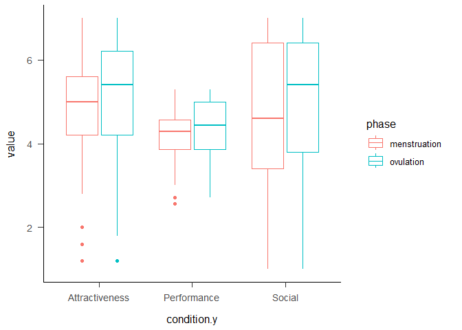
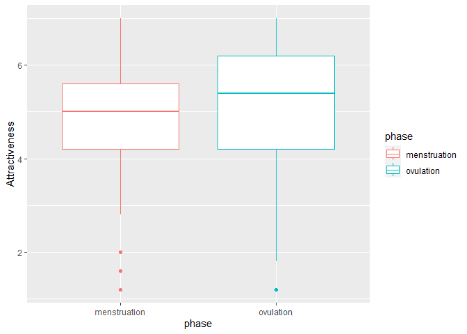
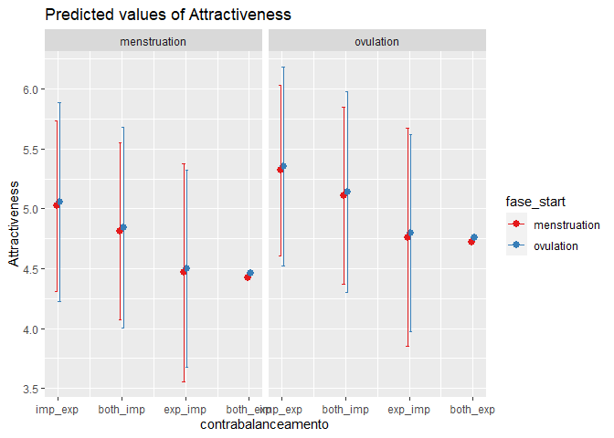

Self-esteem across the menstrual cycle
================
2023

``` r
library(readxl)
library(dplyr)
```

    ## 
    ## Attaching package: 'dplyr'

    ## The following objects are masked from 'package:stats':
    ## 
    ##     filter, lag

    ## The following objects are masked from 'package:base':
    ## 
    ##     intersect, setdiff, setequal, union

``` r
library(ggplot2)
```

    ## Warning: package 'ggplot2' was built under R version 4.2.2

``` r
library("plotrix")
library(sjPlot)
```

    ## Warning: package 'sjPlot' was built under R version 4.2.3

``` r
brutos = data$`Dados_brutos (3)`
head(brutos)
```

    ##   participant LINE BLOCO        rt correct condition PRIME_VAL PRIME_TYPE
    ## 1       AA556    0     1 0.4174751       0         2  positive      OTHER
    ## 2       AA556    1     1 0.1681083       1         2  positive      OTHER
    ## 3       AA556    2     1 0.5012267       0         2  negative      OTHER
    ## 4       AA556    3     1 0.4864544       1         2  negative      OTHER
    ## 5       AA556    4     1 0.4847672       0         2  negative      OTHER
    ## 6       AA556    5     1 0.5007748       1         2  positive      OTHER
    ##        PICTURE TARGET        PHASE
    ## 1    VPN07.jpg  linda menstruation
    ## 2    VPN09.jpg  capaz menstruation
    ## 3    VPN07.jpg inútil menstruation
    ## 4    VPN04.jpg   feia menstruation
    ## 5    VPN02.jpg triste menstruation
    ## 6 femcon_2.jpg genial menstruation

\#parse target

``` r
for (i in 1:nrow(brutos)){
  if(substr(brutos$TARGET[i],nchar(brutos$TARGET[i])-2,nchar(brutos$TARGET[i])) == "til"){
    brutos$TARGET[i] = "inútil"  
  }
}
```

\#check

``` r
brutos %>%
  mutate(new = case_when(TARGET == "alegre" ~ "positive",
                         TARGET =="capaz" ~ "positive",
                         TARGET == "confiante" ~ "positive",
                         TARGET == "genial" ~ "positive",
                         TARGET == "linda" ~ "positive"
                                ,TRUE ~ 'negative'
                                )) %>% pull(new) -> new

a = new == brutos$PRIME_VAL 
soma = sum(a, na.rm = TRUE) # best way to count TRUE values
soma == length(a)
```

    ## [1] TRUE

\#check participant’s id

``` r
summary(factor(brutos$participant))
```

    ## AA556 AA696 ab116 AF841 av734 BF401 BJ960 CA306 CC522 CJ335 cj967 CJ967 EG406 
    ##   452   513   446   526   285   491   508   359   101   479   242   261   520 
    ## GA454 GJ487 IJ887 JJ997 Lf380 LF380 MA007 MA565 ma889 MA889 MA929 MA969 mb968 
    ##   458   492   433   385   224   207   511   328   145   175   312   472   444 
    ## ME324 mj243 MJ690 MJ803 MM350 MM533 MM586 MM714 MP177 MR971 NA210 nj182 NJ182 
    ##   471   436   137   412   425   363   459   437   536   331   481   166   146 
    ## nj267 NJ267 OR883 PF580 rf539 RF539 RJ673 RR863 SJ292 SJ302 sj313 SJ313 SJ513 
    ##   209   160   489   505   228   278   441   461   364   451   269   272   444 
    ## SJ874 sm247 sm370 sm416 SM416 SP123 SR421 tp158 TP158 VA606 
    ##   480   411   473   144   169   424   380   226   239   315

``` r
#to lower case all cols
names(brutos) <- tolower(names(brutos))

brutos$participant = tolower(brutos$participant)

#brutos %>% group_by(participant) %>% count()
```

#### Apa theme

``` r
#apa
theme_apa <- function(base_size = 12, base_family = "", box = FALSE) {
  adapted_theme <- ggplot2::theme_bw(base_size, base_family) +
    ggplot2::theme(
      plot.title = ggplot2::element_text(size = ggplot2::rel(1.1), margin = ggplot2::margin(0, 0, ggplot2::rel(14), 0), hjust = 0.5)
      , plot.subtitle = ggplot2::element_text(size = ggplot2::rel(0.8), margin = ggplot2::margin(ggplot2::rel(-7), 0, ggplot2::rel(14), 0), hjust = 0.5)

      # , axis.title = ggplot2::element_text(size = ggplot2::rel(1.1))
      , axis.title.x = ggplot2::element_text(size = ggplot2::rel(1), lineheight = ggplot2::rel(1.1), margin = ggplot2::margin(ggplot2::rel(12), 0, 0, 0))
      , axis.title.x.top = ggplot2::element_text(size = ggplot2::rel(1), lineheight = ggplot2::rel(1.1), margin = ggplot2::margin(0, 0, ggplot2::rel(12), 0))
      , axis.title.y = ggplot2::element_text(size = ggplot2::rel(1), lineheight = ggplot2::rel(1.1), margin = ggplot2::margin(0, ggplot2::rel(12), 0, 0))
      , axis.title.y.right = ggplot2::element_text(size = ggplot2::rel(1), lineheight = ggplot2::rel(1.1), margin = ggplot2::margin(0, 0, 0, ggplot2::rel(12)))
      , axis.ticks.length = ggplot2::unit(ggplot2::rel(6), "points")
      , axis.text = ggplot2::element_text(size = ggplot2::rel(0.9))
      , axis.text.x = ggplot2::element_text(size = ggplot2::rel(1), margin = ggplot2::margin(ggplot2::rel(6), 0, 0, 0))
      , axis.text.y = ggplot2::element_text(size = ggplot2::rel(1), margin = ggplot2::margin(0, ggplot2::rel(6), 0, 0))
      , axis.text.y.right = ggplot2::element_text(size = ggplot2::rel(1), margin = ggplot2::margin(0, 0, 0, ggplot2::rel(6)))
      , axis.line = ggplot2::element_line()
      # , axis.line.x = ggplot2::element_line()
      # , axis.line.y = ggplot2::element_line()

      , legend.title = ggplot2::element_text()
      , legend.key = ggplot2::element_rect(fill = NA, color = NA)
      , legend.key.width = ggplot2::unit(ggplot2::rel(20), "points")
      , legend.key.height = ggplot2::unit(ggplot2::rel(20), "points")
      , legend.margin = ggplot2::margin(
        t = ggplot2::rel(16)
        , r = ggplot2::rel(16)
        , b = ggplot2::rel(16)
        , l = ggplot2::rel(16)
        , unit = "points"
      )

      , panel.spacing = ggplot2::unit(ggplot2::rel(14), "points")
      , panel.grid.major.x = ggplot2::element_blank()
      , panel.grid.minor.x = ggplot2::element_blank()
      , panel.grid.major.y = ggplot2::element_blank()
      , panel.grid.minor.y = ggplot2::element_blank()

      , strip.background = ggplot2::element_rect(fill = NA, color = NA)
      , strip.text.x = ggplot2::element_text(size = ggplot2::rel(1.2), margin = ggplot2::margin(0, 0, ggplot2::rel(10), 0))
      , strip.text.y = ggplot2::element_text(size = ggplot2::rel(1.2), margin = ggplot2::margin(0, 0, 0, ggplot2::rel(10)))
    )

  if(box) {
    adapted_theme <- adapted_theme + ggplot2::theme(panel.border = ggplot2::element_rect(color = "black"))
  } else {
    adapted_theme <- adapted_theme + ggplot2::theme(panel.border = ggplot2::element_blank())
  }

  adapted_theme
}
```

``` r
plot = ggplot(data = brutos, aes(x = prime_type, y = rt, fill = interaction(correct,prime_type))) + geom_boxplot() + facet_wrap(~phase) + theme_apa()

plot
```

<!-- -->

``` r
brutos2 = brutos %>% group_by(phase, prime_type, prime_val,target) %>% summarise(soma = sum(correct)) 
```

    ## `summarise()` has grouped output by 'phase', 'prime_type', 'prime_val'. You can
    ## override using the `.groups` argument.

``` r
for (i in 1:nrow(brutos2)){
  if(brutos2$prime_type[i] == "OTHER"){
    brutos2$soma[i] = brutos2$soma[i]/5
  }
}

brutos2
```

    ## # A tibble: 40 × 5
    ## # Groups:   phase, prime_type, prime_val [8]
    ##    phase        prime_type prime_val target     soma
    ##    <chr>        <chr>      <chr>     <chr>     <dbl>
    ##  1 menstruation OTHER      negative  falhada    116.
    ##  2 menstruation OTHER      negative  feia       117.
    ##  3 menstruation OTHER      negative  insegura   121.
    ##  4 menstruation OTHER      negative  inútil     132 
    ##  5 menstruation OTHER      negative  triste     123.
    ##  6 menstruation OTHER      positive  alegre     150.
    ##  7 menstruation OTHER      positive  capaz      138.
    ##  8 menstruation OTHER      positive  confiante  141.
    ##  9 menstruation OTHER      positive  genial     134 
    ## 10 menstruation OTHER      positive  linda      166 
    ## # … with 30 more rows

``` r
brutos2%>% 
  ggplot(aes(x = target, y = soma, fill = prime_val)) +
    geom_bar(position="dodge",stat = "identity")+
    #scale_fill_manual(values = c ('royalblue1', 'grey2', 'yellow1'))+
    ylab("Values")+
    xlab("")+
    facet_grid(prime_type ~ phase) + theme_apa()+
  theme(axis.text.x = element_text(angle = 95, vjust = 0.5,hjust = 1)) -> plot

plot
```

<!-- --> \#filter
by beautiful and ugly

``` r
brutos2 %>% subset(target %in% c("linda","feia")) %>% 
  ggplot(aes(x = target, y = soma, fill = prime_val)) +
    geom_bar(position="dodge",stat = "identity")+
    #scale_fill_manual(values = c ('royalblue1', 'grey2', 'yellow1'))+
    ylab("Values")+
    xlab("")+
    facet_grid(prime_type ~ phase) + theme_apa()+
  theme(axis.text.x = element_text(angle = 95, vjust = 0.5,hjust = 1)) 
```

<!-- -->

``` r
brutos2 %>%  group_by(phase,prime_type, prime_val) %>% summarise(soma = mean(soma)) %>% 
  ggplot(aes(x = prime_val, y = soma)) +
    geom_bar(position="dodge",stat = "identity")+
    #scale_fill_manual(values = c ('royalblue1', 'grey2', 'yellow1'))+
    ylab("Values")+
    xlab("")+
    facet_grid(prime_type ~ phase) + theme_apa()+
  theme(axis.text.x = element_text(angle = 95, vjust = 0.5,hjust = 1)) 
```

    ## `summarise()` has grouped output by 'phase', 'prime_type'. You can override
    ## using the `.groups` argument.

<!-- -->

``` r
#brutos = brutos %>% subset(target %in% c("linda","feia")) 
```

``` r
brutos %>% group_by(participant, phase) %>% summarise(soma = sum(correct)) %>% arrange(desc(soma)) ->grafico
```

    ## `summarise()` has grouped output by 'participant'. You can override using the
    ## `.groups` argument.

``` r
brutos %>% filter(participant == "sm247" & phase == "ovulation")
```

    ##     participant  line bloco        rt correct condition prime_val prime_type
    ## 1         sm247 19790     1 0.4674964       0         6  positive      OTHER
    ## 2         sm247 19791     1 0.4521769       0         6  positive      OTHER
    ## 3         sm247 19792     1 0.5011745       0         6  negative      OTHER
    ## 4         sm247 19793     1 0.4510929       0         6  negative      OTHER
    ## 5         sm247 19794     1 0.4508133       0         6  positive      OTHER
    ## 6         sm247 19795     1 0.4344232       0         6  negative      OTHER
    ## 7         sm247 19796     1 0.4698755       0         6  negative      OTHER
    ## 8         sm247 19797     1 0.4341421       0         6  positive       SELF
    ## 9         sm247 19798     1 0.5011849       0         6  positive      OTHER
    ## 10        sm247 19799     1 0.4857185       0         6  negative      OTHER
    ## 11        sm247 19800     1 0.3848714       0         6  negative      OTHER
    ## 12        sm247 19801     1 0.3855569       0         6  positive      OTHER
    ## 13        sm247 19802     1 0.4834484       0         6  positive      OTHER
    ## 14        sm247 19803     1 0.4008684       0         6  positive      OTHER
    ## 15        sm247 19804     1 0.3511715       0         6  negative       SELF
    ## 16        sm247 19805     1 0.3175957       0         6  negative      OTHER
    ## 17        sm247 19806     1 0.3679094       0         6  positive      OTHER
    ## 18        sm247 19807     1 0.5179928       0         6  positive      OTHER
    ## 19        sm247 19808     1 0.4023589       0         6  negative       SELF
    ## 20        sm247 19809     1 0.4342904       0         6  negative      OTHER
    ## 21        sm247 19810     1 0.5010443       0         6  negative      OTHER
    ## 22        sm247 19811     1 0.4849820       0         6  positive      OTHER
    ## 23        sm247 19812     1 0.5344183       0         6  negative      OTHER
    ## 24        sm247 19813     1 0.5197535       0         6  positive      OTHER
    ## 25        sm247 19814     1 0.4844842       0         6  negative      OTHER
    ## 26        sm247 19815     1 0.3341206       0         6  positive      OTHER
    ## 27        sm247 19816     1 0.5178684       0         6  positive       SELF
    ## 28        sm247 19817     1 0.4674149       0         6  positive      OTHER
    ## 29        sm247 19818     1 0.4676527       0         6  negative      OTHER
    ## 30        sm247 19819     1 0.4186724       0         6  negative      OTHER
    ## 31        sm247 19820     1 0.5356229       0         6  negative       SELF
    ## 32        sm247 19821     1 0.4836742       0         6  positive      OTHER
    ## 33        sm247 19822     1 0.4343663       0         6  positive      OTHER
    ## 34        sm247 19823     1 0.5344218       0         6  negative      OTHER
    ## 35        sm247 19824     1 0.4513105       0         6  positive      OTHER
    ## 36        sm247 19825     1 0.5344159       0         6  negative      OTHER
    ## 37        sm247 19826     1 0.5009787       0         6  positive       SELF
    ## 38        sm247 19827     1 0.4848799       0         6  negative      OTHER
    ## 39        sm247 19828     1 0.4007492       0         6  positive      OTHER
    ## 40        sm247 19829     1 0.5341063       0         6  negative      OTHER
    ## 41        sm247 19830     1 0.5174623       0         6  negative      OTHER
    ## 42        sm247 19831     1 0.4352516       0         6  positive      OTHER
    ## 43        sm247 19832     1 0.5025225       0         6  positive       SELF
    ## 44        sm247 19833     1 0.5006729       0         6  positive      OTHER
    ## 45        sm247 19834     1 0.4178976       0         6  negative      OTHER
    ## 46        sm247 19835     1 0.4507601       0         6  negative      OTHER
    ## 47        sm247 19836     1 0.4509109       0         6  negative      OTHER
    ## 48        sm247 19837     2 0.4897989       0         6  negative      OTHER
    ## 49        sm247 19838     2 0.4346293       0         6  positive      OTHER
    ## 50        sm247 19839     2 0.4840542       0         6  positive      OTHER
    ## 51        sm247 19840     2 0.4344402       0         6  negative       SELF
    ## 52        sm247 19841     2 0.5183676       0         6  negative      OTHER
    ## 53        sm247 19842     2 0.5009796       0         6  positive      OTHER
    ## 54        sm247 19843     2 0.4688263       0         6  negative       SELF
    ## 55        sm247 19844     2 0.5007160       0         6  positive      OTHER
    ## 56        sm247 19845     2 0.5366702       0         6  negative      OTHER
    ## 57        sm247 19846     2 0.3845657       0         6  positive       SELF
    ## 58        sm247 19847     2 0.3846681       0         6  positive      OTHER
    ## 59        sm247 19848     2 0.4028256       0         6  positive      OTHER
    ## 60        sm247 19849     2 0.4347154       0         6  negative      OTHER
    ## 61        sm247 19850     2 0.5342184       0         6  positive      OTHER
    ## 62        sm247 19851     2 0.5011734       0         6  positive      OTHER
    ## 63        sm247 19852     2 0.4177709       0         6  negative       SELF
    ## 64        sm247 19853     2 0.4854849       0         6  negative      OTHER
    ## 65        sm247 19854     2 0.5200114       0         6  negative      OTHER
    ## 66        sm247 19855     2 0.5333705       0         6  negative      OTHER
    ## 67        sm247 19856     2 0.5176128       0         6  positive      OTHER
    ## 68        sm247 19857     2 0.4204948       0         6  positive      OTHER
    ## 69        sm247 19858     2 0.4344740       0         6  positive      OTHER
    ## 70        sm247 19859     2 0.5359400       0         6  negative      OTHER
    ## 71        sm247 19860     2 0.4679693       0         6  negative      OTHER
    ## 72        sm247 19861     2 0.4011132       0         6  positive       SELF
    ## 73        sm247 19862     2 0.4011484       0         6  negative      OTHER
    ## 74        sm247 19863     2 0.4859056       0         6  negative      OTHER
    ## 75        sm247 19864     2 0.5009466       0         6  positive       SELF
    ## 76        sm247 19865     2 0.4192506       0         6  negative      OTHER
    ## 77        sm247 19866     2 0.5331734       0         6  positive      OTHER
    ## 78        sm247 19867     2 0.3840754       0         6  negative      OTHER
    ## 79        sm247 19868     2 0.4344442       0         6  positive      OTHER
    ## 80        sm247 19869     2 0.5012320       0         6  negative       SELF
    ## 81        sm247 19870     2 0.4845111       0         6  positive      OTHER
    ## 82        sm247 19871     2 0.4341650       0         6  positive      OTHER
    ## 83        sm247 19872     2 0.4023922       0         6  negative      OTHER
    ## 84        sm247 19873     2 0.3679573       0         6  negative      OTHER
    ## 85        sm247 19874     2 0.4532435       0         6  positive       SELF
    ## 86        sm247 19875     2 0.4509183       0         6  negative      OTHER
    ## 87        sm247 19876     2 0.3526781       0         6  negative      OTHER
    ## 88        sm247 19877     2 0.5341626       0         6  positive      OTHER
    ## 89        sm247 19878     2 0.4840129       0         6  negative      OTHER
    ## 90        sm247 19879     2 0.4847272       0         6  positive      OTHER
    ## 91        sm247 19880     3 0.4502261       0         6  positive      OTHER
    ## 92        sm247 19881     3 0.4507128       0         6  negative      OTHER
    ## 93        sm247 19882     3 0.5181357       0         6  negative      OTHER
    ## 94        sm247 19883     3 0.2861243       0         6  positive      OTHER
    ## 95        sm247 19884     3 0.4033535       0         6  negative      OTHER
    ## 96        sm247 19885     3 0.3174843       0         6  negative      OTHER
    ## 97        sm247 19886     3 0.4008044       0         6  positive      OTHER
    ## 98        sm247 19887     3 0.4678627       0         6  negative      OTHER
    ## 99        sm247 19888     3 0.4842506       0         6  negative      OTHER
    ## 100       sm247 19889     3 0.3510046       0         6  negative       SELF
    ## 101       sm247 19890     3 0.4175070       0         6  positive      OTHER
    ## 102       sm247 19891     3 0.4508930       0         6  negative      OTHER
    ## 103       sm247 19892     3 0.3514923       0         6  negative       SELF
    ## 104       sm247 19893     3 0.3858368       0         6  positive      OTHER
    ## 105       sm247 19894     3 0.5022414       0         6  negative      OTHER
    ## 106       sm247 19895     3 0.3995272       0         6  positive      OTHER
    ## 107       sm247 19896     3 0.4510103       0         6  positive      OTHER
    ## 108       sm247 19897     3 0.3174335       0         6  positive      OTHER
    ## 109       sm247 19898     3 0.5342771       0         6  negative      OTHER
    ## 110       sm247 19899     3 0.4679262       0         6  positive      OTHER
    ## 111       sm247 19900     3 0.5009661       0         6  positive      OTHER
    ## 112       sm247 19901     3 0.4671894       0         6  negative      OTHER
    ## 113       sm247 19902     3 0.5009689       0         6  negative      OTHER
    ## 114       sm247 19903     3 0.4841546       0         6  positive      OTHER
    ## 115       sm247 19904     3 0.4849433       0         6  positive      OTHER
    ## 116       sm247 19905     3 0.5014788       0         6  positive       SELF
    ## 117       sm247 19906     3 0.5015432       0         6  negative      OTHER
    ## 118       sm247 19907     3 0.4687574       0         6  positive      OTHER
    ## 119       sm247 19908     3 0.5020383       0         6  positive      OTHER
    ## 120       sm247 19909     3 0.3353023       0         6  negative       SELF
    ## 121       sm247 19910     3 0.5347053       0         6  negative      OTHER
    ## 122       sm247 19911     3 0.5009304       0         6  positive      OTHER
    ## 123       sm247 19912     3 0.4009999       0         6  positive      OTHER
    ## 124       sm247 19913     3 0.4345361       0         6  positive      OTHER
    ## 125       sm247 19914     3 0.4508910       0         6  negative      OTHER
    ## 126       sm247 19915     3 0.3677277       0         6  positive      OTHER
    ## 127       sm247 19916     3 0.5174371       0         6  negative      OTHER
    ## 128       sm247 19917     3 0.4181706       0         6  positive       SELF
    ## 129       sm247 19918     3 0.4673117       0         6  negative      OTHER
    ## 130       sm247 19919     3 0.4860722       0         6  negative      OTHER
    ## 131       sm247 19920     3 0.5017418       0         6  positive      OTHER
    ## 132       sm247 19921     3 0.5021466       0         6  positive      OTHER
    ## 133       sm247 19922     3 0.4841736       0         6  negative      OTHER
    ## 134       sm247 19923     3 0.3508092       0         6  positive      OTHER
    ## 135       sm247 19924     3 0.4191426       0         6  negative      OTHER
    ## 136       sm247 19925     3 0.3509932       0         6  positive      OTHER
    ## 137       sm247 19926     4 0.4009099       0         6  positive      OTHER
    ## 138       sm247 19927     4 0.3842980       0         6  negative      OTHER
    ## 139       sm247 19928     4 0.4679836       0         6  negative      OTHER
    ## 140       sm247 19929     4 0.4192859       0         6  negative      OTHER
    ## 141       sm247 19930     4 0.4693128       0         6  positive       SELF
    ## 142       sm247 19931     4 0.4346226       0         6  positive      OTHER
    ## 143       sm247 19932     4 0.4025537       0         6  positive      OTHER
    ## 144       sm247 19933     4 0.4685008       0         6  negative       SELF
    ## 145       sm247 19934     4 0.3507528       0         6  positive      OTHER
    ## 146       sm247 19935     4 0.3854171       0         6  negative      OTHER
    ## 147       sm247 19936     4 0.4508484       0         6  positive      OTHER
    ## 148       sm247 19937     4 0.5009964       0         6  positive      OTHER
    ## 149       sm247 19938     4 0.4173876       0         6  positive       SELF
    ## 150       sm247 19939     4 0.4181405       0         6  negative      OTHER
    ## 151       sm247 19940     4 0.3011461       0         6  negative      OTHER
    ## 152       sm247 19941     4 0.3353052       0         6  positive      OTHER
    ## 153       sm247 19942     4 0.4347384       0         6  negative      OTHER
    ## 154       sm247 19943     4 0.2854640       0         6  negative      OTHER
    ## 155       sm247 19944     4 0.4009709       0         6  positive      OTHER
    ## 156       sm247 19945     4 0.4679760       0         6  negative       SELF
    ## 157       sm247 19946     4 0.3173915       0         6  positive      OTHER
    ## 158       sm247 19947     4 0.4508553       0         6  negative      OTHER
    ## 159       sm247 19948     4 0.2685572       0         6  positive      OTHER
    ## 160       sm247 19949     4 0.4676154       0         6  positive       SELF
    ## 161       sm247 19950     4 0.3176328       0         6  negative      OTHER
    ## 162       sm247 19951     4 0.2841113       0         6  positive      OTHER
    ## 163       sm247 19952     4 0.2842155       0         6  positive       SELF
    ## 164       sm247 19953     4 0.4355258       0         6  negative      OTHER
    ## 165       sm247 19954     4 0.4007748       0         6  positive      OTHER
    ## 166       sm247 19955     4 0.4349961       0         6  positive      OTHER
    ## 167       sm247 19956     4 0.4014342       0         6  negative      OTHER
    ## 168       sm247 19957     4 0.3510324       0         6  positive      OTHER
    ## 169       sm247 19958     4 0.3513703       0         6  negative      OTHER
    ## 170       sm247 19959     4 0.2173601       0         6  positive      OTHER
    ## 171       sm247 19960     4 0.3341493       0         6  negative       SELF
    ## 172       sm247 19961     4 0.3189096       0         6  negative      OTHER
    ## 173       sm247 19962     4 0.3508882       0         6  positive      OTHER
    ## 174       sm247 19963     4 0.2841571       0         6  negative      OTHER
    ## 175       sm247 19964     4 0.2667464       0         6  negative      OTHER
    ## 176       sm247 19965     4 0.3840136       0         6  positive      OTHER
    ## 177       sm247 19966     4 0.3841297       0         6  positive      OTHER
    ## 178       sm247 19967     4 0.3513059       0         6  negative      OTHER
    ## 179       sm247 19968     4 0.3345084       0         6  positive      OTHER
    ## 180       sm247 19969     4 0.3328989       0         6  positive      OTHER
    ## 181       sm247 19970     4 0.3997372       0         6  negative       SELF
    ## 182       sm247 19971     4 0.3006902       0         6  positive      OTHER
    ## 183       sm247 19972     4 0.4341801       0         6  negative      OTHER
    ## 184       sm247 19973     4 0.4848209       0         6  positive      OTHER
    ## 185       sm247 19974     4 0.3175917       0         6  positive      OTHER
    ## 186       sm247 19975     4 0.2674872       0         6  negative      OTHER
    ## 187       sm247 19976     4 0.5173605       0         6  negative      OTHER
    ## 188       sm247 19977     4 0.3684626       0         6  negative      OTHER
    ## 189       sm247 19978     4 0.5174048       0         6  negative      OTHER
    ## 190       sm247 19979     4 0.5007483       0         6  positive       SELF
    ## 191       sm247 19980     5 0.5183107       0         6  negative      OTHER
    ## 192       sm247 19981     5 0.3678943       0         6  positive      OTHER
    ## 193       sm247 19982     5 0.3344314       0         6  negative      OTHER
    ## 194       sm247 19983     5 0.3729784       0         6  negative      OTHER
    ## 195       sm247 19984     5 0.4099587       0         6  negative      OTHER
    ## 196       sm247 19985     5 0.3034564       0         6  positive      OTHER
    ## 197       sm247 19986     5 0.4344100       0         6  negative       SELF
    ## 198       sm247 19987     5 0.4697801       0         6  positive      OTHER
    ## 199       sm247 19988     5 0.3871836       0         6  negative      OTHER
    ## 200       sm247 19989     5 0.3013181       0         6  positive       SELF
    ## 201       sm247 19990     5 0.3858602       0         6  positive      OTHER
    ## 202       sm247 19991     5 0.5359645       0         6  positive      OTHER
    ## 203       sm247 19992     5 0.4563309       0         6  negative      OTHER
    ## 204       sm247 19993     5 0.4513724       0         6  negative      OTHER
    ## 205       sm247 19994     5 0.4173298       0         6  positive      OTHER
    ## 206       sm247 19995     5 0.5174869       0         6  negative      OTHER
    ## 207       sm247 19996     5 0.4182102       0         6  positive      OTHER
    ## 208       sm247 19997     5 0.2841603       0         6  positive      OTHER
    ## 209       sm247 19998     5 0.3345461       0         6  negative      OTHER
    ## 210       sm247 19999     5 0.4013882       0         6  negative      OTHER
    ## 211       sm247 20000     5 0.4179952       0         6  positive      OTHER
    ## 212       sm247 20001     5 0.3675107       0         6  positive      OTHER
    ## 213       sm247 20002     5 0.3510283       0         6  negative      OTHER
    ## 214       sm247 20003     5 0.5018044       0         6  negative      OTHER
    ## 215       sm247 20004     5 0.3687433       0         6  negative       SELF
    ## 216       sm247 20005     5 0.3350652       0         6  positive      OTHER
    ## 217       sm247 20006     5 0.3020361       0         6  positive      OTHER
    ## 218       sm247 20007     5 0.3858056       0         6  negative      OTHER
    ## 219       sm247 20008     5 0.3672687       0         6  negative      OTHER
    ## 220       sm247 20009     5 0.3514092       0         6  negative      OTHER
    ## 221       sm247 20010     5 0.3514260       0         6  negative      OTHER
    ## 222       sm247 20011     5 0.3676858       0         6  positive      OTHER
    ## 223       sm247 20012     5 0.5178132       0         6  positive      OTHER
    ## 224       sm247 20013     5 0.4513174       0         6  negative       SELF
    ## 225       sm247 20014     5 0.2858484       0         6  positive      OTHER
    ## 226       sm247 20015     5 0.4173693       0         6  positive      OTHER
    ## 227       sm247 20016     5 0.4008101       0         6  negative      OTHER
    ## 228       sm247 20017     5 0.5342371       0         6  positive       SELF
    ## 229       sm247 20018     5 0.4041297       0         6  negative      OTHER
    ## 230       sm247 20019     5 0.4679967       0         6  negative      OTHER
    ## 231       sm247 20020     5 0.4690182       0         6  negative      OTHER
    ## 232       sm247 20021     5 0.4700376       0         6  positive      OTHER
    ## 233       sm247 20022     5 0.4347005       0         6  positive      OTHER
    ## 234       sm247 20023     5 0.5354074       0         6  negative      OTHER
    ## 235       sm247 20024     5 0.4012504       0         6  negative      OTHER
    ## 236       sm247 20025     5 0.3676768       0         6  negative       SELF
    ## 237       sm247 20026     5 0.3012495       0         6  positive      OTHER
    ## 238       sm247 20027     5 0.4011160       0         6  negative      OTHER
    ## 239       sm247 20028     5 0.3679231       0         6  positive      OTHER
    ## 240       sm247 20029     5 0.3344243       0         6  positive      OTHER
    ## 241       sm247 20030     5 0.4681297       0         6  positive       SELF
    ##          picture    target     phase
    ## 1      VPN02.jpg    genial ovulation
    ## 2      VPN07.jpg     linda ovulation
    ## 3      VPN04.jpg   falhada ovulation
    ## 4   femcon_2.jpg  insegura ovulation
    ## 5      VPN09.jpg     capaz ovulation
    ## 6      VPN07.jpg    inútil ovulation
    ## 7      VPN02.jpg    triste ovulation
    ## 8   femcon_1.jpg confiante ovulation
    ## 9   femcon_2.jpg    genial ovulation
    ## 10     VPN09.jpg   falhada ovulation
    ## 11     VPN02.jpg  insegura ovulation
    ## 12     VPN04.jpg     linda ovulation
    ## 13     VPN07.jpg    alegre ovulation
    ## 14  femcon_2.jpg     capaz ovulation
    ## 15  femcon_1.jpg    inútil ovulation
    ## 16     VPN07.jpg   falhada ovulation
    ## 17     VPN02.jpg     linda ovulation
    ## 18     VPN09.jpg confiante ovulation
    ## 19  femcon_1.jpg    triste ovulation
    ## 20     VPN07.jpg  insegura ovulation
    ## 21     VPN02.jpg      feia ovulation
    ## 22     VPN04.jpg     capaz ovulation
    ## 23     VPN04.jpg  insegura ovulation
    ## 24  femcon_2.jpg     linda ovulation
    ## 25     VPN07.jpg      feia ovulation
    ## 26     VPN02.jpg    alegre ovulation
    ## 27  femcon_1.jpg     capaz ovulation
    ## 28     VPN07.jpg confiante ovulation
    ## 29  femcon_2.jpg    triste ovulation
    ## 30     VPN04.jpg    inútil ovulation
    ## 31  femcon_1.jpg   falhada ovulation
    ## 32     VPN02.jpg confiante ovulation
    ## 33     VPN09.jpg    alegre ovulation
    ## 34  femcon_2.jpg   falhada ovulation
    ## 35     VPN09.jpg     linda ovulation
    ## 36     VPN02.jpg    inútil ovulation
    ## 37  femcon_1.jpg    genial ovulation
    ## 38     VPN04.jpg    triste ovulation
    ## 39     VPN07.jpg     capaz ovulation
    ## 40     VPN09.jpg  insegura ovulation
    ## 41  femcon_2.jpg      feia ovulation
    ## 42     VPN07.jpg    genial ovulation
    ## 43  femcon_1.jpg     linda ovulation
    ## 44     VPN04.jpg    alegre ovulation
    ## 45     VPN09.jpg      feia ovulation
    ## 46     VPN07.jpg    triste ovulation
    ## 47  femcon_2.jpg    inútil ovulation
    ## 48     VPN09.jpg      feia ovulation
    ## 49     VPN02.jpg     linda ovulation
    ## 50     VPN04.jpg confiante ovulation
    ## 51  femcon_1.jpg   falhada ovulation
    ## 52  femcon_2.jpg  insegura ovulation
    ## 53     VPN04.jpg    genial ovulation
    ## 54  femcon_1.jpg    triste ovulation
    ## 55     VPN07.jpg     capaz ovulation
    ## 56     VPN09.jpg    triste ovulation
    ## 57  femcon_1.jpg     linda ovulation
    ## 58     VPN04.jpg    alegre ovulation
    ## 59     VPN02.jpg confiante ovulation
    ## 60  femcon_2.jpg    inútil ovulation
    ## 61     VPN07.jpg    alegre ovulation
    ## 62     VPN04.jpg     capaz ovulation
    ## 63  femcon_1.jpg      feia ovulation
    ## 64     VPN02.jpg    triste ovulation
    ## 65     VPN09.jpg    inútil ovulation
    ## 66     VPN07.jpg  insegura ovulation
    ## 67     VPN07.jpg    genial ovulation
    ## 68  femcon_2.jpg     linda ovulation
    ## 69     VPN02.jpg    alegre ovulation
    ## 70     VPN07.jpg    triste ovulation
    ## 71     VPN09.jpg   falhada ovulation
    ## 72  femcon_1.jpg confiante ovulation
    ## 73     VPN04.jpg      feia ovulation
    ## 74  femcon_2.jpg    triste ovulation
    ## 75  femcon_1.jpg     capaz ovulation
    ## 76  femcon_2.jpg   falhada ovulation
    ## 77     VPN02.jpg    genial ovulation
    ## 78     VPN04.jpg    inútil ovulation
    ## 79     VPN07.jpg confiante ovulation
    ## 80  femcon_1.jpg  insegura ovulation
    ## 81  femcon_2.jpg     capaz ovulation
    ## 82     VPN09.jpg confiante ovulation
    ## 83     VPN04.jpg    triste ovulation
    ## 84     VPN02.jpg    inútil ovulation
    ## 85  femcon_1.jpg    alegre ovulation
    ## 86  femcon_2.jpg      feia ovulation
    ## 87     VPN07.jpg   falhada ovulation
    ## 88     VPN04.jpg     linda ovulation
    ## 89     VPN02.jpg  insegura ovulation
    ## 90     VPN09.jpg    genial ovulation
    ## 91  femcon_2.jpg confiante ovulation
    ## 92     VPN04.jpg   falhada ovulation
    ## 93     VPN02.jpg  insegura ovulation
    ## 94     VPN07.jpg    alegre ovulation
    ## 95     VPN04.jpg    inútil ovulation
    ## 96  femcon_2.jpg      feia ovulation
    ## 97     VPN09.jpg     linda ovulation
    ## 98     VPN07.jpg    triste ovulation
    ## 99     VPN02.jpg      feia ovulation
    ## 100 femcon_1.jpg   falhada ovulation
    ## 101    VPN04.jpg     linda ovulation
    ## 102 femcon_2.jpg    inútil ovulation
    ## 103 femcon_1.jpg    triste ovulation
    ## 104    VPN02.jpg    genial ovulation
    ## 105    VPN09.jpg  insegura ovulation
    ## 106 femcon_2.jpg    alegre ovulation
    ## 107    VPN07.jpg     capaz ovulation
    ## 108    VPN02.jpg confiante ovulation
    ## 109    VPN09.jpg    triste ovulation
    ## 110    VPN04.jpg    genial ovulation
    ## 111    VPN02.jpg     capaz ovulation
    ## 112    VPN04.jpg  insegura ovulation
    ## 113    VPN09.jpg   falhada ovulation
    ## 114    VPN07.jpg     linda ovulation
    ## 115    VPN04.jpg     capaz ovulation
    ## 116 femcon_1.jpg confiante ovulation
    ## 117 femcon_2.jpg  insegura ovulation
    ## 118    VPN02.jpg    alegre ovulation
    ## 119    VPN09.jpg    genial ovulation
    ## 120 femcon_1.jpg    inútil ovulation
    ## 121 femcon_2.jpg    triste ovulation
    ## 122    VPN02.jpg     linda ovulation
    ## 123    VPN04.jpg confiante ovulation
    ## 124 femcon_2.jpg    genial ovulation
    ## 125    VPN07.jpg  insegura ovulation
    ## 126    VPN09.jpg    alegre ovulation
    ## 127    VPN02.jpg   falhada ovulation
    ## 128 femcon_1.jpg     capaz ovulation
    ## 129    VPN04.jpg    triste ovulation
    ## 130    VPN02.jpg    inútil ovulation
    ## 131    VPN07.jpg    genial ovulation
    ## 132 femcon_2.jpg     capaz ovulation
    ## 133    VPN02.jpg    triste ovulation
    ## 134    VPN09.jpg confiante ovulation
    ## 135    VPN07.jpg   falhada ovulation
    ## 136 femcon_2.jpg     linda ovulation
    ## 137    VPN02.jpg     linda ovulation
    ## 138    VPN09.jpg  insegura ovulation
    ## 139    VPN04.jpg   falhada ovulation
    ## 140 femcon_2.jpg    triste ovulation
    ## 141 femcon_1.jpg    alegre ovulation
    ## 142    VPN07.jpg confiante ovulation
    ## 143    VPN09.jpg    genial ovulation
    ## 144 femcon_1.jpg    inútil ovulation
    ## 145    VPN04.jpg     capaz ovulation
    ## 146    VPN07.jpg    triste ovulation
    ## 147 femcon_2.jpg    genial ovulation
    ## 148    VPN02.jpg confiante ovulation
    ## 149 femcon_1.jpg     linda ovulation
    ## 150    VPN04.jpg      feia ovulation
    ## 151    VPN02.jpg    inútil ovulation
    ## 152    VPN07.jpg     capaz ovulation
    ## 153    VPN04.jpg  insegura ovulation
    ## 154    VPN09.jpg    triste ovulation
    ## 155 femcon_2.jpg    alegre ovulation
    ## 156 femcon_1.jpg      feia ovulation
    ## 157    VPN09.jpg     linda ovulation
    ## 158    VPN07.jpg   falhada ovulation
    ## 159    VPN04.jpg confiante ovulation
    ## 160 femcon_1.jpg    genial ovulation
    ## 161 femcon_2.jpg    inútil ovulation
    ## 162    VPN02.jpg     capaz ovulation
    ## 163 femcon_1.jpg confiante ovulation
    ## 164    VPN02.jpg  insegura ovulation
    ## 165 femcon_2.jpg     linda ovulation
    ## 166    VPN07.jpg    alegre ovulation
    ## 167    VPN04.jpg    inútil ovulation
    ## 168    VPN09.jpg     capaz ovulation
    ## 169    VPN09.jpg      feia ovulation
    ## 170    VPN02.jpg    genial ovulation
    ## 171 femcon_1.jpg   falhada ovulation
    ## 172    VPN04.jpg    triste ovulation
    ## 173 femcon_2.jpg confiante ovulation
    ## 174    VPN07.jpg    inútil ovulation
    ## 175    VPN02.jpg      feia ovulation
    ## 176 femcon_2.jpg     capaz ovulation
    ## 177    VPN07.jpg    genial ovulation
    ## 178    VPN09.jpg   falhada ovulation
    ## 179    VPN04.jpg    alegre ovulation
    ## 180    VPN07.jpg     linda ovulation
    ## 181 femcon_1.jpg    triste ovulation
    ## 182    VPN02.jpg    alegre ovulation
    ## 183 femcon_2.jpg      feia ovulation
    ## 184    VPN04.jpg    genial ovulation
    ## 185    VPN09.jpg confiante ovulation
    ## 186 femcon_2.jpg   falhada ovulation
    ## 187    VPN07.jpg  insegura ovulation
    ## 188    VPN02.jpg    triste ovulation
    ## 189    VPN09.jpg    inútil ovulation
    ## 190 femcon_1.jpg     capaz ovulation
    ## 191    VPN02.jpg   falhada ovulation
    ## 192    VPN09.jpg     capaz ovulation
    ## 193    VPN07.jpg  insegura ovulation
    ## 194    VPN04.jpg      feia ovulation
    ## 195    VPN02.jpg    inútil ovulation
    ## 196 femcon_2.jpg confiante ovulation
    ## 197 femcon_1.jpg    triste ovulation
    ## 198    VPN04.jpg    genial ovulation
    ## 199    VPN09.jpg      feia ovulation
    ## 200 femcon_1.jpg     capaz ovulation
    ## 201 femcon_2.jpg    alegre ovulation
    ## 202    VPN07.jpg confiante ovulation
    ## 203    VPN09.jpg   falhada ovulation
    ## 204    VPN04.jpg    triste ovulation
    ## 205    VPN02.jpg     linda ovulation
    ## 206    VPN07.jpg    inútil ovulation
    ## 207    VPN09.jpg     linda ovulation
    ## 208    VPN02.jpg    genial ovulation
    ## 209    VPN04.jpg  insegura ovulation
    ## 210 femcon_2.jpg    triste ovulation
    ## 211    VPN02.jpg     capaz ovulation
    ## 212    VPN07.jpg    alegre ovulation
    ## 213 femcon_2.jpg      feia ovulation
    ## 214    VPN09.jpg    inútil ovulation
    ## 215 femcon_1.jpg   falhada ovulation
    ## 216    VPN04.jpg confiante ovulation
    ## 217    VPN07.jpg    genial ovulation
    ## 218 femcon_2.jpg    inútil ovulation
    ## 219    VPN04.jpg   falhada ovulation
    ## 220    VPN09.jpg  insegura ovulation
    ## 221    VPN02.jpg      feia ovulation
    ## 222    VPN04.jpg    alegre ovulation
    ## 223 femcon_2.jpg     capaz ovulation
    ## 224 femcon_1.jpg    inútil ovulation
    ## 225    VPN07.jpg     capaz ovulation
    ## 226    VPN09.jpg    genial ovulation
    ## 227 femcon_2.jpg  insegura ovulation
    ## 228 femcon_1.jpg confiante ovulation
    ## 229    VPN02.jpg    triste ovulation
    ## 230    VPN07.jpg      feia ovulation
    ## 231 femcon_2.jpg   falhada ovulation
    ## 232    VPN09.jpg    alegre ovulation
    ## 233    VPN04.jpg     capaz ovulation
    ## 234    VPN07.jpg    triste ovulation
    ## 235    VPN02.jpg  insegura ovulation
    ## 236 femcon_1.jpg      feia ovulation
    ## 237 femcon_2.jpg     linda ovulation
    ## 238    VPN07.jpg   falhada ovulation
    ## 239    VPN02.jpg    alegre ovulation
    ## 240    VPN09.jpg confiante ovulation
    ## 241 femcon_1.jpg    genial ovulation

``` r
ggplot(grafico, aes(x = reorder(participant, -soma), y = soma)) + geom_bar(position="dodge",stat = "identity") +  coord_flip()+ facet_wrap(~phase) #+ geom_hline(yintercept=, linetype="dashed", 
```

<!-- -->

``` r
      #          color = "red", size=2)
```

``` r
IQR(grafico$soma)
```

    ## [1] 54.75

``` r
ovulation = subset(grafico, phase == "ovulation")
IQR(ovulation$soma)
```

    ## [1] 60

``` r
ovulation
```

    ## # A tibble: 53 × 3
    ## # Groups:   participant [53]
    ##    participant phase      soma
    ##    <chr>       <chr>     <dbl>
    ##  1 aa696       ovulation   248
    ##  2 me324       ovulation   237
    ##  3 sm370       ovulation   227
    ##  4 gj487       ovulation   208
    ##  5 or883       ovulation   202
    ##  6 bj960       ovulation   201
    ##  7 rr863       ovulation   199
    ##  8 ma007       ovulation   198
    ##  9 aa556       ovulation   195
    ## 10 pf580       ovulation   195
    ## # … with 43 more rows

``` r
ovulation = subset(ovulation, participant!="sm247")

boxplot(ovulation$soma)
```

<!-- -->

``` r
menstruation = subset(grafico, phase == "menstruation")
IQR(menstruation$soma)
```

    ## [1] 47

``` r
menstruation$soma
```

    ##  [1] 226 221 217 213 209 207 202 197 196 195 191 187 182 178 178 177 169 165 164
    ## [20] 164 159 155 155 154 152 148 145 144 144 143 142 141 140 140 138 138 133 132
    ## [39] 131 131 129 123 121 121 120 106 104 101  97  91  85  50  28

``` r
menstruation = subset(grafico, phase  == "menstruation")
tail(menstruation$soma)
```

    ## [1] 101  97  91  85  50  28

``` r
tail(menstruation$participant,2)
```

    ## [1] "mj690" "cc522"

``` r
boxplot(menstruation$soma)
```

<!-- -->

``` r
#brutos %>% group_by(participant, phase) %>% tally() %>% arrange(n)
```

``` r
#brutos %>% group_by(participant, phase) %>% summarise_at(vars(rt), funs(rt_mean = mean(., na.rm = T))) %>% arrange(desc(rt_mean))
```

\#remove participants mj690 & cc522 *few responses *few corrects \*high
rt

``` r
brutos = brutos %>% subset(!(participant %in% c("mj690","cc522","sm247")))
```

\#ROC-CURVE

``` r
head(brutos)
```

    ##   participant line bloco        rt correct condition prime_val prime_type
    ## 1       aa556    0     1 0.4174751       0         2  positive      OTHER
    ## 2       aa556    1     1 0.1681083       1         2  positive      OTHER
    ## 3       aa556    2     1 0.5012267       0         2  negative      OTHER
    ## 4       aa556    3     1 0.4864544       1         2  negative      OTHER
    ## 5       aa556    4     1 0.4847672       0         2  negative      OTHER
    ## 6       aa556    5     1 0.5007748       1         2  positive      OTHER
    ##        picture target        phase
    ## 1    VPN07.jpg  linda menstruation
    ## 2    VPN09.jpg  capaz menstruation
    ## 3    VPN07.jpg inútil menstruation
    ## 4    VPN04.jpg   feia menstruation
    ## 5    VPN02.jpg triste menstruation
    ## 6 femcon_2.jpg genial menstruation

``` r
response = c()
for (i in 1:nrow(brutos)){
  if (brutos$prime_val[i] == "positive"){
    if (brutos$correct[i] == 1){
      response = c(response, 1)
    }
    else{
      response = c(response,0)
    }
  }
  else{
    if(brutos$correct[i] == 1){
      response = c(response,0)
    }
    else{
      response = c(response,1)
    }
    
  }
}

expected = response

library(caTools)

library(pROC)
```

    ## Type 'citation("pROC")' for a citation.

    ## 
    ## Attaching package: 'pROC'

    ## The following objects are masked from 'package:stats':
    ## 
    ##     cov, smooth, var

``` r
response = c()
for (i in 1:nrow(brutos)){
  if(brutos$prime_val[i]=="positive"){
    response = c(response,1)
  }
  else{
    response = c(response,0)
  }
}


test_roc = roc(expected ~ response, plot = TRUE, print.auc = TRUE)
```

    ## Setting levels: control = 0, case = 1

    ## Setting direction: controls < cases

<!-- -->

``` r
roc_df = data.frame(brutos$phase,brutos$prime_type,expected,response)


self_ovulation_df = roc_df %>% subset(brutos.phase == "ovulation" & brutos.prime_type=="SELF")
self_menstruation_df = roc_df %>% subset(brutos.phase == "menstruation" & brutos.prime_type=="SELF")

other_ovulation_df = roc_df %>% subset(brutos.phase == "ovulation" & brutos.prime_type=="OTHER")
other_menstruation_df = roc_df %>% subset(brutos.phase == "menstruation" & brutos.prime_type=="OTHER")


# create ROC curves for each condition
roc1 <- roc(self_ovulation_df$expected,self_ovulation_df$response)
```

    ## Setting levels: control = 0, case = 1
    ## Setting direction: controls < cases

``` r
roc2 <- roc(self_menstruation_df$expected,self_menstruation_df$response)
```

    ## Setting levels: control = 0, case = 1
    ## Setting direction: controls < cases

``` r
roc3 = roc(other_ovulation_df$expected,other_ovulation_df$response)
```

    ## Setting levels: control = 0, case = 1
    ## Setting direction: controls < cases

``` r
roc4 = roc(other_menstruation_df$expected,other_menstruation_df$response)
```

    ## Setting levels: control = 0, case = 1
    ## Setting direction: controls < cases

``` r
ggroc(list(self_ovulation = roc1, self_menstruation = roc2, other_ovulation = roc3, other_menstruation = roc4 )) +
   scale_color_manual(values = c("self_ovulation"="brown2","self_menstruation" = "Tan","other_ovulation" = "blue","other_menstruation" ="green"),
                      labels = c(paste0("self ovulation ",'ROC Curve ', '(AUC = ', .74, ')')
                                 ,paste0("self menstruation ",'ROC Curve ', '(AUC = ',.71, ')')
                                 ,paste0("other ovulation ",'ROC Curve ', '(AUC = ', .73, ')')
                                 ,paste0("other menstruation ",'ROC Curve ', '(AUC = ', .73, ')'))) + theme_apa()
```

<!-- -->

\#missing responses-add to dataframe

``` r
codes = c("ma889","ma929","mr971","na210","nj267","va606")

p1=list("ma889",0,1,0.42,0,1,"negative","SELF","x","x","menstruation")
p2=list("ma929",0,4,0.42,0,2,"negative","SELF","x","x","menstruation")
p3=list("mr971",0,4,0.42,0,2,"negative","SELF","x","x","ovulation")
p4=list("na210",0,2,0.42,0,2,"positive","SELF","x","x","menstruation")
p5=list("nj267",0,3,0.42,0,1,"negative","SELF","x","x","menstruation")
p6=list("va606",0,1,0.42,0,1,"positive","SELF","x","x","menstruation")

nested = list(p1,p2,p3,p4,p5,p6)
df_nested <-  as.data.frame(do.call(rbind, nested))

colnames(df_nested) = colnames(brutos)

library(tidyr)
unnested = df_nested %>% unnest(colnames(df_nested))
unnested = data.frame(unnested)
colnames(unnested) = colnames(brutos)

brutos = rbind(brutos,unnested)
```

# POSITIVITY INDEX - SELF

``` r
brutos %>% group_by(participant,phase,bloco, prime_val, prime_type) %>% summarise(soma = sum(correct)) -> df
```

    ## `summarise()` has grouped output by 'participant', 'phase', 'bloco',
    ## 'prime_val'. You can override using the `.groups` argument.

``` r
taxa = c()
x = 25
y = 5
  
for (i in 1:nrow(df)){
  if(df$prime_type[i] == "OTHER"){
    taxa = c(taxa,(df$soma[i]/x))
  } 
  else{
    taxa = c(taxa,(df$soma[i]/y))
  }
}

df$taxa = taxa
```

``` r
index = c()
bloco = 1
counter = 1

for(i in 1:(nrow(df)-2)){
  if (df$bloco[i+2] == bloco & counter < 3){
    index = c(index,df$taxa[i]-df$taxa[i+2])
  }
  else {
    bloco = df$bloco[i+2]
  }
  if (counter == 4){
    counter = 0
  }
  counter = counter+1
}
```

\#create dataframe

``` r
participants = levels(factor(df$participant))
participants = rep(participants, each = 20)


phase = rep(c("menstruation","ovulation"), each = 10, times = 10)

bloco = rep(c(1,2,3,4,5),each = 2,times = 100)

condition = rep(c("OTHER","SELF"),times = 500)

colunas = c("participant","phase","bloco","condition","index")

df_index = data.frame(participants,phase,bloco,condition, index) 
colnames(df_index) = colunas
```

\#remove spanish participant

``` r
df_index %>% subset(!(participant %in% c("sp123"))) -> df_index
```

``` r
df_index %>% group_by(phase,condition) %>% summarise_at(vars(index), funs(rt_mean = mean(., na.rm = T))) 
```

    ## Warning: `funs()` was deprecated in dplyr 0.8.0.
    ## ℹ Please use a list of either functions or lambdas:
    ## 
    ## # Simple named list: list(mean = mean, median = median)
    ## 
    ## # Auto named with `tibble::lst()`: tibble::lst(mean, median)
    ## 
    ## # Using lambdas list(~ mean(., trim = .2), ~ median(., na.rm = TRUE))

    ## # A tibble: 4 × 3
    ## # Groups:   phase [2]
    ##   phase        condition rt_mean
    ##   <chr>        <chr>       <dbl>
    ## 1 menstruation OTHER     -0.0988
    ## 2 menstruation SELF      -0.127 
    ## 3 ovulation    OTHER     -0.0900
    ## 4 ovulation    SELF      -0.113

\#symmetric index

``` r
df_index$index = -df_index$index
```

``` r
ggplot(data = df_index, aes(x = condition, y = index, color = phase)) + geom_boxplot() + theme_apa()
```

<!-- -->

``` r
df_index %>% group_by(participant,condition, phase) %>% summarise_at(vars(index), funs(rt_mean = mean(., na.rm = T))) %>% arrange(rt_mean) 
```

    ## # A tibble: 196 × 4
    ## # Groups:   participant, condition [98]
    ##    participant condition phase        rt_mean
    ##    <chr>       <chr>     <chr>          <dbl>
    ##  1 mr971       OTHER     menstruation  -0.416
    ##  2 sj302       SELF      menstruation  -0.28 
    ##  3 sm370       SELF      ovulation     -0.28 
    ##  4 bj960       SELF      ovulation     -0.16 
    ##  5 bj960       SELF      menstruation  -0.16 
    ##  6 mb968       SELF      ovulation     -0.16 
    ##  7 nj182       SELF      menstruation  -0.16 
    ##  8 or883       SELF      ovulation     -0.12 
    ##  9 mp177       SELF      ovulation     -0.12 
    ## 10 sm370       SELF      menstruation  -0.12 
    ## # … with 186 more rows

``` r
#head(df,20)
```

``` r
#df_index %>% group_by(participant,phase,condition) %>% summarise_at(vars(index), funs(rt_mean = mean(., na.rm = T))) %>% arrange(rt_mean)
```

\#remove outlier

``` r
#df_index = df_index %>% subset(participant!= "sp123" & participant!="sm247" & participant!= "mj690" & participant!="cc522")

#df_index = df_index %>% subset(participant!="ij887" & participant != "mr971")  
#df_index = df_index %>% subset(participant != "mr971")  
```

``` r
hist(df_index$index)
```

<!-- -->

``` r
df_index
```

    ##      participant        phase bloco condition index
    ## 1          aa556 menstruation     1     OTHER  0.32
    ## 2          aa556 menstruation     1      SELF  0.20
    ## 3          aa556 menstruation     2     OTHER  0.20
    ## 4          aa556 menstruation     2      SELF -0.40
    ## 5          aa556 menstruation     3     OTHER  0.12
    ## 6          aa556 menstruation     3      SELF -0.20
    ## 7          aa556 menstruation     4     OTHER  0.00
    ## 8          aa556 menstruation     4      SELF  0.00
    ## 9          aa556 menstruation     5     OTHER -0.08
    ## 10         aa556 menstruation     5      SELF  0.20
    ## 11         aa556    ovulation     1     OTHER  0.08
    ## 12         aa556    ovulation     1      SELF  0.20
    ## 13         aa556    ovulation     2     OTHER  0.08
    ## 14         aa556    ovulation     2      SELF  0.20
    ## 15         aa556    ovulation     3     OTHER  0.08
    ## 16         aa556    ovulation     3      SELF  0.00
    ## 17         aa556    ovulation     4     OTHER  0.24
    ## 18         aa556    ovulation     4      SELF  0.00
    ## 19         aa556    ovulation     5     OTHER -0.16
    ## 20         aa556    ovulation     5      SELF  0.20
    ## 21         aa696 menstruation     1     OTHER  0.12
    ## 22         aa696 menstruation     1      SELF  0.60
    ## 23         aa696 menstruation     2     OTHER -0.04
    ## 24         aa696 menstruation     2      SELF  0.40
    ## 25         aa696 menstruation     3     OTHER -0.08
    ## 26         aa696 menstruation     3      SELF  0.40
    ## 27         aa696 menstruation     4     OTHER  0.04
    ## 28         aa696 menstruation     4      SELF -0.20
    ## 29         aa696 menstruation     5     OTHER  0.12
    ## 30         aa696 menstruation     5      SELF  0.00
    ## 31         aa696    ovulation     1     OTHER  0.12
    ## 32         aa696    ovulation     1      SELF  0.00
    ## 33         aa696    ovulation     2     OTHER  0.16
    ## 34         aa696    ovulation     2      SELF -0.20
    ## 35         aa696    ovulation     3     OTHER  0.00
    ## 36         aa696    ovulation     3      SELF  0.40
    ## 37         aa696    ovulation     4     OTHER  0.16
    ## 38         aa696    ovulation     4      SELF  0.00
    ## 39         aa696    ovulation     5     OTHER  0.16
    ## 40         aa696    ovulation     5      SELF  0.40
    ## 41         ab116 menstruation     1     OTHER  0.04
    ## 42         ab116 menstruation     1      SELF  0.40
    ## 43         ab116 menstruation     2     OTHER  0.20
    ## 44         ab116 menstruation     2      SELF  0.40
    ## 45         ab116 menstruation     3     OTHER  0.16
    ## 46         ab116 menstruation     3      SELF  0.60
    ## 47         ab116 menstruation     4     OTHER  0.08
    ## 48         ab116 menstruation     4      SELF  0.00
    ## 49         ab116 menstruation     5     OTHER  0.08
    ## 50         ab116 menstruation     5      SELF  0.40
    ## 51         ab116    ovulation     1     OTHER  0.24
    ## 52         ab116    ovulation     1      SELF  0.20
    ## 53         ab116    ovulation     2     OTHER  0.08
    ## 54         ab116    ovulation     2      SELF  0.00
    ## 55         ab116    ovulation     3     OTHER  0.08
    ## 56         ab116    ovulation     3      SELF  0.20
    ## 57         ab116    ovulation     4     OTHER  0.28
    ## 58         ab116    ovulation     4      SELF  0.20
    ## 59         ab116    ovulation     5     OTHER  0.16
    ## 60         ab116    ovulation     5      SELF  0.00
    ## 61         af841 menstruation     1     OTHER -0.08
    ## 62         af841 menstruation     1      SELF  0.00
    ## 63         af841 menstruation     2     OTHER -0.04
    ## 64         af841 menstruation     2      SELF  0.00
    ## 65         af841 menstruation     3     OTHER  0.08
    ## 66         af841 menstruation     3      SELF  0.20
    ## 67         af841 menstruation     4     OTHER  0.08
    ## 68         af841 menstruation     4      SELF  0.00
    ## 69         af841 menstruation     5     OTHER  0.12
    ## 70         af841 menstruation     5      SELF  0.60
    ## 71         af841    ovulation     1     OTHER  0.48
    ## 72         af841    ovulation     1      SELF  0.00
    ## 73         af841    ovulation     2     OTHER  0.28
    ## 74         af841    ovulation     2      SELF  0.00
    ## 75         af841    ovulation     3     OTHER  0.32
    ## 76         af841    ovulation     3      SELF  0.00
    ## 77         af841    ovulation     4     OTHER  0.28
    ## 78         af841    ovulation     4      SELF  0.00
    ## 79         af841    ovulation     5     OTHER  0.04
    ## 80         af841    ovulation     5      SELF  0.00
    ## 81         av734 menstruation     1     OTHER  0.04
    ## 82         av734 menstruation     1      SELF  0.00
    ## 83         av734 menstruation     2     OTHER  0.12
    ## 84         av734 menstruation     2      SELF -0.20
    ## 85         av734 menstruation     3     OTHER  0.00
    ## 86         av734 menstruation     3      SELF  0.40
    ## 87         av734 menstruation     4     OTHER  0.12
    ## 88         av734 menstruation     4      SELF  0.40
    ## 89         av734 menstruation     5     OTHER  0.12
    ## 90         av734 menstruation     5      SELF  0.00
    ## 91         av734    ovulation     1     OTHER -0.04
    ## 92         av734    ovulation     1      SELF  0.80
    ## 93         av734    ovulation     2     OTHER  0.24
    ## 94         av734    ovulation     2      SELF -0.40
    ## 95         av734    ovulation     3     OTHER  0.24
    ## 96         av734    ovulation     3      SELF  0.00
    ## 97         av734    ovulation     4     OTHER  0.28
    ## 98         av734    ovulation     4      SELF  0.20
    ## 99         av734    ovulation     5     OTHER  0.04
    ## 100        av734    ovulation     5      SELF  0.00
    ## 101        bf401 menstruation     1     OTHER  0.32
    ## 102        bf401 menstruation     1      SELF  0.40
    ## 103        bf401 menstruation     2     OTHER  0.12
    ## 104        bf401 menstruation     2      SELF  0.20
    ## 105        bf401 menstruation     3     OTHER  0.16
    ## 106        bf401 menstruation     3      SELF  0.40
    ## 107        bf401 menstruation     4     OTHER  0.00
    ## 108        bf401 menstruation     4      SELF  0.60
    ## 109        bf401 menstruation     5     OTHER  0.12
    ## 110        bf401 menstruation     5      SELF  0.00
    ## 111        bf401    ovulation     1     OTHER  0.32
    ## 112        bf401    ovulation     1      SELF  0.20
    ## 113        bf401    ovulation     2     OTHER  0.12
    ## 114        bf401    ovulation     2      SELF -0.20
    ## 115        bf401    ovulation     3     OTHER  0.08
    ## 116        bf401    ovulation     3      SELF  0.20
    ## 117        bf401    ovulation     4     OTHER  0.16
    ## 118        bf401    ovulation     4      SELF  0.40
    ## 119        bf401    ovulation     5     OTHER  0.12
    ## 120        bf401    ovulation     5      SELF -0.40
    ## 121        bj960 menstruation     1     OTHER  0.32
    ## 122        bj960 menstruation     1      SELF -0.40
    ## 123        bj960 menstruation     2     OTHER  0.24
    ## 124        bj960 menstruation     2      SELF  0.20
    ## 125        bj960 menstruation     3     OTHER  0.20
    ## 126        bj960 menstruation     3      SELF  0.00
    ## 127        bj960 menstruation     4     OTHER  0.44
    ## 128        bj960 menstruation     4      SELF  0.00
    ## 129        bj960 menstruation     5     OTHER  0.36
    ## 130        bj960 menstruation     5      SELF -0.60
    ## 131        bj960    ovulation     1     OTHER  0.04
    ## 132        bj960    ovulation     1      SELF  0.20
    ## 133        bj960    ovulation     2     OTHER  0.16
    ## 134        bj960    ovulation     2      SELF  0.00
    ## 135        bj960    ovulation     3     OTHER  0.24
    ## 136        bj960    ovulation     3      SELF  0.20
    ## 137        bj960    ovulation     4     OTHER  0.28
    ## 138        bj960    ovulation     4      SELF -0.60
    ## 139        bj960    ovulation     5     OTHER  0.36
    ## 140        bj960    ovulation     5      SELF -0.60
    ## 141        ca306 menstruation     1     OTHER  0.12
    ## 142        ca306 menstruation     1      SELF  0.20
    ## 143        ca306 menstruation     2     OTHER  0.16
    ## 144        ca306 menstruation     2      SELF  0.80
    ## 145        ca306 menstruation     3     OTHER  0.24
    ## 146        ca306 menstruation     3      SELF  0.80
    ## 147        ca306 menstruation     4     OTHER -0.12
    ## 148        ca306 menstruation     4      SELF -0.20
    ## 149        ca306 menstruation     5     OTHER -0.16
    ## 150        ca306 menstruation     5      SELF -0.40
    ## 151        ca306    ovulation     1     OTHER  0.12
    ## 152        ca306    ovulation     1      SELF  0.20
    ## 153        ca306    ovulation     2     OTHER -0.08
    ## 154        ca306    ovulation     2      SELF  0.20
    ## 155        ca306    ovulation     3     OTHER  0.04
    ## 156        ca306    ovulation     3      SELF  0.00
    ## 157        ca306    ovulation     4     OTHER  0.08
    ## 158        ca306    ovulation     4      SELF  0.00
    ## 159        ca306    ovulation     5     OTHER -0.08
    ## 160        ca306    ovulation     5      SELF  0.60
    ## 161        cj335 menstruation     1     OTHER  0.16
    ## 162        cj335 menstruation     1      SELF  0.00
    ## 163        cj335 menstruation     2     OTHER  0.08
    ## 164        cj335 menstruation     2      SELF  0.00
    ## 165        cj335 menstruation     3     OTHER -0.04
    ## 166        cj335 menstruation     3      SELF -0.20
    ## 167        cj335 menstruation     4     OTHER  0.00
    ## 168        cj335 menstruation     4      SELF -0.20
    ## 169        cj335 menstruation     5     OTHER  0.32
    ## 170        cj335 menstruation     5      SELF  0.00
    ## 171        cj335    ovulation     1     OTHER  0.16
    ## 172        cj335    ovulation     1      SELF  0.20
    ## 173        cj335    ovulation     2     OTHER  0.24
    ## 174        cj335    ovulation     2      SELF -0.20
    ## 175        cj335    ovulation     3     OTHER -0.08
    ## 176        cj335    ovulation     3      SELF  0.40
    ## 177        cj335    ovulation     4     OTHER  0.16
    ## 178        cj335    ovulation     4      SELF -0.20
    ## 179        cj335    ovulation     5     OTHER  0.04
    ## 180        cj335    ovulation     5      SELF  0.00
    ## 181        cj967 menstruation     1     OTHER  0.00
    ## 182        cj967 menstruation     1      SELF  0.60
    ## 183        cj967 menstruation     2     OTHER  0.28
    ## 184        cj967 menstruation     2      SELF  0.20
    ## 185        cj967 menstruation     3     OTHER -0.04
    ## 186        cj967 menstruation     3      SELF  0.00
    ## 187        cj967 menstruation     4     OTHER  0.28
    ## 188        cj967 menstruation     4      SELF  0.20
    ## 189        cj967 menstruation     5     OTHER  0.48
    ## 190        cj967 menstruation     5      SELF  0.40
    ## 191        cj967    ovulation     1     OTHER  0.00
    ## 192        cj967    ovulation     1      SELF  0.00
    ## 193        cj967    ovulation     2     OTHER  0.16
    ## 194        cj967    ovulation     2      SELF  0.20
    ## 195        cj967    ovulation     3     OTHER  0.24
    ## 196        cj967    ovulation     3      SELF  0.40
    ## 197        cj967    ovulation     4     OTHER  0.08
    ## 198        cj967    ovulation     4      SELF  0.00
    ## 199        cj967    ovulation     5     OTHER  0.08
    ## 200        cj967    ovulation     5      SELF  0.20
    ## 201        eg406 menstruation     1     OTHER  0.52
    ## 202        eg406 menstruation     1      SELF  0.00
    ## 203        eg406 menstruation     2     OTHER  0.20
    ## 204        eg406 menstruation     2      SELF  0.00
    ## 205        eg406 menstruation     3     OTHER  0.32
    ## 206        eg406 menstruation     3      SELF  0.80
    ## 207        eg406 menstruation     4     OTHER  0.20
    ## 208        eg406 menstruation     4      SELF  0.00
    ## 209        eg406 menstruation     5     OTHER  0.36
    ## 210        eg406 menstruation     5      SELF  0.20
    ## 211        eg406    ovulation     1     OTHER  0.04
    ## 212        eg406    ovulation     1      SELF -0.40
    ## 213        eg406    ovulation     2     OTHER -0.28
    ## 214        eg406    ovulation     2      SELF  0.20
    ## 215        eg406    ovulation     3     OTHER  0.16
    ## 216        eg406    ovulation     3      SELF -0.40
    ## 217        eg406    ovulation     4     OTHER  0.24
    ## 218        eg406    ovulation     4      SELF -0.20
    ## 219        eg406    ovulation     5     OTHER  0.16
    ## 220        eg406    ovulation     5      SELF  0.20
    ## 221        ga454 menstruation     1     OTHER  0.12
    ## 222        ga454 menstruation     1      SELF  0.40
    ## 223        ga454 menstruation     2     OTHER  0.12
    ## 224        ga454 menstruation     2      SELF  0.60
    ## 225        ga454 menstruation     3     OTHER  0.12
    ## 226        ga454 menstruation     3      SELF  0.00
    ## 227        ga454 menstruation     4     OTHER  0.20
    ## 228        ga454 menstruation     4      SELF  0.20
    ## 229        ga454 menstruation     5     OTHER  0.20
    ## 230        ga454 menstruation     5      SELF  0.60
    ## 231        ga454    ovulation     1     OTHER  0.16
    ## 232        ga454    ovulation     1      SELF  0.40
    ## 233        ga454    ovulation     2     OTHER -0.08
    ## 234        ga454    ovulation     2      SELF  0.60
    ## 235        ga454    ovulation     3     OTHER -0.24
    ## 236        ga454    ovulation     3      SELF  0.80
    ## 237        ga454    ovulation     4     OTHER -0.08
    ## 238        ga454    ovulation     4      SELF  0.20
    ## 239        ga454    ovulation     5     OTHER -0.08
    ## 240        ga454    ovulation     5      SELF  0.20
    ## 241        gj487 menstruation     1     OTHER  0.12
    ## 242        gj487 menstruation     1      SELF -0.20
    ## 243        gj487 menstruation     2     OTHER  0.32
    ## 244        gj487 menstruation     2      SELF  0.20
    ## 245        gj487 menstruation     3     OTHER  0.12
    ## 246        gj487 menstruation     3      SELF  0.00
    ## 247        gj487 menstruation     4     OTHER  0.08
    ## 248        gj487 menstruation     4      SELF  0.00
    ## 249        gj487 menstruation     5     OTHER  0.20
    ## 250        gj487 menstruation     5      SELF  0.00
    ## 251        gj487    ovulation     1     OTHER  0.32
    ## 252        gj487    ovulation     1      SELF  0.00
    ## 253        gj487    ovulation     2     OTHER  0.16
    ## 254        gj487    ovulation     2      SELF  0.20
    ## 255        gj487    ovulation     3     OTHER -0.08
    ## 256        gj487    ovulation     3      SELF  0.80
    ## 257        gj487    ovulation     4     OTHER  0.08
    ## 258        gj487    ovulation     4      SELF  0.40
    ## 259        gj487    ovulation     5     OTHER  0.16
    ## 260        gj487    ovulation     5      SELF  0.60
    ## 261        ij887 menstruation     1     OTHER  0.60
    ## 262        ij887 menstruation     1      SELF  1.00
    ## 263        ij887 menstruation     2     OTHER  0.48
    ## 264        ij887 menstruation     2      SELF  0.60
    ## 265        ij887 menstruation     3     OTHER  0.28
    ## 266        ij887 menstruation     3      SELF  1.00
    ## 267        ij887 menstruation     4     OTHER  0.32
    ## 268        ij887 menstruation     4      SELF  0.60
    ## 269        ij887 menstruation     5     OTHER  0.24
    ## 270        ij887 menstruation     5      SELF  0.60
    ## 271        ij887    ovulation     1     OTHER  0.28
    ## 272        ij887    ovulation     1      SELF -0.20
    ## 273        ij887    ovulation     2     OTHER  0.24
    ## 274        ij887    ovulation     2      SELF  0.40
    ## 275        ij887    ovulation     3     OTHER  0.00
    ## 276        ij887    ovulation     3      SELF  0.60
    ## 277        ij887    ovulation     4     OTHER  0.08
    ## 278        ij887    ovulation     4      SELF -0.20
    ## 279        ij887    ovulation     5     OTHER  0.36
    ## 280        ij887    ovulation     5      SELF  0.20
    ## 281        jj997 menstruation     1     OTHER  0.08
    ## 282        jj997 menstruation     1      SELF  0.40
    ## 283        jj997 menstruation     2     OTHER -0.08
    ## 284        jj997 menstruation     2      SELF  0.00
    ## 285        jj997 menstruation     3     OTHER  0.40
    ## 286        jj997 menstruation     3      SELF  0.60
    ## 287        jj997 menstruation     4     OTHER  0.20
    ## 288        jj997 menstruation     4      SELF -0.20
    ## 289        jj997 menstruation     5     OTHER  0.32
    ## 290        jj997 menstruation     5      SELF -0.40
    ## 291        jj997    ovulation     1     OTHER  0.16
    ## 292        jj997    ovulation     1      SELF  0.00
    ## 293        jj997    ovulation     2     OTHER  0.04
    ## 294        jj997    ovulation     2      SELF -0.20
    ## 295        jj997    ovulation     3     OTHER  0.04
    ## 296        jj997    ovulation     3      SELF  0.20
    ## 297        jj997    ovulation     4     OTHER  0.32
    ## 298        jj997    ovulation     4      SELF  0.20
    ## 299        jj997    ovulation     5     OTHER -0.08
    ## 300        jj997    ovulation     5      SELF -0.40
    ## 301        lf380 menstruation     1     OTHER -0.04
    ## 302        lf380 menstruation     1      SELF -0.20
    ## 303        lf380 menstruation     2     OTHER  0.04
    ## 304        lf380 menstruation     2      SELF -0.20
    ## 305        lf380 menstruation     3     OTHER  0.04
    ## 306        lf380 menstruation     3      SELF  0.20
    ## 307        lf380 menstruation     4     OTHER -0.04
    ## 308        lf380 menstruation     4      SELF  0.20
    ## 309        lf380 menstruation     5     OTHER  0.08
    ## 310        lf380 menstruation     5      SELF  0.20
    ## 311        lf380    ovulation     1     OTHER  0.08
    ## 312        lf380    ovulation     1      SELF  0.40
    ## 313        lf380    ovulation     2     OTHER -0.04
    ## 314        lf380    ovulation     2      SELF  0.20
    ## 315        lf380    ovulation     3     OTHER -0.04
    ## 316        lf380    ovulation     3      SELF  0.00
    ## 317        lf380    ovulation     4     OTHER  0.04
    ## 318        lf380    ovulation     4      SELF -0.20
    ## 319        lf380    ovulation     5     OTHER  0.04
    ## 320        lf380    ovulation     5      SELF  0.20
    ## 321        ma007 menstruation     1     OTHER -0.16
    ## 322        ma007 menstruation     1      SELF  0.20
    ## 323        ma007 menstruation     2     OTHER  0.12
    ## 324        ma007 menstruation     2      SELF -0.20
    ## 325        ma007 menstruation     3     OTHER  0.00
    ## 326        ma007 menstruation     3      SELF  0.40
    ## 327        ma007 menstruation     4     OTHER -0.16
    ## 328        ma007 menstruation     4      SELF -0.20
    ## 329        ma007 menstruation     5     OTHER -0.04
    ## 330        ma007 menstruation     5      SELF -0.20
    ## 331        ma007    ovulation     1     OTHER  0.04
    ## 332        ma007    ovulation     1      SELF  0.40
    ## 333        ma007    ovulation     2     OTHER  0.00
    ## 334        ma007    ovulation     2      SELF -0.20
    ## 335        ma007    ovulation     3     OTHER -0.08
    ## 336        ma007    ovulation     3      SELF  1.00
    ## 337        ma007    ovulation     4     OTHER -0.16
    ## 338        ma007    ovulation     4      SELF  0.60
    ## 339        ma007    ovulation     5     OTHER  0.00
    ## 340        ma007    ovulation     5      SELF  0.80
    ## 341        ma565 menstruation     1     OTHER  0.12
    ## 342        ma565 menstruation     1      SELF -0.20
    ## 343        ma565 menstruation     2     OTHER  0.36
    ## 344        ma565 menstruation     2      SELF  0.20
    ## 345        ma565 menstruation     3     OTHER  0.00
    ## 346        ma565 menstruation     3      SELF  0.40
    ## 347        ma565 menstruation     4     OTHER -0.16
    ## 348        ma565 menstruation     4      SELF -0.20
    ## 349        ma565 menstruation     5     OTHER  0.12
    ## 350        ma565 menstruation     5      SELF  0.20
    ## 351        ma565    ovulation     1     OTHER  0.16
    ## 352        ma565    ovulation     1      SELF -0.20
    ## 353        ma565    ovulation     2     OTHER  0.28
    ## 354        ma565    ovulation     2      SELF  0.40
    ## 355        ma565    ovulation     3     OTHER  0.24
    ## 356        ma565    ovulation     3      SELF -0.40
    ## 357        ma565    ovulation     4     OTHER  0.08
    ## 358        ma565    ovulation     4      SELF -0.40
    ## 359        ma565    ovulation     5     OTHER  0.04
    ## 360        ma565    ovulation     5      SELF  0.20
    ## 361        ma889 menstruation     1     OTHER  0.44
    ## 362        ma889 menstruation     1      SELF  0.40
    ## 363        ma889 menstruation     2     OTHER  0.20
    ## 364        ma889 menstruation     2      SELF  0.20
    ## 365        ma889 menstruation     3     OTHER  0.24
    ## 366        ma889 menstruation     3      SELF -0.20
    ## 367        ma889 menstruation     4     OTHER  0.40
    ## 368        ma889 menstruation     4      SELF -0.20
    ## 369        ma889 menstruation     5     OTHER  0.12
    ## 370        ma889 menstruation     5      SELF  0.40
    ## 371        ma889    ovulation     1     OTHER  0.60
    ## 372        ma889    ovulation     1      SELF  0.60
    ## 373        ma889    ovulation     2     OTHER  0.12
    ## 374        ma889    ovulation     2      SELF -0.20
    ## 375        ma889    ovulation     3     OTHER  0.24
    ## 376        ma889    ovulation     3      SELF  0.40
    ## 377        ma889    ovulation     4     OTHER  0.28
    ## 378        ma889    ovulation     4      SELF  0.00
    ## 379        ma889    ovulation     5     OTHER  0.32
    ## 380        ma889    ovulation     5      SELF  0.20
    ## 381        ma929 menstruation     1     OTHER  0.36
    ## 382        ma929 menstruation     1      SELF -0.20
    ## 383        ma929 menstruation     2     OTHER  0.24
    ## 384        ma929 menstruation     2      SELF  0.40
    ## 385        ma929 menstruation     3     OTHER -0.12
    ## 386        ma929 menstruation     3      SELF  0.20
    ## 387        ma929 menstruation     4     OTHER  0.36
    ## 388        ma929 menstruation     4      SELF  0.00
    ## 389        ma929 menstruation     5     OTHER  0.16
    ## 390        ma929 menstruation     5      SELF  0.40
    ## 391        ma929    ovulation     1     OTHER  0.12
    ## 392        ma929    ovulation     1      SELF  0.40
    ## 393        ma929    ovulation     2     OTHER  0.20
    ## 394        ma929    ovulation     2      SELF  0.00
    ## 395        ma929    ovulation     3     OTHER  0.24
    ## 396        ma929    ovulation     3      SELF  0.60
    ## 397        ma929    ovulation     4     OTHER  0.16
    ## 398        ma929    ovulation     4      SELF  0.40
    ## 399        ma929    ovulation     5     OTHER  0.08
    ## 400        ma929    ovulation     5      SELF  0.00
    ## 401        ma969 menstruation     1     OTHER  0.08
    ## 402        ma969 menstruation     1      SELF  0.00
    ## 403        ma969 menstruation     2     OTHER  0.04
    ## 404        ma969 menstruation     2      SELF -0.40
    ## 405        ma969 menstruation     3     OTHER -0.12
    ## 406        ma969 menstruation     3      SELF  0.00
    ## 407        ma969 menstruation     4     OTHER  0.12
    ## 408        ma969 menstruation     4      SELF  0.40
    ## 409        ma969 menstruation     5     OTHER -0.16
    ## 410        ma969 menstruation     5      SELF -0.40
    ## 411        ma969    ovulation     1     OTHER -0.04
    ## 412        ma969    ovulation     1      SELF  0.20
    ## 413        ma969    ovulation     2     OTHER  0.12
    ## 414        ma969    ovulation     2      SELF  0.20
    ## 415        ma969    ovulation     3     OTHER  0.00
    ## 416        ma969    ovulation     3      SELF  0.00
    ## 417        ma969    ovulation     4     OTHER  0.28
    ## 418        ma969    ovulation     4      SELF -0.20
    ## 419        ma969    ovulation     5     OTHER -0.12
    ## 420        ma969    ovulation     5      SELF  0.00
    ## 421        mb968 menstruation     1     OTHER -0.08
    ## 422        mb968 menstruation     1      SELF  0.40
    ## 423        mb968 menstruation     2     OTHER -0.04
    ## 424        mb968 menstruation     2      SELF  0.20
    ## 425        mb968 menstruation     3     OTHER -0.08
    ## 426        mb968 menstruation     3      SELF  0.40
    ## 427        mb968 menstruation     4     OTHER  0.16
    ## 428        mb968 menstruation     4      SELF -0.20
    ## 429        mb968 menstruation     5     OTHER -0.04
    ## 430        mb968 menstruation     5      SELF -0.40
    ## 431        mb968    ovulation     1     OTHER  0.08
    ## 432        mb968    ovulation     1      SELF  0.00
    ## 433        mb968    ovulation     2     OTHER  0.00
    ## 434        mb968    ovulation     2      SELF -0.20
    ## 435        mb968    ovulation     3     OTHER  0.20
    ## 436        mb968    ovulation     3      SELF -0.20
    ## 437        mb968    ovulation     4     OTHER  0.24
    ## 438        mb968    ovulation     4      SELF -0.20
    ## 439        mb968    ovulation     5     OTHER -0.20
    ## 440        mb968    ovulation     5      SELF -0.20
    ## 441        me324 menstruation     1     OTHER  0.28
    ## 442        me324 menstruation     1      SELF -0.40
    ## 443        me324 menstruation     2     OTHER  0.20
    ## 444        me324 menstruation     2      SELF -0.20
    ## 445        me324 menstruation     3     OTHER  0.08
    ## 446        me324 menstruation     3      SELF  0.20
    ## 447        me324 menstruation     4     OTHER  0.04
    ## 448        me324 menstruation     4      SELF  0.00
    ## 449        me324 menstruation     5     OTHER  0.16
    ## 450        me324 menstruation     5      SELF -0.20
    ## 451        me324    ovulation     1     OTHER  0.24
    ## 452        me324    ovulation     1      SELF  0.20
    ## 453        me324    ovulation     2     OTHER  0.00
    ## 454        me324    ovulation     2      SELF -0.20
    ## 455        me324    ovulation     3     OTHER -0.08
    ## 456        me324    ovulation     3      SELF  0.20
    ## 457        me324    ovulation     4     OTHER  0.08
    ## 458        me324    ovulation     4      SELF -0.20
    ## 459        me324    ovulation     5     OTHER  0.04
    ## 460        me324    ovulation     5      SELF  0.00
    ## 461        mj243 menstruation     1     OTHER  0.08
    ## 462        mj243 menstruation     1      SELF  0.00
    ## 463        mj243 menstruation     2     OTHER  0.00
    ## 464        mj243 menstruation     2      SELF  0.40
    ## 465        mj243 menstruation     3     OTHER -0.20
    ## 466        mj243 menstruation     3      SELF  0.20
    ## 467        mj243 menstruation     4     OTHER  0.04
    ## 468        mj243 menstruation     4      SELF  0.20
    ## 469        mj243 menstruation     5     OTHER -0.16
    ## 470        mj243 menstruation     5      SELF -0.40
    ## 471        mj243    ovulation     1     OTHER -0.04
    ## 472        mj243    ovulation     1      SELF  0.20
    ## 473        mj243    ovulation     2     OTHER  0.12
    ## 474        mj243    ovulation     2      SELF -0.40
    ## 475        mj243    ovulation     3     OTHER -0.08
    ## 476        mj243    ovulation     3      SELF  0.20
    ## 477        mj243    ovulation     4     OTHER  0.20
    ## 478        mj243    ovulation     4      SELF -0.20
    ## 479        mj243    ovulation     5     OTHER  0.12
    ## 480        mj243    ovulation     5      SELF -0.20
    ## 481        mj803 menstruation     1     OTHER -0.04
    ## 482        mj803 menstruation     1      SELF  0.40
    ## 483        mj803 menstruation     2     OTHER -0.12
    ## 484        mj803 menstruation     2      SELF  0.40
    ## 485        mj803 menstruation     3     OTHER  0.04
    ## 486        mj803 menstruation     3      SELF  0.00
    ## 487        mj803 menstruation     4     OTHER  0.12
    ## 488        mj803 menstruation     4      SELF  0.80
    ## 489        mj803 menstruation     5     OTHER -0.08
    ## 490        mj803 menstruation     5      SELF -0.20
    ## 491        mj803    ovulation     1     OTHER  0.12
    ## 492        mj803    ovulation     1      SELF  0.60
    ## 493        mj803    ovulation     2     OTHER  0.12
    ## 494        mj803    ovulation     2      SELF -0.20
    ## 495        mj803    ovulation     3     OTHER  0.20
    ## 496        mj803    ovulation     3      SELF  0.40
    ## 497        mj803    ovulation     4     OTHER  0.52
    ## 498        mj803    ovulation     4      SELF  0.20
    ## 499        mj803    ovulation     5     OTHER  0.12
    ## 500        mj803    ovulation     5      SELF -0.40
    ## 501        mm350 menstruation     1     OTHER -0.04
    ## 502        mm350 menstruation     1      SELF -0.20
    ## 503        mm350 menstruation     2     OTHER  0.00
    ## 504        mm350 menstruation     2      SELF  0.20
    ## 505        mm350 menstruation     3     OTHER  0.20
    ## 506        mm350 menstruation     3      SELF  0.00
    ## 507        mm350 menstruation     4     OTHER -0.08
    ## 508        mm350 menstruation     4      SELF  0.00
    ## 509        mm350 menstruation     5     OTHER -0.20
    ## 510        mm350 menstruation     5      SELF  0.20
    ## 511        mm350    ovulation     1     OTHER  0.20
    ## 512        mm350    ovulation     1      SELF  0.20
    ## 513        mm350    ovulation     2     OTHER  0.00
    ## 514        mm350    ovulation     2      SELF  0.00
    ## 515        mm350    ovulation     3     OTHER -0.08
    ## 516        mm350    ovulation     3      SELF  0.60
    ## 517        mm350    ovulation     4     OTHER -0.12
    ## 518        mm350    ovulation     4      SELF  0.20
    ## 519        mm350    ovulation     5     OTHER  0.00
    ## 520        mm350    ovulation     5      SELF  0.20
    ## 521        mm533 menstruation     1     OTHER  0.32
    ## 522        mm533 menstruation     1      SELF  0.20
    ## 523        mm533 menstruation     2     OTHER  0.48
    ## 524        mm533 menstruation     2      SELF  0.20
    ## 525        mm533 menstruation     3     OTHER  0.40
    ## 526        mm533 menstruation     3      SELF  0.60
    ## 527        mm533 menstruation     4     OTHER  0.48
    ## 528        mm533 menstruation     4      SELF  0.20
    ## 529        mm533 menstruation     5     OTHER  0.16
    ## 530        mm533 menstruation     5      SELF  0.60
    ## 531        mm533    ovulation     1     OTHER  0.04
    ## 532        mm533    ovulation     1      SELF  0.40
    ## 533        mm533    ovulation     2     OTHER  0.12
    ## 534        mm533    ovulation     2      SELF  0.00
    ## 535        mm533    ovulation     3     OTHER -0.08
    ## 536        mm533    ovulation     3      SELF  0.80
    ## 537        mm533    ovulation     4     OTHER  0.12
    ## 538        mm533    ovulation     4      SELF  0.00
    ## 539        mm533    ovulation     5     OTHER  0.00
    ## 540        mm533    ovulation     5      SELF  0.00
    ## 541        mm586 menstruation     1     OTHER  0.16
    ## 542        mm586 menstruation     1      SELF  0.20
    ## 543        mm586 menstruation     2     OTHER -0.08
    ## 544        mm586 menstruation     2      SELF  0.60
    ## 545        mm586 menstruation     3     OTHER  0.24
    ## 546        mm586 menstruation     3      SELF  0.60
    ## 547        mm586 menstruation     4     OTHER  0.00
    ## 548        mm586 menstruation     4      SELF -0.20
    ## 549        mm586 menstruation     5     OTHER  0.00
    ## 550        mm586 menstruation     5      SELF -0.20
    ## 551        mm586    ovulation     1     OTHER  0.04
    ## 552        mm586    ovulation     1      SELF  0.40
    ## 553        mm586    ovulation     2     OTHER  0.00
    ## 554        mm586    ovulation     2      SELF -0.20
    ## 555        mm586    ovulation     3     OTHER -0.12
    ## 556        mm586    ovulation     3      SELF -0.20
    ## 557        mm586    ovulation     4     OTHER -0.12
    ## 558        mm586    ovulation     4      SELF  0.20
    ## 559        mm586    ovulation     5     OTHER -0.32
    ## 560        mm586    ovulation     5      SELF  0.20
    ## 561        mm714 menstruation     1     OTHER  0.12
    ## 562        mm714 menstruation     1      SELF  0.20
    ## 563        mm714 menstruation     2     OTHER  0.08
    ## 564        mm714 menstruation     2      SELF -0.20
    ## 565        mm714 menstruation     3     OTHER  0.08
    ## 566        mm714 menstruation     3      SELF  0.20
    ## 567        mm714 menstruation     4     OTHER  0.16
    ## 568        mm714 menstruation     4      SELF  0.00
    ## 569        mm714 menstruation     5     OTHER -0.08
    ## 570        mm714 menstruation     5      SELF  0.00
    ## 571        mm714    ovulation     1     OTHER  0.28
    ## 572        mm714    ovulation     1      SELF -0.20
    ## 573        mm714    ovulation     2     OTHER  0.12
    ## 574        mm714    ovulation     2      SELF  0.40
    ## 575        mm714    ovulation     3     OTHER -0.04
    ## 576        mm714    ovulation     3      SELF  0.40
    ## 577        mm714    ovulation     4     OTHER  0.08
    ## 578        mm714    ovulation     4      SELF  0.40
    ## 579        mm714    ovulation     5     OTHER  0.24
    ## 580        mm714    ovulation     5      SELF -0.20
    ## 581        mp177 menstruation     1     OTHER  0.08
    ## 582        mp177 menstruation     1      SELF  0.60
    ## 583        mp177 menstruation     2     OTHER  0.16
    ## 584        mp177 menstruation     2      SELF  0.20
    ## 585        mp177 menstruation     3     OTHER -0.12
    ## 586        mp177 menstruation     3      SELF -0.40
    ## 587        mp177 menstruation     4     OTHER -0.08
    ## 588        mp177 menstruation     4      SELF  0.20
    ## 589        mp177 menstruation     5     OTHER -0.20
    ## 590        mp177 menstruation     5      SELF -0.20
    ## 591        mp177    ovulation     1     OTHER -0.08
    ## 592        mp177    ovulation     1      SELF  0.20
    ## 593        mp177    ovulation     2     OTHER -0.08
    ## 594        mp177    ovulation     2      SELF  0.00
    ## 595        mp177    ovulation     3     OTHER  0.04
    ## 596        mp177    ovulation     3      SELF -0.40
    ## 597        mp177    ovulation     4     OTHER -0.12
    ## 598        mp177    ovulation     4      SELF -0.20
    ## 599        mp177    ovulation     5     OTHER -0.20
    ## 600        mp177    ovulation     5      SELF -0.20
    ## 601        mr971 menstruation     1     OTHER -0.40
    ## 602        mr971 menstruation     1      SELF  0.80
    ## 603        mr971 menstruation     2     OTHER -0.32
    ## 604        mr971 menstruation     2      SELF -0.20
    ## 605        mr971 menstruation     3     OTHER -0.56
    ## 606        mr971 menstruation     3      SELF  0.20
    ## 607        mr971 menstruation     4     OTHER -0.36
    ## 608        mr971 menstruation     4      SELF  0.20
    ## 609        mr971 menstruation     5     OTHER -0.44
    ## 610        mr971 menstruation     5      SELF  0.40
    ## 611        mr971    ovulation     1     OTHER  0.12
    ## 612        mr971    ovulation     1      SELF  0.40
    ## 613        mr971    ovulation     2     OTHER -0.16
    ## 614        mr971    ovulation     2      SELF  0.20
    ## 615        mr971    ovulation     3     OTHER -0.12
    ## 616        mr971    ovulation     3      SELF  0.20
    ## 617        mr971    ovulation     4     OTHER -0.16
    ## 618        mr971    ovulation     4      SELF  0.40
    ## 619        mr971    ovulation     5     OTHER  0.04
    ## 620        mr971    ovulation     5      SELF  0.20
    ## 621        na210 menstruation     1     OTHER  0.04
    ## 622        na210 menstruation     1      SELF  0.00
    ## 623        na210 menstruation     2     OTHER  0.16
    ## 624        na210 menstruation     2      SELF -0.80
    ## 625        na210 menstruation     3     OTHER  0.08
    ## 626        na210 menstruation     3      SELF -0.20
    ## 627        na210 menstruation     4     OTHER  0.16
    ## 628        na210 menstruation     4      SELF  0.40
    ## 629        na210 menstruation     5     OTHER  0.12
    ## 630        na210 menstruation     5      SELF  0.20
    ## 631        na210    ovulation     1     OTHER  0.52
    ## 632        na210    ovulation     1      SELF -0.80
    ## 633        na210    ovulation     2     OTHER  0.00
    ## 634        na210    ovulation     2      SELF  0.00
    ## 635        na210    ovulation     3     OTHER  0.12
    ## 636        na210    ovulation     3      SELF  0.40
    ## 637        na210    ovulation     4     OTHER  0.16
    ## 638        na210    ovulation     4      SELF -0.20
    ## 639        na210    ovulation     5     OTHER -0.08
    ## 640        na210    ovulation     5      SELF  0.20
    ## 641        nj182 menstruation     1     OTHER  0.08
    ## 642        nj182 menstruation     1      SELF -0.20
    ## 643        nj182 menstruation     2     OTHER  0.12
    ## 644        nj182 menstruation     2      SELF -0.20
    ## 645        nj182 menstruation     3     OTHER -0.08
    ## 646        nj182 menstruation     3      SELF  0.20
    ## 647        nj182 menstruation     4     OTHER -0.04
    ## 648        nj182 menstruation     4      SELF -0.40
    ## 649        nj182 menstruation     5     OTHER  0.08
    ## 650        nj182 menstruation     5      SELF -0.20
    ## 651        nj182    ovulation     1     OTHER -0.24
    ## 652        nj182    ovulation     1      SELF -0.20
    ## 653        nj182    ovulation     2     OTHER -0.28
    ## 654        nj182    ovulation     2      SELF  0.40
    ## 655        nj182    ovulation     3     OTHER -0.08
    ## 656        nj182    ovulation     3      SELF  0.60
    ## 657        nj182    ovulation     4     OTHER  0.08
    ## 658        nj182    ovulation     4      SELF  0.00
    ## 659        nj182    ovulation     5     OTHER  0.00
    ## 660        nj182    ovulation     5      SELF -0.40
    ## 661        nj267 menstruation     1     OTHER -0.04
    ## 662        nj267 menstruation     1      SELF -0.20
    ## 663        nj267 menstruation     2     OTHER  0.16
    ## 664        nj267 menstruation     2      SELF -0.40
    ## 665        nj267 menstruation     3     OTHER  0.12
    ## 666        nj267 menstruation     3      SELF  0.60
    ## 667        nj267 menstruation     4     OTHER -0.12
    ## 668        nj267 menstruation     4      SELF  0.00
    ## 669        nj267 menstruation     5     OTHER  0.04
    ## 670        nj267 menstruation     5      SELF  0.20
    ## 671        nj267    ovulation     1     OTHER  0.00
    ## 672        nj267    ovulation     1      SELF  0.40
    ## 673        nj267    ovulation     2     OTHER  0.08
    ## 674        nj267    ovulation     2      SELF  0.00
    ## 675        nj267    ovulation     3     OTHER -0.16
    ## 676        nj267    ovulation     3      SELF -0.20
    ## 677        nj267    ovulation     4     OTHER  0.00
    ## 678        nj267    ovulation     4      SELF  0.00
    ## 679        nj267    ovulation     5     OTHER  0.00
    ## 680        nj267    ovulation     5      SELF -0.20
    ## 681        or883 menstruation     1     OTHER  0.44
    ## 682        or883 menstruation     1      SELF  0.20
    ## 683        or883 menstruation     2     OTHER  0.24
    ## 684        or883 menstruation     2      SELF  0.20
    ## 685        or883 menstruation     3     OTHER  0.20
    ## 686        or883 menstruation     3      SELF  0.20
    ## 687        or883 menstruation     4     OTHER  0.16
    ## 688        or883 menstruation     4      SELF -0.20
    ## 689        or883 menstruation     5     OTHER  0.08
    ## 690        or883 menstruation     5      SELF -0.20
    ## 691        or883    ovulation     1     OTHER  0.00
    ## 692        or883    ovulation     1      SELF -0.40
    ## 693        or883    ovulation     2     OTHER  0.00
    ## 694        or883    ovulation     2      SELF  0.20
    ## 695        or883    ovulation     3     OTHER  0.04
    ## 696        or883    ovulation     3      SELF -0.20
    ## 697        or883    ovulation     4     OTHER  0.04
    ## 698        or883    ovulation     4      SELF -0.20
    ## 699        or883    ovulation     5     OTHER  0.04
    ## 700        or883    ovulation     5      SELF  0.00
    ## 701        pf580 menstruation     1     OTHER  0.04
    ## 702        pf580 menstruation     1      SELF  0.00
    ## 703        pf580 menstruation     2     OTHER  0.00
    ## 704        pf580 menstruation     2      SELF  0.00
    ## 705        pf580 menstruation     3     OTHER  0.04
    ## 706        pf580 menstruation     3      SELF  0.20
    ## 707        pf580 menstruation     4     OTHER  0.12
    ## 708        pf580 menstruation     4      SELF -0.60
    ## 709        pf580 menstruation     5     OTHER  0.16
    ## 710        pf580 menstruation     5      SELF  0.00
    ## 711        pf580    ovulation     1     OTHER  0.20
    ## 712        pf580    ovulation     1      SELF -0.80
    ## 713        pf580    ovulation     2     OTHER  0.20
    ## 714        pf580    ovulation     2      SELF  0.20
    ## 715        pf580    ovulation     3     OTHER  0.28
    ## 716        pf580    ovulation     3      SELF  0.40
    ## 717        pf580    ovulation     4     OTHER  0.16
    ## 718        pf580    ovulation     4      SELF  0.40
    ## 719        pf580    ovulation     5     OTHER  0.08
    ## 720        pf580    ovulation     5      SELF  0.20
    ## 721        rf539 menstruation     1     OTHER  0.16
    ## 722        rf539 menstruation     1      SELF  0.60
    ## 723        rf539 menstruation     2     OTHER  0.16
    ## 724        rf539 menstruation     2      SELF -0.40
    ## 725        rf539 menstruation     3     OTHER  0.16
    ## 726        rf539 menstruation     3      SELF  0.00
    ## 727        rf539 menstruation     4     OTHER  0.16
    ## 728        rf539 menstruation     4      SELF  0.00
    ## 729        rf539 menstruation     5     OTHER  0.16
    ## 730        rf539 menstruation     5      SELF  0.00
    ## 731        rf539    ovulation     1     OTHER  0.00
    ## 732        rf539    ovulation     1      SELF -0.40
    ## 733        rf539    ovulation     2     OTHER  0.08
    ## 734        rf539    ovulation     2      SELF -0.40
    ## 735        rf539    ovulation     3     OTHER  0.20
    ## 736        rf539    ovulation     3      SELF -0.40
    ## 737        rf539    ovulation     4     OTHER  0.08
    ## 738        rf539    ovulation     4      SELF  0.40
    ## 739        rf539    ovulation     5     OTHER  0.04
    ## 740        rf539    ovulation     5      SELF  0.20
    ## 741        rj673 menstruation     1     OTHER  0.04
    ## 742        rj673 menstruation     1      SELF  0.60
    ## 743        rj673 menstruation     2     OTHER  0.00
    ## 744        rj673 menstruation     2      SELF  0.20
    ## 745        rj673 menstruation     3     OTHER  0.00
    ## 746        rj673 menstruation     3      SELF  0.60
    ## 747        rj673 menstruation     4     OTHER  0.24
    ## 748        rj673 menstruation     4      SELF  0.40
    ## 749        rj673 menstruation     5     OTHER -0.08
    ## 750        rj673 menstruation     5      SELF  0.60
    ## 751        rj673    ovulation     1     OTHER  0.04
    ## 752        rj673    ovulation     1      SELF  0.40
    ## 753        rj673    ovulation     2     OTHER  0.04
    ## 754        rj673    ovulation     2      SELF  0.40
    ## 755        rj673    ovulation     3     OTHER  0.24
    ## 756        rj673    ovulation     3      SELF  0.20
    ## 757        rj673    ovulation     4     OTHER  0.24
    ## 758        rj673    ovulation     4      SELF -0.20
    ## 759        rj673    ovulation     5     OTHER  0.12
    ## 760        rj673    ovulation     5      SELF  0.40
    ## 761        rr863 menstruation     1     OTHER  0.04
    ## 762        rr863 menstruation     1      SELF -0.20
    ## 763        rr863 menstruation     2     OTHER  0.32
    ## 764        rr863 menstruation     2      SELF  0.20
    ## 765        rr863 menstruation     3     OTHER  0.04
    ## 766        rr863 menstruation     3      SELF  0.80
    ## 767        rr863 menstruation     4     OTHER  0.32
    ## 768        rr863 menstruation     4      SELF -0.20
    ## 769        rr863 menstruation     5     OTHER -0.08
    ## 770        rr863 menstruation     5      SELF  0.60
    ## 771        rr863    ovulation     1     OTHER  0.24
    ## 772        rr863    ovulation     1      SELF  0.40
    ## 773        rr863    ovulation     2     OTHER -0.04
    ## 774        rr863    ovulation     2      SELF  0.40
    ## 775        rr863    ovulation     3     OTHER -0.04
    ## 776        rr863    ovulation     3      SELF  0.60
    ## 777        rr863    ovulation     4     OTHER  0.12
    ## 778        rr863    ovulation     4      SELF  0.20
    ## 779        rr863    ovulation     5     OTHER  0.16
    ## 780        rr863    ovulation     5      SELF  0.40
    ## 781        sj292 menstruation     1     OTHER -0.16
    ## 782        sj292 menstruation     1      SELF  0.40
    ## 783        sj292 menstruation     2     OTHER -0.12
    ## 784        sj292 menstruation     2      SELF -0.60
    ## 785        sj292 menstruation     3     OTHER  0.16
    ## 786        sj292 menstruation     3      SELF  0.40
    ## 787        sj292 menstruation     4     OTHER  0.04
    ## 788        sj292 menstruation     4      SELF -0.20
    ## 789        sj292 menstruation     5     OTHER -0.04
    ## 790        sj292 menstruation     5      SELF  0.00
    ## 791        sj292    ovulation     1     OTHER  0.24
    ## 792        sj292    ovulation     1      SELF  0.20
    ## 793        sj292    ovulation     2     OTHER -0.20
    ## 794        sj292    ovulation     2      SELF -0.20
    ## 795        sj292    ovulation     3     OTHER  0.08
    ## 796        sj292    ovulation     3      SELF  0.60
    ## 797        sj292    ovulation     4     OTHER  0.20
    ## 798        sj292    ovulation     4      SELF  0.20
    ## 799        sj292    ovulation     5     OTHER  0.00
    ## 800        sj292    ovulation     5      SELF  0.00
    ## 801        sj302 menstruation     1     OTHER  0.20
    ## 802        sj302 menstruation     1      SELF -0.60
    ## 803        sj302 menstruation     2     OTHER -0.12
    ## 804        sj302 menstruation     2      SELF -0.40
    ## 805        sj302 menstruation     3     OTHER  0.08
    ## 806        sj302 menstruation     3      SELF  0.00
    ## 807        sj302 menstruation     4     OTHER  0.12
    ## 808        sj302 menstruation     4      SELF  0.00
    ## 809        sj302 menstruation     5     OTHER  0.04
    ## 810        sj302 menstruation     5      SELF -0.40
    ## 811        sj302    ovulation     1     OTHER  0.12
    ## 812        sj302    ovulation     1      SELF  0.00
    ## 813        sj302    ovulation     2     OTHER  0.40
    ## 814        sj302    ovulation     2      SELF  0.40
    ## 815        sj302    ovulation     3     OTHER  0.08
    ## 816        sj302    ovulation     3      SELF  0.40
    ## 817        sj302    ovulation     4     OTHER  0.12
    ## 818        sj302    ovulation     4      SELF -0.40
    ## 819        sj302    ovulation     5     OTHER  0.04
    ## 820        sj302    ovulation     5      SELF -0.20
    ## 821        sj313 menstruation     1     OTHER  0.16
    ## 822        sj313 menstruation     1      SELF  0.20
    ## 823        sj313 menstruation     2     OTHER  0.12
    ## 824        sj313 menstruation     2      SELF  0.60
    ## 825        sj313 menstruation     3     OTHER -0.04
    ## 826        sj313 menstruation     3      SELF  0.40
    ## 827        sj313 menstruation     4     OTHER  0.12
    ## 828        sj313 menstruation     4      SELF  0.40
    ## 829        sj313 menstruation     5     OTHER  0.12
    ## 830        sj313 menstruation     5      SELF  0.40
    ## 831        sj313    ovulation     1     OTHER  0.04
    ## 832        sj313    ovulation     1      SELF  0.40
    ## 833        sj313    ovulation     2     OTHER -0.16
    ## 834        sj313    ovulation     2      SELF  0.00
    ## 835        sj313    ovulation     3     OTHER -0.12
    ## 836        sj313    ovulation     3      SELF  0.40
    ## 837        sj313    ovulation     4     OTHER -0.04
    ## 838        sj313    ovulation     4      SELF  0.40
    ## 839        sj313    ovulation     5     OTHER  0.12
    ## 840        sj313    ovulation     5      SELF -0.20
    ## 841        sj513 menstruation     1     OTHER  0.24
    ## 842        sj513 menstruation     1      SELF  0.40
    ## 843        sj513 menstruation     2     OTHER  0.20
    ## 844        sj513 menstruation     2      SELF  0.40
    ## 845        sj513 menstruation     3     OTHER  0.40
    ## 846        sj513 menstruation     3      SELF  0.60
    ## 847        sj513 menstruation     4     OTHER  0.40
    ## 848        sj513 menstruation     4      SELF  0.20
    ## 849        sj513 menstruation     5     OTHER  0.48
    ## 850        sj513 menstruation     5      SELF  0.20
    ## 851        sj513    ovulation     1     OTHER  0.20
    ## 852        sj513    ovulation     1      SELF  0.00
    ## 853        sj513    ovulation     2     OTHER  0.24
    ## 854        sj513    ovulation     2      SELF  0.40
    ## 855        sj513    ovulation     3     OTHER  0.40
    ## 856        sj513    ovulation     3      SELF  0.40
    ## 857        sj513    ovulation     4     OTHER  0.32
    ## 858        sj513    ovulation     4      SELF -0.40
    ## 859        sj513    ovulation     5     OTHER  0.48
    ## 860        sj513    ovulation     5      SELF  0.40
    ## 861        sj874 menstruation     1     OTHER  0.24
    ## 862        sj874 menstruation     1      SELF  0.20
    ## 863        sj874 menstruation     2     OTHER  0.32
    ## 864        sj874 menstruation     2      SELF  0.00
    ## 865        sj874 menstruation     3     OTHER  0.04
    ## 866        sj874 menstruation     3      SELF  0.80
    ## 867        sj874 menstruation     4     OTHER  0.16
    ## 868        sj874 menstruation     4      SELF -0.40
    ## 869        sj874 menstruation     5     OTHER  0.04
    ## 870        sj874 menstruation     5      SELF -0.40
    ## 871        sj874    ovulation     1     OTHER  0.32
    ## 872        sj874    ovulation     1      SELF  0.60
    ## 873        sj874    ovulation     2     OTHER  0.32
    ## 874        sj874    ovulation     2      SELF  0.40
    ## 875        sj874    ovulation     3     OTHER  0.16
    ## 876        sj874    ovulation     3      SELF  0.20
    ## 877        sj874    ovulation     4     OTHER  0.04
    ## 878        sj874    ovulation     4      SELF  0.00
    ## 879        sj874    ovulation     5     OTHER -0.16
    ## 880        sj874    ovulation     5      SELF  0.20
    ## 881        sm370 menstruation     1     OTHER  0.04
    ## 882        sm370 menstruation     1      SELF -0.20
    ## 883        sm370 menstruation     2     OTHER  0.16
    ## 884        sm370 menstruation     2      SELF -0.20
    ## 885        sm370 menstruation     3     OTHER  0.04
    ## 886        sm370 menstruation     3      SELF -0.40
    ## 887        sm370 menstruation     4     OTHER  0.12
    ## 888        sm370 menstruation     4      SELF  0.00
    ## 889        sm370 menstruation     5     OTHER  0.04
    ## 890        sm370 menstruation     5      SELF  0.20
    ## 891        sm370    ovulation     1     OTHER  0.28
    ## 892        sm370    ovulation     1      SELF  0.20
    ## 893        sm370    ovulation     2     OTHER  0.12
    ## 894        sm370    ovulation     2      SELF -0.40
    ## 895        sm370    ovulation     3     OTHER  0.20
    ## 896        sm370    ovulation     3      SELF -0.60
    ## 897        sm370    ovulation     4     OTHER  0.08
    ## 898        sm370    ovulation     4      SELF -0.20
    ## 899        sm370    ovulation     5     OTHER  0.04
    ## 900        sm370    ovulation     5      SELF -0.40
    ## 901        sm416 menstruation     1     OTHER  0.12
    ## 902        sm416 menstruation     1      SELF  0.20
    ## 903        sm416 menstruation     2     OTHER  0.08
    ## 904        sm416 menstruation     2      SELF  0.20
    ## 905        sm416 menstruation     3     OTHER  0.12
    ## 906        sm416 menstruation     3      SELF  0.40
    ## 907        sm416 menstruation     4     OTHER  0.28
    ## 908        sm416 menstruation     4      SELF -0.20
    ## 909        sm416 menstruation     5     OTHER  0.24
    ## 910        sm416 menstruation     5      SELF  0.60
    ## 911        sm416    ovulation     1     OTHER  0.16
    ## 912        sm416    ovulation     1      SELF  0.00
    ## 913        sm416    ovulation     2     OTHER -0.04
    ## 914        sm416    ovulation     2      SELF  0.20
    ## 915        sm416    ovulation     3     OTHER  0.28
    ## 916        sm416    ovulation     3      SELF  0.20
    ## 917        sm416    ovulation     4     OTHER  0.16
    ## 918        sm416    ovulation     4      SELF  0.80
    ## 919        sm416    ovulation     5     OTHER  0.24
    ## 920        sm416    ovulation     5      SELF -0.20
    ## 941        sr421 menstruation     1     OTHER -0.08
    ## 942        sr421 menstruation     1      SELF  0.00
    ## 943        sr421 menstruation     2     OTHER  0.00
    ## 944        sr421 menstruation     2      SELF  0.00
    ## 945        sr421 menstruation     3     OTHER -0.12
    ## 946        sr421 menstruation     3      SELF  0.20
    ## 947        sr421 menstruation     4     OTHER -0.20
    ## 948        sr421 menstruation     4      SELF  0.40
    ## 949        sr421 menstruation     5     OTHER -0.04
    ## 950        sr421 menstruation     5      SELF  0.60
    ## 951        sr421    ovulation     1     OTHER  0.32
    ## 952        sr421    ovulation     1      SELF  0.60
    ## 953        sr421    ovulation     2     OTHER  0.04
    ## 954        sr421    ovulation     2      SELF  0.00
    ## 955        sr421    ovulation     3     OTHER  0.00
    ## 956        sr421    ovulation     3      SELF  0.00
    ## 957        sr421    ovulation     4     OTHER -0.08
    ## 958        sr421    ovulation     4      SELF  0.40
    ## 959        sr421    ovulation     5     OTHER -0.28
    ## 960        sr421    ovulation     5      SELF  0.40
    ## 961        tp158 menstruation     1     OTHER  0.16
    ## 962        tp158 menstruation     1      SELF  0.20
    ## 963        tp158 menstruation     2     OTHER -0.04
    ## 964        tp158 menstruation     2      SELF  0.60
    ## 965        tp158 menstruation     3     OTHER  0.24
    ## 966        tp158 menstruation     3      SELF  0.40
    ## 967        tp158 menstruation     4     OTHER  0.12
    ## 968        tp158 menstruation     4      SELF  0.00
    ## 969        tp158 menstruation     5     OTHER  0.00
    ## 970        tp158 menstruation     5      SELF  0.60
    ## 971        tp158    ovulation     1     OTHER  0.32
    ## 972        tp158    ovulation     1      SELF  0.40
    ## 973        tp158    ovulation     2     OTHER  0.08
    ## 974        tp158    ovulation     2      SELF  0.20
    ## 975        tp158    ovulation     3     OTHER  0.12
    ## 976        tp158    ovulation     3      SELF  0.00
    ## 977        tp158    ovulation     4     OTHER -0.08
    ## 978        tp158    ovulation     4      SELF  0.40
    ## 979        tp158    ovulation     5     OTHER  0.24
    ## 980        tp158    ovulation     5      SELF -0.40
    ## 981        va606 menstruation     1     OTHER  0.36
    ## 982        va606 menstruation     1      SELF -0.20
    ## 983        va606 menstruation     2     OTHER -0.16
    ## 984        va606 menstruation     2      SELF  0.40
    ## 985        va606 menstruation     3     OTHER  0.12
    ## 986        va606 menstruation     3      SELF  0.00
    ## 987        va606 menstruation     4     OTHER  0.20
    ## 988        va606 menstruation     4      SELF  0.00
    ## 989        va606 menstruation     5     OTHER  0.12
    ## 990        va606 menstruation     5      SELF -0.20
    ## 991        va606    ovulation     1     OTHER  0.16
    ## 992        va606    ovulation     1      SELF  0.40
    ## 993        va606    ovulation     2     OTHER -0.16
    ## 994        va606    ovulation     2      SELF  0.60
    ## 995        va606    ovulation     3     OTHER -0.08
    ## 996        va606    ovulation     3      SELF  0.40
    ## 997        va606    ovulation     4     OTHER  0.04
    ## 998        va606    ovulation     4      SELF  0.40
    ## 999        va606    ovulation     5     OTHER  0.00
    ## 1000       va606    ovulation     5      SELF  0.40

``` r
df_index %>% group_by(phase,condition) %>% summarise_at(vars(index), funs(index = mean(., na.rm = T)))-> df_index2 
df_index %>% group_by(phase,condition) %>% summarise_at(vars(index), funs(se = std.error(., na.rm = T))) %>% pull(se) ->se

df_index2$se = se

my_color <- rgb(213,211, 213, maxColorValue = 255)
my_color2 <- rgb(255,254, 255, maxColorValue = 255)

# Create bar plot with error bars
ggplot(df_index2, aes(x = condition, y = index, fill = phase)) +
  geom_bar(stat = "identity",position = position_dodge(0.9),color = "black") +   scale_fill_manual(values = c(my_color, my_color2)) +
  geom_errorbar(aes(ymin = index - se, ymax = index + se), width = 0.2,position = position_dodge(0.9)) + theme_apa() + xlab("Prime Type") + ylab("Positivity Index") 
```

<!-- -->

``` r
df_index %>% group_by(participant,phase,condition) %>% summarise_at(vars(index), funs(index = mean(., na.rm = T))) %>% ggplot(aes(x = condition, y = index, color = phase)) + geom_boxplot() +theme_apa()
```

<!-- -->

``` r
library(lme4)
```

    ## Loading required package: Matrix

    ## Warning: package 'Matrix' was built under R version 4.2.2

    ## 
    ## Attaching package: 'Matrix'

    ## The following objects are masked from 'package:tidyr':
    ## 
    ##     expand, pack, unpack

    ## 
    ## Attaching package: 'lme4'

    ## The following object is masked from 'package:rio':
    ## 
    ##     factorize

``` r
library(afex)
```

    ## Warning: package 'afex' was built under R version 4.2.2

    ## ************
    ## Welcome to afex. For support visit: http://afex.singmann.science/

    ## - Functions for ANOVAs: aov_car(), aov_ez(), and aov_4()
    ## - Methods for calculating p-values with mixed(): 'S', 'KR', 'LRT', and 'PB'
    ## - 'afex_aov' and 'mixed' objects can be passed to emmeans() for follow-up tests
    ## - NEWS: emmeans() for ANOVA models now uses model = 'multivariate' as default.
    ## - Get and set global package options with: afex_options()
    ## - Set orthogonal sum-to-zero contrasts globally: set_sum_contrasts()
    ## - For example analyses see: browseVignettes("afex")
    ## ************

    ## 
    ## Attaching package: 'afex'

    ## The following object is masked from 'package:lme4':
    ## 
    ##     lmer

``` r
df_index$participant = factor(df_index$participant)
df_index$phase = factor(df_index$phase)
df_index$bloco = factor(df_index$bloco)
df_index$condition = factor(df_index$condition)
```

### check contrabalanceamento

``` r
contrabalanceamento = read.csv("contrabalanceamento.csv")
```

``` r
#to lower case all cols
names(contrabalanceamento) <- tolower(names(contrabalanceamento))

contrabalanceamento$participant = tolower(contrabalanceamento$participant)
```

\#left-join

``` r
df_index = df_index %>% left_join(contrabalanceamento)
```

    ## Joining, by = "participant"

``` r
#model = lmer(index~condition*phase + tecla + contrabalanceamento+fase_start +(1|participant), df_index)

#tab_model(model)
```

# REPORT MAIN MODEL IMPLICIT

``` r
model = lmer(index~condition*phase +(1|participant), df_index)

tab_model(model)
```

<table style="border-collapse:collapse; border:none;">
<tr>
<th style="border-top: double; text-align:center; font-style:normal; font-weight:bold; padding:0.2cm;  text-align:left; ">
 
</th>
<th colspan="3" style="border-top: double; text-align:center; font-style:normal; font-weight:bold; padding:0.2cm; ">
index
</th>
</tr>
<tr>
<td style=" text-align:center; border-bottom:1px solid; font-style:italic; font-weight:normal;  text-align:left; ">
Predictors
</td>
<td style=" text-align:center; border-bottom:1px solid; font-style:italic; font-weight:normal;  ">
Estimates
</td>
<td style=" text-align:center; border-bottom:1px solid; font-style:italic; font-weight:normal;  ">
CI
</td>
<td style=" text-align:center; border-bottom:1px solid; font-style:italic; font-weight:normal;  ">
p
</td>
</tr>
<tr>
<td style=" padding:0.2cm; text-align:left; vertical-align:top; text-align:left; ">
(Intercept)
</td>
<td style=" padding:0.2cm; text-align:left; vertical-align:top; text-align:center;  ">
0.10
</td>
<td style=" padding:0.2cm; text-align:left; vertical-align:top; text-align:center;  ">
0.06 – 0.14
</td>
<td style=" padding:0.2cm; text-align:left; vertical-align:top; text-align:center;  ">
<strong>\<0.001</strong>
</td>
</tr>
<tr>
<td style=" padding:0.2cm; text-align:left; vertical-align:top; text-align:left; ">
condition \[SELF\]
</td>
<td style=" padding:0.2cm; text-align:left; vertical-align:top; text-align:center;  ">
0.03
</td>
<td style=" padding:0.2cm; text-align:left; vertical-align:top; text-align:center;  ">
-0.02 – 0.07
</td>
<td style=" padding:0.2cm; text-align:left; vertical-align:top; text-align:center;  ">
0.204
</td>
</tr>
<tr>
<td style=" padding:0.2cm; text-align:left; vertical-align:top; text-align:left; ">
phase \[ovulation\]
</td>
<td style=" padding:0.2cm; text-align:left; vertical-align:top; text-align:center;  ">
-0.01
</td>
<td style=" padding:0.2cm; text-align:left; vertical-align:top; text-align:center;  ">
-0.05 – 0.04
</td>
<td style=" padding:0.2cm; text-align:left; vertical-align:top; text-align:center;  ">
0.695
</td>
</tr>
<tr>
<td style=" padding:0.2cm; text-align:left; vertical-align:top; text-align:left; ">
condition \[SELF\] × phase<br>\[ovulation\]
</td>
<td style=" padding:0.2cm; text-align:left; vertical-align:top; text-align:center;  ">
-0.01
</td>
<td style=" padding:0.2cm; text-align:left; vertical-align:top; text-align:center;  ">
-0.07 – 0.06
</td>
<td style=" padding:0.2cm; text-align:left; vertical-align:top; text-align:center;  ">
0.853
</td>
</tr>
<tr>
<td colspan="4" style="font-weight:bold; text-align:left; padding-top:.8em;">
Random Effects
</td>
</tr>
<tr>
<td style=" padding:0.2cm; text-align:left; vertical-align:top; text-align:left; padding-top:0.1cm; padding-bottom:0.1cm;">
σ<sup>2</sup>
</td>
<td style=" padding:0.2cm; text-align:left; vertical-align:top; padding-top:0.1cm; padding-bottom:0.1cm; text-align:left;" colspan="3">
0.06
</td>
</tr>
<tr>
<td style=" padding:0.2cm; text-align:left; vertical-align:top; text-align:left; padding-top:0.1cm; padding-bottom:0.1cm;">
τ<sub>00</sub> <sub>participant</sub>
</td>
<td style=" padding:0.2cm; text-align:left; vertical-align:top; padding-top:0.1cm; padding-bottom:0.1cm; text-align:left;" colspan="3">
0.01
</td>
<tr>
<td style=" padding:0.2cm; text-align:left; vertical-align:top; text-align:left; padding-top:0.1cm; padding-bottom:0.1cm;">
ICC
</td>
<td style=" padding:0.2cm; text-align:left; vertical-align:top; padding-top:0.1cm; padding-bottom:0.1cm; text-align:left;" colspan="3">
0.08
</td>
<tr>
<td style=" padding:0.2cm; text-align:left; vertical-align:top; text-align:left; padding-top:0.1cm; padding-bottom:0.1cm;">
N <sub>participant</sub>
</td>
<td style=" padding:0.2cm; text-align:left; vertical-align:top; padding-top:0.1cm; padding-bottom:0.1cm; text-align:left;" colspan="3">
49
</td>
<tr>
<td style=" padding:0.2cm; text-align:left; vertical-align:top; text-align:left; padding-top:0.1cm; padding-bottom:0.1cm; border-top:1px solid;">
Observations
</td>
<td style=" padding:0.2cm; text-align:left; vertical-align:top; padding-top:0.1cm; padding-bottom:0.1cm; text-align:left; border-top:1px solid;" colspan="3">
980
</td>
</tr>
<tr>
<td style=" padding:0.2cm; text-align:left; vertical-align:top; text-align:left; padding-top:0.1cm; padding-bottom:0.1cm;">
Marginal R<sup>2</sup> / Conditional R<sup>2</sup>
</td>
<td style=" padding:0.2cm; text-align:left; vertical-align:top; padding-top:0.1cm; padding-bottom:0.1cm; text-align:left;" colspan="3">
0.003 / 0.084
</td>
</tr>
</table>

``` r
library(emmeans)
#noise <- emmeans(model,~condition*phase)


#x = contrast(noise, "pairwise", simple = "each", combine = TRUE, adjust="bonf")
#x
```

### ESCALAS

``` r
rosenberg = data$Rosenberg

#rosenberg %>% subset(!(CODE %in% c("sp123"))) -> rosenberg
hp = data$HP
```

``` r
rosenberg %>% dplyr::select(CODE,M_Ros_F1,M_Ros_F2) ->rosenberg
hp %>% dplyr::select(CODE, M_HP_P_1,M_HP_P_2,M_HP_S_1,M_HP_S_2,M_HP_A_1,M_HP_A_2)->hp
```

``` r
head(hp)
```

    ##    CODE M_HP_P_1 M_HP_P_2 M_HP_S_1 M_HP_S_2 M_HP_A_1 M_HP_A_2
    ## 1 MJ960 4.000000 4.428571      5.0      3.2      3.8      3.6
    ## 2 ms416 4.142857 2.571429      4.6      3.2      5.4      5.4
    ## 3 SP513 4.000000 4.857143      5.8      6.2      6.6      5.6
    ## 4 MJ714 4.714286 4.142857      5.6      3.6      4.4      4.4
    ## 5 fb968 4.428571 4.428571      7.0      7.0      5.0      5.2
    ## 6 MA969 2.714286 3.714286      5.4      5.2      2.2      3.8

``` r
library(reshape2)
```

    ## 
    ## Attaching package: 'reshape2'

    ## The following object is masked from 'package:tidyr':
    ## 
    ##     smiths

``` r
# Melt the data frame to long format using two conditions
hp = hp %>%
  pivot_longer(cols = starts_with("M_HP_"), 
               names_to = c("condition", "phase"), 
               names_pattern = c("(M_HP_[PSA]_)([12])")) 

colnames(hp)[1] = "participant"

hp$participant = tolower(hp$participant)

hp <- hp %>%
  mutate(phase = if_else(phase == "1", "ovulation", "menstruation"))
```

\#rename participants’ codes

``` r
hp %>%
  mutate(participant = case_when(participant == "av116"~"ab116",
                         participant == "mj960"~"bj960",
                         participant ==  "sp513"~"sj513",
                         participant ==  "mj714"~"mm714",
                         participant == "ms416"~"sm416" ,
                         participant == "af8411"~ "af841",
                         participant == "fb968" ~"mb968",
                         participant == "rj073" ~"rj673",
                        TRUE ~ participant
                                ))-> hp
```

\#right join

``` r
length(levels(factor(df_index$participant)))
```

    ## [1] 49

``` r
df_merged <- df_index %>%
  right_join(hp, by = c("participant","phase"))

df_merged %>%
  mutate(condition.y = case_when(condition.y == "M_HP_P_"~"Performance",
                         condition.y == "M_HP_S_"~"Social",
                         condition.y ==  "M_HP_A_"~"Attractiveness"
                                ))-> df_merged

df_merged$participant = factor(df_merged$participant)

#remove sp123 -- spanish
df_merged = subset(df_merged, participant!="sp123")
```

``` r
ggplot(data = df_merged, aes(x = condition.y, y = value, color = phase)) + geom_boxplot() + theme_apa()
```

<!-- -->

``` r
df_merged %>% group_by(phase,condition.y) %>% summarise_at(vars(value), funs(value = mean(., na.rm = T)))-> df_merged2 

df_merged %>% group_by(phase,condition.y) %>% summarise_at(vars(value), funs(se = std.error(., na.rm = T))) %>% pull(se) ->se

df_merged2$se = se

# Create the color using RGB values
my_color <- rgb(213,211, 213, maxColorValue = 255)
my_color2 <- rgb(255,254, 255, maxColorValue = 255)

# Create bar plot with error bars
ggplot(df_merged2, aes(x = condition.y, y = value, fill = phase)) +
  geom_bar(stat = "identity",position = position_dodge(0.9), color = "black") +   scale_fill_manual(values = c(my_color, my_color2)) +
  geom_errorbar(aes(ymin = value - se, ymax = value + se), width = 0.2,position = position_dodge(0.9)) + theme_apa()
```

<!-- -->

\#using hp scale as predictor of index \#wide format

``` r
df_merged[,c("participant","phase","bloco","condition.x","index","condition.y","bloco")]
```

    ##      participant        phase bloco condition.x index    condition.y bloco.1
    ## 1          aa556 menstruation     1       OTHER  0.32    Performance       1
    ## 2          aa556 menstruation     1       OTHER  0.32         Social       1
    ## 3          aa556 menstruation     1       OTHER  0.32 Attractiveness       1
    ## 4          aa556 menstruation     1        SELF  0.20    Performance       1
    ## 5          aa556 menstruation     1        SELF  0.20         Social       1
    ## 6          aa556 menstruation     1        SELF  0.20 Attractiveness       1
    ## 7          aa556 menstruation     2       OTHER  0.20    Performance       2
    ## 8          aa556 menstruation     2       OTHER  0.20         Social       2
    ## 9          aa556 menstruation     2       OTHER  0.20 Attractiveness       2
    ## 10         aa556 menstruation     2        SELF -0.40    Performance       2
    ## 11         aa556 menstruation     2        SELF -0.40         Social       2
    ## 12         aa556 menstruation     2        SELF -0.40 Attractiveness       2
    ## 13         aa556 menstruation     3       OTHER  0.12    Performance       3
    ## 14         aa556 menstruation     3       OTHER  0.12         Social       3
    ## 15         aa556 menstruation     3       OTHER  0.12 Attractiveness       3
    ## 16         aa556 menstruation     3        SELF -0.20    Performance       3
    ## 17         aa556 menstruation     3        SELF -0.20         Social       3
    ## 18         aa556 menstruation     3        SELF -0.20 Attractiveness       3
    ## 19         aa556 menstruation     4       OTHER  0.00    Performance       4
    ## 20         aa556 menstruation     4       OTHER  0.00         Social       4
    ## 21         aa556 menstruation     4       OTHER  0.00 Attractiveness       4
    ## 22         aa556 menstruation     4        SELF  0.00    Performance       4
    ## 23         aa556 menstruation     4        SELF  0.00         Social       4
    ## 24         aa556 menstruation     4        SELF  0.00 Attractiveness       4
    ## 25         aa556 menstruation     5       OTHER -0.08    Performance       5
    ## 26         aa556 menstruation     5       OTHER -0.08         Social       5
    ## 27         aa556 menstruation     5       OTHER -0.08 Attractiveness       5
    ## 28         aa556 menstruation     5        SELF  0.20    Performance       5
    ## 29         aa556 menstruation     5        SELF  0.20         Social       5
    ## 30         aa556 menstruation     5        SELF  0.20 Attractiveness       5
    ## 31         aa556    ovulation     1       OTHER  0.08    Performance       1
    ## 32         aa556    ovulation     1       OTHER  0.08         Social       1
    ## 33         aa556    ovulation     1       OTHER  0.08 Attractiveness       1
    ## 34         aa556    ovulation     1        SELF  0.20    Performance       1
    ## 35         aa556    ovulation     1        SELF  0.20         Social       1
    ## 36         aa556    ovulation     1        SELF  0.20 Attractiveness       1
    ## 37         aa556    ovulation     2       OTHER  0.08    Performance       2
    ## 38         aa556    ovulation     2       OTHER  0.08         Social       2
    ## 39         aa556    ovulation     2       OTHER  0.08 Attractiveness       2
    ## 40         aa556    ovulation     2        SELF  0.20    Performance       2
    ## 41         aa556    ovulation     2        SELF  0.20         Social       2
    ## 42         aa556    ovulation     2        SELF  0.20 Attractiveness       2
    ## 43         aa556    ovulation     3       OTHER  0.08    Performance       3
    ## 44         aa556    ovulation     3       OTHER  0.08         Social       3
    ## 45         aa556    ovulation     3       OTHER  0.08 Attractiveness       3
    ## 46         aa556    ovulation     3        SELF  0.00    Performance       3
    ## 47         aa556    ovulation     3        SELF  0.00         Social       3
    ## 48         aa556    ovulation     3        SELF  0.00 Attractiveness       3
    ## 49         aa556    ovulation     4       OTHER  0.24    Performance       4
    ## 50         aa556    ovulation     4       OTHER  0.24         Social       4
    ## 51         aa556    ovulation     4       OTHER  0.24 Attractiveness       4
    ## 52         aa556    ovulation     4        SELF  0.00    Performance       4
    ## 53         aa556    ovulation     4        SELF  0.00         Social       4
    ## 54         aa556    ovulation     4        SELF  0.00 Attractiveness       4
    ## 55         aa556    ovulation     5       OTHER -0.16    Performance       5
    ## 56         aa556    ovulation     5       OTHER -0.16         Social       5
    ## 57         aa556    ovulation     5       OTHER -0.16 Attractiveness       5
    ## 58         aa556    ovulation     5        SELF  0.20    Performance       5
    ## 59         aa556    ovulation     5        SELF  0.20         Social       5
    ## 60         aa556    ovulation     5        SELF  0.20 Attractiveness       5
    ## 61         aa696 menstruation     1       OTHER  0.12    Performance       1
    ## 62         aa696 menstruation     1       OTHER  0.12         Social       1
    ## 63         aa696 menstruation     1       OTHER  0.12 Attractiveness       1
    ## 64         aa696 menstruation     1        SELF  0.60    Performance       1
    ## 65         aa696 menstruation     1        SELF  0.60         Social       1
    ## 66         aa696 menstruation     1        SELF  0.60 Attractiveness       1
    ## 67         aa696 menstruation     2       OTHER -0.04    Performance       2
    ## 68         aa696 menstruation     2       OTHER -0.04         Social       2
    ## 69         aa696 menstruation     2       OTHER -0.04 Attractiveness       2
    ## 70         aa696 menstruation     2        SELF  0.40    Performance       2
    ## 71         aa696 menstruation     2        SELF  0.40         Social       2
    ## 72         aa696 menstruation     2        SELF  0.40 Attractiveness       2
    ## 73         aa696 menstruation     3       OTHER -0.08    Performance       3
    ## 74         aa696 menstruation     3       OTHER -0.08         Social       3
    ## 75         aa696 menstruation     3       OTHER -0.08 Attractiveness       3
    ## 76         aa696 menstruation     3        SELF  0.40    Performance       3
    ## 77         aa696 menstruation     3        SELF  0.40         Social       3
    ## 78         aa696 menstruation     3        SELF  0.40 Attractiveness       3
    ## 79         aa696 menstruation     4       OTHER  0.04    Performance       4
    ## 80         aa696 menstruation     4       OTHER  0.04         Social       4
    ## 81         aa696 menstruation     4       OTHER  0.04 Attractiveness       4
    ## 82         aa696 menstruation     4        SELF -0.20    Performance       4
    ## 83         aa696 menstruation     4        SELF -0.20         Social       4
    ## 84         aa696 menstruation     4        SELF -0.20 Attractiveness       4
    ## 85         aa696 menstruation     5       OTHER  0.12    Performance       5
    ## 86         aa696 menstruation     5       OTHER  0.12         Social       5
    ## 87         aa696 menstruation     5       OTHER  0.12 Attractiveness       5
    ## 88         aa696 menstruation     5        SELF  0.00    Performance       5
    ## 89         aa696 menstruation     5        SELF  0.00         Social       5
    ## 90         aa696 menstruation     5        SELF  0.00 Attractiveness       5
    ## 91         aa696    ovulation     1       OTHER  0.12    Performance       1
    ## 92         aa696    ovulation     1       OTHER  0.12         Social       1
    ## 93         aa696    ovulation     1       OTHER  0.12 Attractiveness       1
    ## 94         aa696    ovulation     1        SELF  0.00    Performance       1
    ## 95         aa696    ovulation     1        SELF  0.00         Social       1
    ## 96         aa696    ovulation     1        SELF  0.00 Attractiveness       1
    ## 97         aa696    ovulation     2       OTHER  0.16    Performance       2
    ## 98         aa696    ovulation     2       OTHER  0.16         Social       2
    ## 99         aa696    ovulation     2       OTHER  0.16 Attractiveness       2
    ## 100        aa696    ovulation     2        SELF -0.20    Performance       2
    ## 101        aa696    ovulation     2        SELF -0.20         Social       2
    ## 102        aa696    ovulation     2        SELF -0.20 Attractiveness       2
    ## 103        aa696    ovulation     3       OTHER  0.00    Performance       3
    ## 104        aa696    ovulation     3       OTHER  0.00         Social       3
    ## 105        aa696    ovulation     3       OTHER  0.00 Attractiveness       3
    ## 106        aa696    ovulation     3        SELF  0.40    Performance       3
    ## 107        aa696    ovulation     3        SELF  0.40         Social       3
    ## 108        aa696    ovulation     3        SELF  0.40 Attractiveness       3
    ## 109        aa696    ovulation     4       OTHER  0.16    Performance       4
    ## 110        aa696    ovulation     4       OTHER  0.16         Social       4
    ## 111        aa696    ovulation     4       OTHER  0.16 Attractiveness       4
    ## 112        aa696    ovulation     4        SELF  0.00    Performance       4
    ## 113        aa696    ovulation     4        SELF  0.00         Social       4
    ## 114        aa696    ovulation     4        SELF  0.00 Attractiveness       4
    ## 115        aa696    ovulation     5       OTHER  0.16    Performance       5
    ## 116        aa696    ovulation     5       OTHER  0.16         Social       5
    ## 117        aa696    ovulation     5       OTHER  0.16 Attractiveness       5
    ## 118        aa696    ovulation     5        SELF  0.40    Performance       5
    ## 119        aa696    ovulation     5        SELF  0.40         Social       5
    ## 120        aa696    ovulation     5        SELF  0.40 Attractiveness       5
    ## 121        ab116 menstruation     1       OTHER  0.04    Performance       1
    ## 122        ab116 menstruation     1       OTHER  0.04         Social       1
    ## 123        ab116 menstruation     1       OTHER  0.04 Attractiveness       1
    ## 124        ab116 menstruation     1        SELF  0.40    Performance       1
    ## 125        ab116 menstruation     1        SELF  0.40         Social       1
    ## 126        ab116 menstruation     1        SELF  0.40 Attractiveness       1
    ## 127        ab116 menstruation     2       OTHER  0.20    Performance       2
    ## 128        ab116 menstruation     2       OTHER  0.20         Social       2
    ## 129        ab116 menstruation     2       OTHER  0.20 Attractiveness       2
    ## 130        ab116 menstruation     2        SELF  0.40    Performance       2
    ## 131        ab116 menstruation     2        SELF  0.40         Social       2
    ## 132        ab116 menstruation     2        SELF  0.40 Attractiveness       2
    ## 133        ab116 menstruation     3       OTHER  0.16    Performance       3
    ## 134        ab116 menstruation     3       OTHER  0.16         Social       3
    ## 135        ab116 menstruation     3       OTHER  0.16 Attractiveness       3
    ## 136        ab116 menstruation     3        SELF  0.60    Performance       3
    ## 137        ab116 menstruation     3        SELF  0.60         Social       3
    ## 138        ab116 menstruation     3        SELF  0.60 Attractiveness       3
    ## 139        ab116 menstruation     4       OTHER  0.08    Performance       4
    ## 140        ab116 menstruation     4       OTHER  0.08         Social       4
    ## 141        ab116 menstruation     4       OTHER  0.08 Attractiveness       4
    ## 142        ab116 menstruation     4        SELF  0.00    Performance       4
    ## 143        ab116 menstruation     4        SELF  0.00         Social       4
    ## 144        ab116 menstruation     4        SELF  0.00 Attractiveness       4
    ## 145        ab116 menstruation     5       OTHER  0.08    Performance       5
    ## 146        ab116 menstruation     5       OTHER  0.08         Social       5
    ## 147        ab116 menstruation     5       OTHER  0.08 Attractiveness       5
    ## 148        ab116 menstruation     5        SELF  0.40    Performance       5
    ## 149        ab116 menstruation     5        SELF  0.40         Social       5
    ## 150        ab116 menstruation     5        SELF  0.40 Attractiveness       5
    ## 151        ab116    ovulation     1       OTHER  0.24    Performance       1
    ## 152        ab116    ovulation     1       OTHER  0.24         Social       1
    ## 153        ab116    ovulation     1       OTHER  0.24 Attractiveness       1
    ## 154        ab116    ovulation     1        SELF  0.20    Performance       1
    ## 155        ab116    ovulation     1        SELF  0.20         Social       1
    ## 156        ab116    ovulation     1        SELF  0.20 Attractiveness       1
    ## 157        ab116    ovulation     2       OTHER  0.08    Performance       2
    ## 158        ab116    ovulation     2       OTHER  0.08         Social       2
    ## 159        ab116    ovulation     2       OTHER  0.08 Attractiveness       2
    ## 160        ab116    ovulation     2        SELF  0.00    Performance       2
    ## 161        ab116    ovulation     2        SELF  0.00         Social       2
    ## 162        ab116    ovulation     2        SELF  0.00 Attractiveness       2
    ## 163        ab116    ovulation     3       OTHER  0.08    Performance       3
    ## 164        ab116    ovulation     3       OTHER  0.08         Social       3
    ## 165        ab116    ovulation     3       OTHER  0.08 Attractiveness       3
    ## 166        ab116    ovulation     3        SELF  0.20    Performance       3
    ## 167        ab116    ovulation     3        SELF  0.20         Social       3
    ## 168        ab116    ovulation     3        SELF  0.20 Attractiveness       3
    ## 169        ab116    ovulation     4       OTHER  0.28    Performance       4
    ## 170        ab116    ovulation     4       OTHER  0.28         Social       4
    ## 171        ab116    ovulation     4       OTHER  0.28 Attractiveness       4
    ## 172        ab116    ovulation     4        SELF  0.20    Performance       4
    ## 173        ab116    ovulation     4        SELF  0.20         Social       4
    ## 174        ab116    ovulation     4        SELF  0.20 Attractiveness       4
    ## 175        ab116    ovulation     5       OTHER  0.16    Performance       5
    ## 176        ab116    ovulation     5       OTHER  0.16         Social       5
    ## 177        ab116    ovulation     5       OTHER  0.16 Attractiveness       5
    ## 178        ab116    ovulation     5        SELF  0.00    Performance       5
    ## 179        ab116    ovulation     5        SELF  0.00         Social       5
    ## 180        ab116    ovulation     5        SELF  0.00 Attractiveness       5
    ## 181        af841 menstruation     1       OTHER -0.08    Performance       1
    ## 182        af841 menstruation     1       OTHER -0.08         Social       1
    ## 183        af841 menstruation     1       OTHER -0.08 Attractiveness       1
    ## 184        af841 menstruation     1        SELF  0.00    Performance       1
    ## 185        af841 menstruation     1        SELF  0.00         Social       1
    ## 186        af841 menstruation     1        SELF  0.00 Attractiveness       1
    ## 187        af841 menstruation     2       OTHER -0.04    Performance       2
    ## 188        af841 menstruation     2       OTHER -0.04         Social       2
    ## 189        af841 menstruation     2       OTHER -0.04 Attractiveness       2
    ## 190        af841 menstruation     2        SELF  0.00    Performance       2
    ## 191        af841 menstruation     2        SELF  0.00         Social       2
    ## 192        af841 menstruation     2        SELF  0.00 Attractiveness       2
    ## 193        af841 menstruation     3       OTHER  0.08    Performance       3
    ## 194        af841 menstruation     3       OTHER  0.08         Social       3
    ## 195        af841 menstruation     3       OTHER  0.08 Attractiveness       3
    ## 196        af841 menstruation     3        SELF  0.20    Performance       3
    ## 197        af841 menstruation     3        SELF  0.20         Social       3
    ## 198        af841 menstruation     3        SELF  0.20 Attractiveness       3
    ## 199        af841 menstruation     4       OTHER  0.08    Performance       4
    ## 200        af841 menstruation     4       OTHER  0.08         Social       4
    ## 201        af841 menstruation     4       OTHER  0.08 Attractiveness       4
    ## 202        af841 menstruation     4        SELF  0.00    Performance       4
    ## 203        af841 menstruation     4        SELF  0.00         Social       4
    ## 204        af841 menstruation     4        SELF  0.00 Attractiveness       4
    ## 205        af841 menstruation     5       OTHER  0.12    Performance       5
    ## 206        af841 menstruation     5       OTHER  0.12         Social       5
    ## 207        af841 menstruation     5       OTHER  0.12 Attractiveness       5
    ## 208        af841 menstruation     5        SELF  0.60    Performance       5
    ## 209        af841 menstruation     5        SELF  0.60         Social       5
    ## 210        af841 menstruation     5        SELF  0.60 Attractiveness       5
    ## 211        af841    ovulation     1       OTHER  0.48    Performance       1
    ## 212        af841    ovulation     1       OTHER  0.48         Social       1
    ## 213        af841    ovulation     1       OTHER  0.48 Attractiveness       1
    ## 214        af841    ovulation     1        SELF  0.00    Performance       1
    ## 215        af841    ovulation     1        SELF  0.00         Social       1
    ## 216        af841    ovulation     1        SELF  0.00 Attractiveness       1
    ## 217        af841    ovulation     2       OTHER  0.28    Performance       2
    ## 218        af841    ovulation     2       OTHER  0.28         Social       2
    ## 219        af841    ovulation     2       OTHER  0.28 Attractiveness       2
    ## 220        af841    ovulation     2        SELF  0.00    Performance       2
    ## 221        af841    ovulation     2        SELF  0.00         Social       2
    ## 222        af841    ovulation     2        SELF  0.00 Attractiveness       2
    ## 223        af841    ovulation     3       OTHER  0.32    Performance       3
    ## 224        af841    ovulation     3       OTHER  0.32         Social       3
    ## 225        af841    ovulation     3       OTHER  0.32 Attractiveness       3
    ## 226        af841    ovulation     3        SELF  0.00    Performance       3
    ## 227        af841    ovulation     3        SELF  0.00         Social       3
    ## 228        af841    ovulation     3        SELF  0.00 Attractiveness       3
    ## 229        af841    ovulation     4       OTHER  0.28    Performance       4
    ## 230        af841    ovulation     4       OTHER  0.28         Social       4
    ## 231        af841    ovulation     4       OTHER  0.28 Attractiveness       4
    ## 232        af841    ovulation     4        SELF  0.00    Performance       4
    ## 233        af841    ovulation     4        SELF  0.00         Social       4
    ## 234        af841    ovulation     4        SELF  0.00 Attractiveness       4
    ## 235        af841    ovulation     5       OTHER  0.04    Performance       5
    ## 236        af841    ovulation     5       OTHER  0.04         Social       5
    ## 237        af841    ovulation     5       OTHER  0.04 Attractiveness       5
    ## 238        af841    ovulation     5        SELF  0.00    Performance       5
    ## 239        af841    ovulation     5        SELF  0.00         Social       5
    ## 240        af841    ovulation     5        SELF  0.00 Attractiveness       5
    ## 241        av734 menstruation     1       OTHER  0.04    Performance       1
    ## 242        av734 menstruation     1       OTHER  0.04         Social       1
    ## 243        av734 menstruation     1       OTHER  0.04 Attractiveness       1
    ## 244        av734 menstruation     1        SELF  0.00    Performance       1
    ## 245        av734 menstruation     1        SELF  0.00         Social       1
    ## 246        av734 menstruation     1        SELF  0.00 Attractiveness       1
    ## 247        av734 menstruation     2       OTHER  0.12    Performance       2
    ## 248        av734 menstruation     2       OTHER  0.12         Social       2
    ## 249        av734 menstruation     2       OTHER  0.12 Attractiveness       2
    ## 250        av734 menstruation     2        SELF -0.20    Performance       2
    ## 251        av734 menstruation     2        SELF -0.20         Social       2
    ## 252        av734 menstruation     2        SELF -0.20 Attractiveness       2
    ## 253        av734 menstruation     3       OTHER  0.00    Performance       3
    ## 254        av734 menstruation     3       OTHER  0.00         Social       3
    ## 255        av734 menstruation     3       OTHER  0.00 Attractiveness       3
    ## 256        av734 menstruation     3        SELF  0.40    Performance       3
    ## 257        av734 menstruation     3        SELF  0.40         Social       3
    ## 258        av734 menstruation     3        SELF  0.40 Attractiveness       3
    ## 259        av734 menstruation     4       OTHER  0.12    Performance       4
    ## 260        av734 menstruation     4       OTHER  0.12         Social       4
    ## 261        av734 menstruation     4       OTHER  0.12 Attractiveness       4
    ## 262        av734 menstruation     4        SELF  0.40    Performance       4
    ## 263        av734 menstruation     4        SELF  0.40         Social       4
    ## 264        av734 menstruation     4        SELF  0.40 Attractiveness       4
    ## 265        av734 menstruation     5       OTHER  0.12    Performance       5
    ## 266        av734 menstruation     5       OTHER  0.12         Social       5
    ## 267        av734 menstruation     5       OTHER  0.12 Attractiveness       5
    ## 268        av734 menstruation     5        SELF  0.00    Performance       5
    ## 269        av734 menstruation     5        SELF  0.00         Social       5
    ## 270        av734 menstruation     5        SELF  0.00 Attractiveness       5
    ## 271        av734    ovulation     1       OTHER -0.04    Performance       1
    ## 272        av734    ovulation     1       OTHER -0.04         Social       1
    ## 273        av734    ovulation     1       OTHER -0.04 Attractiveness       1
    ## 274        av734    ovulation     1        SELF  0.80    Performance       1
    ## 275        av734    ovulation     1        SELF  0.80         Social       1
    ## 276        av734    ovulation     1        SELF  0.80 Attractiveness       1
    ## 277        av734    ovulation     2       OTHER  0.24    Performance       2
    ## 278        av734    ovulation     2       OTHER  0.24         Social       2
    ## 279        av734    ovulation     2       OTHER  0.24 Attractiveness       2
    ## 280        av734    ovulation     2        SELF -0.40    Performance       2
    ## 281        av734    ovulation     2        SELF -0.40         Social       2
    ## 282        av734    ovulation     2        SELF -0.40 Attractiveness       2
    ## 283        av734    ovulation     3       OTHER  0.24    Performance       3
    ## 284        av734    ovulation     3       OTHER  0.24         Social       3
    ## 285        av734    ovulation     3       OTHER  0.24 Attractiveness       3
    ## 286        av734    ovulation     3        SELF  0.00    Performance       3
    ## 287        av734    ovulation     3        SELF  0.00         Social       3
    ## 288        av734    ovulation     3        SELF  0.00 Attractiveness       3
    ## 289        av734    ovulation     4       OTHER  0.28    Performance       4
    ## 290        av734    ovulation     4       OTHER  0.28         Social       4
    ## 291        av734    ovulation     4       OTHER  0.28 Attractiveness       4
    ## 292        av734    ovulation     4        SELF  0.20    Performance       4
    ## 293        av734    ovulation     4        SELF  0.20         Social       4
    ## 294        av734    ovulation     4        SELF  0.20 Attractiveness       4
    ## 295        av734    ovulation     5       OTHER  0.04    Performance       5
    ## 296        av734    ovulation     5       OTHER  0.04         Social       5
    ## 297        av734    ovulation     5       OTHER  0.04 Attractiveness       5
    ## 298        av734    ovulation     5        SELF  0.00    Performance       5
    ## 299        av734    ovulation     5        SELF  0.00         Social       5
    ## 300        av734    ovulation     5        SELF  0.00 Attractiveness       5
    ## 301        bf401 menstruation     1       OTHER  0.32    Performance       1
    ## 302        bf401 menstruation     1       OTHER  0.32         Social       1
    ## 303        bf401 menstruation     1       OTHER  0.32 Attractiveness       1
    ## 304        bf401 menstruation     1        SELF  0.40    Performance       1
    ## 305        bf401 menstruation     1        SELF  0.40         Social       1
    ## 306        bf401 menstruation     1        SELF  0.40 Attractiveness       1
    ## 307        bf401 menstruation     2       OTHER  0.12    Performance       2
    ## 308        bf401 menstruation     2       OTHER  0.12         Social       2
    ## 309        bf401 menstruation     2       OTHER  0.12 Attractiveness       2
    ## 310        bf401 menstruation     2        SELF  0.20    Performance       2
    ## 311        bf401 menstruation     2        SELF  0.20         Social       2
    ## 312        bf401 menstruation     2        SELF  0.20 Attractiveness       2
    ## 313        bf401 menstruation     3       OTHER  0.16    Performance       3
    ## 314        bf401 menstruation     3       OTHER  0.16         Social       3
    ## 315        bf401 menstruation     3       OTHER  0.16 Attractiveness       3
    ## 316        bf401 menstruation     3        SELF  0.40    Performance       3
    ## 317        bf401 menstruation     3        SELF  0.40         Social       3
    ## 318        bf401 menstruation     3        SELF  0.40 Attractiveness       3
    ## 319        bf401 menstruation     4       OTHER  0.00    Performance       4
    ## 320        bf401 menstruation     4       OTHER  0.00         Social       4
    ## 321        bf401 menstruation     4       OTHER  0.00 Attractiveness       4
    ## 322        bf401 menstruation     4        SELF  0.60    Performance       4
    ## 323        bf401 menstruation     4        SELF  0.60         Social       4
    ## 324        bf401 menstruation     4        SELF  0.60 Attractiveness       4
    ## 325        bf401 menstruation     5       OTHER  0.12    Performance       5
    ## 326        bf401 menstruation     5       OTHER  0.12         Social       5
    ## 327        bf401 menstruation     5       OTHER  0.12 Attractiveness       5
    ## 328        bf401 menstruation     5        SELF  0.00    Performance       5
    ## 329        bf401 menstruation     5        SELF  0.00         Social       5
    ## 330        bf401 menstruation     5        SELF  0.00 Attractiveness       5
    ## 331        bf401    ovulation     1       OTHER  0.32    Performance       1
    ## 332        bf401    ovulation     1       OTHER  0.32         Social       1
    ## 333        bf401    ovulation     1       OTHER  0.32 Attractiveness       1
    ## 334        bf401    ovulation     1        SELF  0.20    Performance       1
    ## 335        bf401    ovulation     1        SELF  0.20         Social       1
    ## 336        bf401    ovulation     1        SELF  0.20 Attractiveness       1
    ## 337        bf401    ovulation     2       OTHER  0.12    Performance       2
    ## 338        bf401    ovulation     2       OTHER  0.12         Social       2
    ## 339        bf401    ovulation     2       OTHER  0.12 Attractiveness       2
    ## 340        bf401    ovulation     2        SELF -0.20    Performance       2
    ## 341        bf401    ovulation     2        SELF -0.20         Social       2
    ## 342        bf401    ovulation     2        SELF -0.20 Attractiveness       2
    ## 343        bf401    ovulation     3       OTHER  0.08    Performance       3
    ## 344        bf401    ovulation     3       OTHER  0.08         Social       3
    ## 345        bf401    ovulation     3       OTHER  0.08 Attractiveness       3
    ## 346        bf401    ovulation     3        SELF  0.20    Performance       3
    ## 347        bf401    ovulation     3        SELF  0.20         Social       3
    ## 348        bf401    ovulation     3        SELF  0.20 Attractiveness       3
    ## 349        bf401    ovulation     4       OTHER  0.16    Performance       4
    ## 350        bf401    ovulation     4       OTHER  0.16         Social       4
    ## 351        bf401    ovulation     4       OTHER  0.16 Attractiveness       4
    ## 352        bf401    ovulation     4        SELF  0.40    Performance       4
    ## 353        bf401    ovulation     4        SELF  0.40         Social       4
    ## 354        bf401    ovulation     4        SELF  0.40 Attractiveness       4
    ## 355        bf401    ovulation     5       OTHER  0.12    Performance       5
    ## 356        bf401    ovulation     5       OTHER  0.12         Social       5
    ## 357        bf401    ovulation     5       OTHER  0.12 Attractiveness       5
    ## 358        bf401    ovulation     5        SELF -0.40    Performance       5
    ## 359        bf401    ovulation     5        SELF -0.40         Social       5
    ## 360        bf401    ovulation     5        SELF -0.40 Attractiveness       5
    ## 361        bj960 menstruation     1       OTHER  0.32    Performance       1
    ## 362        bj960 menstruation     1       OTHER  0.32         Social       1
    ## 363        bj960 menstruation     1       OTHER  0.32 Attractiveness       1
    ## 364        bj960 menstruation     1        SELF -0.40    Performance       1
    ## 365        bj960 menstruation     1        SELF -0.40         Social       1
    ## 366        bj960 menstruation     1        SELF -0.40 Attractiveness       1
    ## 367        bj960 menstruation     2       OTHER  0.24    Performance       2
    ## 368        bj960 menstruation     2       OTHER  0.24         Social       2
    ## 369        bj960 menstruation     2       OTHER  0.24 Attractiveness       2
    ## 370        bj960 menstruation     2        SELF  0.20    Performance       2
    ## 371        bj960 menstruation     2        SELF  0.20         Social       2
    ## 372        bj960 menstruation     2        SELF  0.20 Attractiveness       2
    ## 373        bj960 menstruation     3       OTHER  0.20    Performance       3
    ## 374        bj960 menstruation     3       OTHER  0.20         Social       3
    ## 375        bj960 menstruation     3       OTHER  0.20 Attractiveness       3
    ## 376        bj960 menstruation     3        SELF  0.00    Performance       3
    ## 377        bj960 menstruation     3        SELF  0.00         Social       3
    ## 378        bj960 menstruation     3        SELF  0.00 Attractiveness       3
    ## 379        bj960 menstruation     4       OTHER  0.44    Performance       4
    ## 380        bj960 menstruation     4       OTHER  0.44         Social       4
    ## 381        bj960 menstruation     4       OTHER  0.44 Attractiveness       4
    ## 382        bj960 menstruation     4        SELF  0.00    Performance       4
    ## 383        bj960 menstruation     4        SELF  0.00         Social       4
    ## 384        bj960 menstruation     4        SELF  0.00 Attractiveness       4
    ## 385        bj960 menstruation     5       OTHER  0.36    Performance       5
    ## 386        bj960 menstruation     5       OTHER  0.36         Social       5
    ## 387        bj960 menstruation     5       OTHER  0.36 Attractiveness       5
    ## 388        bj960 menstruation     5        SELF -0.60    Performance       5
    ## 389        bj960 menstruation     5        SELF -0.60         Social       5
    ## 390        bj960 menstruation     5        SELF -0.60 Attractiveness       5
    ## 391        bj960    ovulation     1       OTHER  0.04    Performance       1
    ## 392        bj960    ovulation     1       OTHER  0.04         Social       1
    ## 393        bj960    ovulation     1       OTHER  0.04 Attractiveness       1
    ## 394        bj960    ovulation     1        SELF  0.20    Performance       1
    ## 395        bj960    ovulation     1        SELF  0.20         Social       1
    ## 396        bj960    ovulation     1        SELF  0.20 Attractiveness       1
    ## 397        bj960    ovulation     2       OTHER  0.16    Performance       2
    ## 398        bj960    ovulation     2       OTHER  0.16         Social       2
    ## 399        bj960    ovulation     2       OTHER  0.16 Attractiveness       2
    ## 400        bj960    ovulation     2        SELF  0.00    Performance       2
    ## 401        bj960    ovulation     2        SELF  0.00         Social       2
    ## 402        bj960    ovulation     2        SELF  0.00 Attractiveness       2
    ## 403        bj960    ovulation     3       OTHER  0.24    Performance       3
    ## 404        bj960    ovulation     3       OTHER  0.24         Social       3
    ## 405        bj960    ovulation     3       OTHER  0.24 Attractiveness       3
    ## 406        bj960    ovulation     3        SELF  0.20    Performance       3
    ## 407        bj960    ovulation     3        SELF  0.20         Social       3
    ## 408        bj960    ovulation     3        SELF  0.20 Attractiveness       3
    ## 409        bj960    ovulation     4       OTHER  0.28    Performance       4
    ## 410        bj960    ovulation     4       OTHER  0.28         Social       4
    ## 411        bj960    ovulation     4       OTHER  0.28 Attractiveness       4
    ## 412        bj960    ovulation     4        SELF -0.60    Performance       4
    ## 413        bj960    ovulation     4        SELF -0.60         Social       4
    ## 414        bj960    ovulation     4        SELF -0.60 Attractiveness       4
    ## 415        bj960    ovulation     5       OTHER  0.36    Performance       5
    ## 416        bj960    ovulation     5       OTHER  0.36         Social       5
    ## 417        bj960    ovulation     5       OTHER  0.36 Attractiveness       5
    ## 418        bj960    ovulation     5        SELF -0.60    Performance       5
    ## 419        bj960    ovulation     5        SELF -0.60         Social       5
    ## 420        bj960    ovulation     5        SELF -0.60 Attractiveness       5
    ## 421        ca306 menstruation     1       OTHER  0.12    Performance       1
    ## 422        ca306 menstruation     1       OTHER  0.12         Social       1
    ## 423        ca306 menstruation     1       OTHER  0.12 Attractiveness       1
    ## 424        ca306 menstruation     1        SELF  0.20    Performance       1
    ## 425        ca306 menstruation     1        SELF  0.20         Social       1
    ## 426        ca306 menstruation     1        SELF  0.20 Attractiveness       1
    ## 427        ca306 menstruation     2       OTHER  0.16    Performance       2
    ## 428        ca306 menstruation     2       OTHER  0.16         Social       2
    ## 429        ca306 menstruation     2       OTHER  0.16 Attractiveness       2
    ## 430        ca306 menstruation     2        SELF  0.80    Performance       2
    ## 431        ca306 menstruation     2        SELF  0.80         Social       2
    ## 432        ca306 menstruation     2        SELF  0.80 Attractiveness       2
    ## 433        ca306 menstruation     3       OTHER  0.24    Performance       3
    ## 434        ca306 menstruation     3       OTHER  0.24         Social       3
    ## 435        ca306 menstruation     3       OTHER  0.24 Attractiveness       3
    ## 436        ca306 menstruation     3        SELF  0.80    Performance       3
    ## 437        ca306 menstruation     3        SELF  0.80         Social       3
    ## 438        ca306 menstruation     3        SELF  0.80 Attractiveness       3
    ## 439        ca306 menstruation     4       OTHER -0.12    Performance       4
    ## 440        ca306 menstruation     4       OTHER -0.12         Social       4
    ## 441        ca306 menstruation     4       OTHER -0.12 Attractiveness       4
    ## 442        ca306 menstruation     4        SELF -0.20    Performance       4
    ## 443        ca306 menstruation     4        SELF -0.20         Social       4
    ## 444        ca306 menstruation     4        SELF -0.20 Attractiveness       4
    ## 445        ca306 menstruation     5       OTHER -0.16    Performance       5
    ## 446        ca306 menstruation     5       OTHER -0.16         Social       5
    ## 447        ca306 menstruation     5       OTHER -0.16 Attractiveness       5
    ## 448        ca306 menstruation     5        SELF -0.40    Performance       5
    ## 449        ca306 menstruation     5        SELF -0.40         Social       5
    ## 450        ca306 menstruation     5        SELF -0.40 Attractiveness       5
    ## 451        ca306    ovulation     1       OTHER  0.12    Performance       1
    ## 452        ca306    ovulation     1       OTHER  0.12         Social       1
    ## 453        ca306    ovulation     1       OTHER  0.12 Attractiveness       1
    ## 454        ca306    ovulation     1        SELF  0.20    Performance       1
    ## 455        ca306    ovulation     1        SELF  0.20         Social       1
    ## 456        ca306    ovulation     1        SELF  0.20 Attractiveness       1
    ## 457        ca306    ovulation     2       OTHER -0.08    Performance       2
    ## 458        ca306    ovulation     2       OTHER -0.08         Social       2
    ## 459        ca306    ovulation     2       OTHER -0.08 Attractiveness       2
    ## 460        ca306    ovulation     2        SELF  0.20    Performance       2
    ## 461        ca306    ovulation     2        SELF  0.20         Social       2
    ## 462        ca306    ovulation     2        SELF  0.20 Attractiveness       2
    ## 463        ca306    ovulation     3       OTHER  0.04    Performance       3
    ## 464        ca306    ovulation     3       OTHER  0.04         Social       3
    ## 465        ca306    ovulation     3       OTHER  0.04 Attractiveness       3
    ## 466        ca306    ovulation     3        SELF  0.00    Performance       3
    ## 467        ca306    ovulation     3        SELF  0.00         Social       3
    ## 468        ca306    ovulation     3        SELF  0.00 Attractiveness       3
    ## 469        ca306    ovulation     4       OTHER  0.08    Performance       4
    ## 470        ca306    ovulation     4       OTHER  0.08         Social       4
    ## 471        ca306    ovulation     4       OTHER  0.08 Attractiveness       4
    ## 472        ca306    ovulation     4        SELF  0.00    Performance       4
    ## 473        ca306    ovulation     4        SELF  0.00         Social       4
    ## 474        ca306    ovulation     4        SELF  0.00 Attractiveness       4
    ## 475        ca306    ovulation     5       OTHER -0.08    Performance       5
    ## 476        ca306    ovulation     5       OTHER -0.08         Social       5
    ## 477        ca306    ovulation     5       OTHER -0.08 Attractiveness       5
    ## 478        ca306    ovulation     5        SELF  0.60    Performance       5
    ## 479        ca306    ovulation     5        SELF  0.60         Social       5
    ## 480        ca306    ovulation     5        SELF  0.60 Attractiveness       5
    ## 481        cj335 menstruation     1       OTHER  0.16    Performance       1
    ## 482        cj335 menstruation     1       OTHER  0.16         Social       1
    ## 483        cj335 menstruation     1       OTHER  0.16 Attractiveness       1
    ## 484        cj335 menstruation     1        SELF  0.00    Performance       1
    ## 485        cj335 menstruation     1        SELF  0.00         Social       1
    ## 486        cj335 menstruation     1        SELF  0.00 Attractiveness       1
    ## 487        cj335 menstruation     2       OTHER  0.08    Performance       2
    ## 488        cj335 menstruation     2       OTHER  0.08         Social       2
    ## 489        cj335 menstruation     2       OTHER  0.08 Attractiveness       2
    ## 490        cj335 menstruation     2        SELF  0.00    Performance       2
    ## 491        cj335 menstruation     2        SELF  0.00         Social       2
    ## 492        cj335 menstruation     2        SELF  0.00 Attractiveness       2
    ## 493        cj335 menstruation     3       OTHER -0.04    Performance       3
    ## 494        cj335 menstruation     3       OTHER -0.04         Social       3
    ## 495        cj335 menstruation     3       OTHER -0.04 Attractiveness       3
    ## 496        cj335 menstruation     3        SELF -0.20    Performance       3
    ## 497        cj335 menstruation     3        SELF -0.20         Social       3
    ## 498        cj335 menstruation     3        SELF -0.20 Attractiveness       3
    ## 499        cj335 menstruation     4       OTHER  0.00    Performance       4
    ## 500        cj335 menstruation     4       OTHER  0.00         Social       4
    ## 501        cj335 menstruation     4       OTHER  0.00 Attractiveness       4
    ## 502        cj335 menstruation     4        SELF -0.20    Performance       4
    ## 503        cj335 menstruation     4        SELF -0.20         Social       4
    ## 504        cj335 menstruation     4        SELF -0.20 Attractiveness       4
    ## 505        cj335 menstruation     5       OTHER  0.32    Performance       5
    ## 506        cj335 menstruation     5       OTHER  0.32         Social       5
    ## 507        cj335 menstruation     5       OTHER  0.32 Attractiveness       5
    ## 508        cj335 menstruation     5        SELF  0.00    Performance       5
    ## 509        cj335 menstruation     5        SELF  0.00         Social       5
    ## 510        cj335 menstruation     5        SELF  0.00 Attractiveness       5
    ## 511        cj335    ovulation     1       OTHER  0.16    Performance       1
    ## 512        cj335    ovulation     1       OTHER  0.16         Social       1
    ## 513        cj335    ovulation     1       OTHER  0.16 Attractiveness       1
    ## 514        cj335    ovulation     1        SELF  0.20    Performance       1
    ## 515        cj335    ovulation     1        SELF  0.20         Social       1
    ## 516        cj335    ovulation     1        SELF  0.20 Attractiveness       1
    ## 517        cj335    ovulation     2       OTHER  0.24    Performance       2
    ## 518        cj335    ovulation     2       OTHER  0.24         Social       2
    ## 519        cj335    ovulation     2       OTHER  0.24 Attractiveness       2
    ## 520        cj335    ovulation     2        SELF -0.20    Performance       2
    ## 521        cj335    ovulation     2        SELF -0.20         Social       2
    ## 522        cj335    ovulation     2        SELF -0.20 Attractiveness       2
    ## 523        cj335    ovulation     3       OTHER -0.08    Performance       3
    ## 524        cj335    ovulation     3       OTHER -0.08         Social       3
    ## 525        cj335    ovulation     3       OTHER -0.08 Attractiveness       3
    ## 526        cj335    ovulation     3        SELF  0.40    Performance       3
    ## 527        cj335    ovulation     3        SELF  0.40         Social       3
    ## 528        cj335    ovulation     3        SELF  0.40 Attractiveness       3
    ## 529        cj335    ovulation     4       OTHER  0.16    Performance       4
    ## 530        cj335    ovulation     4       OTHER  0.16         Social       4
    ## 531        cj335    ovulation     4       OTHER  0.16 Attractiveness       4
    ## 532        cj335    ovulation     4        SELF -0.20    Performance       4
    ## 533        cj335    ovulation     4        SELF -0.20         Social       4
    ## 534        cj335    ovulation     4        SELF -0.20 Attractiveness       4
    ## 535        cj335    ovulation     5       OTHER  0.04    Performance       5
    ## 536        cj335    ovulation     5       OTHER  0.04         Social       5
    ## 537        cj335    ovulation     5       OTHER  0.04 Attractiveness       5
    ## 538        cj335    ovulation     5        SELF  0.00    Performance       5
    ## 539        cj335    ovulation     5        SELF  0.00         Social       5
    ## 540        cj335    ovulation     5        SELF  0.00 Attractiveness       5
    ## 541        cj967 menstruation     1       OTHER  0.00    Performance       1
    ## 542        cj967 menstruation     1       OTHER  0.00         Social       1
    ## 543        cj967 menstruation     1       OTHER  0.00 Attractiveness       1
    ## 544        cj967 menstruation     1        SELF  0.60    Performance       1
    ## 545        cj967 menstruation     1        SELF  0.60         Social       1
    ## 546        cj967 menstruation     1        SELF  0.60 Attractiveness       1
    ## 547        cj967 menstruation     2       OTHER  0.28    Performance       2
    ## 548        cj967 menstruation     2       OTHER  0.28         Social       2
    ## 549        cj967 menstruation     2       OTHER  0.28 Attractiveness       2
    ## 550        cj967 menstruation     2        SELF  0.20    Performance       2
    ## 551        cj967 menstruation     2        SELF  0.20         Social       2
    ## 552        cj967 menstruation     2        SELF  0.20 Attractiveness       2
    ## 553        cj967 menstruation     3       OTHER -0.04    Performance       3
    ## 554        cj967 menstruation     3       OTHER -0.04         Social       3
    ## 555        cj967 menstruation     3       OTHER -0.04 Attractiveness       3
    ## 556        cj967 menstruation     3        SELF  0.00    Performance       3
    ## 557        cj967 menstruation     3        SELF  0.00         Social       3
    ## 558        cj967 menstruation     3        SELF  0.00 Attractiveness       3
    ## 559        cj967 menstruation     4       OTHER  0.28    Performance       4
    ## 560        cj967 menstruation     4       OTHER  0.28         Social       4
    ## 561        cj967 menstruation     4       OTHER  0.28 Attractiveness       4
    ## 562        cj967 menstruation     4        SELF  0.20    Performance       4
    ## 563        cj967 menstruation     4        SELF  0.20         Social       4
    ## 564        cj967 menstruation     4        SELF  0.20 Attractiveness       4
    ## 565        cj967 menstruation     5       OTHER  0.48    Performance       5
    ## 566        cj967 menstruation     5       OTHER  0.48         Social       5
    ## 567        cj967 menstruation     5       OTHER  0.48 Attractiveness       5
    ## 568        cj967 menstruation     5        SELF  0.40    Performance       5
    ## 569        cj967 menstruation     5        SELF  0.40         Social       5
    ## 570        cj967 menstruation     5        SELF  0.40 Attractiveness       5
    ## 571        cj967    ovulation     1       OTHER  0.00    Performance       1
    ## 572        cj967    ovulation     1       OTHER  0.00         Social       1
    ## 573        cj967    ovulation     1       OTHER  0.00 Attractiveness       1
    ## 574        cj967    ovulation     1        SELF  0.00    Performance       1
    ## 575        cj967    ovulation     1        SELF  0.00         Social       1
    ## 576        cj967    ovulation     1        SELF  0.00 Attractiveness       1
    ## 577        cj967    ovulation     2       OTHER  0.16    Performance       2
    ## 578        cj967    ovulation     2       OTHER  0.16         Social       2
    ## 579        cj967    ovulation     2       OTHER  0.16 Attractiveness       2
    ## 580        cj967    ovulation     2        SELF  0.20    Performance       2
    ## 581        cj967    ovulation     2        SELF  0.20         Social       2
    ## 582        cj967    ovulation     2        SELF  0.20 Attractiveness       2
    ## 583        cj967    ovulation     3       OTHER  0.24    Performance       3
    ## 584        cj967    ovulation     3       OTHER  0.24         Social       3
    ## 585        cj967    ovulation     3       OTHER  0.24 Attractiveness       3
    ## 586        cj967    ovulation     3        SELF  0.40    Performance       3
    ## 587        cj967    ovulation     3        SELF  0.40         Social       3
    ## 588        cj967    ovulation     3        SELF  0.40 Attractiveness       3
    ## 589        cj967    ovulation     4       OTHER  0.08    Performance       4
    ## 590        cj967    ovulation     4       OTHER  0.08         Social       4
    ## 591        cj967    ovulation     4       OTHER  0.08 Attractiveness       4
    ## 592        cj967    ovulation     4        SELF  0.00    Performance       4
    ## 593        cj967    ovulation     4        SELF  0.00         Social       4
    ## 594        cj967    ovulation     4        SELF  0.00 Attractiveness       4
    ## 595        cj967    ovulation     5       OTHER  0.08    Performance       5
    ## 596        cj967    ovulation     5       OTHER  0.08         Social       5
    ## 597        cj967    ovulation     5       OTHER  0.08 Attractiveness       5
    ## 598        cj967    ovulation     5        SELF  0.20    Performance       5
    ## 599        cj967    ovulation     5        SELF  0.20         Social       5
    ## 600        cj967    ovulation     5        SELF  0.20 Attractiveness       5
    ## 601        eg406 menstruation     1       OTHER  0.52    Performance       1
    ## 602        eg406 menstruation     1       OTHER  0.52         Social       1
    ## 603        eg406 menstruation     1       OTHER  0.52 Attractiveness       1
    ## 604        eg406 menstruation     1        SELF  0.00    Performance       1
    ## 605        eg406 menstruation     1        SELF  0.00         Social       1
    ## 606        eg406 menstruation     1        SELF  0.00 Attractiveness       1
    ## 607        eg406 menstruation     2       OTHER  0.20    Performance       2
    ## 608        eg406 menstruation     2       OTHER  0.20         Social       2
    ## 609        eg406 menstruation     2       OTHER  0.20 Attractiveness       2
    ## 610        eg406 menstruation     2        SELF  0.00    Performance       2
    ## 611        eg406 menstruation     2        SELF  0.00         Social       2
    ## 612        eg406 menstruation     2        SELF  0.00 Attractiveness       2
    ## 613        eg406 menstruation     3       OTHER  0.32    Performance       3
    ## 614        eg406 menstruation     3       OTHER  0.32         Social       3
    ## 615        eg406 menstruation     3       OTHER  0.32 Attractiveness       3
    ## 616        eg406 menstruation     3        SELF  0.80    Performance       3
    ## 617        eg406 menstruation     3        SELF  0.80         Social       3
    ## 618        eg406 menstruation     3        SELF  0.80 Attractiveness       3
    ## 619        eg406 menstruation     4       OTHER  0.20    Performance       4
    ## 620        eg406 menstruation     4       OTHER  0.20         Social       4
    ## 621        eg406 menstruation     4       OTHER  0.20 Attractiveness       4
    ## 622        eg406 menstruation     4        SELF  0.00    Performance       4
    ## 623        eg406 menstruation     4        SELF  0.00         Social       4
    ## 624        eg406 menstruation     4        SELF  0.00 Attractiveness       4
    ## 625        eg406 menstruation     5       OTHER  0.36    Performance       5
    ## 626        eg406 menstruation     5       OTHER  0.36         Social       5
    ## 627        eg406 menstruation     5       OTHER  0.36 Attractiveness       5
    ## 628        eg406 menstruation     5        SELF  0.20    Performance       5
    ## 629        eg406 menstruation     5        SELF  0.20         Social       5
    ## 630        eg406 menstruation     5        SELF  0.20 Attractiveness       5
    ## 631        eg406    ovulation     1       OTHER  0.04    Performance       1
    ## 632        eg406    ovulation     1       OTHER  0.04         Social       1
    ## 633        eg406    ovulation     1       OTHER  0.04 Attractiveness       1
    ## 634        eg406    ovulation     1        SELF -0.40    Performance       1
    ## 635        eg406    ovulation     1        SELF -0.40         Social       1
    ## 636        eg406    ovulation     1        SELF -0.40 Attractiveness       1
    ## 637        eg406    ovulation     2       OTHER -0.28    Performance       2
    ## 638        eg406    ovulation     2       OTHER -0.28         Social       2
    ## 639        eg406    ovulation     2       OTHER -0.28 Attractiveness       2
    ## 640        eg406    ovulation     2        SELF  0.20    Performance       2
    ## 641        eg406    ovulation     2        SELF  0.20         Social       2
    ## 642        eg406    ovulation     2        SELF  0.20 Attractiveness       2
    ## 643        eg406    ovulation     3       OTHER  0.16    Performance       3
    ## 644        eg406    ovulation     3       OTHER  0.16         Social       3
    ## 645        eg406    ovulation     3       OTHER  0.16 Attractiveness       3
    ## 646        eg406    ovulation     3        SELF -0.40    Performance       3
    ## 647        eg406    ovulation     3        SELF -0.40         Social       3
    ## 648        eg406    ovulation     3        SELF -0.40 Attractiveness       3
    ## 649        eg406    ovulation     4       OTHER  0.24    Performance       4
    ## 650        eg406    ovulation     4       OTHER  0.24         Social       4
    ## 651        eg406    ovulation     4       OTHER  0.24 Attractiveness       4
    ## 652        eg406    ovulation     4        SELF -0.20    Performance       4
    ## 653        eg406    ovulation     4        SELF -0.20         Social       4
    ## 654        eg406    ovulation     4        SELF -0.20 Attractiveness       4
    ## 655        eg406    ovulation     5       OTHER  0.16    Performance       5
    ## 656        eg406    ovulation     5       OTHER  0.16         Social       5
    ## 657        eg406    ovulation     5       OTHER  0.16 Attractiveness       5
    ## 658        eg406    ovulation     5        SELF  0.20    Performance       5
    ## 659        eg406    ovulation     5        SELF  0.20         Social       5
    ## 660        eg406    ovulation     5        SELF  0.20 Attractiveness       5
    ## 661        ga454 menstruation     1       OTHER  0.12    Performance       1
    ## 662        ga454 menstruation     1       OTHER  0.12         Social       1
    ## 663        ga454 menstruation     1       OTHER  0.12 Attractiveness       1
    ## 664        ga454 menstruation     1        SELF  0.40    Performance       1
    ## 665        ga454 menstruation     1        SELF  0.40         Social       1
    ## 666        ga454 menstruation     1        SELF  0.40 Attractiveness       1
    ## 667        ga454 menstruation     2       OTHER  0.12    Performance       2
    ## 668        ga454 menstruation     2       OTHER  0.12         Social       2
    ## 669        ga454 menstruation     2       OTHER  0.12 Attractiveness       2
    ## 670        ga454 menstruation     2        SELF  0.60    Performance       2
    ## 671        ga454 menstruation     2        SELF  0.60         Social       2
    ## 672        ga454 menstruation     2        SELF  0.60 Attractiveness       2
    ## 673        ga454 menstruation     3       OTHER  0.12    Performance       3
    ## 674        ga454 menstruation     3       OTHER  0.12         Social       3
    ## 675        ga454 menstruation     3       OTHER  0.12 Attractiveness       3
    ## 676        ga454 menstruation     3        SELF  0.00    Performance       3
    ## 677        ga454 menstruation     3        SELF  0.00         Social       3
    ## 678        ga454 menstruation     3        SELF  0.00 Attractiveness       3
    ## 679        ga454 menstruation     4       OTHER  0.20    Performance       4
    ## 680        ga454 menstruation     4       OTHER  0.20         Social       4
    ## 681        ga454 menstruation     4       OTHER  0.20 Attractiveness       4
    ## 682        ga454 menstruation     4        SELF  0.20    Performance       4
    ## 683        ga454 menstruation     4        SELF  0.20         Social       4
    ## 684        ga454 menstruation     4        SELF  0.20 Attractiveness       4
    ## 685        ga454 menstruation     5       OTHER  0.20    Performance       5
    ## 686        ga454 menstruation     5       OTHER  0.20         Social       5
    ## 687        ga454 menstruation     5       OTHER  0.20 Attractiveness       5
    ## 688        ga454 menstruation     5        SELF  0.60    Performance       5
    ## 689        ga454 menstruation     5        SELF  0.60         Social       5
    ## 690        ga454 menstruation     5        SELF  0.60 Attractiveness       5
    ## 691        ga454    ovulation     1       OTHER  0.16    Performance       1
    ## 692        ga454    ovulation     1       OTHER  0.16         Social       1
    ## 693        ga454    ovulation     1       OTHER  0.16 Attractiveness       1
    ## 694        ga454    ovulation     1        SELF  0.40    Performance       1
    ## 695        ga454    ovulation     1        SELF  0.40         Social       1
    ## 696        ga454    ovulation     1        SELF  0.40 Attractiveness       1
    ## 697        ga454    ovulation     2       OTHER -0.08    Performance       2
    ## 698        ga454    ovulation     2       OTHER -0.08         Social       2
    ## 699        ga454    ovulation     2       OTHER -0.08 Attractiveness       2
    ## 700        ga454    ovulation     2        SELF  0.60    Performance       2
    ## 701        ga454    ovulation     2        SELF  0.60         Social       2
    ## 702        ga454    ovulation     2        SELF  0.60 Attractiveness       2
    ## 703        ga454    ovulation     3       OTHER -0.24    Performance       3
    ## 704        ga454    ovulation     3       OTHER -0.24         Social       3
    ## 705        ga454    ovulation     3       OTHER -0.24 Attractiveness       3
    ## 706        ga454    ovulation     3        SELF  0.80    Performance       3
    ## 707        ga454    ovulation     3        SELF  0.80         Social       3
    ## 708        ga454    ovulation     3        SELF  0.80 Attractiveness       3
    ## 709        ga454    ovulation     4       OTHER -0.08    Performance       4
    ## 710        ga454    ovulation     4       OTHER -0.08         Social       4
    ## 711        ga454    ovulation     4       OTHER -0.08 Attractiveness       4
    ## 712        ga454    ovulation     4        SELF  0.20    Performance       4
    ## 713        ga454    ovulation     4        SELF  0.20         Social       4
    ## 714        ga454    ovulation     4        SELF  0.20 Attractiveness       4
    ## 715        ga454    ovulation     5       OTHER -0.08    Performance       5
    ## 716        ga454    ovulation     5       OTHER -0.08         Social       5
    ## 717        ga454    ovulation     5       OTHER -0.08 Attractiveness       5
    ## 718        ga454    ovulation     5        SELF  0.20    Performance       5
    ## 719        ga454    ovulation     5        SELF  0.20         Social       5
    ## 720        ga454    ovulation     5        SELF  0.20 Attractiveness       5
    ## 721        gj487 menstruation     1       OTHER  0.12    Performance       1
    ## 722        gj487 menstruation     1       OTHER  0.12         Social       1
    ## 723        gj487 menstruation     1       OTHER  0.12 Attractiveness       1
    ## 724        gj487 menstruation     1        SELF -0.20    Performance       1
    ## 725        gj487 menstruation     1        SELF -0.20         Social       1
    ## 726        gj487 menstruation     1        SELF -0.20 Attractiveness       1
    ## 727        gj487 menstruation     2       OTHER  0.32    Performance       2
    ## 728        gj487 menstruation     2       OTHER  0.32         Social       2
    ## 729        gj487 menstruation     2       OTHER  0.32 Attractiveness       2
    ## 730        gj487 menstruation     2        SELF  0.20    Performance       2
    ## 731        gj487 menstruation     2        SELF  0.20         Social       2
    ## 732        gj487 menstruation     2        SELF  0.20 Attractiveness       2
    ## 733        gj487 menstruation     3       OTHER  0.12    Performance       3
    ## 734        gj487 menstruation     3       OTHER  0.12         Social       3
    ## 735        gj487 menstruation     3       OTHER  0.12 Attractiveness       3
    ## 736        gj487 menstruation     3        SELF  0.00    Performance       3
    ## 737        gj487 menstruation     3        SELF  0.00         Social       3
    ## 738        gj487 menstruation     3        SELF  0.00 Attractiveness       3
    ## 739        gj487 menstruation     4       OTHER  0.08    Performance       4
    ## 740        gj487 menstruation     4       OTHER  0.08         Social       4
    ## 741        gj487 menstruation     4       OTHER  0.08 Attractiveness       4
    ## 742        gj487 menstruation     4        SELF  0.00    Performance       4
    ## 743        gj487 menstruation     4        SELF  0.00         Social       4
    ## 744        gj487 menstruation     4        SELF  0.00 Attractiveness       4
    ## 745        gj487 menstruation     5       OTHER  0.20    Performance       5
    ## 746        gj487 menstruation     5       OTHER  0.20         Social       5
    ## 747        gj487 menstruation     5       OTHER  0.20 Attractiveness       5
    ## 748        gj487 menstruation     5        SELF  0.00    Performance       5
    ## 749        gj487 menstruation     5        SELF  0.00         Social       5
    ## 750        gj487 menstruation     5        SELF  0.00 Attractiveness       5
    ## 751        gj487    ovulation     1       OTHER  0.32    Performance       1
    ## 752        gj487    ovulation     1       OTHER  0.32         Social       1
    ## 753        gj487    ovulation     1       OTHER  0.32 Attractiveness       1
    ## 754        gj487    ovulation     1        SELF  0.00    Performance       1
    ## 755        gj487    ovulation     1        SELF  0.00         Social       1
    ## 756        gj487    ovulation     1        SELF  0.00 Attractiveness       1
    ## 757        gj487    ovulation     2       OTHER  0.16    Performance       2
    ## 758        gj487    ovulation     2       OTHER  0.16         Social       2
    ## 759        gj487    ovulation     2       OTHER  0.16 Attractiveness       2
    ## 760        gj487    ovulation     2        SELF  0.20    Performance       2
    ## 761        gj487    ovulation     2        SELF  0.20         Social       2
    ## 762        gj487    ovulation     2        SELF  0.20 Attractiveness       2
    ## 763        gj487    ovulation     3       OTHER -0.08    Performance       3
    ## 764        gj487    ovulation     3       OTHER -0.08         Social       3
    ## 765        gj487    ovulation     3       OTHER -0.08 Attractiveness       3
    ## 766        gj487    ovulation     3        SELF  0.80    Performance       3
    ## 767        gj487    ovulation     3        SELF  0.80         Social       3
    ## 768        gj487    ovulation     3        SELF  0.80 Attractiveness       3
    ## 769        gj487    ovulation     4       OTHER  0.08    Performance       4
    ## 770        gj487    ovulation     4       OTHER  0.08         Social       4
    ## 771        gj487    ovulation     4       OTHER  0.08 Attractiveness       4
    ## 772        gj487    ovulation     4        SELF  0.40    Performance       4
    ## 773        gj487    ovulation     4        SELF  0.40         Social       4
    ## 774        gj487    ovulation     4        SELF  0.40 Attractiveness       4
    ## 775        gj487    ovulation     5       OTHER  0.16    Performance       5
    ## 776        gj487    ovulation     5       OTHER  0.16         Social       5
    ## 777        gj487    ovulation     5       OTHER  0.16 Attractiveness       5
    ## 778        gj487    ovulation     5        SELF  0.60    Performance       5
    ## 779        gj487    ovulation     5        SELF  0.60         Social       5
    ## 780        gj487    ovulation     5        SELF  0.60 Attractiveness       5
    ## 781        ij887 menstruation     1       OTHER  0.60    Performance       1
    ## 782        ij887 menstruation     1       OTHER  0.60         Social       1
    ## 783        ij887 menstruation     1       OTHER  0.60 Attractiveness       1
    ## 784        ij887 menstruation     1        SELF  1.00    Performance       1
    ## 785        ij887 menstruation     1        SELF  1.00         Social       1
    ## 786        ij887 menstruation     1        SELF  1.00 Attractiveness       1
    ## 787        ij887 menstruation     2       OTHER  0.48    Performance       2
    ## 788        ij887 menstruation     2       OTHER  0.48         Social       2
    ## 789        ij887 menstruation     2       OTHER  0.48 Attractiveness       2
    ## 790        ij887 menstruation     2        SELF  0.60    Performance       2
    ## 791        ij887 menstruation     2        SELF  0.60         Social       2
    ## 792        ij887 menstruation     2        SELF  0.60 Attractiveness       2
    ## 793        ij887 menstruation     3       OTHER  0.28    Performance       3
    ## 794        ij887 menstruation     3       OTHER  0.28         Social       3
    ## 795        ij887 menstruation     3       OTHER  0.28 Attractiveness       3
    ## 796        ij887 menstruation     3        SELF  1.00    Performance       3
    ## 797        ij887 menstruation     3        SELF  1.00         Social       3
    ## 798        ij887 menstruation     3        SELF  1.00 Attractiveness       3
    ## 799        ij887 menstruation     4       OTHER  0.32    Performance       4
    ## 800        ij887 menstruation     4       OTHER  0.32         Social       4
    ## 801        ij887 menstruation     4       OTHER  0.32 Attractiveness       4
    ## 802        ij887 menstruation     4        SELF  0.60    Performance       4
    ## 803        ij887 menstruation     4        SELF  0.60         Social       4
    ## 804        ij887 menstruation     4        SELF  0.60 Attractiveness       4
    ## 805        ij887 menstruation     5       OTHER  0.24    Performance       5
    ## 806        ij887 menstruation     5       OTHER  0.24         Social       5
    ## 807        ij887 menstruation     5       OTHER  0.24 Attractiveness       5
    ## 808        ij887 menstruation     5        SELF  0.60    Performance       5
    ## 809        ij887 menstruation     5        SELF  0.60         Social       5
    ## 810        ij887 menstruation     5        SELF  0.60 Attractiveness       5
    ## 811        ij887    ovulation     1       OTHER  0.28    Performance       1
    ## 812        ij887    ovulation     1       OTHER  0.28         Social       1
    ## 813        ij887    ovulation     1       OTHER  0.28 Attractiveness       1
    ## 814        ij887    ovulation     1        SELF -0.20    Performance       1
    ## 815        ij887    ovulation     1        SELF -0.20         Social       1
    ## 816        ij887    ovulation     1        SELF -0.20 Attractiveness       1
    ## 817        ij887    ovulation     2       OTHER  0.24    Performance       2
    ## 818        ij887    ovulation     2       OTHER  0.24         Social       2
    ## 819        ij887    ovulation     2       OTHER  0.24 Attractiveness       2
    ## 820        ij887    ovulation     2        SELF  0.40    Performance       2
    ## 821        ij887    ovulation     2        SELF  0.40         Social       2
    ## 822        ij887    ovulation     2        SELF  0.40 Attractiveness       2
    ## 823        ij887    ovulation     3       OTHER  0.00    Performance       3
    ## 824        ij887    ovulation     3       OTHER  0.00         Social       3
    ## 825        ij887    ovulation     3       OTHER  0.00 Attractiveness       3
    ## 826        ij887    ovulation     3        SELF  0.60    Performance       3
    ## 827        ij887    ovulation     3        SELF  0.60         Social       3
    ## 828        ij887    ovulation     3        SELF  0.60 Attractiveness       3
    ## 829        ij887    ovulation     4       OTHER  0.08    Performance       4
    ## 830        ij887    ovulation     4       OTHER  0.08         Social       4
    ## 831        ij887    ovulation     4       OTHER  0.08 Attractiveness       4
    ## 832        ij887    ovulation     4        SELF -0.20    Performance       4
    ## 833        ij887    ovulation     4        SELF -0.20         Social       4
    ## 834        ij887    ovulation     4        SELF -0.20 Attractiveness       4
    ## 835        ij887    ovulation     5       OTHER  0.36    Performance       5
    ## 836        ij887    ovulation     5       OTHER  0.36         Social       5
    ## 837        ij887    ovulation     5       OTHER  0.36 Attractiveness       5
    ## 838        ij887    ovulation     5        SELF  0.20    Performance       5
    ## 839        ij887    ovulation     5        SELF  0.20         Social       5
    ## 840        ij887    ovulation     5        SELF  0.20 Attractiveness       5
    ## 841        jj997 menstruation     1       OTHER  0.08    Performance       1
    ## 842        jj997 menstruation     1       OTHER  0.08         Social       1
    ## 843        jj997 menstruation     1       OTHER  0.08 Attractiveness       1
    ## 844        jj997 menstruation     1        SELF  0.40    Performance       1
    ## 845        jj997 menstruation     1        SELF  0.40         Social       1
    ## 846        jj997 menstruation     1        SELF  0.40 Attractiveness       1
    ## 847        jj997 menstruation     2       OTHER -0.08    Performance       2
    ## 848        jj997 menstruation     2       OTHER -0.08         Social       2
    ## 849        jj997 menstruation     2       OTHER -0.08 Attractiveness       2
    ## 850        jj997 menstruation     2        SELF  0.00    Performance       2
    ## 851        jj997 menstruation     2        SELF  0.00         Social       2
    ## 852        jj997 menstruation     2        SELF  0.00 Attractiveness       2
    ## 853        jj997 menstruation     3       OTHER  0.40    Performance       3
    ## 854        jj997 menstruation     3       OTHER  0.40         Social       3
    ## 855        jj997 menstruation     3       OTHER  0.40 Attractiveness       3
    ## 856        jj997 menstruation     3        SELF  0.60    Performance       3
    ## 857        jj997 menstruation     3        SELF  0.60         Social       3
    ## 858        jj997 menstruation     3        SELF  0.60 Attractiveness       3
    ## 859        jj997 menstruation     4       OTHER  0.20    Performance       4
    ## 860        jj997 menstruation     4       OTHER  0.20         Social       4
    ## 861        jj997 menstruation     4       OTHER  0.20 Attractiveness       4
    ## 862        jj997 menstruation     4        SELF -0.20    Performance       4
    ## 863        jj997 menstruation     4        SELF -0.20         Social       4
    ## 864        jj997 menstruation     4        SELF -0.20 Attractiveness       4
    ## 865        jj997 menstruation     5       OTHER  0.32    Performance       5
    ## 866        jj997 menstruation     5       OTHER  0.32         Social       5
    ## 867        jj997 menstruation     5       OTHER  0.32 Attractiveness       5
    ## 868        jj997 menstruation     5        SELF -0.40    Performance       5
    ## 869        jj997 menstruation     5        SELF -0.40         Social       5
    ## 870        jj997 menstruation     5        SELF -0.40 Attractiveness       5
    ## 871        jj997    ovulation     1       OTHER  0.16    Performance       1
    ## 872        jj997    ovulation     1       OTHER  0.16         Social       1
    ## 873        jj997    ovulation     1       OTHER  0.16 Attractiveness       1
    ## 874        jj997    ovulation     1        SELF  0.00    Performance       1
    ## 875        jj997    ovulation     1        SELF  0.00         Social       1
    ## 876        jj997    ovulation     1        SELF  0.00 Attractiveness       1
    ## 877        jj997    ovulation     2       OTHER  0.04    Performance       2
    ## 878        jj997    ovulation     2       OTHER  0.04         Social       2
    ## 879        jj997    ovulation     2       OTHER  0.04 Attractiveness       2
    ## 880        jj997    ovulation     2        SELF -0.20    Performance       2
    ## 881        jj997    ovulation     2        SELF -0.20         Social       2
    ## 882        jj997    ovulation     2        SELF -0.20 Attractiveness       2
    ## 883        jj997    ovulation     3       OTHER  0.04    Performance       3
    ## 884        jj997    ovulation     3       OTHER  0.04         Social       3
    ## 885        jj997    ovulation     3       OTHER  0.04 Attractiveness       3
    ## 886        jj997    ovulation     3        SELF  0.20    Performance       3
    ## 887        jj997    ovulation     3        SELF  0.20         Social       3
    ## 888        jj997    ovulation     3        SELF  0.20 Attractiveness       3
    ## 889        jj997    ovulation     4       OTHER  0.32    Performance       4
    ## 890        jj997    ovulation     4       OTHER  0.32         Social       4
    ## 891        jj997    ovulation     4       OTHER  0.32 Attractiveness       4
    ## 892        jj997    ovulation     4        SELF  0.20    Performance       4
    ## 893        jj997    ovulation     4        SELF  0.20         Social       4
    ## 894        jj997    ovulation     4        SELF  0.20 Attractiveness       4
    ## 895        jj997    ovulation     5       OTHER -0.08    Performance       5
    ## 896        jj997    ovulation     5       OTHER -0.08         Social       5
    ## 897        jj997    ovulation     5       OTHER -0.08 Attractiveness       5
    ## 898        jj997    ovulation     5        SELF -0.40    Performance       5
    ## 899        jj997    ovulation     5        SELF -0.40         Social       5
    ## 900        jj997    ovulation     5        SELF -0.40 Attractiveness       5
    ## 901        lf380 menstruation     1       OTHER -0.04    Performance       1
    ## 902        lf380 menstruation     1       OTHER -0.04         Social       1
    ## 903        lf380 menstruation     1       OTHER -0.04 Attractiveness       1
    ## 904        lf380 menstruation     1        SELF -0.20    Performance       1
    ## 905        lf380 menstruation     1        SELF -0.20         Social       1
    ## 906        lf380 menstruation     1        SELF -0.20 Attractiveness       1
    ## 907        lf380 menstruation     2       OTHER  0.04    Performance       2
    ## 908        lf380 menstruation     2       OTHER  0.04         Social       2
    ## 909        lf380 menstruation     2       OTHER  0.04 Attractiveness       2
    ## 910        lf380 menstruation     2        SELF -0.20    Performance       2
    ## 911        lf380 menstruation     2        SELF -0.20         Social       2
    ## 912        lf380 menstruation     2        SELF -0.20 Attractiveness       2
    ## 913        lf380 menstruation     3       OTHER  0.04    Performance       3
    ## 914        lf380 menstruation     3       OTHER  0.04         Social       3
    ## 915        lf380 menstruation     3       OTHER  0.04 Attractiveness       3
    ## 916        lf380 menstruation     3        SELF  0.20    Performance       3
    ## 917        lf380 menstruation     3        SELF  0.20         Social       3
    ## 918        lf380 menstruation     3        SELF  0.20 Attractiveness       3
    ## 919        lf380 menstruation     4       OTHER -0.04    Performance       4
    ## 920        lf380 menstruation     4       OTHER -0.04         Social       4
    ## 921        lf380 menstruation     4       OTHER -0.04 Attractiveness       4
    ## 922        lf380 menstruation     4        SELF  0.20    Performance       4
    ## 923        lf380 menstruation     4        SELF  0.20         Social       4
    ## 924        lf380 menstruation     4        SELF  0.20 Attractiveness       4
    ## 925        lf380 menstruation     5       OTHER  0.08    Performance       5
    ## 926        lf380 menstruation     5       OTHER  0.08         Social       5
    ## 927        lf380 menstruation     5       OTHER  0.08 Attractiveness       5
    ## 928        lf380 menstruation     5        SELF  0.20    Performance       5
    ## 929        lf380 menstruation     5        SELF  0.20         Social       5
    ## 930        lf380 menstruation     5        SELF  0.20 Attractiveness       5
    ## 931        lf380    ovulation     1       OTHER  0.08    Performance       1
    ## 932        lf380    ovulation     1       OTHER  0.08         Social       1
    ## 933        lf380    ovulation     1       OTHER  0.08 Attractiveness       1
    ## 934        lf380    ovulation     1        SELF  0.40    Performance       1
    ## 935        lf380    ovulation     1        SELF  0.40         Social       1
    ## 936        lf380    ovulation     1        SELF  0.40 Attractiveness       1
    ## 937        lf380    ovulation     2       OTHER -0.04    Performance       2
    ## 938        lf380    ovulation     2       OTHER -0.04         Social       2
    ## 939        lf380    ovulation     2       OTHER -0.04 Attractiveness       2
    ## 940        lf380    ovulation     2        SELF  0.20    Performance       2
    ## 941        lf380    ovulation     2        SELF  0.20         Social       2
    ## 942        lf380    ovulation     2        SELF  0.20 Attractiveness       2
    ## 943        lf380    ovulation     3       OTHER -0.04    Performance       3
    ## 944        lf380    ovulation     3       OTHER -0.04         Social       3
    ## 945        lf380    ovulation     3       OTHER -0.04 Attractiveness       3
    ## 946        lf380    ovulation     3        SELF  0.00    Performance       3
    ## 947        lf380    ovulation     3        SELF  0.00         Social       3
    ## 948        lf380    ovulation     3        SELF  0.00 Attractiveness       3
    ## 949        lf380    ovulation     4       OTHER  0.04    Performance       4
    ## 950        lf380    ovulation     4       OTHER  0.04         Social       4
    ## 951        lf380    ovulation     4       OTHER  0.04 Attractiveness       4
    ## 952        lf380    ovulation     4        SELF -0.20    Performance       4
    ## 953        lf380    ovulation     4        SELF -0.20         Social       4
    ## 954        lf380    ovulation     4        SELF -0.20 Attractiveness       4
    ## 955        lf380    ovulation     5       OTHER  0.04    Performance       5
    ## 956        lf380    ovulation     5       OTHER  0.04         Social       5
    ## 957        lf380    ovulation     5       OTHER  0.04 Attractiveness       5
    ## 958        lf380    ovulation     5        SELF  0.20    Performance       5
    ## 959        lf380    ovulation     5        SELF  0.20         Social       5
    ## 960        lf380    ovulation     5        SELF  0.20 Attractiveness       5
    ## 961        ma007 menstruation     1       OTHER -0.16    Performance       1
    ## 962        ma007 menstruation     1       OTHER -0.16         Social       1
    ## 963        ma007 menstruation     1       OTHER -0.16 Attractiveness       1
    ## 964        ma007 menstruation     1        SELF  0.20    Performance       1
    ## 965        ma007 menstruation     1        SELF  0.20         Social       1
    ## 966        ma007 menstruation     1        SELF  0.20 Attractiveness       1
    ## 967        ma007 menstruation     2       OTHER  0.12    Performance       2
    ## 968        ma007 menstruation     2       OTHER  0.12         Social       2
    ## 969        ma007 menstruation     2       OTHER  0.12 Attractiveness       2
    ## 970        ma007 menstruation     2        SELF -0.20    Performance       2
    ## 971        ma007 menstruation     2        SELF -0.20         Social       2
    ## 972        ma007 menstruation     2        SELF -0.20 Attractiveness       2
    ## 973        ma007 menstruation     3       OTHER  0.00    Performance       3
    ## 974        ma007 menstruation     3       OTHER  0.00         Social       3
    ## 975        ma007 menstruation     3       OTHER  0.00 Attractiveness       3
    ## 976        ma007 menstruation     3        SELF  0.40    Performance       3
    ## 977        ma007 menstruation     3        SELF  0.40         Social       3
    ## 978        ma007 menstruation     3        SELF  0.40 Attractiveness       3
    ## 979        ma007 menstruation     4       OTHER -0.16    Performance       4
    ## 980        ma007 menstruation     4       OTHER -0.16         Social       4
    ## 981        ma007 menstruation     4       OTHER -0.16 Attractiveness       4
    ## 982        ma007 menstruation     4        SELF -0.20    Performance       4
    ## 983        ma007 menstruation     4        SELF -0.20         Social       4
    ## 984        ma007 menstruation     4        SELF -0.20 Attractiveness       4
    ## 985        ma007 menstruation     5       OTHER -0.04    Performance       5
    ## 986        ma007 menstruation     5       OTHER -0.04         Social       5
    ## 987        ma007 menstruation     5       OTHER -0.04 Attractiveness       5
    ## 988        ma007 menstruation     5        SELF -0.20    Performance       5
    ## 989        ma007 menstruation     5        SELF -0.20         Social       5
    ## 990        ma007 menstruation     5        SELF -0.20 Attractiveness       5
    ## 991        ma007    ovulation     1       OTHER  0.04    Performance       1
    ## 992        ma007    ovulation     1       OTHER  0.04         Social       1
    ## 993        ma007    ovulation     1       OTHER  0.04 Attractiveness       1
    ## 994        ma007    ovulation     1        SELF  0.40    Performance       1
    ## 995        ma007    ovulation     1        SELF  0.40         Social       1
    ## 996        ma007    ovulation     1        SELF  0.40 Attractiveness       1
    ## 997        ma007    ovulation     2       OTHER  0.00    Performance       2
    ## 998        ma007    ovulation     2       OTHER  0.00         Social       2
    ## 999        ma007    ovulation     2       OTHER  0.00 Attractiveness       2
    ## 1000       ma007    ovulation     2        SELF -0.20    Performance       2
    ## 1001       ma007    ovulation     2        SELF -0.20         Social       2
    ## 1002       ma007    ovulation     2        SELF -0.20 Attractiveness       2
    ## 1003       ma007    ovulation     3       OTHER -0.08    Performance       3
    ## 1004       ma007    ovulation     3       OTHER -0.08         Social       3
    ## 1005       ma007    ovulation     3       OTHER -0.08 Attractiveness       3
    ## 1006       ma007    ovulation     3        SELF  1.00    Performance       3
    ## 1007       ma007    ovulation     3        SELF  1.00         Social       3
    ## 1008       ma007    ovulation     3        SELF  1.00 Attractiveness       3
    ## 1009       ma007    ovulation     4       OTHER -0.16    Performance       4
    ## 1010       ma007    ovulation     4       OTHER -0.16         Social       4
    ## 1011       ma007    ovulation     4       OTHER -0.16 Attractiveness       4
    ## 1012       ma007    ovulation     4        SELF  0.60    Performance       4
    ## 1013       ma007    ovulation     4        SELF  0.60         Social       4
    ## 1014       ma007    ovulation     4        SELF  0.60 Attractiveness       4
    ## 1015       ma007    ovulation     5       OTHER  0.00    Performance       5
    ## 1016       ma007    ovulation     5       OTHER  0.00         Social       5
    ## 1017       ma007    ovulation     5       OTHER  0.00 Attractiveness       5
    ## 1018       ma007    ovulation     5        SELF  0.80    Performance       5
    ## 1019       ma007    ovulation     5        SELF  0.80         Social       5
    ## 1020       ma007    ovulation     5        SELF  0.80 Attractiveness       5
    ## 1021       ma565 menstruation     1       OTHER  0.12    Performance       1
    ## 1022       ma565 menstruation     1       OTHER  0.12         Social       1
    ## 1023       ma565 menstruation     1       OTHER  0.12 Attractiveness       1
    ## 1024       ma565 menstruation     1        SELF -0.20    Performance       1
    ## 1025       ma565 menstruation     1        SELF -0.20         Social       1
    ## 1026       ma565 menstruation     1        SELF -0.20 Attractiveness       1
    ## 1027       ma565 menstruation     2       OTHER  0.36    Performance       2
    ## 1028       ma565 menstruation     2       OTHER  0.36         Social       2
    ## 1029       ma565 menstruation     2       OTHER  0.36 Attractiveness       2
    ## 1030       ma565 menstruation     2        SELF  0.20    Performance       2
    ## 1031       ma565 menstruation     2        SELF  0.20         Social       2
    ## 1032       ma565 menstruation     2        SELF  0.20 Attractiveness       2
    ## 1033       ma565 menstruation     3       OTHER  0.00    Performance       3
    ## 1034       ma565 menstruation     3       OTHER  0.00         Social       3
    ## 1035       ma565 menstruation     3       OTHER  0.00 Attractiveness       3
    ## 1036       ma565 menstruation     3        SELF  0.40    Performance       3
    ## 1037       ma565 menstruation     3        SELF  0.40         Social       3
    ## 1038       ma565 menstruation     3        SELF  0.40 Attractiveness       3
    ## 1039       ma565 menstruation     4       OTHER -0.16    Performance       4
    ## 1040       ma565 menstruation     4       OTHER -0.16         Social       4
    ## 1041       ma565 menstruation     4       OTHER -0.16 Attractiveness       4
    ## 1042       ma565 menstruation     4        SELF -0.20    Performance       4
    ## 1043       ma565 menstruation     4        SELF -0.20         Social       4
    ## 1044       ma565 menstruation     4        SELF -0.20 Attractiveness       4
    ## 1045       ma565 menstruation     5       OTHER  0.12    Performance       5
    ## 1046       ma565 menstruation     5       OTHER  0.12         Social       5
    ## 1047       ma565 menstruation     5       OTHER  0.12 Attractiveness       5
    ## 1048       ma565 menstruation     5        SELF  0.20    Performance       5
    ## 1049       ma565 menstruation     5        SELF  0.20         Social       5
    ## 1050       ma565 menstruation     5        SELF  0.20 Attractiveness       5
    ## 1051       ma565    ovulation     1       OTHER  0.16    Performance       1
    ## 1052       ma565    ovulation     1       OTHER  0.16         Social       1
    ## 1053       ma565    ovulation     1       OTHER  0.16 Attractiveness       1
    ## 1054       ma565    ovulation     1        SELF -0.20    Performance       1
    ## 1055       ma565    ovulation     1        SELF -0.20         Social       1
    ## 1056       ma565    ovulation     1        SELF -0.20 Attractiveness       1
    ## 1057       ma565    ovulation     2       OTHER  0.28    Performance       2
    ## 1058       ma565    ovulation     2       OTHER  0.28         Social       2
    ## 1059       ma565    ovulation     2       OTHER  0.28 Attractiveness       2
    ## 1060       ma565    ovulation     2        SELF  0.40    Performance       2
    ## 1061       ma565    ovulation     2        SELF  0.40         Social       2
    ## 1062       ma565    ovulation     2        SELF  0.40 Attractiveness       2
    ## 1063       ma565    ovulation     3       OTHER  0.24    Performance       3
    ## 1064       ma565    ovulation     3       OTHER  0.24         Social       3
    ## 1065       ma565    ovulation     3       OTHER  0.24 Attractiveness       3
    ## 1066       ma565    ovulation     3        SELF -0.40    Performance       3
    ## 1067       ma565    ovulation     3        SELF -0.40         Social       3
    ## 1068       ma565    ovulation     3        SELF -0.40 Attractiveness       3
    ## 1069       ma565    ovulation     4       OTHER  0.08    Performance       4
    ## 1070       ma565    ovulation     4       OTHER  0.08         Social       4
    ## 1071       ma565    ovulation     4       OTHER  0.08 Attractiveness       4
    ## 1072       ma565    ovulation     4        SELF -0.40    Performance       4
    ## 1073       ma565    ovulation     4        SELF -0.40         Social       4
    ## 1074       ma565    ovulation     4        SELF -0.40 Attractiveness       4
    ## 1075       ma565    ovulation     5       OTHER  0.04    Performance       5
    ## 1076       ma565    ovulation     5       OTHER  0.04         Social       5
    ## 1077       ma565    ovulation     5       OTHER  0.04 Attractiveness       5
    ## 1078       ma565    ovulation     5        SELF  0.20    Performance       5
    ## 1079       ma565    ovulation     5        SELF  0.20         Social       5
    ## 1080       ma565    ovulation     5        SELF  0.20 Attractiveness       5
    ## 1081       ma889 menstruation     1       OTHER  0.44    Performance       1
    ## 1082       ma889 menstruation     1       OTHER  0.44         Social       1
    ## 1083       ma889 menstruation     1       OTHER  0.44 Attractiveness       1
    ## 1084       ma889 menstruation     1        SELF  0.40    Performance       1
    ## 1085       ma889 menstruation     1        SELF  0.40         Social       1
    ## 1086       ma889 menstruation     1        SELF  0.40 Attractiveness       1
    ## 1087       ma889 menstruation     2       OTHER  0.20    Performance       2
    ## 1088       ma889 menstruation     2       OTHER  0.20         Social       2
    ## 1089       ma889 menstruation     2       OTHER  0.20 Attractiveness       2
    ## 1090       ma889 menstruation     2        SELF  0.20    Performance       2
    ## 1091       ma889 menstruation     2        SELF  0.20         Social       2
    ## 1092       ma889 menstruation     2        SELF  0.20 Attractiveness       2
    ## 1093       ma889 menstruation     3       OTHER  0.24    Performance       3
    ## 1094       ma889 menstruation     3       OTHER  0.24         Social       3
    ## 1095       ma889 menstruation     3       OTHER  0.24 Attractiveness       3
    ## 1096       ma889 menstruation     3        SELF -0.20    Performance       3
    ## 1097       ma889 menstruation     3        SELF -0.20         Social       3
    ## 1098       ma889 menstruation     3        SELF -0.20 Attractiveness       3
    ## 1099       ma889 menstruation     4       OTHER  0.40    Performance       4
    ## 1100       ma889 menstruation     4       OTHER  0.40         Social       4
    ## 1101       ma889 menstruation     4       OTHER  0.40 Attractiveness       4
    ## 1102       ma889 menstruation     4        SELF -0.20    Performance       4
    ## 1103       ma889 menstruation     4        SELF -0.20         Social       4
    ## 1104       ma889 menstruation     4        SELF -0.20 Attractiveness       4
    ## 1105       ma889 menstruation     5       OTHER  0.12    Performance       5
    ## 1106       ma889 menstruation     5       OTHER  0.12         Social       5
    ## 1107       ma889 menstruation     5       OTHER  0.12 Attractiveness       5
    ## 1108       ma889 menstruation     5        SELF  0.40    Performance       5
    ## 1109       ma889 menstruation     5        SELF  0.40         Social       5
    ## 1110       ma889 menstruation     5        SELF  0.40 Attractiveness       5
    ## 1111       ma889    ovulation     1       OTHER  0.60    Performance       1
    ## 1112       ma889    ovulation     1       OTHER  0.60         Social       1
    ## 1113       ma889    ovulation     1       OTHER  0.60 Attractiveness       1
    ## 1114       ma889    ovulation     1        SELF  0.60    Performance       1
    ## 1115       ma889    ovulation     1        SELF  0.60         Social       1
    ## 1116       ma889    ovulation     1        SELF  0.60 Attractiveness       1
    ## 1117       ma889    ovulation     2       OTHER  0.12    Performance       2
    ## 1118       ma889    ovulation     2       OTHER  0.12         Social       2
    ## 1119       ma889    ovulation     2       OTHER  0.12 Attractiveness       2
    ## 1120       ma889    ovulation     2        SELF -0.20    Performance       2
    ## 1121       ma889    ovulation     2        SELF -0.20         Social       2
    ## 1122       ma889    ovulation     2        SELF -0.20 Attractiveness       2
    ## 1123       ma889    ovulation     3       OTHER  0.24    Performance       3
    ## 1124       ma889    ovulation     3       OTHER  0.24         Social       3
    ## 1125       ma889    ovulation     3       OTHER  0.24 Attractiveness       3
    ## 1126       ma889    ovulation     3        SELF  0.40    Performance       3
    ## 1127       ma889    ovulation     3        SELF  0.40         Social       3
    ## 1128       ma889    ovulation     3        SELF  0.40 Attractiveness       3
    ## 1129       ma889    ovulation     4       OTHER  0.28    Performance       4
    ## 1130       ma889    ovulation     4       OTHER  0.28         Social       4
    ## 1131       ma889    ovulation     4       OTHER  0.28 Attractiveness       4
    ## 1132       ma889    ovulation     4        SELF  0.00    Performance       4
    ## 1133       ma889    ovulation     4        SELF  0.00         Social       4
    ## 1134       ma889    ovulation     4        SELF  0.00 Attractiveness       4
    ## 1135       ma889    ovulation     5       OTHER  0.32    Performance       5
    ## 1136       ma889    ovulation     5       OTHER  0.32         Social       5
    ## 1137       ma889    ovulation     5       OTHER  0.32 Attractiveness       5
    ## 1138       ma889    ovulation     5        SELF  0.20    Performance       5
    ## 1139       ma889    ovulation     5        SELF  0.20         Social       5
    ## 1140       ma889    ovulation     5        SELF  0.20 Attractiveness       5
    ## 1141       ma929 menstruation     1       OTHER  0.36    Performance       1
    ## 1142       ma929 menstruation     1       OTHER  0.36         Social       1
    ## 1143       ma929 menstruation     1       OTHER  0.36 Attractiveness       1
    ## 1144       ma929 menstruation     1        SELF -0.20    Performance       1
    ## 1145       ma929 menstruation     1        SELF -0.20         Social       1
    ## 1146       ma929 menstruation     1        SELF -0.20 Attractiveness       1
    ## 1147       ma929 menstruation     2       OTHER  0.24    Performance       2
    ## 1148       ma929 menstruation     2       OTHER  0.24         Social       2
    ## 1149       ma929 menstruation     2       OTHER  0.24 Attractiveness       2
    ## 1150       ma929 menstruation     2        SELF  0.40    Performance       2
    ## 1151       ma929 menstruation     2        SELF  0.40         Social       2
    ## 1152       ma929 menstruation     2        SELF  0.40 Attractiveness       2
    ## 1153       ma929 menstruation     3       OTHER -0.12    Performance       3
    ## 1154       ma929 menstruation     3       OTHER -0.12         Social       3
    ## 1155       ma929 menstruation     3       OTHER -0.12 Attractiveness       3
    ## 1156       ma929 menstruation     3        SELF  0.20    Performance       3
    ## 1157       ma929 menstruation     3        SELF  0.20         Social       3
    ## 1158       ma929 menstruation     3        SELF  0.20 Attractiveness       3
    ## 1159       ma929 menstruation     4       OTHER  0.36    Performance       4
    ## 1160       ma929 menstruation     4       OTHER  0.36         Social       4
    ## 1161       ma929 menstruation     4       OTHER  0.36 Attractiveness       4
    ## 1162       ma929 menstruation     4        SELF  0.00    Performance       4
    ## 1163       ma929 menstruation     4        SELF  0.00         Social       4
    ## 1164       ma929 menstruation     4        SELF  0.00 Attractiveness       4
    ## 1165       ma929 menstruation     5       OTHER  0.16    Performance       5
    ## 1166       ma929 menstruation     5       OTHER  0.16         Social       5
    ## 1167       ma929 menstruation     5       OTHER  0.16 Attractiveness       5
    ## 1168       ma929 menstruation     5        SELF  0.40    Performance       5
    ## 1169       ma929 menstruation     5        SELF  0.40         Social       5
    ## 1170       ma929 menstruation     5        SELF  0.40 Attractiveness       5
    ## 1171       ma929    ovulation     1       OTHER  0.12    Performance       1
    ## 1172       ma929    ovulation     1       OTHER  0.12         Social       1
    ## 1173       ma929    ovulation     1       OTHER  0.12 Attractiveness       1
    ## 1174       ma929    ovulation     1        SELF  0.40    Performance       1
    ## 1175       ma929    ovulation     1        SELF  0.40         Social       1
    ## 1176       ma929    ovulation     1        SELF  0.40 Attractiveness       1
    ## 1177       ma929    ovulation     2       OTHER  0.20    Performance       2
    ## 1178       ma929    ovulation     2       OTHER  0.20         Social       2
    ## 1179       ma929    ovulation     2       OTHER  0.20 Attractiveness       2
    ## 1180       ma929    ovulation     2        SELF  0.00    Performance       2
    ## 1181       ma929    ovulation     2        SELF  0.00         Social       2
    ## 1182       ma929    ovulation     2        SELF  0.00 Attractiveness       2
    ## 1183       ma929    ovulation     3       OTHER  0.24    Performance       3
    ## 1184       ma929    ovulation     3       OTHER  0.24         Social       3
    ## 1185       ma929    ovulation     3       OTHER  0.24 Attractiveness       3
    ## 1186       ma929    ovulation     3        SELF  0.60    Performance       3
    ## 1187       ma929    ovulation     3        SELF  0.60         Social       3
    ## 1188       ma929    ovulation     3        SELF  0.60 Attractiveness       3
    ## 1189       ma929    ovulation     4       OTHER  0.16    Performance       4
    ## 1190       ma929    ovulation     4       OTHER  0.16         Social       4
    ## 1191       ma929    ovulation     4       OTHER  0.16 Attractiveness       4
    ## 1192       ma929    ovulation     4        SELF  0.40    Performance       4
    ## 1193       ma929    ovulation     4        SELF  0.40         Social       4
    ## 1194       ma929    ovulation     4        SELF  0.40 Attractiveness       4
    ## 1195       ma929    ovulation     5       OTHER  0.08    Performance       5
    ## 1196       ma929    ovulation     5       OTHER  0.08         Social       5
    ## 1197       ma929    ovulation     5       OTHER  0.08 Attractiveness       5
    ## 1198       ma929    ovulation     5        SELF  0.00    Performance       5
    ## 1199       ma929    ovulation     5        SELF  0.00         Social       5
    ## 1200       ma929    ovulation     5        SELF  0.00 Attractiveness       5
    ## 1201       ma969 menstruation     1       OTHER  0.08    Performance       1
    ## 1202       ma969 menstruation     1       OTHER  0.08         Social       1
    ## 1203       ma969 menstruation     1       OTHER  0.08 Attractiveness       1
    ## 1204       ma969 menstruation     1        SELF  0.00    Performance       1
    ## 1205       ma969 menstruation     1        SELF  0.00         Social       1
    ## 1206       ma969 menstruation     1        SELF  0.00 Attractiveness       1
    ## 1207       ma969 menstruation     2       OTHER  0.04    Performance       2
    ## 1208       ma969 menstruation     2       OTHER  0.04         Social       2
    ## 1209       ma969 menstruation     2       OTHER  0.04 Attractiveness       2
    ## 1210       ma969 menstruation     2        SELF -0.40    Performance       2
    ## 1211       ma969 menstruation     2        SELF -0.40         Social       2
    ## 1212       ma969 menstruation     2        SELF -0.40 Attractiveness       2
    ## 1213       ma969 menstruation     3       OTHER -0.12    Performance       3
    ## 1214       ma969 menstruation     3       OTHER -0.12         Social       3
    ## 1215       ma969 menstruation     3       OTHER -0.12 Attractiveness       3
    ## 1216       ma969 menstruation     3        SELF  0.00    Performance       3
    ## 1217       ma969 menstruation     3        SELF  0.00         Social       3
    ## 1218       ma969 menstruation     3        SELF  0.00 Attractiveness       3
    ## 1219       ma969 menstruation     4       OTHER  0.12    Performance       4
    ## 1220       ma969 menstruation     4       OTHER  0.12         Social       4
    ## 1221       ma969 menstruation     4       OTHER  0.12 Attractiveness       4
    ## 1222       ma969 menstruation     4        SELF  0.40    Performance       4
    ## 1223       ma969 menstruation     4        SELF  0.40         Social       4
    ## 1224       ma969 menstruation     4        SELF  0.40 Attractiveness       4
    ## 1225       ma969 menstruation     5       OTHER -0.16    Performance       5
    ## 1226       ma969 menstruation     5       OTHER -0.16         Social       5
    ## 1227       ma969 menstruation     5       OTHER -0.16 Attractiveness       5
    ## 1228       ma969 menstruation     5        SELF -0.40    Performance       5
    ## 1229       ma969 menstruation     5        SELF -0.40         Social       5
    ## 1230       ma969 menstruation     5        SELF -0.40 Attractiveness       5
    ## 1231       ma969    ovulation     1       OTHER -0.04    Performance       1
    ## 1232       ma969    ovulation     1       OTHER -0.04         Social       1
    ## 1233       ma969    ovulation     1       OTHER -0.04 Attractiveness       1
    ## 1234       ma969    ovulation     1        SELF  0.20    Performance       1
    ## 1235       ma969    ovulation     1        SELF  0.20         Social       1
    ## 1236       ma969    ovulation     1        SELF  0.20 Attractiveness       1
    ## 1237       ma969    ovulation     2       OTHER  0.12    Performance       2
    ## 1238       ma969    ovulation     2       OTHER  0.12         Social       2
    ## 1239       ma969    ovulation     2       OTHER  0.12 Attractiveness       2
    ## 1240       ma969    ovulation     2        SELF  0.20    Performance       2
    ## 1241       ma969    ovulation     2        SELF  0.20         Social       2
    ## 1242       ma969    ovulation     2        SELF  0.20 Attractiveness       2
    ## 1243       ma969    ovulation     3       OTHER  0.00    Performance       3
    ## 1244       ma969    ovulation     3       OTHER  0.00         Social       3
    ## 1245       ma969    ovulation     3       OTHER  0.00 Attractiveness       3
    ## 1246       ma969    ovulation     3        SELF  0.00    Performance       3
    ## 1247       ma969    ovulation     3        SELF  0.00         Social       3
    ## 1248       ma969    ovulation     3        SELF  0.00 Attractiveness       3
    ## 1249       ma969    ovulation     4       OTHER  0.28    Performance       4
    ## 1250       ma969    ovulation     4       OTHER  0.28         Social       4
    ## 1251       ma969    ovulation     4       OTHER  0.28 Attractiveness       4
    ## 1252       ma969    ovulation     4        SELF -0.20    Performance       4
    ## 1253       ma969    ovulation     4        SELF -0.20         Social       4
    ## 1254       ma969    ovulation     4        SELF -0.20 Attractiveness       4
    ## 1255       ma969    ovulation     5       OTHER -0.12    Performance       5
    ## 1256       ma969    ovulation     5       OTHER -0.12         Social       5
    ## 1257       ma969    ovulation     5       OTHER -0.12 Attractiveness       5
    ## 1258       ma969    ovulation     5        SELF  0.00    Performance       5
    ## 1259       ma969    ovulation     5        SELF  0.00         Social       5
    ## 1260       ma969    ovulation     5        SELF  0.00 Attractiveness       5
    ## 1261       mb968 menstruation     1       OTHER -0.08    Performance       1
    ## 1262       mb968 menstruation     1       OTHER -0.08         Social       1
    ## 1263       mb968 menstruation     1       OTHER -0.08 Attractiveness       1
    ## 1264       mb968 menstruation     1        SELF  0.40    Performance       1
    ## 1265       mb968 menstruation     1        SELF  0.40         Social       1
    ## 1266       mb968 menstruation     1        SELF  0.40 Attractiveness       1
    ## 1267       mb968 menstruation     2       OTHER -0.04    Performance       2
    ## 1268       mb968 menstruation     2       OTHER -0.04         Social       2
    ## 1269       mb968 menstruation     2       OTHER -0.04 Attractiveness       2
    ## 1270       mb968 menstruation     2        SELF  0.20    Performance       2
    ## 1271       mb968 menstruation     2        SELF  0.20         Social       2
    ## 1272       mb968 menstruation     2        SELF  0.20 Attractiveness       2
    ## 1273       mb968 menstruation     3       OTHER -0.08    Performance       3
    ## 1274       mb968 menstruation     3       OTHER -0.08         Social       3
    ## 1275       mb968 menstruation     3       OTHER -0.08 Attractiveness       3
    ## 1276       mb968 menstruation     3        SELF  0.40    Performance       3
    ## 1277       mb968 menstruation     3        SELF  0.40         Social       3
    ## 1278       mb968 menstruation     3        SELF  0.40 Attractiveness       3
    ## 1279       mb968 menstruation     4       OTHER  0.16    Performance       4
    ## 1280       mb968 menstruation     4       OTHER  0.16         Social       4
    ## 1281       mb968 menstruation     4       OTHER  0.16 Attractiveness       4
    ## 1282       mb968 menstruation     4        SELF -0.20    Performance       4
    ## 1283       mb968 menstruation     4        SELF -0.20         Social       4
    ## 1284       mb968 menstruation     4        SELF -0.20 Attractiveness       4
    ## 1285       mb968 menstruation     5       OTHER -0.04    Performance       5
    ## 1286       mb968 menstruation     5       OTHER -0.04         Social       5
    ## 1287       mb968 menstruation     5       OTHER -0.04 Attractiveness       5
    ## 1288       mb968 menstruation     5        SELF -0.40    Performance       5
    ## 1289       mb968 menstruation     5        SELF -0.40         Social       5
    ## 1290       mb968 menstruation     5        SELF -0.40 Attractiveness       5
    ## 1291       mb968    ovulation     1       OTHER  0.08    Performance       1
    ## 1292       mb968    ovulation     1       OTHER  0.08         Social       1
    ## 1293       mb968    ovulation     1       OTHER  0.08 Attractiveness       1
    ## 1294       mb968    ovulation     1        SELF  0.00    Performance       1
    ## 1295       mb968    ovulation     1        SELF  0.00         Social       1
    ## 1296       mb968    ovulation     1        SELF  0.00 Attractiveness       1
    ## 1297       mb968    ovulation     2       OTHER  0.00    Performance       2
    ## 1298       mb968    ovulation     2       OTHER  0.00         Social       2
    ## 1299       mb968    ovulation     2       OTHER  0.00 Attractiveness       2
    ## 1300       mb968    ovulation     2        SELF -0.20    Performance       2
    ## 1301       mb968    ovulation     2        SELF -0.20         Social       2
    ## 1302       mb968    ovulation     2        SELF -0.20 Attractiveness       2
    ## 1303       mb968    ovulation     3       OTHER  0.20    Performance       3
    ## 1304       mb968    ovulation     3       OTHER  0.20         Social       3
    ## 1305       mb968    ovulation     3       OTHER  0.20 Attractiveness       3
    ## 1306       mb968    ovulation     3        SELF -0.20    Performance       3
    ## 1307       mb968    ovulation     3        SELF -0.20         Social       3
    ## 1308       mb968    ovulation     3        SELF -0.20 Attractiveness       3
    ## 1309       mb968    ovulation     4       OTHER  0.24    Performance       4
    ## 1310       mb968    ovulation     4       OTHER  0.24         Social       4
    ## 1311       mb968    ovulation     4       OTHER  0.24 Attractiveness       4
    ## 1312       mb968    ovulation     4        SELF -0.20    Performance       4
    ## 1313       mb968    ovulation     4        SELF -0.20         Social       4
    ## 1314       mb968    ovulation     4        SELF -0.20 Attractiveness       4
    ## 1315       mb968    ovulation     5       OTHER -0.20    Performance       5
    ## 1316       mb968    ovulation     5       OTHER -0.20         Social       5
    ## 1317       mb968    ovulation     5       OTHER -0.20 Attractiveness       5
    ## 1318       mb968    ovulation     5        SELF -0.20    Performance       5
    ## 1319       mb968    ovulation     5        SELF -0.20         Social       5
    ## 1320       mb968    ovulation     5        SELF -0.20 Attractiveness       5
    ## 1321       me324 menstruation     1       OTHER  0.28    Performance       1
    ## 1322       me324 menstruation     1       OTHER  0.28         Social       1
    ## 1323       me324 menstruation     1       OTHER  0.28 Attractiveness       1
    ## 1324       me324 menstruation     1        SELF -0.40    Performance       1
    ## 1325       me324 menstruation     1        SELF -0.40         Social       1
    ## 1326       me324 menstruation     1        SELF -0.40 Attractiveness       1
    ## 1327       me324 menstruation     2       OTHER  0.20    Performance       2
    ## 1328       me324 menstruation     2       OTHER  0.20         Social       2
    ## 1329       me324 menstruation     2       OTHER  0.20 Attractiveness       2
    ## 1330       me324 menstruation     2        SELF -0.20    Performance       2
    ## 1331       me324 menstruation     2        SELF -0.20         Social       2
    ## 1332       me324 menstruation     2        SELF -0.20 Attractiveness       2
    ## 1333       me324 menstruation     3       OTHER  0.08    Performance       3
    ## 1334       me324 menstruation     3       OTHER  0.08         Social       3
    ## 1335       me324 menstruation     3       OTHER  0.08 Attractiveness       3
    ## 1336       me324 menstruation     3        SELF  0.20    Performance       3
    ## 1337       me324 menstruation     3        SELF  0.20         Social       3
    ## 1338       me324 menstruation     3        SELF  0.20 Attractiveness       3
    ## 1339       me324 menstruation     4       OTHER  0.04    Performance       4
    ## 1340       me324 menstruation     4       OTHER  0.04         Social       4
    ## 1341       me324 menstruation     4       OTHER  0.04 Attractiveness       4
    ## 1342       me324 menstruation     4        SELF  0.00    Performance       4
    ## 1343       me324 menstruation     4        SELF  0.00         Social       4
    ## 1344       me324 menstruation     4        SELF  0.00 Attractiveness       4
    ## 1345       me324 menstruation     5       OTHER  0.16    Performance       5
    ## 1346       me324 menstruation     5       OTHER  0.16         Social       5
    ## 1347       me324 menstruation     5       OTHER  0.16 Attractiveness       5
    ## 1348       me324 menstruation     5        SELF -0.20    Performance       5
    ## 1349       me324 menstruation     5        SELF -0.20         Social       5
    ## 1350       me324 menstruation     5        SELF -0.20 Attractiveness       5
    ## 1351       me324    ovulation     1       OTHER  0.24    Performance       1
    ## 1352       me324    ovulation     1       OTHER  0.24         Social       1
    ## 1353       me324    ovulation     1       OTHER  0.24 Attractiveness       1
    ## 1354       me324    ovulation     1        SELF  0.20    Performance       1
    ## 1355       me324    ovulation     1        SELF  0.20         Social       1
    ## 1356       me324    ovulation     1        SELF  0.20 Attractiveness       1
    ## 1357       me324    ovulation     2       OTHER  0.00    Performance       2
    ## 1358       me324    ovulation     2       OTHER  0.00         Social       2
    ## 1359       me324    ovulation     2       OTHER  0.00 Attractiveness       2
    ## 1360       me324    ovulation     2        SELF -0.20    Performance       2
    ## 1361       me324    ovulation     2        SELF -0.20         Social       2
    ## 1362       me324    ovulation     2        SELF -0.20 Attractiveness       2
    ## 1363       me324    ovulation     3       OTHER -0.08    Performance       3
    ## 1364       me324    ovulation     3       OTHER -0.08         Social       3
    ## 1365       me324    ovulation     3       OTHER -0.08 Attractiveness       3
    ## 1366       me324    ovulation     3        SELF  0.20    Performance       3
    ## 1367       me324    ovulation     3        SELF  0.20         Social       3
    ## 1368       me324    ovulation     3        SELF  0.20 Attractiveness       3
    ## 1369       me324    ovulation     4       OTHER  0.08    Performance       4
    ## 1370       me324    ovulation     4       OTHER  0.08         Social       4
    ## 1371       me324    ovulation     4       OTHER  0.08 Attractiveness       4
    ## 1372       me324    ovulation     4        SELF -0.20    Performance       4
    ## 1373       me324    ovulation     4        SELF -0.20         Social       4
    ## 1374       me324    ovulation     4        SELF -0.20 Attractiveness       4
    ## 1375       me324    ovulation     5       OTHER  0.04    Performance       5
    ## 1376       me324    ovulation     5       OTHER  0.04         Social       5
    ## 1377       me324    ovulation     5       OTHER  0.04 Attractiveness       5
    ## 1378       me324    ovulation     5        SELF  0.00    Performance       5
    ## 1379       me324    ovulation     5        SELF  0.00         Social       5
    ## 1380       me324    ovulation     5        SELF  0.00 Attractiveness       5
    ## 1381       mj243 menstruation     1       OTHER  0.08    Performance       1
    ## 1382       mj243 menstruation     1       OTHER  0.08         Social       1
    ## 1383       mj243 menstruation     1       OTHER  0.08 Attractiveness       1
    ## 1384       mj243 menstruation     1        SELF  0.00    Performance       1
    ## 1385       mj243 menstruation     1        SELF  0.00         Social       1
    ## 1386       mj243 menstruation     1        SELF  0.00 Attractiveness       1
    ## 1387       mj243 menstruation     2       OTHER  0.00    Performance       2
    ## 1388       mj243 menstruation     2       OTHER  0.00         Social       2
    ## 1389       mj243 menstruation     2       OTHER  0.00 Attractiveness       2
    ## 1390       mj243 menstruation     2        SELF  0.40    Performance       2
    ## 1391       mj243 menstruation     2        SELF  0.40         Social       2
    ## 1392       mj243 menstruation     2        SELF  0.40 Attractiveness       2
    ## 1393       mj243 menstruation     3       OTHER -0.20    Performance       3
    ## 1394       mj243 menstruation     3       OTHER -0.20         Social       3
    ## 1395       mj243 menstruation     3       OTHER -0.20 Attractiveness       3
    ## 1396       mj243 menstruation     3        SELF  0.20    Performance       3
    ## 1397       mj243 menstruation     3        SELF  0.20         Social       3
    ## 1398       mj243 menstruation     3        SELF  0.20 Attractiveness       3
    ## 1399       mj243 menstruation     4       OTHER  0.04    Performance       4
    ## 1400       mj243 menstruation     4       OTHER  0.04         Social       4
    ## 1401       mj243 menstruation     4       OTHER  0.04 Attractiveness       4
    ## 1402       mj243 menstruation     4        SELF  0.20    Performance       4
    ## 1403       mj243 menstruation     4        SELF  0.20         Social       4
    ## 1404       mj243 menstruation     4        SELF  0.20 Attractiveness       4
    ## 1405       mj243 menstruation     5       OTHER -0.16    Performance       5
    ## 1406       mj243 menstruation     5       OTHER -0.16         Social       5
    ## 1407       mj243 menstruation     5       OTHER -0.16 Attractiveness       5
    ## 1408       mj243 menstruation     5        SELF -0.40    Performance       5
    ## 1409       mj243 menstruation     5        SELF -0.40         Social       5
    ## 1410       mj243 menstruation     5        SELF -0.40 Attractiveness       5
    ## 1411       mj243    ovulation     1       OTHER -0.04    Performance       1
    ## 1412       mj243    ovulation     1       OTHER -0.04         Social       1
    ## 1413       mj243    ovulation     1       OTHER -0.04 Attractiveness       1
    ## 1414       mj243    ovulation     1        SELF  0.20    Performance       1
    ## 1415       mj243    ovulation     1        SELF  0.20         Social       1
    ## 1416       mj243    ovulation     1        SELF  0.20 Attractiveness       1
    ## 1417       mj243    ovulation     2       OTHER  0.12    Performance       2
    ## 1418       mj243    ovulation     2       OTHER  0.12         Social       2
    ## 1419       mj243    ovulation     2       OTHER  0.12 Attractiveness       2
    ## 1420       mj243    ovulation     2        SELF -0.40    Performance       2
    ## 1421       mj243    ovulation     2        SELF -0.40         Social       2
    ## 1422       mj243    ovulation     2        SELF -0.40 Attractiveness       2
    ## 1423       mj243    ovulation     3       OTHER -0.08    Performance       3
    ## 1424       mj243    ovulation     3       OTHER -0.08         Social       3
    ## 1425       mj243    ovulation     3       OTHER -0.08 Attractiveness       3
    ## 1426       mj243    ovulation     3        SELF  0.20    Performance       3
    ## 1427       mj243    ovulation     3        SELF  0.20         Social       3
    ## 1428       mj243    ovulation     3        SELF  0.20 Attractiveness       3
    ## 1429       mj243    ovulation     4       OTHER  0.20    Performance       4
    ## 1430       mj243    ovulation     4       OTHER  0.20         Social       4
    ## 1431       mj243    ovulation     4       OTHER  0.20 Attractiveness       4
    ## 1432       mj243    ovulation     4        SELF -0.20    Performance       4
    ## 1433       mj243    ovulation     4        SELF -0.20         Social       4
    ## 1434       mj243    ovulation     4        SELF -0.20 Attractiveness       4
    ## 1435       mj243    ovulation     5       OTHER  0.12    Performance       5
    ## 1436       mj243    ovulation     5       OTHER  0.12         Social       5
    ## 1437       mj243    ovulation     5       OTHER  0.12 Attractiveness       5
    ## 1438       mj243    ovulation     5        SELF -0.20    Performance       5
    ## 1439       mj243    ovulation     5        SELF -0.20         Social       5
    ## 1440       mj243    ovulation     5        SELF -0.20 Attractiveness       5
    ## 1441       mj803 menstruation     1       OTHER -0.04    Performance       1
    ## 1442       mj803 menstruation     1       OTHER -0.04         Social       1
    ## 1443       mj803 menstruation     1       OTHER -0.04 Attractiveness       1
    ## 1444       mj803 menstruation     1        SELF  0.40    Performance       1
    ## 1445       mj803 menstruation     1        SELF  0.40         Social       1
    ## 1446       mj803 menstruation     1        SELF  0.40 Attractiveness       1
    ## 1447       mj803 menstruation     2       OTHER -0.12    Performance       2
    ## 1448       mj803 menstruation     2       OTHER -0.12         Social       2
    ## 1449       mj803 menstruation     2       OTHER -0.12 Attractiveness       2
    ## 1450       mj803 menstruation     2        SELF  0.40    Performance       2
    ## 1451       mj803 menstruation     2        SELF  0.40         Social       2
    ## 1452       mj803 menstruation     2        SELF  0.40 Attractiveness       2
    ## 1453       mj803 menstruation     3       OTHER  0.04    Performance       3
    ## 1454       mj803 menstruation     3       OTHER  0.04         Social       3
    ## 1455       mj803 menstruation     3       OTHER  0.04 Attractiveness       3
    ## 1456       mj803 menstruation     3        SELF  0.00    Performance       3
    ## 1457       mj803 menstruation     3        SELF  0.00         Social       3
    ## 1458       mj803 menstruation     3        SELF  0.00 Attractiveness       3
    ## 1459       mj803 menstruation     4       OTHER  0.12    Performance       4
    ## 1460       mj803 menstruation     4       OTHER  0.12         Social       4
    ## 1461       mj803 menstruation     4       OTHER  0.12 Attractiveness       4
    ## 1462       mj803 menstruation     4        SELF  0.80    Performance       4
    ## 1463       mj803 menstruation     4        SELF  0.80         Social       4
    ## 1464       mj803 menstruation     4        SELF  0.80 Attractiveness       4
    ## 1465       mj803 menstruation     5       OTHER -0.08    Performance       5
    ## 1466       mj803 menstruation     5       OTHER -0.08         Social       5
    ## 1467       mj803 menstruation     5       OTHER -0.08 Attractiveness       5
    ## 1468       mj803 menstruation     5        SELF -0.20    Performance       5
    ## 1469       mj803 menstruation     5        SELF -0.20         Social       5
    ## 1470       mj803 menstruation     5        SELF -0.20 Attractiveness       5
    ## 1471       mj803    ovulation     1       OTHER  0.12    Performance       1
    ## 1472       mj803    ovulation     1       OTHER  0.12         Social       1
    ## 1473       mj803    ovulation     1       OTHER  0.12 Attractiveness       1
    ## 1474       mj803    ovulation     1        SELF  0.60    Performance       1
    ## 1475       mj803    ovulation     1        SELF  0.60         Social       1
    ## 1476       mj803    ovulation     1        SELF  0.60 Attractiveness       1
    ## 1477       mj803    ovulation     2       OTHER  0.12    Performance       2
    ## 1478       mj803    ovulation     2       OTHER  0.12         Social       2
    ## 1479       mj803    ovulation     2       OTHER  0.12 Attractiveness       2
    ## 1480       mj803    ovulation     2        SELF -0.20    Performance       2
    ## 1481       mj803    ovulation     2        SELF -0.20         Social       2
    ## 1482       mj803    ovulation     2        SELF -0.20 Attractiveness       2
    ## 1483       mj803    ovulation     3       OTHER  0.20    Performance       3
    ## 1484       mj803    ovulation     3       OTHER  0.20         Social       3
    ## 1485       mj803    ovulation     3       OTHER  0.20 Attractiveness       3
    ## 1486       mj803    ovulation     3        SELF  0.40    Performance       3
    ## 1487       mj803    ovulation     3        SELF  0.40         Social       3
    ## 1488       mj803    ovulation     3        SELF  0.40 Attractiveness       3
    ## 1489       mj803    ovulation     4       OTHER  0.52    Performance       4
    ## 1490       mj803    ovulation     4       OTHER  0.52         Social       4
    ## 1491       mj803    ovulation     4       OTHER  0.52 Attractiveness       4
    ## 1492       mj803    ovulation     4        SELF  0.20    Performance       4
    ## 1493       mj803    ovulation     4        SELF  0.20         Social       4
    ## 1494       mj803    ovulation     4        SELF  0.20 Attractiveness       4
    ## 1495       mj803    ovulation     5       OTHER  0.12    Performance       5
    ## 1496       mj803    ovulation     5       OTHER  0.12         Social       5
    ## 1497       mj803    ovulation     5       OTHER  0.12 Attractiveness       5
    ## 1498       mj803    ovulation     5        SELF -0.40    Performance       5
    ## 1499       mj803    ovulation     5        SELF -0.40         Social       5
    ## 1500       mj803    ovulation     5        SELF -0.40 Attractiveness       5
    ## 1501       mm350 menstruation     1       OTHER -0.04    Performance       1
    ## 1502       mm350 menstruation     1       OTHER -0.04         Social       1
    ## 1503       mm350 menstruation     1       OTHER -0.04 Attractiveness       1
    ## 1504       mm350 menstruation     1        SELF -0.20    Performance       1
    ## 1505       mm350 menstruation     1        SELF -0.20         Social       1
    ## 1506       mm350 menstruation     1        SELF -0.20 Attractiveness       1
    ## 1507       mm350 menstruation     2       OTHER  0.00    Performance       2
    ## 1508       mm350 menstruation     2       OTHER  0.00         Social       2
    ## 1509       mm350 menstruation     2       OTHER  0.00 Attractiveness       2
    ## 1510       mm350 menstruation     2        SELF  0.20    Performance       2
    ## 1511       mm350 menstruation     2        SELF  0.20         Social       2
    ## 1512       mm350 menstruation     2        SELF  0.20 Attractiveness       2
    ## 1513       mm350 menstruation     3       OTHER  0.20    Performance       3
    ## 1514       mm350 menstruation     3       OTHER  0.20         Social       3
    ## 1515       mm350 menstruation     3       OTHER  0.20 Attractiveness       3
    ## 1516       mm350 menstruation     3        SELF  0.00    Performance       3
    ## 1517       mm350 menstruation     3        SELF  0.00         Social       3
    ## 1518       mm350 menstruation     3        SELF  0.00 Attractiveness       3
    ## 1519       mm350 menstruation     4       OTHER -0.08    Performance       4
    ## 1520       mm350 menstruation     4       OTHER -0.08         Social       4
    ## 1521       mm350 menstruation     4       OTHER -0.08 Attractiveness       4
    ## 1522       mm350 menstruation     4        SELF  0.00    Performance       4
    ## 1523       mm350 menstruation     4        SELF  0.00         Social       4
    ## 1524       mm350 menstruation     4        SELF  0.00 Attractiveness       4
    ## 1525       mm350 menstruation     5       OTHER -0.20    Performance       5
    ## 1526       mm350 menstruation     5       OTHER -0.20         Social       5
    ## 1527       mm350 menstruation     5       OTHER -0.20 Attractiveness       5
    ## 1528       mm350 menstruation     5        SELF  0.20    Performance       5
    ## 1529       mm350 menstruation     5        SELF  0.20         Social       5
    ## 1530       mm350 menstruation     5        SELF  0.20 Attractiveness       5
    ## 1531       mm350    ovulation     1       OTHER  0.20    Performance       1
    ## 1532       mm350    ovulation     1       OTHER  0.20         Social       1
    ## 1533       mm350    ovulation     1       OTHER  0.20 Attractiveness       1
    ## 1534       mm350    ovulation     1        SELF  0.20    Performance       1
    ## 1535       mm350    ovulation     1        SELF  0.20         Social       1
    ## 1536       mm350    ovulation     1        SELF  0.20 Attractiveness       1
    ## 1537       mm350    ovulation     2       OTHER  0.00    Performance       2
    ## 1538       mm350    ovulation     2       OTHER  0.00         Social       2
    ## 1539       mm350    ovulation     2       OTHER  0.00 Attractiveness       2
    ## 1540       mm350    ovulation     2        SELF  0.00    Performance       2
    ## 1541       mm350    ovulation     2        SELF  0.00         Social       2
    ## 1542       mm350    ovulation     2        SELF  0.00 Attractiveness       2
    ## 1543       mm350    ovulation     3       OTHER -0.08    Performance       3
    ## 1544       mm350    ovulation     3       OTHER -0.08         Social       3
    ## 1545       mm350    ovulation     3       OTHER -0.08 Attractiveness       3
    ## 1546       mm350    ovulation     3        SELF  0.60    Performance       3
    ## 1547       mm350    ovulation     3        SELF  0.60         Social       3
    ## 1548       mm350    ovulation     3        SELF  0.60 Attractiveness       3
    ## 1549       mm350    ovulation     4       OTHER -0.12    Performance       4
    ## 1550       mm350    ovulation     4       OTHER -0.12         Social       4
    ## 1551       mm350    ovulation     4       OTHER -0.12 Attractiveness       4
    ## 1552       mm350    ovulation     4        SELF  0.20    Performance       4
    ## 1553       mm350    ovulation     4        SELF  0.20         Social       4
    ## 1554       mm350    ovulation     4        SELF  0.20 Attractiveness       4
    ## 1555       mm350    ovulation     5       OTHER  0.00    Performance       5
    ## 1556       mm350    ovulation     5       OTHER  0.00         Social       5
    ## 1557       mm350    ovulation     5       OTHER  0.00 Attractiveness       5
    ## 1558       mm350    ovulation     5        SELF  0.20    Performance       5
    ## 1559       mm350    ovulation     5        SELF  0.20         Social       5
    ## 1560       mm350    ovulation     5        SELF  0.20 Attractiveness       5
    ## 1561       mm533 menstruation     1       OTHER  0.32    Performance       1
    ## 1562       mm533 menstruation     1       OTHER  0.32         Social       1
    ## 1563       mm533 menstruation     1       OTHER  0.32 Attractiveness       1
    ## 1564       mm533 menstruation     1        SELF  0.20    Performance       1
    ## 1565       mm533 menstruation     1        SELF  0.20         Social       1
    ## 1566       mm533 menstruation     1        SELF  0.20 Attractiveness       1
    ## 1567       mm533 menstruation     2       OTHER  0.48    Performance       2
    ## 1568       mm533 menstruation     2       OTHER  0.48         Social       2
    ## 1569       mm533 menstruation     2       OTHER  0.48 Attractiveness       2
    ## 1570       mm533 menstruation     2        SELF  0.20    Performance       2
    ## 1571       mm533 menstruation     2        SELF  0.20         Social       2
    ## 1572       mm533 menstruation     2        SELF  0.20 Attractiveness       2
    ## 1573       mm533 menstruation     3       OTHER  0.40    Performance       3
    ## 1574       mm533 menstruation     3       OTHER  0.40         Social       3
    ## 1575       mm533 menstruation     3       OTHER  0.40 Attractiveness       3
    ## 1576       mm533 menstruation     3        SELF  0.60    Performance       3
    ## 1577       mm533 menstruation     3        SELF  0.60         Social       3
    ## 1578       mm533 menstruation     3        SELF  0.60 Attractiveness       3
    ## 1579       mm533 menstruation     4       OTHER  0.48    Performance       4
    ## 1580       mm533 menstruation     4       OTHER  0.48         Social       4
    ## 1581       mm533 menstruation     4       OTHER  0.48 Attractiveness       4
    ## 1582       mm533 menstruation     4        SELF  0.20    Performance       4
    ## 1583       mm533 menstruation     4        SELF  0.20         Social       4
    ## 1584       mm533 menstruation     4        SELF  0.20 Attractiveness       4
    ## 1585       mm533 menstruation     5       OTHER  0.16    Performance       5
    ## 1586       mm533 menstruation     5       OTHER  0.16         Social       5
    ## 1587       mm533 menstruation     5       OTHER  0.16 Attractiveness       5
    ## 1588       mm533 menstruation     5        SELF  0.60    Performance       5
    ## 1589       mm533 menstruation     5        SELF  0.60         Social       5
    ## 1590       mm533 menstruation     5        SELF  0.60 Attractiveness       5
    ## 1591       mm533    ovulation     1       OTHER  0.04    Performance       1
    ## 1592       mm533    ovulation     1       OTHER  0.04         Social       1
    ## 1593       mm533    ovulation     1       OTHER  0.04 Attractiveness       1
    ## 1594       mm533    ovulation     1        SELF  0.40    Performance       1
    ## 1595       mm533    ovulation     1        SELF  0.40         Social       1
    ## 1596       mm533    ovulation     1        SELF  0.40 Attractiveness       1
    ## 1597       mm533    ovulation     2       OTHER  0.12    Performance       2
    ## 1598       mm533    ovulation     2       OTHER  0.12         Social       2
    ## 1599       mm533    ovulation     2       OTHER  0.12 Attractiveness       2
    ## 1600       mm533    ovulation     2        SELF  0.00    Performance       2
    ## 1601       mm533    ovulation     2        SELF  0.00         Social       2
    ## 1602       mm533    ovulation     2        SELF  0.00 Attractiveness       2
    ## 1603       mm533    ovulation     3       OTHER -0.08    Performance       3
    ## 1604       mm533    ovulation     3       OTHER -0.08         Social       3
    ## 1605       mm533    ovulation     3       OTHER -0.08 Attractiveness       3
    ## 1606       mm533    ovulation     3        SELF  0.80    Performance       3
    ## 1607       mm533    ovulation     3        SELF  0.80         Social       3
    ## 1608       mm533    ovulation     3        SELF  0.80 Attractiveness       3
    ## 1609       mm533    ovulation     4       OTHER  0.12    Performance       4
    ## 1610       mm533    ovulation     4       OTHER  0.12         Social       4
    ## 1611       mm533    ovulation     4       OTHER  0.12 Attractiveness       4
    ## 1612       mm533    ovulation     4        SELF  0.00    Performance       4
    ## 1613       mm533    ovulation     4        SELF  0.00         Social       4
    ## 1614       mm533    ovulation     4        SELF  0.00 Attractiveness       4
    ## 1615       mm533    ovulation     5       OTHER  0.00    Performance       5
    ## 1616       mm533    ovulation     5       OTHER  0.00         Social       5
    ## 1617       mm533    ovulation     5       OTHER  0.00 Attractiveness       5
    ## 1618       mm533    ovulation     5        SELF  0.00    Performance       5
    ## 1619       mm533    ovulation     5        SELF  0.00         Social       5
    ## 1620       mm533    ovulation     5        SELF  0.00 Attractiveness       5
    ## 1621       mm586 menstruation     1       OTHER  0.16    Performance       1
    ## 1622       mm586 menstruation     1       OTHER  0.16         Social       1
    ## 1623       mm586 menstruation     1       OTHER  0.16 Attractiveness       1
    ## 1624       mm586 menstruation     1        SELF  0.20    Performance       1
    ## 1625       mm586 menstruation     1        SELF  0.20         Social       1
    ## 1626       mm586 menstruation     1        SELF  0.20 Attractiveness       1
    ## 1627       mm586 menstruation     2       OTHER -0.08    Performance       2
    ## 1628       mm586 menstruation     2       OTHER -0.08         Social       2
    ## 1629       mm586 menstruation     2       OTHER -0.08 Attractiveness       2
    ## 1630       mm586 menstruation     2        SELF  0.60    Performance       2
    ## 1631       mm586 menstruation     2        SELF  0.60         Social       2
    ## 1632       mm586 menstruation     2        SELF  0.60 Attractiveness       2
    ## 1633       mm586 menstruation     3       OTHER  0.24    Performance       3
    ## 1634       mm586 menstruation     3       OTHER  0.24         Social       3
    ## 1635       mm586 menstruation     3       OTHER  0.24 Attractiveness       3
    ## 1636       mm586 menstruation     3        SELF  0.60    Performance       3
    ## 1637       mm586 menstruation     3        SELF  0.60         Social       3
    ## 1638       mm586 menstruation     3        SELF  0.60 Attractiveness       3
    ## 1639       mm586 menstruation     4       OTHER  0.00    Performance       4
    ## 1640       mm586 menstruation     4       OTHER  0.00         Social       4
    ## 1641       mm586 menstruation     4       OTHER  0.00 Attractiveness       4
    ## 1642       mm586 menstruation     4        SELF -0.20    Performance       4
    ## 1643       mm586 menstruation     4        SELF -0.20         Social       4
    ## 1644       mm586 menstruation     4        SELF -0.20 Attractiveness       4
    ## 1645       mm586 menstruation     5       OTHER  0.00    Performance       5
    ## 1646       mm586 menstruation     5       OTHER  0.00         Social       5
    ## 1647       mm586 menstruation     5       OTHER  0.00 Attractiveness       5
    ## 1648       mm586 menstruation     5        SELF -0.20    Performance       5
    ## 1649       mm586 menstruation     5        SELF -0.20         Social       5
    ## 1650       mm586 menstruation     5        SELF -0.20 Attractiveness       5
    ## 1651       mm586    ovulation     1       OTHER  0.04    Performance       1
    ## 1652       mm586    ovulation     1       OTHER  0.04         Social       1
    ## 1653       mm586    ovulation     1       OTHER  0.04 Attractiveness       1
    ## 1654       mm586    ovulation     1        SELF  0.40    Performance       1
    ## 1655       mm586    ovulation     1        SELF  0.40         Social       1
    ## 1656       mm586    ovulation     1        SELF  0.40 Attractiveness       1
    ## 1657       mm586    ovulation     2       OTHER  0.00    Performance       2
    ## 1658       mm586    ovulation     2       OTHER  0.00         Social       2
    ## 1659       mm586    ovulation     2       OTHER  0.00 Attractiveness       2
    ## 1660       mm586    ovulation     2        SELF -0.20    Performance       2
    ## 1661       mm586    ovulation     2        SELF -0.20         Social       2
    ## 1662       mm586    ovulation     2        SELF -0.20 Attractiveness       2
    ## 1663       mm586    ovulation     3       OTHER -0.12    Performance       3
    ## 1664       mm586    ovulation     3       OTHER -0.12         Social       3
    ## 1665       mm586    ovulation     3       OTHER -0.12 Attractiveness       3
    ## 1666       mm586    ovulation     3        SELF -0.20    Performance       3
    ## 1667       mm586    ovulation     3        SELF -0.20         Social       3
    ## 1668       mm586    ovulation     3        SELF -0.20 Attractiveness       3
    ## 1669       mm586    ovulation     4       OTHER -0.12    Performance       4
    ## 1670       mm586    ovulation     4       OTHER -0.12         Social       4
    ## 1671       mm586    ovulation     4       OTHER -0.12 Attractiveness       4
    ## 1672       mm586    ovulation     4        SELF  0.20    Performance       4
    ## 1673       mm586    ovulation     4        SELF  0.20         Social       4
    ## 1674       mm586    ovulation     4        SELF  0.20 Attractiveness       4
    ## 1675       mm586    ovulation     5       OTHER -0.32    Performance       5
    ## 1676       mm586    ovulation     5       OTHER -0.32         Social       5
    ## 1677       mm586    ovulation     5       OTHER -0.32 Attractiveness       5
    ## 1678       mm586    ovulation     5        SELF  0.20    Performance       5
    ## 1679       mm586    ovulation     5        SELF  0.20         Social       5
    ## 1680       mm586    ovulation     5        SELF  0.20 Attractiveness       5
    ## 1681       mm714 menstruation     1       OTHER  0.12    Performance       1
    ## 1682       mm714 menstruation     1       OTHER  0.12         Social       1
    ## 1683       mm714 menstruation     1       OTHER  0.12 Attractiveness       1
    ## 1684       mm714 menstruation     1        SELF  0.20    Performance       1
    ## 1685       mm714 menstruation     1        SELF  0.20         Social       1
    ## 1686       mm714 menstruation     1        SELF  0.20 Attractiveness       1
    ## 1687       mm714 menstruation     2       OTHER  0.08    Performance       2
    ## 1688       mm714 menstruation     2       OTHER  0.08         Social       2
    ## 1689       mm714 menstruation     2       OTHER  0.08 Attractiveness       2
    ## 1690       mm714 menstruation     2        SELF -0.20    Performance       2
    ## 1691       mm714 menstruation     2        SELF -0.20         Social       2
    ## 1692       mm714 menstruation     2        SELF -0.20 Attractiveness       2
    ## 1693       mm714 menstruation     3       OTHER  0.08    Performance       3
    ## 1694       mm714 menstruation     3       OTHER  0.08         Social       3
    ## 1695       mm714 menstruation     3       OTHER  0.08 Attractiveness       3
    ## 1696       mm714 menstruation     3        SELF  0.20    Performance       3
    ## 1697       mm714 menstruation     3        SELF  0.20         Social       3
    ## 1698       mm714 menstruation     3        SELF  0.20 Attractiveness       3
    ## 1699       mm714 menstruation     4       OTHER  0.16    Performance       4
    ## 1700       mm714 menstruation     4       OTHER  0.16         Social       4
    ## 1701       mm714 menstruation     4       OTHER  0.16 Attractiveness       4
    ## 1702       mm714 menstruation     4        SELF  0.00    Performance       4
    ## 1703       mm714 menstruation     4        SELF  0.00         Social       4
    ## 1704       mm714 menstruation     4        SELF  0.00 Attractiveness       4
    ## 1705       mm714 menstruation     5       OTHER -0.08    Performance       5
    ## 1706       mm714 menstruation     5       OTHER -0.08         Social       5
    ## 1707       mm714 menstruation     5       OTHER -0.08 Attractiveness       5
    ## 1708       mm714 menstruation     5        SELF  0.00    Performance       5
    ## 1709       mm714 menstruation     5        SELF  0.00         Social       5
    ## 1710       mm714 menstruation     5        SELF  0.00 Attractiveness       5
    ## 1711       mm714    ovulation     1       OTHER  0.28    Performance       1
    ## 1712       mm714    ovulation     1       OTHER  0.28         Social       1
    ## 1713       mm714    ovulation     1       OTHER  0.28 Attractiveness       1
    ## 1714       mm714    ovulation     1        SELF -0.20    Performance       1
    ## 1715       mm714    ovulation     1        SELF -0.20         Social       1
    ## 1716       mm714    ovulation     1        SELF -0.20 Attractiveness       1
    ## 1717       mm714    ovulation     2       OTHER  0.12    Performance       2
    ## 1718       mm714    ovulation     2       OTHER  0.12         Social       2
    ## 1719       mm714    ovulation     2       OTHER  0.12 Attractiveness       2
    ## 1720       mm714    ovulation     2        SELF  0.40    Performance       2
    ## 1721       mm714    ovulation     2        SELF  0.40         Social       2
    ## 1722       mm714    ovulation     2        SELF  0.40 Attractiveness       2
    ## 1723       mm714    ovulation     3       OTHER -0.04    Performance       3
    ## 1724       mm714    ovulation     3       OTHER -0.04         Social       3
    ## 1725       mm714    ovulation     3       OTHER -0.04 Attractiveness       3
    ## 1726       mm714    ovulation     3        SELF  0.40    Performance       3
    ## 1727       mm714    ovulation     3        SELF  0.40         Social       3
    ## 1728       mm714    ovulation     3        SELF  0.40 Attractiveness       3
    ## 1729       mm714    ovulation     4       OTHER  0.08    Performance       4
    ## 1730       mm714    ovulation     4       OTHER  0.08         Social       4
    ## 1731       mm714    ovulation     4       OTHER  0.08 Attractiveness       4
    ## 1732       mm714    ovulation     4        SELF  0.40    Performance       4
    ## 1733       mm714    ovulation     4        SELF  0.40         Social       4
    ## 1734       mm714    ovulation     4        SELF  0.40 Attractiveness       4
    ## 1735       mm714    ovulation     5       OTHER  0.24    Performance       5
    ## 1736       mm714    ovulation     5       OTHER  0.24         Social       5
    ## 1737       mm714    ovulation     5       OTHER  0.24 Attractiveness       5
    ## 1738       mm714    ovulation     5        SELF -0.20    Performance       5
    ## 1739       mm714    ovulation     5        SELF -0.20         Social       5
    ## 1740       mm714    ovulation     5        SELF -0.20 Attractiveness       5
    ## 1741       mp177 menstruation     1       OTHER  0.08    Performance       1
    ## 1742       mp177 menstruation     1       OTHER  0.08         Social       1
    ## 1743       mp177 menstruation     1       OTHER  0.08 Attractiveness       1
    ## 1744       mp177 menstruation     1        SELF  0.60    Performance       1
    ## 1745       mp177 menstruation     1        SELF  0.60         Social       1
    ## 1746       mp177 menstruation     1        SELF  0.60 Attractiveness       1
    ## 1747       mp177 menstruation     2       OTHER  0.16    Performance       2
    ## 1748       mp177 menstruation     2       OTHER  0.16         Social       2
    ## 1749       mp177 menstruation     2       OTHER  0.16 Attractiveness       2
    ## 1750       mp177 menstruation     2        SELF  0.20    Performance       2
    ## 1751       mp177 menstruation     2        SELF  0.20         Social       2
    ## 1752       mp177 menstruation     2        SELF  0.20 Attractiveness       2
    ## 1753       mp177 menstruation     3       OTHER -0.12    Performance       3
    ## 1754       mp177 menstruation     3       OTHER -0.12         Social       3
    ## 1755       mp177 menstruation     3       OTHER -0.12 Attractiveness       3
    ## 1756       mp177 menstruation     3        SELF -0.40    Performance       3
    ## 1757       mp177 menstruation     3        SELF -0.40         Social       3
    ## 1758       mp177 menstruation     3        SELF -0.40 Attractiveness       3
    ## 1759       mp177 menstruation     4       OTHER -0.08    Performance       4
    ## 1760       mp177 menstruation     4       OTHER -0.08         Social       4
    ## 1761       mp177 menstruation     4       OTHER -0.08 Attractiveness       4
    ## 1762       mp177 menstruation     4        SELF  0.20    Performance       4
    ## 1763       mp177 menstruation     4        SELF  0.20         Social       4
    ## 1764       mp177 menstruation     4        SELF  0.20 Attractiveness       4
    ## 1765       mp177 menstruation     5       OTHER -0.20    Performance       5
    ## 1766       mp177 menstruation     5       OTHER -0.20         Social       5
    ## 1767       mp177 menstruation     5       OTHER -0.20 Attractiveness       5
    ## 1768       mp177 menstruation     5        SELF -0.20    Performance       5
    ## 1769       mp177 menstruation     5        SELF -0.20         Social       5
    ## 1770       mp177 menstruation     5        SELF -0.20 Attractiveness       5
    ## 1771       mp177    ovulation     1       OTHER -0.08    Performance       1
    ## 1772       mp177    ovulation     1       OTHER -0.08         Social       1
    ## 1773       mp177    ovulation     1       OTHER -0.08 Attractiveness       1
    ## 1774       mp177    ovulation     1        SELF  0.20    Performance       1
    ## 1775       mp177    ovulation     1        SELF  0.20         Social       1
    ## 1776       mp177    ovulation     1        SELF  0.20 Attractiveness       1
    ## 1777       mp177    ovulation     2       OTHER -0.08    Performance       2
    ## 1778       mp177    ovulation     2       OTHER -0.08         Social       2
    ## 1779       mp177    ovulation     2       OTHER -0.08 Attractiveness       2
    ## 1780       mp177    ovulation     2        SELF  0.00    Performance       2
    ## 1781       mp177    ovulation     2        SELF  0.00         Social       2
    ## 1782       mp177    ovulation     2        SELF  0.00 Attractiveness       2
    ## 1783       mp177    ovulation     3       OTHER  0.04    Performance       3
    ## 1784       mp177    ovulation     3       OTHER  0.04         Social       3
    ## 1785       mp177    ovulation     3       OTHER  0.04 Attractiveness       3
    ## 1786       mp177    ovulation     3        SELF -0.40    Performance       3
    ## 1787       mp177    ovulation     3        SELF -0.40         Social       3
    ## 1788       mp177    ovulation     3        SELF -0.40 Attractiveness       3
    ## 1789       mp177    ovulation     4       OTHER -0.12    Performance       4
    ## 1790       mp177    ovulation     4       OTHER -0.12         Social       4
    ## 1791       mp177    ovulation     4       OTHER -0.12 Attractiveness       4
    ## 1792       mp177    ovulation     4        SELF -0.20    Performance       4
    ## 1793       mp177    ovulation     4        SELF -0.20         Social       4
    ## 1794       mp177    ovulation     4        SELF -0.20 Attractiveness       4
    ## 1795       mp177    ovulation     5       OTHER -0.20    Performance       5
    ## 1796       mp177    ovulation     5       OTHER -0.20         Social       5
    ## 1797       mp177    ovulation     5       OTHER -0.20 Attractiveness       5
    ## 1798       mp177    ovulation     5        SELF -0.20    Performance       5
    ## 1799       mp177    ovulation     5        SELF -0.20         Social       5
    ## 1800       mp177    ovulation     5        SELF -0.20 Attractiveness       5
    ## 1801       mr971 menstruation     1       OTHER -0.40    Performance       1
    ## 1802       mr971 menstruation     1       OTHER -0.40         Social       1
    ## 1803       mr971 menstruation     1       OTHER -0.40 Attractiveness       1
    ## 1804       mr971 menstruation     1        SELF  0.80    Performance       1
    ## 1805       mr971 menstruation     1        SELF  0.80         Social       1
    ## 1806       mr971 menstruation     1        SELF  0.80 Attractiveness       1
    ## 1807       mr971 menstruation     2       OTHER -0.32    Performance       2
    ## 1808       mr971 menstruation     2       OTHER -0.32         Social       2
    ## 1809       mr971 menstruation     2       OTHER -0.32 Attractiveness       2
    ## 1810       mr971 menstruation     2        SELF -0.20    Performance       2
    ## 1811       mr971 menstruation     2        SELF -0.20         Social       2
    ## 1812       mr971 menstruation     2        SELF -0.20 Attractiveness       2
    ## 1813       mr971 menstruation     3       OTHER -0.56    Performance       3
    ## 1814       mr971 menstruation     3       OTHER -0.56         Social       3
    ## 1815       mr971 menstruation     3       OTHER -0.56 Attractiveness       3
    ## 1816       mr971 menstruation     3        SELF  0.20    Performance       3
    ## 1817       mr971 menstruation     3        SELF  0.20         Social       3
    ## 1818       mr971 menstruation     3        SELF  0.20 Attractiveness       3
    ## 1819       mr971 menstruation     4       OTHER -0.36    Performance       4
    ## 1820       mr971 menstruation     4       OTHER -0.36         Social       4
    ## 1821       mr971 menstruation     4       OTHER -0.36 Attractiveness       4
    ## 1822       mr971 menstruation     4        SELF  0.20    Performance       4
    ## 1823       mr971 menstruation     4        SELF  0.20         Social       4
    ## 1824       mr971 menstruation     4        SELF  0.20 Attractiveness       4
    ## 1825       mr971 menstruation     5       OTHER -0.44    Performance       5
    ## 1826       mr971 menstruation     5       OTHER -0.44         Social       5
    ## 1827       mr971 menstruation     5       OTHER -0.44 Attractiveness       5
    ## 1828       mr971 menstruation     5        SELF  0.40    Performance       5
    ## 1829       mr971 menstruation     5        SELF  0.40         Social       5
    ## 1830       mr971 menstruation     5        SELF  0.40 Attractiveness       5
    ## 1831       mr971    ovulation     1       OTHER  0.12    Performance       1
    ## 1832       mr971    ovulation     1       OTHER  0.12         Social       1
    ## 1833       mr971    ovulation     1       OTHER  0.12 Attractiveness       1
    ## 1834       mr971    ovulation     1        SELF  0.40    Performance       1
    ## 1835       mr971    ovulation     1        SELF  0.40         Social       1
    ## 1836       mr971    ovulation     1        SELF  0.40 Attractiveness       1
    ## 1837       mr971    ovulation     2       OTHER -0.16    Performance       2
    ## 1838       mr971    ovulation     2       OTHER -0.16         Social       2
    ## 1839       mr971    ovulation     2       OTHER -0.16 Attractiveness       2
    ## 1840       mr971    ovulation     2        SELF  0.20    Performance       2
    ## 1841       mr971    ovulation     2        SELF  0.20         Social       2
    ## 1842       mr971    ovulation     2        SELF  0.20 Attractiveness       2
    ## 1843       mr971    ovulation     3       OTHER -0.12    Performance       3
    ## 1844       mr971    ovulation     3       OTHER -0.12         Social       3
    ## 1845       mr971    ovulation     3       OTHER -0.12 Attractiveness       3
    ## 1846       mr971    ovulation     3        SELF  0.20    Performance       3
    ## 1847       mr971    ovulation     3        SELF  0.20         Social       3
    ## 1848       mr971    ovulation     3        SELF  0.20 Attractiveness       3
    ## 1849       mr971    ovulation     4       OTHER -0.16    Performance       4
    ## 1850       mr971    ovulation     4       OTHER -0.16         Social       4
    ## 1851       mr971    ovulation     4       OTHER -0.16 Attractiveness       4
    ## 1852       mr971    ovulation     4        SELF  0.40    Performance       4
    ## 1853       mr971    ovulation     4        SELF  0.40         Social       4
    ## 1854       mr971    ovulation     4        SELF  0.40 Attractiveness       4
    ## 1855       mr971    ovulation     5       OTHER  0.04    Performance       5
    ## 1856       mr971    ovulation     5       OTHER  0.04         Social       5
    ## 1857       mr971    ovulation     5       OTHER  0.04 Attractiveness       5
    ## 1858       mr971    ovulation     5        SELF  0.20    Performance       5
    ## 1859       mr971    ovulation     5        SELF  0.20         Social       5
    ## 1860       mr971    ovulation     5        SELF  0.20 Attractiveness       5
    ## 1861       na210 menstruation     1       OTHER  0.04    Performance       1
    ## 1862       na210 menstruation     1       OTHER  0.04         Social       1
    ## 1863       na210 menstruation     1       OTHER  0.04 Attractiveness       1
    ## 1864       na210 menstruation     1        SELF  0.00    Performance       1
    ## 1865       na210 menstruation     1        SELF  0.00         Social       1
    ## 1866       na210 menstruation     1        SELF  0.00 Attractiveness       1
    ## 1867       na210 menstruation     2       OTHER  0.16    Performance       2
    ## 1868       na210 menstruation     2       OTHER  0.16         Social       2
    ## 1869       na210 menstruation     2       OTHER  0.16 Attractiveness       2
    ## 1870       na210 menstruation     2        SELF -0.80    Performance       2
    ## 1871       na210 menstruation     2        SELF -0.80         Social       2
    ## 1872       na210 menstruation     2        SELF -0.80 Attractiveness       2
    ## 1873       na210 menstruation     3       OTHER  0.08    Performance       3
    ## 1874       na210 menstruation     3       OTHER  0.08         Social       3
    ## 1875       na210 menstruation     3       OTHER  0.08 Attractiveness       3
    ## 1876       na210 menstruation     3        SELF -0.20    Performance       3
    ## 1877       na210 menstruation     3        SELF -0.20         Social       3
    ## 1878       na210 menstruation     3        SELF -0.20 Attractiveness       3
    ## 1879       na210 menstruation     4       OTHER  0.16    Performance       4
    ## 1880       na210 menstruation     4       OTHER  0.16         Social       4
    ## 1881       na210 menstruation     4       OTHER  0.16 Attractiveness       4
    ## 1882       na210 menstruation     4        SELF  0.40    Performance       4
    ## 1883       na210 menstruation     4        SELF  0.40         Social       4
    ## 1884       na210 menstruation     4        SELF  0.40 Attractiveness       4
    ## 1885       na210 menstruation     5       OTHER  0.12    Performance       5
    ## 1886       na210 menstruation     5       OTHER  0.12         Social       5
    ## 1887       na210 menstruation     5       OTHER  0.12 Attractiveness       5
    ## 1888       na210 menstruation     5        SELF  0.20    Performance       5
    ## 1889       na210 menstruation     5        SELF  0.20         Social       5
    ## 1890       na210 menstruation     5        SELF  0.20 Attractiveness       5
    ## 1891       na210    ovulation     1       OTHER  0.52    Performance       1
    ## 1892       na210    ovulation     1       OTHER  0.52         Social       1
    ## 1893       na210    ovulation     1       OTHER  0.52 Attractiveness       1
    ## 1894       na210    ovulation     1        SELF -0.80    Performance       1
    ## 1895       na210    ovulation     1        SELF -0.80         Social       1
    ## 1896       na210    ovulation     1        SELF -0.80 Attractiveness       1
    ## 1897       na210    ovulation     2       OTHER  0.00    Performance       2
    ## 1898       na210    ovulation     2       OTHER  0.00         Social       2
    ## 1899       na210    ovulation     2       OTHER  0.00 Attractiveness       2
    ## 1900       na210    ovulation     2        SELF  0.00    Performance       2
    ## 1901       na210    ovulation     2        SELF  0.00         Social       2
    ## 1902       na210    ovulation     2        SELF  0.00 Attractiveness       2
    ## 1903       na210    ovulation     3       OTHER  0.12    Performance       3
    ## 1904       na210    ovulation     3       OTHER  0.12         Social       3
    ## 1905       na210    ovulation     3       OTHER  0.12 Attractiveness       3
    ## 1906       na210    ovulation     3        SELF  0.40    Performance       3
    ## 1907       na210    ovulation     3        SELF  0.40         Social       3
    ## 1908       na210    ovulation     3        SELF  0.40 Attractiveness       3
    ## 1909       na210    ovulation     4       OTHER  0.16    Performance       4
    ## 1910       na210    ovulation     4       OTHER  0.16         Social       4
    ## 1911       na210    ovulation     4       OTHER  0.16 Attractiveness       4
    ## 1912       na210    ovulation     4        SELF -0.20    Performance       4
    ## 1913       na210    ovulation     4        SELF -0.20         Social       4
    ## 1914       na210    ovulation     4        SELF -0.20 Attractiveness       4
    ## 1915       na210    ovulation     5       OTHER -0.08    Performance       5
    ## 1916       na210    ovulation     5       OTHER -0.08         Social       5
    ## 1917       na210    ovulation     5       OTHER -0.08 Attractiveness       5
    ## 1918       na210    ovulation     5        SELF  0.20    Performance       5
    ## 1919       na210    ovulation     5        SELF  0.20         Social       5
    ## 1920       na210    ovulation     5        SELF  0.20 Attractiveness       5
    ## 1921       nj182 menstruation     1       OTHER  0.08    Performance       1
    ## 1922       nj182 menstruation     1       OTHER  0.08         Social       1
    ## 1923       nj182 menstruation     1       OTHER  0.08 Attractiveness       1
    ## 1924       nj182 menstruation     1        SELF -0.20    Performance       1
    ## 1925       nj182 menstruation     1        SELF -0.20         Social       1
    ## 1926       nj182 menstruation     1        SELF -0.20 Attractiveness       1
    ## 1927       nj182 menstruation     2       OTHER  0.12    Performance       2
    ## 1928       nj182 menstruation     2       OTHER  0.12         Social       2
    ## 1929       nj182 menstruation     2       OTHER  0.12 Attractiveness       2
    ## 1930       nj182 menstruation     2        SELF -0.20    Performance       2
    ## 1931       nj182 menstruation     2        SELF -0.20         Social       2
    ## 1932       nj182 menstruation     2        SELF -0.20 Attractiveness       2
    ## 1933       nj182 menstruation     3       OTHER -0.08    Performance       3
    ## 1934       nj182 menstruation     3       OTHER -0.08         Social       3
    ## 1935       nj182 menstruation     3       OTHER -0.08 Attractiveness       3
    ## 1936       nj182 menstruation     3        SELF  0.20    Performance       3
    ## 1937       nj182 menstruation     3        SELF  0.20         Social       3
    ## 1938       nj182 menstruation     3        SELF  0.20 Attractiveness       3
    ## 1939       nj182 menstruation     4       OTHER -0.04    Performance       4
    ## 1940       nj182 menstruation     4       OTHER -0.04         Social       4
    ## 1941       nj182 menstruation     4       OTHER -0.04 Attractiveness       4
    ## 1942       nj182 menstruation     4        SELF -0.40    Performance       4
    ## 1943       nj182 menstruation     4        SELF -0.40         Social       4
    ## 1944       nj182 menstruation     4        SELF -0.40 Attractiveness       4
    ## 1945       nj182 menstruation     5       OTHER  0.08    Performance       5
    ## 1946       nj182 menstruation     5       OTHER  0.08         Social       5
    ## 1947       nj182 menstruation     5       OTHER  0.08 Attractiveness       5
    ## 1948       nj182 menstruation     5        SELF -0.20    Performance       5
    ## 1949       nj182 menstruation     5        SELF -0.20         Social       5
    ## 1950       nj182 menstruation     5        SELF -0.20 Attractiveness       5
    ## 1951       nj182    ovulation     1       OTHER -0.24    Performance       1
    ## 1952       nj182    ovulation     1       OTHER -0.24         Social       1
    ## 1953       nj182    ovulation     1       OTHER -0.24 Attractiveness       1
    ## 1954       nj182    ovulation     1        SELF -0.20    Performance       1
    ## 1955       nj182    ovulation     1        SELF -0.20         Social       1
    ## 1956       nj182    ovulation     1        SELF -0.20 Attractiveness       1
    ## 1957       nj182    ovulation     2       OTHER -0.28    Performance       2
    ## 1958       nj182    ovulation     2       OTHER -0.28         Social       2
    ## 1959       nj182    ovulation     2       OTHER -0.28 Attractiveness       2
    ## 1960       nj182    ovulation     2        SELF  0.40    Performance       2
    ## 1961       nj182    ovulation     2        SELF  0.40         Social       2
    ## 1962       nj182    ovulation     2        SELF  0.40 Attractiveness       2
    ## 1963       nj182    ovulation     3       OTHER -0.08    Performance       3
    ## 1964       nj182    ovulation     3       OTHER -0.08         Social       3
    ## 1965       nj182    ovulation     3       OTHER -0.08 Attractiveness       3
    ## 1966       nj182    ovulation     3        SELF  0.60    Performance       3
    ## 1967       nj182    ovulation     3        SELF  0.60         Social       3
    ## 1968       nj182    ovulation     3        SELF  0.60 Attractiveness       3
    ## 1969       nj182    ovulation     4       OTHER  0.08    Performance       4
    ## 1970       nj182    ovulation     4       OTHER  0.08         Social       4
    ## 1971       nj182    ovulation     4       OTHER  0.08 Attractiveness       4
    ## 1972       nj182    ovulation     4        SELF  0.00    Performance       4
    ## 1973       nj182    ovulation     4        SELF  0.00         Social       4
    ## 1974       nj182    ovulation     4        SELF  0.00 Attractiveness       4
    ## 1975       nj182    ovulation     5       OTHER  0.00    Performance       5
    ## 1976       nj182    ovulation     5       OTHER  0.00         Social       5
    ## 1977       nj182    ovulation     5       OTHER  0.00 Attractiveness       5
    ## 1978       nj182    ovulation     5        SELF -0.40    Performance       5
    ## 1979       nj182    ovulation     5        SELF -0.40         Social       5
    ## 1980       nj182    ovulation     5        SELF -0.40 Attractiveness       5
    ## 1981       nj267 menstruation     1       OTHER -0.04    Performance       1
    ## 1982       nj267 menstruation     1       OTHER -0.04         Social       1
    ## 1983       nj267 menstruation     1       OTHER -0.04 Attractiveness       1
    ## 1984       nj267 menstruation     1        SELF -0.20    Performance       1
    ## 1985       nj267 menstruation     1        SELF -0.20         Social       1
    ## 1986       nj267 menstruation     1        SELF -0.20 Attractiveness       1
    ## 1987       nj267 menstruation     2       OTHER  0.16    Performance       2
    ## 1988       nj267 menstruation     2       OTHER  0.16         Social       2
    ## 1989       nj267 menstruation     2       OTHER  0.16 Attractiveness       2
    ## 1990       nj267 menstruation     2        SELF -0.40    Performance       2
    ## 1991       nj267 menstruation     2        SELF -0.40         Social       2
    ## 1992       nj267 menstruation     2        SELF -0.40 Attractiveness       2
    ## 1993       nj267 menstruation     3       OTHER  0.12    Performance       3
    ## 1994       nj267 menstruation     3       OTHER  0.12         Social       3
    ## 1995       nj267 menstruation     3       OTHER  0.12 Attractiveness       3
    ## 1996       nj267 menstruation     3        SELF  0.60    Performance       3
    ## 1997       nj267 menstruation     3        SELF  0.60         Social       3
    ## 1998       nj267 menstruation     3        SELF  0.60 Attractiveness       3
    ## 1999       nj267 menstruation     4       OTHER -0.12    Performance       4
    ## 2000       nj267 menstruation     4       OTHER -0.12         Social       4
    ## 2001       nj267 menstruation     4       OTHER -0.12 Attractiveness       4
    ## 2002       nj267 menstruation     4        SELF  0.00    Performance       4
    ## 2003       nj267 menstruation     4        SELF  0.00         Social       4
    ## 2004       nj267 menstruation     4        SELF  0.00 Attractiveness       4
    ## 2005       nj267 menstruation     5       OTHER  0.04    Performance       5
    ## 2006       nj267 menstruation     5       OTHER  0.04         Social       5
    ## 2007       nj267 menstruation     5       OTHER  0.04 Attractiveness       5
    ## 2008       nj267 menstruation     5        SELF  0.20    Performance       5
    ## 2009       nj267 menstruation     5        SELF  0.20         Social       5
    ## 2010       nj267 menstruation     5        SELF  0.20 Attractiveness       5
    ## 2011       nj267    ovulation     1       OTHER  0.00    Performance       1
    ## 2012       nj267    ovulation     1       OTHER  0.00         Social       1
    ## 2013       nj267    ovulation     1       OTHER  0.00 Attractiveness       1
    ## 2014       nj267    ovulation     1        SELF  0.40    Performance       1
    ## 2015       nj267    ovulation     1        SELF  0.40         Social       1
    ## 2016       nj267    ovulation     1        SELF  0.40 Attractiveness       1
    ## 2017       nj267    ovulation     2       OTHER  0.08    Performance       2
    ## 2018       nj267    ovulation     2       OTHER  0.08         Social       2
    ## 2019       nj267    ovulation     2       OTHER  0.08 Attractiveness       2
    ## 2020       nj267    ovulation     2        SELF  0.00    Performance       2
    ## 2021       nj267    ovulation     2        SELF  0.00         Social       2
    ## 2022       nj267    ovulation     2        SELF  0.00 Attractiveness       2
    ## 2023       nj267    ovulation     3       OTHER -0.16    Performance       3
    ## 2024       nj267    ovulation     3       OTHER -0.16         Social       3
    ## 2025       nj267    ovulation     3       OTHER -0.16 Attractiveness       3
    ## 2026       nj267    ovulation     3        SELF -0.20    Performance       3
    ## 2027       nj267    ovulation     3        SELF -0.20         Social       3
    ## 2028       nj267    ovulation     3        SELF -0.20 Attractiveness       3
    ## 2029       nj267    ovulation     4       OTHER  0.00    Performance       4
    ## 2030       nj267    ovulation     4       OTHER  0.00         Social       4
    ## 2031       nj267    ovulation     4       OTHER  0.00 Attractiveness       4
    ## 2032       nj267    ovulation     4        SELF  0.00    Performance       4
    ## 2033       nj267    ovulation     4        SELF  0.00         Social       4
    ## 2034       nj267    ovulation     4        SELF  0.00 Attractiveness       4
    ## 2035       nj267    ovulation     5       OTHER  0.00    Performance       5
    ## 2036       nj267    ovulation     5       OTHER  0.00         Social       5
    ## 2037       nj267    ovulation     5       OTHER  0.00 Attractiveness       5
    ## 2038       nj267    ovulation     5        SELF -0.20    Performance       5
    ## 2039       nj267    ovulation     5        SELF -0.20         Social       5
    ## 2040       nj267    ovulation     5        SELF -0.20 Attractiveness       5
    ## 2041       or883 menstruation     1       OTHER  0.44    Performance       1
    ## 2042       or883 menstruation     1       OTHER  0.44         Social       1
    ## 2043       or883 menstruation     1       OTHER  0.44 Attractiveness       1
    ## 2044       or883 menstruation     1        SELF  0.20    Performance       1
    ## 2045       or883 menstruation     1        SELF  0.20         Social       1
    ## 2046       or883 menstruation     1        SELF  0.20 Attractiveness       1
    ## 2047       or883 menstruation     2       OTHER  0.24    Performance       2
    ## 2048       or883 menstruation     2       OTHER  0.24         Social       2
    ## 2049       or883 menstruation     2       OTHER  0.24 Attractiveness       2
    ## 2050       or883 menstruation     2        SELF  0.20    Performance       2
    ## 2051       or883 menstruation     2        SELF  0.20         Social       2
    ## 2052       or883 menstruation     2        SELF  0.20 Attractiveness       2
    ## 2053       or883 menstruation     3       OTHER  0.20    Performance       3
    ## 2054       or883 menstruation     3       OTHER  0.20         Social       3
    ## 2055       or883 menstruation     3       OTHER  0.20 Attractiveness       3
    ## 2056       or883 menstruation     3        SELF  0.20    Performance       3
    ## 2057       or883 menstruation     3        SELF  0.20         Social       3
    ## 2058       or883 menstruation     3        SELF  0.20 Attractiveness       3
    ## 2059       or883 menstruation     4       OTHER  0.16    Performance       4
    ## 2060       or883 menstruation     4       OTHER  0.16         Social       4
    ## 2061       or883 menstruation     4       OTHER  0.16 Attractiveness       4
    ## 2062       or883 menstruation     4        SELF -0.20    Performance       4
    ## 2063       or883 menstruation     4        SELF -0.20         Social       4
    ## 2064       or883 menstruation     4        SELF -0.20 Attractiveness       4
    ## 2065       or883 menstruation     5       OTHER  0.08    Performance       5
    ## 2066       or883 menstruation     5       OTHER  0.08         Social       5
    ## 2067       or883 menstruation     5       OTHER  0.08 Attractiveness       5
    ## 2068       or883 menstruation     5        SELF -0.20    Performance       5
    ## 2069       or883 menstruation     5        SELF -0.20         Social       5
    ## 2070       or883 menstruation     5        SELF -0.20 Attractiveness       5
    ## 2071       or883    ovulation     1       OTHER  0.00    Performance       1
    ## 2072       or883    ovulation     1       OTHER  0.00         Social       1
    ## 2073       or883    ovulation     1       OTHER  0.00 Attractiveness       1
    ## 2074       or883    ovulation     1        SELF -0.40    Performance       1
    ## 2075       or883    ovulation     1        SELF -0.40         Social       1
    ## 2076       or883    ovulation     1        SELF -0.40 Attractiveness       1
    ## 2077       or883    ovulation     2       OTHER  0.00    Performance       2
    ## 2078       or883    ovulation     2       OTHER  0.00         Social       2
    ## 2079       or883    ovulation     2       OTHER  0.00 Attractiveness       2
    ## 2080       or883    ovulation     2        SELF  0.20    Performance       2
    ## 2081       or883    ovulation     2        SELF  0.20         Social       2
    ## 2082       or883    ovulation     2        SELF  0.20 Attractiveness       2
    ## 2083       or883    ovulation     3       OTHER  0.04    Performance       3
    ## 2084       or883    ovulation     3       OTHER  0.04         Social       3
    ## 2085       or883    ovulation     3       OTHER  0.04 Attractiveness       3
    ## 2086       or883    ovulation     3        SELF -0.20    Performance       3
    ## 2087       or883    ovulation     3        SELF -0.20         Social       3
    ## 2088       or883    ovulation     3        SELF -0.20 Attractiveness       3
    ## 2089       or883    ovulation     4       OTHER  0.04    Performance       4
    ## 2090       or883    ovulation     4       OTHER  0.04         Social       4
    ## 2091       or883    ovulation     4       OTHER  0.04 Attractiveness       4
    ## 2092       or883    ovulation     4        SELF -0.20    Performance       4
    ## 2093       or883    ovulation     4        SELF -0.20         Social       4
    ## 2094       or883    ovulation     4        SELF -0.20 Attractiveness       4
    ## 2095       or883    ovulation     5       OTHER  0.04    Performance       5
    ## 2096       or883    ovulation     5       OTHER  0.04         Social       5
    ## 2097       or883    ovulation     5       OTHER  0.04 Attractiveness       5
    ## 2098       or883    ovulation     5        SELF  0.00    Performance       5
    ## 2099       or883    ovulation     5        SELF  0.00         Social       5
    ## 2100       or883    ovulation     5        SELF  0.00 Attractiveness       5
    ## 2101       pf580 menstruation     1       OTHER  0.04    Performance       1
    ## 2102       pf580 menstruation     1       OTHER  0.04         Social       1
    ## 2103       pf580 menstruation     1       OTHER  0.04 Attractiveness       1
    ## 2104       pf580 menstruation     1        SELF  0.00    Performance       1
    ## 2105       pf580 menstruation     1        SELF  0.00         Social       1
    ## 2106       pf580 menstruation     1        SELF  0.00 Attractiveness       1
    ## 2107       pf580 menstruation     2       OTHER  0.00    Performance       2
    ## 2108       pf580 menstruation     2       OTHER  0.00         Social       2
    ## 2109       pf580 menstruation     2       OTHER  0.00 Attractiveness       2
    ## 2110       pf580 menstruation     2        SELF  0.00    Performance       2
    ## 2111       pf580 menstruation     2        SELF  0.00         Social       2
    ## 2112       pf580 menstruation     2        SELF  0.00 Attractiveness       2
    ## 2113       pf580 menstruation     3       OTHER  0.04    Performance       3
    ## 2114       pf580 menstruation     3       OTHER  0.04         Social       3
    ## 2115       pf580 menstruation     3       OTHER  0.04 Attractiveness       3
    ## 2116       pf580 menstruation     3        SELF  0.20    Performance       3
    ## 2117       pf580 menstruation     3        SELF  0.20         Social       3
    ## 2118       pf580 menstruation     3        SELF  0.20 Attractiveness       3
    ## 2119       pf580 menstruation     4       OTHER  0.12    Performance       4
    ## 2120       pf580 menstruation     4       OTHER  0.12         Social       4
    ## 2121       pf580 menstruation     4       OTHER  0.12 Attractiveness       4
    ## 2122       pf580 menstruation     4        SELF -0.60    Performance       4
    ## 2123       pf580 menstruation     4        SELF -0.60         Social       4
    ## 2124       pf580 menstruation     4        SELF -0.60 Attractiveness       4
    ## 2125       pf580 menstruation     5       OTHER  0.16    Performance       5
    ## 2126       pf580 menstruation     5       OTHER  0.16         Social       5
    ## 2127       pf580 menstruation     5       OTHER  0.16 Attractiveness       5
    ## 2128       pf580 menstruation     5        SELF  0.00    Performance       5
    ## 2129       pf580 menstruation     5        SELF  0.00         Social       5
    ## 2130       pf580 menstruation     5        SELF  0.00 Attractiveness       5
    ## 2131       pf580    ovulation     1       OTHER  0.20    Performance       1
    ## 2132       pf580    ovulation     1       OTHER  0.20         Social       1
    ## 2133       pf580    ovulation     1       OTHER  0.20 Attractiveness       1
    ## 2134       pf580    ovulation     1        SELF -0.80    Performance       1
    ## 2135       pf580    ovulation     1        SELF -0.80         Social       1
    ## 2136       pf580    ovulation     1        SELF -0.80 Attractiveness       1
    ## 2137       pf580    ovulation     2       OTHER  0.20    Performance       2
    ## 2138       pf580    ovulation     2       OTHER  0.20         Social       2
    ## 2139       pf580    ovulation     2       OTHER  0.20 Attractiveness       2
    ## 2140       pf580    ovulation     2        SELF  0.20    Performance       2
    ## 2141       pf580    ovulation     2        SELF  0.20         Social       2
    ## 2142       pf580    ovulation     2        SELF  0.20 Attractiveness       2
    ## 2143       pf580    ovulation     3       OTHER  0.28    Performance       3
    ## 2144       pf580    ovulation     3       OTHER  0.28         Social       3
    ## 2145       pf580    ovulation     3       OTHER  0.28 Attractiveness       3
    ## 2146       pf580    ovulation     3        SELF  0.40    Performance       3
    ## 2147       pf580    ovulation     3        SELF  0.40         Social       3
    ## 2148       pf580    ovulation     3        SELF  0.40 Attractiveness       3
    ## 2149       pf580    ovulation     4       OTHER  0.16    Performance       4
    ## 2150       pf580    ovulation     4       OTHER  0.16         Social       4
    ## 2151       pf580    ovulation     4       OTHER  0.16 Attractiveness       4
    ## 2152       pf580    ovulation     4        SELF  0.40    Performance       4
    ## 2153       pf580    ovulation     4        SELF  0.40         Social       4
    ## 2154       pf580    ovulation     4        SELF  0.40 Attractiveness       4
    ## 2155       pf580    ovulation     5       OTHER  0.08    Performance       5
    ## 2156       pf580    ovulation     5       OTHER  0.08         Social       5
    ## 2157       pf580    ovulation     5       OTHER  0.08 Attractiveness       5
    ## 2158       pf580    ovulation     5        SELF  0.20    Performance       5
    ## 2159       pf580    ovulation     5        SELF  0.20         Social       5
    ## 2160       pf580    ovulation     5        SELF  0.20 Attractiveness       5
    ## 2161       rf539 menstruation     1       OTHER  0.16    Performance       1
    ## 2162       rf539 menstruation     1       OTHER  0.16         Social       1
    ## 2163       rf539 menstruation     1       OTHER  0.16 Attractiveness       1
    ## 2164       rf539 menstruation     1        SELF  0.60    Performance       1
    ## 2165       rf539 menstruation     1        SELF  0.60         Social       1
    ## 2166       rf539 menstruation     1        SELF  0.60 Attractiveness       1
    ## 2167       rf539 menstruation     2       OTHER  0.16    Performance       2
    ## 2168       rf539 menstruation     2       OTHER  0.16         Social       2
    ## 2169       rf539 menstruation     2       OTHER  0.16 Attractiveness       2
    ## 2170       rf539 menstruation     2        SELF -0.40    Performance       2
    ## 2171       rf539 menstruation     2        SELF -0.40         Social       2
    ## 2172       rf539 menstruation     2        SELF -0.40 Attractiveness       2
    ## 2173       rf539 menstruation     3       OTHER  0.16    Performance       3
    ## 2174       rf539 menstruation     3       OTHER  0.16         Social       3
    ## 2175       rf539 menstruation     3       OTHER  0.16 Attractiveness       3
    ## 2176       rf539 menstruation     3        SELF  0.00    Performance       3
    ## 2177       rf539 menstruation     3        SELF  0.00         Social       3
    ## 2178       rf539 menstruation     3        SELF  0.00 Attractiveness       3
    ## 2179       rf539 menstruation     4       OTHER  0.16    Performance       4
    ## 2180       rf539 menstruation     4       OTHER  0.16         Social       4
    ## 2181       rf539 menstruation     4       OTHER  0.16 Attractiveness       4
    ## 2182       rf539 menstruation     4        SELF  0.00    Performance       4
    ## 2183       rf539 menstruation     4        SELF  0.00         Social       4
    ## 2184       rf539 menstruation     4        SELF  0.00 Attractiveness       4
    ## 2185       rf539 menstruation     5       OTHER  0.16    Performance       5
    ## 2186       rf539 menstruation     5       OTHER  0.16         Social       5
    ## 2187       rf539 menstruation     5       OTHER  0.16 Attractiveness       5
    ## 2188       rf539 menstruation     5        SELF  0.00    Performance       5
    ## 2189       rf539 menstruation     5        SELF  0.00         Social       5
    ## 2190       rf539 menstruation     5        SELF  0.00 Attractiveness       5
    ## 2191       rf539    ovulation     1       OTHER  0.00    Performance       1
    ## 2192       rf539    ovulation     1       OTHER  0.00         Social       1
    ## 2193       rf539    ovulation     1       OTHER  0.00 Attractiveness       1
    ## 2194       rf539    ovulation     1        SELF -0.40    Performance       1
    ## 2195       rf539    ovulation     1        SELF -0.40         Social       1
    ## 2196       rf539    ovulation     1        SELF -0.40 Attractiveness       1
    ## 2197       rf539    ovulation     2       OTHER  0.08    Performance       2
    ## 2198       rf539    ovulation     2       OTHER  0.08         Social       2
    ## 2199       rf539    ovulation     2       OTHER  0.08 Attractiveness       2
    ## 2200       rf539    ovulation     2        SELF -0.40    Performance       2
    ## 2201       rf539    ovulation     2        SELF -0.40         Social       2
    ## 2202       rf539    ovulation     2        SELF -0.40 Attractiveness       2
    ## 2203       rf539    ovulation     3       OTHER  0.20    Performance       3
    ## 2204       rf539    ovulation     3       OTHER  0.20         Social       3
    ## 2205       rf539    ovulation     3       OTHER  0.20 Attractiveness       3
    ## 2206       rf539    ovulation     3        SELF -0.40    Performance       3
    ## 2207       rf539    ovulation     3        SELF -0.40         Social       3
    ## 2208       rf539    ovulation     3        SELF -0.40 Attractiveness       3
    ## 2209       rf539    ovulation     4       OTHER  0.08    Performance       4
    ## 2210       rf539    ovulation     4       OTHER  0.08         Social       4
    ## 2211       rf539    ovulation     4       OTHER  0.08 Attractiveness       4
    ## 2212       rf539    ovulation     4        SELF  0.40    Performance       4
    ## 2213       rf539    ovulation     4        SELF  0.40         Social       4
    ## 2214       rf539    ovulation     4        SELF  0.40 Attractiveness       4
    ## 2215       rf539    ovulation     5       OTHER  0.04    Performance       5
    ## 2216       rf539    ovulation     5       OTHER  0.04         Social       5
    ## 2217       rf539    ovulation     5       OTHER  0.04 Attractiveness       5
    ## 2218       rf539    ovulation     5        SELF  0.20    Performance       5
    ## 2219       rf539    ovulation     5        SELF  0.20         Social       5
    ## 2220       rf539    ovulation     5        SELF  0.20 Attractiveness       5
    ## 2221       rj673 menstruation     1       OTHER  0.04    Performance       1
    ## 2222       rj673 menstruation     1       OTHER  0.04         Social       1
    ## 2223       rj673 menstruation     1       OTHER  0.04 Attractiveness       1
    ## 2224       rj673 menstruation     1        SELF  0.60    Performance       1
    ## 2225       rj673 menstruation     1        SELF  0.60         Social       1
    ## 2226       rj673 menstruation     1        SELF  0.60 Attractiveness       1
    ## 2227       rj673 menstruation     2       OTHER  0.00    Performance       2
    ## 2228       rj673 menstruation     2       OTHER  0.00         Social       2
    ## 2229       rj673 menstruation     2       OTHER  0.00 Attractiveness       2
    ## 2230       rj673 menstruation     2        SELF  0.20    Performance       2
    ## 2231       rj673 menstruation     2        SELF  0.20         Social       2
    ## 2232       rj673 menstruation     2        SELF  0.20 Attractiveness       2
    ## 2233       rj673 menstruation     3       OTHER  0.00    Performance       3
    ## 2234       rj673 menstruation     3       OTHER  0.00         Social       3
    ## 2235       rj673 menstruation     3       OTHER  0.00 Attractiveness       3
    ## 2236       rj673 menstruation     3        SELF  0.60    Performance       3
    ## 2237       rj673 menstruation     3        SELF  0.60         Social       3
    ## 2238       rj673 menstruation     3        SELF  0.60 Attractiveness       3
    ## 2239       rj673 menstruation     4       OTHER  0.24    Performance       4
    ## 2240       rj673 menstruation     4       OTHER  0.24         Social       4
    ## 2241       rj673 menstruation     4       OTHER  0.24 Attractiveness       4
    ## 2242       rj673 menstruation     4        SELF  0.40    Performance       4
    ## 2243       rj673 menstruation     4        SELF  0.40         Social       4
    ## 2244       rj673 menstruation     4        SELF  0.40 Attractiveness       4
    ## 2245       rj673 menstruation     5       OTHER -0.08    Performance       5
    ## 2246       rj673 menstruation     5       OTHER -0.08         Social       5
    ## 2247       rj673 menstruation     5       OTHER -0.08 Attractiveness       5
    ## 2248       rj673 menstruation     5        SELF  0.60    Performance       5
    ## 2249       rj673 menstruation     5        SELF  0.60         Social       5
    ## 2250       rj673 menstruation     5        SELF  0.60 Attractiveness       5
    ## 2251       rj673    ovulation     1       OTHER  0.04    Performance       1
    ## 2252       rj673    ovulation     1       OTHER  0.04         Social       1
    ## 2253       rj673    ovulation     1       OTHER  0.04 Attractiveness       1
    ## 2254       rj673    ovulation     1        SELF  0.40    Performance       1
    ## 2255       rj673    ovulation     1        SELF  0.40         Social       1
    ## 2256       rj673    ovulation     1        SELF  0.40 Attractiveness       1
    ## 2257       rj673    ovulation     2       OTHER  0.04    Performance       2
    ## 2258       rj673    ovulation     2       OTHER  0.04         Social       2
    ## 2259       rj673    ovulation     2       OTHER  0.04 Attractiveness       2
    ## 2260       rj673    ovulation     2        SELF  0.40    Performance       2
    ## 2261       rj673    ovulation     2        SELF  0.40         Social       2
    ## 2262       rj673    ovulation     2        SELF  0.40 Attractiveness       2
    ## 2263       rj673    ovulation     3       OTHER  0.24    Performance       3
    ## 2264       rj673    ovulation     3       OTHER  0.24         Social       3
    ## 2265       rj673    ovulation     3       OTHER  0.24 Attractiveness       3
    ## 2266       rj673    ovulation     3        SELF  0.20    Performance       3
    ## 2267       rj673    ovulation     3        SELF  0.20         Social       3
    ## 2268       rj673    ovulation     3        SELF  0.20 Attractiveness       3
    ## 2269       rj673    ovulation     4       OTHER  0.24    Performance       4
    ## 2270       rj673    ovulation     4       OTHER  0.24         Social       4
    ## 2271       rj673    ovulation     4       OTHER  0.24 Attractiveness       4
    ## 2272       rj673    ovulation     4        SELF -0.20    Performance       4
    ## 2273       rj673    ovulation     4        SELF -0.20         Social       4
    ## 2274       rj673    ovulation     4        SELF -0.20 Attractiveness       4
    ## 2275       rj673    ovulation     5       OTHER  0.12    Performance       5
    ## 2276       rj673    ovulation     5       OTHER  0.12         Social       5
    ## 2277       rj673    ovulation     5       OTHER  0.12 Attractiveness       5
    ## 2278       rj673    ovulation     5        SELF  0.40    Performance       5
    ## 2279       rj673    ovulation     5        SELF  0.40         Social       5
    ## 2280       rj673    ovulation     5        SELF  0.40 Attractiveness       5
    ## 2281       rr863 menstruation     1       OTHER  0.04    Performance       1
    ## 2282       rr863 menstruation     1       OTHER  0.04         Social       1
    ## 2283       rr863 menstruation     1       OTHER  0.04 Attractiveness       1
    ## 2284       rr863 menstruation     1        SELF -0.20    Performance       1
    ## 2285       rr863 menstruation     1        SELF -0.20         Social       1
    ## 2286       rr863 menstruation     1        SELF -0.20 Attractiveness       1
    ## 2287       rr863 menstruation     2       OTHER  0.32    Performance       2
    ## 2288       rr863 menstruation     2       OTHER  0.32         Social       2
    ## 2289       rr863 menstruation     2       OTHER  0.32 Attractiveness       2
    ## 2290       rr863 menstruation     2        SELF  0.20    Performance       2
    ## 2291       rr863 menstruation     2        SELF  0.20         Social       2
    ## 2292       rr863 menstruation     2        SELF  0.20 Attractiveness       2
    ## 2293       rr863 menstruation     3       OTHER  0.04    Performance       3
    ## 2294       rr863 menstruation     3       OTHER  0.04         Social       3
    ## 2295       rr863 menstruation     3       OTHER  0.04 Attractiveness       3
    ## 2296       rr863 menstruation     3        SELF  0.80    Performance       3
    ## 2297       rr863 menstruation     3        SELF  0.80         Social       3
    ## 2298       rr863 menstruation     3        SELF  0.80 Attractiveness       3
    ## 2299       rr863 menstruation     4       OTHER  0.32    Performance       4
    ## 2300       rr863 menstruation     4       OTHER  0.32         Social       4
    ## 2301       rr863 menstruation     4       OTHER  0.32 Attractiveness       4
    ## 2302       rr863 menstruation     4        SELF -0.20    Performance       4
    ## 2303       rr863 menstruation     4        SELF -0.20         Social       4
    ## 2304       rr863 menstruation     4        SELF -0.20 Attractiveness       4
    ## 2305       rr863 menstruation     5       OTHER -0.08    Performance       5
    ## 2306       rr863 menstruation     5       OTHER -0.08         Social       5
    ## 2307       rr863 menstruation     5       OTHER -0.08 Attractiveness       5
    ## 2308       rr863 menstruation     5        SELF  0.60    Performance       5
    ## 2309       rr863 menstruation     5        SELF  0.60         Social       5
    ## 2310       rr863 menstruation     5        SELF  0.60 Attractiveness       5
    ## 2311       rr863    ovulation     1       OTHER  0.24    Performance       1
    ## 2312       rr863    ovulation     1       OTHER  0.24         Social       1
    ## 2313       rr863    ovulation     1       OTHER  0.24 Attractiveness       1
    ## 2314       rr863    ovulation     1        SELF  0.40    Performance       1
    ## 2315       rr863    ovulation     1        SELF  0.40         Social       1
    ## 2316       rr863    ovulation     1        SELF  0.40 Attractiveness       1
    ## 2317       rr863    ovulation     2       OTHER -0.04    Performance       2
    ## 2318       rr863    ovulation     2       OTHER -0.04         Social       2
    ## 2319       rr863    ovulation     2       OTHER -0.04 Attractiveness       2
    ## 2320       rr863    ovulation     2        SELF  0.40    Performance       2
    ## 2321       rr863    ovulation     2        SELF  0.40         Social       2
    ## 2322       rr863    ovulation     2        SELF  0.40 Attractiveness       2
    ## 2323       rr863    ovulation     3       OTHER -0.04    Performance       3
    ## 2324       rr863    ovulation     3       OTHER -0.04         Social       3
    ## 2325       rr863    ovulation     3       OTHER -0.04 Attractiveness       3
    ## 2326       rr863    ovulation     3        SELF  0.60    Performance       3
    ## 2327       rr863    ovulation     3        SELF  0.60         Social       3
    ## 2328       rr863    ovulation     3        SELF  0.60 Attractiveness       3
    ## 2329       rr863    ovulation     4       OTHER  0.12    Performance       4
    ## 2330       rr863    ovulation     4       OTHER  0.12         Social       4
    ## 2331       rr863    ovulation     4       OTHER  0.12 Attractiveness       4
    ## 2332       rr863    ovulation     4        SELF  0.20    Performance       4
    ## 2333       rr863    ovulation     4        SELF  0.20         Social       4
    ## 2334       rr863    ovulation     4        SELF  0.20 Attractiveness       4
    ## 2335       rr863    ovulation     5       OTHER  0.16    Performance       5
    ## 2336       rr863    ovulation     5       OTHER  0.16         Social       5
    ## 2337       rr863    ovulation     5       OTHER  0.16 Attractiveness       5
    ## 2338       rr863    ovulation     5        SELF  0.40    Performance       5
    ## 2339       rr863    ovulation     5        SELF  0.40         Social       5
    ## 2340       rr863    ovulation     5        SELF  0.40 Attractiveness       5
    ## 2341       sj292 menstruation     1       OTHER -0.16    Performance       1
    ## 2342       sj292 menstruation     1       OTHER -0.16         Social       1
    ## 2343       sj292 menstruation     1       OTHER -0.16 Attractiveness       1
    ## 2344       sj292 menstruation     1        SELF  0.40    Performance       1
    ## 2345       sj292 menstruation     1        SELF  0.40         Social       1
    ## 2346       sj292 menstruation     1        SELF  0.40 Attractiveness       1
    ## 2347       sj292 menstruation     2       OTHER -0.12    Performance       2
    ## 2348       sj292 menstruation     2       OTHER -0.12         Social       2
    ## 2349       sj292 menstruation     2       OTHER -0.12 Attractiveness       2
    ## 2350       sj292 menstruation     2        SELF -0.60    Performance       2
    ## 2351       sj292 menstruation     2        SELF -0.60         Social       2
    ## 2352       sj292 menstruation     2        SELF -0.60 Attractiveness       2
    ## 2353       sj292 menstruation     3       OTHER  0.16    Performance       3
    ## 2354       sj292 menstruation     3       OTHER  0.16         Social       3
    ## 2355       sj292 menstruation     3       OTHER  0.16 Attractiveness       3
    ## 2356       sj292 menstruation     3        SELF  0.40    Performance       3
    ## 2357       sj292 menstruation     3        SELF  0.40         Social       3
    ## 2358       sj292 menstruation     3        SELF  0.40 Attractiveness       3
    ## 2359       sj292 menstruation     4       OTHER  0.04    Performance       4
    ## 2360       sj292 menstruation     4       OTHER  0.04         Social       4
    ## 2361       sj292 menstruation     4       OTHER  0.04 Attractiveness       4
    ## 2362       sj292 menstruation     4        SELF -0.20    Performance       4
    ## 2363       sj292 menstruation     4        SELF -0.20         Social       4
    ## 2364       sj292 menstruation     4        SELF -0.20 Attractiveness       4
    ## 2365       sj292 menstruation     5       OTHER -0.04    Performance       5
    ## 2366       sj292 menstruation     5       OTHER -0.04         Social       5
    ## 2367       sj292 menstruation     5       OTHER -0.04 Attractiveness       5
    ## 2368       sj292 menstruation     5        SELF  0.00    Performance       5
    ## 2369       sj292 menstruation     5        SELF  0.00         Social       5
    ## 2370       sj292 menstruation     5        SELF  0.00 Attractiveness       5
    ## 2371       sj292    ovulation     1       OTHER  0.24    Performance       1
    ## 2372       sj292    ovulation     1       OTHER  0.24         Social       1
    ## 2373       sj292    ovulation     1       OTHER  0.24 Attractiveness       1
    ## 2374       sj292    ovulation     1        SELF  0.20    Performance       1
    ## 2375       sj292    ovulation     1        SELF  0.20         Social       1
    ## 2376       sj292    ovulation     1        SELF  0.20 Attractiveness       1
    ## 2377       sj292    ovulation     2       OTHER -0.20    Performance       2
    ## 2378       sj292    ovulation     2       OTHER -0.20         Social       2
    ## 2379       sj292    ovulation     2       OTHER -0.20 Attractiveness       2
    ## 2380       sj292    ovulation     2        SELF -0.20    Performance       2
    ## 2381       sj292    ovulation     2        SELF -0.20         Social       2
    ## 2382       sj292    ovulation     2        SELF -0.20 Attractiveness       2
    ## 2383       sj292    ovulation     3       OTHER  0.08    Performance       3
    ## 2384       sj292    ovulation     3       OTHER  0.08         Social       3
    ## 2385       sj292    ovulation     3       OTHER  0.08 Attractiveness       3
    ## 2386       sj292    ovulation     3        SELF  0.60    Performance       3
    ## 2387       sj292    ovulation     3        SELF  0.60         Social       3
    ## 2388       sj292    ovulation     3        SELF  0.60 Attractiveness       3
    ## 2389       sj292    ovulation     4       OTHER  0.20    Performance       4
    ## 2390       sj292    ovulation     4       OTHER  0.20         Social       4
    ## 2391       sj292    ovulation     4       OTHER  0.20 Attractiveness       4
    ## 2392       sj292    ovulation     4        SELF  0.20    Performance       4
    ## 2393       sj292    ovulation     4        SELF  0.20         Social       4
    ## 2394       sj292    ovulation     4        SELF  0.20 Attractiveness       4
    ## 2395       sj292    ovulation     5       OTHER  0.00    Performance       5
    ## 2396       sj292    ovulation     5       OTHER  0.00         Social       5
    ## 2397       sj292    ovulation     5       OTHER  0.00 Attractiveness       5
    ## 2398       sj292    ovulation     5        SELF  0.00    Performance       5
    ## 2399       sj292    ovulation     5        SELF  0.00         Social       5
    ## 2400       sj292    ovulation     5        SELF  0.00 Attractiveness       5
    ## 2401       sj302 menstruation     1       OTHER  0.20    Performance       1
    ## 2402       sj302 menstruation     1       OTHER  0.20         Social       1
    ## 2403       sj302 menstruation     1       OTHER  0.20 Attractiveness       1
    ## 2404       sj302 menstruation     1        SELF -0.60    Performance       1
    ## 2405       sj302 menstruation     1        SELF -0.60         Social       1
    ## 2406       sj302 menstruation     1        SELF -0.60 Attractiveness       1
    ## 2407       sj302 menstruation     2       OTHER -0.12    Performance       2
    ## 2408       sj302 menstruation     2       OTHER -0.12         Social       2
    ## 2409       sj302 menstruation     2       OTHER -0.12 Attractiveness       2
    ## 2410       sj302 menstruation     2        SELF -0.40    Performance       2
    ## 2411       sj302 menstruation     2        SELF -0.40         Social       2
    ## 2412       sj302 menstruation     2        SELF -0.40 Attractiveness       2
    ## 2413       sj302 menstruation     3       OTHER  0.08    Performance       3
    ## 2414       sj302 menstruation     3       OTHER  0.08         Social       3
    ## 2415       sj302 menstruation     3       OTHER  0.08 Attractiveness       3
    ## 2416       sj302 menstruation     3        SELF  0.00    Performance       3
    ## 2417       sj302 menstruation     3        SELF  0.00         Social       3
    ## 2418       sj302 menstruation     3        SELF  0.00 Attractiveness       3
    ## 2419       sj302 menstruation     4       OTHER  0.12    Performance       4
    ## 2420       sj302 menstruation     4       OTHER  0.12         Social       4
    ## 2421       sj302 menstruation     4       OTHER  0.12 Attractiveness       4
    ## 2422       sj302 menstruation     4        SELF  0.00    Performance       4
    ## 2423       sj302 menstruation     4        SELF  0.00         Social       4
    ## 2424       sj302 menstruation     4        SELF  0.00 Attractiveness       4
    ## 2425       sj302 menstruation     5       OTHER  0.04    Performance       5
    ## 2426       sj302 menstruation     5       OTHER  0.04         Social       5
    ## 2427       sj302 menstruation     5       OTHER  0.04 Attractiveness       5
    ## 2428       sj302 menstruation     5        SELF -0.40    Performance       5
    ## 2429       sj302 menstruation     5        SELF -0.40         Social       5
    ## 2430       sj302 menstruation     5        SELF -0.40 Attractiveness       5
    ## 2431       sj302    ovulation     1       OTHER  0.12    Performance       1
    ## 2432       sj302    ovulation     1       OTHER  0.12         Social       1
    ## 2433       sj302    ovulation     1       OTHER  0.12 Attractiveness       1
    ## 2434       sj302    ovulation     1        SELF  0.00    Performance       1
    ## 2435       sj302    ovulation     1        SELF  0.00         Social       1
    ## 2436       sj302    ovulation     1        SELF  0.00 Attractiveness       1
    ## 2437       sj302    ovulation     2       OTHER  0.40    Performance       2
    ## 2438       sj302    ovulation     2       OTHER  0.40         Social       2
    ## 2439       sj302    ovulation     2       OTHER  0.40 Attractiveness       2
    ## 2440       sj302    ovulation     2        SELF  0.40    Performance       2
    ## 2441       sj302    ovulation     2        SELF  0.40         Social       2
    ## 2442       sj302    ovulation     2        SELF  0.40 Attractiveness       2
    ## 2443       sj302    ovulation     3       OTHER  0.08    Performance       3
    ## 2444       sj302    ovulation     3       OTHER  0.08         Social       3
    ## 2445       sj302    ovulation     3       OTHER  0.08 Attractiveness       3
    ## 2446       sj302    ovulation     3        SELF  0.40    Performance       3
    ## 2447       sj302    ovulation     3        SELF  0.40         Social       3
    ## 2448       sj302    ovulation     3        SELF  0.40 Attractiveness       3
    ## 2449       sj302    ovulation     4       OTHER  0.12    Performance       4
    ## 2450       sj302    ovulation     4       OTHER  0.12         Social       4
    ## 2451       sj302    ovulation     4       OTHER  0.12 Attractiveness       4
    ## 2452       sj302    ovulation     4        SELF -0.40    Performance       4
    ## 2453       sj302    ovulation     4        SELF -0.40         Social       4
    ## 2454       sj302    ovulation     4        SELF -0.40 Attractiveness       4
    ## 2455       sj302    ovulation     5       OTHER  0.04    Performance       5
    ## 2456       sj302    ovulation     5       OTHER  0.04         Social       5
    ## 2457       sj302    ovulation     5       OTHER  0.04 Attractiveness       5
    ## 2458       sj302    ovulation     5        SELF -0.20    Performance       5
    ## 2459       sj302    ovulation     5        SELF -0.20         Social       5
    ## 2460       sj302    ovulation     5        SELF -0.20 Attractiveness       5
    ## 2461       sj313 menstruation     1       OTHER  0.16    Performance       1
    ## 2462       sj313 menstruation     1       OTHER  0.16         Social       1
    ## 2463       sj313 menstruation     1       OTHER  0.16 Attractiveness       1
    ## 2464       sj313 menstruation     1        SELF  0.20    Performance       1
    ## 2465       sj313 menstruation     1        SELF  0.20         Social       1
    ## 2466       sj313 menstruation     1        SELF  0.20 Attractiveness       1
    ## 2467       sj313 menstruation     2       OTHER  0.12    Performance       2
    ## 2468       sj313 menstruation     2       OTHER  0.12         Social       2
    ## 2469       sj313 menstruation     2       OTHER  0.12 Attractiveness       2
    ## 2470       sj313 menstruation     2        SELF  0.60    Performance       2
    ## 2471       sj313 menstruation     2        SELF  0.60         Social       2
    ## 2472       sj313 menstruation     2        SELF  0.60 Attractiveness       2
    ## 2473       sj313 menstruation     3       OTHER -0.04    Performance       3
    ## 2474       sj313 menstruation     3       OTHER -0.04         Social       3
    ## 2475       sj313 menstruation     3       OTHER -0.04 Attractiveness       3
    ## 2476       sj313 menstruation     3        SELF  0.40    Performance       3
    ## 2477       sj313 menstruation     3        SELF  0.40         Social       3
    ## 2478       sj313 menstruation     3        SELF  0.40 Attractiveness       3
    ## 2479       sj313 menstruation     4       OTHER  0.12    Performance       4
    ## 2480       sj313 menstruation     4       OTHER  0.12         Social       4
    ## 2481       sj313 menstruation     4       OTHER  0.12 Attractiveness       4
    ## 2482       sj313 menstruation     4        SELF  0.40    Performance       4
    ## 2483       sj313 menstruation     4        SELF  0.40         Social       4
    ## 2484       sj313 menstruation     4        SELF  0.40 Attractiveness       4
    ## 2485       sj313 menstruation     5       OTHER  0.12    Performance       5
    ## 2486       sj313 menstruation     5       OTHER  0.12         Social       5
    ## 2487       sj313 menstruation     5       OTHER  0.12 Attractiveness       5
    ## 2488       sj313 menstruation     5        SELF  0.40    Performance       5
    ## 2489       sj313 menstruation     5        SELF  0.40         Social       5
    ## 2490       sj313 menstruation     5        SELF  0.40 Attractiveness       5
    ## 2491       sj313    ovulation     1       OTHER  0.04    Performance       1
    ## 2492       sj313    ovulation     1       OTHER  0.04         Social       1
    ## 2493       sj313    ovulation     1       OTHER  0.04 Attractiveness       1
    ## 2494       sj313    ovulation     1        SELF  0.40    Performance       1
    ## 2495       sj313    ovulation     1        SELF  0.40         Social       1
    ## 2496       sj313    ovulation     1        SELF  0.40 Attractiveness       1
    ## 2497       sj313    ovulation     2       OTHER -0.16    Performance       2
    ## 2498       sj313    ovulation     2       OTHER -0.16         Social       2
    ## 2499       sj313    ovulation     2       OTHER -0.16 Attractiveness       2
    ## 2500       sj313    ovulation     2        SELF  0.00    Performance       2
    ## 2501       sj313    ovulation     2        SELF  0.00         Social       2
    ## 2502       sj313    ovulation     2        SELF  0.00 Attractiveness       2
    ## 2503       sj313    ovulation     3       OTHER -0.12    Performance       3
    ## 2504       sj313    ovulation     3       OTHER -0.12         Social       3
    ## 2505       sj313    ovulation     3       OTHER -0.12 Attractiveness       3
    ## 2506       sj313    ovulation     3        SELF  0.40    Performance       3
    ## 2507       sj313    ovulation     3        SELF  0.40         Social       3
    ## 2508       sj313    ovulation     3        SELF  0.40 Attractiveness       3
    ## 2509       sj313    ovulation     4       OTHER -0.04    Performance       4
    ## 2510       sj313    ovulation     4       OTHER -0.04         Social       4
    ## 2511       sj313    ovulation     4       OTHER -0.04 Attractiveness       4
    ## 2512       sj313    ovulation     4        SELF  0.40    Performance       4
    ## 2513       sj313    ovulation     4        SELF  0.40         Social       4
    ## 2514       sj313    ovulation     4        SELF  0.40 Attractiveness       4
    ## 2515       sj313    ovulation     5       OTHER  0.12    Performance       5
    ## 2516       sj313    ovulation     5       OTHER  0.12         Social       5
    ## 2517       sj313    ovulation     5       OTHER  0.12 Attractiveness       5
    ## 2518       sj313    ovulation     5        SELF -0.20    Performance       5
    ## 2519       sj313    ovulation     5        SELF -0.20         Social       5
    ## 2520       sj313    ovulation     5        SELF -0.20 Attractiveness       5
    ## 2521       sj513 menstruation     1       OTHER  0.24    Performance       1
    ## 2522       sj513 menstruation     1       OTHER  0.24         Social       1
    ## 2523       sj513 menstruation     1       OTHER  0.24 Attractiveness       1
    ## 2524       sj513 menstruation     1        SELF  0.40    Performance       1
    ## 2525       sj513 menstruation     1        SELF  0.40         Social       1
    ## 2526       sj513 menstruation     1        SELF  0.40 Attractiveness       1
    ## 2527       sj513 menstruation     2       OTHER  0.20    Performance       2
    ## 2528       sj513 menstruation     2       OTHER  0.20         Social       2
    ## 2529       sj513 menstruation     2       OTHER  0.20 Attractiveness       2
    ## 2530       sj513 menstruation     2        SELF  0.40    Performance       2
    ## 2531       sj513 menstruation     2        SELF  0.40         Social       2
    ## 2532       sj513 menstruation     2        SELF  0.40 Attractiveness       2
    ## 2533       sj513 menstruation     3       OTHER  0.40    Performance       3
    ## 2534       sj513 menstruation     3       OTHER  0.40         Social       3
    ## 2535       sj513 menstruation     3       OTHER  0.40 Attractiveness       3
    ## 2536       sj513 menstruation     3        SELF  0.60    Performance       3
    ## 2537       sj513 menstruation     3        SELF  0.60         Social       3
    ## 2538       sj513 menstruation     3        SELF  0.60 Attractiveness       3
    ## 2539       sj513 menstruation     4       OTHER  0.40    Performance       4
    ## 2540       sj513 menstruation     4       OTHER  0.40         Social       4
    ## 2541       sj513 menstruation     4       OTHER  0.40 Attractiveness       4
    ## 2542       sj513 menstruation     4        SELF  0.20    Performance       4
    ## 2543       sj513 menstruation     4        SELF  0.20         Social       4
    ## 2544       sj513 menstruation     4        SELF  0.20 Attractiveness       4
    ## 2545       sj513 menstruation     5       OTHER  0.48    Performance       5
    ## 2546       sj513 menstruation     5       OTHER  0.48         Social       5
    ## 2547       sj513 menstruation     5       OTHER  0.48 Attractiveness       5
    ## 2548       sj513 menstruation     5        SELF  0.20    Performance       5
    ## 2549       sj513 menstruation     5        SELF  0.20         Social       5
    ## 2550       sj513 menstruation     5        SELF  0.20 Attractiveness       5
    ## 2551       sj513    ovulation     1       OTHER  0.20    Performance       1
    ## 2552       sj513    ovulation     1       OTHER  0.20         Social       1
    ## 2553       sj513    ovulation     1       OTHER  0.20 Attractiveness       1
    ## 2554       sj513    ovulation     1        SELF  0.00    Performance       1
    ## 2555       sj513    ovulation     1        SELF  0.00         Social       1
    ## 2556       sj513    ovulation     1        SELF  0.00 Attractiveness       1
    ## 2557       sj513    ovulation     2       OTHER  0.24    Performance       2
    ## 2558       sj513    ovulation     2       OTHER  0.24         Social       2
    ## 2559       sj513    ovulation     2       OTHER  0.24 Attractiveness       2
    ## 2560       sj513    ovulation     2        SELF  0.40    Performance       2
    ## 2561       sj513    ovulation     2        SELF  0.40         Social       2
    ## 2562       sj513    ovulation     2        SELF  0.40 Attractiveness       2
    ## 2563       sj513    ovulation     3       OTHER  0.40    Performance       3
    ## 2564       sj513    ovulation     3       OTHER  0.40         Social       3
    ## 2565       sj513    ovulation     3       OTHER  0.40 Attractiveness       3
    ## 2566       sj513    ovulation     3        SELF  0.40    Performance       3
    ## 2567       sj513    ovulation     3        SELF  0.40         Social       3
    ## 2568       sj513    ovulation     3        SELF  0.40 Attractiveness       3
    ## 2569       sj513    ovulation     4       OTHER  0.32    Performance       4
    ## 2570       sj513    ovulation     4       OTHER  0.32         Social       4
    ## 2571       sj513    ovulation     4       OTHER  0.32 Attractiveness       4
    ## 2572       sj513    ovulation     4        SELF -0.40    Performance       4
    ## 2573       sj513    ovulation     4        SELF -0.40         Social       4
    ## 2574       sj513    ovulation     4        SELF -0.40 Attractiveness       4
    ## 2575       sj513    ovulation     5       OTHER  0.48    Performance       5
    ## 2576       sj513    ovulation     5       OTHER  0.48         Social       5
    ## 2577       sj513    ovulation     5       OTHER  0.48 Attractiveness       5
    ## 2578       sj513    ovulation     5        SELF  0.40    Performance       5
    ## 2579       sj513    ovulation     5        SELF  0.40         Social       5
    ## 2580       sj513    ovulation     5        SELF  0.40 Attractiveness       5
    ## 2581       sj874 menstruation     1       OTHER  0.24    Performance       1
    ## 2582       sj874 menstruation     1       OTHER  0.24         Social       1
    ## 2583       sj874 menstruation     1       OTHER  0.24 Attractiveness       1
    ## 2584       sj874 menstruation     1        SELF  0.20    Performance       1
    ## 2585       sj874 menstruation     1        SELF  0.20         Social       1
    ## 2586       sj874 menstruation     1        SELF  0.20 Attractiveness       1
    ## 2587       sj874 menstruation     2       OTHER  0.32    Performance       2
    ## 2588       sj874 menstruation     2       OTHER  0.32         Social       2
    ## 2589       sj874 menstruation     2       OTHER  0.32 Attractiveness       2
    ## 2590       sj874 menstruation     2        SELF  0.00    Performance       2
    ## 2591       sj874 menstruation     2        SELF  0.00         Social       2
    ## 2592       sj874 menstruation     2        SELF  0.00 Attractiveness       2
    ## 2593       sj874 menstruation     3       OTHER  0.04    Performance       3
    ## 2594       sj874 menstruation     3       OTHER  0.04         Social       3
    ## 2595       sj874 menstruation     3       OTHER  0.04 Attractiveness       3
    ## 2596       sj874 menstruation     3        SELF  0.80    Performance       3
    ## 2597       sj874 menstruation     3        SELF  0.80         Social       3
    ## 2598       sj874 menstruation     3        SELF  0.80 Attractiveness       3
    ## 2599       sj874 menstruation     4       OTHER  0.16    Performance       4
    ## 2600       sj874 menstruation     4       OTHER  0.16         Social       4
    ## 2601       sj874 menstruation     4       OTHER  0.16 Attractiveness       4
    ## 2602       sj874 menstruation     4        SELF -0.40    Performance       4
    ## 2603       sj874 menstruation     4        SELF -0.40         Social       4
    ## 2604       sj874 menstruation     4        SELF -0.40 Attractiveness       4
    ## 2605       sj874 menstruation     5       OTHER  0.04    Performance       5
    ## 2606       sj874 menstruation     5       OTHER  0.04         Social       5
    ## 2607       sj874 menstruation     5       OTHER  0.04 Attractiveness       5
    ## 2608       sj874 menstruation     5        SELF -0.40    Performance       5
    ## 2609       sj874 menstruation     5        SELF -0.40         Social       5
    ## 2610       sj874 menstruation     5        SELF -0.40 Attractiveness       5
    ## 2611       sj874    ovulation     1       OTHER  0.32    Performance       1
    ## 2612       sj874    ovulation     1       OTHER  0.32         Social       1
    ## 2613       sj874    ovulation     1       OTHER  0.32 Attractiveness       1
    ## 2614       sj874    ovulation     1        SELF  0.60    Performance       1
    ## 2615       sj874    ovulation     1        SELF  0.60         Social       1
    ## 2616       sj874    ovulation     1        SELF  0.60 Attractiveness       1
    ## 2617       sj874    ovulation     2       OTHER  0.32    Performance       2
    ## 2618       sj874    ovulation     2       OTHER  0.32         Social       2
    ## 2619       sj874    ovulation     2       OTHER  0.32 Attractiveness       2
    ## 2620       sj874    ovulation     2        SELF  0.40    Performance       2
    ## 2621       sj874    ovulation     2        SELF  0.40         Social       2
    ## 2622       sj874    ovulation     2        SELF  0.40 Attractiveness       2
    ## 2623       sj874    ovulation     3       OTHER  0.16    Performance       3
    ## 2624       sj874    ovulation     3       OTHER  0.16         Social       3
    ## 2625       sj874    ovulation     3       OTHER  0.16 Attractiveness       3
    ## 2626       sj874    ovulation     3        SELF  0.20    Performance       3
    ## 2627       sj874    ovulation     3        SELF  0.20         Social       3
    ## 2628       sj874    ovulation     3        SELF  0.20 Attractiveness       3
    ## 2629       sj874    ovulation     4       OTHER  0.04    Performance       4
    ## 2630       sj874    ovulation     4       OTHER  0.04         Social       4
    ## 2631       sj874    ovulation     4       OTHER  0.04 Attractiveness       4
    ## 2632       sj874    ovulation     4        SELF  0.00    Performance       4
    ## 2633       sj874    ovulation     4        SELF  0.00         Social       4
    ## 2634       sj874    ovulation     4        SELF  0.00 Attractiveness       4
    ## 2635       sj874    ovulation     5       OTHER -0.16    Performance       5
    ## 2636       sj874    ovulation     5       OTHER -0.16         Social       5
    ## 2637       sj874    ovulation     5       OTHER -0.16 Attractiveness       5
    ## 2638       sj874    ovulation     5        SELF  0.20    Performance       5
    ## 2639       sj874    ovulation     5        SELF  0.20         Social       5
    ## 2640       sj874    ovulation     5        SELF  0.20 Attractiveness       5
    ## 2641       sm370 menstruation     1       OTHER  0.04    Performance       1
    ## 2642       sm370 menstruation     1       OTHER  0.04         Social       1
    ## 2643       sm370 menstruation     1       OTHER  0.04 Attractiveness       1
    ## 2644       sm370 menstruation     1        SELF -0.20    Performance       1
    ## 2645       sm370 menstruation     1        SELF -0.20         Social       1
    ## 2646       sm370 menstruation     1        SELF -0.20 Attractiveness       1
    ## 2647       sm370 menstruation     2       OTHER  0.16    Performance       2
    ## 2648       sm370 menstruation     2       OTHER  0.16         Social       2
    ## 2649       sm370 menstruation     2       OTHER  0.16 Attractiveness       2
    ## 2650       sm370 menstruation     2        SELF -0.20    Performance       2
    ## 2651       sm370 menstruation     2        SELF -0.20         Social       2
    ## 2652       sm370 menstruation     2        SELF -0.20 Attractiveness       2
    ## 2653       sm370 menstruation     3       OTHER  0.04    Performance       3
    ## 2654       sm370 menstruation     3       OTHER  0.04         Social       3
    ## 2655       sm370 menstruation     3       OTHER  0.04 Attractiveness       3
    ## 2656       sm370 menstruation     3        SELF -0.40    Performance       3
    ## 2657       sm370 menstruation     3        SELF -0.40         Social       3
    ## 2658       sm370 menstruation     3        SELF -0.40 Attractiveness       3
    ## 2659       sm370 menstruation     4       OTHER  0.12    Performance       4
    ## 2660       sm370 menstruation     4       OTHER  0.12         Social       4
    ## 2661       sm370 menstruation     4       OTHER  0.12 Attractiveness       4
    ## 2662       sm370 menstruation     4        SELF  0.00    Performance       4
    ## 2663       sm370 menstruation     4        SELF  0.00         Social       4
    ## 2664       sm370 menstruation     4        SELF  0.00 Attractiveness       4
    ## 2665       sm370 menstruation     5       OTHER  0.04    Performance       5
    ## 2666       sm370 menstruation     5       OTHER  0.04         Social       5
    ## 2667       sm370 menstruation     5       OTHER  0.04 Attractiveness       5
    ## 2668       sm370 menstruation     5        SELF  0.20    Performance       5
    ## 2669       sm370 menstruation     5        SELF  0.20         Social       5
    ## 2670       sm370 menstruation     5        SELF  0.20 Attractiveness       5
    ## 2671       sm370    ovulation     1       OTHER  0.28    Performance       1
    ## 2672       sm370    ovulation     1       OTHER  0.28         Social       1
    ## 2673       sm370    ovulation     1       OTHER  0.28 Attractiveness       1
    ## 2674       sm370    ovulation     1        SELF  0.20    Performance       1
    ## 2675       sm370    ovulation     1        SELF  0.20         Social       1
    ## 2676       sm370    ovulation     1        SELF  0.20 Attractiveness       1
    ## 2677       sm370    ovulation     2       OTHER  0.12    Performance       2
    ## 2678       sm370    ovulation     2       OTHER  0.12         Social       2
    ## 2679       sm370    ovulation     2       OTHER  0.12 Attractiveness       2
    ## 2680       sm370    ovulation     2        SELF -0.40    Performance       2
    ## 2681       sm370    ovulation     2        SELF -0.40         Social       2
    ## 2682       sm370    ovulation     2        SELF -0.40 Attractiveness       2
    ## 2683       sm370    ovulation     3       OTHER  0.20    Performance       3
    ## 2684       sm370    ovulation     3       OTHER  0.20         Social       3
    ## 2685       sm370    ovulation     3       OTHER  0.20 Attractiveness       3
    ## 2686       sm370    ovulation     3        SELF -0.60    Performance       3
    ## 2687       sm370    ovulation     3        SELF -0.60         Social       3
    ## 2688       sm370    ovulation     3        SELF -0.60 Attractiveness       3
    ## 2689       sm370    ovulation     4       OTHER  0.08    Performance       4
    ## 2690       sm370    ovulation     4       OTHER  0.08         Social       4
    ## 2691       sm370    ovulation     4       OTHER  0.08 Attractiveness       4
    ## 2692       sm370    ovulation     4        SELF -0.20    Performance       4
    ## 2693       sm370    ovulation     4        SELF -0.20         Social       4
    ## 2694       sm370    ovulation     4        SELF -0.20 Attractiveness       4
    ## 2695       sm370    ovulation     5       OTHER  0.04    Performance       5
    ## 2696       sm370    ovulation     5       OTHER  0.04         Social       5
    ## 2697       sm370    ovulation     5       OTHER  0.04 Attractiveness       5
    ## 2698       sm370    ovulation     5        SELF -0.40    Performance       5
    ## 2699       sm370    ovulation     5        SELF -0.40         Social       5
    ## 2700       sm370    ovulation     5        SELF -0.40 Attractiveness       5
    ## 2701       sm416 menstruation     1       OTHER  0.12    Performance       1
    ## 2702       sm416 menstruation     1       OTHER  0.12         Social       1
    ## 2703       sm416 menstruation     1       OTHER  0.12 Attractiveness       1
    ## 2704       sm416 menstruation     1        SELF  0.20    Performance       1
    ## 2705       sm416 menstruation     1        SELF  0.20         Social       1
    ## 2706       sm416 menstruation     1        SELF  0.20 Attractiveness       1
    ## 2707       sm416 menstruation     2       OTHER  0.08    Performance       2
    ## 2708       sm416 menstruation     2       OTHER  0.08         Social       2
    ## 2709       sm416 menstruation     2       OTHER  0.08 Attractiveness       2
    ## 2710       sm416 menstruation     2        SELF  0.20    Performance       2
    ## 2711       sm416 menstruation     2        SELF  0.20         Social       2
    ## 2712       sm416 menstruation     2        SELF  0.20 Attractiveness       2
    ## 2713       sm416 menstruation     3       OTHER  0.12    Performance       3
    ## 2714       sm416 menstruation     3       OTHER  0.12         Social       3
    ## 2715       sm416 menstruation     3       OTHER  0.12 Attractiveness       3
    ## 2716       sm416 menstruation     3        SELF  0.40    Performance       3
    ## 2717       sm416 menstruation     3        SELF  0.40         Social       3
    ## 2718       sm416 menstruation     3        SELF  0.40 Attractiveness       3
    ## 2719       sm416 menstruation     4       OTHER  0.28    Performance       4
    ## 2720       sm416 menstruation     4       OTHER  0.28         Social       4
    ## 2721       sm416 menstruation     4       OTHER  0.28 Attractiveness       4
    ## 2722       sm416 menstruation     4        SELF -0.20    Performance       4
    ## 2723       sm416 menstruation     4        SELF -0.20         Social       4
    ## 2724       sm416 menstruation     4        SELF -0.20 Attractiveness       4
    ## 2725       sm416 menstruation     5       OTHER  0.24    Performance       5
    ## 2726       sm416 menstruation     5       OTHER  0.24         Social       5
    ## 2727       sm416 menstruation     5       OTHER  0.24 Attractiveness       5
    ## 2728       sm416 menstruation     5        SELF  0.60    Performance       5
    ## 2729       sm416 menstruation     5        SELF  0.60         Social       5
    ## 2730       sm416 menstruation     5        SELF  0.60 Attractiveness       5
    ## 2731       sm416    ovulation     1       OTHER  0.16    Performance       1
    ## 2732       sm416    ovulation     1       OTHER  0.16         Social       1
    ## 2733       sm416    ovulation     1       OTHER  0.16 Attractiveness       1
    ## 2734       sm416    ovulation     1        SELF  0.00    Performance       1
    ## 2735       sm416    ovulation     1        SELF  0.00         Social       1
    ## 2736       sm416    ovulation     1        SELF  0.00 Attractiveness       1
    ## 2737       sm416    ovulation     2       OTHER -0.04    Performance       2
    ## 2738       sm416    ovulation     2       OTHER -0.04         Social       2
    ## 2739       sm416    ovulation     2       OTHER -0.04 Attractiveness       2
    ## 2740       sm416    ovulation     2        SELF  0.20    Performance       2
    ## 2741       sm416    ovulation     2        SELF  0.20         Social       2
    ## 2742       sm416    ovulation     2        SELF  0.20 Attractiveness       2
    ## 2743       sm416    ovulation     3       OTHER  0.28    Performance       3
    ## 2744       sm416    ovulation     3       OTHER  0.28         Social       3
    ## 2745       sm416    ovulation     3       OTHER  0.28 Attractiveness       3
    ## 2746       sm416    ovulation     3        SELF  0.20    Performance       3
    ## 2747       sm416    ovulation     3        SELF  0.20         Social       3
    ## 2748       sm416    ovulation     3        SELF  0.20 Attractiveness       3
    ## 2749       sm416    ovulation     4       OTHER  0.16    Performance       4
    ## 2750       sm416    ovulation     4       OTHER  0.16         Social       4
    ## 2751       sm416    ovulation     4       OTHER  0.16 Attractiveness       4
    ## 2752       sm416    ovulation     4        SELF  0.80    Performance       4
    ## 2753       sm416    ovulation     4        SELF  0.80         Social       4
    ## 2754       sm416    ovulation     4        SELF  0.80 Attractiveness       4
    ## 2755       sm416    ovulation     5       OTHER  0.24    Performance       5
    ## 2756       sm416    ovulation     5       OTHER  0.24         Social       5
    ## 2757       sm416    ovulation     5       OTHER  0.24 Attractiveness       5
    ## 2758       sm416    ovulation     5        SELF -0.20    Performance       5
    ## 2759       sm416    ovulation     5        SELF -0.20         Social       5
    ## 2760       sm416    ovulation     5        SELF -0.20 Attractiveness       5
    ## 2761       sr421 menstruation     1       OTHER -0.08    Performance       1
    ## 2762       sr421 menstruation     1       OTHER -0.08         Social       1
    ## 2763       sr421 menstruation     1       OTHER -0.08 Attractiveness       1
    ## 2764       sr421 menstruation     1        SELF  0.00    Performance       1
    ## 2765       sr421 menstruation     1        SELF  0.00         Social       1
    ## 2766       sr421 menstruation     1        SELF  0.00 Attractiveness       1
    ## 2767       sr421 menstruation     2       OTHER  0.00    Performance       2
    ## 2768       sr421 menstruation     2       OTHER  0.00         Social       2
    ## 2769       sr421 menstruation     2       OTHER  0.00 Attractiveness       2
    ## 2770       sr421 menstruation     2        SELF  0.00    Performance       2
    ## 2771       sr421 menstruation     2        SELF  0.00         Social       2
    ## 2772       sr421 menstruation     2        SELF  0.00 Attractiveness       2
    ## 2773       sr421 menstruation     3       OTHER -0.12    Performance       3
    ## 2774       sr421 menstruation     3       OTHER -0.12         Social       3
    ## 2775       sr421 menstruation     3       OTHER -0.12 Attractiveness       3
    ## 2776       sr421 menstruation     3        SELF  0.20    Performance       3
    ## 2777       sr421 menstruation     3        SELF  0.20         Social       3
    ## 2778       sr421 menstruation     3        SELF  0.20 Attractiveness       3
    ## 2779       sr421 menstruation     4       OTHER -0.20    Performance       4
    ## 2780       sr421 menstruation     4       OTHER -0.20         Social       4
    ## 2781       sr421 menstruation     4       OTHER -0.20 Attractiveness       4
    ## 2782       sr421 menstruation     4        SELF  0.40    Performance       4
    ## 2783       sr421 menstruation     4        SELF  0.40         Social       4
    ## 2784       sr421 menstruation     4        SELF  0.40 Attractiveness       4
    ## 2785       sr421 menstruation     5       OTHER -0.04    Performance       5
    ## 2786       sr421 menstruation     5       OTHER -0.04         Social       5
    ## 2787       sr421 menstruation     5       OTHER -0.04 Attractiveness       5
    ## 2788       sr421 menstruation     5        SELF  0.60    Performance       5
    ## 2789       sr421 menstruation     5        SELF  0.60         Social       5
    ## 2790       sr421 menstruation     5        SELF  0.60 Attractiveness       5
    ## 2791       sr421    ovulation     1       OTHER  0.32    Performance       1
    ## 2792       sr421    ovulation     1       OTHER  0.32         Social       1
    ## 2793       sr421    ovulation     1       OTHER  0.32 Attractiveness       1
    ## 2794       sr421    ovulation     1        SELF  0.60    Performance       1
    ## 2795       sr421    ovulation     1        SELF  0.60         Social       1
    ## 2796       sr421    ovulation     1        SELF  0.60 Attractiveness       1
    ## 2797       sr421    ovulation     2       OTHER  0.04    Performance       2
    ## 2798       sr421    ovulation     2       OTHER  0.04         Social       2
    ## 2799       sr421    ovulation     2       OTHER  0.04 Attractiveness       2
    ## 2800       sr421    ovulation     2        SELF  0.00    Performance       2
    ## 2801       sr421    ovulation     2        SELF  0.00         Social       2
    ## 2802       sr421    ovulation     2        SELF  0.00 Attractiveness       2
    ## 2803       sr421    ovulation     3       OTHER  0.00    Performance       3
    ## 2804       sr421    ovulation     3       OTHER  0.00         Social       3
    ## 2805       sr421    ovulation     3       OTHER  0.00 Attractiveness       3
    ## 2806       sr421    ovulation     3        SELF  0.00    Performance       3
    ## 2807       sr421    ovulation     3        SELF  0.00         Social       3
    ## 2808       sr421    ovulation     3        SELF  0.00 Attractiveness       3
    ## 2809       sr421    ovulation     4       OTHER -0.08    Performance       4
    ## 2810       sr421    ovulation     4       OTHER -0.08         Social       4
    ## 2811       sr421    ovulation     4       OTHER -0.08 Attractiveness       4
    ## 2812       sr421    ovulation     4        SELF  0.40    Performance       4
    ## 2813       sr421    ovulation     4        SELF  0.40         Social       4
    ## 2814       sr421    ovulation     4        SELF  0.40 Attractiveness       4
    ## 2815       sr421    ovulation     5       OTHER -0.28    Performance       5
    ## 2816       sr421    ovulation     5       OTHER -0.28         Social       5
    ## 2817       sr421    ovulation     5       OTHER -0.28 Attractiveness       5
    ## 2818       sr421    ovulation     5        SELF  0.40    Performance       5
    ## 2819       sr421    ovulation     5        SELF  0.40         Social       5
    ## 2820       sr421    ovulation     5        SELF  0.40 Attractiveness       5
    ## 2821       tp158 menstruation     1       OTHER  0.16    Performance       1
    ## 2822       tp158 menstruation     1       OTHER  0.16         Social       1
    ## 2823       tp158 menstruation     1       OTHER  0.16 Attractiveness       1
    ## 2824       tp158 menstruation     1        SELF  0.20    Performance       1
    ## 2825       tp158 menstruation     1        SELF  0.20         Social       1
    ## 2826       tp158 menstruation     1        SELF  0.20 Attractiveness       1
    ## 2827       tp158 menstruation     2       OTHER -0.04    Performance       2
    ## 2828       tp158 menstruation     2       OTHER -0.04         Social       2
    ## 2829       tp158 menstruation     2       OTHER -0.04 Attractiveness       2
    ## 2830       tp158 menstruation     2        SELF  0.60    Performance       2
    ## 2831       tp158 menstruation     2        SELF  0.60         Social       2
    ## 2832       tp158 menstruation     2        SELF  0.60 Attractiveness       2
    ## 2833       tp158 menstruation     3       OTHER  0.24    Performance       3
    ## 2834       tp158 menstruation     3       OTHER  0.24         Social       3
    ## 2835       tp158 menstruation     3       OTHER  0.24 Attractiveness       3
    ## 2836       tp158 menstruation     3        SELF  0.40    Performance       3
    ## 2837       tp158 menstruation     3        SELF  0.40         Social       3
    ## 2838       tp158 menstruation     3        SELF  0.40 Attractiveness       3
    ## 2839       tp158 menstruation     4       OTHER  0.12    Performance       4
    ## 2840       tp158 menstruation     4       OTHER  0.12         Social       4
    ## 2841       tp158 menstruation     4       OTHER  0.12 Attractiveness       4
    ## 2842       tp158 menstruation     4        SELF  0.00    Performance       4
    ## 2843       tp158 menstruation     4        SELF  0.00         Social       4
    ## 2844       tp158 menstruation     4        SELF  0.00 Attractiveness       4
    ## 2845       tp158 menstruation     5       OTHER  0.00    Performance       5
    ## 2846       tp158 menstruation     5       OTHER  0.00         Social       5
    ## 2847       tp158 menstruation     5       OTHER  0.00 Attractiveness       5
    ## 2848       tp158 menstruation     5        SELF  0.60    Performance       5
    ## 2849       tp158 menstruation     5        SELF  0.60         Social       5
    ## 2850       tp158 menstruation     5        SELF  0.60 Attractiveness       5
    ## 2851       tp158    ovulation     1       OTHER  0.32    Performance       1
    ## 2852       tp158    ovulation     1       OTHER  0.32         Social       1
    ## 2853       tp158    ovulation     1       OTHER  0.32 Attractiveness       1
    ## 2854       tp158    ovulation     1        SELF  0.40    Performance       1
    ## 2855       tp158    ovulation     1        SELF  0.40         Social       1
    ## 2856       tp158    ovulation     1        SELF  0.40 Attractiveness       1
    ## 2857       tp158    ovulation     2       OTHER  0.08    Performance       2
    ## 2858       tp158    ovulation     2       OTHER  0.08         Social       2
    ## 2859       tp158    ovulation     2       OTHER  0.08 Attractiveness       2
    ## 2860       tp158    ovulation     2        SELF  0.20    Performance       2
    ## 2861       tp158    ovulation     2        SELF  0.20         Social       2
    ## 2862       tp158    ovulation     2        SELF  0.20 Attractiveness       2
    ## 2863       tp158    ovulation     3       OTHER  0.12    Performance       3
    ## 2864       tp158    ovulation     3       OTHER  0.12         Social       3
    ## 2865       tp158    ovulation     3       OTHER  0.12 Attractiveness       3
    ## 2866       tp158    ovulation     3        SELF  0.00    Performance       3
    ## 2867       tp158    ovulation     3        SELF  0.00         Social       3
    ## 2868       tp158    ovulation     3        SELF  0.00 Attractiveness       3
    ## 2869       tp158    ovulation     4       OTHER -0.08    Performance       4
    ## 2870       tp158    ovulation     4       OTHER -0.08         Social       4
    ## 2871       tp158    ovulation     4       OTHER -0.08 Attractiveness       4
    ## 2872       tp158    ovulation     4        SELF  0.40    Performance       4
    ## 2873       tp158    ovulation     4        SELF  0.40         Social       4
    ## 2874       tp158    ovulation     4        SELF  0.40 Attractiveness       4
    ## 2875       tp158    ovulation     5       OTHER  0.24    Performance       5
    ## 2876       tp158    ovulation     5       OTHER  0.24         Social       5
    ## 2877       tp158    ovulation     5       OTHER  0.24 Attractiveness       5
    ## 2878       tp158    ovulation     5        SELF -0.40    Performance       5
    ## 2879       tp158    ovulation     5        SELF -0.40         Social       5
    ## 2880       tp158    ovulation     5        SELF -0.40 Attractiveness       5
    ## 2881       va606 menstruation     1       OTHER  0.36    Performance       1
    ## 2882       va606 menstruation     1       OTHER  0.36         Social       1
    ## 2883       va606 menstruation     1       OTHER  0.36 Attractiveness       1
    ## 2884       va606 menstruation     1        SELF -0.20    Performance       1
    ## 2885       va606 menstruation     1        SELF -0.20         Social       1
    ## 2886       va606 menstruation     1        SELF -0.20 Attractiveness       1
    ## 2887       va606 menstruation     2       OTHER -0.16    Performance       2
    ## 2888       va606 menstruation     2       OTHER -0.16         Social       2
    ## 2889       va606 menstruation     2       OTHER -0.16 Attractiveness       2
    ## 2890       va606 menstruation     2        SELF  0.40    Performance       2
    ## 2891       va606 menstruation     2        SELF  0.40         Social       2
    ## 2892       va606 menstruation     2        SELF  0.40 Attractiveness       2
    ## 2893       va606 menstruation     3       OTHER  0.12    Performance       3
    ## 2894       va606 menstruation     3       OTHER  0.12         Social       3
    ## 2895       va606 menstruation     3       OTHER  0.12 Attractiveness       3
    ## 2896       va606 menstruation     3        SELF  0.00    Performance       3
    ## 2897       va606 menstruation     3        SELF  0.00         Social       3
    ## 2898       va606 menstruation     3        SELF  0.00 Attractiveness       3
    ## 2899       va606 menstruation     4       OTHER  0.20    Performance       4
    ## 2900       va606 menstruation     4       OTHER  0.20         Social       4
    ## 2901       va606 menstruation     4       OTHER  0.20 Attractiveness       4
    ## 2902       va606 menstruation     4        SELF  0.00    Performance       4
    ## 2903       va606 menstruation     4        SELF  0.00         Social       4
    ## 2904       va606 menstruation     4        SELF  0.00 Attractiveness       4
    ## 2905       va606 menstruation     5       OTHER  0.12    Performance       5
    ## 2906       va606 menstruation     5       OTHER  0.12         Social       5
    ## 2907       va606 menstruation     5       OTHER  0.12 Attractiveness       5
    ## 2908       va606 menstruation     5        SELF -0.20    Performance       5
    ## 2909       va606 menstruation     5        SELF -0.20         Social       5
    ## 2910       va606 menstruation     5        SELF -0.20 Attractiveness       5
    ## 2911       va606    ovulation     1       OTHER  0.16    Performance       1
    ## 2912       va606    ovulation     1       OTHER  0.16         Social       1
    ## 2913       va606    ovulation     1       OTHER  0.16 Attractiveness       1
    ## 2914       va606    ovulation     1        SELF  0.40    Performance       1
    ## 2915       va606    ovulation     1        SELF  0.40         Social       1
    ## 2916       va606    ovulation     1        SELF  0.40 Attractiveness       1
    ## 2917       va606    ovulation     2       OTHER -0.16    Performance       2
    ## 2918       va606    ovulation     2       OTHER -0.16         Social       2
    ## 2919       va606    ovulation     2       OTHER -0.16 Attractiveness       2
    ## 2920       va606    ovulation     2        SELF  0.60    Performance       2
    ## 2921       va606    ovulation     2        SELF  0.60         Social       2
    ## 2922       va606    ovulation     2        SELF  0.60 Attractiveness       2
    ## 2923       va606    ovulation     3       OTHER -0.08    Performance       3
    ## 2924       va606    ovulation     3       OTHER -0.08         Social       3
    ## 2925       va606    ovulation     3       OTHER -0.08 Attractiveness       3
    ## 2926       va606    ovulation     3        SELF  0.40    Performance       3
    ## 2927       va606    ovulation     3        SELF  0.40         Social       3
    ## 2928       va606    ovulation     3        SELF  0.40 Attractiveness       3
    ## 2929       va606    ovulation     4       OTHER  0.04    Performance       4
    ## 2930       va606    ovulation     4       OTHER  0.04         Social       4
    ## 2931       va606    ovulation     4       OTHER  0.04 Attractiveness       4
    ## 2932       va606    ovulation     4        SELF  0.40    Performance       4
    ## 2933       va606    ovulation     4        SELF  0.40         Social       4
    ## 2934       va606    ovulation     4        SELF  0.40 Attractiveness       4
    ## 2935       va606    ovulation     5       OTHER  0.00    Performance       5
    ## 2936       va606    ovulation     5       OTHER  0.00         Social       5
    ## 2937       va606    ovulation     5       OTHER  0.00 Attractiveness       5
    ## 2938       va606    ovulation     5        SELF  0.40    Performance       5
    ## 2939       va606    ovulation     5        SELF  0.40         Social       5
    ## 2940       va606    ovulation     5        SELF  0.40 Attractiveness       5
    ## 2941       cc522    ovulation  <NA>        <NA>    NA    Performance    <NA>
    ## 2942       cc522 menstruation  <NA>        <NA>    NA    Performance    <NA>
    ## 2943       cc522    ovulation  <NA>        <NA>    NA         Social    <NA>
    ## 2944       cc522 menstruation  <NA>        <NA>    NA         Social    <NA>
    ## 2945       cc522    ovulation  <NA>        <NA>    NA Attractiveness    <NA>
    ## 2946       cc522 menstruation  <NA>        <NA>    NA Attractiveness    <NA>
    ## 2947       mj690    ovulation  <NA>        <NA>    NA    Performance    <NA>
    ## 2948       mj690 menstruation  <NA>        <NA>    NA    Performance    <NA>
    ## 2949       mj690    ovulation  <NA>        <NA>    NA         Social    <NA>
    ## 2950       mj690 menstruation  <NA>        <NA>    NA         Social    <NA>
    ## 2951       mj690    ovulation  <NA>        <NA>    NA Attractiveness    <NA>
    ## 2952       mj690 menstruation  <NA>        <NA>    NA Attractiveness    <NA>
    ## 2953       sm247    ovulation  <NA>        <NA>    NA    Performance    <NA>
    ## 2954       sm247 menstruation  <NA>        <NA>    NA    Performance    <NA>
    ## 2955       sm247    ovulation  <NA>        <NA>    NA         Social    <NA>
    ## 2956       sm247 menstruation  <NA>        <NA>    NA         Social    <NA>
    ## 2957       sm247    ovulation  <NA>        <NA>    NA Attractiveness    <NA>
    ## 2958       sm247 menstruation  <NA>        <NA>    NA Attractiveness    <NA>

``` r
df_wide <- df_merged[,c("participant","phase","bloco","condition.x","index","condition.y","value")] %>%
  pivot_wider(id_cols = c(participant, phase, bloco, condition.x, index),
              names_from = condition.y,
              values_from = value)

df_wide
```

    ## # A tibble: 986 × 8
    ##    participant phase        bloco condition.x   index Performance Social Attra…¹
    ##    <fct>       <chr>        <fct> <fct>         <dbl>       <dbl>  <dbl>   <dbl>
    ##  1 aa556       menstruation 1     OTHER        0.32          5.14      7       7
    ##  2 aa556       menstruation 1     SELF         0.2           5.14      7       7
    ##  3 aa556       menstruation 2     OTHER        0.2           5.14      7       7
    ##  4 aa556       menstruation 2     SELF        -0.4           5.14      7       7
    ##  5 aa556       menstruation 3     OTHER        0.12          5.14      7       7
    ##  6 aa556       menstruation 3     SELF        -0.2           5.14      7       7
    ##  7 aa556       menstruation 4     OTHER        0             5.14      7       7
    ##  8 aa556       menstruation 4     SELF         0             5.14      7       7
    ##  9 aa556       menstruation 5     OTHER       -0.0800        5.14      7       7
    ## 10 aa556       menstruation 5     SELF         0.2           5.14      7       7
    ## # … with 976 more rows, and abbreviated variable name ¹​Attractiveness

\#subtract index of self-other

``` r
index = c()
for (i in 1:nrow(df_wide)-1){
  
  if(i%%2!=0){
  index = c(index,df_wide$index[i+1]-df_wide$index[i])
  }
}  

length(index)*2
```

    ## [1] 986

``` r
#create dataframe
#participants = levels(factor(df_wide$participant))
participants = unique(df_wide$participant)
participants = rep(participants, each = 10)


phase = rep(c("menstruation","ovulation"), each = 5, times = 52)

bloco = rep(c(1,2,3,4,5),each = ,times = 104)

#condition = rep(c("OTHER","SELF"),times = 500)

colunas = c("participant","phase","bloco","index_global")

#adjust nas
zeros = rep(0,521-494)
index = c(index,zeros) 
index[491] = 0
index[492] = 0
index[493] = 0
length(index)
```

    ## [1] 520

``` r
df_index = data.frame(participants,phase,bloco, index) 
colnames(df_index) = colunas


df_wide %>% group_by(participant,phase,bloco) %>% summarise(Attractiveness = mean(Attractiveness)) %>% pull(Attractiveness) -> Attractiveness
```

    ## `summarise()` has grouped output by 'participant', 'phase'. You can override
    ## using the `.groups` argument.

``` r
df_wide %>% group_by(participant,phase,bloco) %>% summarise(Social = mean(Social)) %>% pull(Social) -> Social
```

    ## `summarise()` has grouped output by 'participant', 'phase'. You can override
    ## using the `.groups` argument.

``` r
df_wide %>% group_by(participant,phase,bloco) %>% summarise(Performance = mean(Performance)) %>% pull(Performance) -> Performance
```

    ## `summarise()` has grouped output by 'participant', 'phase'. You can override
    ## using the `.groups` argument.

``` r
#df_index$Performance = Performance
#df_index$Attractiveness = Attractiveness
#df_index$Social = Social
```

``` r
df_wide = df_wide %>% left_join(contrabalanceamento)
```

    ## Joining, by = "participant"

``` r
ggplot(aes(x = phase, y = Attractiveness, colour = phase), data = df_wide) + geom_boxplot()
```

<!-- -->

``` r
df_wide %>% group_by(participant, phase) %>% summarise(Attractiveness) %>% arrange(Attractiveness)
```

    ## `summarise()` has grouped output by 'participant', 'phase'. You can override
    ## using the `.groups` argument.

    ## # A tibble: 986 × 3
    ## # Groups:   participant, phase [104]
    ##    participant phase        Attractiveness
    ##    <chr>       <chr>                 <dbl>
    ##  1 sj302       menstruation            1.2
    ##  2 sj302       menstruation            1.2
    ##  3 sj302       menstruation            1.2
    ##  4 sj302       menstruation            1.2
    ##  5 sj302       menstruation            1.2
    ##  6 sj302       menstruation            1.2
    ##  7 sj302       menstruation            1.2
    ##  8 sj302       menstruation            1.2
    ##  9 sj302       menstruation            1.2
    ## 10 sj302       menstruation            1.2
    ## # … with 976 more rows

\#reduced_scales

``` r
df_wide$bloco = factor(df_wide$bloco)

reduced_scales = df_wide %>% group_by(participant,phase, Performance, Social, Attractiveness, contrabalanceamento, fase_start) %>% summarise(Performance = mean(Performance), Attractiveness = mean(Attractiveness), Social = mean(Social))
```

    ## `summarise()` has grouped output by 'participant', 'phase', 'Performance',
    ## 'Social', 'Attractiveness', 'contrabalanceamento'. You can override using the
    ## `.groups` argument.

``` r
model = lmer(Attractiveness~phase+contrabalanceamento+fase_start+(1|participant), reduced_scales)
tab_model(model)
```

<table style="border-collapse:collapse; border:none;">
<tr>
<th style="border-top: double; text-align:center; font-style:normal; font-weight:bold; padding:0.2cm;  text-align:left; ">
 
</th>
<th colspan="3" style="border-top: double; text-align:center; font-style:normal; font-weight:bold; padding:0.2cm; ">
Attractiveness
</th>
</tr>
<tr>
<td style=" text-align:center; border-bottom:1px solid; font-style:italic; font-weight:normal;  text-align:left; ">
Predictors
</td>
<td style=" text-align:center; border-bottom:1px solid; font-style:italic; font-weight:normal;  ">
Estimates
</td>
<td style=" text-align:center; border-bottom:1px solid; font-style:italic; font-weight:normal;  ">
CI
</td>
<td style=" text-align:center; border-bottom:1px solid; font-style:italic; font-weight:normal;  ">
p
</td>
</tr>
<tr>
<td style=" padding:0.2cm; text-align:left; vertical-align:top; text-align:left; ">
(Intercept)
</td>
<td style=" padding:0.2cm; text-align:left; vertical-align:top; text-align:center;  ">
4.43
</td>
<td style=" padding:0.2cm; text-align:left; vertical-align:top; text-align:center;  ">
3.71 – 5.15
</td>
<td style=" padding:0.2cm; text-align:left; vertical-align:top; text-align:center;  ">
<strong>\<0.001</strong>
</td>
</tr>
<tr>
<td style=" padding:0.2cm; text-align:left; vertical-align:top; text-align:left; ">
phase \[ovulation\]
</td>
<td style=" padding:0.2cm; text-align:left; vertical-align:top; text-align:center;  ">
0.30
</td>
<td style=" padding:0.2cm; text-align:left; vertical-align:top; text-align:center;  ">
0.09 – 0.50
</td>
<td style=" padding:0.2cm; text-align:left; vertical-align:top; text-align:center;  ">
<strong>0.005</strong>
</td>
</tr>
<tr>
<td style=" padding:0.2cm; text-align:left; vertical-align:top; text-align:left; ">
contrabalanceamento<br>\[both_imp\]
</td>
<td style=" padding:0.2cm; text-align:left; vertical-align:top; text-align:center;  ">
0.38
</td>
<td style=" padding:0.2cm; text-align:left; vertical-align:top; text-align:center;  ">
-0.58 – 1.35
</td>
<td style=" padding:0.2cm; text-align:left; vertical-align:top; text-align:center;  ">
0.431
</td>
</tr>
<tr>
<td style=" padding:0.2cm; text-align:left; vertical-align:top; text-align:left; ">
contrabalanceamento<br>\[exp_imp\]
</td>
<td style=" padding:0.2cm; text-align:left; vertical-align:top; text-align:center;  ">
0.04
</td>
<td style=" padding:0.2cm; text-align:left; vertical-align:top; text-align:center;  ">
-1.01 – 1.09
</td>
<td style=" padding:0.2cm; text-align:left; vertical-align:top; text-align:center;  ">
0.941
</td>
</tr>
<tr>
<td style=" padding:0.2cm; text-align:left; vertical-align:top; text-align:left; ">
contrabalanceamento<br>\[imp_exp\]
</td>
<td style=" padding:0.2cm; text-align:left; vertical-align:top; text-align:center;  ">
0.60
</td>
<td style=" padding:0.2cm; text-align:left; vertical-align:top; text-align:center;  ">
-0.43 – 1.62
</td>
<td style=" padding:0.2cm; text-align:left; vertical-align:top; text-align:center;  ">
0.249
</td>
</tr>
<tr>
<td style=" padding:0.2cm; text-align:left; vertical-align:top; text-align:left; ">
fase start \[ovulation\]
</td>
<td style=" padding:0.2cm; text-align:left; vertical-align:top; text-align:center;  ">
0.03
</td>
<td style=" padding:0.2cm; text-align:left; vertical-align:top; text-align:center;  ">
-0.71 – 0.78
</td>
<td style=" padding:0.2cm; text-align:left; vertical-align:top; text-align:center;  ">
0.927
</td>
</tr>
<tr>
<td colspan="4" style="font-weight:bold; text-align:left; padding-top:.8em;">
Random Effects
</td>
</tr>
<tr>
<td style=" padding:0.2cm; text-align:left; vertical-align:top; text-align:left; padding-top:0.1cm; padding-bottom:0.1cm;">
σ<sup>2</sup>
</td>
<td style=" padding:0.2cm; text-align:left; vertical-align:top; padding-top:0.1cm; padding-bottom:0.1cm; text-align:left;" colspan="3">
0.27
</td>
</tr>
<tr>
<td style=" padding:0.2cm; text-align:left; vertical-align:top; text-align:left; padding-top:0.1cm; padding-bottom:0.1cm;">
τ<sub>00</sub> <sub>participant</sub>
</td>
<td style=" padding:0.2cm; text-align:left; vertical-align:top; padding-top:0.1cm; padding-bottom:0.1cm; text-align:left;" colspan="3">
1.57
</td>
<tr>
<td style=" padding:0.2cm; text-align:left; vertical-align:top; text-align:left; padding-top:0.1cm; padding-bottom:0.1cm;">
ICC
</td>
<td style=" padding:0.2cm; text-align:left; vertical-align:top; padding-top:0.1cm; padding-bottom:0.1cm; text-align:left;" colspan="3">
0.85
</td>
<tr>
<td style=" padding:0.2cm; text-align:left; vertical-align:top; text-align:left; padding-top:0.1cm; padding-bottom:0.1cm;">
N <sub>participant</sub>
</td>
<td style=" padding:0.2cm; text-align:left; vertical-align:top; padding-top:0.1cm; padding-bottom:0.1cm; text-align:left;" colspan="3">
52
</td>
<tr>
<td style=" padding:0.2cm; text-align:left; vertical-align:top; text-align:left; padding-top:0.1cm; padding-bottom:0.1cm; border-top:1px solid;">
Observations
</td>
<td style=" padding:0.2cm; text-align:left; vertical-align:top; padding-top:0.1cm; padding-bottom:0.1cm; text-align:left; border-top:1px solid;" colspan="3">
104
</td>
</tr>
<tr>
<td style=" padding:0.2cm; text-align:left; vertical-align:top; text-align:left; padding-top:0.1cm; padding-bottom:0.1cm;">
Marginal R<sup>2</sup> / Conditional R<sup>2</sup>
</td>
<td style=" padding:0.2cm; text-align:left; vertical-align:top; padding-top:0.1cm; padding-bottom:0.1cm; text-align:left;" colspan="3">
0.043 / 0.858
</td>
</tr>
</table>

``` r
plot_model(model, type = "pred", terms = c("contrabalanceamento","phase"))
```

<!-- -->

``` r
plot_model(model, type = "pred", terms = c("contrabalanceamento","fase_start","phase"))
```

<!-- -->

``` r
library(emmeans)
noise <- emmeans(model,~phase)


x = contrast(noise, "pairwise", simple = "each", combine = TRUE, adjust="bonf")
x
```

    ##  contrast                 estimate    SE df t.ratio p.value
    ##  menstruation - ovulation   -0.296 0.103 51  -2.888  0.0057
    ## 
    ## Results are averaged over some or all of the levels of: contrabalanceamento, fase_start 
    ## Degrees-of-freedom method: kenward-roger

``` r
eff_size(noise, sigma=sigma(model), edf = df.residual(model))
```

    ##  contrast                 effect.size  SE   df lower.CL upper.CL
    ##  menstruation - ovulation      -0.566 0.2 54.4   -0.968   -0.165
    ## 
    ## Results are averaged over the levels of: contrabalanceamento, fase_start 
    ## sigma used for effect sizes: 0.5228 
    ## Degrees-of-freedom method: inherited from kenward-roger when re-gridding 
    ## Confidence level used: 0.95

``` r
model = lmer(Social~phase + contrabalanceamento+ fase_start+(1|participant), reduced_scales)
tab_model(model)
```

<table style="border-collapse:collapse; border:none;">
<tr>
<th style="border-top: double; text-align:center; font-style:normal; font-weight:bold; padding:0.2cm;  text-align:left; ">
 
</th>
<th colspan="3" style="border-top: double; text-align:center; font-style:normal; font-weight:bold; padding:0.2cm; ">
Social
</th>
</tr>
<tr>
<td style=" text-align:center; border-bottom:1px solid; font-style:italic; font-weight:normal;  text-align:left; ">
Predictors
</td>
<td style=" text-align:center; border-bottom:1px solid; font-style:italic; font-weight:normal;  ">
Estimates
</td>
<td style=" text-align:center; border-bottom:1px solid; font-style:italic; font-weight:normal;  ">
CI
</td>
<td style=" text-align:center; border-bottom:1px solid; font-style:italic; font-weight:normal;  ">
p
</td>
</tr>
<tr>
<td style=" padding:0.2cm; text-align:left; vertical-align:top; text-align:left; ">
(Intercept)
</td>
<td style=" padding:0.2cm; text-align:left; vertical-align:top; text-align:center;  ">
4.42
</td>
<td style=" padding:0.2cm; text-align:left; vertical-align:top; text-align:center;  ">
3.56 – 5.28
</td>
<td style=" padding:0.2cm; text-align:left; vertical-align:top; text-align:center;  ">
<strong>\<0.001</strong>
</td>
</tr>
<tr>
<td style=" padding:0.2cm; text-align:left; vertical-align:top; text-align:left; ">
phase \[ovulation\]
</td>
<td style=" padding:0.2cm; text-align:left; vertical-align:top; text-align:center;  ">
0.23
</td>
<td style=" padding:0.2cm; text-align:left; vertical-align:top; text-align:center;  ">
-0.07 – 0.53
</td>
<td style=" padding:0.2cm; text-align:left; vertical-align:top; text-align:center;  ">
0.129
</td>
</tr>
<tr>
<td style=" padding:0.2cm; text-align:left; vertical-align:top; text-align:left; ">
contrabalanceamento<br>\[both_imp\]
</td>
<td style=" padding:0.2cm; text-align:left; vertical-align:top; text-align:center;  ">
0.40
</td>
<td style=" padding:0.2cm; text-align:left; vertical-align:top; text-align:center;  ">
-0.74 – 1.55
</td>
<td style=" padding:0.2cm; text-align:left; vertical-align:top; text-align:center;  ">
0.486
</td>
</tr>
<tr>
<td style=" padding:0.2cm; text-align:left; vertical-align:top; text-align:left; ">
contrabalanceamento<br>\[exp_imp\]
</td>
<td style=" padding:0.2cm; text-align:left; vertical-align:top; text-align:center;  ">
-0.08
</td>
<td style=" padding:0.2cm; text-align:left; vertical-align:top; text-align:center;  ">
-1.33 – 1.17
</td>
<td style=" padding:0.2cm; text-align:left; vertical-align:top; text-align:center;  ">
0.899
</td>
</tr>
<tr>
<td style=" padding:0.2cm; text-align:left; vertical-align:top; text-align:left; ">
contrabalanceamento<br>\[imp_exp\]
</td>
<td style=" padding:0.2cm; text-align:left; vertical-align:top; text-align:center;  ">
1.21
</td>
<td style=" padding:0.2cm; text-align:left; vertical-align:top; text-align:center;  ">
-0.00 – 2.42
</td>
<td style=" padding:0.2cm; text-align:left; vertical-align:top; text-align:center;  ">
0.051
</td>
</tr>
<tr>
<td style=" padding:0.2cm; text-align:left; vertical-align:top; text-align:left; ">
fase start \[ovulation\]
</td>
<td style=" padding:0.2cm; text-align:left; vertical-align:top; text-align:center;  ">
-0.14
</td>
<td style=" padding:0.2cm; text-align:left; vertical-align:top; text-align:center;  ">
-1.03 – 0.74
</td>
<td style=" padding:0.2cm; text-align:left; vertical-align:top; text-align:center;  ">
0.750
</td>
</tr>
<tr>
<td colspan="4" style="font-weight:bold; text-align:left; padding-top:.8em;">
Random Effects
</td>
</tr>
<tr>
<td style=" padding:0.2cm; text-align:left; vertical-align:top; text-align:left; padding-top:0.1cm; padding-bottom:0.1cm;">
σ<sup>2</sup>
</td>
<td style=" padding:0.2cm; text-align:left; vertical-align:top; padding-top:0.1cm; padding-bottom:0.1cm; text-align:left;" colspan="3">
0.59
</td>
</tr>
<tr>
<td style=" padding:0.2cm; text-align:left; vertical-align:top; text-align:left; padding-top:0.1cm; padding-bottom:0.1cm;">
τ<sub>00</sub> <sub>participant</sub>
</td>
<td style=" padding:0.2cm; text-align:left; vertical-align:top; padding-top:0.1cm; padding-bottom:0.1cm; text-align:left;" colspan="3">
2.10
</td>
<tr>
<td style=" padding:0.2cm; text-align:left; vertical-align:top; text-align:left; padding-top:0.1cm; padding-bottom:0.1cm;">
ICC
</td>
<td style=" padding:0.2cm; text-align:left; vertical-align:top; padding-top:0.1cm; padding-bottom:0.1cm; text-align:left;" colspan="3">
0.78
</td>
<tr>
<td style=" padding:0.2cm; text-align:left; vertical-align:top; text-align:left; padding-top:0.1cm; padding-bottom:0.1cm;">
N <sub>participant</sub>
</td>
<td style=" padding:0.2cm; text-align:left; vertical-align:top; padding-top:0.1cm; padding-bottom:0.1cm; text-align:left;" colspan="3">
52
</td>
<tr>
<td style=" padding:0.2cm; text-align:left; vertical-align:top; text-align:left; padding-top:0.1cm; padding-bottom:0.1cm; border-top:1px solid;">
Observations
</td>
<td style=" padding:0.2cm; text-align:left; vertical-align:top; padding-top:0.1cm; padding-bottom:0.1cm; text-align:left; border-top:1px solid;" colspan="3">
104
</td>
</tr>
<tr>
<td style=" padding:0.2cm; text-align:left; vertical-align:top; text-align:left; padding-top:0.1cm; padding-bottom:0.1cm;">
Marginal R<sup>2</sup> / Conditional R<sup>2</sup>
</td>
<td style=" padding:0.2cm; text-align:left; vertical-align:top; padding-top:0.1cm; padding-bottom:0.1cm; text-align:left;" colspan="3">
0.088 / 0.800
</td>
</tr>
</table>

``` r
plot_model(model, type = "pred", terms = c("contrabalanceamento","phase"))
```

<!-- -->

``` r
plot_model(model, type = "pred", terms = c("contrabalanceamento","phase"))
```

<!-- -->

``` r
noise <- emmeans(model,~phase)


x = contrast(noise, "pairwise", simple = "each", combine = TRUE, adjust="bonf")
x
```

    ##  contrast                 estimate    SE df t.ratio p.value
    ##  menstruation - ovulation   -0.231 0.151 51  -1.530  0.1323
    ## 
    ## Results are averaged over some or all of the levels of: contrabalanceamento, fase_start 
    ## Degrees-of-freedom method: kenward-roger

``` r
eff_size(noise, sigma=sigma(model), edf = df.residual(model))
```

    ##  contrast                 effect.size    SE   df lower.CL upper.CL
    ##  menstruation - ovulation        -0.3 0.197 58.3   -0.695   0.0949
    ## 
    ## Results are averaged over the levels of: contrabalanceamento, fase_start 
    ## sigma used for effect sizes: 0.7692 
    ## Degrees-of-freedom method: inherited from kenward-roger when re-gridding 
    ## Confidence level used: 0.95

``` r
model = lmer(Performance~phase+contrabalanceamento + fase_start + (1|participant), reduced_scales)
tab_model(model)
```

<table style="border-collapse:collapse; border:none;">
<tr>
<th style="border-top: double; text-align:center; font-style:normal; font-weight:bold; padding:0.2cm;  text-align:left; ">
 
</th>
<th colspan="3" style="border-top: double; text-align:center; font-style:normal; font-weight:bold; padding:0.2cm; ">
Performance
</th>
</tr>
<tr>
<td style=" text-align:center; border-bottom:1px solid; font-style:italic; font-weight:normal;  text-align:left; ">
Predictors
</td>
<td style=" text-align:center; border-bottom:1px solid; font-style:italic; font-weight:normal;  ">
Estimates
</td>
<td style=" text-align:center; border-bottom:1px solid; font-style:italic; font-weight:normal;  ">
CI
</td>
<td style=" text-align:center; border-bottom:1px solid; font-style:italic; font-weight:normal;  ">
p
</td>
</tr>
<tr>
<td style=" padding:0.2cm; text-align:left; vertical-align:top; text-align:left; ">
(Intercept)
</td>
<td style=" padding:0.2cm; text-align:left; vertical-align:top; text-align:center;  ">
4.23
</td>
<td style=" padding:0.2cm; text-align:left; vertical-align:top; text-align:center;  ">
3.91 – 4.54
</td>
<td style=" padding:0.2cm; text-align:left; vertical-align:top; text-align:center;  ">
<strong>\<0.001</strong>
</td>
</tr>
<tr>
<td style=" padding:0.2cm; text-align:left; vertical-align:top; text-align:left; ">
phase \[ovulation\]
</td>
<td style=" padding:0.2cm; text-align:left; vertical-align:top; text-align:center;  ">
0.16
</td>
<td style=" padding:0.2cm; text-align:left; vertical-align:top; text-align:center;  ">
0.01 – 0.32
</td>
<td style=" padding:0.2cm; text-align:left; vertical-align:top; text-align:center;  ">
<strong>0.041</strong>
</td>
</tr>
<tr>
<td style=" padding:0.2cm; text-align:left; vertical-align:top; text-align:left; ">
contrabalanceamento<br>\[both_imp\]
</td>
<td style=" padding:0.2cm; text-align:left; vertical-align:top; text-align:center;  ">
0.03
</td>
<td style=" padding:0.2cm; text-align:left; vertical-align:top; text-align:center;  ">
-0.38 – 0.44
</td>
<td style=" padding:0.2cm; text-align:left; vertical-align:top; text-align:center;  ">
0.895
</td>
</tr>
<tr>
<td style=" padding:0.2cm; text-align:left; vertical-align:top; text-align:left; ">
contrabalanceamento<br>\[exp_imp\]
</td>
<td style=" padding:0.2cm; text-align:left; vertical-align:top; text-align:center;  ">
-0.27
</td>
<td style=" padding:0.2cm; text-align:left; vertical-align:top; text-align:center;  ">
-0.71 – 0.18
</td>
<td style=" padding:0.2cm; text-align:left; vertical-align:top; text-align:center;  ">
0.243
</td>
</tr>
<tr>
<td style=" padding:0.2cm; text-align:left; vertical-align:top; text-align:left; ">
contrabalanceamento<br>\[imp_exp\]
</td>
<td style=" padding:0.2cm; text-align:left; vertical-align:top; text-align:center;  ">
0.34
</td>
<td style=" padding:0.2cm; text-align:left; vertical-align:top; text-align:center;  ">
-0.09 – 0.78
</td>
<td style=" padding:0.2cm; text-align:left; vertical-align:top; text-align:center;  ">
0.119
</td>
</tr>
<tr>
<td style=" padding:0.2cm; text-align:left; vertical-align:top; text-align:left; ">
fase start \[ovulation\]
</td>
<td style=" padding:0.2cm; text-align:left; vertical-align:top; text-align:center;  ">
-0.10
</td>
<td style=" padding:0.2cm; text-align:left; vertical-align:top; text-align:center;  ">
-0.42 – 0.22
</td>
<td style=" padding:0.2cm; text-align:left; vertical-align:top; text-align:center;  ">
0.534
</td>
</tr>
<tr>
<td colspan="4" style="font-weight:bold; text-align:left; padding-top:.8em;">
Random Effects
</td>
</tr>
<tr>
<td style=" padding:0.2cm; text-align:left; vertical-align:top; text-align:left; padding-top:0.1cm; padding-bottom:0.1cm;">
σ<sup>2</sup>
</td>
<td style=" padding:0.2cm; text-align:left; vertical-align:top; padding-top:0.1cm; padding-bottom:0.1cm; text-align:left;" colspan="3">
0.16
</td>
</tr>
<tr>
<td style=" padding:0.2cm; text-align:left; vertical-align:top; text-align:left; padding-top:0.1cm; padding-bottom:0.1cm;">
τ<sub>00</sub> <sub>participant</sub>
</td>
<td style=" padding:0.2cm; text-align:left; vertical-align:top; padding-top:0.1cm; padding-bottom:0.1cm; text-align:left;" colspan="3">
0.23
</td>
<tr>
<td style=" padding:0.2cm; text-align:left; vertical-align:top; text-align:left; padding-top:0.1cm; padding-bottom:0.1cm;">
ICC
</td>
<td style=" padding:0.2cm; text-align:left; vertical-align:top; padding-top:0.1cm; padding-bottom:0.1cm; text-align:left;" colspan="3">
0.58
</td>
<tr>
<td style=" padding:0.2cm; text-align:left; vertical-align:top; text-align:left; padding-top:0.1cm; padding-bottom:0.1cm;">
N <sub>participant</sub>
</td>
<td style=" padding:0.2cm; text-align:left; vertical-align:top; padding-top:0.1cm; padding-bottom:0.1cm; text-align:left;" colspan="3">
52
</td>
<tr>
<td style=" padding:0.2cm; text-align:left; vertical-align:top; text-align:left; padding-top:0.1cm; padding-bottom:0.1cm; border-top:1px solid;">
Observations
</td>
<td style=" padding:0.2cm; text-align:left; vertical-align:top; padding-top:0.1cm; padding-bottom:0.1cm; text-align:left; border-top:1px solid;" colspan="3">
104
</td>
</tr>
<tr>
<td style=" padding:0.2cm; text-align:left; vertical-align:top; text-align:left; padding-top:0.1cm; padding-bottom:0.1cm;">
Marginal R<sup>2</sup> / Conditional R<sup>2</sup>
</td>
<td style=" padding:0.2cm; text-align:left; vertical-align:top; padding-top:0.1cm; padding-bottom:0.1cm; text-align:left;" colspan="3">
0.116 / 0.628
</td>
</tr>
</table>

``` r
plot_model(model, type = "pred", terms = c("contrabalanceamento","phase"))
```

<!-- -->

``` r
plot_model(model, type = "pred", terms = c("contrabalanceamento","fase_start","phase"))
```

<!-- -->

``` r
noise <- emmeans(model,~phase)


x = contrast(noise, "pairwise", simple = "each", combine = TRUE, adjust="bonf")
x
```

    ##  contrast                 estimate     SE df t.ratio p.value
    ##  menstruation - ovulation   -0.165 0.0796 51  -2.072  0.0434
    ## 
    ## Results are averaged over some or all of the levels of: contrabalanceamento, fase_start 
    ## Degrees-of-freedom method: kenward-roger

``` r
eff_size(noise, sigma=sigma(model), edf = df.residual(model))
```

    ##  contrast                 effect.size    SE   df lower.CL upper.CL
    ##  menstruation - ovulation      -0.406 0.198 70.4   -0.802  -0.0108
    ## 
    ## Results are averaged over the levels of: contrabalanceamento, fase_start 
    ## sigma used for effect sizes: 0.4057 
    ## Degrees-of-freedom method: inherited from kenward-roger when re-gridding 
    ## Confidence level used: 0.95

\#número de participantes por condição

``` r
#df_index %>% group_by(phase,fase_start,contrabalanceamento) %>% summarise(numero = n()/5)
```

``` r
ggplot(data = df_index, aes(x = phase, y = index_global)) + geom_boxplot() + theme_apa()
```

<!-- -->

``` r
df_index %>% group_by(phase) %>% summarise_at(vars(index_global), funs(value = mean(., na.rm = T)))-> df_index2 


df_index %>% group_by(phase) %>% summarise_at(vars(index_global), funs(se = std.error(., na.rm = T))) %>% pull(se) ->se

df_index2$se = se


# Load required packages
library(ggplot2)
library(viridis)
```

    ## Loading required package: viridisLite

``` r
library(ggthemes)
```

    ## Warning: package 'ggthemes' was built under R version 4.2.3

``` r
# Create the color using RGB values
my_color <- rgb(213,211, 213, maxColorValue = 255)
my_color2 <- rgb(255,254, 255, maxColorValue = 255)

# Create bar plot with error bars and thinner outlines
ggplot(df_index2, aes(x = phase, y = value, fill = phase)) +
  geom_bar(stat = "identity", position = position_dodge(0.9), color = "black", size = 0.5) +
  scale_fill_manual(values = c(my_color, my_color2)) +
  geom_errorbar(aes(ymin = value - se, ymax = value + se), width = 0.2, position = position_dodge(0.9)) +
  theme_apa()
```

    ## Warning: Using `size` aesthetic for lines was deprecated in ggplot2 3.4.0.
    ## ℹ Please use `linewidth` instead.

<!-- -->

``` r
ggplot(df_index, aes(x = phase, y = index_global)) + geom_boxplot() + theme_apa()
```

<!-- -->

``` r
model = lmer(index_global~phase+(1|participant), df_index)

tab_model(model)
```

<table style="border-collapse:collapse; border:none;">
<tr>
<th style="border-top: double; text-align:center; font-style:normal; font-weight:bold; padding:0.2cm;  text-align:left; ">
 
</th>
<th colspan="3" style="border-top: double; text-align:center; font-style:normal; font-weight:bold; padding:0.2cm; ">
index_global
</th>
</tr>
<tr>
<td style=" text-align:center; border-bottom:1px solid; font-style:italic; font-weight:normal;  text-align:left; ">
Predictors
</td>
<td style=" text-align:center; border-bottom:1px solid; font-style:italic; font-weight:normal;  ">
Estimates
</td>
<td style=" text-align:center; border-bottom:1px solid; font-style:italic; font-weight:normal;  ">
CI
</td>
<td style=" text-align:center; border-bottom:1px solid; font-style:italic; font-weight:normal;  ">
p
</td>
</tr>
<tr>
<td style=" padding:0.2cm; text-align:left; vertical-align:top; text-align:left; ">
(Intercept)
</td>
<td style=" padding:0.2cm; text-align:left; vertical-align:top; text-align:center;  ">
0.03
</td>
<td style=" padding:0.2cm; text-align:left; vertical-align:top; text-align:center;  ">
-0.03 – 0.08
</td>
<td style=" padding:0.2cm; text-align:left; vertical-align:top; text-align:center;  ">
0.338
</td>
</tr>
<tr>
<td style=" padding:0.2cm; text-align:left; vertical-align:top; text-align:left; ">
phase \[ovulation\]
</td>
<td style=" padding:0.2cm; text-align:left; vertical-align:top; text-align:center;  ">
-0.01
</td>
<td style=" padding:0.2cm; text-align:left; vertical-align:top; text-align:center;  ">
-0.06 – 0.05
</td>
<td style=" padding:0.2cm; text-align:left; vertical-align:top; text-align:center;  ">
0.849
</td>
</tr>
<tr>
<td colspan="4" style="font-weight:bold; text-align:left; padding-top:.8em;">
Random Effects
</td>
</tr>
<tr>
<td style=" padding:0.2cm; text-align:left; vertical-align:top; text-align:left; padding-top:0.1cm; padding-bottom:0.1cm;">
σ<sup>2</sup>
</td>
<td style=" padding:0.2cm; text-align:left; vertical-align:top; padding-top:0.1cm; padding-bottom:0.1cm; text-align:left;" colspan="3">
0.11
</td>
</tr>
<tr>
<td style=" padding:0.2cm; text-align:left; vertical-align:top; text-align:left; padding-top:0.1cm; padding-bottom:0.1cm;">
τ<sub>00</sub> <sub>participant</sub>
</td>
<td style=" padding:0.2cm; text-align:left; vertical-align:top; padding-top:0.1cm; padding-bottom:0.1cm; text-align:left;" colspan="3">
0.02
</td>
<tr>
<td style=" padding:0.2cm; text-align:left; vertical-align:top; text-align:left; padding-top:0.1cm; padding-bottom:0.1cm;">
ICC
</td>
<td style=" padding:0.2cm; text-align:left; vertical-align:top; padding-top:0.1cm; padding-bottom:0.1cm; text-align:left;" colspan="3">
0.15
</td>
<tr>
<td style=" padding:0.2cm; text-align:left; vertical-align:top; text-align:left; padding-top:0.1cm; padding-bottom:0.1cm;">
N <sub>participant</sub>
</td>
<td style=" padding:0.2cm; text-align:left; vertical-align:top; padding-top:0.1cm; padding-bottom:0.1cm; text-align:left;" colspan="3">
52
</td>
<tr>
<td style=" padding:0.2cm; text-align:left; vertical-align:top; text-align:left; padding-top:0.1cm; padding-bottom:0.1cm; border-top:1px solid;">
Observations
</td>
<td style=" padding:0.2cm; text-align:left; vertical-align:top; padding-top:0.1cm; padding-bottom:0.1cm; text-align:left; border-top:1px solid;" colspan="3">
520
</td>
</tr>
<tr>
<td style=" padding:0.2cm; text-align:left; vertical-align:top; text-align:left; padding-top:0.1cm; padding-bottom:0.1cm;">
Marginal R<sup>2</sup> / Conditional R<sup>2</sup>
</td>
<td style=" padding:0.2cm; text-align:left; vertical-align:top; padding-top:0.1cm; padding-bottom:0.1cm; text-align:left;" colspan="3">
0.000 / 0.148
</td>
</tr>
</table>

``` r
df_index
```

    ##     participant        phase bloco  index_global
    ## 1         aa556 menstruation     1 -1.200000e-01
    ## 2         aa556 menstruation     2 -6.000000e-01
    ## 3         aa556 menstruation     3 -3.200000e-01
    ## 4         aa556 menstruation     4  0.000000e+00
    ## 5         aa556 menstruation     5  2.800000e-01
    ## 6         aa556    ovulation     1  1.200000e-01
    ## 7         aa556    ovulation     2  1.200000e-01
    ## 8         aa556    ovulation     3 -8.000000e-02
    ## 9         aa556    ovulation     4 -2.400000e-01
    ## 10        aa556    ovulation     5  3.600000e-01
    ## 11        aa696 menstruation     1  4.800000e-01
    ## 12        aa696 menstruation     2  4.400000e-01
    ## 13        aa696 menstruation     3  4.800000e-01
    ## 14        aa696 menstruation     4 -2.400000e-01
    ## 15        aa696 menstruation     5 -1.200000e-01
    ## 16        aa696    ovulation     1 -1.200000e-01
    ## 17        aa696    ovulation     2 -3.600000e-01
    ## 18        aa696    ovulation     3  4.000000e-01
    ## 19        aa696    ovulation     4 -1.600000e-01
    ## 20        aa696    ovulation     5  2.400000e-01
    ## 21        ab116 menstruation     1  3.600000e-01
    ## 22        ab116 menstruation     2  2.000000e-01
    ## 23        ab116 menstruation     3  4.400000e-01
    ## 24        ab116 menstruation     4 -8.000000e-02
    ## 25        ab116 menstruation     5  3.200000e-01
    ## 26        ab116    ovulation     1 -4.000000e-02
    ## 27        ab116    ovulation     2 -8.000000e-02
    ## 28        ab116    ovulation     3  1.200000e-01
    ## 29        ab116    ovulation     4 -8.000000e-02
    ## 30        ab116    ovulation     5 -1.600000e-01
    ## 31        af841 menstruation     1  8.000000e-02
    ## 32        af841 menstruation     2  4.000000e-02
    ## 33        af841 menstruation     3  1.200000e-01
    ## 34        af841 menstruation     4 -8.000000e-02
    ## 35        af841 menstruation     5  4.800000e-01
    ## 36        af841    ovulation     1 -4.800000e-01
    ## 37        af841    ovulation     2 -2.800000e-01
    ## 38        af841    ovulation     3 -3.200000e-01
    ## 39        af841    ovulation     4 -2.800000e-01
    ## 40        af841    ovulation     5 -4.000000e-02
    ## 41        av734 menstruation     1 -4.000000e-02
    ## 42        av734 menstruation     2 -3.200000e-01
    ## 43        av734 menstruation     3  4.000000e-01
    ## 44        av734 menstruation     4  2.800000e-01
    ## 45        av734 menstruation     5 -1.200000e-01
    ## 46        av734    ovulation     1  8.400000e-01
    ## 47        av734    ovulation     2 -6.400000e-01
    ## 48        av734    ovulation     3 -2.400000e-01
    ## 49        av734    ovulation     4 -8.000000e-02
    ## 50        av734    ovulation     5 -4.000000e-02
    ## 51        bf401 menstruation     1  8.000000e-02
    ## 52        bf401 menstruation     2  8.000000e-02
    ## 53        bf401 menstruation     3  2.400000e-01
    ## 54        bf401 menstruation     4  6.000000e-01
    ## 55        bf401 menstruation     5 -1.200000e-01
    ## 56        bf401    ovulation     1 -1.200000e-01
    ## 57        bf401    ovulation     2 -3.200000e-01
    ## 58        bf401    ovulation     3  1.200000e-01
    ## 59        bf401    ovulation     4  2.400000e-01
    ## 60        bf401    ovulation     5 -5.200000e-01
    ## 61        bj960 menstruation     1 -7.200000e-01
    ## 62        bj960 menstruation     2 -4.000000e-02
    ## 63        bj960 menstruation     3 -2.000000e-01
    ## 64        bj960 menstruation     4 -4.400000e-01
    ## 65        bj960 menstruation     5 -9.600000e-01
    ## 66        bj960    ovulation     1  1.600000e-01
    ## 67        bj960    ovulation     2 -1.600000e-01
    ## 68        bj960    ovulation     3 -4.000000e-02
    ## 69        bj960    ovulation     4 -8.800000e-01
    ## 70        bj960    ovulation     5 -9.600000e-01
    ## 71        ca306 menstruation     1  8.000000e-02
    ## 72        ca306 menstruation     2  6.400000e-01
    ## 73        ca306 menstruation     3  5.600000e-01
    ## 74        ca306 menstruation     4 -8.000000e-02
    ## 75        ca306 menstruation     5 -2.400000e-01
    ## 76        ca306    ovulation     1  8.000000e-02
    ## 77        ca306    ovulation     2  2.800000e-01
    ## 78        ca306    ovulation     3 -4.000000e-02
    ## 79        ca306    ovulation     4 -8.000000e-02
    ## 80        ca306    ovulation     5  6.800000e-01
    ## 81        cj335 menstruation     1 -1.600000e-01
    ## 82        cj335 menstruation     2 -8.000000e-02
    ## 83        cj335 menstruation     3 -1.600000e-01
    ## 84        cj335 menstruation     4 -2.000000e-01
    ## 85        cj335 menstruation     5 -3.200000e-01
    ## 86        cj335    ovulation     1  4.000000e-02
    ## 87        cj335    ovulation     2 -4.400000e-01
    ## 88        cj335    ovulation     3  4.800000e-01
    ## 89        cj335    ovulation     4 -3.600000e-01
    ## 90        cj335    ovulation     5 -4.000000e-02
    ## 91        cj967 menstruation     1  6.000000e-01
    ## 92        cj967 menstruation     2 -8.000000e-02
    ## 93        cj967 menstruation     3  4.000000e-02
    ## 94        cj967 menstruation     4 -8.000000e-02
    ## 95        cj967 menstruation     5 -8.000000e-02
    ## 96        cj967    ovulation     1  0.000000e+00
    ## 97        cj967    ovulation     2  4.000000e-02
    ## 98        cj967    ovulation     3  1.600000e-01
    ## 99        cj967    ovulation     4 -8.000000e-02
    ## 100       cj967    ovulation     5  1.200000e-01
    ## 101       eg406 menstruation     1 -5.200000e-01
    ## 102       eg406 menstruation     2 -2.000000e-01
    ## 103       eg406 menstruation     3  4.800000e-01
    ## 104       eg406 menstruation     4 -2.000000e-01
    ## 105       eg406 menstruation     5 -1.600000e-01
    ## 106       eg406    ovulation     1 -4.400000e-01
    ## 107       eg406    ovulation     2  4.800000e-01
    ## 108       eg406    ovulation     3 -5.600000e-01
    ## 109       eg406    ovulation     4 -4.400000e-01
    ## 110       eg406    ovulation     5  4.000000e-02
    ## 111       ga454 menstruation     1  2.800000e-01
    ## 112       ga454 menstruation     2  4.800000e-01
    ## 113       ga454 menstruation     3 -1.200000e-01
    ## 114       ga454 menstruation     4 -1.110223e-16
    ## 115       ga454 menstruation     5  4.000000e-01
    ## 116       ga454    ovulation     1  2.400000e-01
    ## 117       ga454    ovulation     2  6.800000e-01
    ## 118       ga454    ovulation     3  1.040000e+00
    ## 119       ga454    ovulation     4  2.800000e-01
    ## 120       ga454    ovulation     5  2.800000e-01
    ## 121       gj487 menstruation     1 -3.200000e-01
    ## 122       gj487 menstruation     2 -1.200000e-01
    ## 123       gj487 menstruation     3 -1.200000e-01
    ## 124       gj487 menstruation     4 -8.000000e-02
    ## 125       gj487 menstruation     5 -2.000000e-01
    ## 126       gj487    ovulation     1 -3.200000e-01
    ## 127       gj487    ovulation     2  4.000000e-02
    ## 128       gj487    ovulation     3  8.800000e-01
    ## 129       gj487    ovulation     4  3.200000e-01
    ## 130       gj487    ovulation     5  4.400000e-01
    ## 131       ij887 menstruation     1  4.000000e-01
    ## 132       ij887 menstruation     2  1.200000e-01
    ## 133       ij887 menstruation     3  7.200000e-01
    ## 134       ij887 menstruation     4  2.800000e-01
    ## 135       ij887 menstruation     5  3.600000e-01
    ## 136       ij887    ovulation     1 -4.800000e-01
    ## 137       ij887    ovulation     2  1.600000e-01
    ## 138       ij887    ovulation     3  6.000000e-01
    ## 139       ij887    ovulation     4 -2.800000e-01
    ## 140       ij887    ovulation     5 -1.600000e-01
    ## 141       jj997 menstruation     1  3.200000e-01
    ## 142       jj997 menstruation     2  8.000000e-02
    ## 143       jj997 menstruation     3  2.000000e-01
    ## 144       jj997 menstruation     4 -4.000000e-01
    ## 145       jj997 menstruation     5 -7.200000e-01
    ## 146       jj997    ovulation     1 -1.600000e-01
    ## 147       jj997    ovulation     2 -2.400000e-01
    ## 148       jj997    ovulation     3  1.600000e-01
    ## 149       jj997    ovulation     4 -1.200000e-01
    ## 150       jj997    ovulation     5 -3.200000e-01
    ## 151       lf380 menstruation     1 -1.600000e-01
    ## 152       lf380 menstruation     2 -2.400000e-01
    ## 153       lf380 menstruation     3  1.600000e-01
    ## 154       lf380 menstruation     4  2.400000e-01
    ## 155       lf380 menstruation     5  1.200000e-01
    ## 156       lf380    ovulation     1  3.200000e-01
    ## 157       lf380    ovulation     2  2.400000e-01
    ## 158       lf380    ovulation     3  4.000000e-02
    ## 159       lf380    ovulation     4 -2.400000e-01
    ## 160       lf380    ovulation     5  1.600000e-01
    ## 161       ma007 menstruation     1  3.600000e-01
    ## 162       ma007 menstruation     2 -3.200000e-01
    ## 163       ma007 menstruation     3  4.000000e-01
    ## 164       ma007 menstruation     4 -4.000000e-02
    ## 165       ma007 menstruation     5 -1.600000e-01
    ## 166       ma007    ovulation     1  3.600000e-01
    ## 167       ma007    ovulation     2 -2.000000e-01
    ## 168       ma007    ovulation     3  1.080000e+00
    ## 169       ma007    ovulation     4  7.600000e-01
    ## 170       ma007    ovulation     5  8.000000e-01
    ## 171       ma565 menstruation     1 -3.200000e-01
    ## 172       ma565 menstruation     2 -1.600000e-01
    ## 173       ma565 menstruation     3  4.000000e-01
    ## 174       ma565 menstruation     4 -4.000000e-02
    ## 175       ma565 menstruation     5  8.000000e-02
    ## 176       ma565    ovulation     1 -3.600000e-01
    ## 177       ma565    ovulation     2  1.200000e-01
    ## 178       ma565    ovulation     3 -6.400000e-01
    ## 179       ma565    ovulation     4 -4.800000e-01
    ## 180       ma565    ovulation     5  1.600000e-01
    ## 181       ma889 menstruation     1 -4.000000e-02
    ## 182       ma889 menstruation     2  0.000000e+00
    ## 183       ma889 menstruation     3 -4.400000e-01
    ## 184       ma889 menstruation     4 -6.000000e-01
    ## 185       ma889 menstruation     5  2.800000e-01
    ## 186       ma889    ovulation     1  1.110223e-16
    ## 187       ma889    ovulation     2 -3.200000e-01
    ## 188       ma889    ovulation     3  1.600000e-01
    ## 189       ma889    ovulation     4 -2.800000e-01
    ## 190       ma889    ovulation     5 -1.200000e-01
    ## 191       ma929 menstruation     1 -5.600000e-01
    ## 192       ma929 menstruation     2  1.600000e-01
    ## 193       ma929 menstruation     3  3.200000e-01
    ## 194       ma929 menstruation     4 -3.600000e-01
    ## 195       ma929 menstruation     5  2.400000e-01
    ## 196       ma929    ovulation     1  2.800000e-01
    ## 197       ma929    ovulation     2 -2.000000e-01
    ## 198       ma929    ovulation     3  3.600000e-01
    ## 199       ma929    ovulation     4  2.400000e-01
    ## 200       ma929    ovulation     5 -8.000000e-02
    ## 201       ma969 menstruation     1 -8.000000e-02
    ## 202       ma969 menstruation     2 -4.400000e-01
    ## 203       ma969 menstruation     3  1.200000e-01
    ## 204       ma969 menstruation     4  2.800000e-01
    ## 205       ma969 menstruation     5 -2.400000e-01
    ## 206       ma969    ovulation     1  2.400000e-01
    ## 207       ma969    ovulation     2  8.000000e-02
    ## 208       ma969    ovulation     3  0.000000e+00
    ## 209       ma969    ovulation     4 -4.800000e-01
    ## 210       ma969    ovulation     5  1.200000e-01
    ## 211       mb968 menstruation     1  4.800000e-01
    ## 212       mb968 menstruation     2  2.400000e-01
    ## 213       mb968 menstruation     3  4.800000e-01
    ## 214       mb968 menstruation     4 -3.600000e-01
    ## 215       mb968 menstruation     5 -3.600000e-01
    ## 216       mb968    ovulation     1 -8.000000e-02
    ## 217       mb968    ovulation     2 -2.000000e-01
    ## 218       mb968    ovulation     3 -4.000000e-01
    ## 219       mb968    ovulation     4 -4.400000e-01
    ## 220       mb968    ovulation     5  0.000000e+00
    ## 221       me324 menstruation     1 -6.800000e-01
    ## 222       me324 menstruation     2 -4.000000e-01
    ## 223       me324 menstruation     3  1.200000e-01
    ## 224       me324 menstruation     4 -4.000000e-02
    ## 225       me324 menstruation     5 -3.600000e-01
    ## 226       me324    ovulation     1 -4.000000e-02
    ## 227       me324    ovulation     2 -2.000000e-01
    ## 228       me324    ovulation     3  2.800000e-01
    ## 229       me324    ovulation     4 -2.800000e-01
    ## 230       me324    ovulation     5 -4.000000e-02
    ## 231       mj243 menstruation     1 -8.000000e-02
    ## 232       mj243 menstruation     2  4.000000e-01
    ## 233       mj243 menstruation     3  4.000000e-01
    ## 234       mj243 menstruation     4  1.600000e-01
    ## 235       mj243 menstruation     5 -2.400000e-01
    ## 236       mj243    ovulation     1  2.400000e-01
    ## 237       mj243    ovulation     2 -5.200000e-01
    ## 238       mj243    ovulation     3  2.800000e-01
    ## 239       mj243    ovulation     4 -4.000000e-01
    ## 240       mj243    ovulation     5 -3.200000e-01
    ## 241       mj803 menstruation     1  4.400000e-01
    ## 242       mj803 menstruation     2  5.200000e-01
    ## 243       mj803 menstruation     3 -4.000000e-02
    ## 244       mj803 menstruation     4  6.800000e-01
    ## 245       mj803 menstruation     5 -1.200000e-01
    ## 246       mj803    ovulation     1  4.800000e-01
    ## 247       mj803    ovulation     2 -3.200000e-01
    ## 248       mj803    ovulation     3  2.000000e-01
    ## 249       mj803    ovulation     4 -3.200000e-01
    ## 250       mj803    ovulation     5 -5.200000e-01
    ## 251       mm350 menstruation     1 -1.600000e-01
    ## 252       mm350 menstruation     2  2.000000e-01
    ## 253       mm350 menstruation     3 -2.000000e-01
    ## 254       mm350 menstruation     4  8.000000e-02
    ## 255       mm350 menstruation     5  4.000000e-01
    ## 256       mm350    ovulation     1  0.000000e+00
    ## 257       mm350    ovulation     2  0.000000e+00
    ## 258       mm350    ovulation     3  6.800000e-01
    ## 259       mm350    ovulation     4  3.200000e-01
    ## 260       mm350    ovulation     5  2.000000e-01
    ## 261       mm533 menstruation     1 -1.200000e-01
    ## 262       mm533 menstruation     2 -2.800000e-01
    ## 263       mm533 menstruation     3  2.000000e-01
    ## 264       mm533 menstruation     4 -2.800000e-01
    ## 265       mm533 menstruation     5  4.400000e-01
    ## 266       mm533    ovulation     1  3.600000e-01
    ## 267       mm533    ovulation     2 -1.200000e-01
    ## 268       mm533    ovulation     3  8.800000e-01
    ## 269       mm533    ovulation     4 -1.200000e-01
    ## 270       mm533    ovulation     5  0.000000e+00
    ## 271       mm586 menstruation     1  4.000000e-02
    ## 272       mm586 menstruation     2  6.800000e-01
    ## 273       mm586 menstruation     3  3.600000e-01
    ## 274       mm586 menstruation     4 -2.000000e-01
    ## 275       mm586 menstruation     5 -2.000000e-01
    ## 276       mm586    ovulation     1  3.600000e-01
    ## 277       mm586    ovulation     2 -2.000000e-01
    ## 278       mm586    ovulation     3 -8.000000e-02
    ## 279       mm586    ovulation     4  3.200000e-01
    ## 280       mm586    ovulation     5  5.200000e-01
    ## 281       mm714 menstruation     1  8.000000e-02
    ## 282       mm714 menstruation     2 -2.800000e-01
    ## 283       mm714 menstruation     3  1.200000e-01
    ## 284       mm714 menstruation     4 -1.600000e-01
    ## 285       mm714 menstruation     5  8.000000e-02
    ## 286       mm714    ovulation     1 -4.800000e-01
    ## 287       mm714    ovulation     2  2.800000e-01
    ## 288       mm714    ovulation     3  4.400000e-01
    ## 289       mm714    ovulation     4  3.200000e-01
    ## 290       mm714    ovulation     5 -4.400000e-01
    ## 291       mp177 menstruation     1  5.200000e-01
    ## 292       mp177 menstruation     2  4.000000e-02
    ## 293       mp177 menstruation     3 -2.800000e-01
    ## 294       mp177 menstruation     4  2.800000e-01
    ## 295       mp177 menstruation     5  5.551115e-17
    ## 296       mp177    ovulation     1  2.800000e-01
    ## 297       mp177    ovulation     2  8.000000e-02
    ## 298       mp177    ovulation     3 -4.400000e-01
    ## 299       mp177    ovulation     4 -8.000000e-02
    ## 300       mp177    ovulation     5  0.000000e+00
    ## 301       mr971 menstruation     1  1.200000e+00
    ## 302       mr971 menstruation     2  1.200000e-01
    ## 303       mr971 menstruation     3  7.600000e-01
    ## 304       mr971 menstruation     4  5.600000e-01
    ## 305       mr971 menstruation     5  8.400000e-01
    ## 306       mr971    ovulation     1  2.800000e-01
    ## 307       mr971    ovulation     2  3.600000e-01
    ## 308       mr971    ovulation     3  3.200000e-01
    ## 309       mr971    ovulation     4  5.600000e-01
    ## 310       mr971    ovulation     5  1.600000e-01
    ## 311       na210 menstruation     1 -4.000000e-02
    ## 312       na210 menstruation     2 -9.600000e-01
    ## 313       na210 menstruation     3 -2.800000e-01
    ## 314       na210 menstruation     4  2.400000e-01
    ## 315       na210 menstruation     5  8.000000e-02
    ## 316       na210    ovulation     1 -1.320000e+00
    ## 317       na210    ovulation     2  0.000000e+00
    ## 318       na210    ovulation     3  2.800000e-01
    ## 319       na210    ovulation     4 -3.600000e-01
    ## 320       na210    ovulation     5  2.800000e-01
    ## 321       nj182 menstruation     1 -2.800000e-01
    ## 322       nj182 menstruation     2 -3.200000e-01
    ## 323       nj182 menstruation     3  2.800000e-01
    ## 324       nj182 menstruation     4 -3.600000e-01
    ## 325       nj182 menstruation     5 -2.800000e-01
    ## 326       nj182    ovulation     1  4.000000e-02
    ## 327       nj182    ovulation     2  6.800000e-01
    ## 328       nj182    ovulation     3  6.800000e-01
    ## 329       nj182    ovulation     4 -8.000000e-02
    ## 330       nj182    ovulation     5 -4.000000e-01
    ## 331       nj267 menstruation     1 -1.600000e-01
    ## 332       nj267 menstruation     2 -5.600000e-01
    ## 333       nj267 menstruation     3  4.800000e-01
    ## 334       nj267 menstruation     4  1.200000e-01
    ## 335       nj267 menstruation     5  1.600000e-01
    ## 336       nj267    ovulation     1  4.000000e-01
    ## 337       nj267    ovulation     2 -8.000000e-02
    ## 338       nj267    ovulation     3 -4.000000e-02
    ## 339       nj267    ovulation     4  0.000000e+00
    ## 340       nj267    ovulation     5 -2.000000e-01
    ## 341       or883 menstruation     1 -2.400000e-01
    ## 342       or883 menstruation     2 -4.000000e-02
    ## 343       or883 menstruation     3 -1.110223e-16
    ## 344       or883 menstruation     4 -3.600000e-01
    ## 345       or883 menstruation     5 -2.800000e-01
    ## 346       or883    ovulation     1 -4.000000e-01
    ## 347       or883    ovulation     2  2.000000e-01
    ## 348       or883    ovulation     3 -2.400000e-01
    ## 349       or883    ovulation     4 -2.400000e-01
    ## 350       or883    ovulation     5 -4.000000e-02
    ## 351       pf580 menstruation     1 -4.000000e-02
    ## 352       pf580 menstruation     2  0.000000e+00
    ## 353       pf580 menstruation     3  1.600000e-01
    ## 354       pf580 menstruation     4 -7.200000e-01
    ## 355       pf580 menstruation     5 -1.600000e-01
    ## 356       pf580    ovulation     1 -1.000000e+00
    ## 357       pf580    ovulation     2  1.110223e-16
    ## 358       pf580    ovulation     3  1.200000e-01
    ## 359       pf580    ovulation     4  2.400000e-01
    ## 360       pf580    ovulation     5  1.200000e-01
    ## 361       rf539 menstruation     1  4.400000e-01
    ## 362       rf539 menstruation     2 -5.600000e-01
    ## 363       rf539 menstruation     3 -1.600000e-01
    ## 364       rf539 menstruation     4 -1.600000e-01
    ## 365       rf539 menstruation     5 -1.600000e-01
    ## 366       rf539    ovulation     1 -4.000000e-01
    ## 367       rf539    ovulation     2 -4.800000e-01
    ## 368       rf539    ovulation     3 -6.000000e-01
    ## 369       rf539    ovulation     4  3.200000e-01
    ## 370       rf539    ovulation     5  1.600000e-01
    ## 371       rj673 menstruation     1  5.600000e-01
    ## 372       rj673 menstruation     2  2.000000e-01
    ## 373       rj673 menstruation     3  6.000000e-01
    ## 374       rj673 menstruation     4  1.600000e-01
    ## 375       rj673 menstruation     5  6.800000e-01
    ## 376       rj673    ovulation     1  3.600000e-01
    ## 377       rj673    ovulation     2  3.600000e-01
    ## 378       rj673    ovulation     3 -4.000000e-02
    ## 379       rj673    ovulation     4 -4.400000e-01
    ## 380       rj673    ovulation     5  2.800000e-01
    ## 381       rr863 menstruation     1 -2.400000e-01
    ## 382       rr863 menstruation     2 -1.200000e-01
    ## 383       rr863 menstruation     3  7.600000e-01
    ## 384       rr863 menstruation     4 -5.200000e-01
    ## 385       rr863 menstruation     5  6.800000e-01
    ## 386       rr863    ovulation     1  1.600000e-01
    ## 387       rr863    ovulation     2  4.400000e-01
    ## 388       rr863    ovulation     3  6.400000e-01
    ## 389       rr863    ovulation     4  8.000000e-02
    ## 390       rr863    ovulation     5  2.400000e-01
    ## 391       sj292 menstruation     1  5.600000e-01
    ## 392       sj292 menstruation     2 -4.800000e-01
    ## 393       sj292 menstruation     3  2.400000e-01
    ## 394       sj292 menstruation     4 -2.400000e-01
    ## 395       sj292 menstruation     5  4.000000e-02
    ## 396       sj292    ovulation     1 -4.000000e-02
    ## 397       sj292    ovulation     2  1.110223e-16
    ## 398       sj292    ovulation     3  5.200000e-01
    ## 399       sj292    ovulation     4 -1.110223e-16
    ## 400       sj292    ovulation     5  0.000000e+00
    ## 401       sj302 menstruation     1 -8.000000e-01
    ## 402       sj302 menstruation     2 -2.800000e-01
    ## 403       sj302 menstruation     3 -8.000000e-02
    ## 404       sj302 menstruation     4 -1.200000e-01
    ## 405       sj302 menstruation     5 -4.400000e-01
    ## 406       sj302    ovulation     1 -1.200000e-01
    ## 407       sj302    ovulation     2  0.000000e+00
    ## 408       sj302    ovulation     3  3.200000e-01
    ## 409       sj302    ovulation     4 -5.200000e-01
    ## 410       sj302    ovulation     5 -2.400000e-01
    ## 411       sj313 menstruation     1  4.000000e-02
    ## 412       sj313 menstruation     2  4.800000e-01
    ## 413       sj313 menstruation     3  4.400000e-01
    ## 414       sj313 menstruation     4  2.800000e-01
    ## 415       sj313 menstruation     5  2.800000e-01
    ## 416       sj313    ovulation     1  3.600000e-01
    ## 417       sj313    ovulation     2  1.600000e-01
    ## 418       sj313    ovulation     3  5.200000e-01
    ## 419       sj313    ovulation     4  4.400000e-01
    ## 420       sj313    ovulation     5 -3.200000e-01
    ## 421       sj513 menstruation     1  1.600000e-01
    ## 422       sj513 menstruation     2  2.000000e-01
    ## 423       sj513 menstruation     3  2.000000e-01
    ## 424       sj513 menstruation     4 -2.000000e-01
    ## 425       sj513 menstruation     5 -2.800000e-01
    ## 426       sj513    ovulation     1 -2.000000e-01
    ## 427       sj513    ovulation     2  1.600000e-01
    ## 428       sj513    ovulation     3  0.000000e+00
    ## 429       sj513    ovulation     4 -7.200000e-01
    ## 430       sj513    ovulation     5 -8.000000e-02
    ## 431       sj874 menstruation     1 -4.000000e-02
    ## 432       sj874 menstruation     2 -3.200000e-01
    ## 433       sj874 menstruation     3  7.600000e-01
    ## 434       sj874 menstruation     4 -5.600000e-01
    ## 435       sj874 menstruation     5 -4.400000e-01
    ## 436       sj874    ovulation     1  2.800000e-01
    ## 437       sj874    ovulation     2  8.000000e-02
    ## 438       sj874    ovulation     3  4.000000e-02
    ## 439       sj874    ovulation     4 -4.000000e-02
    ## 440       sj874    ovulation     5  3.600000e-01
    ## 441       sm370 menstruation     1 -2.400000e-01
    ## 442       sm370 menstruation     2 -3.600000e-01
    ## 443       sm370 menstruation     3 -4.400000e-01
    ## 444       sm370 menstruation     4 -1.200000e-01
    ## 445       sm370 menstruation     5  1.600000e-01
    ## 446       sm370    ovulation     1 -8.000000e-02
    ## 447       sm370    ovulation     2 -5.200000e-01
    ## 448       sm370    ovulation     3 -8.000000e-01
    ## 449       sm370    ovulation     4 -2.800000e-01
    ## 450       sm370    ovulation     5 -4.400000e-01
    ## 451       sm416 menstruation     1  8.000000e-02
    ## 452       sm416 menstruation     2  1.200000e-01
    ## 453       sm416 menstruation     3  2.800000e-01
    ## 454       sm416 menstruation     4 -4.800000e-01
    ## 455       sm416 menstruation     5  3.600000e-01
    ## 456       sm416    ovulation     1 -1.600000e-01
    ## 457       sm416    ovulation     2  2.400000e-01
    ## 458       sm416    ovulation     3 -8.000000e-02
    ## 459       sm416    ovulation     4  6.400000e-01
    ## 460       sm416    ovulation     5 -4.400000e-01
    ## 461       sr421 menstruation     1  8.000000e-02
    ## 462       sr421 menstruation     2  0.000000e+00
    ## 463       sr421 menstruation     3  3.200000e-01
    ## 464       sr421 menstruation     4  6.000000e-01
    ## 465       sr421 menstruation     5  6.400000e-01
    ## 466       sr421    ovulation     1  2.800000e-01
    ## 467       sr421    ovulation     2 -4.000000e-02
    ## 468       sr421    ovulation     3  0.000000e+00
    ## 469       sr421    ovulation     4  4.800000e-01
    ## 470       sr421    ovulation     5  6.800000e-01
    ## 471       tp158 menstruation     1  4.000000e-02
    ## 472       tp158 menstruation     2  6.400000e-01
    ## 473       tp158 menstruation     3  1.600000e-01
    ## 474       tp158 menstruation     4 -1.200000e-01
    ## 475       tp158 menstruation     5  6.000000e-01
    ## 476       tp158    ovulation     1  8.000000e-02
    ## 477       tp158    ovulation     2  1.200000e-01
    ## 478       tp158    ovulation     3 -1.200000e-01
    ## 479       tp158    ovulation     4  4.800000e-01
    ## 480       tp158    ovulation     5 -6.400000e-01
    ## 481       va606 menstruation     1 -5.600000e-01
    ## 482       va606 menstruation     2  5.600000e-01
    ## 483       va606 menstruation     3 -1.200000e-01
    ## 484       va606 menstruation     4 -2.000000e-01
    ## 485       va606 menstruation     5 -3.200000e-01
    ## 486       va606    ovulation     1  2.400000e-01
    ## 487       va606    ovulation     2  7.600000e-01
    ## 488       va606    ovulation     3  4.800000e-01
    ## 489       va606    ovulation     4  3.600000e-01
    ## 490       va606    ovulation     5  4.000000e-01
    ## 491       cc522 menstruation     1  0.000000e+00
    ## 492       cc522 menstruation     2  0.000000e+00
    ## 493       cc522 menstruation     3  0.000000e+00
    ## 494       cc522 menstruation     4  0.000000e+00
    ## 495       cc522 menstruation     5  0.000000e+00
    ## 496       cc522    ovulation     1  0.000000e+00
    ## 497       cc522    ovulation     2  0.000000e+00
    ## 498       cc522    ovulation     3  0.000000e+00
    ## 499       cc522    ovulation     4  0.000000e+00
    ## 500       cc522    ovulation     5  0.000000e+00
    ## 501       mj690 menstruation     1  0.000000e+00
    ## 502       mj690 menstruation     2  0.000000e+00
    ## 503       mj690 menstruation     3  0.000000e+00
    ## 504       mj690 menstruation     4  0.000000e+00
    ## 505       mj690 menstruation     5  0.000000e+00
    ## 506       mj690    ovulation     1  0.000000e+00
    ## 507       mj690    ovulation     2  0.000000e+00
    ## 508       mj690    ovulation     3  0.000000e+00
    ## 509       mj690    ovulation     4  0.000000e+00
    ## 510       mj690    ovulation     5  0.000000e+00
    ## 511       sm247 menstruation     1  0.000000e+00
    ## 512       sm247 menstruation     2  0.000000e+00
    ## 513       sm247 menstruation     3  0.000000e+00
    ## 514       sm247 menstruation     4  0.000000e+00
    ## 515       sm247 menstruation     5  0.000000e+00
    ## 516       sm247    ovulation     1  0.000000e+00
    ## 517       sm247    ovulation     2  0.000000e+00
    ## 518       sm247    ovulation     3  0.000000e+00
    ## 519       sm247    ovulation     4  0.000000e+00
    ## 520       sm247    ovulation     5  0.000000e+00

``` r
noise <- emmeans(model,~phase)


x = contrast(noise, "pairwise", simple = "each", combine = TRUE, adjust="bonf")
x
```

    ##  contrast                 estimate    SE  df t.ratio p.value
    ##  menstruation - ovulation  0.00554 0.029 467   0.191  0.8487
    ## 
    ## Degrees-of-freedom method: kenward-roger

``` r
eff_size(noise, sigma=sigma(model), edf = df.residual(model))
```

    ##  contrast                 effect.size     SE   df lower.CL upper.CL
    ##  menstruation - ovulation      0.0167 0.0877 93.6   -0.157    0.191
    ## 
    ## sigma used for effect sizes: 0.3307 
    ## Degrees-of-freedom method: inherited from kenward-roger when re-gridding 
    ## Confidence level used: 0.95

``` r
#df_index
#model = lmer(index_global~Attractiveness*phase + Social*phase + Performance*phase + (1|participant), df_index)

#tab_model(model)


#df_index
```

``` r
#library("interactions")
#interact_plot(model, pred = Attractiveness, modx = phase) + theme_apa()
```

``` r
head(rosenberg)
```

    ##    CODE M_Ros_F1 M_Ros_F2
    ## 1 MJ960      2.7      2.7
    ## 2 ms416      3.0      2.9
    ## 3 SP513      3.7      3.8
    ## 4 MJ714      2.7      2.5
    ## 5 fb968      2.7      2.7
    ## 6 MA969      2.6      2.5

``` r
# Melt the data frame to long format using two conditions
rosenberg %>%
  pivot_longer(cols = starts_with("M_"), 
               names_to = c("condition", "phase"), 
               names_pattern = c("(M_HP_[PSA]_)([12])")) -> rosenberg2


rosenberg2$participant = tolower(rosenberg2$CODE)

phase = rep(c("menstruation","ovulation"), each = 1, times = 53)

rosenberg2$phase = phase
rosenberg2$rosenberg = rosenberg2$value

rosenberg = rosenberg2 %>% select (participant,phase,rosenberg)
```

``` r
#rosenberg %>% subset(!(participant %in% c("sp123"))) -> rosenberg
model = lmer(rosenberg~phase + (1|participant), data = rosenberg)
tab_model(model)
```

<table style="border-collapse:collapse; border:none;">
<tr>
<th style="border-top: double; text-align:center; font-style:normal; font-weight:bold; padding:0.2cm;  text-align:left; ">
 
</th>
<th colspan="3" style="border-top: double; text-align:center; font-style:normal; font-weight:bold; padding:0.2cm; ">
rosenberg
</th>
</tr>
<tr>
<td style=" text-align:center; border-bottom:1px solid; font-style:italic; font-weight:normal;  text-align:left; ">
Predictors
</td>
<td style=" text-align:center; border-bottom:1px solid; font-style:italic; font-weight:normal;  ">
Estimates
</td>
<td style=" text-align:center; border-bottom:1px solid; font-style:italic; font-weight:normal;  ">
CI
</td>
<td style=" text-align:center; border-bottom:1px solid; font-style:italic; font-weight:normal;  ">
p
</td>
</tr>
<tr>
<td style=" padding:0.2cm; text-align:left; vertical-align:top; text-align:left; ">
(Intercept)
</td>
<td style=" padding:0.2cm; text-align:left; vertical-align:top; text-align:center;  ">
3.12
</td>
<td style=" padding:0.2cm; text-align:left; vertical-align:top; text-align:center;  ">
2.98 – 3.27
</td>
<td style=" padding:0.2cm; text-align:left; vertical-align:top; text-align:center;  ">
<strong>\<0.001</strong>
</td>
</tr>
<tr>
<td style=" padding:0.2cm; text-align:left; vertical-align:top; text-align:left; ">
phase \[ovulation\]
</td>
<td style=" padding:0.2cm; text-align:left; vertical-align:top; text-align:center;  ">
-0.04
</td>
<td style=" padding:0.2cm; text-align:left; vertical-align:top; text-align:center;  ">
-0.09 – 0.02
</td>
<td style=" padding:0.2cm; text-align:left; vertical-align:top; text-align:center;  ">
0.180
</td>
</tr>
<tr>
<td colspan="4" style="font-weight:bold; text-align:left; padding-top:.8em;">
Random Effects
</td>
</tr>
<tr>
<td style=" padding:0.2cm; text-align:left; vertical-align:top; text-align:left; padding-top:0.1cm; padding-bottom:0.1cm;">
σ<sup>2</sup>
</td>
<td style=" padding:0.2cm; text-align:left; vertical-align:top; padding-top:0.1cm; padding-bottom:0.1cm; text-align:left;" colspan="3">
0.02
</td>
</tr>
<tr>
<td style=" padding:0.2cm; text-align:left; vertical-align:top; text-align:left; padding-top:0.1cm; padding-bottom:0.1cm;">
τ<sub>00</sub> <sub>participant</sub>
</td>
<td style=" padding:0.2cm; text-align:left; vertical-align:top; padding-top:0.1cm; padding-bottom:0.1cm; text-align:left;" colspan="3">
0.27
</td>
<tr>
<td style=" padding:0.2cm; text-align:left; vertical-align:top; text-align:left; padding-top:0.1cm; padding-bottom:0.1cm;">
ICC
</td>
<td style=" padding:0.2cm; text-align:left; vertical-align:top; padding-top:0.1cm; padding-bottom:0.1cm; text-align:left;" colspan="3">
0.93
</td>
<tr>
<td style=" padding:0.2cm; text-align:left; vertical-align:top; text-align:left; padding-top:0.1cm; padding-bottom:0.1cm;">
N <sub>participant</sub>
</td>
<td style=" padding:0.2cm; text-align:left; vertical-align:top; padding-top:0.1cm; padding-bottom:0.1cm; text-align:left;" colspan="3">
53
</td>
<tr>
<td style=" padding:0.2cm; text-align:left; vertical-align:top; text-align:left; padding-top:0.1cm; padding-bottom:0.1cm; border-top:1px solid;">
Observations
</td>
<td style=" padding:0.2cm; text-align:left; vertical-align:top; padding-top:0.1cm; padding-bottom:0.1cm; text-align:left; border-top:1px solid;" colspan="3">
106
</td>
</tr>
<tr>
<td style=" padding:0.2cm; text-align:left; vertical-align:top; text-align:left; padding-top:0.1cm; padding-bottom:0.1cm;">
Marginal R<sup>2</sup> / Conditional R<sup>2</sup>
</td>
<td style=" padding:0.2cm; text-align:left; vertical-align:top; padding-top:0.1cm; padding-bottom:0.1cm; text-align:left;" colspan="3">
0.001 / 0.935
</td>
</tr>
</table>

``` r
"sp123" %in% levels(factor(rosenberg$participant))
```

    ## [1] TRUE

\#rename participants’ codes

``` r
rosenberg %>%
  mutate(participant = case_when(participant == "av116"~"ab116",
                         participant == "mj960"~"bj960",
                         participant ==  "sp513"~"sj513",
                         participant ==  "mj714"~"mm714",
                         participant == "ms416"~"sm416" ,
                         participant == "af8411"~ "af841",
                         participant == "fb968" ~"mb968",
                         participant == "rj073" ~"rj673",
                        TRUE ~ participant
                                ))-> rosenberg
```

``` r
df_merged3 <- df_wide %>%
  right_join(rosenberg, by = c("participant","phase"))
```

``` r
ggplot(aes(x = phase, y = rosenberg), data = df_merged3) + geom_boxplot() + theme_apa()
```

<!-- -->

\#remove spanish “sp123”

``` r
rosenberg = subset(rosenberg, participant!="sp123")
```

``` r
rosenberg %>% group_by(phase) %>% summarise_at(vars(rosenberg), funs(value = mean(., na.rm = T)))-> df_index2 

rosenberg %>% group_by(phase) %>% summarise_at(vars(rosenberg), funs(se = std.error(., na.rm = T))) %>% pull(se) ->se

df_index2$se = se

# Create bar plot with error bars
ggplot(df_index2, aes(x = phase, y = value, fill = phase)) +
  geom_bar(stat = "identity",position = position_dodge(0.2), width = 0.5) +   scale_fill_manual(values = c("brown2", "Tan1")) +
  geom_errorbar(aes(ymin = value - se, ymax = value + se), width = 0.2,position = position_dodge(0.9)) + theme_apa()
```

<!-- -->

``` r
#ggplot(df_index, aes(x = phase, y = index_global)) + geom_boxplot() + theme_apa()
```

``` r
reduced = df_merged3 %>% group_by(participant,phase) %>% summarise(rosenberg = mean(rosenberg))
```

    ## `summarise()` has grouped output by 'participant'. You can override using the
    ## `.groups` argument.

``` r
reduced = subset(reduced, participant!="sp123")

model = lmer(rosenberg ~ phase +(1|participant), reduced)
tab_model(model)
```

<table style="border-collapse:collapse; border:none;">
<tr>
<th style="border-top: double; text-align:center; font-style:normal; font-weight:bold; padding:0.2cm;  text-align:left; ">
 
</th>
<th colspan="3" style="border-top: double; text-align:center; font-style:normal; font-weight:bold; padding:0.2cm; ">
rosenberg
</th>
</tr>
<tr>
<td style=" text-align:center; border-bottom:1px solid; font-style:italic; font-weight:normal;  text-align:left; ">
Predictors
</td>
<td style=" text-align:center; border-bottom:1px solid; font-style:italic; font-weight:normal;  ">
Estimates
</td>
<td style=" text-align:center; border-bottom:1px solid; font-style:italic; font-weight:normal;  ">
CI
</td>
<td style=" text-align:center; border-bottom:1px solid; font-style:italic; font-weight:normal;  ">
p
</td>
</tr>
<tr>
<td style=" padding:0.2cm; text-align:left; vertical-align:top; text-align:left; ">
(Intercept)
</td>
<td style=" padding:0.2cm; text-align:left; vertical-align:top; text-align:center;  ">
3.12
</td>
<td style=" padding:0.2cm; text-align:left; vertical-align:top; text-align:center;  ">
2.97 – 3.27
</td>
<td style=" padding:0.2cm; text-align:left; vertical-align:top; text-align:center;  ">
<strong>\<0.001</strong>
</td>
</tr>
<tr>
<td style=" padding:0.2cm; text-align:left; vertical-align:top; text-align:left; ">
phase \[ovulation\]
</td>
<td style=" padding:0.2cm; text-align:left; vertical-align:top; text-align:center;  ">
-0.04
</td>
<td style=" padding:0.2cm; text-align:left; vertical-align:top; text-align:center;  ">
-0.09 – 0.01
</td>
<td style=" padding:0.2cm; text-align:left; vertical-align:top; text-align:center;  ">
0.156
</td>
</tr>
<tr>
<td colspan="4" style="font-weight:bold; text-align:left; padding-top:.8em;">
Random Effects
</td>
</tr>
<tr>
<td style=" padding:0.2cm; text-align:left; vertical-align:top; text-align:left; padding-top:0.1cm; padding-bottom:0.1cm;">
σ<sup>2</sup>
</td>
<td style=" padding:0.2cm; text-align:left; vertical-align:top; padding-top:0.1cm; padding-bottom:0.1cm; text-align:left;" colspan="3">
0.02
</td>
</tr>
<tr>
<td style=" padding:0.2cm; text-align:left; vertical-align:top; text-align:left; padding-top:0.1cm; padding-bottom:0.1cm;">
τ<sub>00</sub> <sub>participant</sub>
</td>
<td style=" padding:0.2cm; text-align:left; vertical-align:top; padding-top:0.1cm; padding-bottom:0.1cm; text-align:left;" colspan="3">
0.27
</td>
<tr>
<td style=" padding:0.2cm; text-align:left; vertical-align:top; text-align:left; padding-top:0.1cm; padding-bottom:0.1cm;">
ICC
</td>
<td style=" padding:0.2cm; text-align:left; vertical-align:top; padding-top:0.1cm; padding-bottom:0.1cm; text-align:left;" colspan="3">
0.93
</td>
<tr>
<td style=" padding:0.2cm; text-align:left; vertical-align:top; text-align:left; padding-top:0.1cm; padding-bottom:0.1cm;">
N <sub>participant</sub>
</td>
<td style=" padding:0.2cm; text-align:left; vertical-align:top; padding-top:0.1cm; padding-bottom:0.1cm; text-align:left;" colspan="3">
52
</td>
<tr>
<td style=" padding:0.2cm; text-align:left; vertical-align:top; text-align:left; padding-top:0.1cm; padding-bottom:0.1cm; border-top:1px solid;">
Observations
</td>
<td style=" padding:0.2cm; text-align:left; vertical-align:top; padding-top:0.1cm; padding-bottom:0.1cm; text-align:left; border-top:1px solid;" colspan="3">
104
</td>
</tr>
<tr>
<td style=" padding:0.2cm; text-align:left; vertical-align:top; text-align:left; padding-top:0.1cm; padding-bottom:0.1cm;">
Marginal R<sup>2</sup> / Conditional R<sup>2</sup>
</td>
<td style=" padding:0.2cm; text-align:left; vertical-align:top; padding-top:0.1cm; padding-bottom:0.1cm; text-align:left;" colspan="3">
0.001 / 0.935
</td>
</tr>
</table>

``` r
#model = lmer(rosenberg ~ phase + contrabalanceamento + fase_start + (1|participant), reduced)
#tab_model(model)
```

\#Check correlations

``` r
df_merged3 = subset(df_merged3, participant!="sp123")
df_merged3 %>% group_by(participant,phase) %>% summarise_at(c("index", "Performance","Social","Attractiveness", "rosenberg"), mean, na.rm = TRUE) -> df_corr

# Remove columns with NA values
df_corr <- na.omit(df_corr)

df_corr$Performance = scale(df_corr$Performance)

df_corr$Social = scale(df_corr$Social)

df_corr$Attractiveness = scale(df_corr$Attractiveness)

df_corr$index = scale(df_corr$index)

correlation_matrix <- cor(df_corr[,c("index","Performance","Social","Attractiveness","rosenberg")])


df_corr2_menstruation = df_corr[df_corr$phase=="menstruation",c("index","Performance","Social","Attractiveness","rosenberg")]

library(Hmisc)
```

    ## Loading required package: lattice

    ## Loading required package: survival

    ## Loading required package: Formula

    ## 
    ## Attaching package: 'Hmisc'

    ## The following objects are masked from 'package:dplyr':
    ## 
    ##     src, summarize

    ## The following objects are masked from 'package:base':
    ## 
    ##     format.pval, units

``` r
rcorr(as.matrix(df_corr2_menstruation),type="pearson")
```

    ##                index Performance Social Attractiveness rosenberg
    ## index           1.00        0.03  -0.26           0.10     -0.08
    ## Performance     0.03        1.00   0.59           0.43      0.64
    ## Social         -0.26        0.59   1.00           0.43      0.63
    ## Attractiveness  0.10        0.43   0.43           1.00      0.66
    ## rosenberg      -0.08        0.64   0.63           0.66      1.00
    ## 
    ## n= 49 
    ## 
    ## 
    ## P
    ##                index  Performance Social Attractiveness rosenberg
    ## index                 0.8632      0.0662 0.5120         0.5825   
    ## Performance    0.8632             0.0000 0.0021         0.0000   
    ## Social         0.0662 0.0000             0.0018         0.0000   
    ## Attractiveness 0.5120 0.0021      0.0018                0.0000   
    ## rosenberg      0.5825 0.0000      0.0000 0.0000

``` r
df_corr2_ovulation = df_corr[df_corr$phase=="ovulation",c("index","Performance","Social","Attractiveness","rosenberg")]

library(Hmisc)
rcorr(as.matrix(df_corr2_menstruation),type="pearson")
```

    ##                index Performance Social Attractiveness rosenberg
    ## index           1.00        0.03  -0.26           0.10     -0.08
    ## Performance     0.03        1.00   0.59           0.43      0.64
    ## Social         -0.26        0.59   1.00           0.43      0.63
    ## Attractiveness  0.10        0.43   0.43           1.00      0.66
    ## rosenberg      -0.08        0.64   0.63           0.66      1.00
    ## 
    ## n= 49 
    ## 
    ## 
    ## P
    ##                index  Performance Social Attractiveness rosenberg
    ## index                 0.8632      0.0662 0.5120         0.5825   
    ## Performance    0.8632             0.0000 0.0021         0.0000   
    ## Social         0.0662 0.0000             0.0018         0.0000   
    ## Attractiveness 0.5120 0.0021      0.0018                0.0000   
    ## rosenberg      0.5825 0.0000      0.0000 0.0000

``` r
#d = df_merged3
#d$predicted <- predict(model)   # Save the predicted values
#d$residuals <- residuals(model) # Save the residual values
#ggplot(d, aes(x = wt, y = mpg)) +
#  geom_smooth(method = "lm", se = FALSE, color = "lightgrey") +     # regression line  
#  geom_segment(aes(xend = wt, yend = predicted), alpha = .2) +      # draw line from point to line
#  geom_point(aes(color = abs(residuals), size = abs(residuals))) +  # size of the points
#  scale_color_continuous(low = "green", high = "red") +             # colour of the points mapped to residual #size - green smaller, red larger
#  guides(color = FALSE, size = FALSE) +                             # Size legend removed
#  geom_point(aes(y = predicted), shape = 1) +
#  theme_bw()
```

``` r
#plot_model(model, type = "pred", terms = c("phase"))
```

``` r
noise <- emmeans(model,~phase)


x = contrast(noise, "pairwise", simple = "each", combine = TRUE, adjust="bonf")
x
```

    ##  contrast                 estimate     SE df t.ratio p.value
    ##  menstruation - ovulation   0.0385 0.0269 51   1.428  0.1593
    ## 
    ## Degrees-of-freedom method: kenward-roger

``` r
eff_size(noise, sigma=sigma(model), edf = df.residual(model))
```

    ##  contrast                 effect.size    SE   df lower.CL upper.CL
    ##  menstruation - ovulation        0.28 0.197 54.4   -0.115    0.675
    ## 
    ## sigma used for effect sizes: 0.1373 
    ## Degrees-of-freedom method: inherited from kenward-roger when re-gridding 
    ## Confidence level used: 0.95

``` r
#standardize

model = lmer(rosenberg ~ contrabalanceamento*phase+fase_start+(1|participant), df_merged3)
tab_model(model)
```

<table style="border-collapse:collapse; border:none;">
<tr>
<th style="border-top: double; text-align:center; font-style:normal; font-weight:bold; padding:0.2cm;  text-align:left; ">
 
</th>
<th colspan="3" style="border-top: double; text-align:center; font-style:normal; font-weight:bold; padding:0.2cm; ">
rosenberg
</th>
</tr>
<tr>
<td style=" text-align:center; border-bottom:1px solid; font-style:italic; font-weight:normal;  text-align:left; ">
Predictors
</td>
<td style=" text-align:center; border-bottom:1px solid; font-style:italic; font-weight:normal;  ">
Estimates
</td>
<td style=" text-align:center; border-bottom:1px solid; font-style:italic; font-weight:normal;  ">
CI
</td>
<td style=" text-align:center; border-bottom:1px solid; font-style:italic; font-weight:normal;  ">
p
</td>
</tr>
<tr>
<td style=" padding:0.2cm; text-align:left; vertical-align:top; text-align:left; ">
(Intercept)
</td>
<td style=" padding:0.2cm; text-align:left; vertical-align:top; text-align:center;  ">
3.06
</td>
<td style=" padding:0.2cm; text-align:left; vertical-align:top; text-align:center;  ">
2.78 – 3.34
</td>
<td style=" padding:0.2cm; text-align:left; vertical-align:top; text-align:center;  ">
<strong>\<0.001</strong>
</td>
</tr>
<tr>
<td style=" padding:0.2cm; text-align:left; vertical-align:top; text-align:left; ">
contrabalanceamento<br>\[both_imp\]
</td>
<td style=" padding:0.2cm; text-align:left; vertical-align:top; text-align:center;  ">
0.09
</td>
<td style=" padding:0.2cm; text-align:left; vertical-align:top; text-align:center;  ">
-0.29 – 0.47
</td>
<td style=" padding:0.2cm; text-align:left; vertical-align:top; text-align:center;  ">
0.634
</td>
</tr>
<tr>
<td style=" padding:0.2cm; text-align:left; vertical-align:top; text-align:left; ">
contrabalanceamento<br>\[exp_imp\]
</td>
<td style=" padding:0.2cm; text-align:left; vertical-align:top; text-align:center;  ">
-0.32
</td>
<td style=" padding:0.2cm; text-align:left; vertical-align:top; text-align:center;  ">
-0.74 – 0.09
</td>
<td style=" padding:0.2cm; text-align:left; vertical-align:top; text-align:center;  ">
0.124
</td>
</tr>
<tr>
<td style=" padding:0.2cm; text-align:left; vertical-align:top; text-align:left; ">
contrabalanceamento<br>\[imp_exp\]
</td>
<td style=" padding:0.2cm; text-align:left; vertical-align:top; text-align:center;  ">
0.27
</td>
<td style=" padding:0.2cm; text-align:left; vertical-align:top; text-align:center;  ">
-0.13 – 0.67
</td>
<td style=" padding:0.2cm; text-align:left; vertical-align:top; text-align:center;  ">
0.187
</td>
</tr>
<tr>
<td style=" padding:0.2cm; text-align:left; vertical-align:top; text-align:left; ">
phase \[ovulation\]
</td>
<td style=" padding:0.2cm; text-align:left; vertical-align:top; text-align:center;  ">
-0.05
</td>
<td style=" padding:0.2cm; text-align:left; vertical-align:top; text-align:center;  ">
-0.07 – -0.03
</td>
<td style=" padding:0.2cm; text-align:left; vertical-align:top; text-align:center;  ">
<strong>\<0.001</strong>
</td>
</tr>
<tr>
<td style=" padding:0.2cm; text-align:left; vertical-align:top; text-align:left; ">
fase start \[ovulation\]
</td>
<td style=" padding:0.2cm; text-align:left; vertical-align:top; text-align:center;  ">
0.09
</td>
<td style=" padding:0.2cm; text-align:left; vertical-align:top; text-align:center;  ">
-0.20 – 0.38
</td>
<td style=" padding:0.2cm; text-align:left; vertical-align:top; text-align:center;  ">
0.542
</td>
</tr>
<tr>
<td style=" padding:0.2cm; text-align:left; vertical-align:top; text-align:left; ">
contrabalanceamento<br>\[both_imp\] × phase<br>\[ovulation\]
</td>
<td style=" padding:0.2cm; text-align:left; vertical-align:top; text-align:center;  ">
-0.05
</td>
<td style=" padding:0.2cm; text-align:left; vertical-align:top; text-align:center;  ">
-0.09 – -0.02
</td>
<td style=" padding:0.2cm; text-align:left; vertical-align:top; text-align:center;  ">
<strong>0.001</strong>
</td>
</tr>
<tr>
<td style=" padding:0.2cm; text-align:left; vertical-align:top; text-align:left; ">
contrabalanceamento<br>\[exp_imp\] × phase<br>\[ovulation\]
</td>
<td style=" padding:0.2cm; text-align:left; vertical-align:top; text-align:center;  ">
0.14
</td>
<td style=" padding:0.2cm; text-align:left; vertical-align:top; text-align:center;  ">
0.10 – 0.17
</td>
<td style=" padding:0.2cm; text-align:left; vertical-align:top; text-align:center;  ">
<strong>\<0.001</strong>
</td>
</tr>
<tr>
<td style=" padding:0.2cm; text-align:left; vertical-align:top; text-align:left; ">
contrabalanceamento<br>\[imp_exp\] × phase<br>\[ovulation\]
</td>
<td style=" padding:0.2cm; text-align:left; vertical-align:top; text-align:center;  ">
0.02
</td>
<td style=" padding:0.2cm; text-align:left; vertical-align:top; text-align:center;  ">
-0.02 – 0.05
</td>
<td style=" padding:0.2cm; text-align:left; vertical-align:top; text-align:center;  ">
0.356
</td>
</tr>
<tr>
<td colspan="4" style="font-weight:bold; text-align:left; padding-top:.8em;">
Random Effects
</td>
</tr>
<tr>
<td style=" padding:0.2cm; text-align:left; vertical-align:top; text-align:left; padding-top:0.1cm; padding-bottom:0.1cm;">
σ<sup>2</sup>
</td>
<td style=" padding:0.2cm; text-align:left; vertical-align:top; padding-top:0.1cm; padding-bottom:0.1cm; text-align:left;" colspan="3">
0.01
</td>
</tr>
<tr>
<td style=" padding:0.2cm; text-align:left; vertical-align:top; text-align:left; padding-top:0.1cm; padding-bottom:0.1cm;">
τ<sub>00</sub> <sub>participant</sub>
</td>
<td style=" padding:0.2cm; text-align:left; vertical-align:top; padding-top:0.1cm; padding-bottom:0.1cm; text-align:left;" colspan="3">
0.27
</td>
<tr>
<td style=" padding:0.2cm; text-align:left; vertical-align:top; text-align:left; padding-top:0.1cm; padding-bottom:0.1cm;">
ICC
</td>
<td style=" padding:0.2cm; text-align:left; vertical-align:top; padding-top:0.1cm; padding-bottom:0.1cm; text-align:left;" colspan="3">
0.97
</td>
<tr>
<td style=" padding:0.2cm; text-align:left; vertical-align:top; text-align:left; padding-top:0.1cm; padding-bottom:0.1cm;">
N <sub>participant</sub>
</td>
<td style=" padding:0.2cm; text-align:left; vertical-align:top; padding-top:0.1cm; padding-bottom:0.1cm; text-align:left;" colspan="3">
52
</td>
<tr>
<td style=" padding:0.2cm; text-align:left; vertical-align:top; text-align:left; padding-top:0.1cm; padding-bottom:0.1cm; border-top:1px solid;">
Observations
</td>
<td style=" padding:0.2cm; text-align:left; vertical-align:top; padding-top:0.1cm; padding-bottom:0.1cm; text-align:left; border-top:1px solid;" colspan="3">
986
</td>
</tr>
<tr>
<td style=" padding:0.2cm; text-align:left; vertical-align:top; text-align:left; padding-top:0.1cm; padding-bottom:0.1cm;">
Marginal R<sup>2</sup> / Conditional R<sup>2</sup>
</td>
<td style=" padding:0.2cm; text-align:left; vertical-align:top; padding-top:0.1cm; padding-bottom:0.1cm; text-align:left;" colspan="3">
0.113 / 0.971
</td>
</tr>
</table>

``` r
plot_model(model, type = "pred", terms = c("phase","contrabalanceamento"))
```

    ## Could not compute variance-covariance matrix of predictions. No confidence intervals are returned.

<!-- -->

``` r
plot_model(model, type = "pred", terms = c("contrabalanceamento","phase","fase_start"))
```

<!-- -->

``` r
noise <- emmeans(model,~phase*contrabalanceamento)


x = contrast(noise, "pairwise", simple = "each", combine = TRUE, adjust="bonf")
x
```

    ##  contrabalanceamento phase        contrast                 estimate     SE
    ##  both_exp            .            menstruation - ovulation   0.0533 0.0109
    ##  both_imp            .            menstruation - ovulation   0.1082 0.0121
    ##  exp_imp             .            menstruation - ovulation  -0.0818 0.0128
    ##  imp_exp             .            menstruation - ovulation   0.0378 0.0127
    ##  .                   menstruation both_exp - both_imp       -0.0914 0.1921
    ##  .                   menstruation both_exp - exp_imp         0.3233 0.2100
    ##  .                   menstruation both_exp - imp_exp        -0.2687 0.2036
    ##  .                   menstruation both_imp - exp_imp         0.4147 0.2124
    ##  .                   menstruation both_imp - imp_exp        -0.1773 0.2062
    ##  .                   menstruation exp_imp - imp_exp         -0.5920 0.2159
    ##  .                   ovulation    both_exp - both_imp       -0.0366 0.1921
    ##  .                   ovulation    both_exp - exp_imp         0.1882 0.2100
    ##  .                   ovulation    both_exp - imp_exp        -0.2842 0.2036
    ##  .                   ovulation    both_imp - exp_imp         0.2247 0.2124
    ##  .                   ovulation    both_imp - imp_exp        -0.2476 0.2062
    ##  .                   ovulation    exp_imp - imp_exp         -0.4724 0.2159
    ##     df t.ratio p.value
    ##  930.0   4.873  <.0001
    ##  930.0   8.915  <.0001
    ##  930.0  -6.402  <.0001
    ##  930.0   2.974  0.0482
    ##   47.2  -0.476  1.0000
    ##   47.1   1.540  1.0000
    ##   47.1  -1.320  1.0000
    ##   47.1   1.953  0.9083
    ##   47.2  -0.860  1.0000
    ##   47.1  -2.742  0.1375
    ##   47.2  -0.190  1.0000
    ##   47.1   0.896  1.0000
    ##   47.1  -1.396  1.0000
    ##   47.1   1.058  1.0000
    ##   47.2  -1.201  1.0000
    ##   47.1  -2.188  0.5384
    ## 
    ## Results are averaged over some or all of the levels of: fase_start 
    ## Degrees-of-freedom method: kenward-roger 
    ## P value adjustment: bonferroni method for 16 tests

``` r
eff_size(noise, sigma=sigma(model), edf = df.residual(model))
```

    ##  contrast                                      effect.size    SE   df lower.CL
    ##  menstruation both_exp - ovulation both_exp          0.563 0.116 47.1    0.329
    ##  menstruation both_exp - menstruation both_imp      -0.965 2.027 47.1   -5.043
    ##  menstruation both_exp - ovulation both_imp          0.177 2.027 47.1   -3.901
    ##  menstruation both_exp - menstruation exp_imp        3.411 2.217 47.1   -1.049
    ##  menstruation both_exp - ovulation exp_imp           2.548 2.216 47.1   -1.911
    ##  menstruation both_exp - menstruation imp_exp       -2.835 2.149 47.1   -7.158
    ##  menstruation both_exp - ovulation imp_exp          -2.436 2.149 47.1   -6.758
    ##  ovulation both_exp - menstruation both_imp         -1.527 2.028 47.1   -5.606
    ##  ovulation both_exp - ovulation both_imp            -0.386 2.027 47.1   -4.464
    ##  ovulation both_exp - menstruation exp_imp           2.848 2.217 47.1   -1.610
    ##  ovulation both_exp - ovulation exp_imp              1.985 2.216 47.1   -2.473
    ##  ovulation both_exp - menstruation imp_exp          -3.398 2.149 47.1   -7.722
    ##  ovulation both_exp - ovulation imp_exp             -2.998 2.149 47.1   -7.322
    ##  menstruation both_imp - ovulation both_imp          1.142 0.131 47.3    0.879
    ##  menstruation both_imp - menstruation exp_imp        4.376 2.243 47.1   -0.136
    ##  menstruation both_imp - ovulation exp_imp           3.513 2.242 47.1   -0.998
    ##  menstruation both_imp - menstruation imp_exp       -1.870 2.176 47.2   -6.247
    ##  menstruation both_imp - ovulation imp_exp          -1.471 2.176 47.2   -5.847
    ##  ovulation both_imp - menstruation exp_imp           3.234 2.242 47.1   -1.275
    ##  ovulation both_imp - ovulation exp_imp              2.371 2.241 47.1   -2.137
    ##  ovulation both_imp - menstruation imp_exp          -3.012 2.176 47.2   -7.390
    ##  ovulation both_imp - ovulation imp_exp             -2.613 2.176 47.2   -6.990
    ##  menstruation exp_imp - ovulation exp_imp           -0.863 0.136 47.1   -1.137
    ##  menstruation exp_imp - menstruation imp_exp        -6.246 2.282 47.1  -10.837
    ##  menstruation exp_imp - ovulation imp_exp           -5.847 2.281 47.1  -10.436
    ##  ovulation exp_imp - menstruation imp_exp           -5.383 2.281 47.1   -9.971
    ##  ovulation exp_imp - ovulation imp_exp              -4.984 2.280 47.1   -9.571
    ##  menstruation imp_exp - ovulation imp_exp            0.399 0.135 47.2    0.129
    ##  upper.CL
    ##     0.796
    ##     3.114
    ##     4.255
    ##     7.871
    ##     7.006
    ##     1.488
    ##     1.887
    ##     2.551
    ##     3.692
    ##     7.307
    ##     6.443
    ##     0.926
    ##     1.325
    ##     1.404
    ##     8.887
    ##     8.023
    ##     2.506
    ##     2.905
    ##     7.744
    ##     6.880
    ##     1.366
    ##     1.764
    ##    -0.589
    ##    -1.656
    ##    -1.257
    ##    -0.795
    ##    -0.396
    ##     0.670
    ## 
    ## Results are averaged over the levels of: fase_start 
    ## sigma used for effect sizes: 0.09478 
    ## Degrees-of-freedom method: inherited from kenward-roger when re-gridding 
    ## Confidence level used: 0.95

``` r
#plot(df_merged3$index_global,df_merged3$rosenberg)
```

``` r
library("lme4")
#model = lmer(index_global~phase*rosenberg + (1|participant),df_merged3)
#tab_model(model)
```

\#check prime_val accuracy

``` r
#model = glmer(correct~prime_val*phase+(1|participant),brutos)
#tab_model(model)
```

\#check prime_val accuracy

``` r
model = glmer(rt~prime_val*phase+(1|participant),brutos)
```

    ## Warning in glmer(rt ~ prime_val * phase + (1 | participant), brutos): calling
    ## glmer() with family=gaussian (identity link) as a shortcut to lmer() is
    ## deprecated; please call lmer() directly

``` r
tab_model(model)
```

<table style="border-collapse:collapse; border:none;">
<tr>
<th style="border-top: double; text-align:center; font-style:normal; font-weight:bold; padding:0.2cm;  text-align:left; ">
 
</th>
<th colspan="3" style="border-top: double; text-align:center; font-style:normal; font-weight:bold; padding:0.2cm; ">
rt
</th>
</tr>
<tr>
<td style=" text-align:center; border-bottom:1px solid; font-style:italic; font-weight:normal;  text-align:left; ">
Predictors
</td>
<td style=" text-align:center; border-bottom:1px solid; font-style:italic; font-weight:normal;  ">
Estimates
</td>
<td style=" text-align:center; border-bottom:1px solid; font-style:italic; font-weight:normal;  ">
CI
</td>
<td style=" text-align:center; border-bottom:1px solid; font-style:italic; font-weight:normal;  ">
p
</td>
</tr>
<tr>
<td style=" padding:0.2cm; text-align:left; vertical-align:top; text-align:left; ">
(Intercept)
</td>
<td style=" padding:0.2cm; text-align:left; vertical-align:top; text-align:center;  ">
0.42
</td>
<td style=" padding:0.2cm; text-align:left; vertical-align:top; text-align:center;  ">
0.41 – 0.44
</td>
<td style=" padding:0.2cm; text-align:left; vertical-align:top; text-align:center;  ">
<strong>\<0.001</strong>
</td>
</tr>
<tr>
<td style=" padding:0.2cm; text-align:left; vertical-align:top; text-align:left; ">
prime val \[positive\]
</td>
<td style=" padding:0.2cm; text-align:left; vertical-align:top; text-align:center;  ">
-0.01
</td>
<td style=" padding:0.2cm; text-align:left; vertical-align:top; text-align:center;  ">
-0.01 – -0.00
</td>
<td style=" padding:0.2cm; text-align:left; vertical-align:top; text-align:center;  ">
<strong>\<0.001</strong>
</td>
</tr>
<tr>
<td style=" padding:0.2cm; text-align:left; vertical-align:top; text-align:left; ">
phase \[ovulation\]
</td>
<td style=" padding:0.2cm; text-align:left; vertical-align:top; text-align:center;  ">
0.01
</td>
<td style=" padding:0.2cm; text-align:left; vertical-align:top; text-align:center;  ">
0.01 – 0.01
</td>
<td style=" padding:0.2cm; text-align:left; vertical-align:top; text-align:center;  ">
<strong>\<0.001</strong>
</td>
</tr>
<tr>
<td style=" padding:0.2cm; text-align:left; vertical-align:top; text-align:left; ">
prime val \[positive\] ×<br>phase \[ovulation\]
</td>
<td style=" padding:0.2cm; text-align:left; vertical-align:top; text-align:center;  ">
-0.00
</td>
<td style=" padding:0.2cm; text-align:left; vertical-align:top; text-align:center;  ">
-0.01 – 0.00
</td>
<td style=" padding:0.2cm; text-align:left; vertical-align:top; text-align:center;  ">
0.095
</td>
</tr>
<tr>
<td colspan="4" style="font-weight:bold; text-align:left; padding-top:.8em;">
Random Effects
</td>
</tr>
<tr>
<td style=" padding:0.2cm; text-align:left; vertical-align:top; text-align:left; padding-top:0.1cm; padding-bottom:0.1cm;">
σ<sup>2</sup>
</td>
<td style=" padding:0.2cm; text-align:left; vertical-align:top; padding-top:0.1cm; padding-bottom:0.1cm; text-align:left;" colspan="3">
0.01
</td>
</tr>
<tr>
<td style=" padding:0.2cm; text-align:left; vertical-align:top; text-align:left; padding-top:0.1cm; padding-bottom:0.1cm;">
τ<sub>00</sub> <sub>participant</sub>
</td>
<td style=" padding:0.2cm; text-align:left; vertical-align:top; padding-top:0.1cm; padding-bottom:0.1cm; text-align:left;" colspan="3">
0.00
</td>
<tr>
<td style=" padding:0.2cm; text-align:left; vertical-align:top; text-align:left; padding-top:0.1cm; padding-bottom:0.1cm;">
ICC
</td>
<td style=" padding:0.2cm; text-align:left; vertical-align:top; padding-top:0.1cm; padding-bottom:0.1cm; text-align:left;" colspan="3">
0.35
</td>
<tr>
<td style=" padding:0.2cm; text-align:left; vertical-align:top; text-align:left; padding-top:0.1cm; padding-bottom:0.1cm;">
N <sub>participant</sub>
</td>
<td style=" padding:0.2cm; text-align:left; vertical-align:top; padding-top:0.1cm; padding-bottom:0.1cm; text-align:left;" colspan="3">
50
</td>
<tr>
<td style=" padding:0.2cm; text-align:left; vertical-align:top; text-align:left; padding-top:0.1cm; padding-bottom:0.1cm; border-top:1px solid;">
Observations
</td>
<td style=" padding:0.2cm; text-align:left; vertical-align:top; padding-top:0.1cm; padding-bottom:0.1cm; text-align:left; border-top:1px solid;" colspan="3">
21758
</td>
</tr>
<tr>
<td style=" padding:0.2cm; text-align:left; vertical-align:top; text-align:left; padding-top:0.1cm; padding-bottom:0.1cm;">
Marginal R<sup>2</sup> / Conditional R<sup>2</sup>
</td>
<td style=" padding:0.2cm; text-align:left; vertical-align:top; padding-top:0.1cm; padding-bottom:0.1cm; text-align:left;" colspan="3">
0.005 / 0.349
</td>
</tr>
</table>

``` r
brutos %>% group_by(phase, prime_val) %>% summarise(n())  
```

    ## `summarise()` has grouped output by 'phase'. You can override using the
    ## `.groups` argument.

    ## # A tibble: 4 × 3
    ## # Groups:   phase [2]
    ##   phase        prime_val `n()`
    ##   <chr>        <chr>     <int>
    ## 1 menstruation negative   5220
    ## 2 menstruation positive   5518
    ## 3 ovulation    negative   5362
    ## 4 ovulation    positive   5658

``` r
observed_table <- matrix(c(5220,5518,5362,5658), nrow = 2, ncol = 2, byrow = F)
rownames(observed_table) <- c('negative',"positive")
colnames(observed_table) <- c('menstruation', 'ovulation')
observed_table
```

    ##          menstruation ovulation
    ## negative         5220      5362
    ## positive         5518      5658

``` r
X <- chisq.test(observed_table)
X
```

    ## 
    ##  Pearson's Chi-squared test with Yates' continuity correction
    ## 
    ## data:  observed_table
    ## X-squared = 0.0027265, df = 1, p-value = 0.9584

### response\~val\*type

``` r
brutos$correct = factor(brutos$correct)
model = glmer(correct~prime_val*prime_type + phase*prime_val + (1|participant),family = binomial, brutos)
tab_model(model)
```

<table style="border-collapse:collapse; border:none;">
<tr>
<th style="border-top: double; text-align:center; font-style:normal; font-weight:bold; padding:0.2cm;  text-align:left; ">
 
</th>
<th colspan="3" style="border-top: double; text-align:center; font-style:normal; font-weight:bold; padding:0.2cm; ">
correct
</th>
</tr>
<tr>
<td style=" text-align:center; border-bottom:1px solid; font-style:italic; font-weight:normal;  text-align:left; ">
Predictors
</td>
<td style=" text-align:center; border-bottom:1px solid; font-style:italic; font-weight:normal;  ">
Odds Ratios
</td>
<td style=" text-align:center; border-bottom:1px solid; font-style:italic; font-weight:normal;  ">
CI
</td>
<td style=" text-align:center; border-bottom:1px solid; font-style:italic; font-weight:normal;  ">
p
</td>
</tr>
<tr>
<td style=" padding:0.2cm; text-align:left; vertical-align:top; text-align:left; ">
(Intercept)
</td>
<td style=" padding:0.2cm; text-align:left; vertical-align:top; text-align:center;  ">
2.16
</td>
<td style=" padding:0.2cm; text-align:left; vertical-align:top; text-align:center;  ">
1.83 – 2.56
</td>
<td style=" padding:0.2cm; text-align:left; vertical-align:top; text-align:center;  ">
<strong>\<0.001</strong>
</td>
</tr>
<tr>
<td style=" padding:0.2cm; text-align:left; vertical-align:top; text-align:left; ">
prime val \[positive\]
</td>
<td style=" padding:0.2cm; text-align:left; vertical-align:top; text-align:center;  ">
1.70
</td>
<td style=" padding:0.2cm; text-align:left; vertical-align:top; text-align:center;  ">
1.55 – 1.86
</td>
<td style=" padding:0.2cm; text-align:left; vertical-align:top; text-align:center;  ">
<strong>\<0.001</strong>
</td>
</tr>
<tr>
<td style=" padding:0.2cm; text-align:left; vertical-align:top; text-align:left; ">
prime type \[SELF\]
</td>
<td style=" padding:0.2cm; text-align:left; vertical-align:top; text-align:center;  ">
0.92
</td>
<td style=" padding:0.2cm; text-align:left; vertical-align:top; text-align:center;  ">
0.82 – 1.03
</td>
<td style=" padding:0.2cm; text-align:left; vertical-align:top; text-align:center;  ">
0.132
</td>
</tr>
<tr>
<td style=" padding:0.2cm; text-align:left; vertical-align:top; text-align:left; ">
phase \[ovulation\]
</td>
<td style=" padding:0.2cm; text-align:left; vertical-align:top; text-align:center;  ">
1.12
</td>
<td style=" padding:0.2cm; text-align:left; vertical-align:top; text-align:center;  ">
1.03 – 1.22
</td>
<td style=" padding:0.2cm; text-align:left; vertical-align:top; text-align:center;  ">
<strong>0.009</strong>
</td>
</tr>
<tr>
<td style=" padding:0.2cm; text-align:left; vertical-align:top; text-align:left; ">
prime val \[positive\] ×<br>prime type \[SELF\]
</td>
<td style=" padding:0.2cm; text-align:left; vertical-align:top; text-align:center;  ">
1.09
</td>
<td style=" padding:0.2cm; text-align:left; vertical-align:top; text-align:center;  ">
0.93 – 1.29
</td>
<td style=" padding:0.2cm; text-align:left; vertical-align:top; text-align:center;  ">
0.296
</td>
</tr>
<tr>
<td style=" padding:0.2cm; text-align:left; vertical-align:top; text-align:left; ">
prime val \[positive\] ×<br>phase \[ovulation\]
</td>
<td style=" padding:0.2cm; text-align:left; vertical-align:top; text-align:center;  ">
0.90
</td>
<td style=" padding:0.2cm; text-align:left; vertical-align:top; text-align:center;  ">
0.80 – 1.02
</td>
<td style=" padding:0.2cm; text-align:left; vertical-align:top; text-align:center;  ">
0.106
</td>
</tr>
<tr>
<td colspan="4" style="font-weight:bold; text-align:left; padding-top:.8em;">
Random Effects
</td>
</tr>
<tr>
<td style=" padding:0.2cm; text-align:left; vertical-align:top; text-align:left; padding-top:0.1cm; padding-bottom:0.1cm;">
σ<sup>2</sup>
</td>
<td style=" padding:0.2cm; text-align:left; vertical-align:top; padding-top:0.1cm; padding-bottom:0.1cm; text-align:left;" colspan="3">
3.29
</td>
</tr>
<tr>
<td style=" padding:0.2cm; text-align:left; vertical-align:top; text-align:left; padding-top:0.1cm; padding-bottom:0.1cm;">
τ<sub>00</sub> <sub>participant</sub>
</td>
<td style=" padding:0.2cm; text-align:left; vertical-align:top; padding-top:0.1cm; padding-bottom:0.1cm; text-align:left;" colspan="3">
0.31
</td>
<tr>
<td style=" padding:0.2cm; text-align:left; vertical-align:top; text-align:left; padding-top:0.1cm; padding-bottom:0.1cm;">
ICC
</td>
<td style=" padding:0.2cm; text-align:left; vertical-align:top; padding-top:0.1cm; padding-bottom:0.1cm; text-align:left;" colspan="3">
0.09
</td>
<tr>
<td style=" padding:0.2cm; text-align:left; vertical-align:top; text-align:left; padding-top:0.1cm; padding-bottom:0.1cm;">
N <sub>participant</sub>
</td>
<td style=" padding:0.2cm; text-align:left; vertical-align:top; padding-top:0.1cm; padding-bottom:0.1cm; text-align:left;" colspan="3">
50
</td>
<tr>
<td style=" padding:0.2cm; text-align:left; vertical-align:top; text-align:left; padding-top:0.1cm; padding-bottom:0.1cm; border-top:1px solid;">
Observations
</td>
<td style=" padding:0.2cm; text-align:left; vertical-align:top; padding-top:0.1cm; padding-bottom:0.1cm; text-align:left; border-top:1px solid;" colspan="3">
21758
</td>
</tr>
<tr>
<td style=" padding:0.2cm; text-align:left; vertical-align:top; text-align:left; padding-top:0.1cm; padding-bottom:0.1cm;">
Marginal R<sup>2</sup> / Conditional R<sup>2</sup>
</td>
<td style=" padding:0.2cm; text-align:left; vertical-align:top; padding-top:0.1cm; padding-bottom:0.1cm; text-align:left;" colspan="3">
0.017 / 0.102
</td>
</tr>
</table>

``` r
library(emmeans)
noise <- emmeans(model,~prime_val*prime_type)


x = contrast(noise, "pairwise", simple = "each", combine = TRUE, adjust="bonf")
x
```

    ##  prime_type prime_val contrast            estimate     SE  df z.ratio p.value
    ##  OTHER      .         negative - positive  -0.4772 0.0347 Inf -13.767  <.0001
    ##  SELF       .         negative - positive  -0.5652 0.0767 Inf  -7.368  <.0001
    ##  .          negative  OTHER - SELF          0.0863 0.0572 Inf   1.507  0.5267
    ##  .          positive  OTHER - SELF         -0.0017 0.0617 Inf  -0.028  1.0000
    ## 
    ## Results are averaged over some or all of the levels of: phase 
    ## Results are given on the log odds ratio (not the response) scale. 
    ## P value adjustment: bonferroni method for 4 tests

``` r
eff_size(noise, sigma=sigma(model), edf = df.residual(model))
```

    ##  contrast                        effect.size     SE  df asymp.LCL asymp.UCL
    ##  negative OTHER - positive OTHER     -0.4772 0.0347 Inf   -0.5453    -0.409
    ##  negative OTHER - negative SELF       0.0863 0.0572 Inf   -0.0259     0.198
    ##  negative OTHER - positive SELF      -0.4789 0.0610 Inf   -0.5986    -0.359
    ##  positive OTHER - negative SELF       0.5635 0.0581 Inf    0.4497     0.677
    ##  positive OTHER - positive SELF      -0.0017 0.0617 Inf   -0.1226     0.119
    ##  negative SELF - positive SELF       -0.5652 0.0768 Inf   -0.7157    -0.415
    ## 
    ## Results are averaged over the levels of: phase 
    ## sigma used for effect sizes: 1 
    ## Confidence level used: 0.95
