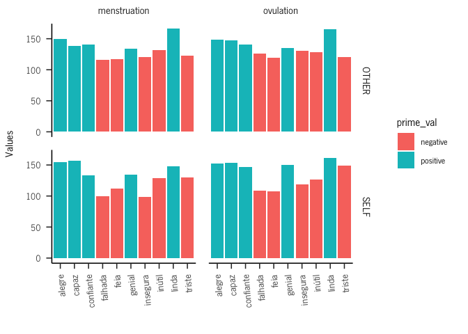
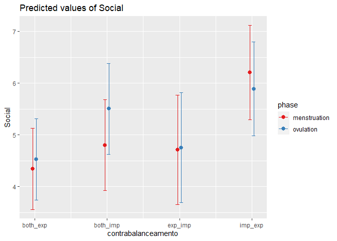
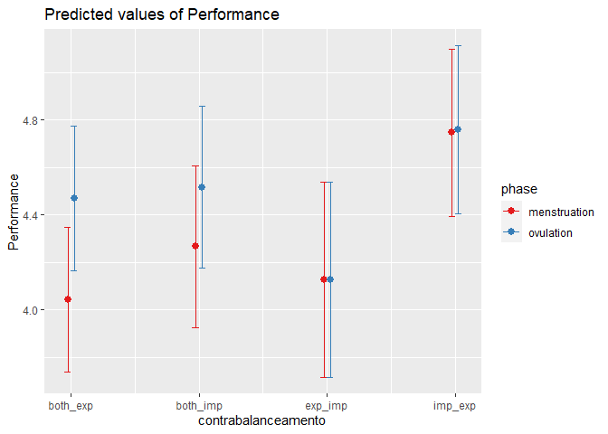
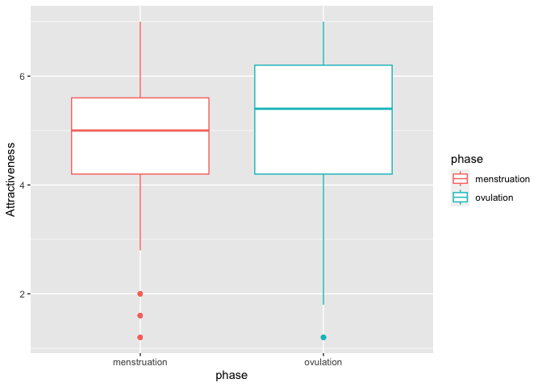
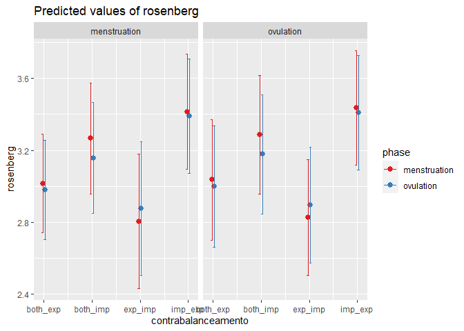

Self-esteem across the menstrual cycle
================
2023

``` r
library(readxl)
library(dplyr)
```

    ## 
    ## Attaching package: 'dplyr'

    ## The following objects are masked from 'package:stats':
    ## 
    ##     filter, lag

    ## The following objects are masked from 'package:base':
    ## 
    ##     intersect, setdiff, setequal, union

``` r
library(ggplot2)
```

    ## Warning: package 'ggplot2' was built under R version 4.2.2

``` r
library("plotrix")
library(sjPlot)
```

    ## Warning: package 'sjPlot' was built under R version 4.2.3

``` r
brutos = data$`Dados_brutos (3)`
head(brutos)
```

    ##   participant LINE BLOCO        rt correct condition PRIME_VAL PRIME_TYPE
    ## 1       AA556    0     1 0.4174751       0         2  positive      OTHER
    ## 2       AA556    1     1 0.1681083       1         2  positive      OTHER
    ## 3       AA556    2     1 0.5012267       0         2  negative      OTHER
    ## 4       AA556    3     1 0.4864544       1         2  negative      OTHER
    ## 5       AA556    4     1 0.4847672       0         2  negative      OTHER
    ## 6       AA556    5     1 0.5007748       1         2  positive      OTHER
    ##        PICTURE TARGET        PHASE
    ## 1    VPN07.jpg  linda menstruation
    ## 2    VPN09.jpg  capaz menstruation
    ## 3    VPN07.jpg inútil menstruation
    ## 4    VPN04.jpg   feia menstruation
    ## 5    VPN02.jpg triste menstruation
    ## 6 femcon_2.jpg genial menstruation

\#parse target

``` r
for (i in 1:nrow(brutos)){
  if(substr(brutos$TARGET[i],nchar(brutos$TARGET[i])-2,nchar(brutos$TARGET[i])) == "til"){
    brutos$TARGET[i] = "inútil"  
  }
}
```

\#check

``` r
brutos %>%
  mutate(new = case_when(TARGET == "alegre" ~ "positive",
                         TARGET =="capaz" ~ "positive",
                         TARGET == "confiante" ~ "positive",
                         TARGET == "genial" ~ "positive",
                         TARGET == "linda" ~ "positive"
                                ,TRUE ~ 'negative'
                                )) %>% pull(new) -> new

a = new == brutos$PRIME_VAL 
soma = sum(a, na.rm = TRUE) # best way to count TRUE values
soma == length(a)
```

    ## [1] TRUE

\#check participant’s id

``` r
summary(factor(brutos$participant))
```

    ## AA556 AA696 ab116 AF841 av734 BF401 BJ960 CA306 CC522 CJ335 cj967 CJ967 EG406 
    ##   452   513   446   526   285   491   508   359   101   479   242   261   520 
    ## GA454 GJ487 IJ887 JJ997 Lf380 LF380 MA007 MA565 ma889 MA889 MA929 MA969 mb968 
    ##   458   492   433   385   224   207   511   328   145   175   312   472   444 
    ## ME324 mj243 MJ690 MJ803 MM350 MM533 MM586 MM714 MP177 MR971 NA210 nj182 NJ182 
    ##   471   436   137   412   425   363   459   437   536   331   481   166   146 
    ## nj267 NJ267 OR883 PF580 rf539 RF539 RJ673 RR863 SJ292 SJ302 sj313 SJ313 SJ513 
    ##   209   160   489   505   228   278   441   461   364   451   269   272   444 
    ## SJ874 sm247 sm370 sm416 SM416 SP123 SR421 tp158 TP158 VA606 
    ##   480   411   473   144   169   424   380   226   239   315

``` r
#to lower case all cols
names(brutos) <- tolower(names(brutos))

brutos$participant = tolower(brutos$participant)

#brutos %>% group_by(participant) %>% count()
```

#### Apa theme

``` r
#apa
theme_apa <- function(base_size = 12, base_family = "", box = FALSE) {
  adapted_theme <- ggplot2::theme_bw(base_size, base_family) +
    ggplot2::theme(
      plot.title = ggplot2::element_text(size = ggplot2::rel(1.1), margin = ggplot2::margin(0, 0, ggplot2::rel(14), 0), hjust = 0.5)
      , plot.subtitle = ggplot2::element_text(size = ggplot2::rel(0.8), margin = ggplot2::margin(ggplot2::rel(-7), 0, ggplot2::rel(14), 0), hjust = 0.5)

      # , axis.title = ggplot2::element_text(size = ggplot2::rel(1.1))
      , axis.title.x = ggplot2::element_text(size = ggplot2::rel(1), lineheight = ggplot2::rel(1.1), margin = ggplot2::margin(ggplot2::rel(12), 0, 0, 0))
      , axis.title.x.top = ggplot2::element_text(size = ggplot2::rel(1), lineheight = ggplot2::rel(1.1), margin = ggplot2::margin(0, 0, ggplot2::rel(12), 0))
      , axis.title.y = ggplot2::element_text(size = ggplot2::rel(1), lineheight = ggplot2::rel(1.1), margin = ggplot2::margin(0, ggplot2::rel(12), 0, 0))
      , axis.title.y.right = ggplot2::element_text(size = ggplot2::rel(1), lineheight = ggplot2::rel(1.1), margin = ggplot2::margin(0, 0, 0, ggplot2::rel(12)))
      , axis.ticks.length = ggplot2::unit(ggplot2::rel(6), "points")
      , axis.text = ggplot2::element_text(size = ggplot2::rel(0.9))
      , axis.text.x = ggplot2::element_text(size = ggplot2::rel(1), margin = ggplot2::margin(ggplot2::rel(6), 0, 0, 0))
      , axis.text.y = ggplot2::element_text(size = ggplot2::rel(1), margin = ggplot2::margin(0, ggplot2::rel(6), 0, 0))
      , axis.text.y.right = ggplot2::element_text(size = ggplot2::rel(1), margin = ggplot2::margin(0, 0, 0, ggplot2::rel(6)))
      , axis.line = ggplot2::element_line()
      # , axis.line.x = ggplot2::element_line()
      # , axis.line.y = ggplot2::element_line()

      , legend.title = ggplot2::element_text()
      , legend.key = ggplot2::element_rect(fill = NA, color = NA)
      , legend.key.width = ggplot2::unit(ggplot2::rel(20), "points")
      , legend.key.height = ggplot2::unit(ggplot2::rel(20), "points")
      , legend.margin = ggplot2::margin(
        t = ggplot2::rel(16)
        , r = ggplot2::rel(16)
        , b = ggplot2::rel(16)
        , l = ggplot2::rel(16)
        , unit = "points"
      )

      , panel.spacing = ggplot2::unit(ggplot2::rel(14), "points")
      , panel.grid.major.x = ggplot2::element_blank()
      , panel.grid.minor.x = ggplot2::element_blank()
      , panel.grid.major.y = ggplot2::element_blank()
      , panel.grid.minor.y = ggplot2::element_blank()

      , strip.background = ggplot2::element_rect(fill = NA, color = NA)
      , strip.text.x = ggplot2::element_text(size = ggplot2::rel(1.2), margin = ggplot2::margin(0, 0, ggplot2::rel(10), 0))
      , strip.text.y = ggplot2::element_text(size = ggplot2::rel(1.2), margin = ggplot2::margin(0, 0, 0, ggplot2::rel(10)))
    )

  if(box) {
    adapted_theme <- adapted_theme + ggplot2::theme(panel.border = ggplot2::element_rect(color = "black"))
  } else {
    adapted_theme <- adapted_theme + ggplot2::theme(panel.border = ggplot2::element_blank())
  }

  adapted_theme
}
```

``` r
plot = ggplot(data = brutos, aes(x = prime_type, y = rt, fill = interaction(correct,prime_type))) + geom_boxplot() + facet_wrap(~phase) + theme_apa()

plot
```

<!-- -->

``` r
brutos2 = brutos %>% group_by(phase, prime_type, prime_val,target) %>% summarize(soma = sum(correct)) 
```

    ## `summarise()` has grouped output by 'phase', 'prime_type', 'prime_val'. You can
    ## override using the `.groups` argument.

``` r
for (i in 1:nrow(brutos2)){
  if(brutos2$prime_type[i] == "OTHER"){
    brutos2$soma[i] = brutos2$soma[i]/5
  }
}

brutos2
```

    ## # A tibble: 40 × 5
    ## # Groups:   phase, prime_type, prime_val [8]
    ##    phase        prime_type prime_val target     soma
    ##    <chr>        <chr>      <chr>     <chr>     <dbl>
    ##  1 menstruation OTHER      negative  falhada    116.
    ##  2 menstruation OTHER      negative  feia       117.
    ##  3 menstruation OTHER      negative  insegura   121.
    ##  4 menstruation OTHER      negative  inútil     132 
    ##  5 menstruation OTHER      negative  triste     123.
    ##  6 menstruation OTHER      positive  alegre     150.
    ##  7 menstruation OTHER      positive  capaz      138.
    ##  8 menstruation OTHER      positive  confiante  141.
    ##  9 menstruation OTHER      positive  genial     134 
    ## 10 menstruation OTHER      positive  linda      166 
    ## # … with 30 more rows

``` r
brutos2%>% 
  ggplot(aes(x = target, y = soma, fill = prime_val)) +
    geom_bar(position="dodge",stat = "identity")+
    #scale_fill_manual(values = c ('royalblue1', 'grey2', 'yellow1'))+
    ylab("Values")+
    xlab("")+
    facet_grid(prime_type ~ phase) + theme_apa()+
  theme(axis.text.x = element_text(angle = 95, vjust = 0.5,hjust = 1)) -> plot

plot
```

<!-- --> \#filter
by beautiful and ugly

``` r
brutos2 %>% subset(target %in% c("linda","feia")) %>% 
  ggplot(aes(x = target, y = soma, fill = prime_val)) +
    geom_bar(position="dodge",stat = "identity")+
    #scale_fill_manual(values = c ('royalblue1', 'grey2', 'yellow1'))+
    ylab("Values")+
    xlab("")+
    facet_grid(prime_type ~ phase) + theme_apa()+
  theme(axis.text.x = element_text(angle = 95, vjust = 0.5,hjust = 1)) 
```

<!-- -->

``` r
#brutos = brutos %>% subset(target %in% c("linda","feia")) 
```

``` r
brutos %>% group_by(participant, phase) %>% summarize(soma = sum(correct)) %>% arrange(desc(soma)) ->grafico
```

    ## `summarise()` has grouped output by 'participant'. You can override using the
    ## `.groups` argument.

``` r
ggplot(grafico, aes(x = reorder(participant, -soma), y = soma)) + geom_bar(position="dodge",stat = "identity") +  coord_flip()+ facet_wrap(~phase) #+ geom_hline(yintercept=, linetype="dashed", 
```

<!-- -->

``` r
      #          color = "red", size=2)
```

``` r
#brutos %>% group_by(participant, phase) %>% tally() %>% arrange(n)
```

``` r
#brutos %>% group_by(participant, phase) %>% summarise_at(vars(rt), funs(rt_mean = mean(., na.rm = T))) %>% arrange(desc(rt_mean))
```

\#remove participants mj690 & cc522 *few responses *few corrects \*high
rt

``` r
brutos = brutos %>% subset(!(participant %in% c("mj690","cc522","sm247")))
```

\#ROC-CURVE

``` r
head(brutos)
```

    ##   participant line bloco        rt correct condition prime_val prime_type
    ## 1       aa556    0     1 0.4174751       0         2  positive      OTHER
    ## 2       aa556    1     1 0.1681083       1         2  positive      OTHER
    ## 3       aa556    2     1 0.5012267       0         2  negative      OTHER
    ## 4       aa556    3     1 0.4864544       1         2  negative      OTHER
    ## 5       aa556    4     1 0.4847672       0         2  negative      OTHER
    ## 6       aa556    5     1 0.5007748       1         2  positive      OTHER
    ##        picture target        phase
    ## 1    VPN07.jpg  linda menstruation
    ## 2    VPN09.jpg  capaz menstruation
    ## 3    VPN07.jpg inútil menstruation
    ## 4    VPN04.jpg   feia menstruation
    ## 5    VPN02.jpg triste menstruation
    ## 6 femcon_2.jpg genial menstruation

``` r
response = c()
for (i in 1:nrow(brutos)){
  if (brutos$prime_val[i] == "positive"){
    if (brutos$correct[i] == 1){
      response = c(response, 1)
    }
    else{
      response = c(response,0)
    }
  }
  else{
    if(brutos$correct[i] == 1){
      response = c(response,0)
    }
    else{
      response = c(response,1)
    }
    
  }
}

expected = response

library(caTools)

library(pROC)
```

    ## Type 'citation("pROC")' for a citation.

    ## 
    ## Attaching package: 'pROC'

    ## The following objects are masked from 'package:stats':
    ## 
    ##     cov, smooth, var

``` r
response = c()
for (i in 1:nrow(brutos)){
  if(brutos$prime_val[i]=="positive"){
    response = c(response,1)
  }
  else{
    response = c(response,0)
  }
}


test_roc = roc(expected ~ response, plot = TRUE, print.auc = TRUE)
```

    ## Setting levels: control = 0, case = 1

    ## Setting direction: controls < cases

<!-- -->

``` r
roc_df = data.frame(brutos$phase,brutos$prime_type,expected,response)


self_ovulation_df = roc_df %>% subset(brutos.phase == "ovulation" & brutos.prime_type=="SELF")
self_menstruation_df = roc_df %>% subset(brutos.phase == "menstruation" & brutos.prime_type=="SELF")

other_ovulation_df = roc_df %>% subset(brutos.phase == "ovulation" & brutos.prime_type=="OTHER")
other_menstruation_df = roc_df %>% subset(brutos.phase == "menstruation" & brutos.prime_type=="OTHER")


# create ROC curves for each condition
roc1 <- roc(self_ovulation_df$expected,self_ovulation_df$response)
```

    ## Setting levels: control = 0, case = 1
    ## Setting direction: controls < cases

``` r
roc2 <- roc(self_menstruation_df$expected,self_menstruation_df$response)
```

    ## Setting levels: control = 0, case = 1
    ## Setting direction: controls < cases

``` r
roc3 = roc(other_ovulation_df$expected,other_ovulation_df$response)
```

    ## Setting levels: control = 0, case = 1
    ## Setting direction: controls < cases

``` r
roc4 = roc(other_menstruation_df$expected,other_menstruation_df$response)
```

    ## Setting levels: control = 0, case = 1
    ## Setting direction: controls < cases

``` r
ggroc(list(self_ovulation = roc1, self_menstruation = roc2, other_ovulation = roc3, other_menstruation = roc4 )) +
   scale_color_manual(values = c("self_ovulation"="brown2","self_menstruation" = "Tan","other_ovulation" = "blue","other_menstruation" ="green"),
                      labels = c(paste0("self ovulation ",'ROC Curve ', '(AUC = ', .74, ')')
                                 ,paste0("self menstruation ",'ROC Curve ', '(AUC = ',.71, ')')
                                 ,paste0("other ovulation ",'ROC Curve ', '(AUC = ', .73, ')')
                                 ,paste0("other menstruation ",'ROC Curve ', '(AUC = ', .73, ')'))) + theme_apa()
```

<!-- -->

\#missing responses-add to dataframe

``` r
codes = c("ma889","ma929","mr971","na210","nj267","va606")

p1=list("ma889",0,1,0.42,0,1,"negative","SELF","x","x","menstruation")
p2=list("ma929",0,4,0.42,0,2,"negative","SELF","x","x","menstruation")
p3=list("mr971",0,4,0.42,0,2,"negative","SELF","x","x","ovulation")
p4=list("na210",0,2,0.42,0,2,"positive","SELF","x","x","menstruation")
p5=list("nj267",0,3,0.42,0,1,"negative","SELF","x","x","menstruation")
p6=list("va606",0,1,0.42,0,1,"positive","SELF","x","x","menstruation")

nested = list(p1,p2,p3,p4,p5,p6)
df_nested <-  as.data.frame(do.call(rbind, nested))

colnames(df_nested) = colnames(brutos)

library(tidyr)
unnested = df_nested %>% unnest(colnames(df_nested))
unnested = data.frame(unnested)
colnames(unnested) = colnames(brutos)

brutos = rbind(brutos,unnested)
```

# POSITIVITY INDEX - SELF

``` r
brutos %>% group_by(participant,phase,bloco, prime_val, prime_type) %>% summarize(soma = sum(correct)) -> df
```

    ## `summarise()` has grouped output by 'participant', 'phase', 'bloco',
    ## 'prime_val'. You can override using the `.groups` argument.

``` r
taxa = c()
x = 25
y = 5
  
for (i in 1:nrow(df)){
  if(df$prime_type[i] == "OTHER"){
    taxa = c(taxa,(df$soma[i]/x))
  } 
  else{
    taxa = c(taxa,(df$soma[i]/y))
  }
}

df$taxa = taxa
```

\#don’t

``` r
data= data.frame(matrix(ncol=7,nrow = 0))
colnames(data) = colnames(df)

blocks = c(1,2,3,4,5)

#for each participant
for (participant in levels(factor(df$participant))){
  #for each phase
  for(phase in phases){
    #for each block
    for (block in blocks){
      
            data[nrow(data) + 1,] =list(participant,phase,block, "negative","OTHER",0,0)
            
            data[nrow(data) + 1,] =list(participant,phase,block, "negative","SELF",0,0)

            data[nrow(data) + 1,] =list(participant,phase,block, "positive","OTHER",0,0)
            data[nrow(data) + 1,] =list(participant,phase,block, "positive","SELF",0,0)
    
    }
  }
}
```

\#don’t

``` r
df = rbind(df,data)
df%>% group_by(participant,phase,bloco, prime_val, prime_type) %>% summarize(taxa = sum(taxa))->df
```

``` r
index = c()
bloco = 1
counter = 1

for(i in 1:(nrow(df)-2)){
  if (df$bloco[i+2] == bloco & counter < 3){
    index = c(index,df$taxa[i]-df$taxa[i+2])
  }
  else {
    bloco = df$bloco[i+2]
  }
  if (counter == 4){
    counter = 0
  }
  counter = counter+1
}
```

\#create dataframe

``` r
participants = levels(factor(df$participant))
participants = rep(participants, each = 20)


phase = rep(c("menstruation","ovulation"), each = 10, times = 10)

bloco = rep(c(1,2,3,4,5),each = 2,times = 100)

condition = rep(c("OTHER","SELF"),times = 500)

colunas = c("participant","phase","bloco","condition","index")

df_index = data.frame(participants,phase,bloco,condition, index) 
colnames(df_index) = colunas
```

\#remove participants

``` r
df %>% subset(!(participant %in% c("sp123","sm247","mj690","cc522"))) -> df
```

``` r
df_index %>% group_by(phase,condition) %>% summarise_at(vars(index), funs(rt_mean = mean(., na.rm = T))) 
```

    ## Warning: `funs()` was deprecated in dplyr 0.8.0.
    ## ℹ Please use a list of either functions or lambdas:
    ## 
    ## # Simple named list: list(mean = mean, median = median)
    ## 
    ## # Auto named with `tibble::lst()`: tibble::lst(mean, median)
    ## 
    ## # Using lambdas list(~ mean(., trim = .2), ~ median(., na.rm = TRUE))

    ## # A tibble: 4 × 3
    ## # Groups:   phase [2]
    ##   phase        condition rt_mean
    ##   <chr>        <chr>       <dbl>
    ## 1 menstruation OTHER     -0.0976
    ## 2 menstruation SELF      -0.119 
    ## 3 ovulation    OTHER     -0.0859
    ## 4 ovulation    SELF      -0.116

\#symmetric index

``` r
df_index$index = -df_index$index
```

``` r
ggplot(data = df_index, aes(x = condition, y = index, color = phase)) + geom_boxplot() + theme_apa()
```

<!-- -->

``` r
#head(df,20)
```

``` r
#df_index %>% group_by(participant,phase,condition) %>% summarise_at(vars(index), funs(rt_mean = mean(., na.rm = T))) %>% arrange(rt_mean)
```

\#remove outlier

``` r
df_index = df_index %>% subset(participant!="ij887" & participant != "mr971") 
```

``` r
hist(df_index$index)
```

<!-- -->

``` r
df_index %>% group_by(phase,condition) %>% summarise_at(vars(index), funs(index = mean(., na.rm = T)))-> df_index2 
df_index %>% group_by(phase,condition) %>% summarise_at(vars(index), funs(se = std.error(., na.rm = T))) %>% pull(se) ->se

df_index2$se = se

# Create bar plot with error bars
ggplot(df_index2, aes(x = condition, y = index, fill = phase)) +
  geom_bar(stat = "identity",position = position_dodge(0.9)) +   scale_fill_manual(values = c("brown2", "Tan1")) +
  geom_errorbar(aes(ymin = index - se, ymax = index + se), width = 0.2,position = position_dodge(0.9)) + theme_apa()
```

<!-- -->

``` r
df_index %>% group_by(participant,phase,condition) %>% summarise_at(vars(index), funs(index = mean(., na.rm = T))) %>% ggplot(aes(x = condition, y = index, color = phase)) + geom_boxplot() +theme_apa()
```

<!-- -->

``` r
library(lme4)
```

    ## Loading required package: Matrix

    ## Warning: package 'Matrix' was built under R version 4.2.2

    ## 
    ## Attaching package: 'Matrix'

    ## The following objects are masked from 'package:tidyr':
    ## 
    ##     expand, pack, unpack

    ## 
    ## Attaching package: 'lme4'

    ## The following object is masked from 'package:rio':
    ## 
    ##     factorize

``` r
library(afex)
```

    ## Warning: package 'afex' was built under R version 4.2.2

    ## ************
    ## Welcome to afex. For support visit: http://afex.singmann.science/

    ## - Functions for ANOVAs: aov_car(), aov_ez(), and aov_4()
    ## - Methods for calculating p-values with mixed(): 'S', 'KR', 'LRT', and 'PB'
    ## - 'afex_aov' and 'mixed' objects can be passed to emmeans() for follow-up tests
    ## - NEWS: emmeans() for ANOVA models now uses model = 'multivariate' as default.
    ## - Get and set global package options with: afex_options()
    ## - Set orthogonal sum-to-zero contrasts globally: set_sum_contrasts()
    ## - For example analyses see: browseVignettes("afex")
    ## ************

    ## 
    ## Attaching package: 'afex'

    ## The following object is masked from 'package:lme4':
    ## 
    ##     lmer

``` r
df_index$participant = factor(df_index$participant)
df_index$phase = factor(df_index$phase)
df_index$bloco = factor(df_index$bloco)
df_index$condition = factor(df_index$condition)
```

### check contrabalanceamento

``` r
contrabalanceamento = read.csv("contrabalanceamento.csv")
```

``` r
#to lower case all cols
names(contrabalanceamento) <- tolower(names(contrabalanceamento))

contrabalanceamento$participant = tolower(contrabalanceamento$participant)
```

\#left-join

``` r
df_index = df_index %>% left_join(contrabalanceamento)
```

    ## Joining, by = "participant"

``` r
model = lmer(index~condition*phase + tecla+contrabalanceamento+fase_start +(1|participant), df_index)

tab_model(model)
```

<table style="border-collapse:collapse; border:none;">
<tr>
<th style="border-top: double; text-align:center; font-style:normal; font-weight:bold; padding:0.2cm;  text-align:left; ">
 
</th>
<th colspan="3" style="border-top: double; text-align:center; font-style:normal; font-weight:bold; padding:0.2cm; ">
index
</th>
</tr>
<tr>
<td style=" text-align:center; border-bottom:1px solid; font-style:italic; font-weight:normal;  text-align:left; ">
Predictors
</td>
<td style=" text-align:center; border-bottom:1px solid; font-style:italic; font-weight:normal;  ">
Estimates
</td>
<td style=" text-align:center; border-bottom:1px solid; font-style:italic; font-weight:normal;  ">
CI
</td>
<td style=" text-align:center; border-bottom:1px solid; font-style:italic; font-weight:normal;  ">
p
</td>
</tr>
<tr>
<td style=" padding:0.2cm; text-align:left; vertical-align:top; text-align:left; ">
(Intercept)
</td>
<td style=" padding:0.2cm; text-align:left; vertical-align:top; text-align:center;  ">
0.08
</td>
<td style=" padding:0.2cm; text-align:left; vertical-align:top; text-align:center;  ">
-0.01 – 0.18
</td>
<td style=" padding:0.2cm; text-align:left; vertical-align:top; text-align:center;  ">
0.073
</td>
</tr>
<tr>
<td style=" padding:0.2cm; text-align:left; vertical-align:top; text-align:left; ">
condition \[SELF\]
</td>
<td style=" padding:0.2cm; text-align:left; vertical-align:top; text-align:center;  ">
-0.01
</td>
<td style=" padding:0.2cm; text-align:left; vertical-align:top; text-align:center;  ">
-0.05 – 0.04
</td>
<td style=" padding:0.2cm; text-align:left; vertical-align:top; text-align:center;  ">
0.823
</td>
</tr>
<tr>
<td style=" padding:0.2cm; text-align:left; vertical-align:top; text-align:left; ">
phase \[ovulation\]
</td>
<td style=" padding:0.2cm; text-align:left; vertical-align:top; text-align:center;  ">
-0.02
</td>
<td style=" padding:0.2cm; text-align:left; vertical-align:top; text-align:center;  ">
-0.06 – 0.03
</td>
<td style=" padding:0.2cm; text-align:left; vertical-align:top; text-align:center;  ">
0.452
</td>
</tr>
<tr>
<td style=" padding:0.2cm; text-align:left; vertical-align:top; text-align:left; ">
tecla
</td>
<td style=" padding:0.2cm; text-align:left; vertical-align:top; text-align:center;  ">
0.01
</td>
<td style=" padding:0.2cm; text-align:left; vertical-align:top; text-align:center;  ">
-0.04 – 0.06
</td>
<td style=" padding:0.2cm; text-align:left; vertical-align:top; text-align:center;  ">
0.640
</td>
</tr>
<tr>
<td style=" padding:0.2cm; text-align:left; vertical-align:top; text-align:left; ">
contrabalanceamento<br>\[both_imp\]
</td>
<td style=" padding:0.2cm; text-align:left; vertical-align:top; text-align:center;  ">
0.01
</td>
<td style=" padding:0.2cm; text-align:left; vertical-align:top; text-align:center;  ">
-0.06 – 0.08
</td>
<td style=" padding:0.2cm; text-align:left; vertical-align:top; text-align:center;  ">
0.786
</td>
</tr>
<tr>
<td style=" padding:0.2cm; text-align:left; vertical-align:top; text-align:left; ">
contrabalanceamento<br>\[exp_imp\]
</td>
<td style=" padding:0.2cm; text-align:left; vertical-align:top; text-align:center;  ">
-0.02
</td>
<td style=" padding:0.2cm; text-align:left; vertical-align:top; text-align:center;  ">
-0.10 – 0.06
</td>
<td style=" padding:0.2cm; text-align:left; vertical-align:top; text-align:center;  ">
0.600
</td>
</tr>
<tr>
<td style=" padding:0.2cm; text-align:left; vertical-align:top; text-align:left; ">
contrabalanceamento<br>\[imp_exp\]
</td>
<td style=" padding:0.2cm; text-align:left; vertical-align:top; text-align:center;  ">
-0.03
</td>
<td style=" padding:0.2cm; text-align:left; vertical-align:top; text-align:center;  ">
-0.10 – 0.04
</td>
<td style=" padding:0.2cm; text-align:left; vertical-align:top; text-align:center;  ">
0.394
</td>
</tr>
<tr>
<td style=" padding:0.2cm; text-align:left; vertical-align:top; text-align:left; ">
fase start \[ovulation\]
</td>
<td style=" padding:0.2cm; text-align:left; vertical-align:top; text-align:center;  ">
0.02
</td>
<td style=" padding:0.2cm; text-align:left; vertical-align:top; text-align:center;  ">
-0.03 – 0.07
</td>
<td style=" padding:0.2cm; text-align:left; vertical-align:top; text-align:center;  ">
0.476
</td>
</tr>
<tr>
<td style=" padding:0.2cm; text-align:left; vertical-align:top; text-align:left; ">
condition \[SELF\] × phase<br>\[ovulation\]
</td>
<td style=" padding:0.2cm; text-align:left; vertical-align:top; text-align:center;  ">
0.03
</td>
<td style=" padding:0.2cm; text-align:left; vertical-align:top; text-align:center;  ">
-0.03 – 0.10
</td>
<td style=" padding:0.2cm; text-align:left; vertical-align:top; text-align:center;  ">
0.327
</td>
</tr>
<tr>
<td colspan="4" style="font-weight:bold; text-align:left; padding-top:.8em;">
Random Effects
</td>
</tr>
<tr>
<td style=" padding:0.2cm; text-align:left; vertical-align:top; text-align:left; padding-top:0.1cm; padding-bottom:0.1cm;">
σ<sup>2</sup>
</td>
<td style=" padding:0.2cm; text-align:left; vertical-align:top; padding-top:0.1cm; padding-bottom:0.1cm; text-align:left;" colspan="3">
0.06
</td>
</tr>
<tr>
<td style=" padding:0.2cm; text-align:left; vertical-align:top; text-align:left; padding-top:0.1cm; padding-bottom:0.1cm;">
τ<sub>00</sub> <sub>participant</sub>
</td>
<td style=" padding:0.2cm; text-align:left; vertical-align:top; padding-top:0.1cm; padding-bottom:0.1cm; text-align:left;" colspan="3">
0.00
</td>
<tr>
<td style=" padding:0.2cm; text-align:left; vertical-align:top; text-align:left; padding-top:0.1cm; padding-bottom:0.1cm;">
ICC
</td>
<td style=" padding:0.2cm; text-align:left; vertical-align:top; padding-top:0.1cm; padding-bottom:0.1cm; text-align:left;" colspan="3">
0.07
</td>
<tr>
<td style=" padding:0.2cm; text-align:left; vertical-align:top; text-align:left; padding-top:0.1cm; padding-bottom:0.1cm;">
N <sub>participant</sub>
</td>
<td style=" padding:0.2cm; text-align:left; vertical-align:top; padding-top:0.1cm; padding-bottom:0.1cm; text-align:left;" colspan="3">
47
</td>
<tr>
<td style=" padding:0.2cm; text-align:left; vertical-align:top; text-align:left; padding-top:0.1cm; padding-bottom:0.1cm; border-top:1px solid;">
Observations
</td>
<td style=" padding:0.2cm; text-align:left; vertical-align:top; padding-top:0.1cm; padding-bottom:0.1cm; text-align:left; border-top:1px solid;" colspan="3">
940
</td>
</tr>
<tr>
<td style=" padding:0.2cm; text-align:left; vertical-align:top; text-align:left; padding-top:0.1cm; padding-bottom:0.1cm;">
Marginal R<sup>2</sup> / Conditional R<sup>2</sup>
</td>
<td style=" padding:0.2cm; text-align:left; vertical-align:top; padding-top:0.1cm; padding-bottom:0.1cm; text-align:left;" colspan="3">
0.006 / 0.078
</td>
</tr>
</table>

``` r
model = lmer(index~condition*phase +(1|participant), df_index)

tab_model(model)
```

<table style="border-collapse:collapse; border:none;">
<tr>
<th style="border-top: double; text-align:center; font-style:normal; font-weight:bold; padding:0.2cm;  text-align:left; ">
 
</th>
<th colspan="3" style="border-top: double; text-align:center; font-style:normal; font-weight:bold; padding:0.2cm; ">
index
</th>
</tr>
<tr>
<td style=" text-align:center; border-bottom:1px solid; font-style:italic; font-weight:normal;  text-align:left; ">
Predictors
</td>
<td style=" text-align:center; border-bottom:1px solid; font-style:italic; font-weight:normal;  ">
Estimates
</td>
<td style=" text-align:center; border-bottom:1px solid; font-style:italic; font-weight:normal;  ">
CI
</td>
<td style=" text-align:center; border-bottom:1px solid; font-style:italic; font-weight:normal;  ">
p
</td>
</tr>
<tr>
<td style=" padding:0.2cm; text-align:left; vertical-align:top; text-align:left; ">
(Intercept)
</td>
<td style=" padding:0.2cm; text-align:left; vertical-align:top; text-align:center;  ">
0.10
</td>
<td style=" padding:0.2cm; text-align:left; vertical-align:top; text-align:center;  ">
0.07 – 0.14
</td>
<td style=" padding:0.2cm; text-align:left; vertical-align:top; text-align:center;  ">
<strong>\<0.001</strong>
</td>
</tr>
<tr>
<td style=" padding:0.2cm; text-align:left; vertical-align:top; text-align:left; ">
condition \[SELF\]
</td>
<td style=" padding:0.2cm; text-align:left; vertical-align:top; text-align:center;  ">
0.00
</td>
<td style=" padding:0.2cm; text-align:left; vertical-align:top; text-align:center;  ">
-0.04 – 0.04
</td>
<td style=" padding:0.2cm; text-align:left; vertical-align:top; text-align:center;  ">
0.994
</td>
</tr>
<tr>
<td style=" padding:0.2cm; text-align:left; vertical-align:top; text-align:left; ">
phase \[ovulation\]
</td>
<td style=" padding:0.2cm; text-align:left; vertical-align:top; text-align:center;  ">
-0.02
</td>
<td style=" padding:0.2cm; text-align:left; vertical-align:top; text-align:center;  ">
-0.06 – 0.03
</td>
<td style=" padding:0.2cm; text-align:left; vertical-align:top; text-align:center;  ">
0.486
</td>
</tr>
<tr>
<td style=" padding:0.2cm; text-align:left; vertical-align:top; text-align:left; ">
condition \[SELF\] × phase<br>\[ovulation\]
</td>
<td style=" padding:0.2cm; text-align:left; vertical-align:top; text-align:center;  ">
0.02
</td>
<td style=" padding:0.2cm; text-align:left; vertical-align:top; text-align:center;  ">
-0.04 – 0.09
</td>
<td style=" padding:0.2cm; text-align:left; vertical-align:top; text-align:center;  ">
0.435
</td>
</tr>
<tr>
<td colspan="4" style="font-weight:bold; text-align:left; padding-top:.8em;">
Random Effects
</td>
</tr>
<tr>
<td style=" padding:0.2cm; text-align:left; vertical-align:top; text-align:left; padding-top:0.1cm; padding-bottom:0.1cm;">
σ<sup>2</sup>
</td>
<td style=" padding:0.2cm; text-align:left; vertical-align:top; padding-top:0.1cm; padding-bottom:0.1cm; text-align:left;" colspan="3">
0.06
</td>
</tr>
<tr>
<td style=" padding:0.2cm; text-align:left; vertical-align:top; text-align:left; padding-top:0.1cm; padding-bottom:0.1cm;">
τ<sub>00</sub> <sub>participant</sub>
</td>
<td style=" padding:0.2cm; text-align:left; vertical-align:top; padding-top:0.1cm; padding-bottom:0.1cm; text-align:left;" colspan="3">
0.00
</td>
<tr>
<td style=" padding:0.2cm; text-align:left; vertical-align:top; text-align:left; padding-top:0.1cm; padding-bottom:0.1cm;">
ICC
</td>
<td style=" padding:0.2cm; text-align:left; vertical-align:top; padding-top:0.1cm; padding-bottom:0.1cm; text-align:left;" colspan="3">
0.07
</td>
<tr>
<td style=" padding:0.2cm; text-align:left; vertical-align:top; text-align:left; padding-top:0.1cm; padding-bottom:0.1cm;">
N <sub>participant</sub>
</td>
<td style=" padding:0.2cm; text-align:left; vertical-align:top; padding-top:0.1cm; padding-bottom:0.1cm; text-align:left;" colspan="3">
48
</td>
<tr>
<td style=" padding:0.2cm; text-align:left; vertical-align:top; text-align:left; padding-top:0.1cm; padding-bottom:0.1cm; border-top:1px solid;">
Observations
</td>
<td style=" padding:0.2cm; text-align:left; vertical-align:top; padding-top:0.1cm; padding-bottom:0.1cm; text-align:left; border-top:1px solid;" colspan="3">
960
</td>
</tr>
<tr>
<td style=" padding:0.2cm; text-align:left; vertical-align:top; text-align:left; padding-top:0.1cm; padding-bottom:0.1cm;">
Marginal R<sup>2</sup> / Conditional R<sup>2</sup>
</td>
<td style=" padding:0.2cm; text-align:left; vertical-align:top; padding-top:0.1cm; padding-bottom:0.1cm; text-align:left;" colspan="3">
0.001 / 0.068
</td>
</tr>
</table>

``` r
library(emmeans)
noise <- emmeans(model,~condition*phase)


x = contrast(noise, "pairwise", simple = "each", combine = TRUE, adjust="bonf")
x
```

    ##  phase        condition contrast                  estimate     SE  df t.ratio
    ##  menstruation .         OTHER - SELF             -0.000167 0.0225 909  -0.007
    ##  ovulation    .         OTHER - SELF             -0.025000 0.0225 909  -1.112
    ##  .            OTHER     menstruation - ovulation  0.015667 0.0225 909   0.697
    ##  .            SELF      menstruation - ovulation -0.009167 0.0225 909  -0.408
    ##  p.value
    ##   1.0000
    ##   1.0000
    ##   1.0000
    ##   1.0000
    ## 
    ## Degrees-of-freedom method: kenward-roger 
    ## P value adjustment: bonferroni method for 4 tests

### ESCALAS

``` r
rosenberg = data$Rosenberg
hp = data$HP
```

``` r
rosenberg %>% dplyr::select(CODE,M_Ros_F1,M_Ros_F2) ->rosenberg
hp %>% dplyr::select(CODE, M_HP_P_1,M_HP_P_2,M_HP_S_1,M_HP_S_2,M_HP_A_1,M_HP_A_2)->hp
```

``` r
head(hp)
```

    ##    CODE M_HP_P_1 M_HP_P_2 M_HP_S_1 M_HP_S_2 M_HP_A_1 M_HP_A_2
    ## 1 MJ960 4.000000 4.428571      5.0      3.2      3.8      3.6
    ## 2 ms416 4.142857 2.571429      4.6      3.2      5.4      5.4
    ## 3 SP513 4.000000 4.857143      5.8      6.2      6.6      5.6
    ## 4 MJ714 4.714286 4.142857      5.6      3.6      4.4      4.4
    ## 5 fb968 4.428571 4.428571      7.0      7.0      5.0      5.2
    ## 6 MA969 2.714286 3.714286      5.4      5.2      2.2      3.8

``` r
library(reshape2)
```

    ## 
    ## Attaching package: 'reshape2'

    ## The following object is masked from 'package:tidyr':
    ## 
    ##     smiths

``` r
# Melt the data frame to long format using two conditions
hp = hp %>%
  pivot_longer(cols = starts_with("M_HP_"), 
               names_to = c("condition", "phase"), 
               names_pattern = c("(M_HP_[PSA]_)([12])")) 

colnames(hp)[1] = "participant"

hp$participant = tolower(hp$participant)

hp <- hp %>%
  mutate(phase = if_else(phase == "1", "ovulation", "menstruation"))
```

\#rename participants’ codes

``` r
hp %>%
  mutate(participant = case_when(participant == "av116"~"ab116",
                         participant == "mj960"~"bj960",
                         participant ==  "sp513"~"sj513",
                         participant ==  "mj714"~"mm714",
                         participant == "ms416"~"sm416" ,
                         participant == "af8411"~ "af841",
                         participant == "fb968" ~"mb968",
                         participant == "rj073" ~"rj673",
                        TRUE ~ participant
                                ))-> hp
```

\#left join

``` r
length(levels(factor(df_index$participant)))
```

    ## [1] 48

``` r
df_merged <- df_index %>%
  left_join(hp, by = c("participant","phase"))

df_merged %>%
  mutate(condition.y = case_when(condition.y == "M_HP_P_"~"Performance",
                         condition.y == "M_HP_S_"~"Social",
                         condition.y ==  "M_HP_A_"~"Attractiveness"
                                ))-> df_merged

df_merged$participant = factor(df_merged$participant)
```

``` r
ggplot(data = df_merged, aes(x = condition.y, y = value, color = phase)) + geom_boxplot() + theme_apa()
```

<!-- -->

``` r
df_merged %>% group_by(phase,condition.y) %>% summarise_at(vars(value), funs(value = mean(., na.rm = T)))-> df_merged2 

df_merged %>% group_by(phase,condition.y) %>% summarise_at(vars(value), funs(se = std.error(., na.rm = T))) %>% pull(se) ->se

df_merged2$se = se

# Create bar plot with error bars
ggplot(df_merged2, aes(x = condition.y, y = value, fill = phase)) +
  geom_bar(stat = "identity",position = position_dodge(0.9)) +   scale_fill_manual(values = c("brown2", "Tan1")) +
  geom_errorbar(aes(ymin = value - se, ymax = value + se), width = 0.2,position = position_dodge(0.9)) + theme_apa()
```

<!-- -->

\#using hp scale as predictor of index \#wide format

``` r
df_wide <- df_merged %>%
  pivot_wider(id_cols = c(participant, phase, bloco, condition.x, index),
              names_from = condition.y,
              values_from = value)
```

\#subtract index of self-other

``` r
index = c()
for (i in 1:nrow(df_wide)-1){
  if(i%%2!=0){
  index = c(index,df_wide$index[i+1]-df_wide$index[i])
  }
}  
length(index)*2
```

    ## [1] 960

``` r
#create dataframe
participants = levels(factor(df_wide$participant))
participants = rep(participants, each = 10)


phase = rep(c("menstruation","ovulation"), each = 5, times = 48)

bloco = rep(c(1,2,3,4,5),each = ,times = 96)

#condition = rep(c("OTHER","SELF"),times = 500)

colunas = c("participant","phase","bloco","index_global")

df_index = data.frame(participants,phase,bloco, index) 
colnames(df_index) = colunas


df_wide %>% group_by(participant,phase,bloco) %>% summarize(Attractiveness = mean(Attractiveness)) %>% pull(Attractiveness) -> Attractiveness
```

    ## `summarise()` has grouped output by 'participant', 'phase'. You can override
    ## using the `.groups` argument.

``` r
df_wide %>% group_by(participant,phase,bloco) %>% summarize(Social = mean(Social)) %>% pull(Social) -> Social
```

    ## `summarise()` has grouped output by 'participant', 'phase'. You can override
    ## using the `.groups` argument.

``` r
df_wide %>% group_by(participant,phase,bloco) %>% summarize(Performance = mean(Performance)) %>% pull(Performance) -> Performance
```

    ## `summarise()` has grouped output by 'participant', 'phase'. You can override
    ## using the `.groups` argument.

``` r
df_index$Performance = Performance
df_index$Attractiveness = Attractiveness
df_index$Social = Social
```

``` r
df_index = df_index %>% left_join(contrabalanceamento)
```

    ## Joining, by = "participant"

``` r
df_index$bloco = factor(df_index$bloco)


model = lmer(Attractiveness~phase*contrabalanceamento+fase_start+(1|participant), df_index)
tab_model(model)
```

<table style="border-collapse:collapse; border:none;">
<tr>
<th style="border-top: double; text-align:center; font-style:normal; font-weight:bold; padding:0.2cm;  text-align:left; ">
 
</th>
<th colspan="3" style="border-top: double; text-align:center; font-style:normal; font-weight:bold; padding:0.2cm; ">
Attractiveness
</th>
</tr>
<tr>
<td style=" text-align:center; border-bottom:1px solid; font-style:italic; font-weight:normal;  text-align:left; ">
Predictors
</td>
<td style=" text-align:center; border-bottom:1px solid; font-style:italic; font-weight:normal;  ">
Estimates
</td>
<td style=" text-align:center; border-bottom:1px solid; font-style:italic; font-weight:normal;  ">
CI
</td>
<td style=" text-align:center; border-bottom:1px solid; font-style:italic; font-weight:normal;  ">
p
</td>
</tr>
<tr>
<td style=" padding:0.2cm; text-align:left; vertical-align:top; text-align:left; ">
(Intercept)
</td>
<td style=" padding:0.2cm; text-align:left; vertical-align:top; text-align:center;  ">
4.29
</td>
<td style=" padding:0.2cm; text-align:left; vertical-align:top; text-align:center;  ">
3.55 – 5.03
</td>
<td style=" padding:0.2cm; text-align:left; vertical-align:top; text-align:center;  ">
<strong>\<0.001</strong>
</td>
</tr>
<tr>
<td style=" padding:0.2cm; text-align:left; vertical-align:top; text-align:left; ">
phase \[ovulation\]
</td>
<td style=" padding:0.2cm; text-align:left; vertical-align:top; text-align:center;  ">
0.49
</td>
<td style=" padding:0.2cm; text-align:left; vertical-align:top; text-align:center;  ">
0.37 – 0.60
</td>
<td style=" padding:0.2cm; text-align:left; vertical-align:top; text-align:center;  ">
<strong>\<0.001</strong>
</td>
</tr>
<tr>
<td style=" padding:0.2cm; text-align:left; vertical-align:top; text-align:left; ">
contrabalanceamento<br>\[both_imp\]
</td>
<td style=" padding:0.2cm; text-align:left; vertical-align:top; text-align:center;  ">
0.59
</td>
<td style=" padding:0.2cm; text-align:left; vertical-align:top; text-align:center;  ">
-0.45 – 1.63
</td>
<td style=" padding:0.2cm; text-align:left; vertical-align:top; text-align:center;  ">
0.264
</td>
</tr>
<tr>
<td style=" padding:0.2cm; text-align:left; vertical-align:top; text-align:left; ">
contrabalanceamento<br>\[exp_imp\]
</td>
<td style=" padding:0.2cm; text-align:left; vertical-align:top; text-align:center;  ">
0.53
</td>
<td style=" padding:0.2cm; text-align:left; vertical-align:top; text-align:center;  ">
-0.61 – 1.66
</td>
<td style=" padding:0.2cm; text-align:left; vertical-align:top; text-align:center;  ">
0.361
</td>
</tr>
<tr>
<td style=" padding:0.2cm; text-align:left; vertical-align:top; text-align:left; ">
contrabalanceamento<br>\[imp_exp\]
</td>
<td style=" padding:0.2cm; text-align:left; vertical-align:top; text-align:center;  ">
1.00
</td>
<td style=" padding:0.2cm; text-align:left; vertical-align:top; text-align:center;  ">
-0.05 – 2.05
</td>
<td style=" padding:0.2cm; text-align:left; vertical-align:top; text-align:center;  ">
0.061
</td>
</tr>
<tr>
<td style=" padding:0.2cm; text-align:left; vertical-align:top; text-align:left; ">
fase start \[ovulation\]
</td>
<td style=" padding:0.2cm; text-align:left; vertical-align:top; text-align:center;  ">
-0.11
</td>
<td style=" padding:0.2cm; text-align:left; vertical-align:top; text-align:center;  ">
-0.90 – 0.68
</td>
<td style=" padding:0.2cm; text-align:left; vertical-align:top; text-align:center;  ">
0.787
</td>
</tr>
<tr>
<td style=" padding:0.2cm; text-align:left; vertical-align:top; text-align:left; ">
phase \[ovulation\] ×<br>contrabalanceamento<br>\[both_imp\]
</td>
<td style=" padding:0.2cm; text-align:left; vertical-align:top; text-align:center;  ">
-0.00
</td>
<td style=" padding:0.2cm; text-align:left; vertical-align:top; text-align:center;  ">
-0.17 – 0.16
</td>
<td style=" padding:0.2cm; text-align:left; vertical-align:top; text-align:center;  ">
0.977
</td>
</tr>
<tr>
<td style=" padding:0.2cm; text-align:left; vertical-align:top; text-align:left; ">
phase \[ovulation\] ×<br>contrabalanceamento<br>\[exp_imp\]
</td>
<td style=" padding:0.2cm; text-align:left; vertical-align:top; text-align:center;  ">
-0.61
</td>
<td style=" padding:0.2cm; text-align:left; vertical-align:top; text-align:center;  ">
-0.78 – -0.43
</td>
<td style=" padding:0.2cm; text-align:left; vertical-align:top; text-align:center;  ">
<strong>\<0.001</strong>
</td>
</tr>
<tr>
<td style=" padding:0.2cm; text-align:left; vertical-align:top; text-align:left; ">
phase \[ovulation\] ×<br>contrabalanceamento<br>\[imp_exp\]
</td>
<td style=" padding:0.2cm; text-align:left; vertical-align:top; text-align:center;  ">
-0.40
</td>
<td style=" padding:0.2cm; text-align:left; vertical-align:top; text-align:center;  ">
-0.57 – -0.24
</td>
<td style=" padding:0.2cm; text-align:left; vertical-align:top; text-align:center;  ">
<strong>\<0.001</strong>
</td>
</tr>
<tr>
<td colspan="4" style="font-weight:bold; text-align:left; padding-top:.8em;">
Random Effects
</td>
</tr>
<tr>
<td style=" padding:0.2cm; text-align:left; vertical-align:top; text-align:left; padding-top:0.1cm; padding-bottom:0.1cm;">
σ<sup>2</sup>
</td>
<td style=" padding:0.2cm; text-align:left; vertical-align:top; padding-top:0.1cm; padding-bottom:0.1cm; text-align:left;" colspan="3">
0.11
</td>
</tr>
<tr>
<td style=" padding:0.2cm; text-align:left; vertical-align:top; text-align:left; padding-top:0.1cm; padding-bottom:0.1cm;">
τ<sub>00</sub> <sub>participant</sub>
</td>
<td style=" padding:0.2cm; text-align:left; vertical-align:top; padding-top:0.1cm; padding-bottom:0.1cm; text-align:left;" colspan="3">
1.76
</td>
<tr>
<td style=" padding:0.2cm; text-align:left; vertical-align:top; text-align:left; padding-top:0.1cm; padding-bottom:0.1cm;">
ICC
</td>
<td style=" padding:0.2cm; text-align:left; vertical-align:top; padding-top:0.1cm; padding-bottom:0.1cm; text-align:left;" colspan="3">
0.94
</td>
<tr>
<td style=" padding:0.2cm; text-align:left; vertical-align:top; text-align:left; padding-top:0.1cm; padding-bottom:0.1cm;">
N <sub>participant</sub>
</td>
<td style=" padding:0.2cm; text-align:left; vertical-align:top; padding-top:0.1cm; padding-bottom:0.1cm; text-align:left;" colspan="3">
48
</td>
<tr>
<td style=" padding:0.2cm; text-align:left; vertical-align:top; text-align:left; padding-top:0.1cm; padding-bottom:0.1cm; border-top:1px solid;">
Observations
</td>
<td style=" padding:0.2cm; text-align:left; vertical-align:top; padding-top:0.1cm; padding-bottom:0.1cm; text-align:left; border-top:1px solid;" colspan="3">
480
</td>
</tr>
<tr>
<td style=" padding:0.2cm; text-align:left; vertical-align:top; text-align:left; padding-top:0.1cm; padding-bottom:0.1cm;">
Marginal R<sup>2</sup> / Conditional R<sup>2</sup>
</td>
<td style=" padding:0.2cm; text-align:left; vertical-align:top; padding-top:0.1cm; padding-bottom:0.1cm; text-align:left;" colspan="3">
0.067 / 0.945
</td>
</tr>
</table>

``` r
plot_model(model, type = "pred", terms = c("contrabalanceamento","phase"))
```

<!-- -->

``` r
plot_model(model, type = "pred", terms = c("contrabalanceamento","fase_start","phase"))
```

<!-- -->

``` r
library(emmeans)
noise <- emmeans(model,~phase*contrabalanceamento)


x = contrast(noise, "pairwise", simple = "each", combine = TRUE, adjust="bonf")
x
```

    ##  contrabalanceamento phase        contrast                 estimate     SE
    ##  both_exp            .            menstruation - ovulation -0.48571 0.0563
    ##  both_imp            .            menstruation - ovulation -0.48333 0.0609
    ##  exp_imp             .            menstruation - ovulation  0.12000 0.0667
    ##  imp_exp             .            menstruation - ovulation -0.08333 0.0609
    ##  .                   menstruation both_exp - both_imp      -0.59046 0.5284
    ##  .                   menstruation both_exp - exp_imp       -0.52800 0.5781
    ##  .                   menstruation both_exp - imp_exp       -0.99954 0.5328
    ##  .                   menstruation both_imp - exp_imp        0.06246 0.5835
    ##  .                   menstruation both_imp - imp_exp       -0.40908 0.5466
    ##  .                   menstruation exp_imp - imp_exp        -0.47154 0.5779
    ##  .                   ovulation    both_exp - both_imp      -0.58808 0.5284
    ##  .                   ovulation    both_exp - exp_imp        0.07771 0.5781
    ##  .                   ovulation    both_exp - imp_exp       -0.59716 0.5328
    ##  .                   ovulation    both_imp - exp_imp        0.66579 0.5835
    ##  .                   ovulation    both_imp - imp_exp       -0.00908 0.5466
    ##  .                   ovulation    exp_imp - imp_exp        -0.67487 0.5779
    ##     df t.ratio p.value
    ##  428.0  -8.620  <.0001
    ##  428.0  -7.941  <.0001
    ##  428.0   1.800  1.0000
    ##  428.0  -1.369  1.0000
    ##   43.5  -1.118  1.0000
    ##   43.5  -0.913  1.0000
    ##   43.5  -1.876  1.0000
    ##   43.5   0.107  1.0000
    ##   43.5  -0.748  1.0000
    ##   43.5  -0.816  1.0000
    ##   43.5  -1.113  1.0000
    ##   43.5   0.134  1.0000
    ##   43.5  -1.121  1.0000
    ##   43.5   1.141  1.0000
    ##   43.5  -0.017  1.0000
    ##   43.5  -1.168  1.0000
    ## 
    ## Results are averaged over some or all of the levels of: fase_start 
    ## Degrees-of-freedom method: kenward-roger 
    ## P value adjustment: bonferroni method for 16 tests

``` r
eff_size(noise, sigma=sigma(model), edf = df.residual(model))
```

    ##  contrast                                      effect.size    SE   df lower.CL
    ##  menstruation both_exp - ovulation both_exp        -1.4570 0.176 43.5  -1.8110
    ##  menstruation both_exp - menstruation both_imp     -1.7712 1.586 43.5  -4.9685
    ##  menstruation both_exp - ovulation both_imp        -3.2210 1.588 43.5  -6.4233
    ##  menstruation both_exp - menstruation exp_imp      -1.5838 1.735 43.5  -5.0811
    ##  menstruation both_exp - ovulation exp_imp         -1.2239 1.734 43.5  -4.7205
    ##  menstruation both_exp - menstruation imp_exp      -2.9983 1.601 43.5  -6.2263
    ##  menstruation both_exp - ovulation imp_exp         -3.2483 1.602 43.5  -6.4773
    ##  ovulation both_exp - menstruation both_imp        -0.3142 1.585 43.5  -3.5095
    ##  ovulation both_exp - ovulation both_imp           -1.7640 1.586 43.5  -4.9614
    ##  ovulation both_exp - menstruation exp_imp         -0.1269 1.734 43.5  -3.6226
    ##  ovulation both_exp - ovulation exp_imp             0.2331 1.734 43.5  -3.2626
    ##  ovulation both_exp - menstruation imp_exp         -1.5413 1.599 43.5  -4.7649
    ##  ovulation both_exp - ovulation imp_exp            -1.7913 1.599 43.5  -5.0154
    ##  menstruation both_imp - ovulation both_imp        -1.4498 0.189 43.5  -1.8301
    ##  menstruation both_imp - menstruation exp_imp       0.1873 1.750 43.5  -3.3414
    ##  menstruation both_imp - ovulation exp_imp          0.5473 1.750 43.5  -2.9816
    ##  menstruation both_imp - menstruation imp_exp      -1.2271 1.640 43.5  -4.5335
    ##  menstruation both_imp - ovulation imp_exp         -1.4771 1.640 43.5  -4.7839
    ##  ovulation both_imp - menstruation exp_imp          1.6372 1.751 43.5  -1.8932
    ##  ovulation both_imp - ovulation exp_imp             1.9971 1.752 43.5  -1.5340
    ##  ovulation both_imp - menstruation imp_exp          0.2227 1.640 43.5  -3.0827
    ##  ovulation both_imp - ovulation imp_exp            -0.0272 1.640 43.5  -3.3326
    ##  menstruation exp_imp - ovulation exp_imp           0.3600 0.200 43.5  -0.0439
    ##  menstruation exp_imp - menstruation imp_exp       -1.4145 1.734 43.5  -4.9102
    ##  menstruation exp_imp - ovulation imp_exp          -1.6644 1.734 43.5  -5.1607
    ##  ovulation exp_imp - menstruation imp_exp          -1.7744 1.734 43.5  -5.2709
    ##  ovulation exp_imp - ovulation imp_exp             -2.0244 1.735 43.5  -5.5214
    ##  menstruation imp_exp - ovulation imp_exp          -0.2500 0.183 43.5  -0.6184
    ##  upper.CL
    ##   -1.1030
    ##    1.4262
    ##   -0.0188
    ##    1.9134
    ##    2.2728
    ##    0.2297
    ##   -0.0192
    ##    2.8811
    ##    1.4333
    ##    3.3689
    ##    3.7289
    ##    1.6823
    ##    1.4329
    ##   -1.0696
    ##    3.7161
    ##    4.0762
    ##    2.0793
    ##    1.8298
    ##    5.1676
    ##    5.5283
    ##    3.5282
    ##    3.2782
    ##    0.7639
    ##    2.0813
    ##    1.8318
    ##    1.7221
    ##    1.4727
    ##    0.1185
    ## 
    ## Results are averaged over the levels of: fase_start 
    ## sigma used for effect sizes: 0.3334 
    ## Degrees-of-freedom method: inherited from kenward-roger when re-gridding 
    ## Confidence level used: 0.95

``` r
model = lmer(Social~contrabalanceamento*phase + fase_start+(1|participant), df_index)
tab_model(model)
```

<table style="border-collapse:collapse; border:none;">
<tr>
<th style="border-top: double; text-align:center; font-style:normal; font-weight:bold; padding:0.2cm;  text-align:left; ">
 
</th>
<th colspan="3" style="border-top: double; text-align:center; font-style:normal; font-weight:bold; padding:0.2cm; ">
Social
</th>
</tr>
<tr>
<td style=" text-align:center; border-bottom:1px solid; font-style:italic; font-weight:normal;  text-align:left; ">
Predictors
</td>
<td style=" text-align:center; border-bottom:1px solid; font-style:italic; font-weight:normal;  ">
Estimates
</td>
<td style=" text-align:center; border-bottom:1px solid; font-style:italic; font-weight:normal;  ">
CI
</td>
<td style=" text-align:center; border-bottom:1px solid; font-style:italic; font-weight:normal;  ">
p
</td>
</tr>
<tr>
<td style=" padding:0.2cm; text-align:left; vertical-align:top; text-align:left; ">
(Intercept)
</td>
<td style=" padding:0.2cm; text-align:left; vertical-align:top; text-align:center;  ">
4.34
</td>
<td style=" padding:0.2cm; text-align:left; vertical-align:top; text-align:center;  ">
3.56 – 5.13
</td>
<td style=" padding:0.2cm; text-align:left; vertical-align:top; text-align:center;  ">
<strong>\<0.001</strong>
</td>
</tr>
<tr>
<td style=" padding:0.2cm; text-align:left; vertical-align:top; text-align:left; ">
contrabalanceamento<br>\[both_imp\]
</td>
<td style=" padding:0.2cm; text-align:left; vertical-align:top; text-align:center;  ">
0.46
</td>
<td style=" padding:0.2cm; text-align:left; vertical-align:top; text-align:center;  ">
-0.65 – 1.57
</td>
<td style=" padding:0.2cm; text-align:left; vertical-align:top; text-align:center;  ">
0.414
</td>
</tr>
<tr>
<td style=" padding:0.2cm; text-align:left; vertical-align:top; text-align:left; ">
contrabalanceamento<br>\[exp_imp\]
</td>
<td style=" padding:0.2cm; text-align:left; vertical-align:top; text-align:center;  ">
0.37
</td>
<td style=" padding:0.2cm; text-align:left; vertical-align:top; text-align:center;  ">
-0.84 – 1.58
</td>
<td style=" padding:0.2cm; text-align:left; vertical-align:top; text-align:center;  ">
0.548
</td>
</tr>
<tr>
<td style=" padding:0.2cm; text-align:left; vertical-align:top; text-align:left; ">
contrabalanceamento<br>\[imp_exp\]
</td>
<td style=" padding:0.2cm; text-align:left; vertical-align:top; text-align:center;  ">
1.86
</td>
<td style=" padding:0.2cm; text-align:left; vertical-align:top; text-align:center;  ">
0.75 – 2.98
</td>
<td style=" padding:0.2cm; text-align:left; vertical-align:top; text-align:center;  ">
<strong>0.001</strong>
</td>
</tr>
<tr>
<td style=" padding:0.2cm; text-align:left; vertical-align:top; text-align:left; ">
phase \[ovulation\]
</td>
<td style=" padding:0.2cm; text-align:left; vertical-align:top; text-align:center;  ">
0.19
</td>
<td style=" padding:0.2cm; text-align:left; vertical-align:top; text-align:center;  ">
-0.01 – 0.38
</td>
<td style=" padding:0.2cm; text-align:left; vertical-align:top; text-align:center;  ">
0.058
</td>
</tr>
<tr>
<td style=" padding:0.2cm; text-align:left; vertical-align:top; text-align:left; ">
fase start \[ovulation\]
</td>
<td style=" padding:0.2cm; text-align:left; vertical-align:top; text-align:center;  ">
-0.25
</td>
<td style=" padding:0.2cm; text-align:left; vertical-align:top; text-align:center;  ">
-1.09 – 0.60
</td>
<td style=" padding:0.2cm; text-align:left; vertical-align:top; text-align:center;  ">
0.566
</td>
</tr>
<tr>
<td style=" padding:0.2cm; text-align:left; vertical-align:top; text-align:left; ">
contrabalanceamento<br>\[both_imp\] × phase<br>\[ovulation\]
</td>
<td style=" padding:0.2cm; text-align:left; vertical-align:top; text-align:center;  ">
0.51
</td>
<td style=" padding:0.2cm; text-align:left; vertical-align:top; text-align:center;  ">
0.23 – 0.80
</td>
<td style=" padding:0.2cm; text-align:left; vertical-align:top; text-align:center;  ">
<strong>\<0.001</strong>
</td>
</tr>
<tr>
<td style=" padding:0.2cm; text-align:left; vertical-align:top; text-align:left; ">
contrabalanceamento<br>\[exp_imp\] × phase<br>\[ovulation\]
</td>
<td style=" padding:0.2cm; text-align:left; vertical-align:top; text-align:center;  ">
-0.15
</td>
<td style=" padding:0.2cm; text-align:left; vertical-align:top; text-align:center;  ">
-0.44 – 0.15
</td>
<td style=" padding:0.2cm; text-align:left; vertical-align:top; text-align:center;  ">
0.337
</td>
</tr>
<tr>
<td style=" padding:0.2cm; text-align:left; vertical-align:top; text-align:left; ">
contrabalanceamento<br>\[imp_exp\] × phase<br>\[ovulation\]
</td>
<td style=" padding:0.2cm; text-align:left; vertical-align:top; text-align:center;  ">
-0.50
</td>
<td style=" padding:0.2cm; text-align:left; vertical-align:top; text-align:center;  ">
-0.79 – -0.22
</td>
<td style=" padding:0.2cm; text-align:left; vertical-align:top; text-align:center;  ">
<strong>0.001</strong>
</td>
</tr>
<tr>
<td colspan="4" style="font-weight:bold; text-align:left; padding-top:.8em;">
Random Effects
</td>
</tr>
<tr>
<td style=" padding:0.2cm; text-align:left; vertical-align:top; text-align:left; padding-top:0.1cm; padding-bottom:0.1cm;">
σ<sup>2</sup>
</td>
<td style=" padding:0.2cm; text-align:left; vertical-align:top; padding-top:0.1cm; padding-bottom:0.1cm; text-align:left;" colspan="3">
0.33
</td>
</tr>
<tr>
<td style=" padding:0.2cm; text-align:left; vertical-align:top; text-align:left; padding-top:0.1cm; padding-bottom:0.1cm;">
τ<sub>00</sub> <sub>participant</sub>
</td>
<td style=" padding:0.2cm; text-align:left; vertical-align:top; padding-top:0.1cm; padding-bottom:0.1cm; text-align:left;" colspan="3">
1.96
</td>
<tr>
<td style=" padding:0.2cm; text-align:left; vertical-align:top; text-align:left; padding-top:0.1cm; padding-bottom:0.1cm;">
ICC
</td>
<td style=" padding:0.2cm; text-align:left; vertical-align:top; padding-top:0.1cm; padding-bottom:0.1cm; text-align:left;" colspan="3">
0.85
</td>
<tr>
<td style=" padding:0.2cm; text-align:left; vertical-align:top; text-align:left; padding-top:0.1cm; padding-bottom:0.1cm;">
N <sub>participant</sub>
</td>
<td style=" padding:0.2cm; text-align:left; vertical-align:top; padding-top:0.1cm; padding-bottom:0.1cm; text-align:left;" colspan="3">
48
</td>
<tr>
<td style=" padding:0.2cm; text-align:left; vertical-align:top; text-align:left; padding-top:0.1cm; padding-bottom:0.1cm; border-top:1px solid;">
Observations
</td>
<td style=" padding:0.2cm; text-align:left; vertical-align:top; padding-top:0.1cm; padding-bottom:0.1cm; text-align:left; border-top:1px solid;" colspan="3">
480
</td>
</tr>
<tr>
<td style=" padding:0.2cm; text-align:left; vertical-align:top; text-align:left; padding-top:0.1cm; padding-bottom:0.1cm;">
Marginal R<sup>2</sup> / Conditional R<sup>2</sup>
</td>
<td style=" padding:0.2cm; text-align:left; vertical-align:top; padding-top:0.1cm; padding-bottom:0.1cm; text-align:left;" colspan="3">
0.156 / 0.877
</td>
</tr>
</table>

``` r
plot_model(model, type = "pred", terms = c("contrabalanceamento","phase"))
```

<!-- -->

``` r
plot_model(model, type = "pred", terms = c("contrabalanceamento","fase_start","phase"))
```

<!-- -->

``` r
noise <- emmeans(model,~phase*contrabalanceamento)


x = contrast(noise, "pairwise", simple = "each", combine = TRUE, adjust="bonf")
x
```

    ##  contrabalanceamento phase        contrast                 estimate     SE
    ##  both_exp            .            menstruation - ovulation  -0.1857 0.0978
    ##  both_imp            .            menstruation - ovulation  -0.7000 0.1056
    ##  exp_imp             .            menstruation - ovulation  -0.0400 0.1157
    ##  imp_exp             .            menstruation - ovulation   0.3167 0.1056
    ##  .                   menstruation both_exp - both_imp       -0.4608 0.5635
    ##  .                   menstruation both_exp - exp_imp        -0.3706 0.6163
    ##  .                   menstruation both_exp - imp_exp        -1.8647 0.5682
    ##  .                   menstruation both_imp - exp_imp         0.0902 0.6222
    ##  .                   menstruation both_imp - imp_exp        -1.4039 0.5830
    ##  .                   menstruation exp_imp - imp_exp         -1.4941 0.6163
    ##  .                   ovulation    both_exp - both_imp       -0.9751 0.5635
    ##  .                   ovulation    both_exp - exp_imp        -0.2249 0.6163
    ##  .                   ovulation    both_exp - imp_exp        -1.3623 0.5682
    ##  .                   ovulation    both_imp - exp_imp         0.7502 0.6222
    ##  .                   ovulation    both_imp - imp_exp        -0.3872 0.5830
    ##  .                   ovulation    exp_imp - imp_exp         -1.1374 0.6163
    ##     df t.ratio p.value
    ##  428.0  -1.899  0.9314
    ##  428.0  -6.627  <.0001
    ##  428.0  -0.346  1.0000
    ##  428.0   2.998  0.0460
    ##   44.4  -0.818  1.0000
    ##   44.3  -0.601  1.0000
    ##   44.4  -3.282  0.0322
    ##   44.4   0.145  1.0000
    ##   44.5  -2.408  0.3239
    ##   44.4  -2.424  0.3114
    ##   44.4  -1.730  1.0000
    ##   44.3  -0.365  1.0000
    ##   44.4  -2.398  0.3323
    ##   44.4   1.206  1.0000
    ##   44.5  -0.664  1.0000
    ##   44.4  -1.846  1.0000
    ## 
    ## Results are averaged over some or all of the levels of: fase_start 
    ## Degrees-of-freedom method: kenward-roger 
    ## P value adjustment: bonferroni method for 16 tests

``` r
eff_size(noise, sigma=sigma(model), edf = df.residual(model))
```

    ##  contrast                                      effect.size    SE   df lower.CL
    ##  menstruation both_exp - ovulation both_exp        -0.3210 0.169 44.4   -0.662
    ##  menstruation both_exp - menstruation both_imp     -0.7965 0.974 44.4   -2.760
    ##  menstruation both_exp - ovulation both_imp        -2.0065 0.976 44.4   -3.974
    ##  menstruation both_exp - menstruation exp_imp      -0.6405 1.065 44.4   -2.787
    ##  menstruation both_exp - ovulation exp_imp         -0.7097 1.065 44.4   -2.857
    ##  menstruation both_exp - menstruation imp_exp      -3.2232 0.988 44.4   -5.213
    ##  menstruation both_exp - ovulation imp_exp         -2.6758 0.986 44.4   -4.662
    ##  ovulation both_exp - menstruation both_imp        -0.4755 0.974 44.4   -2.438
    ##  ovulation both_exp - ovulation both_imp           -1.6855 0.976 44.4   -3.651
    ##  ovulation both_exp - menstruation exp_imp         -0.3195 1.065 44.4   -2.466
    ##  ovulation both_exp - ovulation exp_imp            -0.3887 1.065 44.4   -2.535
    ##  ovulation both_exp - menstruation imp_exp         -2.9022 0.987 44.4   -4.890
    ##  ovulation both_exp - ovulation imp_exp            -2.3548 0.985 44.4   -4.340
    ##  menstruation both_imp - ovulation both_imp        -1.2100 0.187 44.4   -1.586
    ##  menstruation both_imp - menstruation exp_imp       0.1560 1.076 44.4   -2.011
    ##  menstruation both_imp - ovulation exp_imp          0.0868 1.076 44.4   -2.080
    ##  menstruation both_imp - menstruation imp_exp      -2.4266 1.011 44.4   -4.463
    ##  menstruation both_imp - ovulation imp_exp         -1.8793 1.010 44.4   -3.913
    ##  ovulation both_imp - menstruation exp_imp          1.3660 1.076 44.4   -0.803
    ##  ovulation both_imp - ovulation exp_imp             1.2968 1.076 44.4   -0.872
    ##  ovulation both_imp - menstruation imp_exp         -1.2166 1.008 44.4   -3.248
    ##  ovulation both_imp - ovulation imp_exp            -0.6693 1.008 44.4   -2.700
    ##  menstruation exp_imp - ovulation exp_imp          -0.0691 0.200 44.4   -0.472
    ##  menstruation exp_imp - menstruation imp_exp       -2.5826 1.069 44.4   -4.736
    ##  menstruation exp_imp - ovulation imp_exp          -2.0352 1.067 44.4   -4.186
    ##  ovulation exp_imp - menstruation imp_exp          -2.5135 1.068 44.4   -4.666
    ##  ovulation exp_imp - ovulation imp_exp             -1.9661 1.067 44.4   -4.116
    ##  menstruation imp_exp - ovulation imp_exp           0.5474 0.183 44.5    0.178
    ##  upper.CL
    ##    0.0202
    ##    1.1667
    ##   -0.0395
    ##    1.5062
    ##    1.4371
    ##   -1.2330
    ##   -0.6891
    ##    1.4873
    ##    0.2802
    ##    1.8269
    ##    1.7578
    ##   -0.9141
    ##   -0.3699
    ##   -0.8336
    ##    2.3231
    ##    2.2539
    ##   -0.3901
    ##    0.1548
    ##    3.5349
    ##    3.4656
    ##    0.8152
    ##    1.3615
    ##    0.3339
    ##   -0.4296
    ##    0.1152
    ##   -0.3608
    ##    0.1841
    ##    0.9170
    ## 
    ## Results are averaged over the levels of: fase_start 
    ## sigma used for effect sizes: 0.5785 
    ## Degrees-of-freedom method: inherited from kenward-roger when re-gridding 
    ## Confidence level used: 0.95

``` r
model = lmer(Performance~phase + contrabalanceamento*phase+fase_start + (1|participant), df_index)
tab_model(model)
```

<table style="border-collapse:collapse; border:none;">
<tr>
<th style="border-top: double; text-align:center; font-style:normal; font-weight:bold; padding:0.2cm;  text-align:left; ">
 
</th>
<th colspan="3" style="border-top: double; text-align:center; font-style:normal; font-weight:bold; padding:0.2cm; ">
Performance
</th>
</tr>
<tr>
<td style=" text-align:center; border-bottom:1px solid; font-style:italic; font-weight:normal;  text-align:left; ">
Predictors
</td>
<td style=" text-align:center; border-bottom:1px solid; font-style:italic; font-weight:normal;  ">
Estimates
</td>
<td style=" text-align:center; border-bottom:1px solid; font-style:italic; font-weight:normal;  ">
CI
</td>
<td style=" text-align:center; border-bottom:1px solid; font-style:italic; font-weight:normal;  ">
p
</td>
</tr>
<tr>
<td style=" padding:0.2cm; text-align:left; vertical-align:top; text-align:left; ">
(Intercept)
</td>
<td style=" padding:0.2cm; text-align:left; vertical-align:top; text-align:center;  ">
4.04
</td>
<td style=" padding:0.2cm; text-align:left; vertical-align:top; text-align:center;  ">
3.74 – 4.35
</td>
<td style=" padding:0.2cm; text-align:left; vertical-align:top; text-align:center;  ">
<strong>\<0.001</strong>
</td>
</tr>
<tr>
<td style=" padding:0.2cm; text-align:left; vertical-align:top; text-align:left; ">
phase \[ovulation\]
</td>
<td style=" padding:0.2cm; text-align:left; vertical-align:top; text-align:center;  ">
0.43
</td>
<td style=" padding:0.2cm; text-align:left; vertical-align:top; text-align:center;  ">
0.33 – 0.52
</td>
<td style=" padding:0.2cm; text-align:left; vertical-align:top; text-align:center;  ">
<strong>\<0.001</strong>
</td>
</tr>
<tr>
<td style=" padding:0.2cm; text-align:left; vertical-align:top; text-align:left; ">
contrabalanceamento<br>\[both_imp\]
</td>
<td style=" padding:0.2cm; text-align:left; vertical-align:top; text-align:center;  ">
0.22
</td>
<td style=" padding:0.2cm; text-align:left; vertical-align:top; text-align:center;  ">
-0.20 – 0.65
</td>
<td style=" padding:0.2cm; text-align:left; vertical-align:top; text-align:center;  ">
0.304
</td>
</tr>
<tr>
<td style=" padding:0.2cm; text-align:left; vertical-align:top; text-align:left; ">
contrabalanceamento<br>\[exp_imp\]
</td>
<td style=" padding:0.2cm; text-align:left; vertical-align:top; text-align:center;  ">
0.09
</td>
<td style=" padding:0.2cm; text-align:left; vertical-align:top; text-align:center;  ">
-0.38 – 0.56
</td>
<td style=" padding:0.2cm; text-align:left; vertical-align:top; text-align:center;  ">
0.718
</td>
</tr>
<tr>
<td style=" padding:0.2cm; text-align:left; vertical-align:top; text-align:left; ">
contrabalanceamento<br>\[imp_exp\]
</td>
<td style=" padding:0.2cm; text-align:left; vertical-align:top; text-align:center;  ">
0.70
</td>
<td style=" padding:0.2cm; text-align:left; vertical-align:top; text-align:center;  ">
0.27 – 1.14
</td>
<td style=" padding:0.2cm; text-align:left; vertical-align:top; text-align:center;  ">
<strong>0.001</strong>
</td>
</tr>
<tr>
<td style=" padding:0.2cm; text-align:left; vertical-align:top; text-align:left; ">
fase start \[ovulation\]
</td>
<td style=" padding:0.2cm; text-align:left; vertical-align:top; text-align:center;  ">
-0.18
</td>
<td style=" padding:0.2cm; text-align:left; vertical-align:top; text-align:center;  ">
-0.51 – 0.14
</td>
<td style=" padding:0.2cm; text-align:left; vertical-align:top; text-align:center;  ">
0.267
</td>
</tr>
<tr>
<td style=" padding:0.2cm; text-align:left; vertical-align:top; text-align:left; ">
phase \[ovulation\] ×<br>contrabalanceamento<br>\[both_imp\]
</td>
<td style=" padding:0.2cm; text-align:left; vertical-align:top; text-align:center;  ">
-0.18
</td>
<td style=" padding:0.2cm; text-align:left; vertical-align:top; text-align:center;  ">
-0.32 – -0.04
</td>
<td style=" padding:0.2cm; text-align:left; vertical-align:top; text-align:center;  ">
<strong>0.012</strong>
</td>
</tr>
<tr>
<td style=" padding:0.2cm; text-align:left; vertical-align:top; text-align:left; ">
phase \[ovulation\] ×<br>contrabalanceamento<br>\[exp_imp\]
</td>
<td style=" padding:0.2cm; text-align:left; vertical-align:top; text-align:center;  ">
-0.43
</td>
<td style=" padding:0.2cm; text-align:left; vertical-align:top; text-align:center;  ">
-0.57 – -0.28
</td>
<td style=" padding:0.2cm; text-align:left; vertical-align:top; text-align:center;  ">
<strong>\<0.001</strong>
</td>
</tr>
<tr>
<td style=" padding:0.2cm; text-align:left; vertical-align:top; text-align:left; ">
phase \[ovulation\] ×<br>contrabalanceamento<br>\[imp_exp\]
</td>
<td style=" padding:0.2cm; text-align:left; vertical-align:top; text-align:center;  ">
-0.42
</td>
<td style=" padding:0.2cm; text-align:left; vertical-align:top; text-align:center;  ">
-0.56 – -0.28
</td>
<td style=" padding:0.2cm; text-align:left; vertical-align:top; text-align:center;  ">
<strong>\<0.001</strong>
</td>
</tr>
<tr>
<td colspan="4" style="font-weight:bold; text-align:left; padding-top:.8em;">
Random Effects
</td>
</tr>
<tr>
<td style=" padding:0.2cm; text-align:left; vertical-align:top; text-align:left; padding-top:0.1cm; padding-bottom:0.1cm;">
σ<sup>2</sup>
</td>
<td style=" padding:0.2cm; text-align:left; vertical-align:top; padding-top:0.1cm; padding-bottom:0.1cm; text-align:left;" colspan="3">
0.08
</td>
</tr>
<tr>
<td style=" padding:0.2cm; text-align:left; vertical-align:top; text-align:left; padding-top:0.1cm; padding-bottom:0.1cm;">
τ<sub>00</sub> <sub>participant</sub>
</td>
<td style=" padding:0.2cm; text-align:left; vertical-align:top; padding-top:0.1cm; padding-bottom:0.1cm; text-align:left;" colspan="3">
0.29
</td>
<tr>
<td style=" padding:0.2cm; text-align:left; vertical-align:top; text-align:left; padding-top:0.1cm; padding-bottom:0.1cm;">
ICC
</td>
<td style=" padding:0.2cm; text-align:left; vertical-align:top; padding-top:0.1cm; padding-bottom:0.1cm; text-align:left;" colspan="3">
0.78
</td>
<tr>
<td style=" padding:0.2cm; text-align:left; vertical-align:top; text-align:left; padding-top:0.1cm; padding-bottom:0.1cm;">
N <sub>participant</sub>
</td>
<td style=" padding:0.2cm; text-align:left; vertical-align:top; padding-top:0.1cm; padding-bottom:0.1cm; text-align:left;" colspan="3">
48
</td>
<tr>
<td style=" padding:0.2cm; text-align:left; vertical-align:top; text-align:left; padding-top:0.1cm; padding-bottom:0.1cm; border-top:1px solid;">
Observations
</td>
<td style=" padding:0.2cm; text-align:left; vertical-align:top; padding-top:0.1cm; padding-bottom:0.1cm; text-align:left; border-top:1px solid;" colspan="3">
480
</td>
</tr>
<tr>
<td style=" padding:0.2cm; text-align:left; vertical-align:top; text-align:left; padding-top:0.1cm; padding-bottom:0.1cm;">
Marginal R<sup>2</sup> / Conditional R<sup>2</sup>
</td>
<td style=" padding:0.2cm; text-align:left; vertical-align:top; padding-top:0.1cm; padding-bottom:0.1cm; text-align:left;" colspan="3">
0.176 / 0.820
</td>
</tr>
</table>

``` r
plot_model(model, type = "pred", terms = c("contrabalanceamento","phase"))
```

<!-- -->

``` r
plot_model(model, type = "pred", terms = c("contrabalanceamento","fase_start","phase"))
```

<!-- -->

``` r
noise <- emmeans(model,~phase*contrabalanceamento)


x = contrast(noise, "pairwise", simple = "each", combine = TRUE, adjust="bonf")
x
```

    ##  contrabalanceamento phase        contrast                 estimate     SE
    ##  both_exp            .            menstruation - ovulation  -0.4286 0.0480
    ##  both_imp            .            menstruation - ovulation  -0.2500 0.0519
    ##  exp_imp             .            menstruation - ovulation   0.0000 0.0568
    ##  imp_exp             .            menstruation - ovulation  -0.0119 0.0519
    ##  .                   menstruation both_exp - both_imp       -0.2248 0.2186
    ##  .                   menstruation both_exp - exp_imp        -0.0864 0.2390
    ##  .                   menstruation both_exp - imp_exp        -0.7044 0.2204
    ##  .                   menstruation both_imp - exp_imp         0.1383 0.2413
    ##  .                   menstruation both_imp - imp_exp        -0.4796 0.2262
    ##  .                   menstruation exp_imp - imp_exp         -0.6180 0.2391
    ##  .                   ovulation    both_exp - both_imp       -0.0462 0.2186
    ##  .                   ovulation    both_exp - exp_imp         0.3421 0.2390
    ##  .                   ovulation    both_exp - imp_exp        -0.2877 0.2204
    ##  .                   ovulation    both_imp - exp_imp         0.3883 0.2413
    ##  .                   ovulation    both_imp - imp_exp        -0.2415 0.2262
    ##  .                   ovulation    exp_imp - imp_exp         -0.6299 0.2391
    ##     df t.ratio p.value
    ##  428.0  -8.924  <.0001
    ##  428.0  -4.820  <.0001
    ##  428.0   0.000  1.0000
    ##  428.0  -0.230  1.0000
    ##   45.3  -1.028  1.0000
    ##   45.2  -0.362  1.0000
    ##   45.3  -3.196  0.0406
    ##   45.3   0.573  1.0000
    ##   45.4  -2.121  0.6311
    ##   45.3  -2.585  0.2084
    ##   45.3  -0.211  1.0000
    ##   45.2   1.432  1.0000
    ##   45.3  -1.306  1.0000
    ##   45.3   1.609  1.0000
    ##   45.4  -1.068  1.0000
    ##   45.3  -2.635  0.1837
    ## 
    ## Results are averaged over some or all of the levels of: fase_start 
    ## Degrees-of-freedom method: kenward-roger 
    ## P value adjustment: bonferroni method for 16 tests

``` r
eff_size(noise, sigma=sigma(model), edf = df.residual(model))
```

    ##  contrast                                      effect.size    SE   df lower.CL
    ##  menstruation both_exp - ovulation both_exp        -1.5084 0.176 45.2   -1.863
    ##  menstruation both_exp - menstruation both_imp     -0.7911 0.770 45.2   -2.341
    ##  menstruation both_exp - ovulation both_imp        -1.6711 0.771 45.2   -3.224
    ##  menstruation both_exp - menstruation exp_imp      -0.3042 0.841 45.2   -1.998
    ##  menstruation both_exp - ovulation exp_imp         -0.3042 0.841 45.2   -1.998
    ##  menstruation both_exp - menstruation imp_exp      -2.4792 0.780 45.2   -4.050
    ##  menstruation both_exp - ovulation imp_exp         -2.5211 0.780 45.2   -4.092
    ##  ovulation both_exp - menstruation both_imp         0.7173 0.770 45.2   -0.833
    ##  ovulation both_exp - ovulation both_imp           -0.1626 0.769 45.2   -1.712
    ##  ovulation both_exp - menstruation exp_imp          1.2042 0.842 45.2   -0.492
    ##  ovulation both_exp - ovulation exp_imp             1.2042 0.842 45.2   -0.492
    ##  ovulation both_exp - menstruation imp_exp         -0.9708 0.776 45.2   -2.534
    ##  ovulation both_exp - ovulation imp_exp            -1.0127 0.776 45.2   -2.576
    ##  menstruation both_imp - ovulation both_imp        -0.8799 0.185 45.3   -1.252
    ##  menstruation both_imp - menstruation exp_imp       0.4869 0.850 45.3   -1.224
    ##  menstruation both_imp - ovulation exp_imp          0.4869 0.850 45.3   -1.224
    ##  menstruation both_imp - menstruation imp_exp      -1.6881 0.798 45.3   -3.295
    ##  menstruation both_imp - ovulation imp_exp         -1.7300 0.798 45.3   -3.337
    ##  ovulation both_imp - menstruation exp_imp          1.3668 0.851 45.3   -0.346
    ##  ovulation both_imp - ovulation exp_imp             1.3668 0.851 45.3   -0.346
    ##  ovulation both_imp - menstruation imp_exp         -0.8082 0.796 45.3   -2.412
    ##  ovulation both_imp - ovulation imp_exp            -0.8501 0.796 45.3   -2.454
    ##  menstruation exp_imp - ovulation exp_imp           0.0000 0.200 45.3   -0.403
    ##  menstruation exp_imp - menstruation imp_exp       -2.1750 0.844 45.3   -3.875
    ##  menstruation exp_imp - ovulation imp_exp          -2.2169 0.844 45.3   -3.918
    ##  ovulation exp_imp - menstruation imp_exp          -2.1750 0.844 45.3   -3.875
    ##  ovulation exp_imp - ovulation imp_exp             -2.2169 0.844 45.3   -3.918
    ##  menstruation imp_exp - ovulation imp_exp          -0.0419 0.183 45.4   -0.410
    ##  upper.CL
    ##   -1.1539
    ##    0.7592
    ##   -0.1177
    ##    1.3898
    ##    1.3898
    ##   -0.9086
    ##   -0.9502
    ##    2.2674
    ##    1.3868
    ##    2.8999
    ##    2.8999
    ##    0.5926
    ##    0.5509
    ##   -0.5077
    ##    2.1978
    ##    2.1978
    ##   -0.0814
    ##   -0.1231
    ##    3.0798
    ##    3.0798
    ##    0.7956
    ##    0.7538
    ##    0.4028
    ##   -0.4746
    ##   -0.5163
    ##   -0.4746
    ##   -0.5163
    ##    0.3258
    ## 
    ## Results are averaged over the levels of: fase_start 
    ## sigma used for effect sizes: 0.2841 
    ## Degrees-of-freedom method: inherited from kenward-roger when re-gridding 
    ## Confidence level used: 0.95

\#número de participantes por condição

``` r
df_index %>% group_by(phase,fase_start,contrabalanceamento) %>% summarize(numero = n()/5)
```

    ## `summarise()` has grouped output by 'phase', 'fase_start'. You can override
    ## using the `.groups` argument.

    ## # A tibble: 16 × 4
    ## # Groups:   phase, fase_start [4]
    ##    phase        fase_start   contrabalanceamento numero
    ##    <chr>        <chr>        <chr>                <dbl>
    ##  1 menstruation menstruation both_exp                10
    ##  2 menstruation menstruation both_imp                 7
    ##  3 menstruation menstruation exp_imp                  3
    ##  4 menstruation menstruation imp_exp                  6
    ##  5 menstruation ovulation    both_exp                 4
    ##  6 menstruation ovulation    both_imp                 5
    ##  7 menstruation ovulation    exp_imp                  7
    ##  8 menstruation ovulation    imp_exp                  6
    ##  9 ovulation    menstruation both_exp                10
    ## 10 ovulation    menstruation both_imp                 7
    ## 11 ovulation    menstruation exp_imp                  3
    ## 12 ovulation    menstruation imp_exp                  6
    ## 13 ovulation    ovulation    both_exp                 4
    ## 14 ovulation    ovulation    both_imp                 5
    ## 15 ovulation    ovulation    exp_imp                  7
    ## 16 ovulation    ovulation    imp_exp                  6

``` r
ggplot(data = df_index, aes(x = phase, y = index_global)) + geom_boxplot() + theme_apa()
```

<!-- -->

``` r
df_index %>% group_by(phase) %>% summarise_at(vars(index_global), funs(value = mean(., na.rm = T)))-> df_index2 

df_index %>% group_by(phase) %>% summarise_at(vars(index_global), funs(se = std.error(., na.rm = T))) %>% pull(se) ->se

df_index2$se = se

# Create bar plot with error bars
ggplot(df_index2, aes(x = phase, y = value, fill = phase)) +
  geom_bar(stat = "identity",position = position_dodge(0.9)) +   scale_fill_manual(values = c("brown2", "Tan1")) +
  geom_errorbar(aes(ymin = value - se, ymax = value + se), width = 0.2,position = position_dodge(0.9)) + theme_apa()
```

<!-- -->

``` r
ggplot(df_index, aes(x = phase, y = index_global)) + geom_boxplot() + theme_apa()
```

<!-- -->

``` r
model = lmer(index_global~phase + contrabalanceamento+ fase_start+(1|participant), df_index)

tab_model(model)
```

<table style="border-collapse:collapse; border:none;">
<tr>
<th style="border-top: double; text-align:center; font-style:normal; font-weight:bold; padding:0.2cm;  text-align:left; ">
 
</th>
<th colspan="3" style="border-top: double; text-align:center; font-style:normal; font-weight:bold; padding:0.2cm; ">
index_global
</th>
</tr>
<tr>
<td style=" text-align:center; border-bottom:1px solid; font-style:italic; font-weight:normal;  text-align:left; ">
Predictors
</td>
<td style=" text-align:center; border-bottom:1px solid; font-style:italic; font-weight:normal;  ">
Estimates
</td>
<td style=" text-align:center; border-bottom:1px solid; font-style:italic; font-weight:normal;  ">
CI
</td>
<td style=" text-align:center; border-bottom:1px solid; font-style:italic; font-weight:normal;  ">
p
</td>
</tr>
<tr>
<td style=" padding:0.2cm; text-align:left; vertical-align:top; text-align:left; ">
(Intercept)
</td>
<td style=" padding:0.2cm; text-align:left; vertical-align:top; text-align:center;  ">
0.02
</td>
<td style=" padding:0.2cm; text-align:left; vertical-align:top; text-align:center;  ">
-0.07 – 0.12
</td>
<td style=" padding:0.2cm; text-align:left; vertical-align:top; text-align:center;  ">
0.615
</td>
</tr>
<tr>
<td style=" padding:0.2cm; text-align:left; vertical-align:top; text-align:left; ">
phase \[ovulation\]
</td>
<td style=" padding:0.2cm; text-align:left; vertical-align:top; text-align:center;  ">
0.02
</td>
<td style=" padding:0.2cm; text-align:left; vertical-align:top; text-align:center;  ">
-0.04 – 0.09
</td>
<td style=" padding:0.2cm; text-align:left; vertical-align:top; text-align:center;  ">
0.431
</td>
</tr>
<tr>
<td style=" padding:0.2cm; text-align:left; vertical-align:top; text-align:left; ">
contrabalanceamento<br>\[both_imp\]
</td>
<td style=" padding:0.2cm; text-align:left; vertical-align:top; text-align:center;  ">
-0.09
</td>
<td style=" padding:0.2cm; text-align:left; vertical-align:top; text-align:center;  ">
-0.22 – 0.03
</td>
<td style=" padding:0.2cm; text-align:left; vertical-align:top; text-align:center;  ">
0.148
</td>
</tr>
<tr>
<td style=" padding:0.2cm; text-align:left; vertical-align:top; text-align:left; ">
contrabalanceamento<br>\[exp_imp\]
</td>
<td style=" padding:0.2cm; text-align:left; vertical-align:top; text-align:center;  ">
-0.04
</td>
<td style=" padding:0.2cm; text-align:left; vertical-align:top; text-align:center;  ">
-0.18 – 0.10
</td>
<td style=" padding:0.2cm; text-align:left; vertical-align:top; text-align:center;  ">
0.600
</td>
</tr>
<tr>
<td style=" padding:0.2cm; text-align:left; vertical-align:top; text-align:left; ">
contrabalanceamento<br>\[imp_exp\]
</td>
<td style=" padding:0.2cm; text-align:left; vertical-align:top; text-align:center;  ">
0.01
</td>
<td style=" padding:0.2cm; text-align:left; vertical-align:top; text-align:center;  ">
-0.12 – 0.14
</td>
<td style=" padding:0.2cm; text-align:left; vertical-align:top; text-align:center;  ">
0.929
</td>
</tr>
<tr>
<td style=" padding:0.2cm; text-align:left; vertical-align:top; text-align:left; ">
fase start \[ovulation\]
</td>
<td style=" padding:0.2cm; text-align:left; vertical-align:top; text-align:center;  ">
0.01
</td>
<td style=" padding:0.2cm; text-align:left; vertical-align:top; text-align:center;  ">
-0.09 – 0.11
</td>
<td style=" padding:0.2cm; text-align:left; vertical-align:top; text-align:center;  ">
0.810
</td>
</tr>
<tr>
<td colspan="4" style="font-weight:bold; text-align:left; padding-top:.8em;">
Random Effects
</td>
</tr>
<tr>
<td style=" padding:0.2cm; text-align:left; vertical-align:top; text-align:left; padding-top:0.1cm; padding-bottom:0.1cm;">
σ<sup>2</sup>
</td>
<td style=" padding:0.2cm; text-align:left; vertical-align:top; padding-top:0.1cm; padding-bottom:0.1cm; text-align:left;" colspan="3">
0.12
</td>
</tr>
<tr>
<td style=" padding:0.2cm; text-align:left; vertical-align:top; text-align:left; padding-top:0.1cm; padding-bottom:0.1cm;">
τ<sub>00</sub> <sub>participant</sub>
</td>
<td style=" padding:0.2cm; text-align:left; vertical-align:top; padding-top:0.1cm; padding-bottom:0.1cm; text-align:left;" colspan="3">
0.02
</td>
<tr>
<td style=" padding:0.2cm; text-align:left; vertical-align:top; text-align:left; padding-top:0.1cm; padding-bottom:0.1cm;">
ICC
</td>
<td style=" padding:0.2cm; text-align:left; vertical-align:top; padding-top:0.1cm; padding-bottom:0.1cm; text-align:left;" colspan="3">
0.12
</td>
<tr>
<td style=" padding:0.2cm; text-align:left; vertical-align:top; text-align:left; padding-top:0.1cm; padding-bottom:0.1cm;">
N <sub>participant</sub>
</td>
<td style=" padding:0.2cm; text-align:left; vertical-align:top; padding-top:0.1cm; padding-bottom:0.1cm; text-align:left;" colspan="3">
48
</td>
<tr>
<td style=" padding:0.2cm; text-align:left; vertical-align:top; text-align:left; padding-top:0.1cm; padding-bottom:0.1cm; border-top:1px solid;">
Observations
</td>
<td style=" padding:0.2cm; text-align:left; vertical-align:top; padding-top:0.1cm; padding-bottom:0.1cm; text-align:left; border-top:1px solid;" colspan="3">
480
</td>
</tr>
<tr>
<td style=" padding:0.2cm; text-align:left; vertical-align:top; text-align:left; padding-top:0.1cm; padding-bottom:0.1cm;">
Marginal R<sup>2</sup> / Conditional R<sup>2</sup>
</td>
<td style=" padding:0.2cm; text-align:left; vertical-align:top; padding-top:0.1cm; padding-bottom:0.1cm; text-align:left;" colspan="3">
0.013 / 0.127
</td>
</tr>
</table>

``` r
noise <- emmeans(model,~phase)


x = contrast(noise, "pairwise", simple = "each", combine = TRUE, adjust="bonf")
x
```

    ##  contrast                 estimate     SE  df t.ratio p.value
    ##  menstruation - ovulation  -0.0248 0.0315 431  -0.789  0.4308
    ## 
    ## Results are averaged over some or all of the levels of: contrabalanceamento, fase_start 
    ## Degrees-of-freedom method: kenward-roger

``` r
eff_size(noise, sigma=sigma(model), edf = df.residual(model))
```

    ##  contrast                 effect.size     SE df lower.CL upper.CL
    ##  menstruation - ovulation      -0.072 0.0913 86   -0.254     0.11
    ## 
    ## Results are averaged over the levels of: contrabalanceamento, fase_start 
    ## sigma used for effect sizes: 0.345 
    ## Degrees-of-freedom method: inherited from kenward-roger when re-gridding 
    ## Confidence level used: 0.95

\#Predicting global index using Attractiveness/phase

``` r
model = lmer(index_global~Attractiveness*phase + Social*phase + Performance*phase + (1|participant), df_index)

tab_model(model)
```

<table style="border-collapse:collapse; border:none;">
<tr>
<th style="border-top: double; text-align:center; font-style:normal; font-weight:bold; padding:0.2cm;  text-align:left; ">
 
</th>
<th colspan="3" style="border-top: double; text-align:center; font-style:normal; font-weight:bold; padding:0.2cm; ">
index_global
</th>
</tr>
<tr>
<td style=" text-align:center; border-bottom:1px solid; font-style:italic; font-weight:normal;  text-align:left; ">
Predictors
</td>
<td style=" text-align:center; border-bottom:1px solid; font-style:italic; font-weight:normal;  ">
Estimates
</td>
<td style=" text-align:center; border-bottom:1px solid; font-style:italic; font-weight:normal;  ">
CI
</td>
<td style=" text-align:center; border-bottom:1px solid; font-style:italic; font-weight:normal;  ">
p
</td>
</tr>
<tr>
<td style=" padding:0.2cm; text-align:left; vertical-align:top; text-align:left; ">
(Intercept)
</td>
<td style=" padding:0.2cm; text-align:left; vertical-align:top; text-align:center;  ">
-0.19
</td>
<td style=" padding:0.2cm; text-align:left; vertical-align:top; text-align:center;  ">
-0.55 – 0.18
</td>
<td style=" padding:0.2cm; text-align:left; vertical-align:top; text-align:center;  ">
0.310
</td>
</tr>
<tr>
<td style=" padding:0.2cm; text-align:left; vertical-align:top; text-align:left; ">
Attractiveness
</td>
<td style=" padding:0.2cm; text-align:left; vertical-align:top; text-align:center;  ">
0.03
</td>
<td style=" padding:0.2cm; text-align:left; vertical-align:top; text-align:center;  ">
-0.02 – 0.08
</td>
<td style=" padding:0.2cm; text-align:left; vertical-align:top; text-align:center;  ">
0.239
</td>
</tr>
<tr>
<td style=" padding:0.2cm; text-align:left; vertical-align:top; text-align:left; ">
phase \[ovulation\]
</td>
<td style=" padding:0.2cm; text-align:left; vertical-align:top; text-align:center;  ">
-0.16
</td>
<td style=" padding:0.2cm; text-align:left; vertical-align:top; text-align:center;  ">
-0.63 – 0.31
</td>
<td style=" padding:0.2cm; text-align:left; vertical-align:top; text-align:center;  ">
0.503
</td>
</tr>
<tr>
<td style=" padding:0.2cm; text-align:left; vertical-align:top; text-align:left; ">
Social
</td>
<td style=" padding:0.2cm; text-align:left; vertical-align:top; text-align:center;  ">
-0.01
</td>
<td style=" padding:0.2cm; text-align:left; vertical-align:top; text-align:center;  ">
-0.05 – 0.03
</td>
<td style=" padding:0.2cm; text-align:left; vertical-align:top; text-align:center;  ">
0.540
</td>
</tr>
<tr>
<td style=" padding:0.2cm; text-align:left; vertical-align:top; text-align:left; ">
Performance
</td>
<td style=" padding:0.2cm; text-align:left; vertical-align:top; text-align:center;  ">
0.03
</td>
<td style=" padding:0.2cm; text-align:left; vertical-align:top; text-align:center;  ">
-0.08 – 0.13
</td>
<td style=" padding:0.2cm; text-align:left; vertical-align:top; text-align:center;  ">
0.615
</td>
</tr>
<tr>
<td style=" padding:0.2cm; text-align:left; vertical-align:top; text-align:left; ">
Attractiveness × phase<br>\[ovulation\]
</td>
<td style=" padding:0.2cm; text-align:left; vertical-align:top; text-align:center;  ">
-0.04
</td>
<td style=" padding:0.2cm; text-align:left; vertical-align:top; text-align:center;  ">
-0.11 – 0.02
</td>
<td style=" padding:0.2cm; text-align:left; vertical-align:top; text-align:center;  ">
0.157
</td>
</tr>
<tr>
<td style=" padding:0.2cm; text-align:left; vertical-align:top; text-align:left; ">
phase \[ovulation\] ×<br>Social
</td>
<td style=" padding:0.2cm; text-align:left; vertical-align:top; text-align:center;  ">
0.01
</td>
<td style=" padding:0.2cm; text-align:left; vertical-align:top; text-align:center;  ">
-0.04 – 0.06
</td>
<td style=" padding:0.2cm; text-align:left; vertical-align:top; text-align:center;  ">
0.791
</td>
</tr>
<tr>
<td style=" padding:0.2cm; text-align:left; vertical-align:top; text-align:left; ">
phase \[ovulation\] ×<br>Performance
</td>
<td style=" padding:0.2cm; text-align:left; vertical-align:top; text-align:center;  ">
0.08
</td>
<td style=" padding:0.2cm; text-align:left; vertical-align:top; text-align:center;  ">
-0.06 – 0.23
</td>
<td style=" padding:0.2cm; text-align:left; vertical-align:top; text-align:center;  ">
0.260
</td>
</tr>
<tr>
<td colspan="4" style="font-weight:bold; text-align:left; padding-top:.8em;">
Random Effects
</td>
</tr>
<tr>
<td style=" padding:0.2cm; text-align:left; vertical-align:top; text-align:left; padding-top:0.1cm; padding-bottom:0.1cm;">
σ<sup>2</sup>
</td>
<td style=" padding:0.2cm; text-align:left; vertical-align:top; padding-top:0.1cm; padding-bottom:0.1cm; text-align:left;" colspan="3">
0.12
</td>
</tr>
<tr>
<td style=" padding:0.2cm; text-align:left; vertical-align:top; text-align:left; padding-top:0.1cm; padding-bottom:0.1cm;">
τ<sub>00</sub> <sub>participant</sub>
</td>
<td style=" padding:0.2cm; text-align:left; vertical-align:top; padding-top:0.1cm; padding-bottom:0.1cm; text-align:left;" colspan="3">
0.01
</td>
<tr>
<td style=" padding:0.2cm; text-align:left; vertical-align:top; text-align:left; padding-top:0.1cm; padding-bottom:0.1cm;">
ICC
</td>
<td style=" padding:0.2cm; text-align:left; vertical-align:top; padding-top:0.1cm; padding-bottom:0.1cm; text-align:left;" colspan="3">
0.10
</td>
<tr>
<td style=" padding:0.2cm; text-align:left; vertical-align:top; text-align:left; padding-top:0.1cm; padding-bottom:0.1cm;">
N <sub>participant</sub>
</td>
<td style=" padding:0.2cm; text-align:left; vertical-align:top; padding-top:0.1cm; padding-bottom:0.1cm; text-align:left;" colspan="3">
48
</td>
<tr>
<td style=" padding:0.2cm; text-align:left; vertical-align:top; text-align:left; padding-top:0.1cm; padding-bottom:0.1cm; border-top:1px solid;">
Observations
</td>
<td style=" padding:0.2cm; text-align:left; vertical-align:top; padding-top:0.1cm; padding-bottom:0.1cm; text-align:left; border-top:1px solid;" colspan="3">
480
</td>
</tr>
<tr>
<td style=" padding:0.2cm; text-align:left; vertical-align:top; text-align:left; padding-top:0.1cm; padding-bottom:0.1cm;">
Marginal R<sup>2</sup> / Conditional R<sup>2</sup>
</td>
<td style=" padding:0.2cm; text-align:left; vertical-align:top; padding-top:0.1cm; padding-bottom:0.1cm; text-align:left;" colspan="3">
0.018 / 0.118
</td>
</tr>
</table>

``` r
#library("interactions")
#interact_plot(model, pred = Attractiveness, modx = phase) + theme_apa()
```

``` r
head(rosenberg)
```

    ##    CODE M_Ros_F1 M_Ros_F2
    ## 1 MJ960      2.7      2.7
    ## 2 ms416      3.0      2.9
    ## 3 SP513      3.7      3.8
    ## 4 MJ714      2.7      2.5
    ## 5 fb968      2.7      2.7
    ## 6 MA969      2.6      2.5

``` r
# Melt the data frame to long format using two conditions
rosenberg %>%
  pivot_longer(cols = starts_with("M_"), 
               names_to = c("condition", "phase"), 
               names_pattern = c("(M_HP_[PSA]_)([12])")) -> rosenberg2


rosenberg2$participant = tolower(rosenberg2$CODE)

phase = rep(c("menstruation","ovulation"), each = 1, times = 53)

rosenberg2$phase = phase
rosenberg2$rosenberg = rosenberg2$value

rosenberg = rosenberg2 %>% select (participant,phase,rosenberg)
```

\#rename participants’ codes

``` r
rosenberg %>%
  mutate(participant = case_when(participant == "av116"~"ab116",
                         participant == "mj960"~"bj960",
                         participant ==  "sp513"~"sj513",
                         participant ==  "mj714"~"mm714",
                         participant == "ms416"~"sm416" ,
                         participant == "af8411"~ "af841",
                         participant == "fb968" ~"mb968",
                         participant == "rj073" ~"rj673",
                        TRUE ~ participant
                                ))-> rosenberg
```

``` r
df_merged3 <- df_index %>%
  left_join(rosenberg, by = c("participant","phase"))
```

``` r
ggplot(data = df_merged3, aes(x = phase, y = rosenberg)) + geom_boxplot() + theme_apa()
```

<!-- -->

``` r
rosenberg %>% group_by(phase) %>% summarise_at(vars(rosenberg), funs(value = mean(., na.rm = T)))-> df_index2 

rosenberg %>% group_by(phase) %>% summarise_at(vars(rosenberg), funs(se = std.error(., na.rm = T))) %>% pull(se) ->se

df_index2$se = se

# Create bar plot with error bars
ggplot(df_index2, aes(x = phase, y = value, fill = phase)) +
  geom_bar(stat = "identity",position = position_dodge(0.2), width = 0.5) +   scale_fill_manual(values = c("brown2", "Tan1")) +
  geom_errorbar(aes(ymin = value - se, ymax = value + se), width = 0.2,position = position_dodge(0.9)) + theme_apa()
```

<!-- -->

``` r
#ggplot(df_index, aes(x = phase, y = index_global)) + geom_boxplot() + theme_apa()
```

``` r
#standardize

model = lmer(rosenberg ~ phase + (1|participant), df_merged3)
tab_model(model)
```

<table style="border-collapse:collapse; border:none;">
<tr>
<th style="border-top: double; text-align:center; font-style:normal; font-weight:bold; padding:0.2cm;  text-align:left; ">
 
</th>
<th colspan="3" style="border-top: double; text-align:center; font-style:normal; font-weight:bold; padding:0.2cm; ">
rosenberg
</th>
</tr>
<tr>
<td style=" text-align:center; border-bottom:1px solid; font-style:italic; font-weight:normal;  text-align:left; ">
Predictors
</td>
<td style=" text-align:center; border-bottom:1px solid; font-style:italic; font-weight:normal;  ">
Estimates
</td>
<td style=" text-align:center; border-bottom:1px solid; font-style:italic; font-weight:normal;  ">
CI
</td>
<td style=" text-align:center; border-bottom:1px solid; font-style:italic; font-weight:normal;  ">
p
</td>
</tr>
<tr>
<td style=" padding:0.2cm; text-align:left; vertical-align:top; text-align:left; ">
(Intercept)
</td>
<td style=" padding:0.2cm; text-align:left; vertical-align:top; text-align:center;  ">
3.14
</td>
<td style=" padding:0.2cm; text-align:left; vertical-align:top; text-align:center;  ">
3.00 – 3.29
</td>
<td style=" padding:0.2cm; text-align:left; vertical-align:top; text-align:center;  ">
<strong>\<0.001</strong>
</td>
</tr>
<tr>
<td style=" padding:0.2cm; text-align:left; vertical-align:top; text-align:left; ">
phase \[ovulation\]
</td>
<td style=" padding:0.2cm; text-align:left; vertical-align:top; text-align:center;  ">
-0.03
</td>
<td style=" padding:0.2cm; text-align:left; vertical-align:top; text-align:center;  ">
-0.05 – -0.01
</td>
<td style=" padding:0.2cm; text-align:left; vertical-align:top; text-align:center;  ">
<strong>0.002</strong>
</td>
</tr>
<tr>
<td colspan="4" style="font-weight:bold; text-align:left; padding-top:.8em;">
Random Effects
</td>
</tr>
<tr>
<td style=" padding:0.2cm; text-align:left; vertical-align:top; text-align:left; padding-top:0.1cm; padding-bottom:0.1cm;">
σ<sup>2</sup>
</td>
<td style=" padding:0.2cm; text-align:left; vertical-align:top; padding-top:0.1cm; padding-bottom:0.1cm; text-align:left;" colspan="3">
0.01
</td>
</tr>
<tr>
<td style=" padding:0.2cm; text-align:left; vertical-align:top; text-align:left; padding-top:0.1cm; padding-bottom:0.1cm;">
τ<sub>00</sub> <sub>participant</sub>
</td>
<td style=" padding:0.2cm; text-align:left; vertical-align:top; padding-top:0.1cm; padding-bottom:0.1cm; text-align:left;" colspan="3">
0.27
</td>
<tr>
<td style=" padding:0.2cm; text-align:left; vertical-align:top; text-align:left; padding-top:0.1cm; padding-bottom:0.1cm;">
ICC
</td>
<td style=" padding:0.2cm; text-align:left; vertical-align:top; padding-top:0.1cm; padding-bottom:0.1cm; text-align:left;" colspan="3">
0.96
</td>
<tr>
<td style=" padding:0.2cm; text-align:left; vertical-align:top; text-align:left; padding-top:0.1cm; padding-bottom:0.1cm;">
N <sub>participant</sub>
</td>
<td style=" padding:0.2cm; text-align:left; vertical-align:top; padding-top:0.1cm; padding-bottom:0.1cm; text-align:left;" colspan="3">
48
</td>
<tr>
<td style=" padding:0.2cm; text-align:left; vertical-align:top; text-align:left; padding-top:0.1cm; padding-bottom:0.1cm; border-top:1px solid;">
Observations
</td>
<td style=" padding:0.2cm; text-align:left; vertical-align:top; padding-top:0.1cm; padding-bottom:0.1cm; text-align:left; border-top:1px solid;" colspan="3">
480
</td>
</tr>
<tr>
<td style=" padding:0.2cm; text-align:left; vertical-align:top; text-align:left; padding-top:0.1cm; padding-bottom:0.1cm;">
Marginal R<sup>2</sup> / Conditional R<sup>2</sup>
</td>
<td style=" padding:0.2cm; text-align:left; vertical-align:top; padding-top:0.1cm; padding-bottom:0.1cm; text-align:left;" colspan="3">
0.001 / 0.963
</td>
</tr>
</table>

``` r
plot_model(model, type = "pred", terms = c("phase"))
```

<!-- -->

``` r
noise <- emmeans(model,~phase)


x = contrast(noise, "pairwise", simple = "each", combine = TRUE, adjust="bonf")
x
```

    ##  contrast                 estimate      SE  df t.ratio p.value
    ##  menstruation - ovulation   0.0292 0.00927 431   3.145  0.0018
    ## 
    ## Degrees-of-freedom method: kenward-roger

``` r
eff_size(noise, sigma=sigma(model), edf = df.residual(model))
```

    ##  contrast                 effect.size     SE   df lower.CL upper.CL
    ##  menstruation - ovulation       0.287 0.0918 47.4    0.103    0.472
    ## 
    ## sigma used for effect sizes: 0.1016 
    ## Degrees-of-freedom method: inherited from kenward-roger when re-gridding 
    ## Confidence level used: 0.95

``` r
#standardize

model = lmer(rosenberg ~ contrabalanceamento*phase+fase_start+(1|participant), df_merged3)
tab_model(model)
```

<table style="border-collapse:collapse; border:none;">
<tr>
<th style="border-top: double; text-align:center; font-style:normal; font-weight:bold; padding:0.2cm;  text-align:left; ">
 
</th>
<th colspan="3" style="border-top: double; text-align:center; font-style:normal; font-weight:bold; padding:0.2cm; ">
rosenberg
</th>
</tr>
<tr>
<td style=" text-align:center; border-bottom:1px solid; font-style:italic; font-weight:normal;  text-align:left; ">
Predictors
</td>
<td style=" text-align:center; border-bottom:1px solid; font-style:italic; font-weight:normal;  ">
Estimates
</td>
<td style=" text-align:center; border-bottom:1px solid; font-style:italic; font-weight:normal;  ">
CI
</td>
<td style=" text-align:center; border-bottom:1px solid; font-style:italic; font-weight:normal;  ">
p
</td>
</tr>
<tr>
<td style=" padding:0.2cm; text-align:left; vertical-align:top; text-align:left; ">
(Intercept)
</td>
<td style=" padding:0.2cm; text-align:left; vertical-align:top; text-align:center;  ">
3.02
</td>
<td style=" padding:0.2cm; text-align:left; vertical-align:top; text-align:center;  ">
2.74 – 3.29
</td>
<td style=" padding:0.2cm; text-align:left; vertical-align:top; text-align:center;  ">
<strong>\<0.001</strong>
</td>
</tr>
<tr>
<td style=" padding:0.2cm; text-align:left; vertical-align:top; text-align:left; ">
contrabalanceamento<br>\[both_imp\]
</td>
<td style=" padding:0.2cm; text-align:left; vertical-align:top; text-align:center;  ">
0.25
</td>
<td style=" padding:0.2cm; text-align:left; vertical-align:top; text-align:center;  ">
-0.14 – 0.64
</td>
<td style=" padding:0.2cm; text-align:left; vertical-align:top; text-align:center;  ">
0.204
</td>
</tr>
<tr>
<td style=" padding:0.2cm; text-align:left; vertical-align:top; text-align:left; ">
contrabalanceamento<br>\[exp_imp\]
</td>
<td style=" padding:0.2cm; text-align:left; vertical-align:top; text-align:center;  ">
-0.21
</td>
<td style=" padding:0.2cm; text-align:left; vertical-align:top; text-align:center;  ">
-0.63 – 0.21
</td>
<td style=" padding:0.2cm; text-align:left; vertical-align:top; text-align:center;  ">
0.332
</td>
</tr>
<tr>
<td style=" padding:0.2cm; text-align:left; vertical-align:top; text-align:left; ">
contrabalanceamento<br>\[imp_exp\]
</td>
<td style=" padding:0.2cm; text-align:left; vertical-align:top; text-align:center;  ">
0.40
</td>
<td style=" padding:0.2cm; text-align:left; vertical-align:top; text-align:center;  ">
0.01 – 0.79
</td>
<td style=" padding:0.2cm; text-align:left; vertical-align:top; text-align:center;  ">
<strong>0.045</strong>
</td>
</tr>
<tr>
<td style=" padding:0.2cm; text-align:left; vertical-align:top; text-align:left; ">
phase \[ovulation\]
</td>
<td style=" padding:0.2cm; text-align:left; vertical-align:top; text-align:center;  ">
-0.04
</td>
<td style=" padding:0.2cm; text-align:left; vertical-align:top; text-align:center;  ">
-0.07 – -0.00
</td>
<td style=" padding:0.2cm; text-align:left; vertical-align:top; text-align:center;  ">
<strong>0.030</strong>
</td>
</tr>
<tr>
<td style=" padding:0.2cm; text-align:left; vertical-align:top; text-align:left; ">
fase start \[ovulation\]
</td>
<td style=" padding:0.2cm; text-align:left; vertical-align:top; text-align:center;  ">
0.02
</td>
<td style=" padding:0.2cm; text-align:left; vertical-align:top; text-align:center;  ">
-0.28 – 0.32
</td>
<td style=" padding:0.2cm; text-align:left; vertical-align:top; text-align:center;  ">
0.893
</td>
</tr>
<tr>
<td style=" padding:0.2cm; text-align:left; vertical-align:top; text-align:left; ">
contrabalanceamento<br>\[both_imp\] × phase<br>\[ovulation\]
</td>
<td style=" padding:0.2cm; text-align:left; vertical-align:top; text-align:center;  ">
-0.07
</td>
<td style=" padding:0.2cm; text-align:left; vertical-align:top; text-align:center;  ">
-0.12 – -0.03
</td>
<td style=" padding:0.2cm; text-align:left; vertical-align:top; text-align:center;  ">
<strong>0.003</strong>
</td>
</tr>
<tr>
<td style=" padding:0.2cm; text-align:left; vertical-align:top; text-align:left; ">
contrabalanceamento<br>\[exp_imp\] × phase<br>\[ovulation\]
</td>
<td style=" padding:0.2cm; text-align:left; vertical-align:top; text-align:center;  ">
0.11
</td>
<td style=" padding:0.2cm; text-align:left; vertical-align:top; text-align:center;  ">
0.06 – 0.16
</td>
<td style=" padding:0.2cm; text-align:left; vertical-align:top; text-align:center;  ">
<strong>\<0.001</strong>
</td>
</tr>
<tr>
<td style=" padding:0.2cm; text-align:left; vertical-align:top; text-align:left; ">
contrabalanceamento<br>\[imp_exp\] × phase<br>\[ovulation\]
</td>
<td style=" padding:0.2cm; text-align:left; vertical-align:top; text-align:center;  ">
0.01
</td>
<td style=" padding:0.2cm; text-align:left; vertical-align:top; text-align:center;  ">
-0.04 – 0.06
</td>
<td style=" padding:0.2cm; text-align:left; vertical-align:top; text-align:center;  ">
0.657
</td>
</tr>
<tr>
<td colspan="4" style="font-weight:bold; text-align:left; padding-top:.8em;">
Random Effects
</td>
</tr>
<tr>
<td style=" padding:0.2cm; text-align:left; vertical-align:top; text-align:left; padding-top:0.1cm; padding-bottom:0.1cm;">
σ<sup>2</sup>
</td>
<td style=" padding:0.2cm; text-align:left; vertical-align:top; padding-top:0.1cm; padding-bottom:0.1cm; text-align:left;" colspan="3">
0.01
</td>
</tr>
<tr>
<td style=" padding:0.2cm; text-align:left; vertical-align:top; text-align:left; padding-top:0.1cm; padding-bottom:0.1cm;">
τ<sub>00</sub> <sub>participant</sub>
</td>
<td style=" padding:0.2cm; text-align:left; vertical-align:top; padding-top:0.1cm; padding-bottom:0.1cm; text-align:left;" colspan="3">
0.25
</td>
<tr>
<td style=" padding:0.2cm; text-align:left; vertical-align:top; text-align:left; padding-top:0.1cm; padding-bottom:0.1cm;">
ICC
</td>
<td style=" padding:0.2cm; text-align:left; vertical-align:top; padding-top:0.1cm; padding-bottom:0.1cm; text-align:left;" colspan="3">
0.96
</td>
<tr>
<td style=" padding:0.2cm; text-align:left; vertical-align:top; text-align:left; padding-top:0.1cm; padding-bottom:0.1cm;">
N <sub>participant</sub>
</td>
<td style=" padding:0.2cm; text-align:left; vertical-align:top; padding-top:0.1cm; padding-bottom:0.1cm; text-align:left;" colspan="3">
48
</td>
<tr>
<td style=" padding:0.2cm; text-align:left; vertical-align:top; text-align:left; padding-top:0.1cm; padding-bottom:0.1cm; border-top:1px solid;">
Observations
</td>
<td style=" padding:0.2cm; text-align:left; vertical-align:top; padding-top:0.1cm; padding-bottom:0.1cm; text-align:left; border-top:1px solid;" colspan="3">
480
</td>
</tr>
<tr>
<td style=" padding:0.2cm; text-align:left; vertical-align:top; text-align:left; padding-top:0.1cm; padding-bottom:0.1cm;">
Marginal R<sup>2</sup> / Conditional R<sup>2</sup>
</td>
<td style=" padding:0.2cm; text-align:left; vertical-align:top; padding-top:0.1cm; padding-bottom:0.1cm; text-align:left;" colspan="3">
0.146 / 0.969
</td>
</tr>
</table>

``` r
plot_model(model, type = "pred", terms = c("phase","contrabalanceamento"))
```

<!-- -->

``` r
plot_model(model, type = "pred", terms = c("contrabalanceamento","phase","fase_start"))
```

<!-- -->

``` r
noise <- emmeans(model,~phase*contrabalanceamento)


x = contrast(noise, "pairwise", simple = "each", combine = TRUE, adjust="bonf")
x
```

    ##  contrabalanceamento phase        contrast                 estimate     SE
    ##  both_exp            .            menstruation - ovulation   0.0357 0.0164
    ##  both_imp            .            menstruation - ovulation   0.1083 0.0177
    ##  exp_imp             .            menstruation - ovulation  -0.0700 0.0194
    ##  imp_exp             .            menstruation - ovulation   0.0250 0.0177
    ##  .                   menstruation both_exp - both_imp       -0.2509 0.1974
    ##  .                   menstruation both_exp - exp_imp         0.2099 0.2159
    ##  .                   menstruation both_exp - imp_exp        -0.3992 0.1990
    ##  .                   menstruation both_imp - exp_imp         0.4608 0.2180
    ##  .                   menstruation both_imp - imp_exp        -0.1483 0.2042
    ##  .                   menstruation exp_imp - imp_exp         -0.6091 0.2158
    ##  .                   ovulation    both_exp - both_imp       -0.1783 0.1974
    ##  .                   ovulation    both_exp - exp_imp         0.1042 0.2159
    ##  .                   ovulation    both_exp - imp_exp        -0.4099 0.1990
    ##  .                   ovulation    both_imp - exp_imp         0.2824 0.2180
    ##  .                   ovulation    both_imp - imp_exp        -0.2316 0.2042
    ##  .                   ovulation    exp_imp - imp_exp         -0.5141 0.2158
    ##     df t.ratio p.value
    ##  428.0   2.182  0.4741
    ##  428.0   6.129  <.0001
    ##  428.0  -3.615  0.0054
    ##  428.0   1.414  1.0000
    ##   43.3  -1.271  1.0000
    ##   43.3   0.972  1.0000
    ##   43.3  -2.006  0.8182
    ##   43.3   2.114  0.6450
    ##   43.3  -0.726  1.0000
    ##   43.3  -2.822  0.1149
    ##   43.3  -0.903  1.0000
    ##   43.3   0.482  1.0000
    ##   43.3  -2.060  0.7274
    ##   43.3   1.296  1.0000
    ##   43.3  -1.135  1.0000
    ##   43.3  -2.382  0.3471
    ## 
    ## Results are averaged over some or all of the levels of: fase_start 
    ## Degrees-of-freedom method: kenward-roger 
    ## P value adjustment: bonferroni method for 16 tests

``` r
eff_size(noise, sigma=sigma(model), edf = df.residual(model))
```

    ##  contrast                                      effect.size    SE   df lower.CL
    ##  menstruation both_exp - ovulation both_exp          0.369 0.169 43.3   0.0272
    ##  menstruation both_exp - menstruation both_imp      -2.591 2.040 43.3  -6.7050
    ##  menstruation both_exp - ovulation both_imp         -1.473 2.039 43.3  -5.5837
    ##  menstruation both_exp - menstruation exp_imp        2.168 2.231 43.3  -2.3315
    ##  menstruation both_exp - ovulation exp_imp           1.445 2.231 43.3  -3.0533
    ##  menstruation both_exp - menstruation imp_exp       -4.123 2.060 43.3  -8.2766
    ##  menstruation both_exp - ovulation imp_exp          -3.865 2.059 43.3  -8.0173
    ##  ovulation both_exp - menstruation both_imp         -2.960 2.041 43.3  -7.0750
    ##  ovulation both_exp - ovulation both_imp            -1.841 2.039 43.3  -5.9532
    ##  ovulation both_exp - menstruation exp_imp           1.799 2.231 43.3  -2.6997
    ##  ovulation both_exp - ovulation exp_imp              1.076 2.231 43.3  -3.4217
    ##  ovulation both_exp - menstruation imp_exp          -4.492 2.061 43.3  -8.6472
    ##  ovulation both_exp - ovulation imp_exp             -4.234 2.060 43.3  -8.3878
    ##  menstruation both_imp - ovulation both_imp          1.119 0.186 43.3   0.7435
    ##  menstruation both_imp - menstruation exp_imp        4.759 2.257 43.3   0.2091
    ##  menstruation both_imp - ovulation exp_imp           4.036 2.255 43.3  -0.5108
    ##  menstruation both_imp - menstruation imp_exp       -1.532 2.109 43.3  -5.7847
    ##  menstruation both_imp - ovulation imp_exp          -1.274 2.109 43.3  -5.5261
    ##  ovulation both_imp - menstruation exp_imp           3.640 2.254 43.3  -0.9053
    ##  ovulation both_imp - ovulation exp_imp              2.917 2.253 43.3  -1.6260
    ##  ovulation both_imp - menstruation imp_exp          -2.651 2.110 43.3  -6.9060
    ##  ovulation both_imp - ovulation imp_exp             -2.392 2.110 43.3  -6.6471
    ##  menstruation exp_imp - ovulation exp_imp           -0.723 0.201 43.3  -1.1291
    ##  menstruation exp_imp - menstruation imp_exp        -6.291 2.239 43.3 -10.8050
    ##  menstruation exp_imp - ovulation imp_exp           -6.033 2.238 43.3 -10.5452
    ##  ovulation exp_imp - menstruation imp_exp           -5.568 2.237 43.3 -10.0778
    ##  ovulation exp_imp - ovulation imp_exp              -5.310 2.236 43.3  -9.8183
    ##  menstruation imp_exp - ovulation imp_exp            0.258 0.183 43.3  -0.1103
    ##  upper.CL
    ##    0.7106
    ##    1.5221
    ##    2.6386
    ##    6.6668
    ##    5.9426
    ##    0.0302
    ##    0.2873
    ##    1.1543
    ##    2.2704
    ##    6.2973
    ##    5.5733
    ##   -0.3370
    ##   -0.0800
    ##    1.4943
    ##    9.3091
    ##    8.5831
    ##    2.7212
    ##    2.9790
    ##    8.1857
    ##    7.4604
    ##    1.6046
    ##    1.8622
    ##   -0.3169
    ##   -1.7768
    ##   -1.5201
    ##   -1.0579
    ##   -0.8010
    ##    0.6267
    ## 
    ## Results are averaged over the levels of: fase_start 
    ## sigma used for effect sizes: 0.09682 
    ## Degrees-of-freedom method: inherited from kenward-roger when re-gridding 
    ## Confidence level used: 0.95

``` r
plot(df_merged3$index_global,df_merged3$rosenberg)
```

<!-- -->

``` r
library("lme4")
model = lmer(index_global~phase*rosenberg + (1|participant),df_merged3)
tab_model(model)
```

<table style="border-collapse:collapse; border:none;">
<tr>
<th style="border-top: double; text-align:center; font-style:normal; font-weight:bold; padding:0.2cm;  text-align:left; ">
 
</th>
<th colspan="3" style="border-top: double; text-align:center; font-style:normal; font-weight:bold; padding:0.2cm; ">
index_global
</th>
</tr>
<tr>
<td style=" text-align:center; border-bottom:1px solid; font-style:italic; font-weight:normal;  text-align:left; ">
Predictors
</td>
<td style=" text-align:center; border-bottom:1px solid; font-style:italic; font-weight:normal;  ">
Estimates
</td>
<td style=" text-align:center; border-bottom:1px solid; font-style:italic; font-weight:normal;  ">
CI
</td>
<td style=" text-align:center; border-bottom:1px solid; font-style:italic; font-weight:normal;  ">
p
</td>
</tr>
<tr>
<td style=" padding:0.2cm; text-align:left; vertical-align:top; text-align:left; ">
(Intercept)
</td>
<td style=" padding:0.2cm; text-align:left; vertical-align:top; text-align:center;  ">
-0.21
</td>
<td style=" padding:0.2cm; text-align:left; vertical-align:top; text-align:center;  ">
-0.55 – 0.13
</td>
<td style=" padding:0.2cm; text-align:left; vertical-align:top; text-align:center;  ">
0.227
</td>
</tr>
<tr>
<td style=" padding:0.2cm; text-align:left; vertical-align:top; text-align:left; ">
phase \[ovulation\]
</td>
<td style=" padding:0.2cm; text-align:left; vertical-align:top; text-align:center;  ">
-0.07
</td>
<td style=" padding:0.2cm; text-align:left; vertical-align:top; text-align:center;  ">
-0.45 – 0.31
</td>
<td style=" padding:0.2cm; text-align:left; vertical-align:top; text-align:center;  ">
0.703
</td>
</tr>
<tr>
<td style=" padding:0.2cm; text-align:left; vertical-align:top; text-align:left; ">
rosenberg
</td>
<td style=" padding:0.2cm; text-align:left; vertical-align:top; text-align:center;  ">
0.07
</td>
<td style=" padding:0.2cm; text-align:left; vertical-align:top; text-align:center;  ">
-0.04 – 0.17
</td>
<td style=" padding:0.2cm; text-align:left; vertical-align:top; text-align:center;  ">
0.220
</td>
</tr>
<tr>
<td style=" padding:0.2cm; text-align:left; vertical-align:top; text-align:left; ">
phase \[ovulation\] ×<br>rosenberg
</td>
<td style=" padding:0.2cm; text-align:left; vertical-align:top; text-align:center;  ">
0.03
</td>
<td style=" padding:0.2cm; text-align:left; vertical-align:top; text-align:center;  ">
-0.09 – 0.15
</td>
<td style=" padding:0.2cm; text-align:left; vertical-align:top; text-align:center;  ">
0.596
</td>
</tr>
<tr>
<td colspan="4" style="font-weight:bold; text-align:left; padding-top:.8em;">
Random Effects
</td>
</tr>
<tr>
<td style=" padding:0.2cm; text-align:left; vertical-align:top; text-align:left; padding-top:0.1cm; padding-bottom:0.1cm;">
σ<sup>2</sup>
</td>
<td style=" padding:0.2cm; text-align:left; vertical-align:top; padding-top:0.1cm; padding-bottom:0.1cm; text-align:left;" colspan="3">
0.12
</td>
</tr>
<tr>
<td style=" padding:0.2cm; text-align:left; vertical-align:top; text-align:left; padding-top:0.1cm; padding-bottom:0.1cm;">
τ<sub>00</sub> <sub>participant</sub>
</td>
<td style=" padding:0.2cm; text-align:left; vertical-align:top; padding-top:0.1cm; padding-bottom:0.1cm; text-align:left;" colspan="3">
0.01
</td>
<tr>
<td style=" padding:0.2cm; text-align:left; vertical-align:top; text-align:left; padding-top:0.1cm; padding-bottom:0.1cm;">
ICC
</td>
<td style=" padding:0.2cm; text-align:left; vertical-align:top; padding-top:0.1cm; padding-bottom:0.1cm; text-align:left;" colspan="3">
0.10
</td>
<tr>
<td style=" padding:0.2cm; text-align:left; vertical-align:top; text-align:left; padding-top:0.1cm; padding-bottom:0.1cm;">
N <sub>participant</sub>
</td>
<td style=" padding:0.2cm; text-align:left; vertical-align:top; padding-top:0.1cm; padding-bottom:0.1cm; text-align:left;" colspan="3">
48
</td>
<tr>
<td style=" padding:0.2cm; text-align:left; vertical-align:top; text-align:left; padding-top:0.1cm; padding-bottom:0.1cm; border-top:1px solid;">
Observations
</td>
<td style=" padding:0.2cm; text-align:left; vertical-align:top; padding-top:0.1cm; padding-bottom:0.1cm; text-align:left; border-top:1px solid;" colspan="3">
480
</td>
</tr>
<tr>
<td style=" padding:0.2cm; text-align:left; vertical-align:top; text-align:left; padding-top:0.1cm; padding-bottom:0.1cm;">
Marginal R<sup>2</sup> / Conditional R<sup>2</sup>
</td>
<td style=" padding:0.2cm; text-align:left; vertical-align:top; padding-top:0.1cm; padding-bottom:0.1cm; text-align:left;" colspan="3">
0.016 / 0.119
</td>
</tr>
</table>

\#check prime_val accuracy

``` r
model = glmer(correct~prime_val*phase+(1|participant),brutos)
```

    ## Warning in glmer(correct ~ prime_val * phase + (1 | participant), brutos):
    ## calling glmer() with family=gaussian (identity link) as a shortcut to lmer() is
    ## deprecated; please call lmer() directly

``` r
tab_model(model)
```

<table style="border-collapse:collapse; border:none;">
<tr>
<th style="border-top: double; text-align:center; font-style:normal; font-weight:bold; padding:0.2cm;  text-align:left; ">
 
</th>
<th colspan="3" style="border-top: double; text-align:center; font-style:normal; font-weight:bold; padding:0.2cm; ">
correct
</th>
</tr>
<tr>
<td style=" text-align:center; border-bottom:1px solid; font-style:italic; font-weight:normal;  text-align:left; ">
Predictors
</td>
<td style=" text-align:center; border-bottom:1px solid; font-style:italic; font-weight:normal;  ">
Estimates
</td>
<td style=" text-align:center; border-bottom:1px solid; font-style:italic; font-weight:normal;  ">
CI
</td>
<td style=" text-align:center; border-bottom:1px solid; font-style:italic; font-weight:normal;  ">
p
</td>
</tr>
<tr>
<td style=" padding:0.2cm; text-align:left; vertical-align:top; text-align:left; ">
(Intercept)
</td>
<td style=" padding:0.2cm; text-align:left; vertical-align:top; text-align:center;  ">
0.67
</td>
<td style=" padding:0.2cm; text-align:left; vertical-align:top; text-align:center;  ">
0.64 – 0.70
</td>
<td style=" padding:0.2cm; text-align:left; vertical-align:top; text-align:center;  ">
<strong>\<0.001</strong>
</td>
</tr>
<tr>
<td style=" padding:0.2cm; text-align:left; vertical-align:top; text-align:left; ">
prime val \[positive\]
</td>
<td style=" padding:0.2cm; text-align:left; vertical-align:top; text-align:center;  ">
0.10
</td>
<td style=" padding:0.2cm; text-align:left; vertical-align:top; text-align:center;  ">
0.09 – 0.12
</td>
<td style=" padding:0.2cm; text-align:left; vertical-align:top; text-align:center;  ">
<strong>\<0.001</strong>
</td>
</tr>
<tr>
<td style=" padding:0.2cm; text-align:left; vertical-align:top; text-align:left; ">
phase \[ovulation\]
</td>
<td style=" padding:0.2cm; text-align:left; vertical-align:top; text-align:center;  ">
0.02
</td>
<td style=" padding:0.2cm; text-align:left; vertical-align:top; text-align:center;  ">
0.01 – 0.04
</td>
<td style=" padding:0.2cm; text-align:left; vertical-align:top; text-align:center;  ">
<strong>0.007</strong>
</td>
</tr>
<tr>
<td style=" padding:0.2cm; text-align:left; vertical-align:top; text-align:left; ">
prime val \[positive\] ×<br>phase \[ovulation\]
</td>
<td style=" padding:0.2cm; text-align:left; vertical-align:top; text-align:center;  ">
-0.02
</td>
<td style=" padding:0.2cm; text-align:left; vertical-align:top; text-align:center;  ">
-0.04 – 0.00
</td>
<td style=" padding:0.2cm; text-align:left; vertical-align:top; text-align:center;  ">
0.073
</td>
</tr>
<tr>
<td colspan="4" style="font-weight:bold; text-align:left; padding-top:.8em;">
Random Effects
</td>
</tr>
<tr>
<td style=" padding:0.2cm; text-align:left; vertical-align:top; text-align:left; padding-top:0.1cm; padding-bottom:0.1cm;">
σ<sup>2</sup>
</td>
<td style=" padding:0.2cm; text-align:left; vertical-align:top; padding-top:0.1cm; padding-bottom:0.1cm; text-align:left;" colspan="3">
0.19
</td>
</tr>
<tr>
<td style=" padding:0.2cm; text-align:left; vertical-align:top; text-align:left; padding-top:0.1cm; padding-bottom:0.1cm;">
τ<sub>00</sub> <sub>participant</sub>
</td>
<td style=" padding:0.2cm; text-align:left; vertical-align:top; padding-top:0.1cm; padding-bottom:0.1cm; text-align:left;" colspan="3">
0.01
</td>
<tr>
<td style=" padding:0.2cm; text-align:left; vertical-align:top; text-align:left; padding-top:0.1cm; padding-bottom:0.1cm;">
ICC
</td>
<td style=" padding:0.2cm; text-align:left; vertical-align:top; padding-top:0.1cm; padding-bottom:0.1cm; text-align:left;" colspan="3">
0.05
</td>
<tr>
<td style=" padding:0.2cm; text-align:left; vertical-align:top; text-align:left; padding-top:0.1cm; padding-bottom:0.1cm;">
N <sub>participant</sub>
</td>
<td style=" padding:0.2cm; text-align:left; vertical-align:top; padding-top:0.1cm; padding-bottom:0.1cm; text-align:left;" colspan="3">
50
</td>
<tr>
<td style=" padding:0.2cm; text-align:left; vertical-align:top; text-align:left; padding-top:0.1cm; padding-bottom:0.1cm; border-top:1px solid;">
Observations
</td>
<td style=" padding:0.2cm; text-align:left; vertical-align:top; padding-top:0.1cm; padding-bottom:0.1cm; text-align:left; border-top:1px solid;" colspan="3">
21758
</td>
</tr>
<tr>
<td style=" padding:0.2cm; text-align:left; vertical-align:top; text-align:left; padding-top:0.1cm; padding-bottom:0.1cm;">
Marginal R<sup>2</sup> / Conditional R<sup>2</sup>
</td>
<td style=" padding:0.2cm; text-align:left; vertical-align:top; padding-top:0.1cm; padding-bottom:0.1cm; text-align:left;" colspan="3">
0.011 / 0.062
</td>
</tr>
</table>

\#check prime_val accuracy

``` r
model = glmer(rt~prime_val*phase+(1|participant),brutos)
```

    ## Warning in glmer(rt ~ prime_val * phase + (1 | participant), brutos): calling
    ## glmer() with family=gaussian (identity link) as a shortcut to lmer() is
    ## deprecated; please call lmer() directly

``` r
tab_model(model)
```

<table style="border-collapse:collapse; border:none;">
<tr>
<th style="border-top: double; text-align:center; font-style:normal; font-weight:bold; padding:0.2cm;  text-align:left; ">
 
</th>
<th colspan="3" style="border-top: double; text-align:center; font-style:normal; font-weight:bold; padding:0.2cm; ">
rt
</th>
</tr>
<tr>
<td style=" text-align:center; border-bottom:1px solid; font-style:italic; font-weight:normal;  text-align:left; ">
Predictors
</td>
<td style=" text-align:center; border-bottom:1px solid; font-style:italic; font-weight:normal;  ">
Estimates
</td>
<td style=" text-align:center; border-bottom:1px solid; font-style:italic; font-weight:normal;  ">
CI
</td>
<td style=" text-align:center; border-bottom:1px solid; font-style:italic; font-weight:normal;  ">
p
</td>
</tr>
<tr>
<td style=" padding:0.2cm; text-align:left; vertical-align:top; text-align:left; ">
(Intercept)
</td>
<td style=" padding:0.2cm; text-align:left; vertical-align:top; text-align:center;  ">
0.42
</td>
<td style=" padding:0.2cm; text-align:left; vertical-align:top; text-align:center;  ">
0.41 – 0.44
</td>
<td style=" padding:0.2cm; text-align:left; vertical-align:top; text-align:center;  ">
<strong>\<0.001</strong>
</td>
</tr>
<tr>
<td style=" padding:0.2cm; text-align:left; vertical-align:top; text-align:left; ">
prime val \[positive\]
</td>
<td style=" padding:0.2cm; text-align:left; vertical-align:top; text-align:center;  ">
-0.01
</td>
<td style=" padding:0.2cm; text-align:left; vertical-align:top; text-align:center;  ">
-0.01 – -0.00
</td>
<td style=" padding:0.2cm; text-align:left; vertical-align:top; text-align:center;  ">
<strong>\<0.001</strong>
</td>
</tr>
<tr>
<td style=" padding:0.2cm; text-align:left; vertical-align:top; text-align:left; ">
phase \[ovulation\]
</td>
<td style=" padding:0.2cm; text-align:left; vertical-align:top; text-align:center;  ">
0.01
</td>
<td style=" padding:0.2cm; text-align:left; vertical-align:top; text-align:center;  ">
0.01 – 0.01
</td>
<td style=" padding:0.2cm; text-align:left; vertical-align:top; text-align:center;  ">
<strong>\<0.001</strong>
</td>
</tr>
<tr>
<td style=" padding:0.2cm; text-align:left; vertical-align:top; text-align:left; ">
prime val \[positive\] ×<br>phase \[ovulation\]
</td>
<td style=" padding:0.2cm; text-align:left; vertical-align:top; text-align:center;  ">
-0.00
</td>
<td style=" padding:0.2cm; text-align:left; vertical-align:top; text-align:center;  ">
-0.01 – 0.00
</td>
<td style=" padding:0.2cm; text-align:left; vertical-align:top; text-align:center;  ">
0.095
</td>
</tr>
<tr>
<td colspan="4" style="font-weight:bold; text-align:left; padding-top:.8em;">
Random Effects
</td>
</tr>
<tr>
<td style=" padding:0.2cm; text-align:left; vertical-align:top; text-align:left; padding-top:0.1cm; padding-bottom:0.1cm;">
σ<sup>2</sup>
</td>
<td style=" padding:0.2cm; text-align:left; vertical-align:top; padding-top:0.1cm; padding-bottom:0.1cm; text-align:left;" colspan="3">
0.01
</td>
</tr>
<tr>
<td style=" padding:0.2cm; text-align:left; vertical-align:top; text-align:left; padding-top:0.1cm; padding-bottom:0.1cm;">
τ<sub>00</sub> <sub>participant</sub>
</td>
<td style=" padding:0.2cm; text-align:left; vertical-align:top; padding-top:0.1cm; padding-bottom:0.1cm; text-align:left;" colspan="3">
0.00
</td>
<tr>
<td style=" padding:0.2cm; text-align:left; vertical-align:top; text-align:left; padding-top:0.1cm; padding-bottom:0.1cm;">
ICC
</td>
<td style=" padding:0.2cm; text-align:left; vertical-align:top; padding-top:0.1cm; padding-bottom:0.1cm; text-align:left;" colspan="3">
0.35
</td>
<tr>
<td style=" padding:0.2cm; text-align:left; vertical-align:top; text-align:left; padding-top:0.1cm; padding-bottom:0.1cm;">
N <sub>participant</sub>
</td>
<td style=" padding:0.2cm; text-align:left; vertical-align:top; padding-top:0.1cm; padding-bottom:0.1cm; text-align:left;" colspan="3">
50
</td>
<tr>
<td style=" padding:0.2cm; text-align:left; vertical-align:top; text-align:left; padding-top:0.1cm; padding-bottom:0.1cm; border-top:1px solid;">
Observations
</td>
<td style=" padding:0.2cm; text-align:left; vertical-align:top; padding-top:0.1cm; padding-bottom:0.1cm; text-align:left; border-top:1px solid;" colspan="3">
21758
</td>
</tr>
<tr>
<td style=" padding:0.2cm; text-align:left; vertical-align:top; text-align:left; padding-top:0.1cm; padding-bottom:0.1cm;">
Marginal R<sup>2</sup> / Conditional R<sup>2</sup>
</td>
<td style=" padding:0.2cm; text-align:left; vertical-align:top; padding-top:0.1cm; padding-bottom:0.1cm; text-align:left;" colspan="3">
0.005 / 0.349
</td>
</tr>
</table>

``` r
brutos %>% group_by(phase, prime_val) %>% summarize(n())  
```

    ## `summarise()` has grouped output by 'phase'. You can override using the
    ## `.groups` argument.

    ## # A tibble: 4 × 3
    ## # Groups:   phase [2]
    ##   phase        prime_val `n()`
    ##   <chr>        <chr>     <int>
    ## 1 menstruation negative   5220
    ## 2 menstruation positive   5518
    ## 3 ovulation    negative   5362
    ## 4 ovulation    positive   5658

``` r
observed_table <- matrix(c(5220,5518,5362,5658), nrow = 2, ncol = 2, byrow = F)
rownames(observed_table) <- c('negative',"positive")
colnames(observed_table) <- c('menstruation', 'ovulation')
observed_table
```

    ##          menstruation ovulation
    ## negative         5220      5362
    ## positive         5518      5658

``` r
X <- chisq.test(observed_table)
X
```

    ## 
    ##  Pearson's Chi-squared test with Yates' continuity correction
    ## 
    ## data:  observed_table
    ## X-squared = 0.0027265, df = 1, p-value = 0.9584

### response\~val\*type

``` r
brutos$correct = factor(brutos$correct)
model = glmer(correct~prime_val*prime_type + phase*prime_val + (1|participant),family = binomial, brutos)
tab_model(model)
```

<table style="border-collapse:collapse; border:none;">
<tr>
<th style="border-top: double; text-align:center; font-style:normal; font-weight:bold; padding:0.2cm;  text-align:left; ">
 
</th>
<th colspan="3" style="border-top: double; text-align:center; font-style:normal; font-weight:bold; padding:0.2cm; ">
correct
</th>
</tr>
<tr>
<td style=" text-align:center; border-bottom:1px solid; font-style:italic; font-weight:normal;  text-align:left; ">
Predictors
</td>
<td style=" text-align:center; border-bottom:1px solid; font-style:italic; font-weight:normal;  ">
Odds Ratios
</td>
<td style=" text-align:center; border-bottom:1px solid; font-style:italic; font-weight:normal;  ">
CI
</td>
<td style=" text-align:center; border-bottom:1px solid; font-style:italic; font-weight:normal;  ">
p
</td>
</tr>
<tr>
<td style=" padding:0.2cm; text-align:left; vertical-align:top; text-align:left; ">
(Intercept)
</td>
<td style=" padding:0.2cm; text-align:left; vertical-align:top; text-align:center;  ">
2.16
</td>
<td style=" padding:0.2cm; text-align:left; vertical-align:top; text-align:center;  ">
1.83 – 2.56
</td>
<td style=" padding:0.2cm; text-align:left; vertical-align:top; text-align:center;  ">
<strong>\<0.001</strong>
</td>
</tr>
<tr>
<td style=" padding:0.2cm; text-align:left; vertical-align:top; text-align:left; ">
prime val \[positive\]
</td>
<td style=" padding:0.2cm; text-align:left; vertical-align:top; text-align:center;  ">
1.70
</td>
<td style=" padding:0.2cm; text-align:left; vertical-align:top; text-align:center;  ">
1.55 – 1.86
</td>
<td style=" padding:0.2cm; text-align:left; vertical-align:top; text-align:center;  ">
<strong>\<0.001</strong>
</td>
</tr>
<tr>
<td style=" padding:0.2cm; text-align:left; vertical-align:top; text-align:left; ">
prime type \[SELF\]
</td>
<td style=" padding:0.2cm; text-align:left; vertical-align:top; text-align:center;  ">
0.92
</td>
<td style=" padding:0.2cm; text-align:left; vertical-align:top; text-align:center;  ">
0.82 – 1.03
</td>
<td style=" padding:0.2cm; text-align:left; vertical-align:top; text-align:center;  ">
0.132
</td>
</tr>
<tr>
<td style=" padding:0.2cm; text-align:left; vertical-align:top; text-align:left; ">
phase \[ovulation\]
</td>
<td style=" padding:0.2cm; text-align:left; vertical-align:top; text-align:center;  ">
1.12
</td>
<td style=" padding:0.2cm; text-align:left; vertical-align:top; text-align:center;  ">
1.03 – 1.22
</td>
<td style=" padding:0.2cm; text-align:left; vertical-align:top; text-align:center;  ">
<strong>0.009</strong>
</td>
</tr>
<tr>
<td style=" padding:0.2cm; text-align:left; vertical-align:top; text-align:left; ">
prime val \[positive\] ×<br>prime type \[SELF\]
</td>
<td style=" padding:0.2cm; text-align:left; vertical-align:top; text-align:center;  ">
1.09
</td>
<td style=" padding:0.2cm; text-align:left; vertical-align:top; text-align:center;  ">
0.93 – 1.29
</td>
<td style=" padding:0.2cm; text-align:left; vertical-align:top; text-align:center;  ">
0.296
</td>
</tr>
<tr>
<td style=" padding:0.2cm; text-align:left; vertical-align:top; text-align:left; ">
prime val \[positive\] ×<br>phase \[ovulation\]
</td>
<td style=" padding:0.2cm; text-align:left; vertical-align:top; text-align:center;  ">
0.90
</td>
<td style=" padding:0.2cm; text-align:left; vertical-align:top; text-align:center;  ">
0.80 – 1.02
</td>
<td style=" padding:0.2cm; text-align:left; vertical-align:top; text-align:center;  ">
0.106
</td>
</tr>
<tr>
<td colspan="4" style="font-weight:bold; text-align:left; padding-top:.8em;">
Random Effects
</td>
</tr>
<tr>
<td style=" padding:0.2cm; text-align:left; vertical-align:top; text-align:left; padding-top:0.1cm; padding-bottom:0.1cm;">
σ<sup>2</sup>
</td>
<td style=" padding:0.2cm; text-align:left; vertical-align:top; padding-top:0.1cm; padding-bottom:0.1cm; text-align:left;" colspan="3">
3.29
</td>
</tr>
<tr>
<td style=" padding:0.2cm; text-align:left; vertical-align:top; text-align:left; padding-top:0.1cm; padding-bottom:0.1cm;">
τ<sub>00</sub> <sub>participant</sub>
</td>
<td style=" padding:0.2cm; text-align:left; vertical-align:top; padding-top:0.1cm; padding-bottom:0.1cm; text-align:left;" colspan="3">
0.31
</td>
<tr>
<td style=" padding:0.2cm; text-align:left; vertical-align:top; text-align:left; padding-top:0.1cm; padding-bottom:0.1cm;">
ICC
</td>
<td style=" padding:0.2cm; text-align:left; vertical-align:top; padding-top:0.1cm; padding-bottom:0.1cm; text-align:left;" colspan="3">
0.09
</td>
<tr>
<td style=" padding:0.2cm; text-align:left; vertical-align:top; text-align:left; padding-top:0.1cm; padding-bottom:0.1cm;">
N <sub>participant</sub>
</td>
<td style=" padding:0.2cm; text-align:left; vertical-align:top; padding-top:0.1cm; padding-bottom:0.1cm; text-align:left;" colspan="3">
50
</td>
<tr>
<td style=" padding:0.2cm; text-align:left; vertical-align:top; text-align:left; padding-top:0.1cm; padding-bottom:0.1cm; border-top:1px solid;">
Observations
</td>
<td style=" padding:0.2cm; text-align:left; vertical-align:top; padding-top:0.1cm; padding-bottom:0.1cm; text-align:left; border-top:1px solid;" colspan="3">
21758
</td>
</tr>
<tr>
<td style=" padding:0.2cm; text-align:left; vertical-align:top; text-align:left; padding-top:0.1cm; padding-bottom:0.1cm;">
Marginal R<sup>2</sup> / Conditional R<sup>2</sup>
</td>
<td style=" padding:0.2cm; text-align:left; vertical-align:top; padding-top:0.1cm; padding-bottom:0.1cm; text-align:left;" colspan="3">
0.017 / 0.102
</td>
</tr>
</table>

``` r
library(emmeans)
noise <- emmeans(model,~prime_val*prime_type)


x = contrast(noise, "pairwise", simple = "each", combine = TRUE, adjust="bonf")
x
```

    ##  prime_type prime_val contrast            estimate     SE  df z.ratio p.value
    ##  OTHER      .         negative - positive  -0.4772 0.0347 Inf -13.767  <.0001
    ##  SELF       .         negative - positive  -0.5652 0.0767 Inf  -7.368  <.0001
    ##  .          negative  OTHER - SELF          0.0863 0.0572 Inf   1.507  0.5267
    ##  .          positive  OTHER - SELF         -0.0017 0.0617 Inf  -0.028  1.0000
    ## 
    ## Results are averaged over some or all of the levels of: phase 
    ## Results are given on the log odds ratio (not the response) scale. 
    ## P value adjustment: bonferroni method for 4 tests

``` r
eff_size(noise, sigma=sigma(model), edf = df.residual(model))
```

    ##  contrast                        effect.size     SE  df asymp.LCL asymp.UCL
    ##  negative OTHER - positive OTHER     -0.4772 0.0347 Inf   -0.5453    -0.409
    ##  negative OTHER - negative SELF       0.0863 0.0572 Inf   -0.0259     0.198
    ##  negative OTHER - positive SELF      -0.4789 0.0610 Inf   -0.5986    -0.359
    ##  positive OTHER - negative SELF       0.5635 0.0581 Inf    0.4497     0.677
    ##  positive OTHER - positive SELF      -0.0017 0.0617 Inf   -0.1226     0.119
    ##  negative SELF - positive SELF       -0.5652 0.0768 Inf   -0.7157    -0.415
    ## 
    ## Results are averaged over the levels of: phase 
    ## sigma used for effect sizes: 1 
    ## Confidence level used: 0.95
