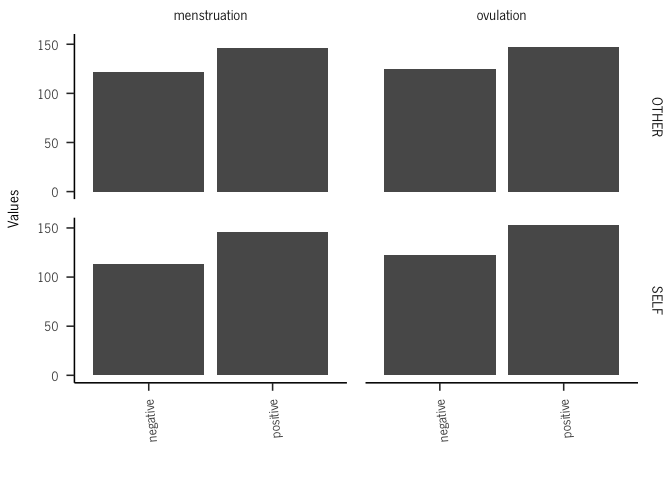
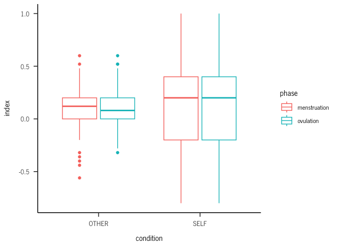
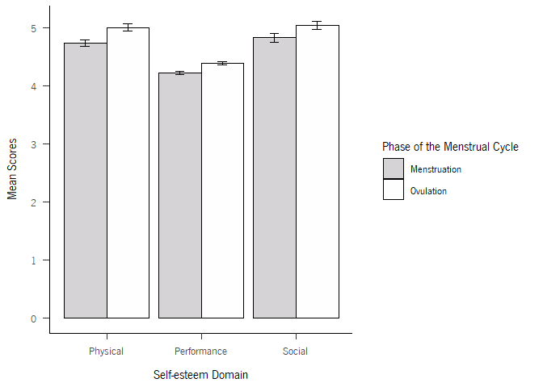
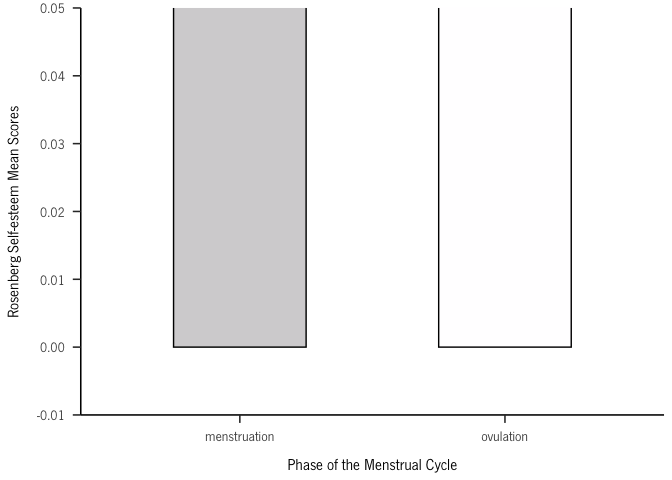

Self-esteem across the menstrual cycle
================
2023

``` r
library(readxl)
library(dplyr)
```

    ## 
    ## Attaching package: 'dplyr'

    ## The following objects are masked from 'package:stats':
    ## 
    ##     filter, lag

    ## The following objects are masked from 'package:base':
    ## 
    ##     intersect, setdiff, setequal, union

``` r
library(ggplot2)
```

    ## Warning: package 'ggplot2' was built under R version 4.2.2

``` r
library("plotrix")
library(sjPlot)
```

    ## Warning: package 'sjPlot' was built under R version 4.2.3

    ## #refugeeswelcome

``` r
brutos = data$`Dados_brutos (3)`
head(brutos)
```

    ##   participant LINE BLOCO        rt correct condition PRIME_VAL PRIME_TYPE
    ## 1       AA556    0     1 0.4174751       0         2  positive      OTHER
    ## 2       AA556    1     1 0.1681083       1         2  positive      OTHER
    ## 3       AA556    2     1 0.5012267       0         2  negative      OTHER
    ## 4       AA556    3     1 0.4864544       1         2  negative      OTHER
    ## 5       AA556    4     1 0.4847672       0         2  negative      OTHER
    ## 6       AA556    5     1 0.5007748       1         2  positive      OTHER
    ##        PICTURE TARGET        PHASE
    ## 1    VPN07.jpg  linda menstruation
    ## 2    VPN09.jpg  capaz menstruation
    ## 3    VPN07.jpg inútil menstruation
    ## 4    VPN04.jpg   feia menstruation
    ## 5    VPN02.jpg triste menstruation
    ## 6 femcon_2.jpg genial menstruation

\#parse target

``` r
for (i in 1:nrow(brutos)){
  if(substr(brutos$TARGET[i],nchar(brutos$TARGET[i])-2,nchar(brutos$TARGET[i])) == "til"){
    brutos$TARGET[i] = "inútil"  
  }
}
```

\#check

``` r
brutos %>%
  mutate(new = case_when(TARGET == "alegre" ~ "positive",
                         TARGET =="capaz" ~ "positive",
                         TARGET == "confiante" ~ "positive",
                         TARGET == "genial" ~ "positive",
                         TARGET == "linda" ~ "positive"
                                ,TRUE ~ 'negative'
                                )) %>% pull(new) -> new

a = new == brutos$PRIME_VAL 
soma = sum(a, na.rm = TRUE) # best way to count TRUE values
soma == length(a)
```

    ## [1] TRUE

\#check participant’s id

``` r
summary(factor(brutos$participant))
```

    ## AA556 AA696 ab116 AF841 av734 BF401 BJ960 CA306 CC522 CJ335 cj967 CJ967 EG406 
    ##   452   513   446   526   285   491   508   359   101   479   242   261   520 
    ## GA454 GJ487 IJ887 JJ997 Lf380 LF380 MA007 MA565 ma889 MA889 MA929 MA969 mb968 
    ##   458   492   433   385   224   207   511   328   145   175   312   472   444 
    ## ME324 mj243 MJ690 MJ803 MM350 MM533 MM586 MM714 MP177 MR971 NA210 nj182 NJ182 
    ##   471   436   137   412   425   363   459   437   536   331   481   166   146 
    ## nj267 NJ267 OR883 PF580 rf539 RF539 RJ673 RR863 SJ292 SJ302 sj313 SJ313 SJ513 
    ##   209   160   489   505   228   278   441   461   364   451   269   272   444 
    ## SJ874 sm247 sm370 sm416 SM416 SP123 SR421 tp158 TP158 VA606 
    ##   480   411   473   144   169   424   380   226   239   315

``` r
#to lower case all cols
names(brutos) <- tolower(names(brutos))

brutos$participant = tolower(brutos$participant)

#brutos %>% group_by(participant) %>% count()
```

``` r
library(extrafont)
```

    ## Warning: package 'extrafont' was built under R version 4.2.2

    ## Registering fonts with R

``` r
#font_import("C:/Users/nunok/AppData/Local/Microsoft/Windows/Fonts")

loadfonts()
```

    ## Agency FB already registered with windowsFonts().

    ## Algerian already registered with windowsFonts().

    ## Arial Black already registered with windowsFonts().

    ## Arial already registered with windowsFonts().

    ## Arial Narrow already registered with windowsFonts().

    ## Arial Nova already registered with windowsFonts().

    ## Arial Nova Light already registered with windowsFonts().

    ## Arial Nova Cond already registered with windowsFonts().

    ## Arial Nova Cond Light already registered with windowsFonts().

    ## Arial Rounded MT Bold already registered with windowsFonts().

    ## Bahnschrift already registered with windowsFonts().

    ## Baskerville Old Face already registered with windowsFonts().

    ## Bauhaus 93 already registered with windowsFonts().

    ## Bell MT already registered with windowsFonts().

    ## Berlin Sans FB already registered with windowsFonts().

    ## Berlin Sans FB Demi already registered with windowsFonts().

    ## Bernard MT Condensed already registered with windowsFonts().

    ## Blackadder ITC already registered with windowsFonts().

    ## Bodoni MT already registered with windowsFonts().

    ## Bodoni MT Black already registered with windowsFonts().

    ## Bodoni MT Condensed already registered with windowsFonts().

    ## Bodoni MT Poster Compressed already registered with windowsFonts().

    ## Book Antiqua already registered with windowsFonts().

    ## Bookman Old Style already registered with windowsFonts().

    ## Bookshelf Symbol 7 already registered with windowsFonts().

    ## Bradley Hand ITC already registered with windowsFonts().

    ## Britannic Bold already registered with windowsFonts().

    ## Broadway already registered with windowsFonts().

    ## Brush Script MT already registered with windowsFonts().

    ## Calibri already registered with windowsFonts().

    ## Calibri Light already registered with windowsFonts().

    ## Californian FB already registered with windowsFonts().

    ## Calisto MT already registered with windowsFonts().

    ## Cambria already registered with windowsFonts().

    ## Candara already registered with windowsFonts().

    ## Candara Light already registered with windowsFonts().

    ## Castellar already registered with windowsFonts().

    ## Centaur already registered with windowsFonts().

    ## Century already registered with windowsFonts().

    ## Century Gothic already registered with windowsFonts().

    ## Century Schoolbook already registered with windowsFonts().

    ## Chiller already registered with windowsFonts().

    ## Colonna MT already registered with windowsFonts().

    ## Comic Sans MS already registered with windowsFonts().

    ## Consolas already registered with windowsFonts().

    ## Constantia already registered with windowsFonts().

    ## Cooper Black already registered with windowsFonts().

    ## Copperplate Gothic Bold already registered with windowsFonts().

    ## Copperplate Gothic Light already registered with windowsFonts().

    ## Corbel already registered with windowsFonts().

    ## Corbel Light already registered with windowsFonts().

    ## Courier New already registered with windowsFonts().

    ## Curlz MT already registered with windowsFonts().

    ## Dubai already registered with windowsFonts().

    ## Dubai Light already registered with windowsFonts().

    ## Dubai Medium already registered with windowsFonts().

    ## Ebrima already registered with windowsFonts().

    ## Edwardian Script ITC already registered with windowsFonts().

    ## Elephant already registered with windowsFonts().

    ## Engravers MT already registered with windowsFonts().

    ## Eras Bold ITC already registered with windowsFonts().

    ## Eras Demi ITC already registered with windowsFonts().

    ## Eras Light ITC already registered with windowsFonts().

    ## Eras Medium ITC already registered with windowsFonts().

    ## Felix Titling already registered with windowsFonts().

    ## Footlight MT Light already registered with windowsFonts().

    ## Forte already registered with windowsFonts().

    ## Franklin Gothic Book already registered with windowsFonts().

    ## Franklin Gothic Demi already registered with windowsFonts().

    ## Franklin Gothic Demi Cond already registered with windowsFonts().

    ## Franklin Gothic Heavy already registered with windowsFonts().

    ## Franklin Gothic Medium already registered with windowsFonts().

    ## Franklin Gothic Medium Cond already registered with windowsFonts().

    ## Freestyle Script already registered with windowsFonts().

    ## French Script MT already registered with windowsFonts().

    ## Gabriola already registered with windowsFonts().

    ## Gadugi already registered with windowsFonts().

    ## Garamond already registered with windowsFonts().

    ## Georgia already registered with windowsFonts().

    ## Georgia Pro Black already registered with windowsFonts().

    ## Georgia Pro already registered with windowsFonts().

    ## Georgia Pro Cond Black already registered with windowsFonts().

    ## Georgia Pro Cond already registered with windowsFonts().

    ## Georgia Pro Cond Light already registered with windowsFonts().

    ## Georgia Pro Cond Semibold already registered with windowsFonts().

    ## Georgia Pro Light already registered with windowsFonts().

    ## Georgia Pro Semibold already registered with windowsFonts().

    ## Gigi already registered with windowsFonts().

    ## Gill Sans Ultra Bold already registered with windowsFonts().

    ## Gill Sans Ultra Bold Condensed already registered with windowsFonts().

    ## Gill Sans MT already registered with windowsFonts().

    ## Gill Sans MT Condensed already registered with windowsFonts().

    ## Gill Sans MT Ext Condensed Bold already registered with windowsFonts().

    ## Gill Sans Nova already registered with windowsFonts().

    ## Gill Sans Nova Cond already registered with windowsFonts().

    ## Gill Sans Nova Cond Lt already registered with windowsFonts().

    ## Gill Sans Nova Cond Ultra Bold already registered with windowsFonts().

    ## Gill Sans Nova Cond XBd already registered with windowsFonts().

    ## Gill Sans Nova Light already registered with windowsFonts().

    ## Gill Sans Nova Ultra Bold already registered with windowsFonts().

    ## Gloucester MT Extra Condensed already registered with windowsFonts().

    ## Goudy Old Style already registered with windowsFonts().

    ## Goudy Stout already registered with windowsFonts().

    ## Haettenschweiler already registered with windowsFonts().

    ## Harlow Solid Italic already registered with windowsFonts().

    ## Harrington already registered with windowsFonts().

    ## High Tower Text already registered with windowsFonts().

    ## HoloLens MDL2 Assets already registered with windowsFonts().

    ## HP Simplified already registered with windowsFonts().

    ## HP Simplified Light already registered with windowsFonts().

    ## HP Simplified Hans Light already registered with windowsFonts().

    ## HP Simplified Hans already registered with windowsFonts().

    ## HP Simplified Jpan Light already registered with windowsFonts().

    ## HP Simplified Jpan already registered with windowsFonts().

    ## Impact already registered with windowsFonts().

    ## Imprint MT Shadow already registered with windowsFonts().

    ## Informal Roman already registered with windowsFonts().

    ## Ink Free already registered with windowsFonts().

    ## Javanese Text already registered with windowsFonts().

    ## Jokerman already registered with windowsFonts().

    ## Juice ITC already registered with windowsFonts().

    ## Kristen ITC already registered with windowsFonts().

    ## Kunstler Script already registered with windowsFonts().

    ## Wide Latin already registered with windowsFonts().

    ## Leelawadee UI already registered with windowsFonts().

    ## Leelawadee UI Semilight already registered with windowsFonts().

    ## Lucida Bright already registered with windowsFonts().

    ## Lucida Calligraphy already registered with windowsFonts().

    ## Lucida Console already registered with windowsFonts().

    ## Lucida Fax already registered with windowsFonts().

    ## Lucida Handwriting already registered with windowsFonts().

    ## Lucida Sans already registered with windowsFonts().

    ## Lucida Sans Typewriter already registered with windowsFonts().

    ## Lucida Sans Unicode already registered with windowsFonts().

    ## Magneto already registered with windowsFonts().

    ## Maiandra GD already registered with windowsFonts().

    ## Malgun Gothic already registered with windowsFonts().

    ## Malgun Gothic Semilight already registered with windowsFonts().

    ## Marlett already registered with windowsFonts().

    ## Matura MT Script Capitals already registered with windowsFonts().

    ## Microsoft Himalaya already registered with windowsFonts().

    ## Microsoft Yi Baiti already registered with windowsFonts().

    ## Microsoft New Tai Lue already registered with windowsFonts().

    ## Microsoft PhagsPa already registered with windowsFonts().

    ## Microsoft Sans Serif already registered with windowsFonts().

    ## Microsoft Tai Le already registered with windowsFonts().

    ## Mistral already registered with windowsFonts().

    ## Modern No. 20 already registered with windowsFonts().

    ## Mongolian Baiti already registered with windowsFonts().

    ## Monotype Corsiva already registered with windowsFonts().

    ## Montserrat already registered with windowsFonts().

    ## MS Outlook already registered with windowsFonts().

    ## MS Reference Sans Serif already registered with windowsFonts().

    ## MS Reference Specialty already registered with windowsFonts().

    ## MT Extra already registered with windowsFonts().

    ## MV Boli already registered with windowsFonts().

    ## Myanmar Text already registered with windowsFonts().

    ## Neue Haas Grotesk Text Pro already registered with windowsFonts().

    ## NewsGotT already registered with windowsFonts().

    ## Niagara Engraved already registered with windowsFonts().

    ## Niagara Solid already registered with windowsFonts().

    ## Nirmala UI already registered with windowsFonts().

    ## Nirmala UI Semilight already registered with windowsFonts().

    ## OCR A Extended already registered with windowsFonts().

    ## Old English Text MT already registered with windowsFonts().

    ## Onyx already registered with windowsFonts().

    ## Palace Script MT already registered with windowsFonts().

    ## Palatino Linotype already registered with windowsFonts().

    ## Papyrus already registered with windowsFonts().

    ## Parchment already registered with windowsFonts().

    ## Perpetua already registered with windowsFonts().

    ## Perpetua Titling MT already registered with windowsFonts().

    ## Playbill already registered with windowsFonts().

    ## Poor Richard already registered with windowsFonts().

    ## Pristina already registered with windowsFonts().

    ## Rage Italic already registered with windowsFonts().

    ## Ravie already registered with windowsFonts().

    ## Rockwell already registered with windowsFonts().

    ## Rockwell Condensed already registered with windowsFonts().

    ## Rockwell Extra Bold already registered with windowsFonts().

    ## Rockwell Nova already registered with windowsFonts().

    ## Rockwell Nova Cond already registered with windowsFonts().

    ## Rockwell Nova Cond Light already registered with windowsFonts().

    ## Rockwell Nova Extra Bold already registered with windowsFonts().

    ## Rockwell Nova Light already registered with windowsFonts().

    ## Sans Serif Collection already registered with windowsFonts().

    ## Script MT Bold already registered with windowsFonts().

    ## Segoe Fluent Icons already registered with windowsFonts().

    ## Segoe MDL2 Assets already registered with windowsFonts().

    ## Segoe Print already registered with windowsFonts().

    ## Segoe Script already registered with windowsFonts().

    ## Segoe UI already registered with windowsFonts().

    ## Segoe UI Light already registered with windowsFonts().

    ## Segoe UI Semibold already registered with windowsFonts().

    ## Segoe UI Semilight already registered with windowsFonts().

    ## Segoe UI Black already registered with windowsFonts().

    ## Segoe UI Historic already registered with windowsFonts().

    ## Segoe UI Symbol already registered with windowsFonts().

    ## Segoe UI Variable already registered with windowsFonts().

    ## Showcard Gothic already registered with windowsFonts().

    ## SimSun-ExtB already registered with windowsFonts().

    ## Sitka Text already registered with windowsFonts().

    ## Snap ITC already registered with windowsFonts().

    ## Stencil already registered with windowsFonts().

    ## Sylfaen already registered with windowsFonts().

    ## Symbol already registered with windowsFonts().

    ## Tahoma already registered with windowsFonts().

    ## Tempus Sans ITC already registered with windowsFonts().

    ## Times New Roman already registered with windowsFonts().

    ## Trebuchet MS already registered with windowsFonts().

    ## Tw Cen MT already registered with windowsFonts().

    ## Tw Cen MT Condensed already registered with windowsFonts().

    ## Tw Cen MT Condensed Extra Bold already registered with windowsFonts().

    ## Ubuntu already registered with windowsFonts().

    ## Verdana already registered with windowsFonts().

    ## Verdana Pro already registered with windowsFonts().

    ## Verdana Pro Black already registered with windowsFonts().

    ## Verdana Pro Cond Black already registered with windowsFonts().

    ## Verdana Pro Cond already registered with windowsFonts().

    ## Verdana Pro Cond Light already registered with windowsFonts().

    ## Verdana Pro Cond Semibold already registered with windowsFonts().

    ## Verdana Pro Light already registered with windowsFonts().

    ## Verdana Pro Semibold already registered with windowsFonts().

    ## Viner Hand ITC already registered with windowsFonts().

    ## Vivaldi already registered with windowsFonts().

    ## Vladimir Script already registered with windowsFonts().

    ## Webdings already registered with windowsFonts().

    ## Wingdings already registered with windowsFonts().

    ## Wingdings 2 already registered with windowsFonts().

    ## Wingdings 3 already registered with windowsFonts().

    ## Agency FB already registered with pdfFont().

    ## Algerian already registered with pdfFont().

    ## Arial already registered with pdfFont().

    ## Arial Black already registered with pdfFont().

    ## Arial Narrow already registered with pdfFont().

    ## Arial Nova already registered with pdfFont().

    ## Arial Nova Cond already registered with pdfFont().

    ## Arial Nova Cond Light already registered with pdfFont().

    ## Arial Nova Light already registered with pdfFont().

    ## Arial Rounded MT Bold already registered with pdfFont().

    ## Bahnschrift already registered with pdfFont().

    ## Baskerville Old Face already registered with pdfFont().

    ## Bauhaus 93 already registered with pdfFont().

    ## Bell MT already registered with pdfFont().

    ## Berlin Sans FB already registered with pdfFont().

    ## No regular (non-bold, non-italic) version of Berlin Sans FB Demi. Skipping setup for this font.

    ## Bernard MT Condensed already registered with pdfFont().

    ## Blackadder ITC already registered with pdfFont().

    ## Bodoni MT already registered with pdfFont().

    ## Bodoni MT Black already registered with pdfFont().

    ## Bodoni MT Condensed already registered with pdfFont().

    ## Bodoni MT Poster Compressed already registered with pdfFont().

    ## Book Antiqua already registered with pdfFont().

    ## Bookman Old Style already registered with pdfFont().

    ## Bookshelf Symbol 7 already registered with pdfFont().

    ## Bradley Hand ITC already registered with pdfFont().

    ## Britannic Bold already registered with pdfFont().

    ## Broadway already registered with pdfFont().

    ## No regular (non-bold, non-italic) version of Brush Script MT. Skipping setup for this font.

    ## Calibri already registered with pdfFont().

    ## Calibri Light already registered with pdfFont().

    ## Californian FB already registered with pdfFont().

    ## Calisto MT already registered with pdfFont().

    ## No regular (non-bold, non-italic) version of Cambria. Skipping setup for this font.

    ## Candara already registered with pdfFont().

    ## Candara Light already registered with pdfFont().

    ## Castellar already registered with pdfFont().

    ## Centaur already registered with pdfFont().

    ## Century already registered with pdfFont().

    ## Century Gothic already registered with pdfFont().

    ## Century Schoolbook already registered with pdfFont().

    ## Chiller already registered with pdfFont().

    ## Colonna MT already registered with pdfFont().

    ## Comic Sans MS already registered with pdfFont().

    ## Consolas already registered with pdfFont().

    ## Constantia already registered with pdfFont().

    ## Cooper Black already registered with pdfFont().

    ## Copperplate Gothic Bold already registered with pdfFont().

    ## Copperplate Gothic Light already registered with pdfFont().

    ## Corbel already registered with pdfFont().

    ## Corbel Light already registered with pdfFont().

    ## Courier New already registered with pdfFont().

    ## Curlz MT already registered with pdfFont().

    ## Dubai already registered with pdfFont().

    ## Dubai Light already registered with pdfFont().

    ## Dubai Medium already registered with pdfFont().

    ## Ebrima already registered with pdfFont().

    ## Edwardian Script ITC already registered with pdfFont().

    ## Elephant already registered with pdfFont().

    ## Engravers MT already registered with pdfFont().

    ## Eras Bold ITC already registered with pdfFont().

    ## Eras Demi ITC already registered with pdfFont().

    ## Eras Light ITC already registered with pdfFont().

    ## Eras Medium ITC already registered with pdfFont().

    ## Felix Titling already registered with pdfFont().

    ## Footlight MT Light already registered with pdfFont().

    ## Forte already registered with pdfFont().

    ## Franklin Gothic Book already registered with pdfFont().

    ## Franklin Gothic Demi already registered with pdfFont().

    ## Franklin Gothic Demi Cond already registered with pdfFont().

    ## Franklin Gothic Heavy already registered with pdfFont().

    ## Franklin Gothic Medium already registered with pdfFont().

    ## Franklin Gothic Medium Cond already registered with pdfFont().

    ## Freestyle Script already registered with pdfFont().

    ## French Script MT already registered with pdfFont().

    ## Gabriola already registered with pdfFont().

    ## Gadugi already registered with pdfFont().

    ## Garamond already registered with pdfFont().

    ## Georgia already registered with pdfFont().

    ## Georgia Pro already registered with pdfFont().

    ## Georgia Pro Black already registered with pdfFont().

    ## Georgia Pro Cond already registered with pdfFont().

    ## Georgia Pro Cond Black already registered with pdfFont().

    ## Georgia Pro Cond Light already registered with pdfFont().

    ## Georgia Pro Cond Semibold already registered with pdfFont().

    ## Georgia Pro Light already registered with pdfFont().

    ## Georgia Pro Semibold already registered with pdfFont().

    ## Gigi already registered with pdfFont().

    ## Gill Sans MT already registered with pdfFont().

    ## Gill Sans MT Condensed already registered with pdfFont().

    ## Gill Sans MT Ext Condensed Bold already registered with pdfFont().

    ## Gill Sans Nova already registered with pdfFont().

    ## Gill Sans Nova Cond already registered with pdfFont().

    ## Gill Sans Nova Cond Lt already registered with pdfFont().

    ## Gill Sans Nova Cond Ultra Bold already registered with pdfFont().

    ## Gill Sans Nova Cond XBd already registered with pdfFont().

    ## Gill Sans Nova Light already registered with pdfFont().

    ## Gill Sans Nova Ultra Bold already registered with pdfFont().

    ## Gill Sans Ultra Bold already registered with pdfFont().

    ## Gill Sans Ultra Bold Condensed already registered with pdfFont().

    ## Gloucester MT Extra Condensed already registered with pdfFont().

    ## Goudy Old Style already registered with pdfFont().

    ## Goudy Stout already registered with pdfFont().

    ## Haettenschweiler already registered with pdfFont().

    ## No regular (non-bold, non-italic) version of Harlow Solid Italic. Skipping setup for this font.

    ## Harrington already registered with pdfFont().

    ## High Tower Text already registered with pdfFont().

    ## HoloLens MDL2 Assets already registered with pdfFont().

    ## HP Simplified already registered with pdfFont().

    ## HP Simplified Hans already registered with pdfFont().

    ## HP Simplified Hans Light already registered with pdfFont().

    ## HP Simplified Jpan already registered with pdfFont().

    ## HP Simplified Jpan Light already registered with pdfFont().

    ## HP Simplified Light already registered with pdfFont().

    ## Impact already registered with pdfFont().

    ## Imprint MT Shadow already registered with pdfFont().

    ## Informal Roman already registered with pdfFont().

    ## Ink Free already registered with pdfFont().

    ## Javanese Text already registered with pdfFont().

    ## Jokerman already registered with pdfFont().

    ## Juice ITC already registered with pdfFont().

    ## Kristen ITC already registered with pdfFont().

    ## Kunstler Script already registered with pdfFont().

    ## Leelawadee UI already registered with pdfFont().

    ## Leelawadee UI Semilight already registered with pdfFont().

    ## More than one version of regular/bold/italic found for Lucida Bright. Skipping setup for this font.

    ## No regular (non-bold, non-italic) version of Lucida Calligraphy. Skipping setup for this font.

    ## Lucida Console already registered with pdfFont().

    ## More than one version of regular/bold/italic found for Lucida Fax. Skipping setup for this font.

    ## No regular (non-bold, non-italic) version of Lucida Handwriting. Skipping setup for this font.

    ## More than one version of regular/bold/italic found for Lucida Sans. Skipping setup for this font.

    ## Lucida Sans Typewriter already registered with pdfFont().

    ## Lucida Sans Unicode already registered with pdfFont().

    ## No regular (non-bold, non-italic) version of Magneto. Skipping setup for this font.

    ## Maiandra GD already registered with pdfFont().

    ## Malgun Gothic already registered with pdfFont().

    ## Malgun Gothic Semilight already registered with pdfFont().

    ## Marlett already registered with pdfFont().

    ## Matura MT Script Capitals already registered with pdfFont().

    ## Microsoft Himalaya already registered with pdfFont().

    ## Microsoft New Tai Lue already registered with pdfFont().

    ## Microsoft PhagsPa already registered with pdfFont().

    ## Microsoft Sans Serif already registered with pdfFont().

    ## Microsoft Tai Le already registered with pdfFont().

    ## Microsoft Yi Baiti already registered with pdfFont().

    ## Mistral already registered with pdfFont().

    ## Modern No. 20 already registered with pdfFont().

    ## Mongolian Baiti already registered with pdfFont().

    ## Monotype Corsiva already registered with pdfFont().

    ## Montserrat already registered with pdfFont().

    ## MS Outlook already registered with pdfFont().

    ## MS Reference Sans Serif already registered with pdfFont().

    ## MS Reference Specialty already registered with pdfFont().

    ## MT Extra already registered with pdfFont().

    ## MV Boli already registered with pdfFont().

    ## Myanmar Text already registered with pdfFont().

    ## Neue Haas Grotesk Text Pro already registered with pdfFont().

    ## NewsGotT already registered with pdfFont().

    ## Niagara Engraved already registered with pdfFont().

    ## Niagara Solid already registered with pdfFont().

    ## Nirmala UI already registered with pdfFont().

    ## Nirmala UI Semilight already registered with pdfFont().

    ## OCR A Extended already registered with pdfFont().

    ## Old English Text MT already registered with pdfFont().

    ## Onyx already registered with pdfFont().

    ## Palace Script MT already registered with pdfFont().

    ## Palatino Linotype already registered with pdfFont().

    ## Papyrus already registered with pdfFont().

    ## Parchment already registered with pdfFont().

    ## Perpetua already registered with pdfFont().

    ## Perpetua Titling MT already registered with pdfFont().

    ## Playbill already registered with pdfFont().

    ## Poor Richard already registered with pdfFont().

    ## Pristina already registered with pdfFont().

    ## No regular (non-bold, non-italic) version of Rage Italic. Skipping setup for this font.

    ## Ravie already registered with pdfFont().

    ## Rockwell already registered with pdfFont().

    ## Rockwell Condensed already registered with pdfFont().

    ## Rockwell Extra Bold already registered with pdfFont().

    ## Rockwell Nova already registered with pdfFont().

    ## Rockwell Nova Cond already registered with pdfFont().

    ## Rockwell Nova Cond Light already registered with pdfFont().

    ## Rockwell Nova Extra Bold already registered with pdfFont().

    ## Rockwell Nova Light already registered with pdfFont().

    ## Sans Serif Collection already registered with pdfFont().

    ## Script MT Bold already registered with pdfFont().

    ## Segoe Fluent Icons already registered with pdfFont().

    ## Segoe MDL2 Assets already registered with pdfFont().

    ## Segoe Print already registered with pdfFont().

    ## Segoe Script already registered with pdfFont().

    ## Segoe UI already registered with pdfFont().

    ## Segoe UI Black already registered with pdfFont().

    ## Segoe UI Historic already registered with pdfFont().

    ## Segoe UI Light already registered with pdfFont().

    ## Segoe UI Semibold already registered with pdfFont().

    ## Segoe UI Semilight already registered with pdfFont().

    ## Segoe UI Symbol already registered with pdfFont().

    ## Segoe UI Variable already registered with pdfFont().

    ## Showcard Gothic already registered with pdfFont().

    ## SimSun-ExtB already registered with pdfFont().

    ## Sitka Text already registered with pdfFont().

    ## Snap ITC already registered with pdfFont().

    ## Stencil already registered with pdfFont().

    ## Sylfaen already registered with pdfFont().

    ## Symbol already registered with pdfFont().

    ## Tahoma already registered with pdfFont().

    ## Tempus Sans ITC already registered with pdfFont().

    ## Times New Roman already registered with pdfFont().

    ## Trebuchet MS already registered with pdfFont().

    ## Tw Cen MT already registered with pdfFont().

    ## Tw Cen MT Condensed already registered with pdfFont().

    ## Tw Cen MT Condensed Extra Bold already registered with pdfFont().

    ## Ubuntu already registered with pdfFont().

    ## Verdana already registered with pdfFont().

    ## Verdana Pro already registered with pdfFont().

    ## Verdana Pro Black already registered with pdfFont().

    ## Verdana Pro Cond already registered with pdfFont().

    ## Verdana Pro Cond Black already registered with pdfFont().

    ## Verdana Pro Cond Light already registered with pdfFont().

    ## Verdana Pro Cond Semibold already registered with pdfFont().

    ## Verdana Pro Light already registered with pdfFont().

    ## Verdana Pro Semibold already registered with pdfFont().

    ## Viner Hand ITC already registered with pdfFont().

    ## No regular (non-bold, non-italic) version of Vivaldi. Skipping setup for this font.

    ## Vladimir Script already registered with pdfFont().

    ## Webdings already registered with pdfFont().

    ## Wide Latin already registered with pdfFont().

    ## Wingdings already registered with pdfFont().

    ## Wingdings 2 already registered with pdfFont().

    ## Wingdings 3 already registered with pdfFont().

    ## Agency FB already registered with postscriptFont().

    ## Algerian already registered with postscriptFont().

    ## Arial already registered with postscriptFont().

    ## Arial Black already registered with postscriptFont().

    ## Arial Narrow already registered with postscriptFont().

    ## Arial Nova already registered with postscriptFont().

    ## Arial Nova Cond already registered with postscriptFont().

    ## Arial Nova Cond Light already registered with postscriptFont().

    ## Arial Nova Light already registered with postscriptFont().

    ## Arial Rounded MT Bold already registered with postscriptFont().

    ## Bahnschrift already registered with postscriptFont().

    ## Baskerville Old Face already registered with postscriptFont().

    ## Bauhaus 93 already registered with postscriptFont().

    ## Bell MT already registered with postscriptFont().

    ## Berlin Sans FB already registered with postscriptFont().

    ## No regular (non-bold, non-italic) version of Berlin Sans FB Demi. Skipping setup for this font.

    ## Bernard MT Condensed already registered with postscriptFont().

    ## Blackadder ITC already registered with postscriptFont().

    ## Bodoni MT already registered with postscriptFont().

    ## Bodoni MT Black already registered with postscriptFont().

    ## Bodoni MT Condensed already registered with postscriptFont().

    ## Bodoni MT Poster Compressed already registered with postscriptFont().

    ## Book Antiqua already registered with postscriptFont().

    ## Bookman Old Style already registered with postscriptFont().

    ## Bookshelf Symbol 7 already registered with postscriptFont().

    ## Bradley Hand ITC already registered with postscriptFont().

    ## Britannic Bold already registered with postscriptFont().

    ## Broadway already registered with postscriptFont().

    ## No regular (non-bold, non-italic) version of Brush Script MT. Skipping setup for this font.

    ## Calibri already registered with postscriptFont().

    ## Calibri Light already registered with postscriptFont().

    ## Californian FB already registered with postscriptFont().

    ## Calisto MT already registered with postscriptFont().

    ## No regular (non-bold, non-italic) version of Cambria. Skipping setup for this font.

    ## Candara already registered with postscriptFont().

    ## Candara Light already registered with postscriptFont().

    ## Castellar already registered with postscriptFont().

    ## Centaur already registered with postscriptFont().

    ## Century already registered with postscriptFont().

    ## Century Gothic already registered with postscriptFont().

    ## Century Schoolbook already registered with postscriptFont().

    ## Chiller already registered with postscriptFont().

    ## Colonna MT already registered with postscriptFont().

    ## Comic Sans MS already registered with postscriptFont().

    ## Consolas already registered with postscriptFont().

    ## Constantia already registered with postscriptFont().

    ## Cooper Black already registered with postscriptFont().

    ## Copperplate Gothic Bold already registered with postscriptFont().

    ## Copperplate Gothic Light already registered with postscriptFont().

    ## Corbel already registered with postscriptFont().

    ## Corbel Light already registered with postscriptFont().

    ## Courier New already registered with postscriptFont().

    ## Curlz MT already registered with postscriptFont().

    ## Dubai already registered with postscriptFont().

    ## Dubai Light already registered with postscriptFont().

    ## Dubai Medium already registered with postscriptFont().

    ## Ebrima already registered with postscriptFont().

    ## Edwardian Script ITC already registered with postscriptFont().

    ## Elephant already registered with postscriptFont().

    ## Engravers MT already registered with postscriptFont().

    ## Eras Bold ITC already registered with postscriptFont().

    ## Eras Demi ITC already registered with postscriptFont().

    ## Eras Light ITC already registered with postscriptFont().

    ## Eras Medium ITC already registered with postscriptFont().

    ## Felix Titling already registered with postscriptFont().

    ## Footlight MT Light already registered with postscriptFont().

    ## Forte already registered with postscriptFont().

    ## Franklin Gothic Book already registered with postscriptFont().

    ## Franklin Gothic Demi already registered with postscriptFont().

    ## Franklin Gothic Demi Cond already registered with postscriptFont().

    ## Franklin Gothic Heavy already registered with postscriptFont().

    ## Franklin Gothic Medium already registered with postscriptFont().

    ## Franklin Gothic Medium Cond already registered with postscriptFont().

    ## Freestyle Script already registered with postscriptFont().

    ## French Script MT already registered with postscriptFont().

    ## Gabriola already registered with postscriptFont().

    ## Gadugi already registered with postscriptFont().

    ## Garamond already registered with postscriptFont().

    ## Georgia already registered with postscriptFont().

    ## Georgia Pro already registered with postscriptFont().

    ## Georgia Pro Black already registered with postscriptFont().

    ## Georgia Pro Cond already registered with postscriptFont().

    ## Georgia Pro Cond Black already registered with postscriptFont().

    ## Georgia Pro Cond Light already registered with postscriptFont().

    ## Georgia Pro Cond Semibold already registered with postscriptFont().

    ## Georgia Pro Light already registered with postscriptFont().

    ## Georgia Pro Semibold already registered with postscriptFont().

    ## Gigi already registered with postscriptFont().

    ## Gill Sans MT already registered with postscriptFont().

    ## Gill Sans MT Condensed already registered with postscriptFont().

    ## Gill Sans MT Ext Condensed Bold already registered with postscriptFont().

    ## Gill Sans Nova already registered with postscriptFont().

    ## Gill Sans Nova Cond already registered with postscriptFont().

    ## Gill Sans Nova Cond Lt already registered with postscriptFont().

    ## Gill Sans Nova Cond Ultra Bold already registered with postscriptFont().

    ## Gill Sans Nova Cond XBd already registered with postscriptFont().

    ## Gill Sans Nova Light already registered with postscriptFont().

    ## Gill Sans Nova Ultra Bold already registered with postscriptFont().

    ## Gill Sans Ultra Bold already registered with postscriptFont().

    ## Gill Sans Ultra Bold Condensed already registered with postscriptFont().

    ## Gloucester MT Extra Condensed already registered with postscriptFont().

    ## Goudy Old Style already registered with postscriptFont().

    ## Goudy Stout already registered with postscriptFont().

    ## Haettenschweiler already registered with postscriptFont().

    ## No regular (non-bold, non-italic) version of Harlow Solid Italic. Skipping setup for this font.

    ## Harrington already registered with postscriptFont().

    ## High Tower Text already registered with postscriptFont().

    ## HoloLens MDL2 Assets already registered with postscriptFont().

    ## HP Simplified already registered with postscriptFont().

    ## HP Simplified Hans already registered with postscriptFont().

    ## HP Simplified Hans Light already registered with postscriptFont().

    ## HP Simplified Jpan already registered with postscriptFont().

    ## HP Simplified Jpan Light already registered with postscriptFont().

    ## HP Simplified Light already registered with postscriptFont().

    ## Impact already registered with postscriptFont().

    ## Imprint MT Shadow already registered with postscriptFont().

    ## Informal Roman already registered with postscriptFont().

    ## Ink Free already registered with postscriptFont().

    ## Javanese Text already registered with postscriptFont().

    ## Jokerman already registered with postscriptFont().

    ## Juice ITC already registered with postscriptFont().

    ## Kristen ITC already registered with postscriptFont().

    ## Kunstler Script already registered with postscriptFont().

    ## Leelawadee UI already registered with postscriptFont().

    ## Leelawadee UI Semilight already registered with postscriptFont().

    ## More than one version of regular/bold/italic found for Lucida Bright. Skipping setup for this font.

    ## No regular (non-bold, non-italic) version of Lucida Calligraphy. Skipping setup for this font.

    ## Lucida Console already registered with postscriptFont().

    ## More than one version of regular/bold/italic found for Lucida Fax. Skipping setup for this font.

    ## No regular (non-bold, non-italic) version of Lucida Handwriting. Skipping setup for this font.

    ## More than one version of regular/bold/italic found for Lucida Sans. Skipping setup for this font.

    ## Lucida Sans Typewriter already registered with postscriptFont().

    ## Lucida Sans Unicode already registered with postscriptFont().

    ## No regular (non-bold, non-italic) version of Magneto. Skipping setup for this font.

    ## Maiandra GD already registered with postscriptFont().

    ## Malgun Gothic already registered with postscriptFont().

    ## Malgun Gothic Semilight already registered with postscriptFont().

    ## Marlett already registered with postscriptFont().

    ## Matura MT Script Capitals already registered with postscriptFont().

    ## Microsoft Himalaya already registered with postscriptFont().

    ## Microsoft New Tai Lue already registered with postscriptFont().

    ## Microsoft PhagsPa already registered with postscriptFont().

    ## Microsoft Sans Serif already registered with postscriptFont().

    ## Microsoft Tai Le already registered with postscriptFont().

    ## Microsoft Yi Baiti already registered with postscriptFont().

    ## Mistral already registered with postscriptFont().

    ## Modern No. 20 already registered with postscriptFont().

    ## Mongolian Baiti already registered with postscriptFont().

    ## Monotype Corsiva already registered with postscriptFont().

    ## Montserrat already registered with postscriptFont().

    ## MS Outlook already registered with postscriptFont().

    ## MS Reference Sans Serif already registered with postscriptFont().

    ## MS Reference Specialty already registered with postscriptFont().

    ## MT Extra already registered with postscriptFont().

    ## MV Boli already registered with postscriptFont().

    ## Myanmar Text already registered with postscriptFont().

    ## Neue Haas Grotesk Text Pro already registered with postscriptFont().

    ## NewsGotT already registered with postscriptFont().

    ## Niagara Engraved already registered with postscriptFont().

    ## Niagara Solid already registered with postscriptFont().

    ## Nirmala UI already registered with postscriptFont().

    ## Nirmala UI Semilight already registered with postscriptFont().

    ## OCR A Extended already registered with postscriptFont().

    ## Old English Text MT already registered with postscriptFont().

    ## Onyx already registered with postscriptFont().

    ## Palace Script MT already registered with postscriptFont().

    ## Palatino Linotype already registered with postscriptFont().

    ## Papyrus already registered with postscriptFont().

    ## Parchment already registered with postscriptFont().

    ## Perpetua already registered with postscriptFont().

    ## Perpetua Titling MT already registered with postscriptFont().

    ## Playbill already registered with postscriptFont().

    ## Poor Richard already registered with postscriptFont().

    ## Pristina already registered with postscriptFont().

    ## No regular (non-bold, non-italic) version of Rage Italic. Skipping setup for this font.

    ## Ravie already registered with postscriptFont().

    ## Rockwell already registered with postscriptFont().

    ## Rockwell Condensed already registered with postscriptFont().

    ## Rockwell Extra Bold already registered with postscriptFont().

    ## Rockwell Nova already registered with postscriptFont().

    ## Rockwell Nova Cond already registered with postscriptFont().

    ## Rockwell Nova Cond Light already registered with postscriptFont().

    ## Rockwell Nova Extra Bold already registered with postscriptFont().

    ## Rockwell Nova Light already registered with postscriptFont().

    ## Sans Serif Collection already registered with postscriptFont().

    ## Script MT Bold already registered with postscriptFont().

    ## Segoe Fluent Icons already registered with postscriptFont().

    ## Segoe MDL2 Assets already registered with postscriptFont().

    ## Segoe Print already registered with postscriptFont().

    ## Segoe Script already registered with postscriptFont().

    ## Segoe UI already registered with postscriptFont().

    ## Segoe UI Black already registered with postscriptFont().

    ## Segoe UI Historic already registered with postscriptFont().

    ## Segoe UI Light already registered with postscriptFont().

    ## Segoe UI Semibold already registered with postscriptFont().

    ## Segoe UI Semilight already registered with postscriptFont().

    ## Segoe UI Symbol already registered with postscriptFont().

    ## Segoe UI Variable already registered with postscriptFont().

    ## Showcard Gothic already registered with postscriptFont().

    ## SimSun-ExtB already registered with postscriptFont().

    ## Sitka Text already registered with postscriptFont().

    ## Snap ITC already registered with postscriptFont().

    ## Stencil already registered with postscriptFont().

    ## Sylfaen already registered with postscriptFont().

    ## Symbol already registered with postscriptFont().

    ## Tahoma already registered with postscriptFont().

    ## Tempus Sans ITC already registered with postscriptFont().

    ## Times New Roman already registered with postscriptFont().

    ## Trebuchet MS already registered with postscriptFont().

    ## Tw Cen MT already registered with postscriptFont().

    ## Tw Cen MT Condensed already registered with postscriptFont().

    ## Tw Cen MT Condensed Extra Bold already registered with postscriptFont().

    ## Ubuntu already registered with postscriptFont().

    ## Verdana already registered with postscriptFont().

    ## Verdana Pro already registered with postscriptFont().

    ## Verdana Pro Black already registered with postscriptFont().

    ## Verdana Pro Cond already registered with postscriptFont().

    ## Verdana Pro Cond Black already registered with postscriptFont().

    ## Verdana Pro Cond Light already registered with postscriptFont().

    ## Verdana Pro Cond Semibold already registered with postscriptFont().

    ## Verdana Pro Light already registered with postscriptFont().

    ## Verdana Pro Semibold already registered with postscriptFont().

    ## Viner Hand ITC already registered with postscriptFont().

    ## No regular (non-bold, non-italic) version of Vivaldi. Skipping setup for this font.

    ## Vladimir Script already registered with postscriptFont().

    ## Webdings already registered with postscriptFont().

    ## Wide Latin already registered with postscriptFont().

    ## Wingdings already registered with postscriptFont().

    ## Wingdings 2 already registered with postscriptFont().

    ## Wingdings 3 already registered with postscriptFont().

``` r
#available_fonts <- windowsFonts()
#print(available_fonts)
```

#### Apa theme

``` r
#apa
theme_apa <- function(base_size = 12, base_family = "NewsGotT", box = FALSE) {
  adapted_theme <- ggplot2::theme_bw(base_size, base_family) +
    ggplot2::theme(
      plot.title = ggplot2::element_text(size = ggplot2::rel(1.1), margin = ggplot2::margin(0, 0, ggplot2::rel(14), 0), hjust = 0.5)
      , plot.subtitle = ggplot2::element_text(size = ggplot2::rel(0.8), margin = ggplot2::margin(ggplot2::rel(-7), 0, ggplot2::rel(14), 0), hjust = 0.5)

      # , axis.title = ggplot2::element_text(size = ggplot2::rel(1.1))
      , axis.title.x = ggplot2::element_text(size = ggplot2::rel(1), lineheight = ggplot2::rel(1.1), margin = ggplot2::margin(ggplot2::rel(12), 0, 0, 0))
      , axis.title.x.top = ggplot2::element_text(size = ggplot2::rel(1), lineheight = ggplot2::rel(1.1), margin = ggplot2::margin(0, 0, ggplot2::rel(12), 0))
      , axis.title.y = ggplot2::element_text(size = ggplot2::rel(1), lineheight = ggplot2::rel(1.1), margin = ggplot2::margin(0, ggplot2::rel(12), 0, 0))
      , axis.title.y.right = ggplot2::element_text(size = ggplot2::rel(1), lineheight = ggplot2::rel(1.1), margin = ggplot2::margin(0, 0, 0, ggplot2::rel(12)))
      , axis.ticks.length = ggplot2::unit(ggplot2::rel(6), "points")
      , axis.text = ggplot2::element_text(size = ggplot2::rel(0.9))
      , axis.text.x = ggplot2::element_text(size = ggplot2::rel(1), margin = ggplot2::margin(ggplot2::rel(6), 0, 0, 0))
      , axis.text.y = ggplot2::element_text(size = ggplot2::rel(1), margin = ggplot2::margin(0, ggplot2::rel(6), 0, 0))
      , axis.text.y.right = ggplot2::element_text(size = ggplot2::rel(1), margin = ggplot2::margin(0, 0, 0, ggplot2::rel(6)))
      , axis.line = ggplot2::element_line()
      # , axis.line.x = ggplot2::element_line()
      # , axis.line.y = ggplot2::element_line()

      , legend.title = ggplot2::element_text()
      , legend.key = ggplot2::element_rect(fill = NA, color = NA)
      , legend.key.width = ggplot2::unit(ggplot2::rel(20), "points")
      , legend.key.height = ggplot2::unit(ggplot2::rel(20), "points")
      , legend.margin = ggplot2::margin(
        t = ggplot2::rel(16)
        , r = ggplot2::rel(16)
        , b = ggplot2::rel(16)
        , l = ggplot2::rel(16)
        , unit = "points"
      )

      , panel.spacing = ggplot2::unit(ggplot2::rel(14), "points")
      , panel.grid.major.x = ggplot2::element_blank()
      , panel.grid.minor.x = ggplot2::element_blank()
      , panel.grid.major.y = ggplot2::element_blank()
      , panel.grid.minor.y = ggplot2::element_blank()

      , strip.background = ggplot2::element_rect(fill = NA, color = NA)
      , strip.text.x = ggplot2::element_text(size = ggplot2::rel(1.2), margin = ggplot2::margin(0, 0, ggplot2::rel(10), 0))
      , strip.text.y = ggplot2::element_text(size = ggplot2::rel(1.2), margin = ggplot2::margin(0, 0, 0, ggplot2::rel(10)))
    )

  if(box) {
    adapted_theme <- adapted_theme + ggplot2::theme(panel.border = ggplot2::element_rect(color = "black"))
  } else {
    adapted_theme <- adapted_theme + ggplot2::theme(panel.border = ggplot2::element_blank())
  }

  adapted_theme
}
```

``` r
plot = ggplot(data = brutos, aes(x = prime_type, y = rt, fill = interaction(correct,prime_type))) + geom_boxplot() + facet_wrap(~phase) + theme_apa()

plot
```

<!-- -->

``` r
brutos2 = brutos %>% group_by(phase, prime_type, prime_val,target) %>% summarise(soma = sum(correct)) 
```

    ## `summarise()` has grouped output by 'phase', 'prime_type', 'prime_val'. You can
    ## override using the `.groups` argument.

``` r
for (i in 1:nrow(brutos2)){
  if(brutos2$prime_type[i] == "OTHER"){
    brutos2$soma[i] = brutos2$soma[i]/5
  }
}

brutos2
```

    ## # A tibble: 40 × 5
    ## # Groups:   phase, prime_type, prime_val [8]
    ##    phase        prime_type prime_val target     soma
    ##    <chr>        <chr>      <chr>     <chr>     <dbl>
    ##  1 menstruation OTHER      negative  falhada    116.
    ##  2 menstruation OTHER      negative  feia       117.
    ##  3 menstruation OTHER      negative  insegura   121.
    ##  4 menstruation OTHER      negative  inútil     132 
    ##  5 menstruation OTHER      negative  triste     123.
    ##  6 menstruation OTHER      positive  alegre     150.
    ##  7 menstruation OTHER      positive  capaz      138.
    ##  8 menstruation OTHER      positive  confiante  141.
    ##  9 menstruation OTHER      positive  genial     134 
    ## 10 menstruation OTHER      positive  linda      166 
    ## # … with 30 more rows

``` r
brutos2%>% 
  ggplot(aes(x = target, y = soma, fill = prime_val)) +
    geom_bar(position="dodge",stat = "identity")+
    #scale_fill_manual(values = c ('royalblue1', 'grey2', 'yellow1'))+
    ylab("Values")+
    xlab("")+
    facet_grid(prime_type ~ phase) + theme_apa()+
  theme(axis.text.x = element_text(angle = 95, vjust = 0.5,hjust = 1)) -> plot

plot
```

<!-- -->
\#filter by beautiful and ugly

``` r
brutos2 %>% subset(target %in% c("linda","feia")) %>% 
  ggplot(aes(x = target, y = soma, fill = prime_val)) +
    geom_bar(position="dodge",stat = "identity")+
    #scale_fill_manual(values = c ('royalblue1', 'grey2', 'yellow1'))+
    ylab("Values")+
    xlab("")+
    facet_grid(prime_type ~ phase) + theme_apa()+
  theme(axis.text.x = element_text(angle = 95, vjust = 0.5,hjust = 1)) 
```

<!-- -->

``` r
brutos2 %>%  group_by(phase,prime_type, prime_val) %>% summarise(soma = mean(soma)) %>% 
  ggplot(aes(x = prime_val, y = soma)) +
    geom_bar(position="dodge",stat = "identity")+
    #scale_fill_manual(values = c ('royalblue1', 'grey2', 'yellow1'))+
    ylab("Values")+
    xlab("")+
    facet_grid(prime_type ~ phase) + theme_apa()+
  theme(axis.text.x = element_text(angle = 95, vjust = 0.5,hjust = 1)) 
```

    ## `summarise()` has grouped output by 'phase', 'prime_type'. You can override
    ## using the `.groups` argument.

<!-- -->

``` r
#brutos = brutos %>% subset(target %in% c("linda","feia")) 
```

``` r
brutos %>% group_by(participant, phase) %>% summarise(soma = sum(correct)) %>% arrange(desc(soma)) ->grafico
```

    ## `summarise()` has grouped output by 'participant'. You can override using the
    ## `.groups` argument.

``` r
brutos %>% filter(participant == "sm247" & phase == "ovulation")
```

    ##     participant  line bloco        rt correct condition prime_val prime_type
    ## 1         sm247 19790     1 0.4674964       0         6  positive      OTHER
    ## 2         sm247 19791     1 0.4521769       0         6  positive      OTHER
    ## 3         sm247 19792     1 0.5011745       0         6  negative      OTHER
    ## 4         sm247 19793     1 0.4510929       0         6  negative      OTHER
    ## 5         sm247 19794     1 0.4508133       0         6  positive      OTHER
    ## 6         sm247 19795     1 0.4344232       0         6  negative      OTHER
    ## 7         sm247 19796     1 0.4698755       0         6  negative      OTHER
    ## 8         sm247 19797     1 0.4341421       0         6  positive       SELF
    ## 9         sm247 19798     1 0.5011849       0         6  positive      OTHER
    ## 10        sm247 19799     1 0.4857185       0         6  negative      OTHER
    ## 11        sm247 19800     1 0.3848714       0         6  negative      OTHER
    ## 12        sm247 19801     1 0.3855569       0         6  positive      OTHER
    ## 13        sm247 19802     1 0.4834484       0         6  positive      OTHER
    ## 14        sm247 19803     1 0.4008684       0         6  positive      OTHER
    ## 15        sm247 19804     1 0.3511715       0         6  negative       SELF
    ## 16        sm247 19805     1 0.3175957       0         6  negative      OTHER
    ## 17        sm247 19806     1 0.3679094       0         6  positive      OTHER
    ## 18        sm247 19807     1 0.5179928       0         6  positive      OTHER
    ## 19        sm247 19808     1 0.4023589       0         6  negative       SELF
    ## 20        sm247 19809     1 0.4342904       0         6  negative      OTHER
    ## 21        sm247 19810     1 0.5010443       0         6  negative      OTHER
    ## 22        sm247 19811     1 0.4849820       0         6  positive      OTHER
    ## 23        sm247 19812     1 0.5344183       0         6  negative      OTHER
    ## 24        sm247 19813     1 0.5197535       0         6  positive      OTHER
    ## 25        sm247 19814     1 0.4844842       0         6  negative      OTHER
    ## 26        sm247 19815     1 0.3341206       0         6  positive      OTHER
    ## 27        sm247 19816     1 0.5178684       0         6  positive       SELF
    ## 28        sm247 19817     1 0.4674149       0         6  positive      OTHER
    ## 29        sm247 19818     1 0.4676527       0         6  negative      OTHER
    ## 30        sm247 19819     1 0.4186724       0         6  negative      OTHER
    ## 31        sm247 19820     1 0.5356229       0         6  negative       SELF
    ## 32        sm247 19821     1 0.4836742       0         6  positive      OTHER
    ## 33        sm247 19822     1 0.4343663       0         6  positive      OTHER
    ## 34        sm247 19823     1 0.5344218       0         6  negative      OTHER
    ## 35        sm247 19824     1 0.4513105       0         6  positive      OTHER
    ## 36        sm247 19825     1 0.5344159       0         6  negative      OTHER
    ## 37        sm247 19826     1 0.5009787       0         6  positive       SELF
    ## 38        sm247 19827     1 0.4848799       0         6  negative      OTHER
    ## 39        sm247 19828     1 0.4007492       0         6  positive      OTHER
    ## 40        sm247 19829     1 0.5341063       0         6  negative      OTHER
    ## 41        sm247 19830     1 0.5174623       0         6  negative      OTHER
    ## 42        sm247 19831     1 0.4352516       0         6  positive      OTHER
    ## 43        sm247 19832     1 0.5025225       0         6  positive       SELF
    ## 44        sm247 19833     1 0.5006729       0         6  positive      OTHER
    ## 45        sm247 19834     1 0.4178976       0         6  negative      OTHER
    ## 46        sm247 19835     1 0.4507601       0         6  negative      OTHER
    ## 47        sm247 19836     1 0.4509109       0         6  negative      OTHER
    ## 48        sm247 19837     2 0.4897989       0         6  negative      OTHER
    ## 49        sm247 19838     2 0.4346293       0         6  positive      OTHER
    ## 50        sm247 19839     2 0.4840542       0         6  positive      OTHER
    ## 51        sm247 19840     2 0.4344402       0         6  negative       SELF
    ## 52        sm247 19841     2 0.5183676       0         6  negative      OTHER
    ## 53        sm247 19842     2 0.5009796       0         6  positive      OTHER
    ## 54        sm247 19843     2 0.4688263       0         6  negative       SELF
    ## 55        sm247 19844     2 0.5007160       0         6  positive      OTHER
    ## 56        sm247 19845     2 0.5366702       0         6  negative      OTHER
    ## 57        sm247 19846     2 0.3845657       0         6  positive       SELF
    ## 58        sm247 19847     2 0.3846681       0         6  positive      OTHER
    ## 59        sm247 19848     2 0.4028256       0         6  positive      OTHER
    ## 60        sm247 19849     2 0.4347154       0         6  negative      OTHER
    ## 61        sm247 19850     2 0.5342184       0         6  positive      OTHER
    ## 62        sm247 19851     2 0.5011734       0         6  positive      OTHER
    ## 63        sm247 19852     2 0.4177709       0         6  negative       SELF
    ## 64        sm247 19853     2 0.4854849       0         6  negative      OTHER
    ## 65        sm247 19854     2 0.5200114       0         6  negative      OTHER
    ## 66        sm247 19855     2 0.5333705       0         6  negative      OTHER
    ## 67        sm247 19856     2 0.5176128       0         6  positive      OTHER
    ## 68        sm247 19857     2 0.4204948       0         6  positive      OTHER
    ## 69        sm247 19858     2 0.4344740       0         6  positive      OTHER
    ## 70        sm247 19859     2 0.5359400       0         6  negative      OTHER
    ## 71        sm247 19860     2 0.4679693       0         6  negative      OTHER
    ## 72        sm247 19861     2 0.4011132       0         6  positive       SELF
    ## 73        sm247 19862     2 0.4011484       0         6  negative      OTHER
    ## 74        sm247 19863     2 0.4859056       0         6  negative      OTHER
    ## 75        sm247 19864     2 0.5009466       0         6  positive       SELF
    ## 76        sm247 19865     2 0.4192506       0         6  negative      OTHER
    ## 77        sm247 19866     2 0.5331734       0         6  positive      OTHER
    ## 78        sm247 19867     2 0.3840754       0         6  negative      OTHER
    ## 79        sm247 19868     2 0.4344442       0         6  positive      OTHER
    ## 80        sm247 19869     2 0.5012320       0         6  negative       SELF
    ## 81        sm247 19870     2 0.4845111       0         6  positive      OTHER
    ## 82        sm247 19871     2 0.4341650       0         6  positive      OTHER
    ## 83        sm247 19872     2 0.4023922       0         6  negative      OTHER
    ## 84        sm247 19873     2 0.3679573       0         6  negative      OTHER
    ## 85        sm247 19874     2 0.4532435       0         6  positive       SELF
    ## 86        sm247 19875     2 0.4509183       0         6  negative      OTHER
    ## 87        sm247 19876     2 0.3526781       0         6  negative      OTHER
    ## 88        sm247 19877     2 0.5341626       0         6  positive      OTHER
    ## 89        sm247 19878     2 0.4840129       0         6  negative      OTHER
    ## 90        sm247 19879     2 0.4847272       0         6  positive      OTHER
    ## 91        sm247 19880     3 0.4502261       0         6  positive      OTHER
    ## 92        sm247 19881     3 0.4507128       0         6  negative      OTHER
    ## 93        sm247 19882     3 0.5181357       0         6  negative      OTHER
    ## 94        sm247 19883     3 0.2861243       0         6  positive      OTHER
    ## 95        sm247 19884     3 0.4033535       0         6  negative      OTHER
    ## 96        sm247 19885     3 0.3174843       0         6  negative      OTHER
    ## 97        sm247 19886     3 0.4008044       0         6  positive      OTHER
    ## 98        sm247 19887     3 0.4678627       0         6  negative      OTHER
    ## 99        sm247 19888     3 0.4842506       0         6  negative      OTHER
    ## 100       sm247 19889     3 0.3510046       0         6  negative       SELF
    ## 101       sm247 19890     3 0.4175070       0         6  positive      OTHER
    ## 102       sm247 19891     3 0.4508930       0         6  negative      OTHER
    ## 103       sm247 19892     3 0.3514923       0         6  negative       SELF
    ## 104       sm247 19893     3 0.3858368       0         6  positive      OTHER
    ## 105       sm247 19894     3 0.5022414       0         6  negative      OTHER
    ## 106       sm247 19895     3 0.3995272       0         6  positive      OTHER
    ## 107       sm247 19896     3 0.4510103       0         6  positive      OTHER
    ## 108       sm247 19897     3 0.3174335       0         6  positive      OTHER
    ## 109       sm247 19898     3 0.5342771       0         6  negative      OTHER
    ## 110       sm247 19899     3 0.4679262       0         6  positive      OTHER
    ## 111       sm247 19900     3 0.5009661       0         6  positive      OTHER
    ## 112       sm247 19901     3 0.4671894       0         6  negative      OTHER
    ## 113       sm247 19902     3 0.5009689       0         6  negative      OTHER
    ## 114       sm247 19903     3 0.4841546       0         6  positive      OTHER
    ## 115       sm247 19904     3 0.4849433       0         6  positive      OTHER
    ## 116       sm247 19905     3 0.5014788       0         6  positive       SELF
    ## 117       sm247 19906     3 0.5015432       0         6  negative      OTHER
    ## 118       sm247 19907     3 0.4687574       0         6  positive      OTHER
    ## 119       sm247 19908     3 0.5020383       0         6  positive      OTHER
    ## 120       sm247 19909     3 0.3353023       0         6  negative       SELF
    ## 121       sm247 19910     3 0.5347053       0         6  negative      OTHER
    ## 122       sm247 19911     3 0.5009304       0         6  positive      OTHER
    ## 123       sm247 19912     3 0.4009999       0         6  positive      OTHER
    ## 124       sm247 19913     3 0.4345361       0         6  positive      OTHER
    ## 125       sm247 19914     3 0.4508910       0         6  negative      OTHER
    ## 126       sm247 19915     3 0.3677277       0         6  positive      OTHER
    ## 127       sm247 19916     3 0.5174371       0         6  negative      OTHER
    ## 128       sm247 19917     3 0.4181706       0         6  positive       SELF
    ## 129       sm247 19918     3 0.4673117       0         6  negative      OTHER
    ## 130       sm247 19919     3 0.4860722       0         6  negative      OTHER
    ## 131       sm247 19920     3 0.5017418       0         6  positive      OTHER
    ## 132       sm247 19921     3 0.5021466       0         6  positive      OTHER
    ## 133       sm247 19922     3 0.4841736       0         6  negative      OTHER
    ## 134       sm247 19923     3 0.3508092       0         6  positive      OTHER
    ## 135       sm247 19924     3 0.4191426       0         6  negative      OTHER
    ## 136       sm247 19925     3 0.3509932       0         6  positive      OTHER
    ## 137       sm247 19926     4 0.4009099       0         6  positive      OTHER
    ## 138       sm247 19927     4 0.3842980       0         6  negative      OTHER
    ## 139       sm247 19928     4 0.4679836       0         6  negative      OTHER
    ## 140       sm247 19929     4 0.4192859       0         6  negative      OTHER
    ## 141       sm247 19930     4 0.4693128       0         6  positive       SELF
    ## 142       sm247 19931     4 0.4346226       0         6  positive      OTHER
    ## 143       sm247 19932     4 0.4025537       0         6  positive      OTHER
    ## 144       sm247 19933     4 0.4685008       0         6  negative       SELF
    ## 145       sm247 19934     4 0.3507528       0         6  positive      OTHER
    ## 146       sm247 19935     4 0.3854171       0         6  negative      OTHER
    ## 147       sm247 19936     4 0.4508484       0         6  positive      OTHER
    ## 148       sm247 19937     4 0.5009964       0         6  positive      OTHER
    ## 149       sm247 19938     4 0.4173876       0         6  positive       SELF
    ## 150       sm247 19939     4 0.4181405       0         6  negative      OTHER
    ## 151       sm247 19940     4 0.3011461       0         6  negative      OTHER
    ## 152       sm247 19941     4 0.3353052       0         6  positive      OTHER
    ## 153       sm247 19942     4 0.4347384       0         6  negative      OTHER
    ## 154       sm247 19943     4 0.2854640       0         6  negative      OTHER
    ## 155       sm247 19944     4 0.4009709       0         6  positive      OTHER
    ## 156       sm247 19945     4 0.4679760       0         6  negative       SELF
    ## 157       sm247 19946     4 0.3173915       0         6  positive      OTHER
    ## 158       sm247 19947     4 0.4508553       0         6  negative      OTHER
    ## 159       sm247 19948     4 0.2685572       0         6  positive      OTHER
    ## 160       sm247 19949     4 0.4676154       0         6  positive       SELF
    ## 161       sm247 19950     4 0.3176328       0         6  negative      OTHER
    ## 162       sm247 19951     4 0.2841113       0         6  positive      OTHER
    ## 163       sm247 19952     4 0.2842155       0         6  positive       SELF
    ## 164       sm247 19953     4 0.4355258       0         6  negative      OTHER
    ## 165       sm247 19954     4 0.4007748       0         6  positive      OTHER
    ## 166       sm247 19955     4 0.4349961       0         6  positive      OTHER
    ## 167       sm247 19956     4 0.4014342       0         6  negative      OTHER
    ## 168       sm247 19957     4 0.3510324       0         6  positive      OTHER
    ## 169       sm247 19958     4 0.3513703       0         6  negative      OTHER
    ## 170       sm247 19959     4 0.2173601       0         6  positive      OTHER
    ## 171       sm247 19960     4 0.3341493       0         6  negative       SELF
    ## 172       sm247 19961     4 0.3189096       0         6  negative      OTHER
    ## 173       sm247 19962     4 0.3508882       0         6  positive      OTHER
    ## 174       sm247 19963     4 0.2841571       0         6  negative      OTHER
    ## 175       sm247 19964     4 0.2667464       0         6  negative      OTHER
    ## 176       sm247 19965     4 0.3840136       0         6  positive      OTHER
    ## 177       sm247 19966     4 0.3841297       0         6  positive      OTHER
    ## 178       sm247 19967     4 0.3513059       0         6  negative      OTHER
    ## 179       sm247 19968     4 0.3345084       0         6  positive      OTHER
    ## 180       sm247 19969     4 0.3328989       0         6  positive      OTHER
    ## 181       sm247 19970     4 0.3997372       0         6  negative       SELF
    ## 182       sm247 19971     4 0.3006902       0         6  positive      OTHER
    ## 183       sm247 19972     4 0.4341801       0         6  negative      OTHER
    ## 184       sm247 19973     4 0.4848209       0         6  positive      OTHER
    ## 185       sm247 19974     4 0.3175917       0         6  positive      OTHER
    ## 186       sm247 19975     4 0.2674872       0         6  negative      OTHER
    ## 187       sm247 19976     4 0.5173605       0         6  negative      OTHER
    ## 188       sm247 19977     4 0.3684626       0         6  negative      OTHER
    ## 189       sm247 19978     4 0.5174048       0         6  negative      OTHER
    ## 190       sm247 19979     4 0.5007483       0         6  positive       SELF
    ## 191       sm247 19980     5 0.5183107       0         6  negative      OTHER
    ## 192       sm247 19981     5 0.3678943       0         6  positive      OTHER
    ## 193       sm247 19982     5 0.3344314       0         6  negative      OTHER
    ## 194       sm247 19983     5 0.3729784       0         6  negative      OTHER
    ## 195       sm247 19984     5 0.4099587       0         6  negative      OTHER
    ## 196       sm247 19985     5 0.3034564       0         6  positive      OTHER
    ## 197       sm247 19986     5 0.4344100       0         6  negative       SELF
    ## 198       sm247 19987     5 0.4697801       0         6  positive      OTHER
    ## 199       sm247 19988     5 0.3871836       0         6  negative      OTHER
    ## 200       sm247 19989     5 0.3013181       0         6  positive       SELF
    ## 201       sm247 19990     5 0.3858602       0         6  positive      OTHER
    ## 202       sm247 19991     5 0.5359645       0         6  positive      OTHER
    ## 203       sm247 19992     5 0.4563309       0         6  negative      OTHER
    ## 204       sm247 19993     5 0.4513724       0         6  negative      OTHER
    ## 205       sm247 19994     5 0.4173298       0         6  positive      OTHER
    ## 206       sm247 19995     5 0.5174869       0         6  negative      OTHER
    ## 207       sm247 19996     5 0.4182102       0         6  positive      OTHER
    ## 208       sm247 19997     5 0.2841603       0         6  positive      OTHER
    ## 209       sm247 19998     5 0.3345461       0         6  negative      OTHER
    ## 210       sm247 19999     5 0.4013882       0         6  negative      OTHER
    ## 211       sm247 20000     5 0.4179952       0         6  positive      OTHER
    ## 212       sm247 20001     5 0.3675107       0         6  positive      OTHER
    ## 213       sm247 20002     5 0.3510283       0         6  negative      OTHER
    ## 214       sm247 20003     5 0.5018044       0         6  negative      OTHER
    ## 215       sm247 20004     5 0.3687433       0         6  negative       SELF
    ## 216       sm247 20005     5 0.3350652       0         6  positive      OTHER
    ## 217       sm247 20006     5 0.3020361       0         6  positive      OTHER
    ## 218       sm247 20007     5 0.3858056       0         6  negative      OTHER
    ## 219       sm247 20008     5 0.3672687       0         6  negative      OTHER
    ## 220       sm247 20009     5 0.3514092       0         6  negative      OTHER
    ## 221       sm247 20010     5 0.3514260       0         6  negative      OTHER
    ## 222       sm247 20011     5 0.3676858       0         6  positive      OTHER
    ## 223       sm247 20012     5 0.5178132       0         6  positive      OTHER
    ## 224       sm247 20013     5 0.4513174       0         6  negative       SELF
    ## 225       sm247 20014     5 0.2858484       0         6  positive      OTHER
    ## 226       sm247 20015     5 0.4173693       0         6  positive      OTHER
    ## 227       sm247 20016     5 0.4008101       0         6  negative      OTHER
    ## 228       sm247 20017     5 0.5342371       0         6  positive       SELF
    ## 229       sm247 20018     5 0.4041297       0         6  negative      OTHER
    ## 230       sm247 20019     5 0.4679967       0         6  negative      OTHER
    ## 231       sm247 20020     5 0.4690182       0         6  negative      OTHER
    ## 232       sm247 20021     5 0.4700376       0         6  positive      OTHER
    ## 233       sm247 20022     5 0.4347005       0         6  positive      OTHER
    ## 234       sm247 20023     5 0.5354074       0         6  negative      OTHER
    ## 235       sm247 20024     5 0.4012504       0         6  negative      OTHER
    ## 236       sm247 20025     5 0.3676768       0         6  negative       SELF
    ## 237       sm247 20026     5 0.3012495       0         6  positive      OTHER
    ## 238       sm247 20027     5 0.4011160       0         6  negative      OTHER
    ## 239       sm247 20028     5 0.3679231       0         6  positive      OTHER
    ## 240       sm247 20029     5 0.3344243       0         6  positive      OTHER
    ## 241       sm247 20030     5 0.4681297       0         6  positive       SELF
    ##          picture    target     phase
    ## 1      VPN02.jpg    genial ovulation
    ## 2      VPN07.jpg     linda ovulation
    ## 3      VPN04.jpg   falhada ovulation
    ## 4   femcon_2.jpg  insegura ovulation
    ## 5      VPN09.jpg     capaz ovulation
    ## 6      VPN07.jpg    inútil ovulation
    ## 7      VPN02.jpg    triste ovulation
    ## 8   femcon_1.jpg confiante ovulation
    ## 9   femcon_2.jpg    genial ovulation
    ## 10     VPN09.jpg   falhada ovulation
    ## 11     VPN02.jpg  insegura ovulation
    ## 12     VPN04.jpg     linda ovulation
    ## 13     VPN07.jpg    alegre ovulation
    ## 14  femcon_2.jpg     capaz ovulation
    ## 15  femcon_1.jpg    inútil ovulation
    ## 16     VPN07.jpg   falhada ovulation
    ## 17     VPN02.jpg     linda ovulation
    ## 18     VPN09.jpg confiante ovulation
    ## 19  femcon_1.jpg    triste ovulation
    ## 20     VPN07.jpg  insegura ovulation
    ## 21     VPN02.jpg      feia ovulation
    ## 22     VPN04.jpg     capaz ovulation
    ## 23     VPN04.jpg  insegura ovulation
    ## 24  femcon_2.jpg     linda ovulation
    ## 25     VPN07.jpg      feia ovulation
    ## 26     VPN02.jpg    alegre ovulation
    ## 27  femcon_1.jpg     capaz ovulation
    ## 28     VPN07.jpg confiante ovulation
    ## 29  femcon_2.jpg    triste ovulation
    ## 30     VPN04.jpg    inútil ovulation
    ## 31  femcon_1.jpg   falhada ovulation
    ## 32     VPN02.jpg confiante ovulation
    ## 33     VPN09.jpg    alegre ovulation
    ## 34  femcon_2.jpg   falhada ovulation
    ## 35     VPN09.jpg     linda ovulation
    ## 36     VPN02.jpg    inútil ovulation
    ## 37  femcon_1.jpg    genial ovulation
    ## 38     VPN04.jpg    triste ovulation
    ## 39     VPN07.jpg     capaz ovulation
    ## 40     VPN09.jpg  insegura ovulation
    ## 41  femcon_2.jpg      feia ovulation
    ## 42     VPN07.jpg    genial ovulation
    ## 43  femcon_1.jpg     linda ovulation
    ## 44     VPN04.jpg    alegre ovulation
    ## 45     VPN09.jpg      feia ovulation
    ## 46     VPN07.jpg    triste ovulation
    ## 47  femcon_2.jpg    inútil ovulation
    ## 48     VPN09.jpg      feia ovulation
    ## 49     VPN02.jpg     linda ovulation
    ## 50     VPN04.jpg confiante ovulation
    ## 51  femcon_1.jpg   falhada ovulation
    ## 52  femcon_2.jpg  insegura ovulation
    ## 53     VPN04.jpg    genial ovulation
    ## 54  femcon_1.jpg    triste ovulation
    ## 55     VPN07.jpg     capaz ovulation
    ## 56     VPN09.jpg    triste ovulation
    ## 57  femcon_1.jpg     linda ovulation
    ## 58     VPN04.jpg    alegre ovulation
    ## 59     VPN02.jpg confiante ovulation
    ## 60  femcon_2.jpg    inútil ovulation
    ## 61     VPN07.jpg    alegre ovulation
    ## 62     VPN04.jpg     capaz ovulation
    ## 63  femcon_1.jpg      feia ovulation
    ## 64     VPN02.jpg    triste ovulation
    ## 65     VPN09.jpg    inútil ovulation
    ## 66     VPN07.jpg  insegura ovulation
    ## 67     VPN07.jpg    genial ovulation
    ## 68  femcon_2.jpg     linda ovulation
    ## 69     VPN02.jpg    alegre ovulation
    ## 70     VPN07.jpg    triste ovulation
    ## 71     VPN09.jpg   falhada ovulation
    ## 72  femcon_1.jpg confiante ovulation
    ## 73     VPN04.jpg      feia ovulation
    ## 74  femcon_2.jpg    triste ovulation
    ## 75  femcon_1.jpg     capaz ovulation
    ## 76  femcon_2.jpg   falhada ovulation
    ## 77     VPN02.jpg    genial ovulation
    ## 78     VPN04.jpg    inútil ovulation
    ## 79     VPN07.jpg confiante ovulation
    ## 80  femcon_1.jpg  insegura ovulation
    ## 81  femcon_2.jpg     capaz ovulation
    ## 82     VPN09.jpg confiante ovulation
    ## 83     VPN04.jpg    triste ovulation
    ## 84     VPN02.jpg    inútil ovulation
    ## 85  femcon_1.jpg    alegre ovulation
    ## 86  femcon_2.jpg      feia ovulation
    ## 87     VPN07.jpg   falhada ovulation
    ## 88     VPN04.jpg     linda ovulation
    ## 89     VPN02.jpg  insegura ovulation
    ## 90     VPN09.jpg    genial ovulation
    ## 91  femcon_2.jpg confiante ovulation
    ## 92     VPN04.jpg   falhada ovulation
    ## 93     VPN02.jpg  insegura ovulation
    ## 94     VPN07.jpg    alegre ovulation
    ## 95     VPN04.jpg    inútil ovulation
    ## 96  femcon_2.jpg      feia ovulation
    ## 97     VPN09.jpg     linda ovulation
    ## 98     VPN07.jpg    triste ovulation
    ## 99     VPN02.jpg      feia ovulation
    ## 100 femcon_1.jpg   falhada ovulation
    ## 101    VPN04.jpg     linda ovulation
    ## 102 femcon_2.jpg    inútil ovulation
    ## 103 femcon_1.jpg    triste ovulation
    ## 104    VPN02.jpg    genial ovulation
    ## 105    VPN09.jpg  insegura ovulation
    ## 106 femcon_2.jpg    alegre ovulation
    ## 107    VPN07.jpg     capaz ovulation
    ## 108    VPN02.jpg confiante ovulation
    ## 109    VPN09.jpg    triste ovulation
    ## 110    VPN04.jpg    genial ovulation
    ## 111    VPN02.jpg     capaz ovulation
    ## 112    VPN04.jpg  insegura ovulation
    ## 113    VPN09.jpg   falhada ovulation
    ## 114    VPN07.jpg     linda ovulation
    ## 115    VPN04.jpg     capaz ovulation
    ## 116 femcon_1.jpg confiante ovulation
    ## 117 femcon_2.jpg  insegura ovulation
    ## 118    VPN02.jpg    alegre ovulation
    ## 119    VPN09.jpg    genial ovulation
    ## 120 femcon_1.jpg    inútil ovulation
    ## 121 femcon_2.jpg    triste ovulation
    ## 122    VPN02.jpg     linda ovulation
    ## 123    VPN04.jpg confiante ovulation
    ## 124 femcon_2.jpg    genial ovulation
    ## 125    VPN07.jpg  insegura ovulation
    ## 126    VPN09.jpg    alegre ovulation
    ## 127    VPN02.jpg   falhada ovulation
    ## 128 femcon_1.jpg     capaz ovulation
    ## 129    VPN04.jpg    triste ovulation
    ## 130    VPN02.jpg    inútil ovulation
    ## 131    VPN07.jpg    genial ovulation
    ## 132 femcon_2.jpg     capaz ovulation
    ## 133    VPN02.jpg    triste ovulation
    ## 134    VPN09.jpg confiante ovulation
    ## 135    VPN07.jpg   falhada ovulation
    ## 136 femcon_2.jpg     linda ovulation
    ## 137    VPN02.jpg     linda ovulation
    ## 138    VPN09.jpg  insegura ovulation
    ## 139    VPN04.jpg   falhada ovulation
    ## 140 femcon_2.jpg    triste ovulation
    ## 141 femcon_1.jpg    alegre ovulation
    ## 142    VPN07.jpg confiante ovulation
    ## 143    VPN09.jpg    genial ovulation
    ## 144 femcon_1.jpg    inútil ovulation
    ## 145    VPN04.jpg     capaz ovulation
    ## 146    VPN07.jpg    triste ovulation
    ## 147 femcon_2.jpg    genial ovulation
    ## 148    VPN02.jpg confiante ovulation
    ## 149 femcon_1.jpg     linda ovulation
    ## 150    VPN04.jpg      feia ovulation
    ## 151    VPN02.jpg    inútil ovulation
    ## 152    VPN07.jpg     capaz ovulation
    ## 153    VPN04.jpg  insegura ovulation
    ## 154    VPN09.jpg    triste ovulation
    ## 155 femcon_2.jpg    alegre ovulation
    ## 156 femcon_1.jpg      feia ovulation
    ## 157    VPN09.jpg     linda ovulation
    ## 158    VPN07.jpg   falhada ovulation
    ## 159    VPN04.jpg confiante ovulation
    ## 160 femcon_1.jpg    genial ovulation
    ## 161 femcon_2.jpg    inútil ovulation
    ## 162    VPN02.jpg     capaz ovulation
    ## 163 femcon_1.jpg confiante ovulation
    ## 164    VPN02.jpg  insegura ovulation
    ## 165 femcon_2.jpg     linda ovulation
    ## 166    VPN07.jpg    alegre ovulation
    ## 167    VPN04.jpg    inútil ovulation
    ## 168    VPN09.jpg     capaz ovulation
    ## 169    VPN09.jpg      feia ovulation
    ## 170    VPN02.jpg    genial ovulation
    ## 171 femcon_1.jpg   falhada ovulation
    ## 172    VPN04.jpg    triste ovulation
    ## 173 femcon_2.jpg confiante ovulation
    ## 174    VPN07.jpg    inútil ovulation
    ## 175    VPN02.jpg      feia ovulation
    ## 176 femcon_2.jpg     capaz ovulation
    ## 177    VPN07.jpg    genial ovulation
    ## 178    VPN09.jpg   falhada ovulation
    ## 179    VPN04.jpg    alegre ovulation
    ## 180    VPN07.jpg     linda ovulation
    ## 181 femcon_1.jpg    triste ovulation
    ## 182    VPN02.jpg    alegre ovulation
    ## 183 femcon_2.jpg      feia ovulation
    ## 184    VPN04.jpg    genial ovulation
    ## 185    VPN09.jpg confiante ovulation
    ## 186 femcon_2.jpg   falhada ovulation
    ## 187    VPN07.jpg  insegura ovulation
    ## 188    VPN02.jpg    triste ovulation
    ## 189    VPN09.jpg    inútil ovulation
    ## 190 femcon_1.jpg     capaz ovulation
    ## 191    VPN02.jpg   falhada ovulation
    ## 192    VPN09.jpg     capaz ovulation
    ## 193    VPN07.jpg  insegura ovulation
    ## 194    VPN04.jpg      feia ovulation
    ## 195    VPN02.jpg    inútil ovulation
    ## 196 femcon_2.jpg confiante ovulation
    ## 197 femcon_1.jpg    triste ovulation
    ## 198    VPN04.jpg    genial ovulation
    ## 199    VPN09.jpg      feia ovulation
    ## 200 femcon_1.jpg     capaz ovulation
    ## 201 femcon_2.jpg    alegre ovulation
    ## 202    VPN07.jpg confiante ovulation
    ## 203    VPN09.jpg   falhada ovulation
    ## 204    VPN04.jpg    triste ovulation
    ## 205    VPN02.jpg     linda ovulation
    ## 206    VPN07.jpg    inútil ovulation
    ## 207    VPN09.jpg     linda ovulation
    ## 208    VPN02.jpg    genial ovulation
    ## 209    VPN04.jpg  insegura ovulation
    ## 210 femcon_2.jpg    triste ovulation
    ## 211    VPN02.jpg     capaz ovulation
    ## 212    VPN07.jpg    alegre ovulation
    ## 213 femcon_2.jpg      feia ovulation
    ## 214    VPN09.jpg    inútil ovulation
    ## 215 femcon_1.jpg   falhada ovulation
    ## 216    VPN04.jpg confiante ovulation
    ## 217    VPN07.jpg    genial ovulation
    ## 218 femcon_2.jpg    inútil ovulation
    ## 219    VPN04.jpg   falhada ovulation
    ## 220    VPN09.jpg  insegura ovulation
    ## 221    VPN02.jpg      feia ovulation
    ## 222    VPN04.jpg    alegre ovulation
    ## 223 femcon_2.jpg     capaz ovulation
    ## 224 femcon_1.jpg    inútil ovulation
    ## 225    VPN07.jpg     capaz ovulation
    ## 226    VPN09.jpg    genial ovulation
    ## 227 femcon_2.jpg  insegura ovulation
    ## 228 femcon_1.jpg confiante ovulation
    ## 229    VPN02.jpg    triste ovulation
    ## 230    VPN07.jpg      feia ovulation
    ## 231 femcon_2.jpg   falhada ovulation
    ## 232    VPN09.jpg    alegre ovulation
    ## 233    VPN04.jpg     capaz ovulation
    ## 234    VPN07.jpg    triste ovulation
    ## 235    VPN02.jpg  insegura ovulation
    ## 236 femcon_1.jpg      feia ovulation
    ## 237 femcon_2.jpg     linda ovulation
    ## 238    VPN07.jpg   falhada ovulation
    ## 239    VPN02.jpg    alegre ovulation
    ## 240    VPN09.jpg confiante ovulation
    ## 241 femcon_1.jpg    genial ovulation

``` r
ggplot(grafico, aes(x = reorder(participant, -soma), y = soma)) + geom_bar(position="dodge",stat = "identity") +  coord_flip()+ facet_wrap(~phase) #+ geom_hline(yintercept=, linetype="dashed", 
```

<!-- -->

``` r
      #          color = "red", size=2)
```

``` r
IQR(grafico$soma)
```

    ## [1] 54.75

``` r
ovulation = subset(grafico, phase == "ovulation")
IQR(ovulation$soma)
```

    ## [1] 60

``` r
ovulation
```

    ## # A tibble: 53 × 3
    ## # Groups:   participant [53]
    ##    participant phase      soma
    ##    <chr>       <chr>     <dbl>
    ##  1 aa696       ovulation   248
    ##  2 me324       ovulation   237
    ##  3 sm370       ovulation   227
    ##  4 gj487       ovulation   208
    ##  5 or883       ovulation   202
    ##  6 bj960       ovulation   201
    ##  7 rr863       ovulation   199
    ##  8 ma007       ovulation   198
    ##  9 aa556       ovulation   195
    ## 10 pf580       ovulation   195
    ## # … with 43 more rows

``` r
ovulation = subset(ovulation, participant!="sm247")

boxplot(ovulation$soma)
```

<!-- -->

``` r
menstruation = subset(grafico, phase == "menstruation")
IQR(menstruation$soma)
```

    ## [1] 47

``` r
menstruation$soma
```

    ##  [1] 226 221 217 213 209 207 202 197 196 195 191 187 182 178 178 177 169 165 164
    ## [20] 164 159 155 155 154 152 148 145 144 144 143 142 141 140 140 138 138 133 132
    ## [39] 131 131 129 123 121 121 120 106 104 101  97  91  85  50  28

``` r
menstruation = subset(grafico, phase  == "menstruation")
tail(menstruation$soma)
```

    ## [1] 101  97  91  85  50  28

``` r
tail(menstruation$participant,2)
```

    ## [1] "mj690" "cc522"

``` r
boxplot(menstruation$soma)
```

<!-- -->

``` r
#brutos %>% group_by(participant, phase) %>% tally() %>% arrange(n)
```

``` r
#brutos %>% group_by(participant, phase) %>% summarise_at(vars(rt), funs(rt_mean = mean(., na.rm = T))) %>% arrange(desc(rt_mean))
```

\#remove participants mj690 & cc522 *few responses *few corrects \*high
rt

``` r
brutos = brutos %>% subset(!(participant %in% c("mj690","cc522","sm247")))
```

\#ROC-CURVE

``` r
head(brutos)
```

    ##   participant line bloco        rt correct condition prime_val prime_type
    ## 1       aa556    0     1 0.4174751       0         2  positive      OTHER
    ## 2       aa556    1     1 0.1681083       1         2  positive      OTHER
    ## 3       aa556    2     1 0.5012267       0         2  negative      OTHER
    ## 4       aa556    3     1 0.4864544       1         2  negative      OTHER
    ## 5       aa556    4     1 0.4847672       0         2  negative      OTHER
    ## 6       aa556    5     1 0.5007748       1         2  positive      OTHER
    ##        picture target        phase
    ## 1    VPN07.jpg  linda menstruation
    ## 2    VPN09.jpg  capaz menstruation
    ## 3    VPN07.jpg inútil menstruation
    ## 4    VPN04.jpg   feia menstruation
    ## 5    VPN02.jpg triste menstruation
    ## 6 femcon_2.jpg genial menstruation

``` r
response = c()
for (i in 1:nrow(brutos)){
  if (brutos$prime_val[i] == "positive"){
    if (brutos$correct[i] == 1){
      response = c(response, 1)
    }
    else{
      response = c(response,0)
    }
  }
  else{
    if(brutos$correct[i] == 1){
      response = c(response,0)
    }
    else{
      response = c(response,1)
    }
    
  }
}

expected = response

library(caTools)

library(pROC)
```

    ## Type 'citation("pROC")' for a citation.

    ## 
    ## Attaching package: 'pROC'

    ## The following objects are masked from 'package:stats':
    ## 
    ##     cov, smooth, var

``` r
response = c()
for (i in 1:nrow(brutos)){
  if(brutos$prime_val[i]=="positive"){
    response = c(response,1)
  }
  else{
    response = c(response,0)
  }
}


test_roc = roc(expected ~ response, plot = TRUE, print.auc = TRUE)
```

    ## Setting levels: control = 0, case = 1

    ## Setting direction: controls < cases

<!-- -->

``` r
roc_df = data.frame(brutos$phase,brutos$prime_type,expected,response)


self_ovulation_df = roc_df %>% subset(brutos.phase == "ovulation" & brutos.prime_type=="SELF")
self_menstruation_df = roc_df %>% subset(brutos.phase == "menstruation" & brutos.prime_type=="SELF")

other_ovulation_df = roc_df %>% subset(brutos.phase == "ovulation" & brutos.prime_type=="OTHER")
other_menstruation_df = roc_df %>% subset(brutos.phase == "menstruation" & brutos.prime_type=="OTHER")


# create ROC curves for each condition
roc1 <- roc(self_ovulation_df$expected,self_ovulation_df$response)
```

    ## Setting levels: control = 0, case = 1
    ## Setting direction: controls < cases

``` r
roc2 <- roc(self_menstruation_df$expected,self_menstruation_df$response)
```

    ## Setting levels: control = 0, case = 1
    ## Setting direction: controls < cases

``` r
roc3 = roc(other_ovulation_df$expected,other_ovulation_df$response)
```

    ## Setting levels: control = 0, case = 1
    ## Setting direction: controls < cases

``` r
roc4 = roc(other_menstruation_df$expected,other_menstruation_df$response)
```

    ## Setting levels: control = 0, case = 1
    ## Setting direction: controls < cases

``` r
ggroc(list(self_ovulation = roc1, self_menstruation = roc2, other_ovulation = roc3, other_menstruation = roc4 )) +
   scale_color_manual(values = c("self_ovulation"="brown2","self_menstruation" = "Tan","other_ovulation" = "blue","other_menstruation" ="green"),
                      labels = c(paste0("self ovulation ",'ROC Curve ', '(AUC = ', .74, ')')
                                 ,paste0("self menstruation ",'ROC Curve ', '(AUC = ',.71, ')')
                                 ,paste0("other ovulation ",'ROC Curve ', '(AUC = ', .73, ')')
                                 ,paste0("other menstruation ",'ROC Curve ', '(AUC = ', .73, ')'))) + theme_apa()
```

<!-- -->

\#missing responses-add to dataframe

``` r
codes = c("ma889","ma929","mr971","na210","nj267","va606")

p1=list("ma889",0,1,0.42,0,1,"negative","SELF","x","x","menstruation")
p2=list("ma929",0,4,0.42,0,2,"negative","SELF","x","x","menstruation")
p3=list("mr971",0,4,0.42,0,2,"negative","SELF","x","x","ovulation")
p4=list("na210",0,2,0.42,0,2,"positive","SELF","x","x","menstruation")
p5=list("nj267",0,3,0.42,0,1,"negative","SELF","x","x","menstruation")
p6=list("va606",0,1,0.42,0,1,"positive","SELF","x","x","menstruation")

nested = list(p1,p2,p3,p4,p5,p6)
df_nested <-  as.data.frame(do.call(rbind, nested))

colnames(df_nested) = colnames(brutos)

library(tidyr)
unnested = df_nested %>% unnest(colnames(df_nested))
unnested = data.frame(unnested)
colnames(unnested) = colnames(brutos)

brutos = rbind(brutos,unnested)
```

# POSITIVITY INDEX - SELF

``` r
brutos %>% group_by(participant,phase,bloco, prime_val, prime_type) %>% summarise(soma = sum(correct)) -> df
```

    ## `summarise()` has grouped output by 'participant', 'phase', 'bloco',
    ## 'prime_val'. You can override using the `.groups` argument.

``` r
taxa = c()
x = 25
y = 5
  
for (i in 1:nrow(df)){
  if(df$prime_type[i] == "OTHER"){
    taxa = c(taxa,(df$soma[i]/x))
  } 
  else{
    taxa = c(taxa,(df$soma[i]/y))
  }
}

df$taxa = taxa
```

``` r
index = c()
bloco = 1
counter = 1

for(i in 1:(nrow(df)-2)){
  if (df$bloco[i+2] == bloco & counter < 3){
    index = c(index,df$taxa[i]-df$taxa[i+2])
  }
  else {
    bloco = df$bloco[i+2]
  }
  if (counter == 4){
    counter = 0
  }
  counter = counter+1
}
```

\#create dataframe

``` r
participants = levels(factor(df$participant))
participants = rep(participants, each = 20)


phase = rep(c("menstruation","ovulation"), each = 10, times = 10)

bloco = rep(c(1,2,3,4,5),each = 2,times = 100)

condition = rep(c("OTHER","SELF"),times = 500)

colunas = c("participant","phase","bloco","condition","index")

df_index = data.frame(participants,phase,bloco,condition, index) 
colnames(df_index) = colunas
```

\#remove spanish participant

``` r
df_index %>% subset(!(participant %in% c("sp123"))) -> df_index
```

``` r
df_index %>% group_by(phase,condition) %>% summarise_at(vars(index), funs(rt_mean = mean(., na.rm = T))) 
```

    ## Warning: `funs()` was deprecated in dplyr 0.8.0.
    ## ℹ Please use a list of either functions or lambdas:
    ## 
    ## # Simple named list: list(mean = mean, median = median)
    ## 
    ## # Auto named with `tibble::lst()`: tibble::lst(mean, median)
    ## 
    ## # Using lambdas list(~ mean(., trim = .2), ~ median(., na.rm = TRUE))

    ## # A tibble: 4 × 3
    ## # Groups:   phase [2]
    ##   phase        condition rt_mean
    ##   <chr>        <chr>       <dbl>
    ## 1 menstruation OTHER     -0.0988
    ## 2 menstruation SELF      -0.127 
    ## 3 ovulation    OTHER     -0.0900
    ## 4 ovulation    SELF      -0.113

\#symmetric index

``` r
df_index$index = -df_index$index
```

``` r
ggplot(data = df_index, aes(x = condition, y = index, color = phase)) + geom_boxplot() + theme_apa()
```

<!-- -->

``` r
df_index %>% group_by(participant,condition, phase) %>% summarise_at(vars(index), funs(rt_mean = mean(., na.rm = T))) %>% arrange(rt_mean) 
```

    ## # A tibble: 196 × 4
    ## # Groups:   participant, condition [98]
    ##    participant condition phase        rt_mean
    ##    <chr>       <chr>     <chr>          <dbl>
    ##  1 mr971       OTHER     menstruation  -0.416
    ##  2 sj302       SELF      menstruation  -0.28 
    ##  3 sm370       SELF      ovulation     -0.28 
    ##  4 bj960       SELF      ovulation     -0.16 
    ##  5 bj960       SELF      menstruation  -0.16 
    ##  6 mb968       SELF      ovulation     -0.16 
    ##  7 nj182       SELF      menstruation  -0.16 
    ##  8 or883       SELF      ovulation     -0.12 
    ##  9 mp177       SELF      ovulation     -0.12 
    ## 10 sm370       SELF      menstruation  -0.12 
    ## # … with 186 more rows

``` r
#head(df,20)
```

``` r
#df_index %>% group_by(participant,phase,condition) %>% summarise_at(vars(index), funs(rt_mean = mean(., na.rm = T))) %>% arrange(rt_mean)
```

\#remove outlier

``` r
#df_index = df_index %>% subset(participant!= "sp123" & participant!="sm247" & participant!= "mj690" & participant!="cc522")

#df_index = df_index %>% subset(participant!="ij887" & participant != "mr971")  
#df_index = df_index %>% subset(participant != "mr971")  
```

``` r
hist(df_index$index)
```

<!-- -->

``` r
df_index
```

    ##      participant        phase bloco condition index
    ## 1          aa556 menstruation     1     OTHER  0.32
    ## 2          aa556 menstruation     1      SELF  0.20
    ## 3          aa556 menstruation     2     OTHER  0.20
    ## 4          aa556 menstruation     2      SELF -0.40
    ## 5          aa556 menstruation     3     OTHER  0.12
    ## 6          aa556 menstruation     3      SELF -0.20
    ## 7          aa556 menstruation     4     OTHER  0.00
    ## 8          aa556 menstruation     4      SELF  0.00
    ## 9          aa556 menstruation     5     OTHER -0.08
    ## 10         aa556 menstruation     5      SELF  0.20
    ## 11         aa556    ovulation     1     OTHER  0.08
    ## 12         aa556    ovulation     1      SELF  0.20
    ## 13         aa556    ovulation     2     OTHER  0.08
    ## 14         aa556    ovulation     2      SELF  0.20
    ## 15         aa556    ovulation     3     OTHER  0.08
    ## 16         aa556    ovulation     3      SELF  0.00
    ## 17         aa556    ovulation     4     OTHER  0.24
    ## 18         aa556    ovulation     4      SELF  0.00
    ## 19         aa556    ovulation     5     OTHER -0.16
    ## 20         aa556    ovulation     5      SELF  0.20
    ## 21         aa696 menstruation     1     OTHER  0.12
    ## 22         aa696 menstruation     1      SELF  0.60
    ## 23         aa696 menstruation     2     OTHER -0.04
    ## 24         aa696 menstruation     2      SELF  0.40
    ## 25         aa696 menstruation     3     OTHER -0.08
    ## 26         aa696 menstruation     3      SELF  0.40
    ## 27         aa696 menstruation     4     OTHER  0.04
    ## 28         aa696 menstruation     4      SELF -0.20
    ## 29         aa696 menstruation     5     OTHER  0.12
    ## 30         aa696 menstruation     5      SELF  0.00
    ## 31         aa696    ovulation     1     OTHER  0.12
    ## 32         aa696    ovulation     1      SELF  0.00
    ## 33         aa696    ovulation     2     OTHER  0.16
    ## 34         aa696    ovulation     2      SELF -0.20
    ## 35         aa696    ovulation     3     OTHER  0.00
    ## 36         aa696    ovulation     3      SELF  0.40
    ## 37         aa696    ovulation     4     OTHER  0.16
    ## 38         aa696    ovulation     4      SELF  0.00
    ## 39         aa696    ovulation     5     OTHER  0.16
    ## 40         aa696    ovulation     5      SELF  0.40
    ## 41         ab116 menstruation     1     OTHER  0.04
    ## 42         ab116 menstruation     1      SELF  0.40
    ## 43         ab116 menstruation     2     OTHER  0.20
    ## 44         ab116 menstruation     2      SELF  0.40
    ## 45         ab116 menstruation     3     OTHER  0.16
    ## 46         ab116 menstruation     3      SELF  0.60
    ## 47         ab116 menstruation     4     OTHER  0.08
    ## 48         ab116 menstruation     4      SELF  0.00
    ## 49         ab116 menstruation     5     OTHER  0.08
    ## 50         ab116 menstruation     5      SELF  0.40
    ## 51         ab116    ovulation     1     OTHER  0.24
    ## 52         ab116    ovulation     1      SELF  0.20
    ## 53         ab116    ovulation     2     OTHER  0.08
    ## 54         ab116    ovulation     2      SELF  0.00
    ## 55         ab116    ovulation     3     OTHER  0.08
    ## 56         ab116    ovulation     3      SELF  0.20
    ## 57         ab116    ovulation     4     OTHER  0.28
    ## 58         ab116    ovulation     4      SELF  0.20
    ## 59         ab116    ovulation     5     OTHER  0.16
    ## 60         ab116    ovulation     5      SELF  0.00
    ## 61         af841 menstruation     1     OTHER -0.08
    ## 62         af841 menstruation     1      SELF  0.00
    ## 63         af841 menstruation     2     OTHER -0.04
    ## 64         af841 menstruation     2      SELF  0.00
    ## 65         af841 menstruation     3     OTHER  0.08
    ## 66         af841 menstruation     3      SELF  0.20
    ## 67         af841 menstruation     4     OTHER  0.08
    ## 68         af841 menstruation     4      SELF  0.00
    ## 69         af841 menstruation     5     OTHER  0.12
    ## 70         af841 menstruation     5      SELF  0.60
    ## 71         af841    ovulation     1     OTHER  0.48
    ## 72         af841    ovulation     1      SELF  0.00
    ## 73         af841    ovulation     2     OTHER  0.28
    ## 74         af841    ovulation     2      SELF  0.00
    ## 75         af841    ovulation     3     OTHER  0.32
    ## 76         af841    ovulation     3      SELF  0.00
    ## 77         af841    ovulation     4     OTHER  0.28
    ## 78         af841    ovulation     4      SELF  0.00
    ## 79         af841    ovulation     5     OTHER  0.04
    ## 80         af841    ovulation     5      SELF  0.00
    ## 81         av734 menstruation     1     OTHER  0.04
    ## 82         av734 menstruation     1      SELF  0.00
    ## 83         av734 menstruation     2     OTHER  0.12
    ## 84         av734 menstruation     2      SELF -0.20
    ## 85         av734 menstruation     3     OTHER  0.00
    ## 86         av734 menstruation     3      SELF  0.40
    ## 87         av734 menstruation     4     OTHER  0.12
    ## 88         av734 menstruation     4      SELF  0.40
    ## 89         av734 menstruation     5     OTHER  0.12
    ## 90         av734 menstruation     5      SELF  0.00
    ## 91         av734    ovulation     1     OTHER -0.04
    ## 92         av734    ovulation     1      SELF  0.80
    ## 93         av734    ovulation     2     OTHER  0.24
    ## 94         av734    ovulation     2      SELF -0.40
    ## 95         av734    ovulation     3     OTHER  0.24
    ## 96         av734    ovulation     3      SELF  0.00
    ## 97         av734    ovulation     4     OTHER  0.28
    ## 98         av734    ovulation     4      SELF  0.20
    ## 99         av734    ovulation     5     OTHER  0.04
    ## 100        av734    ovulation     5      SELF  0.00
    ## 101        bf401 menstruation     1     OTHER  0.32
    ## 102        bf401 menstruation     1      SELF  0.40
    ## 103        bf401 menstruation     2     OTHER  0.12
    ## 104        bf401 menstruation     2      SELF  0.20
    ## 105        bf401 menstruation     3     OTHER  0.16
    ## 106        bf401 menstruation     3      SELF  0.40
    ## 107        bf401 menstruation     4     OTHER  0.00
    ## 108        bf401 menstruation     4      SELF  0.60
    ## 109        bf401 menstruation     5     OTHER  0.12
    ## 110        bf401 menstruation     5      SELF  0.00
    ## 111        bf401    ovulation     1     OTHER  0.32
    ## 112        bf401    ovulation     1      SELF  0.20
    ## 113        bf401    ovulation     2     OTHER  0.12
    ## 114        bf401    ovulation     2      SELF -0.20
    ## 115        bf401    ovulation     3     OTHER  0.08
    ## 116        bf401    ovulation     3      SELF  0.20
    ## 117        bf401    ovulation     4     OTHER  0.16
    ## 118        bf401    ovulation     4      SELF  0.40
    ## 119        bf401    ovulation     5     OTHER  0.12
    ## 120        bf401    ovulation     5      SELF -0.40
    ## 121        bj960 menstruation     1     OTHER  0.32
    ## 122        bj960 menstruation     1      SELF -0.40
    ## 123        bj960 menstruation     2     OTHER  0.24
    ## 124        bj960 menstruation     2      SELF  0.20
    ## 125        bj960 menstruation     3     OTHER  0.20
    ## 126        bj960 menstruation     3      SELF  0.00
    ## 127        bj960 menstruation     4     OTHER  0.44
    ## 128        bj960 menstruation     4      SELF  0.00
    ## 129        bj960 menstruation     5     OTHER  0.36
    ## 130        bj960 menstruation     5      SELF -0.60
    ## 131        bj960    ovulation     1     OTHER  0.04
    ## 132        bj960    ovulation     1      SELF  0.20
    ## 133        bj960    ovulation     2     OTHER  0.16
    ## 134        bj960    ovulation     2      SELF  0.00
    ## 135        bj960    ovulation     3     OTHER  0.24
    ## 136        bj960    ovulation     3      SELF  0.20
    ## 137        bj960    ovulation     4     OTHER  0.28
    ## 138        bj960    ovulation     4      SELF -0.60
    ## 139        bj960    ovulation     5     OTHER  0.36
    ## 140        bj960    ovulation     5      SELF -0.60
    ## 141        ca306 menstruation     1     OTHER  0.12
    ## 142        ca306 menstruation     1      SELF  0.20
    ## 143        ca306 menstruation     2     OTHER  0.16
    ## 144        ca306 menstruation     2      SELF  0.80
    ## 145        ca306 menstruation     3     OTHER  0.24
    ## 146        ca306 menstruation     3      SELF  0.80
    ## 147        ca306 menstruation     4     OTHER -0.12
    ## 148        ca306 menstruation     4      SELF -0.20
    ## 149        ca306 menstruation     5     OTHER -0.16
    ## 150        ca306 menstruation     5      SELF -0.40
    ## 151        ca306    ovulation     1     OTHER  0.12
    ## 152        ca306    ovulation     1      SELF  0.20
    ## 153        ca306    ovulation     2     OTHER -0.08
    ## 154        ca306    ovulation     2      SELF  0.20
    ## 155        ca306    ovulation     3     OTHER  0.04
    ## 156        ca306    ovulation     3      SELF  0.00
    ## 157        ca306    ovulation     4     OTHER  0.08
    ## 158        ca306    ovulation     4      SELF  0.00
    ## 159        ca306    ovulation     5     OTHER -0.08
    ## 160        ca306    ovulation     5      SELF  0.60
    ## 161        cj335 menstruation     1     OTHER  0.16
    ## 162        cj335 menstruation     1      SELF  0.00
    ## 163        cj335 menstruation     2     OTHER  0.08
    ## 164        cj335 menstruation     2      SELF  0.00
    ## 165        cj335 menstruation     3     OTHER -0.04
    ## 166        cj335 menstruation     3      SELF -0.20
    ## 167        cj335 menstruation     4     OTHER  0.00
    ## 168        cj335 menstruation     4      SELF -0.20
    ## 169        cj335 menstruation     5     OTHER  0.32
    ## 170        cj335 menstruation     5      SELF  0.00
    ## 171        cj335    ovulation     1     OTHER  0.16
    ## 172        cj335    ovulation     1      SELF  0.20
    ## 173        cj335    ovulation     2     OTHER  0.24
    ## 174        cj335    ovulation     2      SELF -0.20
    ## 175        cj335    ovulation     3     OTHER -0.08
    ## 176        cj335    ovulation     3      SELF  0.40
    ## 177        cj335    ovulation     4     OTHER  0.16
    ## 178        cj335    ovulation     4      SELF -0.20
    ## 179        cj335    ovulation     5     OTHER  0.04
    ## 180        cj335    ovulation     5      SELF  0.00
    ## 181        cj967 menstruation     1     OTHER  0.00
    ## 182        cj967 menstruation     1      SELF  0.60
    ## 183        cj967 menstruation     2     OTHER  0.28
    ## 184        cj967 menstruation     2      SELF  0.20
    ## 185        cj967 menstruation     3     OTHER -0.04
    ## 186        cj967 menstruation     3      SELF  0.00
    ## 187        cj967 menstruation     4     OTHER  0.28
    ## 188        cj967 menstruation     4      SELF  0.20
    ## 189        cj967 menstruation     5     OTHER  0.48
    ## 190        cj967 menstruation     5      SELF  0.40
    ## 191        cj967    ovulation     1     OTHER  0.00
    ## 192        cj967    ovulation     1      SELF  0.00
    ## 193        cj967    ovulation     2     OTHER  0.16
    ## 194        cj967    ovulation     2      SELF  0.20
    ## 195        cj967    ovulation     3     OTHER  0.24
    ## 196        cj967    ovulation     3      SELF  0.40
    ## 197        cj967    ovulation     4     OTHER  0.08
    ## 198        cj967    ovulation     4      SELF  0.00
    ## 199        cj967    ovulation     5     OTHER  0.08
    ## 200        cj967    ovulation     5      SELF  0.20
    ## 201        eg406 menstruation     1     OTHER  0.52
    ## 202        eg406 menstruation     1      SELF  0.00
    ## 203        eg406 menstruation     2     OTHER  0.20
    ## 204        eg406 menstruation     2      SELF  0.00
    ## 205        eg406 menstruation     3     OTHER  0.32
    ## 206        eg406 menstruation     3      SELF  0.80
    ## 207        eg406 menstruation     4     OTHER  0.20
    ## 208        eg406 menstruation     4      SELF  0.00
    ## 209        eg406 menstruation     5     OTHER  0.36
    ## 210        eg406 menstruation     5      SELF  0.20
    ## 211        eg406    ovulation     1     OTHER  0.04
    ## 212        eg406    ovulation     1      SELF -0.40
    ## 213        eg406    ovulation     2     OTHER -0.28
    ## 214        eg406    ovulation     2      SELF  0.20
    ## 215        eg406    ovulation     3     OTHER  0.16
    ## 216        eg406    ovulation     3      SELF -0.40
    ## 217        eg406    ovulation     4     OTHER  0.24
    ## 218        eg406    ovulation     4      SELF -0.20
    ## 219        eg406    ovulation     5     OTHER  0.16
    ## 220        eg406    ovulation     5      SELF  0.20
    ## 221        ga454 menstruation     1     OTHER  0.12
    ## 222        ga454 menstruation     1      SELF  0.40
    ## 223        ga454 menstruation     2     OTHER  0.12
    ## 224        ga454 menstruation     2      SELF  0.60
    ## 225        ga454 menstruation     3     OTHER  0.12
    ## 226        ga454 menstruation     3      SELF  0.00
    ## 227        ga454 menstruation     4     OTHER  0.20
    ## 228        ga454 menstruation     4      SELF  0.20
    ## 229        ga454 menstruation     5     OTHER  0.20
    ## 230        ga454 menstruation     5      SELF  0.60
    ## 231        ga454    ovulation     1     OTHER  0.16
    ## 232        ga454    ovulation     1      SELF  0.40
    ## 233        ga454    ovulation     2     OTHER -0.08
    ## 234        ga454    ovulation     2      SELF  0.60
    ## 235        ga454    ovulation     3     OTHER -0.24
    ## 236        ga454    ovulation     3      SELF  0.80
    ## 237        ga454    ovulation     4     OTHER -0.08
    ## 238        ga454    ovulation     4      SELF  0.20
    ## 239        ga454    ovulation     5     OTHER -0.08
    ## 240        ga454    ovulation     5      SELF  0.20
    ## 241        gj487 menstruation     1     OTHER  0.12
    ## 242        gj487 menstruation     1      SELF -0.20
    ## 243        gj487 menstruation     2     OTHER  0.32
    ## 244        gj487 menstruation     2      SELF  0.20
    ## 245        gj487 menstruation     3     OTHER  0.12
    ## 246        gj487 menstruation     3      SELF  0.00
    ## 247        gj487 menstruation     4     OTHER  0.08
    ## 248        gj487 menstruation     4      SELF  0.00
    ## 249        gj487 menstruation     5     OTHER  0.20
    ## 250        gj487 menstruation     5      SELF  0.00
    ## 251        gj487    ovulation     1     OTHER  0.32
    ## 252        gj487    ovulation     1      SELF  0.00
    ## 253        gj487    ovulation     2     OTHER  0.16
    ## 254        gj487    ovulation     2      SELF  0.20
    ## 255        gj487    ovulation     3     OTHER -0.08
    ## 256        gj487    ovulation     3      SELF  0.80
    ## 257        gj487    ovulation     4     OTHER  0.08
    ## 258        gj487    ovulation     4      SELF  0.40
    ## 259        gj487    ovulation     5     OTHER  0.16
    ## 260        gj487    ovulation     5      SELF  0.60
    ## 261        ij887 menstruation     1     OTHER  0.60
    ## 262        ij887 menstruation     1      SELF  1.00
    ## 263        ij887 menstruation     2     OTHER  0.48
    ## 264        ij887 menstruation     2      SELF  0.60
    ## 265        ij887 menstruation     3     OTHER  0.28
    ## 266        ij887 menstruation     3      SELF  1.00
    ## 267        ij887 menstruation     4     OTHER  0.32
    ## 268        ij887 menstruation     4      SELF  0.60
    ## 269        ij887 menstruation     5     OTHER  0.24
    ## 270        ij887 menstruation     5      SELF  0.60
    ## 271        ij887    ovulation     1     OTHER  0.28
    ## 272        ij887    ovulation     1      SELF -0.20
    ## 273        ij887    ovulation     2     OTHER  0.24
    ## 274        ij887    ovulation     2      SELF  0.40
    ## 275        ij887    ovulation     3     OTHER  0.00
    ## 276        ij887    ovulation     3      SELF  0.60
    ## 277        ij887    ovulation     4     OTHER  0.08
    ## 278        ij887    ovulation     4      SELF -0.20
    ## 279        ij887    ovulation     5     OTHER  0.36
    ## 280        ij887    ovulation     5      SELF  0.20
    ## 281        jj997 menstruation     1     OTHER  0.08
    ## 282        jj997 menstruation     1      SELF  0.40
    ## 283        jj997 menstruation     2     OTHER -0.08
    ## 284        jj997 menstruation     2      SELF  0.00
    ## 285        jj997 menstruation     3     OTHER  0.40
    ## 286        jj997 menstruation     3      SELF  0.60
    ## 287        jj997 menstruation     4     OTHER  0.20
    ## 288        jj997 menstruation     4      SELF -0.20
    ## 289        jj997 menstruation     5     OTHER  0.32
    ## 290        jj997 menstruation     5      SELF -0.40
    ## 291        jj997    ovulation     1     OTHER  0.16
    ## 292        jj997    ovulation     1      SELF  0.00
    ## 293        jj997    ovulation     2     OTHER  0.04
    ## 294        jj997    ovulation     2      SELF -0.20
    ## 295        jj997    ovulation     3     OTHER  0.04
    ## 296        jj997    ovulation     3      SELF  0.20
    ## 297        jj997    ovulation     4     OTHER  0.32
    ## 298        jj997    ovulation     4      SELF  0.20
    ## 299        jj997    ovulation     5     OTHER -0.08
    ## 300        jj997    ovulation     5      SELF -0.40
    ## 301        lf380 menstruation     1     OTHER -0.04
    ## 302        lf380 menstruation     1      SELF -0.20
    ## 303        lf380 menstruation     2     OTHER  0.04
    ## 304        lf380 menstruation     2      SELF -0.20
    ## 305        lf380 menstruation     3     OTHER  0.04
    ## 306        lf380 menstruation     3      SELF  0.20
    ## 307        lf380 menstruation     4     OTHER -0.04
    ## 308        lf380 menstruation     4      SELF  0.20
    ## 309        lf380 menstruation     5     OTHER  0.08
    ## 310        lf380 menstruation     5      SELF  0.20
    ## 311        lf380    ovulation     1     OTHER  0.08
    ## 312        lf380    ovulation     1      SELF  0.40
    ## 313        lf380    ovulation     2     OTHER -0.04
    ## 314        lf380    ovulation     2      SELF  0.20
    ## 315        lf380    ovulation     3     OTHER -0.04
    ## 316        lf380    ovulation     3      SELF  0.00
    ## 317        lf380    ovulation     4     OTHER  0.04
    ## 318        lf380    ovulation     4      SELF -0.20
    ## 319        lf380    ovulation     5     OTHER  0.04
    ## 320        lf380    ovulation     5      SELF  0.20
    ## 321        ma007 menstruation     1     OTHER -0.16
    ## 322        ma007 menstruation     1      SELF  0.20
    ## 323        ma007 menstruation     2     OTHER  0.12
    ## 324        ma007 menstruation     2      SELF -0.20
    ## 325        ma007 menstruation     3     OTHER  0.00
    ## 326        ma007 menstruation     3      SELF  0.40
    ## 327        ma007 menstruation     4     OTHER -0.16
    ## 328        ma007 menstruation     4      SELF -0.20
    ## 329        ma007 menstruation     5     OTHER -0.04
    ## 330        ma007 menstruation     5      SELF -0.20
    ## 331        ma007    ovulation     1     OTHER  0.04
    ## 332        ma007    ovulation     1      SELF  0.40
    ## 333        ma007    ovulation     2     OTHER  0.00
    ## 334        ma007    ovulation     2      SELF -0.20
    ## 335        ma007    ovulation     3     OTHER -0.08
    ## 336        ma007    ovulation     3      SELF  1.00
    ## 337        ma007    ovulation     4     OTHER -0.16
    ## 338        ma007    ovulation     4      SELF  0.60
    ## 339        ma007    ovulation     5     OTHER  0.00
    ## 340        ma007    ovulation     5      SELF  0.80
    ## 341        ma565 menstruation     1     OTHER  0.12
    ## 342        ma565 menstruation     1      SELF -0.20
    ## 343        ma565 menstruation     2     OTHER  0.36
    ## 344        ma565 menstruation     2      SELF  0.20
    ## 345        ma565 menstruation     3     OTHER  0.00
    ## 346        ma565 menstruation     3      SELF  0.40
    ## 347        ma565 menstruation     4     OTHER -0.16
    ## 348        ma565 menstruation     4      SELF -0.20
    ## 349        ma565 menstruation     5     OTHER  0.12
    ## 350        ma565 menstruation     5      SELF  0.20
    ## 351        ma565    ovulation     1     OTHER  0.16
    ## 352        ma565    ovulation     1      SELF -0.20
    ## 353        ma565    ovulation     2     OTHER  0.28
    ## 354        ma565    ovulation     2      SELF  0.40
    ## 355        ma565    ovulation     3     OTHER  0.24
    ## 356        ma565    ovulation     3      SELF -0.40
    ## 357        ma565    ovulation     4     OTHER  0.08
    ## 358        ma565    ovulation     4      SELF -0.40
    ## 359        ma565    ovulation     5     OTHER  0.04
    ## 360        ma565    ovulation     5      SELF  0.20
    ## 361        ma889 menstruation     1     OTHER  0.44
    ## 362        ma889 menstruation     1      SELF  0.40
    ## 363        ma889 menstruation     2     OTHER  0.20
    ## 364        ma889 menstruation     2      SELF  0.20
    ## 365        ma889 menstruation     3     OTHER  0.24
    ## 366        ma889 menstruation     3      SELF -0.20
    ## 367        ma889 menstruation     4     OTHER  0.40
    ## 368        ma889 menstruation     4      SELF -0.20
    ## 369        ma889 menstruation     5     OTHER  0.12
    ## 370        ma889 menstruation     5      SELF  0.40
    ## 371        ma889    ovulation     1     OTHER  0.60
    ## 372        ma889    ovulation     1      SELF  0.60
    ## 373        ma889    ovulation     2     OTHER  0.12
    ## 374        ma889    ovulation     2      SELF -0.20
    ## 375        ma889    ovulation     3     OTHER  0.24
    ## 376        ma889    ovulation     3      SELF  0.40
    ## 377        ma889    ovulation     4     OTHER  0.28
    ## 378        ma889    ovulation     4      SELF  0.00
    ## 379        ma889    ovulation     5     OTHER  0.32
    ## 380        ma889    ovulation     5      SELF  0.20
    ## 381        ma929 menstruation     1     OTHER  0.36
    ## 382        ma929 menstruation     1      SELF -0.20
    ## 383        ma929 menstruation     2     OTHER  0.24
    ## 384        ma929 menstruation     2      SELF  0.40
    ## 385        ma929 menstruation     3     OTHER -0.12
    ## 386        ma929 menstruation     3      SELF  0.20
    ## 387        ma929 menstruation     4     OTHER  0.36
    ## 388        ma929 menstruation     4      SELF  0.00
    ## 389        ma929 menstruation     5     OTHER  0.16
    ## 390        ma929 menstruation     5      SELF  0.40
    ## 391        ma929    ovulation     1     OTHER  0.12
    ## 392        ma929    ovulation     1      SELF  0.40
    ## 393        ma929    ovulation     2     OTHER  0.20
    ## 394        ma929    ovulation     2      SELF  0.00
    ## 395        ma929    ovulation     3     OTHER  0.24
    ## 396        ma929    ovulation     3      SELF  0.60
    ## 397        ma929    ovulation     4     OTHER  0.16
    ## 398        ma929    ovulation     4      SELF  0.40
    ## 399        ma929    ovulation     5     OTHER  0.08
    ## 400        ma929    ovulation     5      SELF  0.00
    ## 401        ma969 menstruation     1     OTHER  0.08
    ## 402        ma969 menstruation     1      SELF  0.00
    ## 403        ma969 menstruation     2     OTHER  0.04
    ## 404        ma969 menstruation     2      SELF -0.40
    ## 405        ma969 menstruation     3     OTHER -0.12
    ## 406        ma969 menstruation     3      SELF  0.00
    ## 407        ma969 menstruation     4     OTHER  0.12
    ## 408        ma969 menstruation     4      SELF  0.40
    ## 409        ma969 menstruation     5     OTHER -0.16
    ## 410        ma969 menstruation     5      SELF -0.40
    ## 411        ma969    ovulation     1     OTHER -0.04
    ## 412        ma969    ovulation     1      SELF  0.20
    ## 413        ma969    ovulation     2     OTHER  0.12
    ## 414        ma969    ovulation     2      SELF  0.20
    ## 415        ma969    ovulation     3     OTHER  0.00
    ## 416        ma969    ovulation     3      SELF  0.00
    ## 417        ma969    ovulation     4     OTHER  0.28
    ## 418        ma969    ovulation     4      SELF -0.20
    ## 419        ma969    ovulation     5     OTHER -0.12
    ## 420        ma969    ovulation     5      SELF  0.00
    ## 421        mb968 menstruation     1     OTHER -0.08
    ## 422        mb968 menstruation     1      SELF  0.40
    ## 423        mb968 menstruation     2     OTHER -0.04
    ## 424        mb968 menstruation     2      SELF  0.20
    ## 425        mb968 menstruation     3     OTHER -0.08
    ## 426        mb968 menstruation     3      SELF  0.40
    ## 427        mb968 menstruation     4     OTHER  0.16
    ## 428        mb968 menstruation     4      SELF -0.20
    ## 429        mb968 menstruation     5     OTHER -0.04
    ## 430        mb968 menstruation     5      SELF -0.40
    ## 431        mb968    ovulation     1     OTHER  0.08
    ## 432        mb968    ovulation     1      SELF  0.00
    ## 433        mb968    ovulation     2     OTHER  0.00
    ## 434        mb968    ovulation     2      SELF -0.20
    ## 435        mb968    ovulation     3     OTHER  0.20
    ## 436        mb968    ovulation     3      SELF -0.20
    ## 437        mb968    ovulation     4     OTHER  0.24
    ## 438        mb968    ovulation     4      SELF -0.20
    ## 439        mb968    ovulation     5     OTHER -0.20
    ## 440        mb968    ovulation     5      SELF -0.20
    ## 441        me324 menstruation     1     OTHER  0.28
    ## 442        me324 menstruation     1      SELF -0.40
    ## 443        me324 menstruation     2     OTHER  0.20
    ## 444        me324 menstruation     2      SELF -0.20
    ## 445        me324 menstruation     3     OTHER  0.08
    ## 446        me324 menstruation     3      SELF  0.20
    ## 447        me324 menstruation     4     OTHER  0.04
    ## 448        me324 menstruation     4      SELF  0.00
    ## 449        me324 menstruation     5     OTHER  0.16
    ## 450        me324 menstruation     5      SELF -0.20
    ## 451        me324    ovulation     1     OTHER  0.24
    ## 452        me324    ovulation     1      SELF  0.20
    ## 453        me324    ovulation     2     OTHER  0.00
    ## 454        me324    ovulation     2      SELF -0.20
    ## 455        me324    ovulation     3     OTHER -0.08
    ## 456        me324    ovulation     3      SELF  0.20
    ## 457        me324    ovulation     4     OTHER  0.08
    ## 458        me324    ovulation     4      SELF -0.20
    ## 459        me324    ovulation     5     OTHER  0.04
    ## 460        me324    ovulation     5      SELF  0.00
    ## 461        mj243 menstruation     1     OTHER  0.08
    ## 462        mj243 menstruation     1      SELF  0.00
    ## 463        mj243 menstruation     2     OTHER  0.00
    ## 464        mj243 menstruation     2      SELF  0.40
    ## 465        mj243 menstruation     3     OTHER -0.20
    ## 466        mj243 menstruation     3      SELF  0.20
    ## 467        mj243 menstruation     4     OTHER  0.04
    ## 468        mj243 menstruation     4      SELF  0.20
    ## 469        mj243 menstruation     5     OTHER -0.16
    ## 470        mj243 menstruation     5      SELF -0.40
    ## 471        mj243    ovulation     1     OTHER -0.04
    ## 472        mj243    ovulation     1      SELF  0.20
    ## 473        mj243    ovulation     2     OTHER  0.12
    ## 474        mj243    ovulation     2      SELF -0.40
    ## 475        mj243    ovulation     3     OTHER -0.08
    ## 476        mj243    ovulation     3      SELF  0.20
    ## 477        mj243    ovulation     4     OTHER  0.20
    ## 478        mj243    ovulation     4      SELF -0.20
    ## 479        mj243    ovulation     5     OTHER  0.12
    ## 480        mj243    ovulation     5      SELF -0.20
    ## 481        mj803 menstruation     1     OTHER -0.04
    ## 482        mj803 menstruation     1      SELF  0.40
    ## 483        mj803 menstruation     2     OTHER -0.12
    ## 484        mj803 menstruation     2      SELF  0.40
    ## 485        mj803 menstruation     3     OTHER  0.04
    ## 486        mj803 menstruation     3      SELF  0.00
    ## 487        mj803 menstruation     4     OTHER  0.12
    ## 488        mj803 menstruation     4      SELF  0.80
    ## 489        mj803 menstruation     5     OTHER -0.08
    ## 490        mj803 menstruation     5      SELF -0.20
    ## 491        mj803    ovulation     1     OTHER  0.12
    ## 492        mj803    ovulation     1      SELF  0.60
    ## 493        mj803    ovulation     2     OTHER  0.12
    ## 494        mj803    ovulation     2      SELF -0.20
    ## 495        mj803    ovulation     3     OTHER  0.20
    ## 496        mj803    ovulation     3      SELF  0.40
    ## 497        mj803    ovulation     4     OTHER  0.52
    ## 498        mj803    ovulation     4      SELF  0.20
    ## 499        mj803    ovulation     5     OTHER  0.12
    ## 500        mj803    ovulation     5      SELF -0.40
    ## 501        mm350 menstruation     1     OTHER -0.04
    ## 502        mm350 menstruation     1      SELF -0.20
    ## 503        mm350 menstruation     2     OTHER  0.00
    ## 504        mm350 menstruation     2      SELF  0.20
    ## 505        mm350 menstruation     3     OTHER  0.20
    ## 506        mm350 menstruation     3      SELF  0.00
    ## 507        mm350 menstruation     4     OTHER -0.08
    ## 508        mm350 menstruation     4      SELF  0.00
    ## 509        mm350 menstruation     5     OTHER -0.20
    ## 510        mm350 menstruation     5      SELF  0.20
    ## 511        mm350    ovulation     1     OTHER  0.20
    ## 512        mm350    ovulation     1      SELF  0.20
    ## 513        mm350    ovulation     2     OTHER  0.00
    ## 514        mm350    ovulation     2      SELF  0.00
    ## 515        mm350    ovulation     3     OTHER -0.08
    ## 516        mm350    ovulation     3      SELF  0.60
    ## 517        mm350    ovulation     4     OTHER -0.12
    ## 518        mm350    ovulation     4      SELF  0.20
    ## 519        mm350    ovulation     5     OTHER  0.00
    ## 520        mm350    ovulation     5      SELF  0.20
    ## 521        mm533 menstruation     1     OTHER  0.32
    ## 522        mm533 menstruation     1      SELF  0.20
    ## 523        mm533 menstruation     2     OTHER  0.48
    ## 524        mm533 menstruation     2      SELF  0.20
    ## 525        mm533 menstruation     3     OTHER  0.40
    ## 526        mm533 menstruation     3      SELF  0.60
    ## 527        mm533 menstruation     4     OTHER  0.48
    ## 528        mm533 menstruation     4      SELF  0.20
    ## 529        mm533 menstruation     5     OTHER  0.16
    ## 530        mm533 menstruation     5      SELF  0.60
    ## 531        mm533    ovulation     1     OTHER  0.04
    ## 532        mm533    ovulation     1      SELF  0.40
    ## 533        mm533    ovulation     2     OTHER  0.12
    ## 534        mm533    ovulation     2      SELF  0.00
    ## 535        mm533    ovulation     3     OTHER -0.08
    ## 536        mm533    ovulation     3      SELF  0.80
    ## 537        mm533    ovulation     4     OTHER  0.12
    ## 538        mm533    ovulation     4      SELF  0.00
    ## 539        mm533    ovulation     5     OTHER  0.00
    ## 540        mm533    ovulation     5      SELF  0.00
    ## 541        mm586 menstruation     1     OTHER  0.16
    ## 542        mm586 menstruation     1      SELF  0.20
    ## 543        mm586 menstruation     2     OTHER -0.08
    ## 544        mm586 menstruation     2      SELF  0.60
    ## 545        mm586 menstruation     3     OTHER  0.24
    ## 546        mm586 menstruation     3      SELF  0.60
    ## 547        mm586 menstruation     4     OTHER  0.00
    ## 548        mm586 menstruation     4      SELF -0.20
    ## 549        mm586 menstruation     5     OTHER  0.00
    ## 550        mm586 menstruation     5      SELF -0.20
    ## 551        mm586    ovulation     1     OTHER  0.04
    ## 552        mm586    ovulation     1      SELF  0.40
    ## 553        mm586    ovulation     2     OTHER  0.00
    ## 554        mm586    ovulation     2      SELF -0.20
    ## 555        mm586    ovulation     3     OTHER -0.12
    ## 556        mm586    ovulation     3      SELF -0.20
    ## 557        mm586    ovulation     4     OTHER -0.12
    ## 558        mm586    ovulation     4      SELF  0.20
    ## 559        mm586    ovulation     5     OTHER -0.32
    ## 560        mm586    ovulation     5      SELF  0.20
    ## 561        mm714 menstruation     1     OTHER  0.12
    ## 562        mm714 menstruation     1      SELF  0.20
    ## 563        mm714 menstruation     2     OTHER  0.08
    ## 564        mm714 menstruation     2      SELF -0.20
    ## 565        mm714 menstruation     3     OTHER  0.08
    ## 566        mm714 menstruation     3      SELF  0.20
    ## 567        mm714 menstruation     4     OTHER  0.16
    ## 568        mm714 menstruation     4      SELF  0.00
    ## 569        mm714 menstruation     5     OTHER -0.08
    ## 570        mm714 menstruation     5      SELF  0.00
    ## 571        mm714    ovulation     1     OTHER  0.28
    ## 572        mm714    ovulation     1      SELF -0.20
    ## 573        mm714    ovulation     2     OTHER  0.12
    ## 574        mm714    ovulation     2      SELF  0.40
    ## 575        mm714    ovulation     3     OTHER -0.04
    ## 576        mm714    ovulation     3      SELF  0.40
    ## 577        mm714    ovulation     4     OTHER  0.08
    ## 578        mm714    ovulation     4      SELF  0.40
    ## 579        mm714    ovulation     5     OTHER  0.24
    ## 580        mm714    ovulation     5      SELF -0.20
    ## 581        mp177 menstruation     1     OTHER  0.08
    ## 582        mp177 menstruation     1      SELF  0.60
    ## 583        mp177 menstruation     2     OTHER  0.16
    ## 584        mp177 menstruation     2      SELF  0.20
    ## 585        mp177 menstruation     3     OTHER -0.12
    ## 586        mp177 menstruation     3      SELF -0.40
    ## 587        mp177 menstruation     4     OTHER -0.08
    ## 588        mp177 menstruation     4      SELF  0.20
    ## 589        mp177 menstruation     5     OTHER -0.20
    ## 590        mp177 menstruation     5      SELF -0.20
    ## 591        mp177    ovulation     1     OTHER -0.08
    ## 592        mp177    ovulation     1      SELF  0.20
    ## 593        mp177    ovulation     2     OTHER -0.08
    ## 594        mp177    ovulation     2      SELF  0.00
    ## 595        mp177    ovulation     3     OTHER  0.04
    ## 596        mp177    ovulation     3      SELF -0.40
    ## 597        mp177    ovulation     4     OTHER -0.12
    ## 598        mp177    ovulation     4      SELF -0.20
    ## 599        mp177    ovulation     5     OTHER -0.20
    ## 600        mp177    ovulation     5      SELF -0.20
    ## 601        mr971 menstruation     1     OTHER -0.40
    ## 602        mr971 menstruation     1      SELF  0.80
    ## 603        mr971 menstruation     2     OTHER -0.32
    ## 604        mr971 menstruation     2      SELF -0.20
    ## 605        mr971 menstruation     3     OTHER -0.56
    ## 606        mr971 menstruation     3      SELF  0.20
    ## 607        mr971 menstruation     4     OTHER -0.36
    ## 608        mr971 menstruation     4      SELF  0.20
    ## 609        mr971 menstruation     5     OTHER -0.44
    ## 610        mr971 menstruation     5      SELF  0.40
    ## 611        mr971    ovulation     1     OTHER  0.12
    ## 612        mr971    ovulation     1      SELF  0.40
    ## 613        mr971    ovulation     2     OTHER -0.16
    ## 614        mr971    ovulation     2      SELF  0.20
    ## 615        mr971    ovulation     3     OTHER -0.12
    ## 616        mr971    ovulation     3      SELF  0.20
    ## 617        mr971    ovulation     4     OTHER -0.16
    ## 618        mr971    ovulation     4      SELF  0.40
    ## 619        mr971    ovulation     5     OTHER  0.04
    ## 620        mr971    ovulation     5      SELF  0.20
    ## 621        na210 menstruation     1     OTHER  0.04
    ## 622        na210 menstruation     1      SELF  0.00
    ## 623        na210 menstruation     2     OTHER  0.16
    ## 624        na210 menstruation     2      SELF -0.80
    ## 625        na210 menstruation     3     OTHER  0.08
    ## 626        na210 menstruation     3      SELF -0.20
    ## 627        na210 menstruation     4     OTHER  0.16
    ## 628        na210 menstruation     4      SELF  0.40
    ## 629        na210 menstruation     5     OTHER  0.12
    ## 630        na210 menstruation     5      SELF  0.20
    ## 631        na210    ovulation     1     OTHER  0.52
    ## 632        na210    ovulation     1      SELF -0.80
    ## 633        na210    ovulation     2     OTHER  0.00
    ## 634        na210    ovulation     2      SELF  0.00
    ## 635        na210    ovulation     3     OTHER  0.12
    ## 636        na210    ovulation     3      SELF  0.40
    ## 637        na210    ovulation     4     OTHER  0.16
    ## 638        na210    ovulation     4      SELF -0.20
    ## 639        na210    ovulation     5     OTHER -0.08
    ## 640        na210    ovulation     5      SELF  0.20
    ## 641        nj182 menstruation     1     OTHER  0.08
    ## 642        nj182 menstruation     1      SELF -0.20
    ## 643        nj182 menstruation     2     OTHER  0.12
    ## 644        nj182 menstruation     2      SELF -0.20
    ## 645        nj182 menstruation     3     OTHER -0.08
    ## 646        nj182 menstruation     3      SELF  0.20
    ## 647        nj182 menstruation     4     OTHER -0.04
    ## 648        nj182 menstruation     4      SELF -0.40
    ## 649        nj182 menstruation     5     OTHER  0.08
    ## 650        nj182 menstruation     5      SELF -0.20
    ## 651        nj182    ovulation     1     OTHER -0.24
    ## 652        nj182    ovulation     1      SELF -0.20
    ## 653        nj182    ovulation     2     OTHER -0.28
    ## 654        nj182    ovulation     2      SELF  0.40
    ## 655        nj182    ovulation     3     OTHER -0.08
    ## 656        nj182    ovulation     3      SELF  0.60
    ## 657        nj182    ovulation     4     OTHER  0.08
    ## 658        nj182    ovulation     4      SELF  0.00
    ## 659        nj182    ovulation     5     OTHER  0.00
    ## 660        nj182    ovulation     5      SELF -0.40
    ## 661        nj267 menstruation     1     OTHER -0.04
    ## 662        nj267 menstruation     1      SELF -0.20
    ## 663        nj267 menstruation     2     OTHER  0.16
    ## 664        nj267 menstruation     2      SELF -0.40
    ## 665        nj267 menstruation     3     OTHER  0.12
    ## 666        nj267 menstruation     3      SELF  0.60
    ## 667        nj267 menstruation     4     OTHER -0.12
    ## 668        nj267 menstruation     4      SELF  0.00
    ## 669        nj267 menstruation     5     OTHER  0.04
    ## 670        nj267 menstruation     5      SELF  0.20
    ## 671        nj267    ovulation     1     OTHER  0.00
    ## 672        nj267    ovulation     1      SELF  0.40
    ## 673        nj267    ovulation     2     OTHER  0.08
    ## 674        nj267    ovulation     2      SELF  0.00
    ## 675        nj267    ovulation     3     OTHER -0.16
    ## 676        nj267    ovulation     3      SELF -0.20
    ## 677        nj267    ovulation     4     OTHER  0.00
    ## 678        nj267    ovulation     4      SELF  0.00
    ## 679        nj267    ovulation     5     OTHER  0.00
    ## 680        nj267    ovulation     5      SELF -0.20
    ## 681        or883 menstruation     1     OTHER  0.44
    ## 682        or883 menstruation     1      SELF  0.20
    ## 683        or883 menstruation     2     OTHER  0.24
    ## 684        or883 menstruation     2      SELF  0.20
    ## 685        or883 menstruation     3     OTHER  0.20
    ## 686        or883 menstruation     3      SELF  0.20
    ## 687        or883 menstruation     4     OTHER  0.16
    ## 688        or883 menstruation     4      SELF -0.20
    ## 689        or883 menstruation     5     OTHER  0.08
    ## 690        or883 menstruation     5      SELF -0.20
    ## 691        or883    ovulation     1     OTHER  0.00
    ## 692        or883    ovulation     1      SELF -0.40
    ## 693        or883    ovulation     2     OTHER  0.00
    ## 694        or883    ovulation     2      SELF  0.20
    ## 695        or883    ovulation     3     OTHER  0.04
    ## 696        or883    ovulation     3      SELF -0.20
    ## 697        or883    ovulation     4     OTHER  0.04
    ## 698        or883    ovulation     4      SELF -0.20
    ## 699        or883    ovulation     5     OTHER  0.04
    ## 700        or883    ovulation     5      SELF  0.00
    ## 701        pf580 menstruation     1     OTHER  0.04
    ## 702        pf580 menstruation     1      SELF  0.00
    ## 703        pf580 menstruation     2     OTHER  0.00
    ## 704        pf580 menstruation     2      SELF  0.00
    ## 705        pf580 menstruation     3     OTHER  0.04
    ## 706        pf580 menstruation     3      SELF  0.20
    ## 707        pf580 menstruation     4     OTHER  0.12
    ## 708        pf580 menstruation     4      SELF -0.60
    ## 709        pf580 menstruation     5     OTHER  0.16
    ## 710        pf580 menstruation     5      SELF  0.00
    ## 711        pf580    ovulation     1     OTHER  0.20
    ## 712        pf580    ovulation     1      SELF -0.80
    ## 713        pf580    ovulation     2     OTHER  0.20
    ## 714        pf580    ovulation     2      SELF  0.20
    ## 715        pf580    ovulation     3     OTHER  0.28
    ## 716        pf580    ovulation     3      SELF  0.40
    ## 717        pf580    ovulation     4     OTHER  0.16
    ## 718        pf580    ovulation     4      SELF  0.40
    ## 719        pf580    ovulation     5     OTHER  0.08
    ## 720        pf580    ovulation     5      SELF  0.20
    ## 721        rf539 menstruation     1     OTHER  0.16
    ## 722        rf539 menstruation     1      SELF  0.60
    ## 723        rf539 menstruation     2     OTHER  0.16
    ## 724        rf539 menstruation     2      SELF -0.40
    ## 725        rf539 menstruation     3     OTHER  0.16
    ## 726        rf539 menstruation     3      SELF  0.00
    ## 727        rf539 menstruation     4     OTHER  0.16
    ## 728        rf539 menstruation     4      SELF  0.00
    ## 729        rf539 menstruation     5     OTHER  0.16
    ## 730        rf539 menstruation     5      SELF  0.00
    ## 731        rf539    ovulation     1     OTHER  0.00
    ## 732        rf539    ovulation     1      SELF -0.40
    ## 733        rf539    ovulation     2     OTHER  0.08
    ## 734        rf539    ovulation     2      SELF -0.40
    ## 735        rf539    ovulation     3     OTHER  0.20
    ## 736        rf539    ovulation     3      SELF -0.40
    ## 737        rf539    ovulation     4     OTHER  0.08
    ## 738        rf539    ovulation     4      SELF  0.40
    ## 739        rf539    ovulation     5     OTHER  0.04
    ## 740        rf539    ovulation     5      SELF  0.20
    ## 741        rj673 menstruation     1     OTHER  0.04
    ## 742        rj673 menstruation     1      SELF  0.60
    ## 743        rj673 menstruation     2     OTHER  0.00
    ## 744        rj673 menstruation     2      SELF  0.20
    ## 745        rj673 menstruation     3     OTHER  0.00
    ## 746        rj673 menstruation     3      SELF  0.60
    ## 747        rj673 menstruation     4     OTHER  0.24
    ## 748        rj673 menstruation     4      SELF  0.40
    ## 749        rj673 menstruation     5     OTHER -0.08
    ## 750        rj673 menstruation     5      SELF  0.60
    ## 751        rj673    ovulation     1     OTHER  0.04
    ## 752        rj673    ovulation     1      SELF  0.40
    ## 753        rj673    ovulation     2     OTHER  0.04
    ## 754        rj673    ovulation     2      SELF  0.40
    ## 755        rj673    ovulation     3     OTHER  0.24
    ## 756        rj673    ovulation     3      SELF  0.20
    ## 757        rj673    ovulation     4     OTHER  0.24
    ## 758        rj673    ovulation     4      SELF -0.20
    ## 759        rj673    ovulation     5     OTHER  0.12
    ## 760        rj673    ovulation     5      SELF  0.40
    ## 761        rr863 menstruation     1     OTHER  0.04
    ## 762        rr863 menstruation     1      SELF -0.20
    ## 763        rr863 menstruation     2     OTHER  0.32
    ## 764        rr863 menstruation     2      SELF  0.20
    ## 765        rr863 menstruation     3     OTHER  0.04
    ## 766        rr863 menstruation     3      SELF  0.80
    ## 767        rr863 menstruation     4     OTHER  0.32
    ## 768        rr863 menstruation     4      SELF -0.20
    ## 769        rr863 menstruation     5     OTHER -0.08
    ## 770        rr863 menstruation     5      SELF  0.60
    ## 771        rr863    ovulation     1     OTHER  0.24
    ## 772        rr863    ovulation     1      SELF  0.40
    ## 773        rr863    ovulation     2     OTHER -0.04
    ## 774        rr863    ovulation     2      SELF  0.40
    ## 775        rr863    ovulation     3     OTHER -0.04
    ## 776        rr863    ovulation     3      SELF  0.60
    ## 777        rr863    ovulation     4     OTHER  0.12
    ## 778        rr863    ovulation     4      SELF  0.20
    ## 779        rr863    ovulation     5     OTHER  0.16
    ## 780        rr863    ovulation     5      SELF  0.40
    ## 781        sj292 menstruation     1     OTHER -0.16
    ## 782        sj292 menstruation     1      SELF  0.40
    ## 783        sj292 menstruation     2     OTHER -0.12
    ## 784        sj292 menstruation     2      SELF -0.60
    ## 785        sj292 menstruation     3     OTHER  0.16
    ## 786        sj292 menstruation     3      SELF  0.40
    ## 787        sj292 menstruation     4     OTHER  0.04
    ## 788        sj292 menstruation     4      SELF -0.20
    ## 789        sj292 menstruation     5     OTHER -0.04
    ## 790        sj292 menstruation     5      SELF  0.00
    ## 791        sj292    ovulation     1     OTHER  0.24
    ## 792        sj292    ovulation     1      SELF  0.20
    ## 793        sj292    ovulation     2     OTHER -0.20
    ## 794        sj292    ovulation     2      SELF -0.20
    ## 795        sj292    ovulation     3     OTHER  0.08
    ## 796        sj292    ovulation     3      SELF  0.60
    ## 797        sj292    ovulation     4     OTHER  0.20
    ## 798        sj292    ovulation     4      SELF  0.20
    ## 799        sj292    ovulation     5     OTHER  0.00
    ## 800        sj292    ovulation     5      SELF  0.00
    ## 801        sj302 menstruation     1     OTHER  0.20
    ## 802        sj302 menstruation     1      SELF -0.60
    ## 803        sj302 menstruation     2     OTHER -0.12
    ## 804        sj302 menstruation     2      SELF -0.40
    ## 805        sj302 menstruation     3     OTHER  0.08
    ## 806        sj302 menstruation     3      SELF  0.00
    ## 807        sj302 menstruation     4     OTHER  0.12
    ## 808        sj302 menstruation     4      SELF  0.00
    ## 809        sj302 menstruation     5     OTHER  0.04
    ## 810        sj302 menstruation     5      SELF -0.40
    ## 811        sj302    ovulation     1     OTHER  0.12
    ## 812        sj302    ovulation     1      SELF  0.00
    ## 813        sj302    ovulation     2     OTHER  0.40
    ## 814        sj302    ovulation     2      SELF  0.40
    ## 815        sj302    ovulation     3     OTHER  0.08
    ## 816        sj302    ovulation     3      SELF  0.40
    ## 817        sj302    ovulation     4     OTHER  0.12
    ## 818        sj302    ovulation     4      SELF -0.40
    ## 819        sj302    ovulation     5     OTHER  0.04
    ## 820        sj302    ovulation     5      SELF -0.20
    ## 821        sj313 menstruation     1     OTHER  0.16
    ## 822        sj313 menstruation     1      SELF  0.20
    ## 823        sj313 menstruation     2     OTHER  0.12
    ## 824        sj313 menstruation     2      SELF  0.60
    ## 825        sj313 menstruation     3     OTHER -0.04
    ## 826        sj313 menstruation     3      SELF  0.40
    ## 827        sj313 menstruation     4     OTHER  0.12
    ## 828        sj313 menstruation     4      SELF  0.40
    ## 829        sj313 menstruation     5     OTHER  0.12
    ## 830        sj313 menstruation     5      SELF  0.40
    ## 831        sj313    ovulation     1     OTHER  0.04
    ## 832        sj313    ovulation     1      SELF  0.40
    ## 833        sj313    ovulation     2     OTHER -0.16
    ## 834        sj313    ovulation     2      SELF  0.00
    ## 835        sj313    ovulation     3     OTHER -0.12
    ## 836        sj313    ovulation     3      SELF  0.40
    ## 837        sj313    ovulation     4     OTHER -0.04
    ## 838        sj313    ovulation     4      SELF  0.40
    ## 839        sj313    ovulation     5     OTHER  0.12
    ## 840        sj313    ovulation     5      SELF -0.20
    ## 841        sj513 menstruation     1     OTHER  0.24
    ## 842        sj513 menstruation     1      SELF  0.40
    ## 843        sj513 menstruation     2     OTHER  0.20
    ## 844        sj513 menstruation     2      SELF  0.40
    ## 845        sj513 menstruation     3     OTHER  0.40
    ## 846        sj513 menstruation     3      SELF  0.60
    ## 847        sj513 menstruation     4     OTHER  0.40
    ## 848        sj513 menstruation     4      SELF  0.20
    ## 849        sj513 menstruation     5     OTHER  0.48
    ## 850        sj513 menstruation     5      SELF  0.20
    ## 851        sj513    ovulation     1     OTHER  0.20
    ## 852        sj513    ovulation     1      SELF  0.00
    ## 853        sj513    ovulation     2     OTHER  0.24
    ## 854        sj513    ovulation     2      SELF  0.40
    ## 855        sj513    ovulation     3     OTHER  0.40
    ## 856        sj513    ovulation     3      SELF  0.40
    ## 857        sj513    ovulation     4     OTHER  0.32
    ## 858        sj513    ovulation     4      SELF -0.40
    ## 859        sj513    ovulation     5     OTHER  0.48
    ## 860        sj513    ovulation     5      SELF  0.40
    ## 861        sj874 menstruation     1     OTHER  0.24
    ## 862        sj874 menstruation     1      SELF  0.20
    ## 863        sj874 menstruation     2     OTHER  0.32
    ## 864        sj874 menstruation     2      SELF  0.00
    ## 865        sj874 menstruation     3     OTHER  0.04
    ## 866        sj874 menstruation     3      SELF  0.80
    ## 867        sj874 menstruation     4     OTHER  0.16
    ## 868        sj874 menstruation     4      SELF -0.40
    ## 869        sj874 menstruation     5     OTHER  0.04
    ## 870        sj874 menstruation     5      SELF -0.40
    ## 871        sj874    ovulation     1     OTHER  0.32
    ## 872        sj874    ovulation     1      SELF  0.60
    ## 873        sj874    ovulation     2     OTHER  0.32
    ## 874        sj874    ovulation     2      SELF  0.40
    ## 875        sj874    ovulation     3     OTHER  0.16
    ## 876        sj874    ovulation     3      SELF  0.20
    ## 877        sj874    ovulation     4     OTHER  0.04
    ## 878        sj874    ovulation     4      SELF  0.00
    ## 879        sj874    ovulation     5     OTHER -0.16
    ## 880        sj874    ovulation     5      SELF  0.20
    ## 881        sm370 menstruation     1     OTHER  0.04
    ## 882        sm370 menstruation     1      SELF -0.20
    ## 883        sm370 menstruation     2     OTHER  0.16
    ## 884        sm370 menstruation     2      SELF -0.20
    ## 885        sm370 menstruation     3     OTHER  0.04
    ## 886        sm370 menstruation     3      SELF -0.40
    ## 887        sm370 menstruation     4     OTHER  0.12
    ## 888        sm370 menstruation     4      SELF  0.00
    ## 889        sm370 menstruation     5     OTHER  0.04
    ## 890        sm370 menstruation     5      SELF  0.20
    ## 891        sm370    ovulation     1     OTHER  0.28
    ## 892        sm370    ovulation     1      SELF  0.20
    ## 893        sm370    ovulation     2     OTHER  0.12
    ## 894        sm370    ovulation     2      SELF -0.40
    ## 895        sm370    ovulation     3     OTHER  0.20
    ## 896        sm370    ovulation     3      SELF -0.60
    ## 897        sm370    ovulation     4     OTHER  0.08
    ## 898        sm370    ovulation     4      SELF -0.20
    ## 899        sm370    ovulation     5     OTHER  0.04
    ## 900        sm370    ovulation     5      SELF -0.40
    ## 901        sm416 menstruation     1     OTHER  0.12
    ## 902        sm416 menstruation     1      SELF  0.20
    ## 903        sm416 menstruation     2     OTHER  0.08
    ## 904        sm416 menstruation     2      SELF  0.20
    ## 905        sm416 menstruation     3     OTHER  0.12
    ## 906        sm416 menstruation     3      SELF  0.40
    ## 907        sm416 menstruation     4     OTHER  0.28
    ## 908        sm416 menstruation     4      SELF -0.20
    ## 909        sm416 menstruation     5     OTHER  0.24
    ## 910        sm416 menstruation     5      SELF  0.60
    ## 911        sm416    ovulation     1     OTHER  0.16
    ## 912        sm416    ovulation     1      SELF  0.00
    ## 913        sm416    ovulation     2     OTHER -0.04
    ## 914        sm416    ovulation     2      SELF  0.20
    ## 915        sm416    ovulation     3     OTHER  0.28
    ## 916        sm416    ovulation     3      SELF  0.20
    ## 917        sm416    ovulation     4     OTHER  0.16
    ## 918        sm416    ovulation     4      SELF  0.80
    ## 919        sm416    ovulation     5     OTHER  0.24
    ## 920        sm416    ovulation     5      SELF -0.20
    ## 941        sr421 menstruation     1     OTHER -0.08
    ## 942        sr421 menstruation     1      SELF  0.00
    ## 943        sr421 menstruation     2     OTHER  0.00
    ## 944        sr421 menstruation     2      SELF  0.00
    ## 945        sr421 menstruation     3     OTHER -0.12
    ## 946        sr421 menstruation     3      SELF  0.20
    ## 947        sr421 menstruation     4     OTHER -0.20
    ## 948        sr421 menstruation     4      SELF  0.40
    ## 949        sr421 menstruation     5     OTHER -0.04
    ## 950        sr421 menstruation     5      SELF  0.60
    ## 951        sr421    ovulation     1     OTHER  0.32
    ## 952        sr421    ovulation     1      SELF  0.60
    ## 953        sr421    ovulation     2     OTHER  0.04
    ## 954        sr421    ovulation     2      SELF  0.00
    ## 955        sr421    ovulation     3     OTHER  0.00
    ## 956        sr421    ovulation     3      SELF  0.00
    ## 957        sr421    ovulation     4     OTHER -0.08
    ## 958        sr421    ovulation     4      SELF  0.40
    ## 959        sr421    ovulation     5     OTHER -0.28
    ## 960        sr421    ovulation     5      SELF  0.40
    ## 961        tp158 menstruation     1     OTHER  0.16
    ## 962        tp158 menstruation     1      SELF  0.20
    ## 963        tp158 menstruation     2     OTHER -0.04
    ## 964        tp158 menstruation     2      SELF  0.60
    ## 965        tp158 menstruation     3     OTHER  0.24
    ## 966        tp158 menstruation     3      SELF  0.40
    ## 967        tp158 menstruation     4     OTHER  0.12
    ## 968        tp158 menstruation     4      SELF  0.00
    ## 969        tp158 menstruation     5     OTHER  0.00
    ## 970        tp158 menstruation     5      SELF  0.60
    ## 971        tp158    ovulation     1     OTHER  0.32
    ## 972        tp158    ovulation     1      SELF  0.40
    ## 973        tp158    ovulation     2     OTHER  0.08
    ## 974        tp158    ovulation     2      SELF  0.20
    ## 975        tp158    ovulation     3     OTHER  0.12
    ## 976        tp158    ovulation     3      SELF  0.00
    ## 977        tp158    ovulation     4     OTHER -0.08
    ## 978        tp158    ovulation     4      SELF  0.40
    ## 979        tp158    ovulation     5     OTHER  0.24
    ## 980        tp158    ovulation     5      SELF -0.40
    ## 981        va606 menstruation     1     OTHER  0.36
    ## 982        va606 menstruation     1      SELF -0.20
    ## 983        va606 menstruation     2     OTHER -0.16
    ## 984        va606 menstruation     2      SELF  0.40
    ## 985        va606 menstruation     3     OTHER  0.12
    ## 986        va606 menstruation     3      SELF  0.00
    ## 987        va606 menstruation     4     OTHER  0.20
    ## 988        va606 menstruation     4      SELF  0.00
    ## 989        va606 menstruation     5     OTHER  0.12
    ## 990        va606 menstruation     5      SELF -0.20
    ## 991        va606    ovulation     1     OTHER  0.16
    ## 992        va606    ovulation     1      SELF  0.40
    ## 993        va606    ovulation     2     OTHER -0.16
    ## 994        va606    ovulation     2      SELF  0.60
    ## 995        va606    ovulation     3     OTHER -0.08
    ## 996        va606    ovulation     3      SELF  0.40
    ## 997        va606    ovulation     4     OTHER  0.04
    ## 998        va606    ovulation     4      SELF  0.40
    ## 999        va606    ovulation     5     OTHER  0.00
    ## 1000       va606    ovulation     5      SELF  0.40

``` r
df_index %>% group_by(phase,condition) %>% summarise_at(vars(index), funs(index = mean(., na.rm = T)))-> df_index2 
df_index %>% group_by(phase,condition) %>% summarise_at(vars(index), funs(se = std.error(., na.rm = T))) %>% pull(se) ->se

df_index2$se = se

my_color <- rgb(213,211, 213, maxColorValue = 255)
my_color2 <- rgb(255,254, 255, maxColorValue = 255)

# Create bar plot with error bars
ggplot(df_index2, aes(x = condition, y = index, fill = phase)) +
  geom_bar(stat = "identity",position = position_dodge(0.9),color = "black") +   scale_fill_manual(values = c(my_color, my_color2),labels=c('Menstruation', 'Ovulation')) +
  geom_errorbar(aes(ymin = index - se, ymax = index + se), width = 0.2,position = position_dodge(0.9)) + theme_apa() + xlab("Prime Type") + ylab("Positivity Index") +
scale_x_discrete(labels = c("Self","Other")) + labs(fill = "Phase of the Menstrual Cycle") 
```

<!-- -->

``` r
df_index %>% group_by(participant,phase,condition) %>% summarise_at(vars(index), funs(index = mean(., na.rm = T))) %>% ggplot(aes(x = condition, y = index, color = phase)) + geom_boxplot() +theme_apa()
```

<!-- -->

``` r
library(lme4)
```

    ## Loading required package: Matrix

    ## Warning: package 'Matrix' was built under R version 4.2.2

    ## 
    ## Attaching package: 'Matrix'

    ## The following objects are masked from 'package:tidyr':
    ## 
    ##     expand, pack, unpack

    ## 
    ## Attaching package: 'lme4'

    ## The following object is masked from 'package:rio':
    ## 
    ##     factorize

``` r
library(afex)
```

    ## Warning: package 'afex' was built under R version 4.2.2

    ## ************
    ## Welcome to afex. For support visit: http://afex.singmann.science/

    ## - Functions for ANOVAs: aov_car(), aov_ez(), and aov_4()
    ## - Methods for calculating p-values with mixed(): 'S', 'KR', 'LRT', and 'PB'
    ## - 'afex_aov' and 'mixed' objects can be passed to emmeans() for follow-up tests
    ## - NEWS: emmeans() for ANOVA models now uses model = 'multivariate' as default.
    ## - Get and set global package options with: afex_options()
    ## - Set orthogonal sum-to-zero contrasts globally: set_sum_contrasts()
    ## - For example analyses see: browseVignettes("afex")
    ## ************

    ## 
    ## Attaching package: 'afex'

    ## The following object is masked from 'package:lme4':
    ## 
    ##     lmer

``` r
df_index$participant = factor(df_index$participant)
df_index$phase = factor(df_index$phase)
df_index$bloco = factor(df_index$bloco)
df_index$condition = factor(df_index$condition)
```

### check contrabalanceamento

``` r
contrabalanceamento = read.csv("contrabalanceamento.csv")
```

``` r
#to lower case all cols
names(contrabalanceamento) <- tolower(names(contrabalanceamento))

contrabalanceamento$participant = tolower(contrabalanceamento$participant)
```

\#left-join

``` r
df_index = df_index %>% left_join(contrabalanceamento)
```

    ## Joining, by = "participant"

``` r
#model = lmer(index~condition*phase + tecla + contrabalanceamento+fase_start +(1|participant), df_index) 

#tab_model(model)
```

# REPORT MAIN MODEL IMPLICIT

``` r
model = lmer(index~condition*phase +(1|participant), df_index)

tab_model(model)
```

<table style="border-collapse:collapse; border:none;">
<tr>
<th style="border-top: double; text-align:center; font-style:normal; font-weight:bold; padding:0.2cm;  text-align:left; ">
 
</th>
<th colspan="3" style="border-top: double; text-align:center; font-style:normal; font-weight:bold; padding:0.2cm; ">
index
</th>
</tr>
<tr>
<td style=" text-align:center; border-bottom:1px solid; font-style:italic; font-weight:normal;  text-align:left; ">
Predictors
</td>
<td style=" text-align:center; border-bottom:1px solid; font-style:italic; font-weight:normal;  ">
Estimates
</td>
<td style=" text-align:center; border-bottom:1px solid; font-style:italic; font-weight:normal;  ">
CI
</td>
<td style=" text-align:center; border-bottom:1px solid; font-style:italic; font-weight:normal;  ">
p
</td>
</tr>
<tr>
<td style=" padding:0.2cm; text-align:left; vertical-align:top; text-align:left; ">
(Intercept)
</td>
<td style=" padding:0.2cm; text-align:left; vertical-align:top; text-align:center;  ">
0.10
</td>
<td style=" padding:0.2cm; text-align:left; vertical-align:top; text-align:center;  ">
0.06 – 0.14
</td>
<td style=" padding:0.2cm; text-align:left; vertical-align:top; text-align:center;  ">
<strong>\<0.001</strong>
</td>
</tr>
<tr>
<td style=" padding:0.2cm; text-align:left; vertical-align:top; text-align:left; ">
condition \[SELF\]
</td>
<td style=" padding:0.2cm; text-align:left; vertical-align:top; text-align:center;  ">
0.03
</td>
<td style=" padding:0.2cm; text-align:left; vertical-align:top; text-align:center;  ">
-0.02 – 0.07
</td>
<td style=" padding:0.2cm; text-align:left; vertical-align:top; text-align:center;  ">
0.204
</td>
</tr>
<tr>
<td style=" padding:0.2cm; text-align:left; vertical-align:top; text-align:left; ">
phase \[ovulation\]
</td>
<td style=" padding:0.2cm; text-align:left; vertical-align:top; text-align:center;  ">
-0.01
</td>
<td style=" padding:0.2cm; text-align:left; vertical-align:top; text-align:center;  ">
-0.05 – 0.04
</td>
<td style=" padding:0.2cm; text-align:left; vertical-align:top; text-align:center;  ">
0.695
</td>
</tr>
<tr>
<td style=" padding:0.2cm; text-align:left; vertical-align:top; text-align:left; ">
condition \[SELF\] × phase<br>\[ovulation\]
</td>
<td style=" padding:0.2cm; text-align:left; vertical-align:top; text-align:center;  ">
-0.01
</td>
<td style=" padding:0.2cm; text-align:left; vertical-align:top; text-align:center;  ">
-0.07 – 0.06
</td>
<td style=" padding:0.2cm; text-align:left; vertical-align:top; text-align:center;  ">
0.853
</td>
</tr>
<tr>
<td colspan="4" style="font-weight:bold; text-align:left; padding-top:.8em;">
Random Effects
</td>
</tr>
<tr>
<td style=" padding:0.2cm; text-align:left; vertical-align:top; text-align:left; padding-top:0.1cm; padding-bottom:0.1cm;">
σ<sup>2</sup>
</td>
<td style=" padding:0.2cm; text-align:left; vertical-align:top; padding-top:0.1cm; padding-bottom:0.1cm; text-align:left;" colspan="3">
0.06
</td>
</tr>
<tr>
<td style=" padding:0.2cm; text-align:left; vertical-align:top; text-align:left; padding-top:0.1cm; padding-bottom:0.1cm;">
τ<sub>00</sub> <sub>participant</sub>
</td>
<td style=" padding:0.2cm; text-align:left; vertical-align:top; padding-top:0.1cm; padding-bottom:0.1cm; text-align:left;" colspan="3">
0.01
</td>
<tr>
<td style=" padding:0.2cm; text-align:left; vertical-align:top; text-align:left; padding-top:0.1cm; padding-bottom:0.1cm;">
ICC
</td>
<td style=" padding:0.2cm; text-align:left; vertical-align:top; padding-top:0.1cm; padding-bottom:0.1cm; text-align:left;" colspan="3">
0.08
</td>
<tr>
<td style=" padding:0.2cm; text-align:left; vertical-align:top; text-align:left; padding-top:0.1cm; padding-bottom:0.1cm;">
N <sub>participant</sub>
</td>
<td style=" padding:0.2cm; text-align:left; vertical-align:top; padding-top:0.1cm; padding-bottom:0.1cm; text-align:left;" colspan="3">
49
</td>
<tr>
<td style=" padding:0.2cm; text-align:left; vertical-align:top; text-align:left; padding-top:0.1cm; padding-bottom:0.1cm; border-top:1px solid;">
Observations
</td>
<td style=" padding:0.2cm; text-align:left; vertical-align:top; padding-top:0.1cm; padding-bottom:0.1cm; text-align:left; border-top:1px solid;" colspan="3">
980
</td>
</tr>
<tr>
<td style=" padding:0.2cm; text-align:left; vertical-align:top; text-align:left; padding-top:0.1cm; padding-bottom:0.1cm;">
Marginal R<sup>2</sup> / Conditional R<sup>2</sup>
</td>
<td style=" padding:0.2cm; text-align:left; vertical-align:top; padding-top:0.1cm; padding-bottom:0.1cm; text-align:left;" colspan="3">
0.003 / 0.084
</td>
</tr>
</table>

``` r
summary(model)
```

    ## Linear mixed model fit by REML. t-tests use Satterthwaite's method [
    ## lmerModLmerTest]
    ## Formula: index ~ condition * phase + (1 | participant)
    ##    Data: df_index
    ## 
    ## REML criterion at convergence: 123.4
    ## 
    ## Scaled residuals: 
    ##     Min      1Q  Median      3Q     Max 
    ## -3.5607 -0.5811  0.0179  0.5665  3.5677 
    ## 
    ## Random effects:
    ##  Groups      Name        Variance Std.Dev.
    ##  participant (Intercept) 0.005465 0.07392 
    ##  Residual                0.061786 0.24857 
    ## Number of obs: 980, groups:  participant, 49
    ## 
    ## Fixed effects:
    ##                                Estimate Std. Error         df t value Pr(>|t|)
    ## (Intercept)                    0.098776   0.019071 196.431791   5.179  5.5e-07
    ## conditionSELF                  0.028571   0.022458 928.000000   1.272    0.204
    ## phaseovulation                -0.008816   0.022458 928.000000  -0.393    0.695
    ## conditionSELF:phaseovulation  -0.005878   0.031761 928.000000  -0.185    0.853
    ##                                 
    ## (Intercept)                  ***
    ## conditionSELF                   
    ## phaseovulation                  
    ## conditionSELF:phaseovulation    
    ## ---
    ## Signif. codes:  0 '***' 0.001 '**' 0.01 '*' 0.05 '.' 0.1 ' ' 1
    ## 
    ## Correlation of Fixed Effects:
    ##             (Intr) cnSELF phsvlt
    ## conditnSELF -0.589              
    ## phaseovultn -0.589  0.500       
    ## cndtnSELF:p  0.416 -0.707 -0.707

``` r
library(report)
```

    ## Warning: package 'report' was built under R version 4.2.3

``` r
report(model)
```

    ## We fitted a linear mixed model (estimated using REML and nloptwrap optimizer)
    ## to predict index with condition and phase (formula: index ~ condition * phase).
    ## The model included participant as random effect (formula: ~1 | participant).
    ## The model's total explanatory power is weak (conditional R2 = 0.08) and the
    ## part related to the fixed effects alone (marginal R2) is of 2.98e-03. The
    ## model's intercept, corresponding to condition = OTHER and phase = menstruation,
    ## is at 0.10 (95% CI [0.06, 0.14], t(974) = 5.18, p < .001). Within this model:
    ## 
    ##   - The effect of condition [SELF] is statistically non-significant and positive
    ## (beta = 0.03, 95% CI [-0.02, 0.07], t(974) = 1.27, p = 0.204; Std. beta = 0.11,
    ## 95% CI [-0.06, 0.28])
    ##   - The effect of phase [ovulation] is statistically non-significant and negative
    ## (beta = -8.82e-03, 95% CI [-0.05, 0.04], t(974) = -0.39, p = 0.695; Std. beta =
    ## -0.03, 95% CI [-0.20, 0.14])
    ##   - The effect of condition [SELF] × phase [ovulation] is statistically
    ## non-significant and negative (beta = -5.88e-03, 95% CI [-0.07, 0.06], t(974) =
    ## -0.19, p = 0.853; Std. beta = -0.02, 95% CI [-0.26, 0.22])
    ## 
    ## Standardized parameters were obtained by fitting the model on a standardized
    ## version of the dataset. 95% Confidence Intervals (CIs) and p-values were
    ## computed using a Wald t-distribution approximation.

``` r
library(emmeans)
#noise <- emmeans(model,~condition*phase)


#x = contrast(noise, "pairwise", simple = "each", combine = TRUE, adjust="bonf")
#x
```

### ESCALAS

``` r
rosenberg = data$Rosenberg

#rosenberg %>% subset(!(CODE %in% c("sp123"))) -> rosenberg
hp = data$HP
```

``` r
rosenberg %>% dplyr::select(CODE,M_Ros_F1,M_Ros_F2) ->rosenberg
hp %>% dplyr::select(CODE, M_HP_P_1,M_HP_P_2,M_HP_S_1,M_HP_S_2,M_HP_A_1,M_HP_A_2)->hp
```

``` r
head(hp)
```

    ##    CODE M_HP_P_1 M_HP_P_2 M_HP_S_1 M_HP_S_2 M_HP_A_1 M_HP_A_2
    ## 1 MJ960 4.000000 4.428571      5.0      3.2      3.8      3.6
    ## 2 ms416 4.142857 2.571429      4.6      3.2      5.4      5.4
    ## 3 SP513 4.000000 4.857143      5.8      6.2      6.6      5.6
    ## 4 MJ714 4.714286 4.142857      5.6      3.6      4.4      4.4
    ## 5 fb968 4.428571 4.428571      7.0      7.0      5.0      5.2
    ## 6 MA969 2.714286 3.714286      5.4      5.2      2.2      3.8

``` r
library(reshape2)
```

    ## 
    ## Attaching package: 'reshape2'

    ## The following object is masked from 'package:tidyr':
    ## 
    ##     smiths

``` r
# Melt the data frame to long format using two conditions
hp = hp %>%
  pivot_longer(cols = starts_with("M_HP_"), 
               names_to = c("condition", "phase"), 
               names_pattern = c("(M_HP_[PSA]_)([12])")) 

colnames(hp)[1] = "participant"

hp$participant = tolower(hp$participant)

hp <- hp %>%
  mutate(phase = if_else(phase == "1", "ovulation", "menstruation"))
```

\#rename participants’ codes

``` r
hp %>%
  mutate(participant = case_when(participant == "av116"~"ab116",
                         participant == "mj960"~"bj960",
                         participant ==  "sp513"~"sj513",
                         participant ==  "mj714"~"mm714",
                         participant == "ms416"~"sm416" ,
                         participant == "af8411"~ "af841",
                         participant == "fb968" ~"mb968",
                         participant == "rj073" ~"rj673",
                        TRUE ~ participant
                                ))-> hp
```

\#right join

``` r
length(levels(factor(df_index$participant)))
```

    ## [1] 49

``` r
df_merged <- df_index %>%
  right_join(hp, by = c("participant","phase"))

df_merged %>%
  mutate(condition.y = case_when(condition.y == "M_HP_P_"~"Performance",
                         condition.y == "M_HP_S_"~"Social",
                         condition.y ==  "M_HP_A_"~"Attractiveness"
                                ))-> df_merged

df_merged$participant = factor(df_merged$participant)

#remove sp123 -- spanish
df_merged = subset(df_merged, participant!="sp123")
```

``` r
ggplot(data = df_merged, aes(x = condition.y, y = value, color = phase)) + geom_boxplot() + theme_apa()
```

<!-- -->

``` r
df_merged %>% group_by(phase,condition.y) %>% summarise_at(vars(value), funs(value = mean(., na.rm = T)))-> df_merged2 

df_merged %>% group_by(phase,condition.y) %>% summarise_at(vars(value), funs(se = std.error(., na.rm = T))) %>% pull(se) ->se

df_merged2$se = se

# Create the color using RGB values
my_color <- rgb(213,211, 213, maxColorValue = 255)
my_color2 <- rgb(255,254, 255, maxColorValue = 255)

# Create bar plot with error bars
ggplot(df_merged2, aes(x = condition.y, y = value, fill = phase)) +
  geom_bar(stat = "identity",position = position_dodge(0.9), color = "black") +   scale_fill_manual(values = c(my_color, my_color2), labels=c('Menstruation', 'Ovulation')) +
  geom_errorbar(aes(ymin = value - se, ymax = value + se), width = 0.2,position = position_dodge(0.9)) + theme_apa() + xlab("Self-esteem Domain") + ylab("Mean Scores") + scale_x_discrete(labels = c("Physical", "Performance", "Social")) + labs(fill = "Phase of the Menstrual Cycle") 
```

<!-- -->

\#using hp scale as predictor of index \#wide format

``` r
#df_merged[,c("participant","phase","bloco","condition.x","index","condition.y","bloco")]

df_wide <- df_merged[,c("participant","phase","bloco","condition.x","index","condition.y","value")] %>%
  pivot_wider(id_cols = c(participant, phase, bloco, condition.x, index),
              names_from = condition.y,
              values_from = value)

df_wide
```

    ## # A tibble: 986 × 8
    ##    participant phase        bloco condition.x   index Performance Social Attra…¹
    ##    <fct>       <chr>        <fct> <fct>         <dbl>       <dbl>  <dbl>   <dbl>
    ##  1 aa556       menstruation 1     OTHER        0.32          5.14      7       7
    ##  2 aa556       menstruation 1     SELF         0.2           5.14      7       7
    ##  3 aa556       menstruation 2     OTHER        0.2           5.14      7       7
    ##  4 aa556       menstruation 2     SELF        -0.4           5.14      7       7
    ##  5 aa556       menstruation 3     OTHER        0.12          5.14      7       7
    ##  6 aa556       menstruation 3     SELF        -0.2           5.14      7       7
    ##  7 aa556       menstruation 4     OTHER        0             5.14      7       7
    ##  8 aa556       menstruation 4     SELF         0             5.14      7       7
    ##  9 aa556       menstruation 5     OTHER       -0.0800        5.14      7       7
    ## 10 aa556       menstruation 5     SELF         0.2           5.14      7       7
    ## # … with 976 more rows, and abbreviated variable name ¹​Attractiveness

\#subtract index of self-other

``` r
index = c()
for (i in 1:nrow(df_wide)-1){
  
  if(i%%2!=0){
  index = c(index,df_wide$index[i+1]-df_wide$index[i])
  }
}  

length(index)*2
```

    ## [1] 986

``` r
#create dataframe
#participants = levels(factor(df_wide$participant))
participants = unique(df_wide$participant)
participants = rep(participants, each = 10)


phase = rep(c("menstruation","ovulation"), each = 5, times = 52)

bloco = rep(c(1,2,3,4,5),each = ,times = 104)

#condition = rep(c("OTHER","SELF"),times = 500)

colunas = c("participant","phase","bloco","index_global")

#adjust nas
zeros = rep(0,521-494)
index = c(index,zeros) 
index[491] = 0
index[492] = 0
index[493] = 0
length(index)
```

    ## [1] 520

``` r
df_index = data.frame(participants,phase,bloco, index) 
colnames(df_index) = colunas


df_wide %>% group_by(participant,phase,bloco) %>% summarise(Attractiveness = mean(Attractiveness)) %>% pull(Attractiveness) -> Attractiveness
```

    ## `summarise()` has grouped output by 'participant', 'phase'. You can override
    ## using the `.groups` argument.

``` r
df_wide %>% group_by(participant,phase,bloco) %>% summarise(Social = mean(Social)) %>% pull(Social) -> Social
```

    ## `summarise()` has grouped output by 'participant', 'phase'. You can override
    ## using the `.groups` argument.

``` r
df_wide %>% group_by(participant,phase,bloco) %>% summarise(Performance = mean(Performance)) %>% pull(Performance) -> Performance
```

    ## `summarise()` has grouped output by 'participant', 'phase'. You can override
    ## using the `.groups` argument.

``` r
#df_index$Performance = Performance
#df_index$Attractiveness = Attractiveness
#df_index$Social = Social
```

``` r
df_wide = df_wide %>% left_join(contrabalanceamento)
```

    ## Joining, by = "participant"

``` r
ggplot(aes(x = phase, y = Attractiveness, colour = phase), data = df_wide) + geom_boxplot()
```

<!-- -->

``` r
df_wide %>% group_by(participant, phase) %>% summarise(Attractiveness) %>% arrange(Attractiveness)
```

    ## `summarise()` has grouped output by 'participant', 'phase'. You can override
    ## using the `.groups` argument.

    ## # A tibble: 986 × 3
    ## # Groups:   participant, phase [104]
    ##    participant phase        Attractiveness
    ##    <chr>       <chr>                 <dbl>
    ##  1 sj302       menstruation            1.2
    ##  2 sj302       menstruation            1.2
    ##  3 sj302       menstruation            1.2
    ##  4 sj302       menstruation            1.2
    ##  5 sj302       menstruation            1.2
    ##  6 sj302       menstruation            1.2
    ##  7 sj302       menstruation            1.2
    ##  8 sj302       menstruation            1.2
    ##  9 sj302       menstruation            1.2
    ## 10 sj302       menstruation            1.2
    ## # … with 976 more rows

\#reduced_scales

``` r
df_wide$bloco = factor(df_wide$bloco)

reduced_scales = df_wide %>% group_by(participant,phase, Performance, Social, Attractiveness, contrabalanceamento, fase_start) %>% summarise(Performance = mean(Performance), Attractiveness = mean(Attractiveness), Social = mean(Social))
```

    ## `summarise()` has grouped output by 'participant', 'phase', 'Performance',
    ## 'Social', 'Attractiveness', 'contrabalanceamento'. You can override using the
    ## `.groups` argument.

``` r
#model = lmer(Attractiveness~phase+contrabalanceamento+fase_start+(1|participant), reduced_scales)
model = lmer(Attractiveness~phase+(1|participant), reduced_scales)

tab_model(model)
```

<table style="border-collapse:collapse; border:none;">
<tr>
<th style="border-top: double; text-align:center; font-style:normal; font-weight:bold; padding:0.2cm;  text-align:left; ">
 
</th>
<th colspan="3" style="border-top: double; text-align:center; font-style:normal; font-weight:bold; padding:0.2cm; ">
Attractiveness
</th>
</tr>
<tr>
<td style=" text-align:center; border-bottom:1px solid; font-style:italic; font-weight:normal;  text-align:left; ">
Predictors
</td>
<td style=" text-align:center; border-bottom:1px solid; font-style:italic; font-weight:normal;  ">
Estimates
</td>
<td style=" text-align:center; border-bottom:1px solid; font-style:italic; font-weight:normal;  ">
CI
</td>
<td style=" text-align:center; border-bottom:1px solid; font-style:italic; font-weight:normal;  ">
p
</td>
</tr>
<tr>
<td style=" padding:0.2cm; text-align:left; vertical-align:top; text-align:left; ">
(Intercept)
</td>
<td style=" padding:0.2cm; text-align:left; vertical-align:top; text-align:center;  ">
4.69
</td>
<td style=" padding:0.2cm; text-align:left; vertical-align:top; text-align:center;  ">
4.33 – 5.06
</td>
<td style=" padding:0.2cm; text-align:left; vertical-align:top; text-align:center;  ">
<strong>\<0.001</strong>
</td>
</tr>
<tr>
<td style=" padding:0.2cm; text-align:left; vertical-align:top; text-align:left; ">
phase \[ovulation\]
</td>
<td style=" padding:0.2cm; text-align:left; vertical-align:top; text-align:center;  ">
0.30
</td>
<td style=" padding:0.2cm; text-align:left; vertical-align:top; text-align:center;  ">
0.09 – 0.50
</td>
<td style=" padding:0.2cm; text-align:left; vertical-align:top; text-align:center;  ">
<strong>0.005</strong>
</td>
</tr>
<tr>
<td colspan="4" style="font-weight:bold; text-align:left; padding-top:.8em;">
Random Effects
</td>
</tr>
<tr>
<td style=" padding:0.2cm; text-align:left; vertical-align:top; text-align:left; padding-top:0.1cm; padding-bottom:0.1cm;">
σ<sup>2</sup>
</td>
<td style=" padding:0.2cm; text-align:left; vertical-align:top; padding-top:0.1cm; padding-bottom:0.1cm; text-align:left;" colspan="3">
0.27
</td>
</tr>
<tr>
<td style=" padding:0.2cm; text-align:left; vertical-align:top; text-align:left; padding-top:0.1cm; padding-bottom:0.1cm;">
τ<sub>00</sub> <sub>participant</sub>
</td>
<td style=" padding:0.2cm; text-align:left; vertical-align:top; padding-top:0.1cm; padding-bottom:0.1cm; text-align:left;" colspan="3">
1.50
</td>
<tr>
<td style=" padding:0.2cm; text-align:left; vertical-align:top; text-align:left; padding-top:0.1cm; padding-bottom:0.1cm;">
ICC
</td>
<td style=" padding:0.2cm; text-align:left; vertical-align:top; padding-top:0.1cm; padding-bottom:0.1cm; text-align:left;" colspan="3">
0.85
</td>
<tr>
<td style=" padding:0.2cm; text-align:left; vertical-align:top; text-align:left; padding-top:0.1cm; padding-bottom:0.1cm;">
N <sub>participant</sub>
</td>
<td style=" padding:0.2cm; text-align:left; vertical-align:top; padding-top:0.1cm; padding-bottom:0.1cm; text-align:left;" colspan="3">
52
</td>
<tr>
<td style=" padding:0.2cm; text-align:left; vertical-align:top; text-align:left; padding-top:0.1cm; padding-bottom:0.1cm; border-top:1px solid;">
Observations
</td>
<td style=" padding:0.2cm; text-align:left; vertical-align:top; padding-top:0.1cm; padding-bottom:0.1cm; text-align:left; border-top:1px solid;" colspan="3">
104
</td>
</tr>
<tr>
<td style=" padding:0.2cm; text-align:left; vertical-align:top; text-align:left; padding-top:0.1cm; padding-bottom:0.1cm;">
Marginal R<sup>2</sup> / Conditional R<sup>2</sup>
</td>
<td style=" padding:0.2cm; text-align:left; vertical-align:top; padding-top:0.1cm; padding-bottom:0.1cm; text-align:left;" colspan="3">
0.012 / 0.848
</td>
</tr>
</table>

``` r
summary(model)
```

    ## Linear mixed model fit by REML. t-tests use Satterthwaite's method [
    ## lmerModLmerTest]
    ## Formula: Attractiveness ~ phase + (1 | participant)
    ##    Data: reduced_scales
    ## 
    ## REML criterion at convergence: 291.6
    ## 
    ## Scaled residuals: 
    ##      Min       1Q   Median       3Q      Max 
    ## -2.10768 -0.42058  0.00125  0.46800  1.97364 
    ## 
    ## Random effects:
    ##  Groups      Name        Variance Std.Dev.
    ##  participant (Intercept) 1.4983   1.2241  
    ##  Residual                0.2733   0.5228  
    ## Number of obs: 104, groups:  participant, 52
    ## 
    ## Fixed effects:
    ##                Estimate Std. Error      df t value Pr(>|t|)    
    ## (Intercept)      4.6923     0.1846 59.4666  25.421  < 2e-16 ***
    ## phaseovulation   0.2962     0.1025 51.0000   2.888  0.00567 ** 
    ## ---
    ## Signif. codes:  0 '***' 0.001 '**' 0.01 '*' 0.05 '.' 0.1 ' ' 1
    ## 
    ## Correlation of Fixed Effects:
    ##             (Intr)
    ## phaseovultn -0.278

``` r
#plot_model(model, type = "pred", terms = c("contrabalanceamento","phase"))
```

``` r
#plot_model(model, type = "pred", terms = c("contrabalanceamento","fase_start","phase"))
```

``` r
library(emmeans)
noise <- emmeans(model,~phase)


x = contrast(noise, "pairwise", simple = "each", combine = TRUE, adjust="bonf")
x
```

    ##  contrast                 estimate    SE df t.ratio p.value
    ##  menstruation - ovulation   -0.296 0.103 51  -2.888  0.0057
    ## 
    ## Degrees-of-freedom method: kenward-roger

``` r
eff_size(noise, sigma=sigma(model), edf = df.residual(model))
```

    ##  contrast                 effect.size  SE   df lower.CL upper.CL
    ##  menstruation - ovulation      -0.566 0.2 59.5   -0.967   -0.166
    ## 
    ## sigma used for effect sizes: 0.5228 
    ## Degrees-of-freedom method: inherited from kenward-roger when re-gridding 
    ## Confidence level used: 0.95

``` r
#model = lmer(Social~phase + contrabalanceamento+ fase_start+(1|participant), reduced_scales)

model = lmer(Social~phase + (1|participant), reduced_scales)
tab_model(model)
```

<table style="border-collapse:collapse; border:none;">
<tr>
<th style="border-top: double; text-align:center; font-style:normal; font-weight:bold; padding:0.2cm;  text-align:left; ">
 
</th>
<th colspan="3" style="border-top: double; text-align:center; font-style:normal; font-weight:bold; padding:0.2cm; ">
Social
</th>
</tr>
<tr>
<td style=" text-align:center; border-bottom:1px solid; font-style:italic; font-weight:normal;  text-align:left; ">
Predictors
</td>
<td style=" text-align:center; border-bottom:1px solid; font-style:italic; font-weight:normal;  ">
Estimates
</td>
<td style=" text-align:center; border-bottom:1px solid; font-style:italic; font-weight:normal;  ">
CI
</td>
<td style=" text-align:center; border-bottom:1px solid; font-style:italic; font-weight:normal;  ">
p
</td>
</tr>
<tr>
<td style=" padding:0.2cm; text-align:left; vertical-align:top; text-align:left; ">
(Intercept)
</td>
<td style=" padding:0.2cm; text-align:left; vertical-align:top; text-align:center;  ">
4.72
</td>
<td style=" padding:0.2cm; text-align:left; vertical-align:top; text-align:center;  ">
4.27 – 5.18
</td>
<td style=" padding:0.2cm; text-align:left; vertical-align:top; text-align:center;  ">
<strong>\<0.001</strong>
</td>
</tr>
<tr>
<td style=" padding:0.2cm; text-align:left; vertical-align:top; text-align:left; ">
phase \[ovulation\]
</td>
<td style=" padding:0.2cm; text-align:left; vertical-align:top; text-align:center;  ">
0.23
</td>
<td style=" padding:0.2cm; text-align:left; vertical-align:top; text-align:center;  ">
-0.07 – 0.53
</td>
<td style=" padding:0.2cm; text-align:left; vertical-align:top; text-align:center;  ">
0.129
</td>
</tr>
<tr>
<td colspan="4" style="font-weight:bold; text-align:left; padding-top:.8em;">
Random Effects
</td>
</tr>
<tr>
<td style=" padding:0.2cm; text-align:left; vertical-align:top; text-align:left; padding-top:0.1cm; padding-bottom:0.1cm;">
σ<sup>2</sup>
</td>
<td style=" padding:0.2cm; text-align:left; vertical-align:top; padding-top:0.1cm; padding-bottom:0.1cm; text-align:left;" colspan="3">
0.59
</td>
</tr>
<tr>
<td style=" padding:0.2cm; text-align:left; vertical-align:top; text-align:left; padding-top:0.1cm; padding-bottom:0.1cm;">
τ<sub>00</sub> <sub>participant</sub>
</td>
<td style=" padding:0.2cm; text-align:left; vertical-align:top; padding-top:0.1cm; padding-bottom:0.1cm; text-align:left;" colspan="3">
2.16
</td>
<tr>
<td style=" padding:0.2cm; text-align:left; vertical-align:top; text-align:left; padding-top:0.1cm; padding-bottom:0.1cm;">
ICC
</td>
<td style=" padding:0.2cm; text-align:left; vertical-align:top; padding-top:0.1cm; padding-bottom:0.1cm; text-align:left;" colspan="3">
0.79
</td>
<tr>
<td style=" padding:0.2cm; text-align:left; vertical-align:top; text-align:left; padding-top:0.1cm; padding-bottom:0.1cm;">
N <sub>participant</sub>
</td>
<td style=" padding:0.2cm; text-align:left; vertical-align:top; padding-top:0.1cm; padding-bottom:0.1cm; text-align:left;" colspan="3">
52
</td>
<tr>
<td style=" padding:0.2cm; text-align:left; vertical-align:top; text-align:left; padding-top:0.1cm; padding-bottom:0.1cm; border-top:1px solid;">
Observations
</td>
<td style=" padding:0.2cm; text-align:left; vertical-align:top; padding-top:0.1cm; padding-bottom:0.1cm; text-align:left; border-top:1px solid;" colspan="3">
104
</td>
</tr>
<tr>
<td style=" padding:0.2cm; text-align:left; vertical-align:top; text-align:left; padding-top:0.1cm; padding-bottom:0.1cm;">
Marginal R<sup>2</sup> / Conditional R<sup>2</sup>
</td>
<td style=" padding:0.2cm; text-align:left; vertical-align:top; padding-top:0.1cm; padding-bottom:0.1cm; text-align:left;" colspan="3">
0.005 / 0.786
</td>
</tr>
</table>

``` r
summary(model)
```

    ## Linear mixed model fit by REML. t-tests use Satterthwaite's method [
    ## lmerModLmerTest]
    ## Formula: Social ~ phase + (1 | participant)
    ##    Data: reduced_scales
    ## 
    ## REML criterion at convergence: 351.8
    ## 
    ## Scaled residuals: 
    ##      Min       1Q   Median       3Q      Max 
    ## -2.05045 -0.48127  0.06143  0.56363  2.06970 
    ## 
    ## Random effects:
    ##  Groups      Name        Variance Std.Dev.
    ##  participant (Intercept) 2.1634   1.4709  
    ##  Residual                0.5917   0.7692  
    ## Number of obs: 104, groups:  participant, 52
    ## 
    ## Fixed effects:
    ##                Estimate Std. Error      df t value Pr(>|t|)    
    ## (Intercept)      4.7231     0.2302 63.0950   20.52   <2e-16 ***
    ## phaseovulation   0.2308     0.1509 51.0000    1.53    0.132    
    ## ---
    ## Signif. codes:  0 '***' 0.001 '**' 0.01 '*' 0.05 '.' 0.1 ' ' 1
    ## 
    ## Correlation of Fixed Effects:
    ##             (Intr)
    ## phaseovultn -0.328

``` r
#plot_model(model, type = "pred", terms = c("contrabalanceamento","phase"))
```

``` r
#plot_model(model, type = "pred", terms = c("contrabalanceamento","phase"))
```

``` r
noise <- emmeans(model,~phase)


x = contrast(noise, "pairwise", simple = "each", combine = TRUE, adjust="bonf")
x
```

    ##  contrast                 estimate    SE df t.ratio p.value
    ##  menstruation - ovulation   -0.231 0.151 51  -1.530  0.1323
    ## 
    ## Degrees-of-freedom method: kenward-roger

``` r
eff_size(noise, sigma=sigma(model), edf = df.residual(model))
```

    ##  contrast                 effect.size    SE   df lower.CL upper.CL
    ##  menstruation - ovulation        -0.3 0.197 63.1   -0.694   0.0942
    ## 
    ## sigma used for effect sizes: 0.7692 
    ## Degrees-of-freedom method: inherited from kenward-roger when re-gridding 
    ## Confidence level used: 0.95

``` r
#model = lmer(Performance~phase+contrabalanceamento + fase_start + (1|participant), reduced_scales)
model = lmer(Performance~phase + (1|participant), reduced_scales)
tab_model(model)
```

<table style="border-collapse:collapse; border:none;">
<tr>
<th style="border-top: double; text-align:center; font-style:normal; font-weight:bold; padding:0.2cm;  text-align:left; ">
 
</th>
<th colspan="3" style="border-top: double; text-align:center; font-style:normal; font-weight:bold; padding:0.2cm; ">
Performance
</th>
</tr>
<tr>
<td style=" text-align:center; border-bottom:1px solid; font-style:italic; font-weight:normal;  text-align:left; ">
Predictors
</td>
<td style=" text-align:center; border-bottom:1px solid; font-style:italic; font-weight:normal;  ">
Estimates
</td>
<td style=" text-align:center; border-bottom:1px solid; font-style:italic; font-weight:normal;  ">
CI
</td>
<td style=" text-align:center; border-bottom:1px solid; font-style:italic; font-weight:normal;  ">
p
</td>
</tr>
<tr>
<td style=" padding:0.2cm; text-align:left; vertical-align:top; text-align:left; ">
(Intercept)
</td>
<td style=" padding:0.2cm; text-align:left; vertical-align:top; text-align:center;  ">
4.21
</td>
<td style=" padding:0.2cm; text-align:left; vertical-align:top; text-align:center;  ">
4.04 – 4.39
</td>
<td style=" padding:0.2cm; text-align:left; vertical-align:top; text-align:center;  ">
<strong>\<0.001</strong>
</td>
</tr>
<tr>
<td style=" padding:0.2cm; text-align:left; vertical-align:top; text-align:left; ">
phase \[ovulation\]
</td>
<td style=" padding:0.2cm; text-align:left; vertical-align:top; text-align:center;  ">
0.16
</td>
<td style=" padding:0.2cm; text-align:left; vertical-align:top; text-align:center;  ">
0.01 – 0.32
</td>
<td style=" padding:0.2cm; text-align:left; vertical-align:top; text-align:center;  ">
<strong>0.041</strong>
</td>
</tr>
<tr>
<td colspan="4" style="font-weight:bold; text-align:left; padding-top:.8em;">
Random Effects
</td>
</tr>
<tr>
<td style=" padding:0.2cm; text-align:left; vertical-align:top; text-align:left; padding-top:0.1cm; padding-bottom:0.1cm;">
σ<sup>2</sup>
</td>
<td style=" padding:0.2cm; text-align:left; vertical-align:top; padding-top:0.1cm; padding-bottom:0.1cm; text-align:left;" colspan="3">
0.16
</td>
</tr>
<tr>
<td style=" padding:0.2cm; text-align:left; vertical-align:top; text-align:left; padding-top:0.1cm; padding-bottom:0.1cm;">
τ<sub>00</sub> <sub>participant</sub>
</td>
<td style=" padding:0.2cm; text-align:left; vertical-align:top; padding-top:0.1cm; padding-bottom:0.1cm; text-align:left;" colspan="3">
0.25
</td>
<tr>
<td style=" padding:0.2cm; text-align:left; vertical-align:top; text-align:left; padding-top:0.1cm; padding-bottom:0.1cm;">
ICC
</td>
<td style=" padding:0.2cm; text-align:left; vertical-align:top; padding-top:0.1cm; padding-bottom:0.1cm; text-align:left;" colspan="3">
0.60
</td>
<tr>
<td style=" padding:0.2cm; text-align:left; vertical-align:top; text-align:left; padding-top:0.1cm; padding-bottom:0.1cm;">
N <sub>participant</sub>
</td>
<td style=" padding:0.2cm; text-align:left; vertical-align:top; padding-top:0.1cm; padding-bottom:0.1cm; text-align:left;" colspan="3">
52
</td>
<tr>
<td style=" padding:0.2cm; text-align:left; vertical-align:top; text-align:left; padding-top:0.1cm; padding-bottom:0.1cm; border-top:1px solid;">
Observations
</td>
<td style=" padding:0.2cm; text-align:left; vertical-align:top; padding-top:0.1cm; padding-bottom:0.1cm; text-align:left; border-top:1px solid;" colspan="3">
104
</td>
</tr>
<tr>
<td style=" padding:0.2cm; text-align:left; vertical-align:top; text-align:left; padding-top:0.1cm; padding-bottom:0.1cm;">
Marginal R<sup>2</sup> / Conditional R<sup>2</sup>
</td>
<td style=" padding:0.2cm; text-align:left; vertical-align:top; padding-top:0.1cm; padding-bottom:0.1cm; text-align:left;" colspan="3">
0.016 / 0.607
</td>
</tr>
</table>

``` r
summary(model)
```

    ## Linear mixed model fit by REML. t-tests use Satterthwaite's method [
    ## lmerModLmerTest]
    ## Formula: Performance ~ phase + (1 | participant)
    ##    Data: reduced_scales
    ## 
    ## REML criterion at convergence: 184.1
    ## 
    ## Scaled residuals: 
    ##     Min      1Q  Median      3Q     Max 
    ## -2.3106 -0.5087  0.1879  0.6026  1.3424 
    ## 
    ## Random effects:
    ##  Groups      Name        Variance Std.Dev.
    ##  participant (Intercept) 0.2470   0.4969  
    ##  Residual                0.1646   0.4057  
    ## Number of obs: 104, groups:  participant, 52
    ## 
    ## Fixed effects:
    ##                Estimate Std. Error       df t value Pr(>|t|)    
    ## (Intercept)     4.21154    0.08897 74.99851  47.339   <2e-16 ***
    ## phaseovulation  0.16484    0.07957 51.00000   2.072   0.0434 *  
    ## ---
    ## Signif. codes:  0 '***' 0.001 '**' 0.01 '*' 0.05 '.' 0.1 ' ' 1
    ## 
    ## Correlation of Fixed Effects:
    ##             (Intr)
    ## phaseovultn -0.447

``` r
#plot_model(model, type = "pred", terms = c("contrabalanceamento","phase"))
```

``` r
#plot_model(model, type = "pred", terms = c("contrabalanceamento","fase_start","phase"))
```

``` r
noise <- emmeans(model,~phase)


x = contrast(noise, "pairwise", simple = "each", combine = TRUE, adjust="bonf")
x
```

    ##  contrast                 estimate     SE df t.ratio p.value
    ##  menstruation - ovulation   -0.165 0.0796 51  -2.072  0.0434
    ## 
    ## Degrees-of-freedom method: kenward-roger

``` r
eff_size(noise, sigma=sigma(model), edf = df.residual(model))
```

    ##  contrast                 effect.size    SE df lower.CL upper.CL
    ##  menstruation - ovulation      -0.406 0.198 75   -0.801  -0.0114
    ## 
    ## sigma used for effect sizes: 0.4057 
    ## Degrees-of-freedom method: inherited from kenward-roger when re-gridding 
    ## Confidence level used: 0.95

\#número de participantes por condição

``` r
#df_index %>% group_by(phase,fase_start,contrabalanceamento) %>% summarise(numero = n()/5)
```

``` r
ggplot(data = df_index, aes(x = phase, y = index_global)) + geom_boxplot() + theme_apa()
```

<!-- -->

``` r
df_index %>% group_by(phase) %>% summarise_at(vars(index_global), funs(value = mean(., na.rm = T)))-> df_index2 


df_index %>% group_by(phase) %>% summarise_at(vars(index_global), funs(se = std.error(., na.rm = T))) %>% pull(se) ->se

df_index2$se = se


# Load required packages
library(ggplot2)
library(viridis)
```

    ## Loading required package: viridisLite

``` r
library(ggthemes)
```

    ## Warning: package 'ggthemes' was built under R version 4.2.3

``` r
# Create the color using RGB values
my_color <- rgb(213,211, 213, maxColorValue = 255)
my_color2 <- rgb(255,254, 255, maxColorValue = 255)

# Create bar plot with error bars and thinner outlines
ggplot(df_index2, aes(x = phase, y = value, fill = phase)) +
  geom_bar(stat = "identity", position = position_dodge(0.9), color = "black", size = 0.5) +
  scale_fill_manual(values = c(my_color, my_color2), labels=c('Menstruation', 'Ovulation')) +
  geom_errorbar(aes(ymin = value - se, ymax = value + se), width = 0.2, position = position_dodge(0.9)) +
  theme_apa() + scale_x_discrete(labels = c("Self","Other")) + labs(fill = "Phase of the Menstrual Cycle") + xlab("Prime Type Condition") + ylab("Global Positivity Index") + ylim(-0.01,0.1)
```

    ## Warning: Using `size` aesthetic for lines was deprecated in ggplot2 3.4.0.
    ## ℹ Please use `linewidth` instead.

<!-- -->

``` r
ggplot(df_index, aes(x = phase, y = index_global)) + geom_boxplot() + theme_apa() 
```

<!-- -->

``` r
model = lmer(index_global~phase+(1|participant), df_index)

tab_model(model)
```

<table style="border-collapse:collapse; border:none;">
<tr>
<th style="border-top: double; text-align:center; font-style:normal; font-weight:bold; padding:0.2cm;  text-align:left; ">
 
</th>
<th colspan="3" style="border-top: double; text-align:center; font-style:normal; font-weight:bold; padding:0.2cm; ">
index_global
</th>
</tr>
<tr>
<td style=" text-align:center; border-bottom:1px solid; font-style:italic; font-weight:normal;  text-align:left; ">
Predictors
</td>
<td style=" text-align:center; border-bottom:1px solid; font-style:italic; font-weight:normal;  ">
Estimates
</td>
<td style=" text-align:center; border-bottom:1px solid; font-style:italic; font-weight:normal;  ">
CI
</td>
<td style=" text-align:center; border-bottom:1px solid; font-style:italic; font-weight:normal;  ">
p
</td>
</tr>
<tr>
<td style=" padding:0.2cm; text-align:left; vertical-align:top; text-align:left; ">
(Intercept)
</td>
<td style=" padding:0.2cm; text-align:left; vertical-align:top; text-align:center;  ">
0.03
</td>
<td style=" padding:0.2cm; text-align:left; vertical-align:top; text-align:center;  ">
-0.03 – 0.08
</td>
<td style=" padding:0.2cm; text-align:left; vertical-align:top; text-align:center;  ">
0.338
</td>
</tr>
<tr>
<td style=" padding:0.2cm; text-align:left; vertical-align:top; text-align:left; ">
phase \[ovulation\]
</td>
<td style=" padding:0.2cm; text-align:left; vertical-align:top; text-align:center;  ">
-0.01
</td>
<td style=" padding:0.2cm; text-align:left; vertical-align:top; text-align:center;  ">
-0.06 – 0.05
</td>
<td style=" padding:0.2cm; text-align:left; vertical-align:top; text-align:center;  ">
0.849
</td>
</tr>
<tr>
<td colspan="4" style="font-weight:bold; text-align:left; padding-top:.8em;">
Random Effects
</td>
</tr>
<tr>
<td style=" padding:0.2cm; text-align:left; vertical-align:top; text-align:left; padding-top:0.1cm; padding-bottom:0.1cm;">
σ<sup>2</sup>
</td>
<td style=" padding:0.2cm; text-align:left; vertical-align:top; padding-top:0.1cm; padding-bottom:0.1cm; text-align:left;" colspan="3">
0.11
</td>
</tr>
<tr>
<td style=" padding:0.2cm; text-align:left; vertical-align:top; text-align:left; padding-top:0.1cm; padding-bottom:0.1cm;">
τ<sub>00</sub> <sub>participant</sub>
</td>
<td style=" padding:0.2cm; text-align:left; vertical-align:top; padding-top:0.1cm; padding-bottom:0.1cm; text-align:left;" colspan="3">
0.02
</td>
<tr>
<td style=" padding:0.2cm; text-align:left; vertical-align:top; text-align:left; padding-top:0.1cm; padding-bottom:0.1cm;">
ICC
</td>
<td style=" padding:0.2cm; text-align:left; vertical-align:top; padding-top:0.1cm; padding-bottom:0.1cm; text-align:left;" colspan="3">
0.15
</td>
<tr>
<td style=" padding:0.2cm; text-align:left; vertical-align:top; text-align:left; padding-top:0.1cm; padding-bottom:0.1cm;">
N <sub>participant</sub>
</td>
<td style=" padding:0.2cm; text-align:left; vertical-align:top; padding-top:0.1cm; padding-bottom:0.1cm; text-align:left;" colspan="3">
52
</td>
<tr>
<td style=" padding:0.2cm; text-align:left; vertical-align:top; text-align:left; padding-top:0.1cm; padding-bottom:0.1cm; border-top:1px solid;">
Observations
</td>
<td style=" padding:0.2cm; text-align:left; vertical-align:top; padding-top:0.1cm; padding-bottom:0.1cm; text-align:left; border-top:1px solid;" colspan="3">
520
</td>
</tr>
<tr>
<td style=" padding:0.2cm; text-align:left; vertical-align:top; text-align:left; padding-top:0.1cm; padding-bottom:0.1cm;">
Marginal R<sup>2</sup> / Conditional R<sup>2</sup>
</td>
<td style=" padding:0.2cm; text-align:left; vertical-align:top; padding-top:0.1cm; padding-bottom:0.1cm; text-align:left;" colspan="3">
0.000 / 0.148
</td>
</tr>
</table>

``` r
summary(model)
```

    ## Linear mixed model fit by REML. t-tests use Satterthwaite's method [
    ## lmerModLmerTest]
    ## Formula: index_global ~ phase + (1 | participant)
    ##    Data: df_index
    ## 
    ## REML criterion at convergence: 386.3
    ## 
    ## Scaled residuals: 
    ##     Min      1Q  Median      3Q     Max 
    ## -3.6099 -0.6474 -0.0183  0.6606  2.6633 
    ## 
    ## Random effects:
    ##  Groups      Name        Variance Std.Dev.
    ##  participant (Intercept) 0.01905  0.1380  
    ##  Residual                0.10939  0.3307  
    ## Number of obs: 520, groups:  participant, 52
    ## 
    ## Fixed effects:
    ##                  Estimate Std. Error         df t value Pr(>|t|)
    ## (Intercept)      0.026923   0.028054  93.633462   0.960    0.340
    ## phaseovulation  -0.005538   0.029008 467.000001  -0.191    0.849
    ## 
    ## Correlation of Fixed Effects:
    ##             (Intr)
    ## phaseovultn -0.517

``` r
noise <- emmeans(model,~phase)


x = contrast(noise, "pairwise", simple = "each", combine = TRUE, adjust="bonf")
x
```

    ##  contrast                 estimate    SE  df t.ratio p.value
    ##  menstruation - ovulation  0.00554 0.029 467   0.191  0.8487
    ## 
    ## Degrees-of-freedom method: kenward-roger

``` r
eff_size(noise, sigma=sigma(model), edf = df.residual(model))
```

    ##  contrast                 effect.size     SE   df lower.CL upper.CL
    ##  menstruation - ovulation      0.0167 0.0877 93.6   -0.157    0.191
    ## 
    ## sigma used for effect sizes: 0.3307 
    ## Degrees-of-freedom method: inherited from kenward-roger when re-gridding 
    ## Confidence level used: 0.95

``` r
#df_index
#model = lmer(index_global~Attractiveness*phase + Social*phase + Performance*phase + (1|participant), df_index)

#tab_model(model)


#df_index
```

``` r
#library("interactions")
#interact_plot(model, pred = Attractiveness, modx = phase) + theme_apa()
```

``` r
head(rosenberg)
```

    ##    CODE M_Ros_F1 M_Ros_F2
    ## 1 MJ960      2.7      2.7
    ## 2 ms416      3.0      2.9
    ## 3 SP513      3.7      3.8
    ## 4 MJ714      2.7      2.5
    ## 5 fb968      2.7      2.7
    ## 6 MA969      2.6      2.5

``` r
# Melt the data frame to long format using two conditions
rosenberg %>%
  pivot_longer(cols = starts_with("M_"), 
               names_to = c("condition", "phase"), 
               names_pattern = c("(M_HP_[PSA]_)([12])")) -> rosenberg2


rosenberg2$participant = tolower(rosenberg2$CODE)

phase = rep(c("menstruation","ovulation"), each = 1, times = 53)

rosenberg2$phase = phase
rosenberg2$rosenberg = rosenberg2$value

rosenberg = rosenberg2 %>% select (participant,phase,rosenberg)
```

``` r
#rosenberg %>% subset(!(participant %in% c("sp123"))) -> rosenberg
model = lmer(rosenberg~phase + (1|participant), data = rosenberg)
tab_model(model)
```

<table style="border-collapse:collapse; border:none;">
<tr>
<th style="border-top: double; text-align:center; font-style:normal; font-weight:bold; padding:0.2cm;  text-align:left; ">
 
</th>
<th colspan="3" style="border-top: double; text-align:center; font-style:normal; font-weight:bold; padding:0.2cm; ">
rosenberg
</th>
</tr>
<tr>
<td style=" text-align:center; border-bottom:1px solid; font-style:italic; font-weight:normal;  text-align:left; ">
Predictors
</td>
<td style=" text-align:center; border-bottom:1px solid; font-style:italic; font-weight:normal;  ">
Estimates
</td>
<td style=" text-align:center; border-bottom:1px solid; font-style:italic; font-weight:normal;  ">
CI
</td>
<td style=" text-align:center; border-bottom:1px solid; font-style:italic; font-weight:normal;  ">
p
</td>
</tr>
<tr>
<td style=" padding:0.2cm; text-align:left; vertical-align:top; text-align:left; ">
(Intercept)
</td>
<td style=" padding:0.2cm; text-align:left; vertical-align:top; text-align:center;  ">
3.12
</td>
<td style=" padding:0.2cm; text-align:left; vertical-align:top; text-align:center;  ">
2.98 – 3.27
</td>
<td style=" padding:0.2cm; text-align:left; vertical-align:top; text-align:center;  ">
<strong>\<0.001</strong>
</td>
</tr>
<tr>
<td style=" padding:0.2cm; text-align:left; vertical-align:top; text-align:left; ">
phase \[ovulation\]
</td>
<td style=" padding:0.2cm; text-align:left; vertical-align:top; text-align:center;  ">
-0.04
</td>
<td style=" padding:0.2cm; text-align:left; vertical-align:top; text-align:center;  ">
-0.09 – 0.02
</td>
<td style=" padding:0.2cm; text-align:left; vertical-align:top; text-align:center;  ">
0.180
</td>
</tr>
<tr>
<td colspan="4" style="font-weight:bold; text-align:left; padding-top:.8em;">
Random Effects
</td>
</tr>
<tr>
<td style=" padding:0.2cm; text-align:left; vertical-align:top; text-align:left; padding-top:0.1cm; padding-bottom:0.1cm;">
σ<sup>2</sup>
</td>
<td style=" padding:0.2cm; text-align:left; vertical-align:top; padding-top:0.1cm; padding-bottom:0.1cm; text-align:left;" colspan="3">
0.02
</td>
</tr>
<tr>
<td style=" padding:0.2cm; text-align:left; vertical-align:top; text-align:left; padding-top:0.1cm; padding-bottom:0.1cm;">
τ<sub>00</sub> <sub>participant</sub>
</td>
<td style=" padding:0.2cm; text-align:left; vertical-align:top; padding-top:0.1cm; padding-bottom:0.1cm; text-align:left;" colspan="3">
0.27
</td>
<tr>
<td style=" padding:0.2cm; text-align:left; vertical-align:top; text-align:left; padding-top:0.1cm; padding-bottom:0.1cm;">
ICC
</td>
<td style=" padding:0.2cm; text-align:left; vertical-align:top; padding-top:0.1cm; padding-bottom:0.1cm; text-align:left;" colspan="3">
0.93
</td>
<tr>
<td style=" padding:0.2cm; text-align:left; vertical-align:top; text-align:left; padding-top:0.1cm; padding-bottom:0.1cm;">
N <sub>participant</sub>
</td>
<td style=" padding:0.2cm; text-align:left; vertical-align:top; padding-top:0.1cm; padding-bottom:0.1cm; text-align:left;" colspan="3">
53
</td>
<tr>
<td style=" padding:0.2cm; text-align:left; vertical-align:top; text-align:left; padding-top:0.1cm; padding-bottom:0.1cm; border-top:1px solid;">
Observations
</td>
<td style=" padding:0.2cm; text-align:left; vertical-align:top; padding-top:0.1cm; padding-bottom:0.1cm; text-align:left; border-top:1px solid;" colspan="3">
106
</td>
</tr>
<tr>
<td style=" padding:0.2cm; text-align:left; vertical-align:top; text-align:left; padding-top:0.1cm; padding-bottom:0.1cm;">
Marginal R<sup>2</sup> / Conditional R<sup>2</sup>
</td>
<td style=" padding:0.2cm; text-align:left; vertical-align:top; padding-top:0.1cm; padding-bottom:0.1cm; text-align:left;" colspan="3">
0.001 / 0.935
</td>
</tr>
</table>

``` r
summary(model)
```

    ## Linear mixed model fit by REML. t-tests use Satterthwaite's method [
    ## lmerModLmerTest]
    ## Formula: rosenberg ~ phase + (1 | participant)
    ##    Data: rosenberg
    ## 
    ## REML criterion at convergence: 65.1
    ## 
    ## Scaled residuals: 
    ##      Min       1Q   Median       3Q      Max 
    ## -2.06499 -0.37178  0.01169  0.41995  2.08837 
    ## 
    ## Random effects:
    ##  Groups      Name        Variance Std.Dev.
    ##  participant (Intercept) 0.26628  0.5160  
    ##  Residual                0.01867  0.1366  
    ## Number of obs: 106, groups:  participant, 53
    ## 
    ## Fixed effects:
    ##                Estimate Std. Error       df t value Pr(>|t|)    
    ## (Intercept)     3.12075    0.07332 55.51876  42.561   <2e-16 ***
    ## phaseovulation -0.03585    0.02654 52.00000  -1.351    0.183    
    ## ---
    ## Signif. codes:  0 '***' 0.001 '**' 0.01 '*' 0.05 '.' 0.1 ' ' 1
    ## 
    ## Correlation of Fixed Effects:
    ##             (Intr)
    ## phaseovultn -0.181

``` r
"sp123" %in% levels(factor(rosenberg$participant))
```

    ## [1] TRUE

\#rename participants’ codes

``` r
rosenberg %>%
  mutate(participant = case_when(participant == "av116"~"ab116",
                         participant == "mj960"~"bj960",
                         participant ==  "sp513"~"sj513",
                         participant ==  "mj714"~"mm714",
                         participant == "ms416"~"sm416" ,
                         participant == "af8411"~ "af841",
                         participant == "fb968" ~"mb968",
                         participant == "rj073" ~"rj673",
                        TRUE ~ participant
                                ))-> rosenberg
```

``` r
df_merged3 <- df_wide %>%
  right_join(rosenberg, by = c("participant","phase"))
```

``` r
ggplot(aes(x = phase, y = rosenberg), data = df_merged3) + geom_boxplot() + theme_apa()
```

<!-- -->

\#remove spanish “sp123”

``` r
rosenberg = subset(rosenberg, participant!="sp123")
```

``` r
rosenberg %>% group_by(phase) %>% summarise_at(vars(rosenberg), funs(value = mean(., na.rm = T)))-> df_index2 

rosenberg %>% group_by(phase) %>% summarise_at(vars(rosenberg), funs(se = std.error(., na.rm = T))) %>% pull(se) ->se

df_index2$se = se

# Create bar plot with error bars
ggplot(df_index2, aes(x = phase, y = value, fill = phase)) +
  geom_bar(stat = "identity",position = position_dodge(0.2), width = 0.5) +   scale_fill_manual(values = c("brown2", "Tan1")) +
  geom_errorbar(aes(ymin = value - se, ymax = value + se), width = 0.2,position = position_dodge(0.9)) + theme_apa()
```

<!-- -->

``` r
#ggplot(df_index, aes(x = phase, y = index_global)) + geom_boxplot() + theme_apa()
```

``` r
reduced = df_merged3 %>% group_by(participant,phase) %>% summarise(rosenberg = mean(rosenberg))
```

    ## `summarise()` has grouped output by 'participant'. You can override using the
    ## `.groups` argument.

``` r
reduced = subset(reduced, participant!="sp123")

model = lmer(rosenberg ~ phase +(1|participant), reduced)
tab_model(model)
```

<table style="border-collapse:collapse; border:none;">
<tr>
<th style="border-top: double; text-align:center; font-style:normal; font-weight:bold; padding:0.2cm;  text-align:left; ">
 
</th>
<th colspan="3" style="border-top: double; text-align:center; font-style:normal; font-weight:bold; padding:0.2cm; ">
rosenberg
</th>
</tr>
<tr>
<td style=" text-align:center; border-bottom:1px solid; font-style:italic; font-weight:normal;  text-align:left; ">
Predictors
</td>
<td style=" text-align:center; border-bottom:1px solid; font-style:italic; font-weight:normal;  ">
Estimates
</td>
<td style=" text-align:center; border-bottom:1px solid; font-style:italic; font-weight:normal;  ">
CI
</td>
<td style=" text-align:center; border-bottom:1px solid; font-style:italic; font-weight:normal;  ">
p
</td>
</tr>
<tr>
<td style=" padding:0.2cm; text-align:left; vertical-align:top; text-align:left; ">
(Intercept)
</td>
<td style=" padding:0.2cm; text-align:left; vertical-align:top; text-align:center;  ">
3.12
</td>
<td style=" padding:0.2cm; text-align:left; vertical-align:top; text-align:center;  ">
2.97 – 3.27
</td>
<td style=" padding:0.2cm; text-align:left; vertical-align:top; text-align:center;  ">
<strong>\<0.001</strong>
</td>
</tr>
<tr>
<td style=" padding:0.2cm; text-align:left; vertical-align:top; text-align:left; ">
phase \[ovulation\]
</td>
<td style=" padding:0.2cm; text-align:left; vertical-align:top; text-align:center;  ">
-0.04
</td>
<td style=" padding:0.2cm; text-align:left; vertical-align:top; text-align:center;  ">
-0.09 – 0.01
</td>
<td style=" padding:0.2cm; text-align:left; vertical-align:top; text-align:center;  ">
0.156
</td>
</tr>
<tr>
<td colspan="4" style="font-weight:bold; text-align:left; padding-top:.8em;">
Random Effects
</td>
</tr>
<tr>
<td style=" padding:0.2cm; text-align:left; vertical-align:top; text-align:left; padding-top:0.1cm; padding-bottom:0.1cm;">
σ<sup>2</sup>
</td>
<td style=" padding:0.2cm; text-align:left; vertical-align:top; padding-top:0.1cm; padding-bottom:0.1cm; text-align:left;" colspan="3">
0.02
</td>
</tr>
<tr>
<td style=" padding:0.2cm; text-align:left; vertical-align:top; text-align:left; padding-top:0.1cm; padding-bottom:0.1cm;">
τ<sub>00</sub> <sub>participant</sub>
</td>
<td style=" padding:0.2cm; text-align:left; vertical-align:top; padding-top:0.1cm; padding-bottom:0.1cm; text-align:left;" colspan="3">
0.27
</td>
<tr>
<td style=" padding:0.2cm; text-align:left; vertical-align:top; text-align:left; padding-top:0.1cm; padding-bottom:0.1cm;">
ICC
</td>
<td style=" padding:0.2cm; text-align:left; vertical-align:top; padding-top:0.1cm; padding-bottom:0.1cm; text-align:left;" colspan="3">
0.93
</td>
<tr>
<td style=" padding:0.2cm; text-align:left; vertical-align:top; text-align:left; padding-top:0.1cm; padding-bottom:0.1cm;">
N <sub>participant</sub>
</td>
<td style=" padding:0.2cm; text-align:left; vertical-align:top; padding-top:0.1cm; padding-bottom:0.1cm; text-align:left;" colspan="3">
52
</td>
<tr>
<td style=" padding:0.2cm; text-align:left; vertical-align:top; text-align:left; padding-top:0.1cm; padding-bottom:0.1cm; border-top:1px solid;">
Observations
</td>
<td style=" padding:0.2cm; text-align:left; vertical-align:top; padding-top:0.1cm; padding-bottom:0.1cm; text-align:left; border-top:1px solid;" colspan="3">
104
</td>
</tr>
<tr>
<td style=" padding:0.2cm; text-align:left; vertical-align:top; text-align:left; padding-top:0.1cm; padding-bottom:0.1cm;">
Marginal R<sup>2</sup> / Conditional R<sup>2</sup>
</td>
<td style=" padding:0.2cm; text-align:left; vertical-align:top; padding-top:0.1cm; padding-bottom:0.1cm; text-align:left;" colspan="3">
0.001 / 0.935
</td>
</tr>
</table>

``` r
#model = lmer(rosenberg ~ phase + contrabalanceamento + fase_start + (1|participant), reduced)
#tab_model(model)
```

``` r
summary(model)
```

    ## Linear mixed model fit by REML. t-tests use Satterthwaite's method [
    ## lmerModLmerTest]
    ## Formula: rosenberg ~ phase + (1 | participant)
    ##    Data: reduced
    ## 
    ## REML criterion at convergence: 65.2
    ## 
    ## Scaled residuals: 
    ##      Min       1Q   Median       3Q      Max 
    ## -2.04433 -0.36877  0.01274  0.41114  2.06981 
    ## 
    ## Random effects:
    ##  Groups      Name        Variance Std.Dev.
    ##  participant (Intercept) 0.27037  0.5200  
    ##  Residual                0.01885  0.1373  
    ## Number of obs: 104, groups:  participant, 52
    ## 
    ## Fixed effects:
    ##                Estimate Std. Error       df t value Pr(>|t|)    
    ## (Intercept)     3.11731    0.07458 54.43262  41.799   <2e-16 ***
    ## phaseovulation -0.03846    0.02693 51.00000  -1.428    0.159    
    ## ---
    ## Signif. codes:  0 '***' 0.001 '**' 0.01 '*' 0.05 '.' 0.1 ' ' 1
    ## 
    ## Correlation of Fixed Effects:
    ##             (Intr)
    ## phaseovultn -0.181

\#Check correlations

``` r
df_merged3 = subset(df_merged3, participant!="sp123")
df_merged3 %>% group_by(participant,phase) %>% summarise_at(c("index", "Performance","Social","Attractiveness", "rosenberg"), mean, na.rm = TRUE) -> df_corr

# Remove columns with NA values
df_corr <- na.omit(df_corr)

df_corr$Performance = scale(df_corr$Performance)

df_corr$Social = scale(df_corr$Social)

df_corr$Attractiveness = scale(df_corr$Attractiveness)

df_corr$index = scale(df_corr$index)

correlation_matrix <- cor(df_corr[,c("index","Performance","Social","Attractiveness","rosenberg")])


df_corr2_menstruation = df_corr[df_corr$phase=="menstruation",c("index","Performance","Social","Attractiveness","rosenberg")]

library(Hmisc)
```

    ## Loading required package: lattice

    ## Loading required package: survival

    ## Loading required package: Formula

    ## 
    ## Attaching package: 'Hmisc'

    ## The following objects are masked from 'package:dplyr':
    ## 
    ##     src, summarize

    ## The following objects are masked from 'package:base':
    ## 
    ##     format.pval, units

``` r
rcorr(as.matrix(df_corr2_menstruation),type="pearson")
```

    ##                index Performance Social Attractiveness rosenberg
    ## index           1.00        0.03  -0.26           0.10     -0.08
    ## Performance     0.03        1.00   0.59           0.43      0.64
    ## Social         -0.26        0.59   1.00           0.43      0.63
    ## Attractiveness  0.10        0.43   0.43           1.00      0.66
    ## rosenberg      -0.08        0.64   0.63           0.66      1.00
    ## 
    ## n= 49 
    ## 
    ## 
    ## P
    ##                index  Performance Social Attractiveness rosenberg
    ## index                 0.8632      0.0662 0.5120         0.5825   
    ## Performance    0.8632             0.0000 0.0021         0.0000   
    ## Social         0.0662 0.0000             0.0018         0.0000   
    ## Attractiveness 0.5120 0.0021      0.0018                0.0000   
    ## rosenberg      0.5825 0.0000      0.0000 0.0000

``` r
df_corr2_ovulation = df_corr[df_corr$phase=="ovulation",c("index","Performance","Social","Attractiveness","rosenberg")]

library(Hmisc)
rcorr(as.matrix(df_corr2_ovulation),type="pearson")
```

    ##                index Performance Social Attractiveness rosenberg
    ## index           1.00        0.09  -0.08           0.18      0.15
    ## Performance     0.09        1.00   0.44           0.70      0.70
    ## Social         -0.08        0.44   1.00           0.39      0.57
    ## Attractiveness  0.18        0.70   0.39           1.00      0.72
    ## rosenberg       0.15        0.70   0.57           0.72      1.00
    ## 
    ## n= 49 
    ## 
    ## 
    ## P
    ##                index  Performance Social Attractiveness rosenberg
    ## index                 0.5339      0.5997 0.2039         0.3175   
    ## Performance    0.5339             0.0017 0.0000         0.0000   
    ## Social         0.5997 0.0017             0.0055         0.0000   
    ## Attractiveness 0.2039 0.0000      0.0055                0.0000   
    ## rosenberg      0.3175 0.0000      0.0000 0.0000

``` r
#d = df_merged3
#d$predicted <- predict(model)   # Save the predicted values
#d$residuals <- residuals(model) # Save the residual values
#ggplot(d, aes(x = wt, y = mpg)) +
#  geom_smooth(method = "lm", se = FALSE, color = "lightgrey") +     # regression line  
#  geom_segment(aes(xend = wt, yend = predicted), alpha = .2) +      # draw line from point to line
#  geom_point(aes(color = abs(residuals), size = abs(residuals))) +  # size of the points
#  scale_color_continuous(low = "green", high = "red") +             # colour of the points mapped to residual #size - green smaller, red larger
#  guides(color = FALSE, size = FALSE) +                             # Size legend removed
#  geom_point(aes(y = predicted), shape = 1) +
#  theme_bw()
```

``` r
#plot_model(model, type = "pred", terms = c("phase"))
```

``` r
noise <- emmeans(model,~phase)


x = contrast(noise, "pairwise", simple = "each", combine = TRUE, adjust="bonf")
x
```

    ##  contrast                 estimate     SE df t.ratio p.value
    ##  menstruation - ovulation   0.0385 0.0269 51   1.428  0.1593
    ## 
    ## Degrees-of-freedom method: kenward-roger

``` r
eff_size(noise, sigma=sigma(model), edf = df.residual(model))
```

    ##  contrast                 effect.size    SE   df lower.CL upper.CL
    ##  menstruation - ovulation        0.28 0.197 54.4   -0.115    0.675
    ## 
    ## sigma used for effect sizes: 0.1373 
    ## Degrees-of-freedom method: inherited from kenward-roger when re-gridding 
    ## Confidence level used: 0.95

``` r
#standardize
#model = lmer(rosenberg ~ contrabalanceamento*phase+fase_start+(1|participant), df_merged3)
model = lmer(rosenberg ~ phase+(1|participant), df_merged3)
tab_model(model)
```

<table style="border-collapse:collapse; border:none;">
<tr>
<th style="border-top: double; text-align:center; font-style:normal; font-weight:bold; padding:0.2cm;  text-align:left; ">
 
</th>
<th colspan="3" style="border-top: double; text-align:center; font-style:normal; font-weight:bold; padding:0.2cm; ">
rosenberg
</th>
</tr>
<tr>
<td style=" text-align:center; border-bottom:1px solid; font-style:italic; font-weight:normal;  text-align:left; ">
Predictors
</td>
<td style=" text-align:center; border-bottom:1px solid; font-style:italic; font-weight:normal;  ">
Estimates
</td>
<td style=" text-align:center; border-bottom:1px solid; font-style:italic; font-weight:normal;  ">
CI
</td>
<td style=" text-align:center; border-bottom:1px solid; font-style:italic; font-weight:normal;  ">
p
</td>
</tr>
<tr>
<td style=" padding:0.2cm; text-align:left; vertical-align:top; text-align:left; ">
(Intercept)
</td>
<td style=" padding:0.2cm; text-align:left; vertical-align:top; text-align:center;  ">
3.12
</td>
<td style=" padding:0.2cm; text-align:left; vertical-align:top; text-align:center;  ">
2.97 – 3.26
</td>
<td style=" padding:0.2cm; text-align:left; vertical-align:top; text-align:center;  ">
<strong>\<0.001</strong>
</td>
</tr>
<tr>
<td style=" padding:0.2cm; text-align:left; vertical-align:top; text-align:left; ">
phase \[ovulation\]
</td>
<td style=" padding:0.2cm; text-align:left; vertical-align:top; text-align:center;  ">
-0.03
</td>
<td style=" padding:0.2cm; text-align:left; vertical-align:top; text-align:center;  ">
-0.05 – -0.02
</td>
<td style=" padding:0.2cm; text-align:left; vertical-align:top; text-align:center;  ">
<strong>\<0.001</strong>
</td>
</tr>
<tr>
<td colspan="4" style="font-weight:bold; text-align:left; padding-top:.8em;">
Random Effects
</td>
</tr>
<tr>
<td style=" padding:0.2cm; text-align:left; vertical-align:top; text-align:left; padding-top:0.1cm; padding-bottom:0.1cm;">
σ<sup>2</sup>
</td>
<td style=" padding:0.2cm; text-align:left; vertical-align:top; padding-top:0.1cm; padding-bottom:0.1cm; text-align:left;" colspan="3">
0.01
</td>
</tr>
<tr>
<td style=" padding:0.2cm; text-align:left; vertical-align:top; text-align:left; padding-top:0.1cm; padding-bottom:0.1cm;">
τ<sub>00</sub> <sub>participant</sub>
</td>
<td style=" padding:0.2cm; text-align:left; vertical-align:top; padding-top:0.1cm; padding-bottom:0.1cm; text-align:left;" colspan="3">
0.28
</td>
<tr>
<td style=" padding:0.2cm; text-align:left; vertical-align:top; text-align:left; padding-top:0.1cm; padding-bottom:0.1cm;">
ICC
</td>
<td style=" padding:0.2cm; text-align:left; vertical-align:top; padding-top:0.1cm; padding-bottom:0.1cm; text-align:left;" colspan="3">
0.96
</td>
<tr>
<td style=" padding:0.2cm; text-align:left; vertical-align:top; text-align:left; padding-top:0.1cm; padding-bottom:0.1cm;">
N <sub>participant</sub>
</td>
<td style=" padding:0.2cm; text-align:left; vertical-align:top; padding-top:0.1cm; padding-bottom:0.1cm; text-align:left;" colspan="3">
52
</td>
<tr>
<td style=" padding:0.2cm; text-align:left; vertical-align:top; text-align:left; padding-top:0.1cm; padding-bottom:0.1cm; border-top:1px solid;">
Observations
</td>
<td style=" padding:0.2cm; text-align:left; vertical-align:top; padding-top:0.1cm; padding-bottom:0.1cm; text-align:left; border-top:1px solid;" colspan="3">
986
</td>
</tr>
<tr>
<td style=" padding:0.2cm; text-align:left; vertical-align:top; text-align:left; padding-top:0.1cm; padding-bottom:0.1cm;">
Marginal R<sup>2</sup> / Conditional R<sup>2</sup>
</td>
<td style=" padding:0.2cm; text-align:left; vertical-align:top; padding-top:0.1cm; padding-bottom:0.1cm; text-align:left;" colspan="3">
0.001 / 0.965
</td>
</tr>
</table>

``` r
summary(model)
```

    ## Linear mixed model fit by REML. t-tests use Satterthwaite's method [
    ## lmerModLmerTest]
    ## Formula: rosenberg ~ phase + (1 | participant)
    ##    Data: df_merged3
    ## 
    ## REML criterion at convergence: -1398.1
    ## 
    ## Scaled residuals: 
    ##      Min       1Q   Median       3Q      Max 
    ## -2.81453 -0.65190  0.00183  0.65556  2.81638 
    ## 
    ## Random effects:
    ##  Groups      Name        Variance Std.Dev.
    ##  participant (Intercept) 0.27908  0.5283  
    ##  Residual                0.01014  0.1007  
    ## Number of obs: 986, groups:  participant, 52
    ## 
    ## Fixed effects:
    ##                  Estimate Std. Error         df t value Pr(>|t|)    
    ## (Intercept)      3.115171   0.073429  51.202668  42.424  < 2e-16 ***
    ## phaseovulation  -0.033266   0.006413 933.009081  -5.188 2.61e-07 ***
    ## ---
    ## Signif. codes:  0 '***' 0.001 '**' 0.01 '*' 0.05 '.' 0.1 ' ' 1
    ## 
    ## Correlation of Fixed Effects:
    ##             (Intr)
    ## phaseovultn -0.044

``` r
#plot_model(model, type = "pred", terms = c("phase","contrabalanceamento"))
```

``` r
#plot_model(model, type = "pred", terms = c("contrabalanceamento","phase","fase_start"))
```

``` r
noise <- emmeans(model,~phase)


x = contrast(noise, "pairwise", simple = "each", combine = TRUE, adjust="bonf")
x
```

    ##  contrast                 estimate      SE  df t.ratio p.value
    ##  menstruation - ovulation   0.0333 0.00641 933   5.188  <.0001
    ## 
    ## Degrees-of-freedom method: kenward-roger

``` r
eff_size(noise, sigma=sigma(model), edf = df.residual(model))
```

    ##  contrast                 effect.size     SE   df lower.CL upper.CL
    ##  menstruation - ovulation        0.33 0.0641 51.2    0.202    0.459
    ## 
    ## sigma used for effect sizes: 0.1007 
    ## Degrees-of-freedom method: inherited from kenward-roger when re-gridding 
    ## Confidence level used: 0.95

``` r
#plot(df_merged3$index_global,df_merged3$rosenberg)
```

``` r
library("lme4")
#model = lmer(index_global~phase*rosenberg + (1|participant),df_merged3)
#tab_model(model)
```

\#check prime_val accuracy

``` r
#model = glmer(correct~prime_val*phase+(1|participant),brutos)
#tab_model(model)
```

\#check prime_val accuracy

``` r
model = glmer(rt~prime_val*phase+(1|participant),brutos)
```

    ## Warning in glmer(rt ~ prime_val * phase + (1 | participant), brutos): calling
    ## glmer() with family=gaussian (identity link) as a shortcut to lmer() is
    ## deprecated; please call lmer() directly

``` r
tab_model(model)
```

<table style="border-collapse:collapse; border:none;">
<tr>
<th style="border-top: double; text-align:center; font-style:normal; font-weight:bold; padding:0.2cm;  text-align:left; ">
 
</th>
<th colspan="3" style="border-top: double; text-align:center; font-style:normal; font-weight:bold; padding:0.2cm; ">
rt
</th>
</tr>
<tr>
<td style=" text-align:center; border-bottom:1px solid; font-style:italic; font-weight:normal;  text-align:left; ">
Predictors
</td>
<td style=" text-align:center; border-bottom:1px solid; font-style:italic; font-weight:normal;  ">
Estimates
</td>
<td style=" text-align:center; border-bottom:1px solid; font-style:italic; font-weight:normal;  ">
CI
</td>
<td style=" text-align:center; border-bottom:1px solid; font-style:italic; font-weight:normal;  ">
p
</td>
</tr>
<tr>
<td style=" padding:0.2cm; text-align:left; vertical-align:top; text-align:left; ">
(Intercept)
</td>
<td style=" padding:0.2cm; text-align:left; vertical-align:top; text-align:center;  ">
0.42
</td>
<td style=" padding:0.2cm; text-align:left; vertical-align:top; text-align:center;  ">
0.41 – 0.44
</td>
<td style=" padding:0.2cm; text-align:left; vertical-align:top; text-align:center;  ">
<strong>\<0.001</strong>
</td>
</tr>
<tr>
<td style=" padding:0.2cm; text-align:left; vertical-align:top; text-align:left; ">
prime val \[positive\]
</td>
<td style=" padding:0.2cm; text-align:left; vertical-align:top; text-align:center;  ">
-0.01
</td>
<td style=" padding:0.2cm; text-align:left; vertical-align:top; text-align:center;  ">
-0.01 – -0.00
</td>
<td style=" padding:0.2cm; text-align:left; vertical-align:top; text-align:center;  ">
<strong>\<0.001</strong>
</td>
</tr>
<tr>
<td style=" padding:0.2cm; text-align:left; vertical-align:top; text-align:left; ">
phase \[ovulation\]
</td>
<td style=" padding:0.2cm; text-align:left; vertical-align:top; text-align:center;  ">
0.01
</td>
<td style=" padding:0.2cm; text-align:left; vertical-align:top; text-align:center;  ">
0.01 – 0.01
</td>
<td style=" padding:0.2cm; text-align:left; vertical-align:top; text-align:center;  ">
<strong>\<0.001</strong>
</td>
</tr>
<tr>
<td style=" padding:0.2cm; text-align:left; vertical-align:top; text-align:left; ">
prime val \[positive\] ×<br>phase \[ovulation\]
</td>
<td style=" padding:0.2cm; text-align:left; vertical-align:top; text-align:center;  ">
-0.00
</td>
<td style=" padding:0.2cm; text-align:left; vertical-align:top; text-align:center;  ">
-0.01 – 0.00
</td>
<td style=" padding:0.2cm; text-align:left; vertical-align:top; text-align:center;  ">
0.095
</td>
</tr>
<tr>
<td colspan="4" style="font-weight:bold; text-align:left; padding-top:.8em;">
Random Effects
</td>
</tr>
<tr>
<td style=" padding:0.2cm; text-align:left; vertical-align:top; text-align:left; padding-top:0.1cm; padding-bottom:0.1cm;">
σ<sup>2</sup>
</td>
<td style=" padding:0.2cm; text-align:left; vertical-align:top; padding-top:0.1cm; padding-bottom:0.1cm; text-align:left;" colspan="3">
0.01
</td>
</tr>
<tr>
<td style=" padding:0.2cm; text-align:left; vertical-align:top; text-align:left; padding-top:0.1cm; padding-bottom:0.1cm;">
τ<sub>00</sub> <sub>participant</sub>
</td>
<td style=" padding:0.2cm; text-align:left; vertical-align:top; padding-top:0.1cm; padding-bottom:0.1cm; text-align:left;" colspan="3">
0.00
</td>
<tr>
<td style=" padding:0.2cm; text-align:left; vertical-align:top; text-align:left; padding-top:0.1cm; padding-bottom:0.1cm;">
ICC
</td>
<td style=" padding:0.2cm; text-align:left; vertical-align:top; padding-top:0.1cm; padding-bottom:0.1cm; text-align:left;" colspan="3">
0.35
</td>
<tr>
<td style=" padding:0.2cm; text-align:left; vertical-align:top; text-align:left; padding-top:0.1cm; padding-bottom:0.1cm;">
N <sub>participant</sub>
</td>
<td style=" padding:0.2cm; text-align:left; vertical-align:top; padding-top:0.1cm; padding-bottom:0.1cm; text-align:left;" colspan="3">
50
</td>
<tr>
<td style=" padding:0.2cm; text-align:left; vertical-align:top; text-align:left; padding-top:0.1cm; padding-bottom:0.1cm; border-top:1px solid;">
Observations
</td>
<td style=" padding:0.2cm; text-align:left; vertical-align:top; padding-top:0.1cm; padding-bottom:0.1cm; text-align:left; border-top:1px solid;" colspan="3">
21758
</td>
</tr>
<tr>
<td style=" padding:0.2cm; text-align:left; vertical-align:top; text-align:left; padding-top:0.1cm; padding-bottom:0.1cm;">
Marginal R<sup>2</sup> / Conditional R<sup>2</sup>
</td>
<td style=" padding:0.2cm; text-align:left; vertical-align:top; padding-top:0.1cm; padding-bottom:0.1cm; text-align:left;" colspan="3">
0.005 / 0.349
</td>
</tr>
</table>

``` r
brutos %>% group_by(phase, prime_val) %>% summarise(n())  
```

    ## `summarise()` has grouped output by 'phase'. You can override using the
    ## `.groups` argument.

    ## # A tibble: 4 × 3
    ## # Groups:   phase [2]
    ##   phase        prime_val `n()`
    ##   <chr>        <chr>     <int>
    ## 1 menstruation negative   5220
    ## 2 menstruation positive   5518
    ## 3 ovulation    negative   5362
    ## 4 ovulation    positive   5658

``` r
observed_table <- matrix(c(5220,5518,5362,5658), nrow = 2, ncol = 2, byrow = F)
rownames(observed_table) <- c('negative',"positive")
colnames(observed_table) <- c('menstruation', 'ovulation')
observed_table
```

    ##          menstruation ovulation
    ## negative         5220      5362
    ## positive         5518      5658

``` r
X <- chisq.test(observed_table)
X
```

    ## 
    ##  Pearson's Chi-squared test with Yates' continuity correction
    ## 
    ## data:  observed_table
    ## X-squared = 0.0027265, df = 1, p-value = 0.9584

### response\~val\*type

``` r
brutos$correct = factor(brutos$correct)
model = glmer(correct~prime_val*prime_type + phase*prime_val + (1|participant),family = binomial, brutos)


tab_model(model)
```

<table style="border-collapse:collapse; border:none;">
<tr>
<th style="border-top: double; text-align:center; font-style:normal; font-weight:bold; padding:0.2cm;  text-align:left; ">
 
</th>
<th colspan="3" style="border-top: double; text-align:center; font-style:normal; font-weight:bold; padding:0.2cm; ">
correct
</th>
</tr>
<tr>
<td style=" text-align:center; border-bottom:1px solid; font-style:italic; font-weight:normal;  text-align:left; ">
Predictors
</td>
<td style=" text-align:center; border-bottom:1px solid; font-style:italic; font-weight:normal;  ">
Odds Ratios
</td>
<td style=" text-align:center; border-bottom:1px solid; font-style:italic; font-weight:normal;  ">
CI
</td>
<td style=" text-align:center; border-bottom:1px solid; font-style:italic; font-weight:normal;  ">
p
</td>
</tr>
<tr>
<td style=" padding:0.2cm; text-align:left; vertical-align:top; text-align:left; ">
(Intercept)
</td>
<td style=" padding:0.2cm; text-align:left; vertical-align:top; text-align:center;  ">
2.16
</td>
<td style=" padding:0.2cm; text-align:left; vertical-align:top; text-align:center;  ">
1.83 – 2.56
</td>
<td style=" padding:0.2cm; text-align:left; vertical-align:top; text-align:center;  ">
<strong>\<0.001</strong>
</td>
</tr>
<tr>
<td style=" padding:0.2cm; text-align:left; vertical-align:top; text-align:left; ">
prime val \[positive\]
</td>
<td style=" padding:0.2cm; text-align:left; vertical-align:top; text-align:center;  ">
1.70
</td>
<td style=" padding:0.2cm; text-align:left; vertical-align:top; text-align:center;  ">
1.55 – 1.86
</td>
<td style=" padding:0.2cm; text-align:left; vertical-align:top; text-align:center;  ">
<strong>\<0.001</strong>
</td>
</tr>
<tr>
<td style=" padding:0.2cm; text-align:left; vertical-align:top; text-align:left; ">
prime type \[SELF\]
</td>
<td style=" padding:0.2cm; text-align:left; vertical-align:top; text-align:center;  ">
0.92
</td>
<td style=" padding:0.2cm; text-align:left; vertical-align:top; text-align:center;  ">
0.82 – 1.03
</td>
<td style=" padding:0.2cm; text-align:left; vertical-align:top; text-align:center;  ">
0.132
</td>
</tr>
<tr>
<td style=" padding:0.2cm; text-align:left; vertical-align:top; text-align:left; ">
phase \[ovulation\]
</td>
<td style=" padding:0.2cm; text-align:left; vertical-align:top; text-align:center;  ">
1.12
</td>
<td style=" padding:0.2cm; text-align:left; vertical-align:top; text-align:center;  ">
1.03 – 1.22
</td>
<td style=" padding:0.2cm; text-align:left; vertical-align:top; text-align:center;  ">
<strong>0.009</strong>
</td>
</tr>
<tr>
<td style=" padding:0.2cm; text-align:left; vertical-align:top; text-align:left; ">
prime val \[positive\] ×<br>prime type \[SELF\]
</td>
<td style=" padding:0.2cm; text-align:left; vertical-align:top; text-align:center;  ">
1.09
</td>
<td style=" padding:0.2cm; text-align:left; vertical-align:top; text-align:center;  ">
0.93 – 1.29
</td>
<td style=" padding:0.2cm; text-align:left; vertical-align:top; text-align:center;  ">
0.296
</td>
</tr>
<tr>
<td style=" padding:0.2cm; text-align:left; vertical-align:top; text-align:left; ">
prime val \[positive\] ×<br>phase \[ovulation\]
</td>
<td style=" padding:0.2cm; text-align:left; vertical-align:top; text-align:center;  ">
0.90
</td>
<td style=" padding:0.2cm; text-align:left; vertical-align:top; text-align:center;  ">
0.80 – 1.02
</td>
<td style=" padding:0.2cm; text-align:left; vertical-align:top; text-align:center;  ">
0.106
</td>
</tr>
<tr>
<td colspan="4" style="font-weight:bold; text-align:left; padding-top:.8em;">
Random Effects
</td>
</tr>
<tr>
<td style=" padding:0.2cm; text-align:left; vertical-align:top; text-align:left; padding-top:0.1cm; padding-bottom:0.1cm;">
σ<sup>2</sup>
</td>
<td style=" padding:0.2cm; text-align:left; vertical-align:top; padding-top:0.1cm; padding-bottom:0.1cm; text-align:left;" colspan="3">
3.29
</td>
</tr>
<tr>
<td style=" padding:0.2cm; text-align:left; vertical-align:top; text-align:left; padding-top:0.1cm; padding-bottom:0.1cm;">
τ<sub>00</sub> <sub>participant</sub>
</td>
<td style=" padding:0.2cm; text-align:left; vertical-align:top; padding-top:0.1cm; padding-bottom:0.1cm; text-align:left;" colspan="3">
0.31
</td>
<tr>
<td style=" padding:0.2cm; text-align:left; vertical-align:top; text-align:left; padding-top:0.1cm; padding-bottom:0.1cm;">
ICC
</td>
<td style=" padding:0.2cm; text-align:left; vertical-align:top; padding-top:0.1cm; padding-bottom:0.1cm; text-align:left;" colspan="3">
0.09
</td>
<tr>
<td style=" padding:0.2cm; text-align:left; vertical-align:top; text-align:left; padding-top:0.1cm; padding-bottom:0.1cm;">
N <sub>participant</sub>
</td>
<td style=" padding:0.2cm; text-align:left; vertical-align:top; padding-top:0.1cm; padding-bottom:0.1cm; text-align:left;" colspan="3">
50
</td>
<tr>
<td style=" padding:0.2cm; text-align:left; vertical-align:top; text-align:left; padding-top:0.1cm; padding-bottom:0.1cm; border-top:1px solid;">
Observations
</td>
<td style=" padding:0.2cm; text-align:left; vertical-align:top; padding-top:0.1cm; padding-bottom:0.1cm; text-align:left; border-top:1px solid;" colspan="3">
21758
</td>
</tr>
<tr>
<td style=" padding:0.2cm; text-align:left; vertical-align:top; text-align:left; padding-top:0.1cm; padding-bottom:0.1cm;">
Marginal R<sup>2</sup> / Conditional R<sup>2</sup>
</td>
<td style=" padding:0.2cm; text-align:left; vertical-align:top; padding-top:0.1cm; padding-bottom:0.1cm; text-align:left;" colspan="3">
0.017 / 0.102
</td>
</tr>
</table>

``` r
summary(model)
```

    ## Generalized linear mixed model fit by maximum likelihood (Laplace
    ##   Approximation) [glmerMod]
    ##  Family: binomial  ( logit )
    ## Formula: 
    ## correct ~ prime_val * prime_type + phase * prime_val + (1 | participant)
    ##    Data: brutos
    ## 
    ##      AIC      BIC   logLik deviance df.resid 
    ##  24223.9  24279.8 -12104.9  24209.9    21751 
    ## 
    ## Scaled residuals: 
    ##     Min      1Q  Median      3Q     Max 
    ## -3.9023 -1.0454  0.4873  0.6410  1.3007 
    ## 
    ## Random effects:
    ##  Groups      Name        Variance Std.Dev.
    ##  participant (Intercept) 0.3096   0.5564  
    ## Number of obs: 21758, groups:  participant, 50
    ## 
    ## Fixed effects:
    ##                                  Estimate Std. Error z value Pr(>|z|)    
    ## (Intercept)                       0.77218    0.08504   9.080  < 2e-16 ***
    ## prime_valpositive                 0.52826    0.04700  11.240  < 2e-16 ***
    ## prime_typeSELF                   -0.08629    0.05724  -1.507  0.13168    
    ## phaseovulation                    0.11298    0.04317   2.617  0.00887 ** 
    ## prime_valpositive:prime_typeSELF  0.08798    0.08416   1.045  0.29582    
    ## prime_valpositive:phaseovulation -0.10206    0.06314  -1.616  0.10599    
    ## ---
    ## Signif. codes:  0 '***' 0.001 '**' 0.01 '*' 0.05 '.' 0.1 ' ' 1
    ## 
    ## Correlation of Fixed Effects:
    ##             (Intr) prm_vl p_SELF phsvlt p_:_SE
    ## prim_vlpstv -0.254                            
    ## prm_typSELF -0.114  0.207                     
    ## phaseovultn -0.252  0.456 -0.001              
    ## prm_v:_SELF  0.078 -0.303 -0.680  0.000       
    ## prm_vlpstv:  0.172 -0.675  0.000 -0.679  0.000

``` r
library(emmeans)
noise <- emmeans(model,~prime_val*prime_type)


x = contrast(noise, "pairwise", simple = "each", combine = TRUE, adjust="bonf")
x
```

    ##  prime_type prime_val contrast            estimate     SE  df z.ratio p.value
    ##  OTHER      .         negative - positive  -0.4772 0.0347 Inf -13.767  <.0001
    ##  SELF       .         negative - positive  -0.5652 0.0767 Inf  -7.368  <.0001
    ##  .          negative  OTHER - SELF          0.0863 0.0572 Inf   1.507  0.5267
    ##  .          positive  OTHER - SELF         -0.0017 0.0617 Inf  -0.028  1.0000
    ## 
    ## Results are averaged over some or all of the levels of: phase 
    ## Results are given on the log odds ratio (not the response) scale. 
    ## P value adjustment: bonferroni method for 4 tests

``` r
eff_size(noise, sigma=sigma(model), edf = df.residual(model))
```

    ##  contrast                        effect.size     SE  df asymp.LCL asymp.UCL
    ##  negative OTHER - positive OTHER     -0.4772 0.0347 Inf   -0.5453    -0.409
    ##  negative OTHER - negative SELF       0.0863 0.0572 Inf   -0.0259     0.198
    ##  negative OTHER - positive SELF      -0.4789 0.0610 Inf   -0.5986    -0.359
    ##  positive OTHER - negative SELF       0.5635 0.0581 Inf    0.4497     0.677
    ##  positive OTHER - positive SELF      -0.0017 0.0617 Inf   -0.1226     0.119
    ##  negative SELF - positive SELF       -0.5652 0.0768 Inf   -0.7157    -0.415
    ## 
    ## Results are averaged over the levels of: phase 
    ## sigma used for effect sizes: 1 
    ## Confidence level used: 0.95
